# NYC Harasment Complaints Data Analysis

This notebook contains snippets that intend to dive into the [NYC Complaints data set](https://data.cityofnewyork.us/Public-Safety/NYPD-Complaint-Data-Historic/qgea-i56i) and investigate trends of all different complaint types that were reported during 2016. Further, the notebook focusses on one specfic complaint type.


```python
%matplotlib inline
import pandas
import folium
import datetime 
import zipfile
import matplotlib
import matplotlib.pyplot as plt

# unzipping raw csv file
DATA_FILE_PATH = 'NYPD_Complaint_Data_Historic_2016.csv'
zip_ref = zipfile.ZipFile('NYPD_Complaint_Data_Historic_2016.zip', 'r')
zip_ref.extractall('.')
zip_ref.close()
```


```python
# parsing data
fullData = pandas.read_csv(DATA_FILE_PATH, sep=',')
print(str(len(fullData)) + ' records in the data set.')

# parsing dates
fullData['CMPLNT_FR_DT'] = pandas.to_datetime(fullData['CMPLNT_FR_DT'], errors='ignore', format='%m/%d/%Y')
fullData['CMPLNT_TO_DT'] = pandas.to_datetime(fullData['CMPLNT_TO_DT'], errors='ignore', format='%m/%d/%Y')

fullData = fullData.sort_values(['CMPLNT_FR_DT'], ascending=True)
fullData['COUNT'] = 1
```

    468290 records in the data set.


### General Complaint Types
First we look at the different description types of complaints in general in 2016:


```python
# summing all description types
descriptionTypeCount = len(fullData['PD_DESC'].value_counts())
print('There are ' + str(descriptionTypeCount) + ' diffreent description types in the data set')
descriptionAllTotals = pandas.DataFrame(fullData.groupby(['PD_DESC'])['COUNT'].sum())

#setting boundries for the chart
head = 25
tail = descriptionTypeCount - head

# summing all descriptions that aren't in the top records
descriptionAllTotals = descriptionAllTotals.sort_values(['COUNT'], ascending=False)
descriptionTopTotals = descriptionAllTotals.head(head).reset_index()
otherDescriptionsAmount = descriptionAllTotals.tail(tail)['COUNT'].sum()
otherDescriptionsRow = pandas.DataFrame(
    [['[occurence of '+str(tail)+' other descriptions]', otherDescriptionsAmount]], 
    columns=['PD_DESC', 'COUNT'])
descriptionTotals = descriptionTopTotals.append(otherDescriptionsRow)

# plot the description amounts
plt.rcParams["figure.figsize"] = [10,5]
descriptionTotals = descriptionTotals.sort_values(['COUNT'], ascending=True)
descriptionTotals = descriptionTotals.set_index('PD_DESC')
descriptionTotals.plot.barh(facecolor='k');
plt.title('Number of Comlpaints in 2016 by Detailed Complaint Description')
plt.grid()
```

    There are 351 diffreent description types in the data set


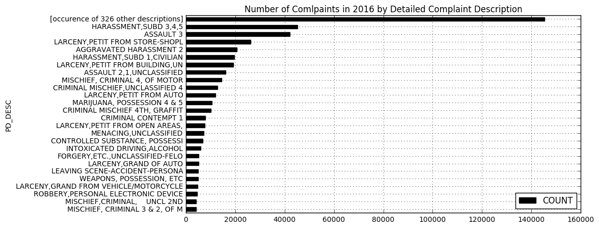


Displaying the sum of the top 25 complaint types of 2016 in the chart above, we can see that harasment complaints are the most common complaint, particulary the __HARASMENT,SUB 3,4,5__ type. This is followed by complaints about assault and larency. Other harasment types (__AGGRAVATED HARASSMENT 2__ or __HARASMENT,SUBD 1,CILIVIAN__) seem also very prominent complaint types. We can also see that there is very a long tail of 326 different complaint types. 

Furthermore, it looks like many complaint types are very detailled strings with the main type at the beginning and more detail after a comma. To reduce the complexity of this data set, we will only look at complaint type strings before the comma and sum all records with the same overall complaint type.


```python
# parse PD_DESC to only look at string before comma
fullData['PD_DESC_full'] = fullData['PD_DESC']
fullData['PD_DESC'] = fullData['PD_DESC'].str.split(',').str[0]
descriptionTypeCount = len(fullData['PD_DESC'].value_counts())
print('After simplifying complaint types, there are now ' + str(descriptionTypeCount) + ' diffreent description types in the data set')
descriptionAllTotals = pandas.DataFrame(fullData.groupby(['PD_DESC'])['COUNT'].sum())

#setting boundries for the chart
head = 25
tail = descriptionTypeCount - head

# combining all description that aren't in the top records
descriptionAllTotals = descriptionAllTotals.sort_values(['COUNT'], ascending=False)
descriptionTopTotals = descriptionAllTotals.head(head).reset_index()
otherDescriptionsAmount = descriptionAllTotals.tail(tail)['COUNT'].sum()
otherDescriptionsRow = pandas.DataFrame([['[occurence of '+str(tail)+' other descriptions]', otherDescriptionsAmount]], columns=['PD_DESC', 'COUNT'])
descriptionTotals = descriptionTopTotals.append(otherDescriptionsRow)

# plot the description amounts
plt.rcParams["figure.figsize"] = [10,5]
descriptionTotals = descriptionTotals.sort_values(['COUNT'], ascending=True)
descriptionTotals = descriptionTotals.set_index('PD_DESC')
descriptionTotals.plot.barh(facecolor='k');
plt.title('Number of Comlpaints in 2016 by Overall Complaint Description')
plt.grid()
```

    After simplifying complaint types, there are now 198 diffreent description types in the data set


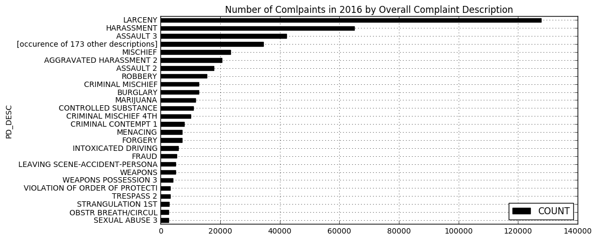


We can see now that Larceny is taken the top of the most commen overall complaint, followed by Harassment and Assault 3. We have summarised the 351 different complaint types into 198 overall complaint types.

Now let's look at the data points over time. Below we can see the daily, weekly, monthly and quarterly total amount of complaints, as well as each time aggregation's minimum, maximum, mean and average value.


```python
plt.rcParams["figure.figsize"] = [13,13]

# sum over date column
fullDataTimeSeries = pandas.DataFrame(fullData.groupby(['CMPLNT_FR_DT'])['COUNT'].sum()).reset_index()
fullDataTimeSeries = fullDataTimeSeries.sort_values(['CMPLNT_FR_DT'])
fullDataTimeSeries = fullDataTimeSeries.set_index(pandas.DatetimeIndex(fullDataTimeSeries['CMPLNT_FR_DT']))

timeAggs = ['D','W','M','Q']
i = 1

# display for several time aggregation methods
for timeAgg in timeAggs:
    aggregatedDataTimeSeries = fullDataTimeSeries.resample(timeAgg).sum()
    plt.subplot(6, 4, i)
    plt.tight_layout()
    plt.xticks(rotation=35)
    plt.title('Total Complaints every '+timeAgg)
    plt.plot(aggregatedDataTimeSeries, 'm-')
    plt.grid()
    plt.ylim(ymin=0)
    plt.subplot(6, 4, i+4)
    plt.tight_layout()
    plt.boxplot(aggregatedDataTimeSeries['COUNT'])
    plt.ylim(ymin=0)
    plt.title('Min:'+str('%.2f' % aggregatedDataTimeSeries.min().COUNT)+' Max:'+str('%.2f' % aggregatedDataTimeSeries.max().COUNT)+'\nMean: '+str('%.2f' % aggregatedDataTimeSeries.mean().COUNT)+' Median: '+str('%.2f' % aggregatedDataTimeSeries.median().COUNT))
    plt.grid()
    i+=1
```


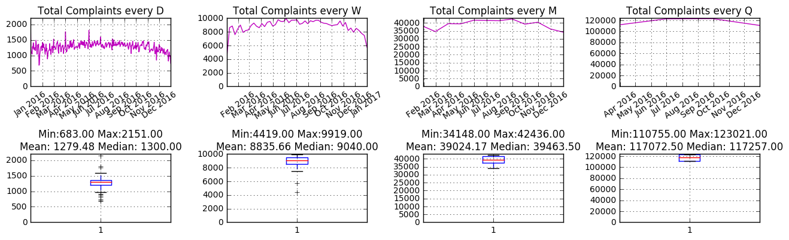


It looks like complaints are slightly elevated during the summer months. In the daily pattern we can see a low of complaints during January and two spikes on the beginning of April and June.

Let's have a closer look at the number of daily complaints below:


```python
plt.rcParams["figure.figsize"] = [13,3]
plt.title('Total Complaints every Day')
plt.plot(fullDataTimeSeries.resample('D').sum(), 'mo')
```


    [<matplotlib.lines.Line2D at 0x10a8676d8>]


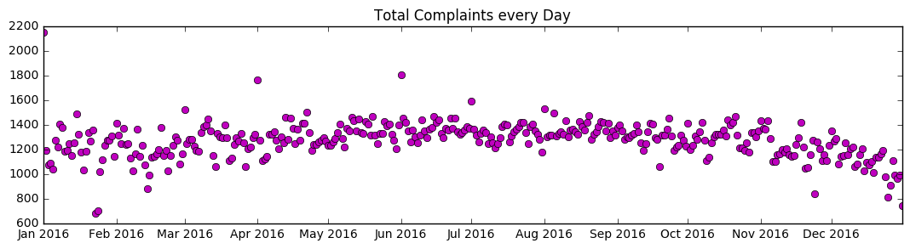


The largest amount of reported incidents on one day was on January the 1st, which is most likely related to New Year's Eve. There also appears to be high of reported incidents at the first day of certain, such as March, April, June and July. 
The lowest reported incidents happened between January 23rd and 24th, while the was blizzard in New York. We can also observe a lower number of reported incidents during the end of November, most likely related to Thanksgiving.

Below, we are looking closer at the numbers for each New York Borough.


```python
plt.rcParams["figure.figsize"] = [13,13]

# sum over date column by each borough
fullDataTimeSeries = pandas.DataFrame(fullData.groupby(['CMPLNT_FR_DT','BORO_NM'])['COUNT'].sum()).reset_index()
fullDataTimeSeries = fullDataTimeSeries.sort_values(['CMPLNT_FR_DT'])
fullDataTimeSeries = fullDataTimeSeries.set_index(pandas.DatetimeIndex(fullDataTimeSeries['CMPLNT_FR_DT']))
fullDataTimeSeries = fullDataTimeSeries.pivot(columns='BORO_NM')['COUNT']

timeAggs = ['D','W','M','Q']
i = 1

# display for several time aggregation methods
for timeAgg in timeAggs:
    aggregatedDataTimeSeries = fullDataTimeSeries.resample(timeAgg).sum()
    plt.subplot(6, 4, i)
    plt.tight_layout()
    plt.xticks(rotation=35)
    plt.title('Total Complaints every '+timeAgg)
    plt.plot(aggregatedDataTimeSeries['BRONX'], 'r-', label='BRONX')
    plt.plot(aggregatedDataTimeSeries['BROOKLYN'], 'b-', label='BROOKLYN')
    plt.plot(aggregatedDataTimeSeries['MANHATTAN'], 'k-', label='MANHATTAN')
    plt.plot(aggregatedDataTimeSeries['QUEENS'], 'y-', label='QUEENS')
    plt.plot(aggregatedDataTimeSeries['STATEN ISLAND'], 'g-', label='STATEN ISLAND')
    plt.legend(bbox_to_anchor=(0., 1.02, 1., .102), loc=3,
           ncol=2, borderaxespad=0., bbox_transform=plt.gcf().transFigure)
    plt.grid()
    plt.ylim(ymin=0)
    i+=1
```


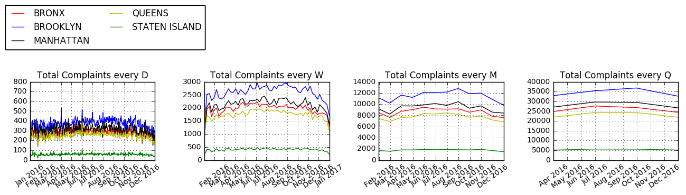


```python
plt.rcParams["figure.figsize"] = [13,3]
aggregatedDataTimeSeries = fullDataTimeSeries.resample('D').sum()
plt.title('Total Complaints every Day by NY Borough'+timeAgg)
plt.plot(aggregatedDataTimeSeries['BRONX'], 'ro', label='BRONX')
plt.plot(aggregatedDataTimeSeries['BROOKLYN'], 'bo', label='BROOKLYN')
plt.plot(aggregatedDataTimeSeries['MANHATTAN'], 'ko', label='MANHATTAN')
plt.plot(aggregatedDataTimeSeries['QUEENS'], 'yo', label='QUEENS')
plt.plot(aggregatedDataTimeSeries['STATEN ISLAND'], 'go', label='STATEN ISLAND')
plt.legend(bbox_to_anchor=(0.1, 1.02, 0., .102), loc=3,
       ncol=2, borderaxespad=0., bbox_transform=plt.gcf().transFigure)
plt.grid()
plt.ylim(ymin=0)
```


    (0, 800.0)


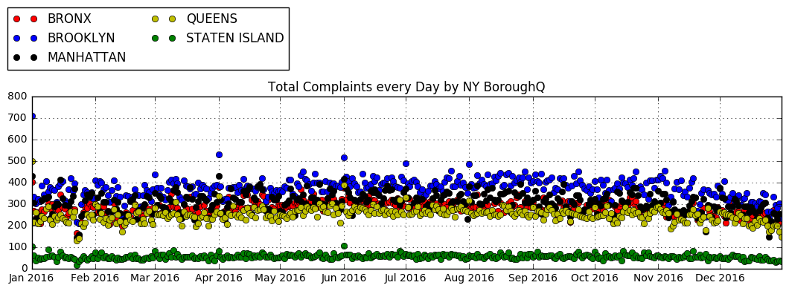


It appears all boroughs follow a similar trend.

In the small multiple charts below, we dig deeper into the monthly number of total complaints for the top 25 complaint types of the 198 simplified complaint strings in the data set. The charts also show by how much percent the complaints changed each month, as well as the minimum, maximum, mean and average of the total monthly amount for each complaint type.


```python
# get top 25 description types
descArr = descriptionAllTotals.reset_index()['PD_DESC'].tolist()
descArr = descArr[:25]

# set chart settings
plt.rcParams["figure.figsize"] = [13,len(descArr)*2]
plt.title('Monthly Total and % Change of Number of Harrasment Complaints per Reported Location')
i = 1

fullDataTimeSeries = pandas.DataFrame(fullData.groupby(['CMPLNT_FR_DT','BORO_NM','PD_DESC'])['COUNT'].sum()).reset_index()
fullDataTimeSeries = fullDataTimeSeries.sort_values(['CMPLNT_FR_DT'])
fullDataTimeSeries = fullDataTimeSeries.set_index(pandas.DatetimeIndex(fullDataTimeSeries['CMPLNT_FR_DT']))

# create chart row for each description type
for desc in descArr:
    tempDF = pandas.DataFrame(fullDataTimeSeries[(fullDataTimeSeries['PD_DESC'] == desc)]) 
    tempDF = tempDF.set_index(pandas.DatetimeIndex(tempDF['CMPLNT_FR_DT']))
    tempDF = tempDF.resample("M").sum()
    plt.subplot(len(descArr), 3, i)
    plt.tight_layout()
    plt.plot(tempDF, 'k.', tempDF, 'm-')
    plt.xticks(rotation=35)
    descTitle = desc[:25]
    plt.title('Total Monthly Complaints about\n'+descTitle)
    plt.ylim(ymin=0)
    plt.grid()
    plt.axhline(tempDF.COUNT.mean(), color='black', alpha=0.6)
    i+=1       
    plt.subplot(len(descArr), 3, i)
    plt.tight_layout()
    plt.boxplot(tempDF['COUNT'])
    plt.ylim(ymin=0)
    plt.title('Min:'+str('%.2f' % tempDF.min().COUNT)+' Max:'+str('%.2f' % tempDF.max().COUNT)+'\nMean: '+str('%.2f' % tempDF.mean().COUNT)+' Median: '+str('%.2f' % tempDF.median().COUNT))
    plt.grid()
    i+=1
    tempDF = tempDF.pct_change();
    ax = plt.subplot(len(descArr), 3, i)
    plt.plot(tempDF, 'bs', tempDF, 'b-', markersize=5)
    plt.xticks(rotation=35)
    plt.tight_layout()
    plt.title('Monthly %Change Complaints about\n'+descTitle)
    plt.grid()
    plt.axhline(0, color='black')
    plt.axhline(tempDF.COUNT.mean(), color='blue', alpha=0.3)
    plt.axhline(0, color='black', alpha=0.2)
    vals = ax.get_yticks()
    ax.set_yticklabels(['{:3.2f}%'.format(x*100) for x in vals])
    i+=1
```


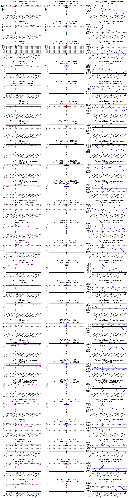


There are some interesting and also concerning trends for some complaint types. Further steps on this sould be to compare these time series with 2015 and the latest 2017 data.

### Digging deeper into a certain complaint type
Below we are looking closer at only a certain complaint type and breaking the data down by their reported location. We will break down the data in the same way as above. At the end of the report, there is also a map displaying the occurrences of each reported incident of the particular complaint type.


```python
PD_DESC_FILTER = 'ASSAULT' # change this string to see the data below displayed for any other complaint type

# filter data set on description filter
pdDescFilteredData = fullData[fullData['PD_DESC'].str.contains(PD_DESC_FILTER)==True].sort_values(['CMPLNT_FR_DT'])
print(str(len(pdDescFilteredData)) + ' records in the 2016 ' + PD_DESC_FILTER + ' data.')
```

    60028 records in the 2016 ASSAULT data.


```python
locationTypeCount = len(pdDescFilteredData['PREM_TYP_DESC'].value_counts())
print('There are ' + str(locationTypeCount) + ' diffreent location types in the data set')

pdDescFilteredDataTotals = pandas.DataFrame(pdDescFilteredData.groupby(['PREM_TYP_DESC'])['COUNT'].sum())

#setting boundries for the chart
head = 25
tail = locationTypeCount - head

# combining all location types that aren't in the top records
pdDescFilteredDataTotals = pdDescFilteredDataTotals.sort_values(['COUNT'], ascending=False)
pdDescFilteredDataTopTotals = pdDescFilteredDataTotals.head(25)
otherLocationAmount = pdDescFilteredDataTotals.tail(locationTypeCount-25)['COUNT'].sum()
otherLocationRow = pandas.DataFrame([['[occurence of '+str(tail)+' other locations]', otherLocationAmount]], columns=['PREM_TYP_DESC', 'COUNT']).set_index('PREM_TYP_DESC')
pdDescFilteredDataFilteredTotals = pdDescFilteredDataTopTotals.append(otherLocationRow)

# plot the location amounts
plt.rcParams["figure.figsize"] = [10,5]
pdDescFilteredDataFilteredTotals = pdDescFilteredDataFilteredTotals.sort_values(['COUNT'], ascending=True)
pdDescFilteredDataFilteredTotals.plot.barh(facecolor='r');
plt.title('Number of ' + PD_DESC_FILTER + ' Complaints in 2016 by Reported Location')
plt.grid()
```

    There are 66 diffreent location types in the data set


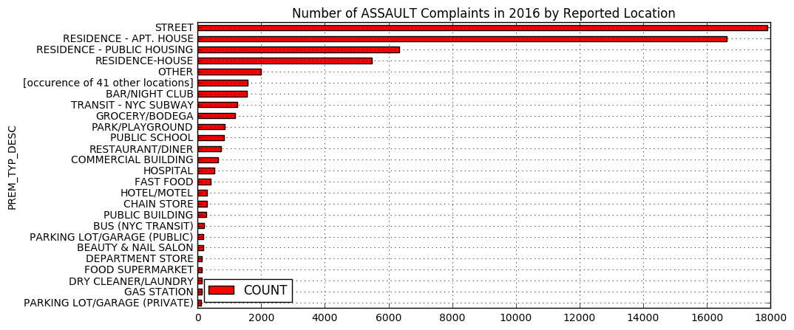


```python
plt.rcParams["figure.figsize"] = [13,13]

# sum over date column
pdDescFilteredDataTimeSeries = pandas.DataFrame(pdDescFilteredData.groupby(['CMPLNT_FR_DT'])['COUNT'].sum()).reset_index()
pdDescFilteredDataTimeSeries = pdDescFilteredDataTimeSeries.sort_values(['CMPLNT_FR_DT'])
pdDescFilteredDataTimeSeries = pdDescFilteredDataTimeSeries.set_index(pandas.DatetimeIndex(pdDescFilteredDataTimeSeries['CMPLNT_FR_DT']))

timeAggs = ['D','W','M','Q']
i = 1

# display for several time aggregation methods
for timeAgg in timeAggs:
    aggregatedpdDescFilteredDataTimeSeries = pdDescFilteredDataTimeSeries.resample(timeAgg).sum()
    plt.subplot(6, 4, i)
    plt.tight_layout()
    plt.xticks(rotation=35)
    plt.title('Total Complaints every '+timeAgg)
    plt.plot(aggregatedpdDescFilteredDataTimeSeries, 'r-')
    plt.grid()
    plt.subplot(6, 4, i+4)
    plt.tight_layout()
    plt.boxplot(aggregatedpdDescFilteredDataTimeSeries['COUNT'])
    plt.title('Min:'+str('%.2f' % aggregatedpdDescFilteredDataTimeSeries.min().COUNT)+' Max:'+str('%.2f' % aggregatedpdDescFilteredDataTimeSeries.max().COUNT)+'\nMean: '+str('%.2f' % aggregatedpdDescFilteredDataTimeSeries.mean().COUNT)+' Median: '+str('%.2f' % aggregatedpdDescFilteredDataTimeSeries.median().COUNT))
    plt.grid()
    i+=1
```


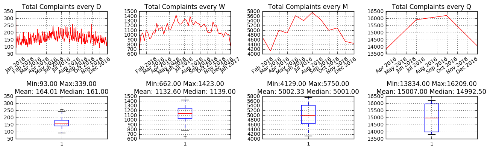


```python
plt.rcParams["figure.figsize"] = [13,13]

# sum over date column by borough
pdDescFilteredDataTimeSeries = pandas.DataFrame(pdDescFilteredData.groupby(['CMPLNT_FR_DT','BORO_NM'])['COUNT'].sum()).reset_index()
pdDescFilteredDataTimeSeries = pdDescFilteredDataTimeSeries.sort_values(['CMPLNT_FR_DT'])
pdDescFilteredDataTimeSeries = pdDescFilteredDataTimeSeries.set_index(pandas.DatetimeIndex(pdDescFilteredDataTimeSeries['CMPLNT_FR_DT']))
pdDescFilteredDataTimeSeries = pdDescFilteredDataTimeSeries.pivot(columns='BORO_NM')['COUNT']

# display for several time aggregation methods
timeAggs = ['D','W','M','Q']
i = 1

for timeAgg in timeAggs:
    aggregatedpdDescFilteredDataTimeSeries = pdDescFilteredDataTimeSeries.resample(timeAgg).sum()
    plt.subplot(6, 4, i)
    plt.tight_layout()
    plt.xticks(rotation=35)
    plt.title('Total Complaints every '+timeAgg)
    plt.plot(aggregatedpdDescFilteredDataTimeSeries['BRONX'], 'r-', label='BRONX')
    plt.plot(aggregatedpdDescFilteredDataTimeSeries['BROOKLYN'], 'b-', label='BROOKLYN')
    plt.plot(aggregatedpdDescFilteredDataTimeSeries['MANHATTAN'], 'k-', label='MANHATTAN')
    plt.plot(aggregatedpdDescFilteredDataTimeSeries['QUEENS'], 'y-', label='QUEENS')
    plt.plot(aggregatedpdDescFilteredDataTimeSeries['STATEN ISLAND'], 'g-', label='STATEN ISLAND')
    plt.legend(bbox_to_anchor=(0., 1.02, 1., .102), loc=3,
           ncol=2, borderaxespad=0., bbox_transform=plt.gcf().transFigure)
    plt.grid()
    i+=1
```


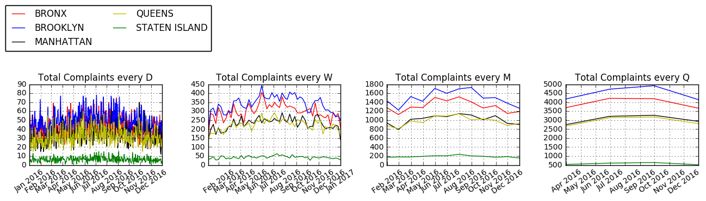


```python
# get top 25 location description
pdDescFilteredDataTimeSeries = pandas.DataFrame(pdDescFilteredData.groupby(['CMPLNT_FR_DT','PREM_TYP_DESC'])['COUNT'].sum()).reset_index()
descArr = pdDescFilteredDataTotals.reset_index()['PREM_TYP_DESC'].tolist()
descArr = descArr[:25]

# set chart settings
plt.rcParams["figure.figsize"] = [13,len(descArr)*2]
plt.title('Monthly Total and % Change of Number of Harrasment Complaints per Reported Location')
i = 1

# create chart row for each description type
for desc in descArr:
    tempDF = pandas.DataFrame(pdDescFilteredDataTimeSeries[(pdDescFilteredDataTimeSeries['PREM_TYP_DESC'] == desc)]) 
    tempDF = tempDF.set_index(pandas.DatetimeIndex(tempDF['CMPLNT_FR_DT']))
    tempDF = tempDF.resample("M").sum()
    plt.subplot(len(descArr), 3, i)
    plt.tight_layout()
    plt.plot(tempDF, 'k.', tempDF, 'r-')
    plt.xticks(rotation=35)
    plt.title('Total Monthly Complaints at\n'+desc)
    plt.ylim(ymin=0)
    plt.grid()
    plt.axhline(tempDF.COUNT.mean(), color='red', alpha=0.6)
    i+=1       
    plt.subplot(len(descArr), 3, i)
    plt.tight_layout()
    plt.boxplot(tempDF['COUNT'])
    plt.title('Min:'+str('%.2f' % tempDF.min().COUNT)+' Max:'+str('%.2f' % tempDF.max().COUNT)+'\nMean: '+str('%.2f' % tempDF.mean().COUNT)+' Median: '+str('%.2f' % tempDF.median().COUNT))
    plt.grid()
    plt.ylim(ymin=0)
    i+=1
    tempDF = tempDF.pct_change();
    ax = plt.subplot(len(descArr), 3, i)
    plt.plot(tempDF, 'bs', tempDF, 'b-', markersize=5)
    plt.xticks(rotation=35)
    plt.tight_layout()
    plt.title('Monthly %Change Complaints at\n'+desc)
    plt.grid()
    plt.axhline(0, color='black')
    plt.axhline(tempDF.COUNT.mean(), color='blue', alpha=0.3)
    vals = ax.get_yticks()
    ax.set_yticklabels(['{:3.2f}%'.format(x*100) for x in vals])
    i+=1
```


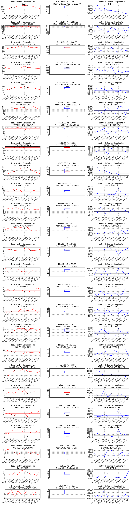


```python
print(str('Locations of reported occurrences of ' + PD_DESC_FILTER + ' incidents:'))

pdDescLocationFilteredData = pandas.DataFrame(pdDescFilteredData.groupby(['Latitude','Longitude'])['COUNT'].sum())
pdDescLocationFilteredData = pdDescLocationFilteredData.reset_index()
pdDescLocationFilteredData = pdDescLocationFilteredData.round(2)
pdDescLocationFilteredData = pandas.DataFrame(pdDescLocationFilteredData.groupby(['Latitude','Longitude'])['COUNT'].sum())
pdDescLocationFilteredData = pdDescLocationFilteredData.reset_index()

map_2 = folium.Map(location=[40.729771, -73.997263], tiles='Stamen Toner', zoom_start=11)
lat_list = pdDescLocationFilteredData['Latitude'].tolist()
lon_list = pdDescLocationFilteredData['Longitude'].tolist()
con_list = pdDescLocationFilteredData['COUNT'].tolist()

for i in range(0, len(lat_list)):
    folium.CircleMarker(
        location=[lat_list[i],lon_list[i]], 
        radius=con_list[i], 
        color='#8B0000', 
        fill_color='#8B0000'
    ).add_to(map_2)       

map_2
```

    Locations of reported occurrences of ASSAULT incidents:


<div style="width:100%;"><div style="position:relative;width:100%;height:0;padding-bottom:60%;"><iframe src="data:text/html;base64,CiAgICAgICAgPCFET0NUWVBFIGh0bWw+CiAgICAgICAgPGhlYWQ+CiAgICAgICAgICAgIAogICAgICAgIAogICAgICAgICAgICA8bWV0YSBodHRwLWVxdWl2PSJjb250ZW50LXR5cGUiIGNvbnRlbnQ9InRleHQvaHRtbDsgY2hhcnNldD1VVEYtOCIgLz4KICAgICAgICAKICAgICAgICAgICAgCiAgICAgICAgCiAgICAgICAgICAgIDxzY3JpcHQgc3JjPSJodHRwczovL2NkbmpzLmNsb3VkZmxhcmUuY29tL2FqYXgvbGlicy9sZWFmbGV0LzAuNy4zL2xlYWZsZXQuanMiPjwvc2NyaXB0PgogICAgICAgIAogICAgICAgIAogICAgICAgIAogICAgICAgICAgICAKICAgICAgICAKICAgICAgICAgICAgPHNjcmlwdCBzcmM9Imh0dHBzOi8vYWpheC5nb29nbGVhcGlzLmNvbS9hamF4L2xpYnMvanF1ZXJ5LzEuMTEuMS9qcXVlcnkubWluLmpzIj48L3NjcmlwdD4KICAgICAgICAKICAgICAgICAKICAgICAgICAKICAgICAgICAgICAgCiAgICAgICAgCiAgICAgICAgICAgIDxzY3JpcHQgc3JjPSJodHRwczovL21heGNkbi5ib290c3RyYXBjZG4uY29tL2Jvb3RzdHJhcC8zLjIuMC9qcy9ib290c3RyYXAubWluLmpzIj48L3NjcmlwdD4KICAgICAgICAKICAgICAgICAKICAgICAgICAKICAgICAgICAgICAgCiAgICAgICAgCiAgICAgICAgICAgIDxzY3JpcHQgc3JjPSJodHRwczovL2NkbmpzLmNsb3VkZmxhcmUuY29tL2FqYXgvbGlicy9MZWFmbGV0LmF3ZXNvbWUtbWFya2Vycy8yLjAuMi9sZWFmbGV0LmF3ZXNvbWUtbWFya2Vycy5taW4uanMiPjwvc2NyaXB0PgogICAgICAgIAogICAgICAgIAogICAgICAgIAogICAgICAgICAgICAKICAgICAgICAKICAgICAgICAgICAgPHNjcmlwdCBzcmM9Imh0dHBzOi8vY2RuanMuY2xvdWRmbGFyZS5jb20vYWpheC9saWJzL2xlYWZsZXQubWFya2VyY2x1c3Rlci8wLjQuMC9sZWFmbGV0Lm1hcmtlcmNsdXN0ZXItc3JjLmpzIj48L3NjcmlwdD4KICAgICAgICAKICAgICAgICAKICAgICAgICAKICAgICAgICAgICAgCiAgICAgICAgCiAgICAgICAgICAgIDxzY3JpcHQgc3JjPSJodHRwczovL2NkbmpzLmNsb3VkZmxhcmUuY29tL2FqYXgvbGlicy9sZWFmbGV0Lm1hcmtlcmNsdXN0ZXIvMC40LjAvbGVhZmxldC5tYXJrZXJjbHVzdGVyLmpzIj48L3NjcmlwdD4KICAgICAgICAKICAgICAgICAKICAgICAgICAKICAgICAgICAgICAgCiAgICAgICAgCiAgICAgICAgICAgIDxsaW5rIHJlbD0ic3R5bGVzaGVldCIgaHJlZj0iaHR0cHM6Ly9jZG5qcy5jbG91ZGZsYXJlLmNvbS9hamF4L2xpYnMvbGVhZmxldC8wLjcuMy9sZWFmbGV0LmNzcyIgLz4KICAgICAgICAKICAgICAgICAKICAgICAgICAKICAgICAgICAgICAgCiAgICAgICAgCiAgICAgICAgICAgIDxsaW5rIHJlbD0ic3R5bGVzaGVldCIgaHJlZj0iaHR0cHM6Ly9tYXhjZG4uYm9vdHN0cmFwY2RuLmNvbS9ib290c3RyYXAvMy4yLjAvY3NzL2Jvb3RzdHJhcC5taW4uY3NzIiAvPgogICAgICAgIAogICAgICAgIAogICAgICAgIAogICAgICAgICAgICAKICAgICAgICAKICAgICAgICAgICAgPGxpbmsgcmVsPSJzdHlsZXNoZWV0IiBocmVmPSJodHRwczovL21heGNkbi5ib290c3RyYXBjZG4uY29tL2Jvb3RzdHJhcC8zLjIuMC9jc3MvYm9vdHN0cmFwLXRoZW1lLm1pbi5jc3MiIC8+CiAgICAgICAgCiAgICAgICAgCiAgICAgICAgCiAgICAgICAgICAgIAogICAgICAgIAogICAgICAgICAgICA8bGluayByZWw9InN0eWxlc2hlZXQiIGhyZWY9Imh0dHBzOi8vbWF4Y2RuLmJvb3RzdHJhcGNkbi5jb20vZm9udC1hd2Vzb21lLzQuMS4wL2Nzcy9mb250LWF3ZXNvbWUubWluLmNzcyIgLz4KICAgICAgICAKICAgICAgICAKICAgICAgICAKICAgICAgICAgICAgCiAgICAgICAgCiAgICAgICAgICAgIDxsaW5rIHJlbD0ic3R5bGVzaGVldCIgaHJlZj0iaHR0cHM6Ly9jZG5qcy5jbG91ZGZsYXJlLmNvbS9hamF4L2xpYnMvTGVhZmxldC5hd2Vzb21lLW1hcmtlcnMvMi4wLjIvbGVhZmxldC5hd2Vzb21lLW1hcmtlcnMuY3NzIiAvPgogICAgICAgIAogICAgICAgIAogICAgICAgIAogICAgICAgICAgICAKICAgICAgICAKICAgICAgICAgICAgPGxpbmsgcmVsPSJzdHlsZXNoZWV0IiBocmVmPSJodHRwczovL2NkbmpzLmNsb3VkZmxhcmUuY29tL2FqYXgvbGlicy9sZWFmbGV0Lm1hcmtlcmNsdXN0ZXIvMC40LjAvTWFya2VyQ2x1c3Rlci5EZWZhdWx0LmNzcyIgLz4KICAgICAgICAKICAgICAgICAKICAgICAgICAKICAgICAgICAgICAgCiAgICAgICAgCiAgICAgICAgICAgIDxsaW5rIHJlbD0ic3R5bGVzaGVldCIgaHJlZj0iaHR0cHM6Ly9jZG5qcy5jbG91ZGZsYXJlLmNvbS9hamF4L2xpYnMvbGVhZmxldC5tYXJrZXJjbHVzdGVyLzAuNC4wL01hcmtlckNsdXN0ZXIuY3NzIiAvPgogICAgICAgIAogICAgICAgIAogICAgICAgIAogICAgICAgICAgICAKICAgICAgICAKICAgICAgICAgICAgPGxpbmsgcmVsPSJzdHlsZXNoZWV0IiBocmVmPSJodHRwczovL3Jhdy5naXRodWJ1c2VyY29udGVudC5jb20vcHl0aG9uLXZpc3VhbGl6YXRpb24vZm9saXVtL21hc3Rlci9mb2xpdW0vdGVtcGxhdGVzL2xlYWZsZXQuYXdlc29tZS5yb3RhdGUuY3NzIiAvPgogICAgICAgIAogICAgICAgIAogICAgICAgIAogICAgICAgICAgICAKICAgICAgICAgICAgPHN0eWxlPgoKICAgICAgICAgICAgaHRtbCwgYm9keSB7CiAgICAgICAgICAgICAgICB3aWR0aDogMTAwJTsKICAgICAgICAgICAgICAgIGhlaWdodDogMTAwJTsKICAgICAgICAgICAgICAgIG1hcmdpbjogMDsKICAgICAgICAgICAgICAgIHBhZGRpbmc6IDA7CiAgICAgICAgICAgICAgICB9CgogICAgICAgICAgICAjbWFwIHsKICAgICAgICAgICAgICAgIHBvc2l0aW9uOmFic29sdXRlOwogICAgICAgICAgICAgICAgdG9wOjA7CiAgICAgICAgICAgICAgICBib3R0b206MDsKICAgICAgICAgICAgICAgIHJpZ2h0OjA7CiAgICAgICAgICAgICAgICBsZWZ0OjA7CiAgICAgICAgICAgICAgICB9CiAgICAgICAgICAgIDwvc3R5bGU+CiAgICAgICAgICAgIAogICAgICAgIAogICAgICAgICAgICAKICAgICAgICAgICAgPHN0eWxlPiAjbWFwX2YwOTE3M2E3YjQ4NTRhMDFiM2RmNTlmMmY4MTQ2YzBiIHsKICAgICAgICAgICAgICAgIHBvc2l0aW9uIDogcmVsYXRpdmU7CiAgICAgICAgICAgICAgICB3aWR0aCA6IDEwMC4wJTsKICAgICAgICAgICAgICAgIGhlaWdodDogMTAwLjAlOwogICAgICAgICAgICAgICAgbGVmdDogMC4wJTsKICAgICAgICAgICAgICAgIHRvcDogMC4wJTsKICAgICAgICAgICAgICAgIH0KICAgICAgICAgICAgPC9zdHlsZT4KICAgICAgICAKICAgICAgICAKICAgICAgICAKICAgICAgICA8L2hlYWQ+CiAgICAgICAgPGJvZHk+CiAgICAgICAgICAgIAogICAgICAgIAogICAgICAgICAgICAKICAgICAgICAgICAgPGRpdiBjbGFzcz0iZm9saXVtLW1hcCIgaWQ9Im1hcF9mMDkxNzNhN2I0ODU0YTAxYjNkZjU5ZjJmODE0NmMwYiIgPjwvZGl2PgogICAgICAgIAogICAgICAgIAogICAgICAgIAogICAgICAgIDwvYm9keT4KICAgICAgICA8c2NyaXB0PgogICAgICAgICAgICAKICAgICAgICAKICAgICAgICAgICAgCgogICAgICAgICAgICB2YXIgc291dGhXZXN0ID0gTC5sYXRMbmcoLTkwLCAtMTgwKTsKICAgICAgICAgICAgdmFyIG5vcnRoRWFzdCA9IEwubGF0TG5nKDkwLCAxODApOwogICAgICAgICAgICB2YXIgYm91bmRzID0gTC5sYXRMbmdCb3VuZHMoc291dGhXZXN0LCBub3J0aEVhc3QpOwoKICAgICAgICAgICAgdmFyIG1hcF9mMDkxNzNhN2I0ODU0YTAxYjNkZjU5ZjJmODE0NmMwYiA9IEwubWFwKCdtYXBfZjA5MTczYTdiNDg1NGEwMWIzZGY1OWYyZjgxNDZjMGInLCB7CiAgICAgICAgICAgICAgICAgICAgICAgICAgICAgICAgICAgICAgICAgICBjZW50ZXI6WzQwLjcyOTc3MSwtNzMuOTk3MjYzXSwKICAgICAgICAgICAgICAgICAgICAgICAgICAgICAgICAgICAgICAgICAgIHpvb206IDExLAogICAgICAgICAgICAgICAgICAgICAgICAgICAgICAgICAgICAgICAgICAgbWF4Qm91bmRzOiBib3VuZHMsCiAgICAgICAgICAgICAgICAgICAgICAgICAgICAgICAgICAgICAgICAgICBsYXllcnM6IFtdLAogICAgICAgICAgICAgICAgICAgICAgICAgICAgICAgICAgICAgICAgICAgY3JzOiBMLkNSUy5FUFNHMzg1NwogICAgICAgICAgICAgICAgICAgICAgICAgICAgICAgICAgICAgICAgIH0pOwogICAgICAgICAgICAKICAgICAgICAKICAgICAgICAKICAgICAgICAgICAgCiAgICAgICAgICAgIHZhciB0aWxlX2xheWVyXzkzMWY0Yjg1MTM2ZDQwMDViYjViNzczMmI3NTk5NTRlID0gTC50aWxlTGF5ZXIoCiAgICAgICAgICAgICAgICAnaHR0cHM6Ly9zdGFtZW4tdGlsZXMte3N9LmEuc3NsLmZhc3RseS5uZXQvdG9uZXIve3p9L3t4fS97eX0ucG5nJywKICAgICAgICAgICAgICAgIHsKICAgICAgICAgICAgICAgICAgICBtYXhab29tOiAxOCwKICAgICAgICAgICAgICAgICAgICBtaW5ab29tOiAxLAogICAgICAgICAgICAgICAgICAgIGF0dHJpYnV0aW9uOiAnTWFwIHRpbGVzIGJ5IDxhIGhyZWY9Imh0dHA6Ly9zdGFtZW4uY29tIj5TdGFtZW4gRGVzaWduPC9hPiwgdW5kZXIgPGEgaHJlZj0iaHR0cDovL2NyZWF0aXZlY29tbW9ucy5vcmcvbGljZW5zZXMvYnkvMy4wIj5DQyBCWSAzLjA8L2E+LiBEYXRhIGJ5IDxhIGhyZWY9Imh0dHA6Ly9vcGVuc3RyZWV0bWFwLm9yZyI+T3BlblN0cmVldE1hcDwvYT4sIHVuZGVyIDxhIGhyZWY9Imh0dHA6Ly93d3cub3BlbnN0cmVldG1hcC5vcmcvY29weXJpZ2h0Ij5PRGJMPC9hPi4nLAogICAgICAgICAgICAgICAgICAgIGRldGVjdFJldGluYTogZmFsc2UKICAgICAgICAgICAgICAgICAgICB9CiAgICAgICAgICAgICAgICApLmFkZFRvKG1hcF9mMDkxNzNhN2I0ODU0YTAxYjNkZjU5ZjJmODE0NmMwYik7CgogICAgICAgIAogICAgICAgIAogICAgICAgICAgICAKCiAgICAgICAgICAgIHZhciBjaXJjbGVfbWFya2VyX2VlMGQ0MjEyNDM2ODQyMmRiMmIwZTg5YjZhYWQ4NWZmID0gTC5jaXJjbGUoCiAgICAgICAgICAgICAgICBbNDAuNSwtNzQuMjVdLAogICAgICAgICAgICAgICAgMSwKICAgICAgICAgICAgICAgIHsKICAgICAgICAgICAgICAgICAgICBjb2xvcjogJyM4QjAwMDAnLAogICAgICAgICAgICAgICAgICAgIGZpbGxDb2xvcjogJyM4QjAwMDAnLAogICAgICAgICAgICAgICAgICAgIGZpbGxPcGFjaXR5OiAwLjYKICAgICAgICAgICAgICAgICAgICB9CiAgICAgICAgICAgICAgICApCiAgICAgICAgICAgICAgICAuYWRkVG8obWFwX2YwOTE3M2E3YjQ4NTRhMDFiM2RmNTlmMmY4MTQ2YzBiKTsKICAgICAgICAgICAgCiAgICAgICAgCiAgICAgICAgICAgIAoKICAgICAgICAgICAgdmFyIGNpcmNsZV9tYXJrZXJfNDMxYWRlODQzNzkwNGEwNTlmMjJlOWEzNWVlN2Q4NTYgPSBMLmNpcmNsZSgKICAgICAgICAgICAgICAgIFs0MC41LC03NC4yNF0sCiAgICAgICAgICAgICAgICAzLAogICAgICAgICAgICAgICAgewogICAgICAgICAgICAgICAgICAgIGNvbG9yOiAnIzhCMDAwMCcsCiAgICAgICAgICAgICAgICAgICAgZmlsbENvbG9yOiAnIzhCMDAwMCcsCiAgICAgICAgICAgICAgICAgICAgZmlsbE9wYWNpdHk6IDAuNgogICAgICAgICAgICAgICAgICAgIH0KICAgICAgICAgICAgICAgICkKICAgICAgICAgICAgICAgIC5hZGRUbyhtYXBfZjA5MTczYTdiNDg1NGEwMWIzZGY1OWYyZjgxNDZjMGIpOwogICAgICAgICAgICAKICAgICAgICAKICAgICAgICAgICAgCgogICAgICAgICAgICB2YXIgY2lyY2xlX21hcmtlcl9mZjY2YTk2ZjA3MzY0Zjg5YjIzNTc4YWI2MzM4NTliNyA9IEwuY2lyY2xlKAogICAgICAgICAgICAgICAgWzQwLjUsLTc0LjIzXSwKICAgICAgICAgICAgICAgIDIsCiAgICAgICAgICAgICAgICB7CiAgICAgICAgICAgICAgICAgICAgY29sb3I6ICcjOEIwMDAwJywKICAgICAgICAgICAgICAgICAgICBmaWxsQ29sb3I6ICcjOEIwMDAwJywKICAgICAgICAgICAgICAgICAgICBmaWxsT3BhY2l0eTogMC42CiAgICAgICAgICAgICAgICAgICAgfQogICAgICAgICAgICAgICAgKQogICAgICAgICAgICAgICAgLmFkZFRvKG1hcF9mMDkxNzNhN2I0ODU0YTAxYjNkZjU5ZjJmODE0NmMwYik7CiAgICAgICAgICAgIAogICAgICAgIAogICAgICAgICAgICAKCiAgICAgICAgICAgIHZhciBjaXJjbGVfbWFya2VyX2E3ZjVlMjNiZjk0YTQ1NjViMTA1YTczNmNiNGE4YmUwID0gTC5jaXJjbGUoCiAgICAgICAgICAgICAgICBbNDAuNTEsLTc0LjI1XSwKICAgICAgICAgICAgICAgIDM2LAogICAgICAgICAgICAgICAgewogICAgICAgICAgICAgICAgICAgIGNvbG9yOiAnIzhCMDAwMCcsCiAgICAgICAgICAgICAgICAgICAgZmlsbENvbG9yOiAnIzhCMDAwMCcsCiAgICAgICAgICAgICAgICAgICAgZmlsbE9wYWNpdHk6IDAuNgogICAgICAgICAgICAgICAgICAgIH0KICAgICAgICAgICAgICAgICkKICAgICAgICAgICAgICAgIC5hZGRUbyhtYXBfZjA5MTczYTdiNDg1NGEwMWIzZGY1OWYyZjgxNDZjMGIpOwogICAgICAgICAgICAKICAgICAgICAKICAgICAgICAgICAgCgogICAgICAgICAgICB2YXIgY2lyY2xlX21hcmtlcl80ZjllZGVmNGI5NTQ0NTM0ODMzNDI3MTZkZjYwY2RjZCA9IEwuY2lyY2xlKAogICAgICAgICAgICAgICAgWzQwLjUxLC03NC4yNF0sCiAgICAgICAgICAgICAgICA3LAogICAgICAgICAgICAgICAgewogICAgICAgICAgICAgICAgICAgIGNvbG9yOiAnIzhCMDAwMCcsCiAgICAgICAgICAgICAgICAgICAgZmlsbENvbG9yOiAnIzhCMDAwMCcsCiAgICAgICAgICAgICAgICAgICAgZmlsbE9wYWNpdHk6IDAuNgogICAgICAgICAgICAgICAgICAgIH0KICAgICAgICAgICAgICAgICkKICAgICAgICAgICAgICAgIC5hZGRUbyhtYXBfZjA5MTczYTdiNDg1NGEwMWIzZGY1OWYyZjgxNDZjMGIpOwogICAgICAgICAgICAKICAgICAgICAKICAgICAgICAgICAgCgogICAgICAgICAgICB2YXIgY2lyY2xlX21hcmtlcl9jMzU2YmYwNDM0MWE0Njc4ODVmZjZhM2JjMTIxODFiMiA9IEwuY2lyY2xlKAogICAgICAgICAgICAgICAgWzQwLjUxLC03NC4yMl0sCiAgICAgICAgICAgICAgICAxLAogICAgICAgICAgICAgICAgewogICAgICAgICAgICAgICAgICAgIGNvbG9yOiAnIzhCMDAwMCcsCiAgICAgICAgICAgICAgICAgICAgZmlsbENvbG9yOiAnIzhCMDAwMCcsCiAgICAgICAgICAgICAgICAgICAgZmlsbE9wYWNpdHk6IDAuNgogICAgICAgICAgICAgICAgICAgIH0KICAgICAgICAgICAgICAgICkKICAgICAgICAgICAgICAgIC5hZGRUbyhtYXBfZjA5MTczYTdiNDg1NGEwMWIzZGY1OWYyZjgxNDZjMGIpOwogICAgICAgICAgICAKICAgICAgICAKICAgICAgICAgICAgCgogICAgICAgICAgICB2YXIgY2lyY2xlX21hcmtlcl82MjA3MmIzMGNkNGM0ODlkYWQyOTZlMTE3NDUyZWU2ZiA9IEwuY2lyY2xlKAogICAgICAgICAgICAgICAgWzQwLjUyLC03NC4yNF0sCiAgICAgICAgICAgICAgICA0LAogICAgICAgICAgICAgICAgewogICAgICAgICAgICAgICAgICAgIGNvbG9yOiAnIzhCMDAwMCcsCiAgICAgICAgICAgICAgICAgICAgZmlsbENvbG9yOiAnIzhCMDAwMCcsCiAgICAgICAgICAgICAgICAgICAgZmlsbE9wYWNpdHk6IDAuNgogICAgICAgICAgICAgICAgICAgIH0KICAgICAgICAgICAgICAgICkKICAgICAgICAgICAgICAgIC5hZGRUbyhtYXBfZjA5MTczYTdiNDg1NGEwMWIzZGY1OWYyZjgxNDZjMGIpOwogICAgICAgICAgICAKICAgICAgICAKICAgICAgICAgICAgCgogICAgICAgICAgICB2YXIgY2lyY2xlX21hcmtlcl9iM2Q5OTQ3MzFjMzc0NGJlYjY4NmY2ZGU0ZWUxZjhkOSA9IEwuY2lyY2xlKAogICAgICAgICAgICAgICAgWzQwLjUyLC03NC4yM10sCiAgICAgICAgICAgICAgICA4LAogICAgICAgICAgICAgICAgewogICAgICAgICAgICAgICAgICAgIGNvbG9yOiAnIzhCMDAwMCcsCiAgICAgICAgICAgICAgICAgICAgZmlsbENvbG9yOiAnIzhCMDAwMCcsCiAgICAgICAgICAgICAgICAgICAgZmlsbE9wYWNpdHk6IDAuNgogICAgICAgICAgICAgICAgICAgIH0KICAgICAgICAgICAgICAgICkKICAgICAgICAgICAgICAgIC5hZGRUbyhtYXBfZjA5MTczYTdiNDg1NGEwMWIzZGY1OWYyZjgxNDZjMGIpOwogICAgICAgICAgICAKICAgICAgICAKICAgICAgICAgICAgCgogICAgICAgICAgICB2YXIgY2lyY2xlX21hcmtlcl9jZjQzNGQ0NmU3NDc0ZTU2YTk5ZGU4NzliNWI1MWZlMyA9IEwuY2lyY2xlKAogICAgICAgICAgICAgICAgWzQwLjUyLC03NC4yMl0sCiAgICAgICAgICAgICAgICA0LAogICAgICAgICAgICAgICAgewogICAgICAgICAgICAgICAgICAgIGNvbG9yOiAnIzhCMDAwMCcsCiAgICAgICAgICAgICAgICAgICAgZmlsbENvbG9yOiAnIzhCMDAwMCcsCiAgICAgICAgICAgICAgICAgICAgZmlsbE9wYWNpdHk6IDAuNgogICAgICAgICAgICAgICAgICAgIH0KICAgICAgICAgICAgICAgICkKICAgICAgICAgICAgICAgIC5hZGRUbyhtYXBfZjA5MTczYTdiNDg1NGEwMWIzZGY1OWYyZjgxNDZjMGIpOwogICAgICAgICAgICAKICAgICAgICAKICAgICAgICAgICAgCgogICAgICAgICAgICB2YXIgY2lyY2xlX21hcmtlcl8wODQwNjlkNmI5ODE0NTczYWMyZDU4NmM2MzM1MDNhZSA9IEwuY2lyY2xlKAogICAgICAgICAgICAgICAgWzQwLjUyLC03NC4yMV0sCiAgICAgICAgICAgICAgICAxLAogICAgICAgICAgICAgICAgewogICAgICAgICAgICAgICAgICAgIGNvbG9yOiAnIzhCMDAwMCcsCiAgICAgICAgICAgICAgICAgICAgZmlsbENvbG9yOiAnIzhCMDAwMCcsCiAgICAgICAgICAgICAgICAgICAgZmlsbE9wYWNpdHk6IDAuNgogICAgICAgICAgICAgICAgICAgIH0KICAgICAgICAgICAgICAgICkKICAgICAgICAgICAgICAgIC5hZGRUbyhtYXBfZjA5MTczYTdiNDg1NGEwMWIzZGY1OWYyZjgxNDZjMGIpOwogICAgICAgICAgICAKICAgICAgICAKICAgICAgICAgICAgCgogICAgICAgICAgICB2YXIgY2lyY2xlX21hcmtlcl9mOWU2ZTRmNmZjNDU0NjA4YjQ2NzhkMTlhMzdhYTkyOSA9IEwuY2lyY2xlKAogICAgICAgICAgICAgICAgWzQwLjUyLC03NC4yXSwKICAgICAgICAgICAgICAgIDExLAogICAgICAgICAgICAgICAgewogICAgICAgICAgICAgICAgICAgIGNvbG9yOiAnIzhCMDAwMCcsCiAgICAgICAgICAgICAgICAgICAgZmlsbENvbG9yOiAnIzhCMDAwMCcsCiAgICAgICAgICAgICAgICAgICAgZmlsbE9wYWNpdHk6IDAuNgogICAgICAgICAgICAgICAgICAgIH0KICAgICAgICAgICAgICAgICkKICAgICAgICAgICAgICAgIC5hZGRUbyhtYXBfZjA5MTczYTdiNDg1NGEwMWIzZGY1OWYyZjgxNDZjMGIpOwogICAgICAgICAgICAKICAgICAgICAKICAgICAgICAgICAgCgogICAgICAgICAgICB2YXIgY2lyY2xlX21hcmtlcl83NjhlYzkwZjQ4OTE0NjU1ODNkZmUzYzY3ZTU4MzI4NyA9IEwuY2lyY2xlKAogICAgICAgICAgICAgICAgWzQwLjUyLC03NC4xOV0sCiAgICAgICAgICAgICAgICAzLAogICAgICAgICAgICAgICAgewogICAgICAgICAgICAgICAgICAgIGNvbG9yOiAnIzhCMDAwMCcsCiAgICAgICAgICAgICAgICAgICAgZmlsbENvbG9yOiAnIzhCMDAwMCcsCiAgICAgICAgICAgICAgICAgICAgZmlsbE9wYWNpdHk6IDAuNgogICAgICAgICAgICAgICAgICAgIH0KICAgICAgICAgICAgICAgICkKICAgICAgICAgICAgICAgIC5hZGRUbyhtYXBfZjA5MTczYTdiNDg1NGEwMWIzZGY1OWYyZjgxNDZjMGIpOwogICAgICAgICAgICAKICAgICAgICAKICAgICAgICAgICAgCgogICAgICAgICAgICB2YXIgY2lyY2xlX21hcmtlcl9kZDdlOGUzNzFkMzg0NWEyOGE3NTU0NzZhODA2NmM2ZSA9IEwuY2lyY2xlKAogICAgICAgICAgICAgICAgWzQwLjUzLC03NC4yNF0sCiAgICAgICAgICAgICAgICAyLAogICAgICAgICAgICAgICAgewogICAgICAgICAgICAgICAgICAgIGNvbG9yOiAnIzhCMDAwMCcsCiAgICAgICAgICAgICAgICAgICAgZmlsbENvbG9yOiAnIzhCMDAwMCcsCiAgICAgICAgICAgICAgICAgICAgZmlsbE9wYWNpdHk6IDAuNgogICAgICAgICAgICAgICAgICAgIH0KICAgICAgICAgICAgICAgICkKICAgICAgICAgICAgICAgIC5hZGRUbyhtYXBfZjA5MTczYTdiNDg1NGEwMWIzZGY1OWYyZjgxNDZjMGIpOwogICAgICAgICAgICAKICAgICAgICAKICAgICAgICAgICAgCgogICAgICAgICAgICB2YXIgY2lyY2xlX21hcmtlcl8yYTg4MWYxNzBjMjU0NmFhOTU1YWRmMmU0ZGQ5MzFjMCA9IEwuY2lyY2xlKAogICAgICAgICAgICAgICAgWzQwLjUzLC03NC4yMl0sCiAgICAgICAgICAgICAgICAzLAogICAgICAgICAgICAgICAgewogICAgICAgICAgICAgICAgICAgIGNvbG9yOiAnIzhCMDAwMCcsCiAgICAgICAgICAgICAgICAgICAgZmlsbENvbG9yOiAnIzhCMDAwMCcsCiAgICAgICAgICAgICAgICAgICAgZmlsbE9wYWNpdHk6IDAuNgogICAgICAgICAgICAgICAgICAgIH0KICAgICAgICAgICAgICAgICkKICAgICAgICAgICAgICAgIC5hZGRUbyhtYXBfZjA5MTczYTdiNDg1NGEwMWIzZGY1OWYyZjgxNDZjMGIpOwogICAgICAgICAgICAKICAgICAgICAKICAgICAgICAgICAgCgogICAgICAgICAgICB2YXIgY2lyY2xlX21hcmtlcl84MmMxOGNkZGI0NzQ0OGI3Yjk3MDhkOGI5MTQ0ZjQ0ZCA9IEwuY2lyY2xlKAogICAgICAgICAgICAgICAgWzQwLjUzLC03NC4yMV0sCiAgICAgICAgICAgICAgICAyLAogICAgICAgICAgICAgICAgewogICAgICAgICAgICAgICAgICAgIGNvbG9yOiAnIzhCMDAwMCcsCiAgICAgICAgICAgICAgICAgICAgZmlsbENvbG9yOiAnIzhCMDAwMCcsCiAgICAgICAgICAgICAgICAgICAgZmlsbE9wYWNpdHk6IDAuNgogICAgICAgICAgICAgICAgICAgIH0KICAgICAgICAgICAgICAgICkKICAgICAgICAgICAgICAgIC5hZGRUbyhtYXBfZjA5MTczYTdiNDg1NGEwMWIzZGY1OWYyZjgxNDZjMGIpOwogICAgICAgICAgICAKICAgICAgICAKICAgICAgICAgICAgCgogICAgICAgICAgICB2YXIgY2lyY2xlX21hcmtlcl9kMzI5MTliYjA1MmE0YjI3YWNkYzJlMDU4MGUxYmI2MSA9IEwuY2lyY2xlKAogICAgICAgICAgICAgICAgWzQwLjUzLC03NC4yXSwKICAgICAgICAgICAgICAgIDMsCiAgICAgICAgICAgICAgICB7CiAgICAgICAgICAgICAgICAgICAgY29sb3I6ICcjOEIwMDAwJywKICAgICAgICAgICAgICAgICAgICBmaWxsQ29sb3I6ICcjOEIwMDAwJywKICAgICAgICAgICAgICAgICAgICBmaWxsT3BhY2l0eTogMC42CiAgICAgICAgICAgICAgICAgICAgfQogICAgICAgICAgICAgICAgKQogICAgICAgICAgICAgICAgLmFkZFRvKG1hcF9mMDkxNzNhN2I0ODU0YTAxYjNkZjU5ZjJmODE0NmMwYik7CiAgICAgICAgICAgIAogICAgICAgIAogICAgICAgICAgICAKCiAgICAgICAgICAgIHZhciBjaXJjbGVfbWFya2VyXzEwZjZiNGQ1NTNkODQ0ZjE5MDQ5ZDBiYTJjOTYxNGNiID0gTC5jaXJjbGUoCiAgICAgICAgICAgICAgICBbNDAuNTMsLTc0LjE5XSwKICAgICAgICAgICAgICAgIDksCiAgICAgICAgICAgICAgICB7CiAgICAgICAgICAgICAgICAgICAgY29sb3I6ICcjOEIwMDAwJywKICAgICAgICAgICAgICAgICAgICBmaWxsQ29sb3I6ICcjOEIwMDAwJywKICAgICAgICAgICAgICAgICAgICBmaWxsT3BhY2l0eTogMC42CiAgICAgICAgICAgICAgICAgICAgfQogICAgICAgICAgICAgICAgKQogICAgICAgICAgICAgICAgLmFkZFRvKG1hcF9mMDkxNzNhN2I0ODU0YTAxYjNkZjU5ZjJmODE0NmMwYik7CiAgICAgICAgICAgIAogICAgICAgIAogICAgICAgICAgICAKCiAgICAgICAgICAgIHZhciBjaXJjbGVfbWFya2VyXzEyZTY4MGMzY2U2MjQ2MjhiMTg3NDBiMjU4ZTViZDE0ID0gTC5jaXJjbGUoCiAgICAgICAgICAgICAgICBbNDAuNTMsLTc0LjE4XSwKICAgICAgICAgICAgICAgIDIsCiAgICAgICAgICAgICAgICB7CiAgICAgICAgICAgICAgICAgICAgY29sb3I6ICcjOEIwMDAwJywKICAgICAgICAgICAgICAgICAgICBmaWxsQ29sb3I6ICcjOEIwMDAwJywKICAgICAgICAgICAgICAgICAgICBmaWxsT3BhY2l0eTogMC42CiAgICAgICAgICAgICAgICAgICAgfQogICAgICAgICAgICAgICAgKQogICAgICAgICAgICAgICAgLmFkZFRvKG1hcF9mMDkxNzNhN2I0ODU0YTAxYjNkZjU5ZjJmODE0NmMwYik7CiAgICAgICAgICAgIAogICAgICAgIAogICAgICAgICAgICAKCiAgICAgICAgICAgIHZhciBjaXJjbGVfbWFya2VyXzBiY2NkYjlhMmJjMDRmOGE5ZjhiZjZhNTViNWFhMjg4ID0gTC5jaXJjbGUoCiAgICAgICAgICAgICAgICBbNDAuNTMsLTc0LjE3XSwKICAgICAgICAgICAgICAgIDIsCiAgICAgICAgICAgICAgICB7CiAgICAgICAgICAgICAgICAgICAgY29sb3I6ICcjOEIwMDAwJywKICAgICAgICAgICAgICAgICAgICBmaWxsQ29sb3I6ICcjOEIwMDAwJywKICAgICAgICAgICAgICAgICAgICBmaWxsT3BhY2l0eTogMC42CiAgICAgICAgICAgICAgICAgICAgfQogICAgICAgICAgICAgICAgKQogICAgICAgICAgICAgICAgLmFkZFRvKG1hcF9mMDkxNzNhN2I0ODU0YTAxYjNkZjU5ZjJmODE0NmMwYik7CiAgICAgICAgICAgIAogICAgICAgIAogICAgICAgICAgICAKCiAgICAgICAgICAgIHZhciBjaXJjbGVfbWFya2VyXzM2MzUwNmE3MTQwNDRlN2I4OGE4ZTEzZjE2YWZhYTM4ID0gTC5jaXJjbGUoCiAgICAgICAgICAgICAgICBbNDAuNTMsLTc0LjE2XSwKICAgICAgICAgICAgICAgIDMsCiAgICAgICAgICAgICAgICB7CiAgICAgICAgICAgICAgICAgICAgY29sb3I6ICcjOEIwMDAwJywKICAgICAgICAgICAgICAgICAgICBmaWxsQ29sb3I6ICcjOEIwMDAwJywKICAgICAgICAgICAgICAgICAgICBmaWxsT3BhY2l0eTogMC42CiAgICAgICAgICAgICAgICAgICAgfQogICAgICAgICAgICAgICAgKQogICAgICAgICAgICAgICAgLmFkZFRvKG1hcF9mMDkxNzNhN2I0ODU0YTAxYjNkZjU5ZjJmODE0NmMwYik7CiAgICAgICAgICAgIAogICAgICAgIAogICAgICAgICAgICAKCiAgICAgICAgICAgIHZhciBjaXJjbGVfbWFya2VyX2FhYzM3MzY1MmYwNjRiNjJhZGQ4NzkyZDlhNGY4Mjc1ID0gTC5jaXJjbGUoCiAgICAgICAgICAgICAgICBbNDAuNTMsLTc0LjE1XSwKICAgICAgICAgICAgICAgIDQsCiAgICAgICAgICAgICAgICB7CiAgICAgICAgICAgICAgICAgICAgY29sb3I6ICcjOEIwMDAwJywKICAgICAgICAgICAgICAgICAgICBmaWxsQ29sb3I6ICcjOEIwMDAwJywKICAgICAgICAgICAgICAgICAgICBmaWxsT3BhY2l0eTogMC42CiAgICAgICAgICAgICAgICAgICAgfQogICAgICAgICAgICAgICAgKQogICAgICAgICAgICAgICAgLmFkZFRvKG1hcF9mMDkxNzNhN2I0ODU0YTAxYjNkZjU5ZjJmODE0NmMwYik7CiAgICAgICAgICAgIAogICAgICAgIAogICAgICAgICAgICAKCiAgICAgICAgICAgIHZhciBjaXJjbGVfbWFya2VyX2QzZTMwMGM5ZTJiODRlYzU4Y2JmNTJmMGE5NWY2YjdhID0gTC5jaXJjbGUoCiAgICAgICAgICAgICAgICBbNDAuNTQsLTc0LjI0XSwKICAgICAgICAgICAgICAgIDMsCiAgICAgICAgICAgICAgICB7CiAgICAgICAgICAgICAgICAgICAgY29sb3I6ICcjOEIwMDAwJywKICAgICAgICAgICAgICAgICAgICBmaWxsQ29sb3I6ICcjOEIwMDAwJywKICAgICAgICAgICAgICAgICAgICBmaWxsT3BhY2l0eTogMC42CiAgICAgICAgICAgICAgICAgICAgfQogICAgICAgICAgICAgICAgKQogICAgICAgICAgICAgICAgLmFkZFRvKG1hcF9mMDkxNzNhN2I0ODU0YTAxYjNkZjU5ZjJmODE0NmMwYik7CiAgICAgICAgICAgIAogICAgICAgIAogICAgICAgICAgICAKCiAgICAgICAgICAgIHZhciBjaXJjbGVfbWFya2VyX2ZkYWE5YWQxNDlmNDQ2Nzk4NmIxMmY1MzY5MGUxYWJmID0gTC5jaXJjbGUoCiAgICAgICAgICAgICAgICBbNDAuNTQsLTc0LjIyXSwKICAgICAgICAgICAgICAgIDEyLAogICAgICAgICAgICAgICAgewogICAgICAgICAgICAgICAgICAgIGNvbG9yOiAnIzhCMDAwMCcsCiAgICAgICAgICAgICAgICAgICAgZmlsbENvbG9yOiAnIzhCMDAwMCcsCiAgICAgICAgICAgICAgICAgICAgZmlsbE9wYWNpdHk6IDAuNgogICAgICAgICAgICAgICAgICAgIH0KICAgICAgICAgICAgICAgICkKICAgICAgICAgICAgICAgIC5hZGRUbyhtYXBfZjA5MTczYTdiNDg1NGEwMWIzZGY1OWYyZjgxNDZjMGIpOwogICAgICAgICAgICAKICAgICAgICAKICAgICAgICAgICAgCgogICAgICAgICAgICB2YXIgY2lyY2xlX21hcmtlcl85OGY5YzkwZjYyN2M0ZDkxODFmNmE2Y2ViZWY4YjI5MCA9IEwuY2lyY2xlKAogICAgICAgICAgICAgICAgWzQwLjU0LC03NC4yMV0sCiAgICAgICAgICAgICAgICA1LAogICAgICAgICAgICAgICAgewogICAgICAgICAgICAgICAgICAgIGNvbG9yOiAnIzhCMDAwMCcsCiAgICAgICAgICAgICAgICAgICAgZmlsbENvbG9yOiAnIzhCMDAwMCcsCiAgICAgICAgICAgICAgICAgICAgZmlsbE9wYWNpdHk6IDAuNgogICAgICAgICAgICAgICAgICAgIH0KICAgICAgICAgICAgICAgICkKICAgICAgICAgICAgICAgIC5hZGRUbyhtYXBfZjA5MTczYTdiNDg1NGEwMWIzZGY1OWYyZjgxNDZjMGIpOwogICAgICAgICAgICAKICAgICAgICAKICAgICAgICAgICAgCgogICAgICAgICAgICB2YXIgY2lyY2xlX21hcmtlcl8zNzhjMTQyNmIzZGE0NmYxOWVlMmQzODM1MGE0MTNkYiA9IEwuY2lyY2xlKAogICAgICAgICAgICAgICAgWzQwLjU0LC03NC4yXSwKICAgICAgICAgICAgICAgIDYsCiAgICAgICAgICAgICAgICB7CiAgICAgICAgICAgICAgICAgICAgY29sb3I6ICcjOEIwMDAwJywKICAgICAgICAgICAgICAgICAgICBmaWxsQ29sb3I6ICcjOEIwMDAwJywKICAgICAgICAgICAgICAgICAgICBmaWxsT3BhY2l0eTogMC42CiAgICAgICAgICAgICAgICAgICAgfQogICAgICAgICAgICAgICAgKQogICAgICAgICAgICAgICAgLmFkZFRvKG1hcF9mMDkxNzNhN2I0ODU0YTAxYjNkZjU5ZjJmODE0NmMwYik7CiAgICAgICAgICAgIAogICAgICAgIAogICAgICAgICAgICAKCiAgICAgICAgICAgIHZhciBjaXJjbGVfbWFya2VyXzE3MzhlZDMwOTRkOTQ0NWNiOTMwZmNmMjFlMjQzNmYyID0gTC5jaXJjbGUoCiAgICAgICAgICAgICAgICBbNDAuNTQsLTc0LjE5XSwKICAgICAgICAgICAgICAgIDIsCiAgICAgICAgICAgICAgICB7CiAgICAgICAgICAgICAgICAgICAgY29sb3I6ICcjOEIwMDAwJywKICAgICAgICAgICAgICAgICAgICBmaWxsQ29sb3I6ICcjOEIwMDAwJywKICAgICAgICAgICAgICAgICAgICBmaWxsT3BhY2l0eTogMC42CiAgICAgICAgICAgICAgICAgICAgfQogICAgICAgICAgICAgICAgKQogICAgICAgICAgICAgICAgLmFkZFRvKG1hcF9mMDkxNzNhN2I0ODU0YTAxYjNkZjU5ZjJmODE0NmMwYik7CiAgICAgICAgICAgIAogICAgICAgIAogICAgICAgICAgICAKCiAgICAgICAgICAgIHZhciBjaXJjbGVfbWFya2VyXzQ0NzI1NGE0NmVkYzQ4ZjI4Njc0ODRlZTI5MjE0MDYyID0gTC5jaXJjbGUoCiAgICAgICAgICAgICAgICBbNDAuNTQsLTc0LjE4XSwKICAgICAgICAgICAgICAgIDQsCiAgICAgICAgICAgICAgICB7CiAgICAgICAgICAgICAgICAgICAgY29sb3I6ICcjOEIwMDAwJywKICAgICAgICAgICAgICAgICAgICBmaWxsQ29sb3I6ICcjOEIwMDAwJywKICAgICAgICAgICAgICAgICAgICBmaWxsT3BhY2l0eTogMC42CiAgICAgICAgICAgICAgICAgICAgfQogICAgICAgICAgICAgICAgKQogICAgICAgICAgICAgICAgLmFkZFRvKG1hcF9mMDkxNzNhN2I0ODU0YTAxYjNkZjU5ZjJmODE0NmMwYik7CiAgICAgICAgICAgIAogICAgICAgIAogICAgICAgICAgICAKCiAgICAgICAgICAgIHZhciBjaXJjbGVfbWFya2VyXzMyYmExMDVmZDNmYTQ5ZWQ5ZmY4NzQ5YWIzNzQ3YzQxID0gTC5jaXJjbGUoCiAgICAgICAgICAgICAgICBbNDAuNTQsLTc0LjE3XSwKICAgICAgICAgICAgICAgIDQsCiAgICAgICAgICAgICAgICB7CiAgICAgICAgICAgICAgICAgICAgY29sb3I6ICcjOEIwMDAwJywKICAgICAgICAgICAgICAgICAgICBmaWxsQ29sb3I6ICcjOEIwMDAwJywKICAgICAgICAgICAgICAgICAgICBmaWxsT3BhY2l0eTogMC42CiAgICAgICAgICAgICAgICAgICAgfQogICAgICAgICAgICAgICAgKQogICAgICAgICAgICAgICAgLmFkZFRvKG1hcF9mMDkxNzNhN2I0ODU0YTAxYjNkZjU5ZjJmODE0NmMwYik7CiAgICAgICAgICAgIAogICAgICAgIAogICAgICAgICAgICAKCiAgICAgICAgICAgIHZhciBjaXJjbGVfbWFya2VyX2FlZmM1MDUxMzBhNjQ1ZTY4ZWI1MTE4NzUwNGNkMmM3ID0gTC5jaXJjbGUoCiAgICAgICAgICAgICAgICBbNDAuNTQsLTc0LjE2XSwKICAgICAgICAgICAgICAgIDIsCiAgICAgICAgICAgICAgICB7CiAgICAgICAgICAgICAgICAgICAgY29sb3I6ICcjOEIwMDAwJywKICAgICAgICAgICAgICAgICAgICBmaWxsQ29sb3I6ICcjOEIwMDAwJywKICAgICAgICAgICAgICAgICAgICBmaWxsT3BhY2l0eTogMC42CiAgICAgICAgICAgICAgICAgICAgfQogICAgICAgICAgICAgICAgKQogICAgICAgICAgICAgICAgLmFkZFRvKG1hcF9mMDkxNzNhN2I0ODU0YTAxYjNkZjU5ZjJmODE0NmMwYik7CiAgICAgICAgICAgIAogICAgICAgIAogICAgICAgICAgICAKCiAgICAgICAgICAgIHZhciBjaXJjbGVfbWFya2VyXzcwY2NhMmE1OWMxZTRjMmE4ODNjMTI5Njc1OWVjMWQ1ID0gTC5jaXJjbGUoCiAgICAgICAgICAgICAgICBbNDAuNTQsLTc0LjE1XSwKICAgICAgICAgICAgICAgIDE1LAogICAgICAgICAgICAgICAgewogICAgICAgICAgICAgICAgICAgIGNvbG9yOiAnIzhCMDAwMCcsCiAgICAgICAgICAgICAgICAgICAgZmlsbENvbG9yOiAnIzhCMDAwMCcsCiAgICAgICAgICAgICAgICAgICAgZmlsbE9wYWNpdHk6IDAuNgogICAgICAgICAgICAgICAgICAgIH0KICAgICAgICAgICAgICAgICkKICAgICAgICAgICAgICAgIC5hZGRUbyhtYXBfZjA5MTczYTdiNDg1NGEwMWIzZGY1OWYyZjgxNDZjMGIpOwogICAgICAgICAgICAKICAgICAgICAKICAgICAgICAgICAgCgogICAgICAgICAgICB2YXIgY2lyY2xlX21hcmtlcl8zNDdkYmYwNzBiMGY0ZmIwYWUxMWNkNmFlZDAyNWU2NyA9IEwuY2lyY2xlKAogICAgICAgICAgICAgICAgWzQwLjU1LC03NC4yM10sCiAgICAgICAgICAgICAgICAxLAogICAgICAgICAgICAgICAgewogICAgICAgICAgICAgICAgICAgIGNvbG9yOiAnIzhCMDAwMCcsCiAgICAgICAgICAgICAgICAgICAgZmlsbENvbG9yOiAnIzhCMDAwMCcsCiAgICAgICAgICAgICAgICAgICAgZmlsbE9wYWNpdHk6IDAuNgogICAgICAgICAgICAgICAgICAgIH0KICAgICAgICAgICAgICAgICkKICAgICAgICAgICAgICAgIC5hZGRUbyhtYXBfZjA5MTczYTdiNDg1NGEwMWIzZGY1OWYyZjgxNDZjMGIpOwogICAgICAgICAgICAKICAgICAgICAKICAgICAgICAgICAgCgogICAgICAgICAgICB2YXIgY2lyY2xlX21hcmtlcl82MDY4YTViNTI1YWE0NzA4YmI4ZjhhNGQzMTlhZTFkOCA9IEwuY2lyY2xlKAogICAgICAgICAgICAgICAgWzQwLjU1LC03NC4yMl0sCiAgICAgICAgICAgICAgICAxMiwKICAgICAgICAgICAgICAgIHsKICAgICAgICAgICAgICAgICAgICBjb2xvcjogJyM4QjAwMDAnLAogICAgICAgICAgICAgICAgICAgIGZpbGxDb2xvcjogJyM4QjAwMDAnLAogICAgICAgICAgICAgICAgICAgIGZpbGxPcGFjaXR5OiAwLjYKICAgICAgICAgICAgICAgICAgICB9CiAgICAgICAgICAgICAgICApCiAgICAgICAgICAgICAgICAuYWRkVG8obWFwX2YwOTE3M2E3YjQ4NTRhMDFiM2RmNTlmMmY4MTQ2YzBiKTsKICAgICAgICAgICAgCiAgICAgICAgCiAgICAgICAgICAgIAoKICAgICAgICAgICAgdmFyIGNpcmNsZV9tYXJrZXJfYzg5MzYzZmE2MzFlNDA2NTk4NDNiMjMxNzZhZWUzMjkgPSBMLmNpcmNsZSgKICAgICAgICAgICAgICAgIFs0MC41NSwtNzQuMjFdLAogICAgICAgICAgICAgICAgNSwKICAgICAgICAgICAgICAgIHsKICAgICAgICAgICAgICAgICAgICBjb2xvcjogJyM4QjAwMDAnLAogICAgICAgICAgICAgICAgICAgIGZpbGxDb2xvcjogJyM4QjAwMDAnLAogICAgICAgICAgICAgICAgICAgIGZpbGxPcGFjaXR5OiAwLjYKICAgICAgICAgICAgICAgICAgICB9CiAgICAgICAgICAgICAgICApCiAgICAgICAgICAgICAgICAuYWRkVG8obWFwX2YwOTE3M2E3YjQ4NTRhMDFiM2RmNTlmMmY4MTQ2YzBiKTsKICAgICAgICAgICAgCiAgICAgICAgCiAgICAgICAgICAgIAoKICAgICAgICAgICAgdmFyIGNpcmNsZV9tYXJrZXJfNmRmZTVkYzc1ZGJlNDljNmJiODUyZTViY2Q1NTEyNDMgPSBMLmNpcmNsZSgKICAgICAgICAgICAgICAgIFs0MC41NSwtNzQuMl0sCiAgICAgICAgICAgICAgICA0LAogICAgICAgICAgICAgICAgewogICAgICAgICAgICAgICAgICAgIGNvbG9yOiAnIzhCMDAwMCcsCiAgICAgICAgICAgICAgICAgICAgZmlsbENvbG9yOiAnIzhCMDAwMCcsCiAgICAgICAgICAgICAgICAgICAgZmlsbE9wYWNpdHk6IDAuNgogICAgICAgICAgICAgICAgICAgIH0KICAgICAgICAgICAgICAgICkKICAgICAgICAgICAgICAgIC5hZGRUbyhtYXBfZjA5MTczYTdiNDg1NGEwMWIzZGY1OWYyZjgxNDZjMGIpOwogICAgICAgICAgICAKICAgICAgICAKICAgICAgICAgICAgCgogICAgICAgICAgICB2YXIgY2lyY2xlX21hcmtlcl8zMDYwN2FmZTA5NGM0OTc3YTJkZWNkODg0NThlMGQwNCA9IEwuY2lyY2xlKAogICAgICAgICAgICAgICAgWzQwLjU1LC03NC4xOV0sCiAgICAgICAgICAgICAgICA1LAogICAgICAgICAgICAgICAgewogICAgICAgICAgICAgICAgICAgIGNvbG9yOiAnIzhCMDAwMCcsCiAgICAgICAgICAgICAgICAgICAgZmlsbENvbG9yOiAnIzhCMDAwMCcsCiAgICAgICAgICAgICAgICAgICAgZmlsbE9wYWNpdHk6IDAuNgogICAgICAgICAgICAgICAgICAgIH0KICAgICAgICAgICAgICAgICkKICAgICAgICAgICAgICAgIC5hZGRUbyhtYXBfZjA5MTczYTdiNDg1NGEwMWIzZGY1OWYyZjgxNDZjMGIpOwogICAgICAgICAgICAKICAgICAgICAKICAgICAgICAgICAgCgogICAgICAgICAgICB2YXIgY2lyY2xlX21hcmtlcl84ZjE5YjA4MTcxN2E0MjJkOTY0MWUwZWJhYzVhOWVhMCA9IEwuY2lyY2xlKAogICAgICAgICAgICAgICAgWzQwLjU1LC03NC4xOF0sCiAgICAgICAgICAgICAgICA2LAogICAgICAgICAgICAgICAgewogICAgICAgICAgICAgICAgICAgIGNvbG9yOiAnIzhCMDAwMCcsCiAgICAgICAgICAgICAgICAgICAgZmlsbENvbG9yOiAnIzhCMDAwMCcsCiAgICAgICAgICAgICAgICAgICAgZmlsbE9wYWNpdHk6IDAuNgogICAgICAgICAgICAgICAgICAgIH0KICAgICAgICAgICAgICAgICkKICAgICAgICAgICAgICAgIC5hZGRUbyhtYXBfZjA5MTczYTdiNDg1NGEwMWIzZGY1OWYyZjgxNDZjMGIpOwogICAgICAgICAgICAKICAgICAgICAKICAgICAgICAgICAgCgogICAgICAgICAgICB2YXIgY2lyY2xlX21hcmtlcl84OGVlY2YzYjcxNmM0MGRlYTEzZGIyZjBlZWUwZTAwNCA9IEwuY2lyY2xlKAogICAgICAgICAgICAgICAgWzQwLjU1LC03NC4xN10sCiAgICAgICAgICAgICAgICAyLAogICAgICAgICAgICAgICAgewogICAgICAgICAgICAgICAgICAgIGNvbG9yOiAnIzhCMDAwMCcsCiAgICAgICAgICAgICAgICAgICAgZmlsbENvbG9yOiAnIzhCMDAwMCcsCiAgICAgICAgICAgICAgICAgICAgZmlsbE9wYWNpdHk6IDAuNgogICAgICAgICAgICAgICAgICAgIH0KICAgICAgICAgICAgICAgICkKICAgICAgICAgICAgICAgIC5hZGRUbyhtYXBfZjA5MTczYTdiNDg1NGEwMWIzZGY1OWYyZjgxNDZjMGIpOwogICAgICAgICAgICAKICAgICAgICAKICAgICAgICAgICAgCgogICAgICAgICAgICB2YXIgY2lyY2xlX21hcmtlcl9mZDMzNGMzMjA0MjY0ZjhjYmEyOGZhYjlhZGEyODg2YiA9IEwuY2lyY2xlKAogICAgICAgICAgICAgICAgWzQwLjU1LC03NC4xNl0sCiAgICAgICAgICAgICAgICAxMSwKICAgICAgICAgICAgICAgIHsKICAgICAgICAgICAgICAgICAgICBjb2xvcjogJyM4QjAwMDAnLAogICAgICAgICAgICAgICAgICAgIGZpbGxDb2xvcjogJyM4QjAwMDAnLAogICAgICAgICAgICAgICAgICAgIGZpbGxPcGFjaXR5OiAwLjYKICAgICAgICAgICAgICAgICAgICB9CiAgICAgICAgICAgICAgICApCiAgICAgICAgICAgICAgICAuYWRkVG8obWFwX2YwOTE3M2E3YjQ4NTRhMDFiM2RmNTlmMmY4MTQ2YzBiKTsKICAgICAgICAgICAgCiAgICAgICAgCiAgICAgICAgICAgIAoKICAgICAgICAgICAgdmFyIGNpcmNsZV9tYXJrZXJfNDk4MGE0ZTcyMTMxNGEyYmIyMmMyODllMjY1ZTQ5NTQgPSBMLmNpcmNsZSgKICAgICAgICAgICAgICAgIFs0MC41NSwtNzQuMTVdLAogICAgICAgICAgICAgICAgMTUsCiAgICAgICAgICAgICAgICB7CiAgICAgICAgICAgICAgICAgICAgY29sb3I6ICcjOEIwMDAwJywKICAgICAgICAgICAgICAgICAgICBmaWxsQ29sb3I6ICcjOEIwMDAwJywKICAgICAgICAgICAgICAgICAgICBmaWxsT3BhY2l0eTogMC42CiAgICAgICAgICAgICAgICAgICAgfQogICAgICAgICAgICAgICAgKQogICAgICAgICAgICAgICAgLmFkZFRvKG1hcF9mMDkxNzNhN2I0ODU0YTAxYjNkZjU5ZjJmODE0NmMwYik7CiAgICAgICAgICAgIAogICAgICAgIAogICAgICAgICAgICAKCiAgICAgICAgICAgIHZhciBjaXJjbGVfbWFya2VyX2UzMTQwOGJkYTQ5ZTQ2ZjZhMjY3NDczOTUxNjhiMDgwID0gTC5jaXJjbGUoCiAgICAgICAgICAgICAgICBbNDAuNTUsLTc0LjE0XSwKICAgICAgICAgICAgICAgIDcsCiAgICAgICAgICAgICAgICB7CiAgICAgICAgICAgICAgICAgICAgY29sb3I6ICcjOEIwMDAwJywKICAgICAgICAgICAgICAgICAgICBmaWxsQ29sb3I6ICcjOEIwMDAwJywKICAgICAgICAgICAgICAgICAgICBmaWxsT3BhY2l0eTogMC42CiAgICAgICAgICAgICAgICAgICAgfQogICAgICAgICAgICAgICAgKQogICAgICAgICAgICAgICAgLmFkZFRvKG1hcF9mMDkxNzNhN2I0ODU0YTAxYjNkZjU5ZjJmODE0NmMwYik7CiAgICAgICAgICAgIAogICAgICAgIAogICAgICAgICAgICAKCiAgICAgICAgICAgIHZhciBjaXJjbGVfbWFya2VyX2IyZmI1NGU0OTJiNjRmMjdiYWVkNTNkZWUzMjBjMTU5ID0gTC5jaXJjbGUoCiAgICAgICAgICAgICAgICBbNDAuNTUsLTc0LjEzXSwKICAgICAgICAgICAgICAgIDMsCiAgICAgICAgICAgICAgICB7CiAgICAgICAgICAgICAgICAgICAgY29sb3I6ICcjOEIwMDAwJywKICAgICAgICAgICAgICAgICAgICBmaWxsQ29sb3I6ICcjOEIwMDAwJywKICAgICAgICAgICAgICAgICAgICBmaWxsT3BhY2l0eTogMC42CiAgICAgICAgICAgICAgICAgICAgfQogICAgICAgICAgICAgICAgKQogICAgICAgICAgICAgICAgLmFkZFRvKG1hcF9mMDkxNzNhN2I0ODU0YTAxYjNkZjU5ZjJmODE0NmMwYik7CiAgICAgICAgICAgIAogICAgICAgIAogICAgICAgICAgICAKCiAgICAgICAgICAgIHZhciBjaXJjbGVfbWFya2VyXzNiMDc2Y2RlYzYyYjQ1NzhhNWVjYjY4YTkxNTNkOTRiID0gTC5jaXJjbGUoCiAgICAgICAgICAgICAgICBbNDAuNTYsLTc0LjIyXSwKICAgICAgICAgICAgICAgIDIsCiAgICAgICAgICAgICAgICB7CiAgICAgICAgICAgICAgICAgICAgY29sb3I6ICcjOEIwMDAwJywKICAgICAgICAgICAgICAgICAgICBmaWxsQ29sb3I6ICcjOEIwMDAwJywKICAgICAgICAgICAgICAgICAgICBmaWxsT3BhY2l0eTogMC42CiAgICAgICAgICAgICAgICAgICAgfQogICAgICAgICAgICAgICAgKQogICAgICAgICAgICAgICAgLmFkZFRvKG1hcF9mMDkxNzNhN2I0ODU0YTAxYjNkZjU5ZjJmODE0NmMwYik7CiAgICAgICAgICAgIAogICAgICAgIAogICAgICAgICAgICAKCiAgICAgICAgICAgIHZhciBjaXJjbGVfbWFya2VyXzNhNmI5M2M3NjU5MTRhMjI5NjgzMjMxYmVlYjNmNTE5ID0gTC5jaXJjbGUoCiAgICAgICAgICAgICAgICBbNDAuNTYsLTc0LjJdLAogICAgICAgICAgICAgICAgNSwKICAgICAgICAgICAgICAgIHsKICAgICAgICAgICAgICAgICAgICBjb2xvcjogJyM4QjAwMDAnLAogICAgICAgICAgICAgICAgICAgIGZpbGxDb2xvcjogJyM4QjAwMDAnLAogICAgICAgICAgICAgICAgICAgIGZpbGxPcGFjaXR5OiAwLjYKICAgICAgICAgICAgICAgICAgICB9CiAgICAgICAgICAgICAgICApCiAgICAgICAgICAgICAgICAuYWRkVG8obWFwX2YwOTE3M2E3YjQ4NTRhMDFiM2RmNTlmMmY4MTQ2YzBiKTsKICAgICAgICAgICAgCiAgICAgICAgCiAgICAgICAgICAgIAoKICAgICAgICAgICAgdmFyIGNpcmNsZV9tYXJrZXJfOTM5MDE0NjQwNzBmNDgzNDk3ODRmNzY2MzQyMjVlNjIgPSBMLmNpcmNsZSgKICAgICAgICAgICAgICAgIFs0MC41NiwtNzQuMTldLAogICAgICAgICAgICAgICAgNCwKICAgICAgICAgICAgICAgIHsKICAgICAgICAgICAgICAgICAgICBjb2xvcjogJyM4QjAwMDAnLAogICAgICAgICAgICAgICAgICAgIGZpbGxDb2xvcjogJyM4QjAwMDAnLAogICAgICAgICAgICAgICAgICAgIGZpbGxPcGFjaXR5OiAwLjYKICAgICAgICAgICAgICAgICAgICB9CiAgICAgICAgICAgICAgICApCiAgICAgICAgICAgICAgICAuYWRkVG8obWFwX2YwOTE3M2E3YjQ4NTRhMDFiM2RmNTlmMmY4MTQ2YzBiKTsKICAgICAgICAgICAgCiAgICAgICAgCiAgICAgICAgICAgIAoKICAgICAgICAgICAgdmFyIGNpcmNsZV9tYXJrZXJfMjQzMzE0YjFlMjhmNGFlNTllMTEyMDgyY2JhZmQ2Y2IgPSBMLmNpcmNsZSgKICAgICAgICAgICAgICAgIFs0MC41NiwtNzQuMThdLAogICAgICAgICAgICAgICAgMTEsCiAgICAgICAgICAgICAgICB7CiAgICAgICAgICAgICAgICAgICAgY29sb3I6ICcjOEIwMDAwJywKICAgICAgICAgICAgICAgICAgICBmaWxsQ29sb3I6ICcjOEIwMDAwJywKICAgICAgICAgICAgICAgICAgICBmaWxsT3BhY2l0eTogMC42CiAgICAgICAgICAgICAgICAgICAgfQogICAgICAgICAgICAgICAgKQogICAgICAgICAgICAgICAgLmFkZFRvKG1hcF9mMDkxNzNhN2I0ODU0YTAxYjNkZjU5ZjJmODE0NmMwYik7CiAgICAgICAgICAgIAogICAgICAgIAogICAgICAgICAgICAKCiAgICAgICAgICAgIHZhciBjaXJjbGVfbWFya2VyXzBkY2QzZWUyNTE5MzRlNjJiOWY5ZTQwMGE3N2E3ZDc3ID0gTC5jaXJjbGUoCiAgICAgICAgICAgICAgICBbNDAuNTYsLTc0LjE3XSwKICAgICAgICAgICAgICAgIDUsCiAgICAgICAgICAgICAgICB7CiAgICAgICAgICAgICAgICAgICAgY29sb3I6ICcjOEIwMDAwJywKICAgICAgICAgICAgICAgICAgICBmaWxsQ29sb3I6ICcjOEIwMDAwJywKICAgICAgICAgICAgICAgICAgICBmaWxsT3BhY2l0eTogMC42CiAgICAgICAgICAgICAgICAgICAgfQogICAgICAgICAgICAgICAgKQogICAgICAgICAgICAgICAgLmFkZFRvKG1hcF9mMDkxNzNhN2I0ODU0YTAxYjNkZjU5ZjJmODE0NmMwYik7CiAgICAgICAgICAgIAogICAgICAgIAogICAgICAgICAgICAKCiAgICAgICAgICAgIHZhciBjaXJjbGVfbWFya2VyX2MxNzM2ODQzMWY0MDRjYmJiZjY5OTFhNzc4MDRiYmFjID0gTC5jaXJjbGUoCiAgICAgICAgICAgICAgICBbNDAuNTYsLTc0LjE2XSwKICAgICAgICAgICAgICAgIDgsCiAgICAgICAgICAgICAgICB7CiAgICAgICAgICAgICAgICAgICAgY29sb3I6ICcjOEIwMDAwJywKICAgICAgICAgICAgICAgICAgICBmaWxsQ29sb3I6ICcjOEIwMDAwJywKICAgICAgICAgICAgICAgICAgICBmaWxsT3BhY2l0eTogMC42CiAgICAgICAgICAgICAgICAgICAgfQogICAgICAgICAgICAgICAgKQogICAgICAgICAgICAgICAgLmFkZFRvKG1hcF9mMDkxNzNhN2I0ODU0YTAxYjNkZjU5ZjJmODE0NmMwYik7CiAgICAgICAgICAgIAogICAgICAgIAogICAgICAgICAgICAKCiAgICAgICAgICAgIHZhciBjaXJjbGVfbWFya2VyX2FlYzdiYzJjMDNkZDQyMzM5MmM4YzBjNmFhMTc0ZTYyID0gTC5jaXJjbGUoCiAgICAgICAgICAgICAgICBbNDAuNTYsLTc0LjE1XSwKICAgICAgICAgICAgICAgIDksCiAgICAgICAgICAgICAgICB7CiAgICAgICAgICAgICAgICAgICAgY29sb3I6ICcjOEIwMDAwJywKICAgICAgICAgICAgICAgICAgICBmaWxsQ29sb3I6ICcjOEIwMDAwJywKICAgICAgICAgICAgICAgICAgICBmaWxsT3BhY2l0eTogMC42CiAgICAgICAgICAgICAgICAgICAgfQogICAgICAgICAgICAgICAgKQogICAgICAgICAgICAgICAgLmFkZFRvKG1hcF9mMDkxNzNhN2I0ODU0YTAxYjNkZjU5ZjJmODE0NmMwYik7CiAgICAgICAgICAgIAogICAgICAgIAogICAgICAgICAgICAKCiAgICAgICAgICAgIHZhciBjaXJjbGVfbWFya2VyX2JiMmU1MjA2MzMxYzRhZmM4ZmQ5MzcyNTlhMmJiMDFhID0gTC5jaXJjbGUoCiAgICAgICAgICAgICAgICBbNDAuNTYsLTc0LjE0XSwKICAgICAgICAgICAgICAgIDEzLAogICAgICAgICAgICAgICAgewogICAgICAgICAgICAgICAgICAgIGNvbG9yOiAnIzhCMDAwMCcsCiAgICAgICAgICAgICAgICAgICAgZmlsbENvbG9yOiAnIzhCMDAwMCcsCiAgICAgICAgICAgICAgICAgICAgZmlsbE9wYWNpdHk6IDAuNgogICAgICAgICAgICAgICAgICAgIH0KICAgICAgICAgICAgICAgICkKICAgICAgICAgICAgICAgIC5hZGRUbyhtYXBfZjA5MTczYTdiNDg1NGEwMWIzZGY1OWYyZjgxNDZjMGIpOwogICAgICAgICAgICAKICAgICAgICAKICAgICAgICAgICAgCgogICAgICAgICAgICB2YXIgY2lyY2xlX21hcmtlcl82ZmNiYjY0Zjc5MjQ0NmUxODk2MmIzY2RkYzVjYjRlZiA9IEwuY2lyY2xlKAogICAgICAgICAgICAgICAgWzQwLjU2LC03NC4xM10sCiAgICAgICAgICAgICAgICA4LAogICAgICAgICAgICAgICAgewogICAgICAgICAgICAgICAgICAgIGNvbG9yOiAnIzhCMDAwMCcsCiAgICAgICAgICAgICAgICAgICAgZmlsbENvbG9yOiAnIzhCMDAwMCcsCiAgICAgICAgICAgICAgICAgICAgZmlsbE9wYWNpdHk6IDAuNgogICAgICAgICAgICAgICAgICAgIH0KICAgICAgICAgICAgICAgICkKICAgICAgICAgICAgICAgIC5hZGRUbyhtYXBfZjA5MTczYTdiNDg1NGEwMWIzZGY1OWYyZjgxNDZjMGIpOwogICAgICAgICAgICAKICAgICAgICAKICAgICAgICAgICAgCgogICAgICAgICAgICB2YXIgY2lyY2xlX21hcmtlcl9jOTQ1YTdiMWI5ZTQ0YzRjYTU3YzI4ZjgzYTZkNmNkYiA9IEwuY2lyY2xlKAogICAgICAgICAgICAgICAgWzQwLjU2LC03NC4xMl0sCiAgICAgICAgICAgICAgICAxMSwKICAgICAgICAgICAgICAgIHsKICAgICAgICAgICAgICAgICAgICBjb2xvcjogJyM4QjAwMDAnLAogICAgICAgICAgICAgICAgICAgIGZpbGxDb2xvcjogJyM4QjAwMDAnLAogICAgICAgICAgICAgICAgICAgIGZpbGxPcGFjaXR5OiAwLjYKICAgICAgICAgICAgICAgICAgICB9CiAgICAgICAgICAgICAgICApCiAgICAgICAgICAgICAgICAuYWRkVG8obWFwX2YwOTE3M2E3YjQ4NTRhMDFiM2RmNTlmMmY4MTQ2YzBiKTsKICAgICAgICAgICAgCiAgICAgICAgCiAgICAgICAgICAgIAoKICAgICAgICAgICAgdmFyIGNpcmNsZV9tYXJrZXJfNGFiYWFmMTY4NTc1NDQ2NjgxZjU2OTY0NDhiMmY3ZmEgPSBMLmNpcmNsZSgKICAgICAgICAgICAgICAgIFs0MC41NiwtNzQuMTFdLAogICAgICAgICAgICAgICAgMjMsCiAgICAgICAgICAgICAgICB7CiAgICAgICAgICAgICAgICAgICAgY29sb3I6ICcjOEIwMDAwJywKICAgICAgICAgICAgICAgICAgICBmaWxsQ29sb3I6ICcjOEIwMDAwJywKICAgICAgICAgICAgICAgICAgICBmaWxsT3BhY2l0eTogMC42CiAgICAgICAgICAgICAgICAgICAgfQogICAgICAgICAgICAgICAgKQogICAgICAgICAgICAgICAgLmFkZFRvKG1hcF9mMDkxNzNhN2I0ODU0YTAxYjNkZjU5ZjJmODE0NmMwYik7CiAgICAgICAgICAgIAogICAgICAgIAogICAgICAgICAgICAKCiAgICAgICAgICAgIHZhciBjaXJjbGVfbWFya2VyX2Q2YjYyZmMzMjRmZjRkODY4NzdlMjIzMjFmMDQxOTdkID0gTC5jaXJjbGUoCiAgICAgICAgICAgICAgICBbNDAuNTYsLTc0LjFdLAogICAgICAgICAgICAgICAgMTAsCiAgICAgICAgICAgICAgICB7CiAgICAgICAgICAgICAgICAgICAgY29sb3I6ICcjOEIwMDAwJywKICAgICAgICAgICAgICAgICAgICBmaWxsQ29sb3I6ICcjOEIwMDAwJywKICAgICAgICAgICAgICAgICAgICBmaWxsT3BhY2l0eTogMC42CiAgICAgICAgICAgICAgICAgICAgfQogICAgICAgICAgICAgICAgKQogICAgICAgICAgICAgICAgLmFkZFRvKG1hcF9mMDkxNzNhN2I0ODU0YTAxYjNkZjU5ZjJmODE0NmMwYik7CiAgICAgICAgICAgIAogICAgICAgIAogICAgICAgICAgICAKCiAgICAgICAgICAgIHZhciBjaXJjbGVfbWFya2VyX2M1MDU1YTg4MzVlODRhOTA4ZjNkMjBmMzdjN2ExZjgyID0gTC5jaXJjbGUoCiAgICAgICAgICAgICAgICBbNDAuNTYsLTczLjkyXSwKICAgICAgICAgICAgICAgIDEsCiAgICAgICAgICAgICAgICB7CiAgICAgICAgICAgICAgICAgICAgY29sb3I6ICcjOEIwMDAwJywKICAgICAgICAgICAgICAgICAgICBmaWxsQ29sb3I6ICcjOEIwMDAwJywKICAgICAgICAgICAgICAgICAgICBmaWxsT3BhY2l0eTogMC42CiAgICAgICAgICAgICAgICAgICAgfQogICAgICAgICAgICAgICAgKQogICAgICAgICAgICAgICAgLmFkZFRvKG1hcF9mMDkxNzNhN2I0ODU0YTAxYjNkZjU5ZjJmODE0NmMwYik7CiAgICAgICAgICAgIAogICAgICAgIAogICAgICAgICAgICAKCiAgICAgICAgICAgIHZhciBjaXJjbGVfbWFya2VyXzc3NGJhMjk0NzdhOTQ3NWQ5ODZiNjJlZmFkOGMzNGZhID0gTC5jaXJjbGUoCiAgICAgICAgICAgICAgICBbNDAuNTYsLTczLjkxXSwKICAgICAgICAgICAgICAgIDEsCiAgICAgICAgICAgICAgICB7CiAgICAgICAgICAgICAgICAgICAgY29sb3I6ICcjOEIwMDAwJywKICAgICAgICAgICAgICAgICAgICBmaWxsQ29sb3I6ICcjOEIwMDAwJywKICAgICAgICAgICAgICAgICAgICBmaWxsT3BhY2l0eTogMC42CiAgICAgICAgICAgICAgICAgICAgfQogICAgICAgICAgICAgICAgKQogICAgICAgICAgICAgICAgLmFkZFRvKG1hcF9mMDkxNzNhN2I0ODU0YTAxYjNkZjU5ZjJmODE0NmMwYik7CiAgICAgICAgICAgIAogICAgICAgIAogICAgICAgICAgICAKCiAgICAgICAgICAgIHZhciBjaXJjbGVfbWFya2VyXzE3MTA5YThmMmM3NzRhNWI4NDAwODRhNjUzYjJkYzZjID0gTC5jaXJjbGUoCiAgICAgICAgICAgICAgICBbNDAuNTcsLTc0LjE3XSwKICAgICAgICAgICAgICAgIDMsCiAgICAgICAgICAgICAgICB7CiAgICAgICAgICAgICAgICAgICAgY29sb3I6ICcjOEIwMDAwJywKICAgICAgICAgICAgICAgICAgICBmaWxsQ29sb3I6ICcjOEIwMDAwJywKICAgICAgICAgICAgICAgICAgICBmaWxsT3BhY2l0eTogMC42CiAgICAgICAgICAgICAgICAgICAgfQogICAgICAgICAgICAgICAgKQogICAgICAgICAgICAgICAgLmFkZFRvKG1hcF9mMDkxNzNhN2I0ODU0YTAxYjNkZjU5ZjJmODE0NmMwYik7CiAgICAgICAgICAgIAogICAgICAgIAogICAgICAgICAgICAKCiAgICAgICAgICAgIHZhciBjaXJjbGVfbWFya2VyX2I2YzdhNDBkOWI2MDQ2NDRiYWQ5NjJiY2U4NGQ4MDE3ID0gTC5jaXJjbGUoCiAgICAgICAgICAgICAgICBbNDAuNTcsLTc0LjE2XSwKICAgICAgICAgICAgICAgIDEsCiAgICAgICAgICAgICAgICB7CiAgICAgICAgICAgICAgICAgICAgY29sb3I6ICcjOEIwMDAwJywKICAgICAgICAgICAgICAgICAgICBmaWxsQ29sb3I6ICcjOEIwMDAwJywKICAgICAgICAgICAgICAgICAgICBmaWxsT3BhY2l0eTogMC42CiAgICAgICAgICAgICAgICAgICAgfQogICAgICAgICAgICAgICAgKQogICAgICAgICAgICAgICAgLmFkZFRvKG1hcF9mMDkxNzNhN2I0ODU0YTAxYjNkZjU5ZjJmODE0NmMwYik7CiAgICAgICAgICAgIAogICAgICAgIAogICAgICAgICAgICAKCiAgICAgICAgICAgIHZhciBjaXJjbGVfbWFya2VyXzU5OGRiYWE3NDVhZDRmMDJiYjBiNzA4MzVmOWQ3MjAxID0gTC5jaXJjbGUoCiAgICAgICAgICAgICAgICBbNDAuNTcsLTc0LjE1XSwKICAgICAgICAgICAgICAgIDIsCiAgICAgICAgICAgICAgICB7CiAgICAgICAgICAgICAgICAgICAgY29sb3I6ICcjOEIwMDAwJywKICAgICAgICAgICAgICAgICAgICBmaWxsQ29sb3I6ICcjOEIwMDAwJywKICAgICAgICAgICAgICAgICAgICBmaWxsT3BhY2l0eTogMC42CiAgICAgICAgICAgICAgICAgICAgfQogICAgICAgICAgICAgICAgKQogICAgICAgICAgICAgICAgLmFkZFRvKG1hcF9mMDkxNzNhN2I0ODU0YTAxYjNkZjU5ZjJmODE0NmMwYik7CiAgICAgICAgICAgIAogICAgICAgIAogICAgICAgICAgICAKCiAgICAgICAgICAgIHZhciBjaXJjbGVfbWFya2VyXzgxMTQ1Zjg2YjA0OTQwZmNiYjcxZDU0NjBiOTQ0NGU3ID0gTC5jaXJjbGUoCiAgICAgICAgICAgICAgICBbNDAuNTcsLTc0LjE0XSwKICAgICAgICAgICAgICAgIDEsCiAgICAgICAgICAgICAgICB7CiAgICAgICAgICAgICAgICAgICAgY29sb3I6ICcjOEIwMDAwJywKICAgICAgICAgICAgICAgICAgICBmaWxsQ29sb3I6ICcjOEIwMDAwJywKICAgICAgICAgICAgICAgICAgICBmaWxsT3BhY2l0eTogMC42CiAgICAgICAgICAgICAgICAgICAgfQogICAgICAgICAgICAgICAgKQogICAgICAgICAgICAgICAgLmFkZFRvKG1hcF9mMDkxNzNhN2I0ODU0YTAxYjNkZjU5ZjJmODE0NmMwYik7CiAgICAgICAgICAgIAogICAgICAgIAogICAgICAgICAgICAKCiAgICAgICAgICAgIHZhciBjaXJjbGVfbWFya2VyX2FiNGI5ZjE0NjJkMjQ0MTg4YzU1ZGQ1NWI5NzU2NWI5ID0gTC5jaXJjbGUoCiAgICAgICAgICAgICAgICBbNDAuNTcsLTc0LjEzXSwKICAgICAgICAgICAgICAgIDQsCiAgICAgICAgICAgICAgICB7CiAgICAgICAgICAgICAgICAgICAgY29sb3I6ICcjOEIwMDAwJywKICAgICAgICAgICAgICAgICAgICBmaWxsQ29sb3I6ICcjOEIwMDAwJywKICAgICAgICAgICAgICAgICAgICBmaWxsT3BhY2l0eTogMC42CiAgICAgICAgICAgICAgICAgICAgfQogICAgICAgICAgICAgICAgKQogICAgICAgICAgICAgICAgLmFkZFRvKG1hcF9mMDkxNzNhN2I0ODU0YTAxYjNkZjU5ZjJmODE0NmMwYik7CiAgICAgICAgICAgIAogICAgICAgIAogICAgICAgICAgICAKCiAgICAgICAgICAgIHZhciBjaXJjbGVfbWFya2VyX2NiNDA1NzYzNjNkYTQ3ZGQ5ZDViNmM0N2VmYjIxZmI5ID0gTC5jaXJjbGUoCiAgICAgICAgICAgICAgICBbNDAuNTcsLTc0LjEyXSwKICAgICAgICAgICAgICAgIDExLAogICAgICAgICAgICAgICAgewogICAgICAgICAgICAgICAgICAgIGNvbG9yOiAnIzhCMDAwMCcsCiAgICAgICAgICAgICAgICAgICAgZmlsbENvbG9yOiAnIzhCMDAwMCcsCiAgICAgICAgICAgICAgICAgICAgZmlsbE9wYWNpdHk6IDAuNgogICAgICAgICAgICAgICAgICAgIH0KICAgICAgICAgICAgICAgICkKICAgICAgICAgICAgICAgIC5hZGRUbyhtYXBfZjA5MTczYTdiNDg1NGEwMWIzZGY1OWYyZjgxNDZjMGIpOwogICAgICAgICAgICAKICAgICAgICAKICAgICAgICAgICAgCgogICAgICAgICAgICB2YXIgY2lyY2xlX21hcmtlcl8zMTcyZDJiOTI2MWE0OTk2OTExM2NkYmM1YTQ2ZDQwNiA9IEwuY2lyY2xlKAogICAgICAgICAgICAgICAgWzQwLjU3LC03NC4xMV0sCiAgICAgICAgICAgICAgICA1MywKICAgICAgICAgICAgICAgIHsKICAgICAgICAgICAgICAgICAgICBjb2xvcjogJyM4QjAwMDAnLAogICAgICAgICAgICAgICAgICAgIGZpbGxDb2xvcjogJyM4QjAwMDAnLAogICAgICAgICAgICAgICAgICAgIGZpbGxPcGFjaXR5OiAwLjYKICAgICAgICAgICAgICAgICAgICB9CiAgICAgICAgICAgICAgICApCiAgICAgICAgICAgICAgICAuYWRkVG8obWFwX2YwOTE3M2E3YjQ4NTRhMDFiM2RmNTlmMmY4MTQ2YzBiKTsKICAgICAgICAgICAgCiAgICAgICAgCiAgICAgICAgICAgIAoKICAgICAgICAgICAgdmFyIGNpcmNsZV9tYXJrZXJfZjgzY2VjYmMwM2NiNGZmNjkxOWMyMmQ3M2MwMDkzNDYgPSBMLmNpcmNsZSgKICAgICAgICAgICAgICAgIFs0MC41NywtNzQuMV0sCiAgICAgICAgICAgICAgICAxMSwKICAgICAgICAgICAgICAgIHsKICAgICAgICAgICAgICAgICAgICBjb2xvcjogJyM4QjAwMDAnLAogICAgICAgICAgICAgICAgICAgIGZpbGxDb2xvcjogJyM4QjAwMDAnLAogICAgICAgICAgICAgICAgICAgIGZpbGxPcGFjaXR5OiAwLjYKICAgICAgICAgICAgICAgICAgICB9CiAgICAgICAgICAgICAgICApCiAgICAgICAgICAgICAgICAuYWRkVG8obWFwX2YwOTE3M2E3YjQ4NTRhMDFiM2RmNTlmMmY4MTQ2YzBiKTsKICAgICAgICAgICAgCiAgICAgICAgCiAgICAgICAgICAgIAoKICAgICAgICAgICAgdmFyIGNpcmNsZV9tYXJrZXJfZGMzNjFkYzVlNjEwNGExZWFmYjk1MDk5YTQ1MGUyMDAgPSBMLmNpcmNsZSgKICAgICAgICAgICAgICAgIFs0MC41NywtNzQuMDldLAogICAgICAgICAgICAgICAgOSwKICAgICAgICAgICAgICAgIHsKICAgICAgICAgICAgICAgICAgICBjb2xvcjogJyM4QjAwMDAnLAogICAgICAgICAgICAgICAgICAgIGZpbGxDb2xvcjogJyM4QjAwMDAnLAogICAgICAgICAgICAgICAgICAgIGZpbGxPcGFjaXR5OiAwLjYKICAgICAgICAgICAgICAgICAgICB9CiAgICAgICAgICAgICAgICApCiAgICAgICAgICAgICAgICAuYWRkVG8obWFwX2YwOTE3M2E3YjQ4NTRhMDFiM2RmNTlmMmY4MTQ2YzBiKTsKICAgICAgICAgICAgCiAgICAgICAgCiAgICAgICAgICAgIAoKICAgICAgICAgICAgdmFyIGNpcmNsZV9tYXJrZXJfYWU2Y2YyMjE5Y2JkNGJkNzlmZDA0YjViNjFlYjE4MzIgPSBMLmNpcmNsZSgKICAgICAgICAgICAgICAgIFs0MC41NywtNzQuMDFdLAogICAgICAgICAgICAgICAgMywKICAgICAgICAgICAgICAgIHsKICAgICAgICAgICAgICAgICAgICBjb2xvcjogJyM4QjAwMDAnLAogICAgICAgICAgICAgICAgICAgIGZpbGxDb2xvcjogJyM4QjAwMDAnLAogICAgICAgICAgICAgICAgICAgIGZpbGxPcGFjaXR5OiAwLjYKICAgICAgICAgICAgICAgICAgICB9CiAgICAgICAgICAgICAgICApCiAgICAgICAgICAgICAgICAuYWRkVG8obWFwX2YwOTE3M2E3YjQ4NTRhMDFiM2RmNTlmMmY4MTQ2YzBiKTsKICAgICAgICAgICAgCiAgICAgICAgCiAgICAgICAgICAgIAoKICAgICAgICAgICAgdmFyIGNpcmNsZV9tYXJrZXJfYzkxNzgwZjJkNzk4NDQ3OTgwZWY5NjUwYmMwNzNkZGIgPSBMLmNpcmNsZSgKICAgICAgICAgICAgICAgIFs0MC41NywtNzQuMF0sCiAgICAgICAgICAgICAgICA2NiwKICAgICAgICAgICAgICAgIHsKICAgICAgICAgICAgICAgICAgICBjb2xvcjogJyM4QjAwMDAnLAogICAgICAgICAgICAgICAgICAgIGZpbGxDb2xvcjogJyM4QjAwMDAnLAogICAgICAgICAgICAgICAgICAgIGZpbGxPcGFjaXR5OiAwLjYKICAgICAgICAgICAgICAgICAgICB9CiAgICAgICAgICAgICAgICApCiAgICAgICAgICAgICAgICAuYWRkVG8obWFwX2YwOTE3M2E3YjQ4NTRhMDFiM2RmNTlmMmY4MTQ2YzBiKTsKICAgICAgICAgICAgCiAgICAgICAgCiAgICAgICAgICAgIAoKICAgICAgICAgICAgdmFyIGNpcmNsZV9tYXJrZXJfYjRkZWFkN2QzOTY3NDg3M2E3NmE3MzEwZTU3MjdjYmUgPSBMLmNpcmNsZSgKICAgICAgICAgICAgICAgIFs0MC41NywtNzMuOTldLAogICAgICAgICAgICAgICAgOTksCiAgICAgICAgICAgICAgICB7CiAgICAgICAgICAgICAgICAgICAgY29sb3I6ICcjOEIwMDAwJywKICAgICAgICAgICAgICAgICAgICBmaWxsQ29sb3I6ICcjOEIwMDAwJywKICAgICAgICAgICAgICAgICAgICBmaWxsT3BhY2l0eTogMC42CiAgICAgICAgICAgICAgICAgICAgfQogICAgICAgICAgICAgICAgKQogICAgICAgICAgICAgICAgLmFkZFRvKG1hcF9mMDkxNzNhN2I0ODU0YTAxYjNkZjU5ZjJmODE0NmMwYik7CiAgICAgICAgICAgIAogICAgICAgIAogICAgICAgICAgICAKCiAgICAgICAgICAgIHZhciBjaXJjbGVfbWFya2VyX2E3NWJmNjQ4MGEwMDQ4ZmY4OWE1ZTYzZWNkZGNlZGJlID0gTC5jaXJjbGUoCiAgICAgICAgICAgICAgICBbNDAuNTcsLTczLjk4XSwKICAgICAgICAgICAgICAgIDcsCiAgICAgICAgICAgICAgICB7CiAgICAgICAgICAgICAgICAgICAgY29sb3I6ICcjOEIwMDAwJywKICAgICAgICAgICAgICAgICAgICBmaWxsQ29sb3I6ICcjOEIwMDAwJywKICAgICAgICAgICAgICAgICAgICBmaWxsT3BhY2l0eTogMC42CiAgICAgICAgICAgICAgICAgICAgfQogICAgICAgICAgICAgICAgKQogICAgICAgICAgICAgICAgLmFkZFRvKG1hcF9mMDkxNzNhN2I0ODU0YTAxYjNkZjU5ZjJmODE0NmMwYik7CiAgICAgICAgICAgIAogICAgICAgIAogICAgICAgICAgICAKCiAgICAgICAgICAgIHZhciBjaXJjbGVfbWFya2VyXzYyY2IyNmJiNjEzNTQ4ZDJhY2RmZGNjYmMxMTZmMDlhID0gTC5jaXJjbGUoCiAgICAgICAgICAgICAgICBbNDAuNTcsLTczLjg2XSwKICAgICAgICAgICAgICAgIDUsCiAgICAgICAgICAgICAgICB7CiAgICAgICAgICAgICAgICAgICAgY29sb3I6ICcjOEIwMDAwJywKICAgICAgICAgICAgICAgICAgICBmaWxsQ29sb3I6ICcjOEIwMDAwJywKICAgICAgICAgICAgICAgICAgICBmaWxsT3BhY2l0eTogMC42CiAgICAgICAgICAgICAgICAgICAgfQogICAgICAgICAgICAgICAgKQogICAgICAgICAgICAgICAgLmFkZFRvKG1hcF9mMDkxNzNhN2I0ODU0YTAxYjNkZjU5ZjJmODE0NmMwYik7CiAgICAgICAgICAgIAogICAgICAgIAogICAgICAgICAgICAKCiAgICAgICAgICAgIHZhciBjaXJjbGVfbWFya2VyX2RiY2VmNmQ1MDY0MTQ2MjI4ODNlZGFjNmZmNWM5ZjgyID0gTC5jaXJjbGUoCiAgICAgICAgICAgICAgICBbNDAuNTcsLTczLjg1XSwKICAgICAgICAgICAgICAgIDIsCiAgICAgICAgICAgICAgICB7CiAgICAgICAgICAgICAgICAgICAgY29sb3I6ICcjOEIwMDAwJywKICAgICAgICAgICAgICAgICAgICBmaWxsQ29sb3I6ICcjOEIwMDAwJywKICAgICAgICAgICAgICAgICAgICBmaWxsT3BhY2l0eTogMC42CiAgICAgICAgICAgICAgICAgICAgfQogICAgICAgICAgICAgICAgKQogICAgICAgICAgICAgICAgLmFkZFRvKG1hcF9mMDkxNzNhN2I0ODU0YTAxYjNkZjU5ZjJmODE0NmMwYik7CiAgICAgICAgICAgIAogICAgICAgIAogICAgICAgICAgICAKCiAgICAgICAgICAgIHZhciBjaXJjbGVfbWFya2VyX2JhNjM1MGM5NzAyMTRkNDlhZWYwMTEwNTY3ZmM3NWY2ID0gTC5jaXJjbGUoCiAgICAgICAgICAgICAgICBbNDAuNTgsLTc0LjE3XSwKICAgICAgICAgICAgICAgIDE1LAogICAgICAgICAgICAgICAgewogICAgICAgICAgICAgICAgICAgIGNvbG9yOiAnIzhCMDAwMCcsCiAgICAgICAgICAgICAgICAgICAgZmlsbENvbG9yOiAnIzhCMDAwMCcsCiAgICAgICAgICAgICAgICAgICAgZmlsbE9wYWNpdHk6IDAuNgogICAgICAgICAgICAgICAgICAgIH0KICAgICAgICAgICAgICAgICkKICAgICAgICAgICAgICAgIC5hZGRUbyhtYXBfZjA5MTczYTdiNDg1NGEwMWIzZGY1OWYyZjgxNDZjMGIpOwogICAgICAgICAgICAKICAgICAgICAKICAgICAgICAgICAgCgogICAgICAgICAgICB2YXIgY2lyY2xlX21hcmtlcl80ZjVjMTFkODlhZWI0ZTVjYTNlNGU0OTM4NTE0NzA5YyA9IEwuY2lyY2xlKAogICAgICAgICAgICAgICAgWzQwLjU4LC03NC4xNl0sCiAgICAgICAgICAgICAgICA5LAogICAgICAgICAgICAgICAgewogICAgICAgICAgICAgICAgICAgIGNvbG9yOiAnIzhCMDAwMCcsCiAgICAgICAgICAgICAgICAgICAgZmlsbENvbG9yOiAnIzhCMDAwMCcsCiAgICAgICAgICAgICAgICAgICAgZmlsbE9wYWNpdHk6IDAuNgogICAgICAgICAgICAgICAgICAgIH0KICAgICAgICAgICAgICAgICkKICAgICAgICAgICAgICAgIC5hZGRUbyhtYXBfZjA5MTczYTdiNDg1NGEwMWIzZGY1OWYyZjgxNDZjMGIpOwogICAgICAgICAgICAKICAgICAgICAKICAgICAgICAgICAgCgogICAgICAgICAgICB2YXIgY2lyY2xlX21hcmtlcl9hYmRkMmI1NDcyMTA0NzUyYjRiZjdkOTRiZWQ0MzM0MCA9IEwuY2lyY2xlKAogICAgICAgICAgICAgICAgWzQwLjU4LC03NC4xNV0sCiAgICAgICAgICAgICAgICAxLAogICAgICAgICAgICAgICAgewogICAgICAgICAgICAgICAgICAgIGNvbG9yOiAnIzhCMDAwMCcsCiAgICAgICAgICAgICAgICAgICAgZmlsbENvbG9yOiAnIzhCMDAwMCcsCiAgICAgICAgICAgICAgICAgICAgZmlsbE9wYWNpdHk6IDAuNgogICAgICAgICAgICAgICAgICAgIH0KICAgICAgICAgICAgICAgICkKICAgICAgICAgICAgICAgIC5hZGRUbyhtYXBfZjA5MTczYTdiNDg1NGEwMWIzZGY1OWYyZjgxNDZjMGIpOwogICAgICAgICAgICAKICAgICAgICAKICAgICAgICAgICAgCgogICAgICAgICAgICB2YXIgY2lyY2xlX21hcmtlcl8zNGEwYzQ1NjA0YzE0NzM0YTAwZTU2NTViNTMwZGIzZCA9IEwuY2lyY2xlKAogICAgICAgICAgICAgICAgWzQwLjU4LC03NC4xM10sCiAgICAgICAgICAgICAgICAyLAogICAgICAgICAgICAgICAgewogICAgICAgICAgICAgICAgICAgIGNvbG9yOiAnIzhCMDAwMCcsCiAgICAgICAgICAgICAgICAgICAgZmlsbENvbG9yOiAnIzhCMDAwMCcsCiAgICAgICAgICAgICAgICAgICAgZmlsbE9wYWNpdHk6IDAuNgogICAgICAgICAgICAgICAgICAgIH0KICAgICAgICAgICAgICAgICkKICAgICAgICAgICAgICAgIC5hZGRUbyhtYXBfZjA5MTczYTdiNDg1NGEwMWIzZGY1OWYyZjgxNDZjMGIpOwogICAgICAgICAgICAKICAgICAgICAKICAgICAgICAgICAgCgogICAgICAgICAgICB2YXIgY2lyY2xlX21hcmtlcl85NWRkNjkzZGMwNDA0ZGIwOTUwN2FhYzY5OTlmMzRiOSA9IEwuY2lyY2xlKAogICAgICAgICAgICAgICAgWzQwLjU4LC03NC4xMl0sCiAgICAgICAgICAgICAgICAzLAogICAgICAgICAgICAgICAgewogICAgICAgICAgICAgICAgICAgIGNvbG9yOiAnIzhCMDAwMCcsCiAgICAgICAgICAgICAgICAgICAgZmlsbENvbG9yOiAnIzhCMDAwMCcsCiAgICAgICAgICAgICAgICAgICAgZmlsbE9wYWNpdHk6IDAuNgogICAgICAgICAgICAgICAgICAgIH0KICAgICAgICAgICAgICAgICkKICAgICAgICAgICAgICAgIC5hZGRUbyhtYXBfZjA5MTczYTdiNDg1NGEwMWIzZGY1OWYyZjgxNDZjMGIpOwogICAgICAgICAgICAKICAgICAgICAKICAgICAgICAgICAgCgogICAgICAgICAgICB2YXIgY2lyY2xlX21hcmtlcl8wNzY5NTMyMmJjMDE0ZTU4OGJiNGU0NTM0ZWFkYWJmMyA9IEwuY2lyY2xlKAogICAgICAgICAgICAgICAgWzQwLjU4LC03NC4xMV0sCiAgICAgICAgICAgICAgICAxMCwKICAgICAgICAgICAgICAgIHsKICAgICAgICAgICAgICAgICAgICBjb2xvcjogJyM4QjAwMDAnLAogICAgICAgICAgICAgICAgICAgIGZpbGxDb2xvcjogJyM4QjAwMDAnLAogICAgICAgICAgICAgICAgICAgIGZpbGxPcGFjaXR5OiAwLjYKICAgICAgICAgICAgICAgICAgICB9CiAgICAgICAgICAgICAgICApCiAgICAgICAgICAgICAgICAuYWRkVG8obWFwX2YwOTE3M2E3YjQ4NTRhMDFiM2RmNTlmMmY4MTQ2YzBiKTsKICAgICAgICAgICAgCiAgICAgICAgCiAgICAgICAgICAgIAoKICAgICAgICAgICAgdmFyIGNpcmNsZV9tYXJrZXJfOTJmOGViNzBhZTQ5NDlmYTllMGRkMzFjNDA2YmMzZDggPSBMLmNpcmNsZSgKICAgICAgICAgICAgICAgIFs0MC41OCwtNzQuMV0sCiAgICAgICAgICAgICAgICAxNCwKICAgICAgICAgICAgICAgIHsKICAgICAgICAgICAgICAgICAgICBjb2xvcjogJyM4QjAwMDAnLAogICAgICAgICAgICAgICAgICAgIGZpbGxDb2xvcjogJyM4QjAwMDAnLAogICAgICAgICAgICAgICAgICAgIGZpbGxPcGFjaXR5OiAwLjYKICAgICAgICAgICAgICAgICAgICB9CiAgICAgICAgICAgICAgICApCiAgICAgICAgICAgICAgICAuYWRkVG8obWFwX2YwOTE3M2E3YjQ4NTRhMDFiM2RmNTlmMmY4MTQ2YzBiKTsKICAgICAgICAgICAgCiAgICAgICAgCiAgICAgICAgICAgIAoKICAgICAgICAgICAgdmFyIGNpcmNsZV9tYXJrZXJfYmYwNzU4ZmZlZmQ3NDk5ODk5OTk1OGUxYjA4MzRjMzkgPSBMLmNpcmNsZSgKICAgICAgICAgICAgICAgIFs0MC41OCwtNzQuMDldLAogICAgICAgICAgICAgICAgMTksCiAgICAgICAgICAgICAgICB7CiAgICAgICAgICAgICAgICAgICAgY29sb3I6ICcjOEIwMDAwJywKICAgICAgICAgICAgICAgICAgICBmaWxsQ29sb3I6ICcjOEIwMDAwJywKICAgICAgICAgICAgICAgICAgICBmaWxsT3BhY2l0eTogMC42CiAgICAgICAgICAgICAgICAgICAgfQogICAgICAgICAgICAgICAgKQogICAgICAgICAgICAgICAgLmFkZFRvKG1hcF9mMDkxNzNhN2I0ODU0YTAxYjNkZjU5ZjJmODE0NmMwYik7CiAgICAgICAgICAgIAogICAgICAgIAogICAgICAgICAgICAKCiAgICAgICAgICAgIHZhciBjaXJjbGVfbWFya2VyX2E0NjhhOGVkMGI0MjRkNGQ4ZGI4M2E0YzM5ODMyY2I5ID0gTC5jaXJjbGUoCiAgICAgICAgICAgICAgICBbNDAuNTgsLTc0LjA4XSwKICAgICAgICAgICAgICAgIDIyLAogICAgICAgICAgICAgICAgewogICAgICAgICAgICAgICAgICAgIGNvbG9yOiAnIzhCMDAwMCcsCiAgICAgICAgICAgICAgICAgICAgZmlsbENvbG9yOiAnIzhCMDAwMCcsCiAgICAgICAgICAgICAgICAgICAgZmlsbE9wYWNpdHk6IDAuNgogICAgICAgICAgICAgICAgICAgIH0KICAgICAgICAgICAgICAgICkKICAgICAgICAgICAgICAgIC5hZGRUbyhtYXBfZjA5MTczYTdiNDg1NGEwMWIzZGY1OWYyZjgxNDZjMGIpOwogICAgICAgICAgICAKICAgICAgICAKICAgICAgICAgICAgCgogICAgICAgICAgICB2YXIgY2lyY2xlX21hcmtlcl9kODU0NDQzMzVkZjM0NGI0YjU5OTY1MTIzMWU4ZjgwOCA9IEwuY2lyY2xlKAogICAgICAgICAgICAgICAgWzQwLjU4LC03NC4wMV0sCiAgICAgICAgICAgICAgICA1LAogICAgICAgICAgICAgICAgewogICAgICAgICAgICAgICAgICAgIGNvbG9yOiAnIzhCMDAwMCcsCiAgICAgICAgICAgICAgICAgICAgZmlsbENvbG9yOiAnIzhCMDAwMCcsCiAgICAgICAgICAgICAgICAgICAgZmlsbE9wYWNpdHk6IDAuNgogICAgICAgICAgICAgICAgICAgIH0KICAgICAgICAgICAgICAgICkKICAgICAgICAgICAgICAgIC5hZGRUbyhtYXBfZjA5MTczYTdiNDg1NGEwMWIzZGY1OWYyZjgxNDZjMGIpOwogICAgICAgICAgICAKICAgICAgICAKICAgICAgICAgICAgCgogICAgICAgICAgICB2YXIgY2lyY2xlX21hcmtlcl80ZDgwOWNlMzkzMjY0MWI5ODQ1MGQ2MWU0YTg1Y2E1NSA9IEwuY2lyY2xlKAogICAgICAgICAgICAgICAgWzQwLjU4LC03NC4wXSwKICAgICAgICAgICAgICAgIDkwLAogICAgICAgICAgICAgICAgewogICAgICAgICAgICAgICAgICAgIGNvbG9yOiAnIzhCMDAwMCcsCiAgICAgICAgICAgICAgICAgICAgZmlsbENvbG9yOiAnIzhCMDAwMCcsCiAgICAgICAgICAgICAgICAgICAgZmlsbE9wYWNpdHk6IDAuNgogICAgICAgICAgICAgICAgICAgIH0KICAgICAgICAgICAgICAgICkKICAgICAgICAgICAgICAgIC5hZGRUbyhtYXBfZjA5MTczYTdiNDg1NGEwMWIzZGY1OWYyZjgxNDZjMGIpOwogICAgICAgICAgICAKICAgICAgICAKICAgICAgICAgICAgCgogICAgICAgICAgICB2YXIgY2lyY2xlX21hcmtlcl9jNzFhNzNiNmI3OTY0MjhiYjdmZTA5MmRmOWVmMmFlZiA9IEwuY2lyY2xlKAogICAgICAgICAgICAgICAgWzQwLjU4LC03My45OV0sCiAgICAgICAgICAgICAgICA5NiwKICAgICAgICAgICAgICAgIHsKICAgICAgICAgICAgICAgICAgICBjb2xvcjogJyM4QjAwMDAnLAogICAgICAgICAgICAgICAgICAgIGZpbGxDb2xvcjogJyM4QjAwMDAnLAogICAgICAgICAgICAgICAgICAgIGZpbGxPcGFjaXR5OiAwLjYKICAgICAgICAgICAgICAgICAgICB9CiAgICAgICAgICAgICAgICApCiAgICAgICAgICAgICAgICAuYWRkVG8obWFwX2YwOTE3M2E3YjQ4NTRhMDFiM2RmNTlmMmY4MTQ2YzBiKTsKICAgICAgICAgICAgCiAgICAgICAgCiAgICAgICAgICAgIAoKICAgICAgICAgICAgdmFyIGNpcmNsZV9tYXJrZXJfZTY0ZGNlZjkwOTMwNGFhNTg4YTQ2NmIyMDRmZDdjZmUgPSBMLmNpcmNsZSgKICAgICAgICAgICAgICAgIFs0MC41OCwtNzMuOThdLAogICAgICAgICAgICAgICAgMTQ4LAogICAgICAgICAgICAgICAgewogICAgICAgICAgICAgICAgICAgIGNvbG9yOiAnIzhCMDAwMCcsCiAgICAgICAgICAgICAgICAgICAgZmlsbENvbG9yOiAnIzhCMDAwMCcsCiAgICAgICAgICAgICAgICAgICAgZmlsbE9wYWNpdHk6IDAuNgogICAgICAgICAgICAgICAgICAgIH0KICAgICAgICAgICAgICAgICkKICAgICAgICAgICAgICAgIC5hZGRUbyhtYXBfZjA5MTczYTdiNDg1NGEwMWIzZGY1OWYyZjgxNDZjMGIpOwogICAgICAgICAgICAKICAgICAgICAKICAgICAgICAgICAgCgogICAgICAgICAgICB2YXIgY2lyY2xlX21hcmtlcl8wMTMxNGE3NTNjMjY0NzVlOTU5OWMxOWJhMmFiODVlMCA9IEwuY2lyY2xlKAogICAgICAgICAgICAgICAgWzQwLjU4LC03My45N10sCiAgICAgICAgICAgICAgICA4MSwKICAgICAgICAgICAgICAgIHsKICAgICAgICAgICAgICAgICAgICBjb2xvcjogJyM4QjAwMDAnLAogICAgICAgICAgICAgICAgICAgIGZpbGxDb2xvcjogJyM4QjAwMDAnLAogICAgICAgICAgICAgICAgICAgIGZpbGxPcGFjaXR5OiAwLjYKICAgICAgICAgICAgICAgICAgICB9CiAgICAgICAgICAgICAgICApCiAgICAgICAgICAgICAgICAuYWRkVG8obWFwX2YwOTE3M2E3YjQ4NTRhMDFiM2RmNTlmMmY4MTQ2YzBiKTsKICAgICAgICAgICAgCiAgICAgICAgCiAgICAgICAgICAgIAoKICAgICAgICAgICAgdmFyIGNpcmNsZV9tYXJrZXJfYWY1MWM4ZGQ4NWU3NGMzODkyNmM1NjYyYmQzZmQxNzggPSBMLmNpcmNsZSgKICAgICAgICAgICAgICAgIFs0MC41OCwtNzMuOTZdLAogICAgICAgICAgICAgICAgMTIzLAogICAgICAgICAgICAgICAgewogICAgICAgICAgICAgICAgICAgIGNvbG9yOiAnIzhCMDAwMCcsCiAgICAgICAgICAgICAgICAgICAgZmlsbENvbG9yOiAnIzhCMDAwMCcsCiAgICAgICAgICAgICAgICAgICAgZmlsbE9wYWNpdHk6IDAuNgogICAgICAgICAgICAgICAgICAgIH0KICAgICAgICAgICAgICAgICkKICAgICAgICAgICAgICAgIC5hZGRUbyhtYXBfZjA5MTczYTdiNDg1NGEwMWIzZGY1OWYyZjgxNDZjMGIpOwogICAgICAgICAgICAKICAgICAgICAKICAgICAgICAgICAgCgogICAgICAgICAgICB2YXIgY2lyY2xlX21hcmtlcl82NmEyYTE2MTA1N2U0OWQ1YTRmMWE5NjdjYTJkYzJlMCA9IEwuY2lyY2xlKAogICAgICAgICAgICAgICAgWzQwLjU4LC03My45NV0sCiAgICAgICAgICAgICAgICAxNiwKICAgICAgICAgICAgICAgIHsKICAgICAgICAgICAgICAgICAgICBjb2xvcjogJyM4QjAwMDAnLAogICAgICAgICAgICAgICAgICAgIGZpbGxDb2xvcjogJyM4QjAwMDAnLAogICAgICAgICAgICAgICAgICAgIGZpbGxPcGFjaXR5OiAwLjYKICAgICAgICAgICAgICAgICAgICB9CiAgICAgICAgICAgICAgICApCiAgICAgICAgICAgICAgICAuYWRkVG8obWFwX2YwOTE3M2E3YjQ4NTRhMDFiM2RmNTlmMmY4MTQ2YzBiKTsKICAgICAgICAgICAgCiAgICAgICAgCiAgICAgICAgICAgIAoKICAgICAgICAgICAgdmFyIGNpcmNsZV9tYXJrZXJfN2MyOTg4NWI3MjUxNDY1MGE1NTI5ZjljNTk5NTgzNDIgPSBMLmNpcmNsZSgKICAgICAgICAgICAgICAgIFs0MC41OCwtNzMuOTRdLAogICAgICAgICAgICAgICAgMTUsCiAgICAgICAgICAgICAgICB7CiAgICAgICAgICAgICAgICAgICAgY29sb3I6ICcjOEIwMDAwJywKICAgICAgICAgICAgICAgICAgICBmaWxsQ29sb3I6ICcjOEIwMDAwJywKICAgICAgICAgICAgICAgICAgICBmaWxsT3BhY2l0eTogMC42CiAgICAgICAgICAgICAgICAgICAgfQogICAgICAgICAgICAgICAgKQogICAgICAgICAgICAgICAgLmFkZFRvKG1hcF9mMDkxNzNhN2I0ODU0YTAxYjNkZjU5ZjJmODE0NmMwYik7CiAgICAgICAgICAgIAogICAgICAgIAogICAgICAgICAgICAKCiAgICAgICAgICAgIHZhciBjaXJjbGVfbWFya2VyXzE4OTMzYzUyMmRkMjRkYTk4ZTdkNTc0MDM4ZjU2NDc2ID0gTC5jaXJjbGUoCiAgICAgICAgICAgICAgICBbNDAuNTgsLTczLjkzXSwKICAgICAgICAgICAgICAgIDcsCiAgICAgICAgICAgICAgICB7CiAgICAgICAgICAgICAgICAgICAgY29sb3I6ICcjOEIwMDAwJywKICAgICAgICAgICAgICAgICAgICBmaWxsQ29sb3I6ICcjOEIwMDAwJywKICAgICAgICAgICAgICAgICAgICBmaWxsT3BhY2l0eTogMC42CiAgICAgICAgICAgICAgICAgICAgfQogICAgICAgICAgICAgICAgKQogICAgICAgICAgICAgICAgLmFkZFRvKG1hcF9mMDkxNzNhN2I0ODU0YTAxYjNkZjU5ZjJmODE0NmMwYik7CiAgICAgICAgICAgIAogICAgICAgIAogICAgICAgICAgICAKCiAgICAgICAgICAgIHZhciBjaXJjbGVfbWFya2VyX2NjYzVjNWNjYTFkODQ1YjJiOGRkOTEwZjNmZDE2YzhkID0gTC5jaXJjbGUoCiAgICAgICAgICAgICAgICBbNDAuNTgsLTczLjg1XSwKICAgICAgICAgICAgICAgIDgsCiAgICAgICAgICAgICAgICB7CiAgICAgICAgICAgICAgICAgICAgY29sb3I6ICcjOEIwMDAwJywKICAgICAgICAgICAgICAgICAgICBmaWxsQ29sb3I6ICcjOEIwMDAwJywKICAgICAgICAgICAgICAgICAgICBmaWxsT3BhY2l0eTogMC42CiAgICAgICAgICAgICAgICAgICAgfQogICAgICAgICAgICAgICAgKQogICAgICAgICAgICAgICAgLmFkZFRvKG1hcF9mMDkxNzNhN2I0ODU0YTAxYjNkZjU5ZjJmODE0NmMwYik7CiAgICAgICAgICAgIAogICAgICAgIAogICAgICAgICAgICAKCiAgICAgICAgICAgIHZhciBjaXJjbGVfbWFya2VyXzBmZDc1ZDBhZmUxZDRhMTA4ODIxYjQzYzk5YWEwYWQ1ID0gTC5jaXJjbGUoCiAgICAgICAgICAgICAgICBbNDAuNTgsLTczLjg0XSwKICAgICAgICAgICAgICAgIDQ2LAogICAgICAgICAgICAgICAgewogICAgICAgICAgICAgICAgICAgIGNvbG9yOiAnIzhCMDAwMCcsCiAgICAgICAgICAgICAgICAgICAgZmlsbENvbG9yOiAnIzhCMDAwMCcsCiAgICAgICAgICAgICAgICAgICAgZmlsbE9wYWNpdHk6IDAuNgogICAgICAgICAgICAgICAgICAgIH0KICAgICAgICAgICAgICAgICkKICAgICAgICAgICAgICAgIC5hZGRUbyhtYXBfZjA5MTczYTdiNDg1NGEwMWIzZGY1OWYyZjgxNDZjMGIpOwogICAgICAgICAgICAKICAgICAgICAKICAgICAgICAgICAgCgogICAgICAgICAgICB2YXIgY2lyY2xlX21hcmtlcl9mOGEyOGI3ZWJjYjA0MTY0OGY5MTc0NmI0NzQyYTgwMiA9IEwuY2lyY2xlKAogICAgICAgICAgICAgICAgWzQwLjU4LC03My44M10sCiAgICAgICAgICAgICAgICA0MSwKICAgICAgICAgICAgICAgIHsKICAgICAgICAgICAgICAgICAgICBjb2xvcjogJyM4QjAwMDAnLAogICAgICAgICAgICAgICAgICAgIGZpbGxDb2xvcjogJyM4QjAwMDAnLAogICAgICAgICAgICAgICAgICAgIGZpbGxPcGFjaXR5OiAwLjYKICAgICAgICAgICAgICAgICAgICB9CiAgICAgICAgICAgICAgICApCiAgICAgICAgICAgICAgICAuYWRkVG8obWFwX2YwOTE3M2E3YjQ4NTRhMDFiM2RmNTlmMmY4MTQ2YzBiKTsKICAgICAgICAgICAgCiAgICAgICAgCiAgICAgICAgICAgIAoKICAgICAgICAgICAgdmFyIGNpcmNsZV9tYXJrZXJfZGRkYmEwNzA4YzFkNDNkY2IzYjk0MmIxMGQ3YTY3OTMgPSBMLmNpcmNsZSgKICAgICAgICAgICAgICAgIFs0MC41OCwtNzMuODJdLAogICAgICAgICAgICAgICAgMTksCiAgICAgICAgICAgICAgICB7CiAgICAgICAgICAgICAgICAgICAgY29sb3I6ICcjOEIwMDAwJywKICAgICAgICAgICAgICAgICAgICBmaWxsQ29sb3I6ICcjOEIwMDAwJywKICAgICAgICAgICAgICAgICAgICBmaWxsT3BhY2l0eTogMC42CiAgICAgICAgICAgICAgICAgICAgfQogICAgICAgICAgICAgICAgKQogICAgICAgICAgICAgICAgLmFkZFRvKG1hcF9mMDkxNzNhN2I0ODU0YTAxYjNkZjU5ZjJmODE0NmMwYik7CiAgICAgICAgICAgIAogICAgICAgIAogICAgICAgICAgICAKCiAgICAgICAgICAgIHZhciBjaXJjbGVfbWFya2VyXzMwZDEwZDc4MGRhYzQwN2FhZDRjNDVkY2UzYjlmNzBjID0gTC5jaXJjbGUoCiAgICAgICAgICAgICAgICBbNDAuNTgsLTczLjgxXSwKICAgICAgICAgICAgICAgIDQsCiAgICAgICAgICAgICAgICB7CiAgICAgICAgICAgICAgICAgICAgY29sb3I6ICcjOEIwMDAwJywKICAgICAgICAgICAgICAgICAgICBmaWxsQ29sb3I6ICcjOEIwMDAwJywKICAgICAgICAgICAgICAgICAgICBmaWxsT3BhY2l0eTogMC42CiAgICAgICAgICAgICAgICAgICAgfQogICAgICAgICAgICAgICAgKQogICAgICAgICAgICAgICAgLmFkZFRvKG1hcF9mMDkxNzNhN2I0ODU0YTAxYjNkZjU5ZjJmODE0NmMwYik7CiAgICAgICAgICAgIAogICAgICAgIAogICAgICAgICAgICAKCiAgICAgICAgICAgIHZhciBjaXJjbGVfbWFya2VyXzQzMmIyYzg2YjRkMzQwZTFiY2Q4OWI4YTExYjBiZmFmID0gTC5jaXJjbGUoCiAgICAgICAgICAgICAgICBbNDAuNTksLTc0LjE5XSwKICAgICAgICAgICAgICAgIDE2LAogICAgICAgICAgICAgICAgewogICAgICAgICAgICAgICAgICAgIGNvbG9yOiAnIzhCMDAwMCcsCiAgICAgICAgICAgICAgICAgICAgZmlsbENvbG9yOiAnIzhCMDAwMCcsCiAgICAgICAgICAgICAgICAgICAgZmlsbE9wYWNpdHk6IDAuNgogICAgICAgICAgICAgICAgICAgIH0KICAgICAgICAgICAgICAgICkKICAgICAgICAgICAgICAgIC5hZGRUbyhtYXBfZjA5MTczYTdiNDg1NGEwMWIzZGY1OWYyZjgxNDZjMGIpOwogICAgICAgICAgICAKICAgICAgICAKICAgICAgICAgICAgCgogICAgICAgICAgICB2YXIgY2lyY2xlX21hcmtlcl8xNTNhMzcyYmU5Y2E0NjVhYWU4YTdlYTBmZDY2OTU5NyA9IEwuY2lyY2xlKAogICAgICAgICAgICAgICAgWzQwLjU5LC03NC4xOF0sCiAgICAgICAgICAgICAgICAyLAogICAgICAgICAgICAgICAgewogICAgICAgICAgICAgICAgICAgIGNvbG9yOiAnIzhCMDAwMCcsCiAgICAgICAgICAgICAgICAgICAgZmlsbENvbG9yOiAnIzhCMDAwMCcsCiAgICAgICAgICAgICAgICAgICAgZmlsbE9wYWNpdHk6IDAuNgogICAgICAgICAgICAgICAgICAgIH0KICAgICAgICAgICAgICAgICkKICAgICAgICAgICAgICAgIC5hZGRUbyhtYXBfZjA5MTczYTdiNDg1NGEwMWIzZGY1OWYyZjgxNDZjMGIpOwogICAgICAgICAgICAKICAgICAgICAKICAgICAgICAgICAgCgogICAgICAgICAgICB2YXIgY2lyY2xlX21hcmtlcl85ODA3MWRmZTNlOGQ0ZDBkOTdlMjgyMWFhNDBlNmNjYSA9IEwuY2lyY2xlKAogICAgICAgICAgICAgICAgWzQwLjU5LC03NC4xN10sCiAgICAgICAgICAgICAgICA3LAogICAgICAgICAgICAgICAgewogICAgICAgICAgICAgICAgICAgIGNvbG9yOiAnIzhCMDAwMCcsCiAgICAgICAgICAgICAgICAgICAgZmlsbENvbG9yOiAnIzhCMDAwMCcsCiAgICAgICAgICAgICAgICAgICAgZmlsbE9wYWNpdHk6IDAuNgogICAgICAgICAgICAgICAgICAgIH0KICAgICAgICAgICAgICAgICkKICAgICAgICAgICAgICAgIC5hZGRUbyhtYXBfZjA5MTczYTdiNDg1NGEwMWIzZGY1OWYyZjgxNDZjMGIpOwogICAgICAgICAgICAKICAgICAgICAKICAgICAgICAgICAgCgogICAgICAgICAgICB2YXIgY2lyY2xlX21hcmtlcl9lNzU4ZDhmMzg1NzU0YTRlYjI1Nzg3NzQxZjEzNWNkNCA9IEwuY2lyY2xlKAogICAgICAgICAgICAgICAgWzQwLjU5LC03NC4xNl0sCiAgICAgICAgICAgICAgICAyNiwKICAgICAgICAgICAgICAgIHsKICAgICAgICAgICAgICAgICAgICBjb2xvcjogJyM4QjAwMDAnLAogICAgICAgICAgICAgICAgICAgIGZpbGxDb2xvcjogJyM4QjAwMDAnLAogICAgICAgICAgICAgICAgICAgIGZpbGxPcGFjaXR5OiAwLjYKICAgICAgICAgICAgICAgICAgICB9CiAgICAgICAgICAgICAgICApCiAgICAgICAgICAgICAgICAuYWRkVG8obWFwX2YwOTE3M2E3YjQ4NTRhMDFiM2RmNTlmMmY4MTQ2YzBiKTsKICAgICAgICAgICAgCiAgICAgICAgCiAgICAgICAgICAgIAoKICAgICAgICAgICAgdmFyIGNpcmNsZV9tYXJrZXJfYWE1MTlmM2E5OWM4NDk3NGE5ZDE3MjJlN2YwYTQ2YmQgPSBMLmNpcmNsZSgKICAgICAgICAgICAgICAgIFs0MC41OSwtNzQuMTVdLAogICAgICAgICAgICAgICAgOSwKICAgICAgICAgICAgICAgIHsKICAgICAgICAgICAgICAgICAgICBjb2xvcjogJyM4QjAwMDAnLAogICAgICAgICAgICAgICAgICAgIGZpbGxDb2xvcjogJyM4QjAwMDAnLAogICAgICAgICAgICAgICAgICAgIGZpbGxPcGFjaXR5OiAwLjYKICAgICAgICAgICAgICAgICAgICB9CiAgICAgICAgICAgICAgICApCiAgICAgICAgICAgICAgICAuYWRkVG8obWFwX2YwOTE3M2E3YjQ4NTRhMDFiM2RmNTlmMmY4MTQ2YzBiKTsKICAgICAgICAgICAgCiAgICAgICAgCiAgICAgICAgICAgIAoKICAgICAgICAgICAgdmFyIGNpcmNsZV9tYXJrZXJfNmYxNGNlNGFhNWVhNGU1ZWI4YjZjYzU2M2RkZjg2OTggPSBMLmNpcmNsZSgKICAgICAgICAgICAgICAgIFs0MC41OSwtNzQuMTRdLAogICAgICAgICAgICAgICAgNywKICAgICAgICAgICAgICAgIHsKICAgICAgICAgICAgICAgICAgICBjb2xvcjogJyM4QjAwMDAnLAogICAgICAgICAgICAgICAgICAgIGZpbGxDb2xvcjogJyM4QjAwMDAnLAogICAgICAgICAgICAgICAgICAgIGZpbGxPcGFjaXR5OiAwLjYKICAgICAgICAgICAgICAgICAgICB9CiAgICAgICAgICAgICAgICApCiAgICAgICAgICAgICAgICAuYWRkVG8obWFwX2YwOTE3M2E3YjQ4NTRhMDFiM2RmNTlmMmY4MTQ2YzBiKTsKICAgICAgICAgICAgCiAgICAgICAgCiAgICAgICAgICAgIAoKICAgICAgICAgICAgdmFyIGNpcmNsZV9tYXJrZXJfYjYzMTJiOTc4NThhNGY4ZTkxOTZiNTY3N2M4NGE3MjAgPSBMLmNpcmNsZSgKICAgICAgICAgICAgICAgIFs0MC41OSwtNzQuMTNdLAogICAgICAgICAgICAgICAgMiwKICAgICAgICAgICAgICAgIHsKICAgICAgICAgICAgICAgICAgICBjb2xvcjogJyM4QjAwMDAnLAogICAgICAgICAgICAgICAgICAgIGZpbGxDb2xvcjogJyM4QjAwMDAnLAogICAgICAgICAgICAgICAgICAgIGZpbGxPcGFjaXR5OiAwLjYKICAgICAgICAgICAgICAgICAgICB9CiAgICAgICAgICAgICAgICApCiAgICAgICAgICAgICAgICAuYWRkVG8obWFwX2YwOTE3M2E3YjQ4NTRhMDFiM2RmNTlmMmY4MTQ2YzBiKTsKICAgICAgICAgICAgCiAgICAgICAgCiAgICAgICAgICAgIAoKICAgICAgICAgICAgdmFyIGNpcmNsZV9tYXJrZXJfZWEyOWQ5NWFiMWQ2NDFjMjgzZmZkMDJmNzRlZDJkOWMgPSBMLmNpcmNsZSgKICAgICAgICAgICAgICAgIFs0MC41OSwtNzQuMTFdLAogICAgICAgICAgICAgICAgMiwKICAgICAgICAgICAgICAgIHsKICAgICAgICAgICAgICAgICAgICBjb2xvcjogJyM4QjAwMDAnLAogICAgICAgICAgICAgICAgICAgIGZpbGxDb2xvcjogJyM4QjAwMDAnLAogICAgICAgICAgICAgICAgICAgIGZpbGxPcGFjaXR5OiAwLjYKICAgICAgICAgICAgICAgICAgICB9CiAgICAgICAgICAgICAgICApCiAgICAgICAgICAgICAgICAuYWRkVG8obWFwX2YwOTE3M2E3YjQ4NTRhMDFiM2RmNTlmMmY4MTQ2YzBiKTsKICAgICAgICAgICAgCiAgICAgICAgCiAgICAgICAgICAgIAoKICAgICAgICAgICAgdmFyIGNpcmNsZV9tYXJrZXJfY2ZhMmY0NjFhZjkxNDJjMjgzMTVhOGIxZTY2NTk5MmIgPSBMLmNpcmNsZSgKICAgICAgICAgICAgICAgIFs0MC41OSwtNzQuMV0sCiAgICAgICAgICAgICAgICAzMCwKICAgICAgICAgICAgICAgIHsKICAgICAgICAgICAgICAgICAgICBjb2xvcjogJyM4QjAwMDAnLAogICAgICAgICAgICAgICAgICAgIGZpbGxDb2xvcjogJyM4QjAwMDAnLAogICAgICAgICAgICAgICAgICAgIGZpbGxPcGFjaXR5OiAwLjYKICAgICAgICAgICAgICAgICAgICB9CiAgICAgICAgICAgICAgICApCiAgICAgICAgICAgICAgICAuYWRkVG8obWFwX2YwOTE3M2E3YjQ4NTRhMDFiM2RmNTlmMmY4MTQ2YzBiKTsKICAgICAgICAgICAgCiAgICAgICAgCiAgICAgICAgICAgIAoKICAgICAgICAgICAgdmFyIGNpcmNsZV9tYXJrZXJfYWIzM2NlNjFhNjhlNDA3ZWJkYTYzMThmNDI1ZjcyMTQgPSBMLmNpcmNsZSgKICAgICAgICAgICAgICAgIFs0MC41OSwtNzQuMDldLAogICAgICAgICAgICAgICAgMTMsCiAgICAgICAgICAgICAgICB7CiAgICAgICAgICAgICAgICAgICAgY29sb3I6ICcjOEIwMDAwJywKICAgICAgICAgICAgICAgICAgICBmaWxsQ29sb3I6ICcjOEIwMDAwJywKICAgICAgICAgICAgICAgICAgICBmaWxsT3BhY2l0eTogMC42CiAgICAgICAgICAgICAgICAgICAgfQogICAgICAgICAgICAgICAgKQogICAgICAgICAgICAgICAgLmFkZFRvKG1hcF9mMDkxNzNhN2I0ODU0YTAxYjNkZjU5ZjJmODE0NmMwYik7CiAgICAgICAgICAgIAogICAgICAgIAogICAgICAgICAgICAKCiAgICAgICAgICAgIHZhciBjaXJjbGVfbWFya2VyX2FkMTg2ODFlM2FlMDRlMzdiN2U4ZWIwNmZkNTIxNjZkID0gTC5jaXJjbGUoCiAgICAgICAgICAgICAgICBbNDAuNTksLTc0LjA4XSwKICAgICAgICAgICAgICAgIDE0LAogICAgICAgICAgICAgICAgewogICAgICAgICAgICAgICAgICAgIGNvbG9yOiAnIzhCMDAwMCcsCiAgICAgICAgICAgICAgICAgICAgZmlsbENvbG9yOiAnIzhCMDAwMCcsCiAgICAgICAgICAgICAgICAgICAgZmlsbE9wYWNpdHk6IDAuNgogICAgICAgICAgICAgICAgICAgIH0KICAgICAgICAgICAgICAgICkKICAgICAgICAgICAgICAgIC5hZGRUbyhtYXBfZjA5MTczYTdiNDg1NGEwMWIzZGY1OWYyZjgxNDZjMGIpOwogICAgICAgICAgICAKICAgICAgICAKICAgICAgICAgICAgCgogICAgICAgICAgICB2YXIgY2lyY2xlX21hcmtlcl9iYWM0MjU5YzM4MDU0NmZjYmFjMDI5NDM4Y2U5MjA2OSA9IEwuY2lyY2xlKAogICAgICAgICAgICAgICAgWzQwLjU5LC03NC4wN10sCiAgICAgICAgICAgICAgICAxOSwKICAgICAgICAgICAgICAgIHsKICAgICAgICAgICAgICAgICAgICBjb2xvcjogJyM4QjAwMDAnLAogICAgICAgICAgICAgICAgICAgIGZpbGxDb2xvcjogJyM4QjAwMDAnLAogICAgICAgICAgICAgICAgICAgIGZpbGxPcGFjaXR5OiAwLjYKICAgICAgICAgICAgICAgICAgICB9CiAgICAgICAgICAgICAgICApCiAgICAgICAgICAgICAgICAuYWRkVG8obWFwX2YwOTE3M2E3YjQ4NTRhMDFiM2RmNTlmMmY4MTQ2YzBiKTsKICAgICAgICAgICAgCiAgICAgICAgCiAgICAgICAgICAgIAoKICAgICAgICAgICAgdmFyIGNpcmNsZV9tYXJrZXJfMTI0NTgzNjNjM2NiNGQ3Y2E1ZTA0YmRiMGFhOWQ3NjIgPSBMLmNpcmNsZSgKICAgICAgICAgICAgICAgIFs0MC41OSwtNzQuMDZdLAogICAgICAgICAgICAgICAgNiwKICAgICAgICAgICAgICAgIHsKICAgICAgICAgICAgICAgICAgICBjb2xvcjogJyM4QjAwMDAnLAogICAgICAgICAgICAgICAgICAgIGZpbGxDb2xvcjogJyM4QjAwMDAnLAogICAgICAgICAgICAgICAgICAgIGZpbGxPcGFjaXR5OiAwLjYKICAgICAgICAgICAgICAgICAgICB9CiAgICAgICAgICAgICAgICApCiAgICAgICAgICAgICAgICAuYWRkVG8obWFwX2YwOTE3M2E3YjQ4NTRhMDFiM2RmNTlmMmY4MTQ2YzBiKTsKICAgICAgICAgICAgCiAgICAgICAgCiAgICAgICAgICAgIAoKICAgICAgICAgICAgdmFyIGNpcmNsZV9tYXJrZXJfNmEyMGZiM2QyNmE2NDc4ZGIzNTM4Yzg0MjZkOWYzMDMgPSBMLmNpcmNsZSgKICAgICAgICAgICAgICAgIFs0MC41OSwtNzQuMF0sCiAgICAgICAgICAgICAgICA2LAogICAgICAgICAgICAgICAgewogICAgICAgICAgICAgICAgICAgIGNvbG9yOiAnIzhCMDAwMCcsCiAgICAgICAgICAgICAgICAgICAgZmlsbENvbG9yOiAnIzhCMDAwMCcsCiAgICAgICAgICAgICAgICAgICAgZmlsbE9wYWNpdHk6IDAuNgogICAgICAgICAgICAgICAgICAgIH0KICAgICAgICAgICAgICAgICkKICAgICAgICAgICAgICAgIC5hZGRUbyhtYXBfZjA5MTczYTdiNDg1NGEwMWIzZGY1OWYyZjgxNDZjMGIpOwogICAgICAgICAgICAKICAgICAgICAKICAgICAgICAgICAgCgogICAgICAgICAgICB2YXIgY2lyY2xlX21hcmtlcl84ODhmMmRhZjU3MjQ0OGVlYWJkMjQzODgyNTdkMjcyNyA9IEwuY2lyY2xlKAogICAgICAgICAgICAgICAgWzQwLjU5LC03My45OV0sCiAgICAgICAgICAgICAgICAzNSwKICAgICAgICAgICAgICAgIHsKICAgICAgICAgICAgICAgICAgICBjb2xvcjogJyM4QjAwMDAnLAogICAgICAgICAgICAgICAgICAgIGZpbGxDb2xvcjogJyM4QjAwMDAnLAogICAgICAgICAgICAgICAgICAgIGZpbGxPcGFjaXR5OiAwLjYKICAgICAgICAgICAgICAgICAgICB9CiAgICAgICAgICAgICAgICApCiAgICAgICAgICAgICAgICAuYWRkVG8obWFwX2YwOTE3M2E3YjQ4NTRhMDFiM2RmNTlmMmY4MTQ2YzBiKTsKICAgICAgICAgICAgCiAgICAgICAgCiAgICAgICAgICAgIAoKICAgICAgICAgICAgdmFyIGNpcmNsZV9tYXJrZXJfZGFkMTA4Y2U5YTlmNGZkMTk2YjIyNTM5ZGMwNzEzYmQgPSBMLmNpcmNsZSgKICAgICAgICAgICAgICAgIFs0MC41OSwtNzMuOThdLAogICAgICAgICAgICAgICAgNjYsCiAgICAgICAgICAgICAgICB7CiAgICAgICAgICAgICAgICAgICAgY29sb3I6ICcjOEIwMDAwJywKICAgICAgICAgICAgICAgICAgICBmaWxsQ29sb3I6ICcjOEIwMDAwJywKICAgICAgICAgICAgICAgICAgICBmaWxsT3BhY2l0eTogMC42CiAgICAgICAgICAgICAgICAgICAgfQogICAgICAgICAgICAgICAgKQogICAgICAgICAgICAgICAgLmFkZFRvKG1hcF9mMDkxNzNhN2I0ODU0YTAxYjNkZjU5ZjJmODE0NmMwYik7CiAgICAgICAgICAgIAogICAgICAgIAogICAgICAgICAgICAKCiAgICAgICAgICAgIHZhciBjaXJjbGVfbWFya2VyX2MzNTRjMmE3MTk3MTQ4NzdhOTQzZGYxMWJjNDc2ZDIwID0gTC5jaXJjbGUoCiAgICAgICAgICAgICAgICBbNDAuNTksLTczLjk3XSwKICAgICAgICAgICAgICAgIDUwLAogICAgICAgICAgICAgICAgewogICAgICAgICAgICAgICAgICAgIGNvbG9yOiAnIzhCMDAwMCcsCiAgICAgICAgICAgICAgICAgICAgZmlsbENvbG9yOiAnIzhCMDAwMCcsCiAgICAgICAgICAgICAgICAgICAgZmlsbE9wYWNpdHk6IDAuNgogICAgICAgICAgICAgICAgICAgIH0KICAgICAgICAgICAgICAgICkKICAgICAgICAgICAgICAgIC5hZGRUbyhtYXBfZjA5MTczYTdiNDg1NGEwMWIzZGY1OWYyZjgxNDZjMGIpOwogICAgICAgICAgICAKICAgICAgICAKICAgICAgICAgICAgCgogICAgICAgICAgICB2YXIgY2lyY2xlX21hcmtlcl9jMTVlNDZiNjJmYzQ0MmY5YTQ0ZmE4NDFjNzI1MTc0NyA9IEwuY2lyY2xlKAogICAgICAgICAgICAgICAgWzQwLjU5LC03My45Nl0sCiAgICAgICAgICAgICAgICA0NCwKICAgICAgICAgICAgICAgIHsKICAgICAgICAgICAgICAgICAgICBjb2xvcjogJyM4QjAwMDAnLAogICAgICAgICAgICAgICAgICAgIGZpbGxDb2xvcjogJyM4QjAwMDAnLAogICAgICAgICAgICAgICAgICAgIGZpbGxPcGFjaXR5OiAwLjYKICAgICAgICAgICAgICAgICAgICB9CiAgICAgICAgICAgICAgICApCiAgICAgICAgICAgICAgICAuYWRkVG8obWFwX2YwOTE3M2E3YjQ4NTRhMDFiM2RmNTlmMmY4MTQ2YzBiKTsKICAgICAgICAgICAgCiAgICAgICAgCiAgICAgICAgICAgIAoKICAgICAgICAgICAgdmFyIGNpcmNsZV9tYXJrZXJfM2FiMGI2Y2JjZGIzNGYxMmE2NjliNGVlNTRhM2ZkOWIgPSBMLmNpcmNsZSgKICAgICAgICAgICAgICAgIFs0MC41OSwtNzMuOTVdLAogICAgICAgICAgICAgICAgNDAsCiAgICAgICAgICAgICAgICB7CiAgICAgICAgICAgICAgICAgICAgY29sb3I6ICcjOEIwMDAwJywKICAgICAgICAgICAgICAgICAgICBmaWxsQ29sb3I6ICcjOEIwMDAwJywKICAgICAgICAgICAgICAgICAgICBmaWxsT3BhY2l0eTogMC42CiAgICAgICAgICAgICAgICAgICAgfQogICAgICAgICAgICAgICAgKQogICAgICAgICAgICAgICAgLmFkZFRvKG1hcF9mMDkxNzNhN2I0ODU0YTAxYjNkZjU5ZjJmODE0NmMwYik7CiAgICAgICAgICAgIAogICAgICAgIAogICAgICAgICAgICAKCiAgICAgICAgICAgIHZhciBjaXJjbGVfbWFya2VyX2I0OTRkYWU4ZTc4NDRlM2JiNWVlYzcxMzA5OTE0OTZmID0gTC5jaXJjbGUoCiAgICAgICAgICAgICAgICBbNDAuNTksLTczLjk0XSwKICAgICAgICAgICAgICAgIDY4LAogICAgICAgICAgICAgICAgewogICAgICAgICAgICAgICAgICAgIGNvbG9yOiAnIzhCMDAwMCcsCiAgICAgICAgICAgICAgICAgICAgZmlsbENvbG9yOiAnIzhCMDAwMCcsCiAgICAgICAgICAgICAgICAgICAgZmlsbE9wYWNpdHk6IDAuNgogICAgICAgICAgICAgICAgICAgIH0KICAgICAgICAgICAgICAgICkKICAgICAgICAgICAgICAgIC5hZGRUbyhtYXBfZjA5MTczYTdiNDg1NGEwMWIzZGY1OWYyZjgxNDZjMGIpOwogICAgICAgICAgICAKICAgICAgICAKICAgICAgICAgICAgCgogICAgICAgICAgICB2YXIgY2lyY2xlX21hcmtlcl82YzZlNjBlYzBhNTU0ZWE2ODBjNWQ0NDY0ODNmNmZhYyA9IEwuY2lyY2xlKAogICAgICAgICAgICAgICAgWzQwLjU5LC03My45M10sCiAgICAgICAgICAgICAgICAxOCwKICAgICAgICAgICAgICAgIHsKICAgICAgICAgICAgICAgICAgICBjb2xvcjogJyM4QjAwMDAnLAogICAgICAgICAgICAgICAgICAgIGZpbGxDb2xvcjogJyM4QjAwMDAnLAogICAgICAgICAgICAgICAgICAgIGZpbGxPcGFjaXR5OiAwLjYKICAgICAgICAgICAgICAgICAgICB9CiAgICAgICAgICAgICAgICApCiAgICAgICAgICAgICAgICAuYWRkVG8obWFwX2YwOTE3M2E3YjQ4NTRhMDFiM2RmNTlmMmY4MTQ2YzBiKTsKICAgICAgICAgICAgCiAgICAgICAgCiAgICAgICAgICAgIAoKICAgICAgICAgICAgdmFyIGNpcmNsZV9tYXJrZXJfMzg2MTdlMGUyODUwNGJhZTk1OTg2ZmYxM2ZiM2U5ZmUgPSBMLmNpcmNsZSgKICAgICAgICAgICAgICAgIFs0MC41OSwtNzMuOTJdLAogICAgICAgICAgICAgICAgOSwKICAgICAgICAgICAgICAgIHsKICAgICAgICAgICAgICAgICAgICBjb2xvcjogJyM4QjAwMDAnLAogICAgICAgICAgICAgICAgICAgIGZpbGxDb2xvcjogJyM4QjAwMDAnLAogICAgICAgICAgICAgICAgICAgIGZpbGxPcGFjaXR5OiAwLjYKICAgICAgICAgICAgICAgICAgICB9CiAgICAgICAgICAgICAgICApCiAgICAgICAgICAgICAgICAuYWRkVG8obWFwX2YwOTE3M2E3YjQ4NTRhMDFiM2RmNTlmMmY4MTQ2YzBiKTsKICAgICAgICAgICAgCiAgICAgICAgCiAgICAgICAgICAgIAoKICAgICAgICAgICAgdmFyIGNpcmNsZV9tYXJrZXJfODY1ODkxZjhiZTAwNDg0ODkwYTk4ZjM3MDA3YjMwMzQgPSBMLmNpcmNsZSgKICAgICAgICAgICAgICAgIFs0MC41OSwtNzMuOV0sCiAgICAgICAgICAgICAgICA2LAogICAgICAgICAgICAgICAgewogICAgICAgICAgICAgICAgICAgIGNvbG9yOiAnIzhCMDAwMCcsCiAgICAgICAgICAgICAgICAgICAgZmlsbENvbG9yOiAnIzhCMDAwMCcsCiAgICAgICAgICAgICAgICAgICAgZmlsbE9wYWNpdHk6IDAuNgogICAgICAgICAgICAgICAgICAgIH0KICAgICAgICAgICAgICAgICkKICAgICAgICAgICAgICAgIC5hZGRUbyhtYXBfZjA5MTczYTdiNDg1NGEwMWIzZGY1OWYyZjgxNDZjMGIpOwogICAgICAgICAgICAKICAgICAgICAKICAgICAgICAgICAgCgogICAgICAgICAgICB2YXIgY2lyY2xlX21hcmtlcl8wNGEyNTg5YWFkOTA0YWRkYjg0M2M2ZWM5ZjA4NzA5OSA9IEwuY2lyY2xlKAogICAgICAgICAgICAgICAgWzQwLjU5LC03My44Ml0sCiAgICAgICAgICAgICAgICA0MSwKICAgICAgICAgICAgICAgIHsKICAgICAgICAgICAgICAgICAgICBjb2xvcjogJyM4QjAwMDAnLAogICAgICAgICAgICAgICAgICAgIGZpbGxDb2xvcjogJyM4QjAwMDAnLAogICAgICAgICAgICAgICAgICAgIGZpbGxPcGFjaXR5OiAwLjYKICAgICAgICAgICAgICAgICAgICB9CiAgICAgICAgICAgICAgICApCiAgICAgICAgICAgICAgICAuYWRkVG8obWFwX2YwOTE3M2E3YjQ4NTRhMDFiM2RmNTlmMmY4MTQ2YzBiKTsKICAgICAgICAgICAgCiAgICAgICAgCiAgICAgICAgICAgIAoKICAgICAgICAgICAgdmFyIGNpcmNsZV9tYXJrZXJfNzI2MWY3Nzg0YWQzNGE3MDhlNjQzNWZkMGVlNTVmZGYgPSBMLmNpcmNsZSgKICAgICAgICAgICAgICAgIFs0MC41OSwtNzMuODFdLAogICAgICAgICAgICAgICAgODIsCiAgICAgICAgICAgICAgICB7CiAgICAgICAgICAgICAgICAgICAgY29sb3I6ICcjOEIwMDAwJywKICAgICAgICAgICAgICAgICAgICBmaWxsQ29sb3I6ICcjOEIwMDAwJywKICAgICAgICAgICAgICAgICAgICBmaWxsT3BhY2l0eTogMC42CiAgICAgICAgICAgICAgICAgICAgfQogICAgICAgICAgICAgICAgKQogICAgICAgICAgICAgICAgLmFkZFRvKG1hcF9mMDkxNzNhN2I0ODU0YTAxYjNkZjU5ZjJmODE0NmMwYik7CiAgICAgICAgICAgIAogICAgICAgIAogICAgICAgICAgICAKCiAgICAgICAgICAgIHZhciBjaXJjbGVfbWFya2VyXzRkMjk4OGM4MjE3MjQ5ZDg5ZjJhZGNhNTUxYjc0NjMyID0gTC5jaXJjbGUoCiAgICAgICAgICAgICAgICBbNDAuNTksLTczLjhdLAogICAgICAgICAgICAgICAgNTMsCiAgICAgICAgICAgICAgICB7CiAgICAgICAgICAgICAgICAgICAgY29sb3I6ICcjOEIwMDAwJywKICAgICAgICAgICAgICAgICAgICBmaWxsQ29sb3I6ICcjOEIwMDAwJywKICAgICAgICAgICAgICAgICAgICBmaWxsT3BhY2l0eTogMC42CiAgICAgICAgICAgICAgICAgICAgfQogICAgICAgICAgICAgICAgKQogICAgICAgICAgICAgICAgLmFkZFRvKG1hcF9mMDkxNzNhN2I0ODU0YTAxYjNkZjU5ZjJmODE0NmMwYik7CiAgICAgICAgICAgIAogICAgICAgIAogICAgICAgICAgICAKCiAgICAgICAgICAgIHZhciBjaXJjbGVfbWFya2VyXzJmZjU1ZWZhYzg4NTRlZDhiYzIwYjk5YzE2YzM0ZTk3ID0gTC5jaXJjbGUoCiAgICAgICAgICAgICAgICBbNDAuNTksLTczLjc5XSwKICAgICAgICAgICAgICAgIDEwMiwKICAgICAgICAgICAgICAgIHsKICAgICAgICAgICAgICAgICAgICBjb2xvcjogJyM4QjAwMDAnLAogICAgICAgICAgICAgICAgICAgIGZpbGxDb2xvcjogJyM4QjAwMDAnLAogICAgICAgICAgICAgICAgICAgIGZpbGxPcGFjaXR5OiAwLjYKICAgICAgICAgICAgICAgICAgICB9CiAgICAgICAgICAgICAgICApCiAgICAgICAgICAgICAgICAuYWRkVG8obWFwX2YwOTE3M2E3YjQ4NTRhMDFiM2RmNTlmMmY4MTQ2YzBiKTsKICAgICAgICAgICAgCiAgICAgICAgCiAgICAgICAgICAgIAoKICAgICAgICAgICAgdmFyIGNpcmNsZV9tYXJrZXJfOWVhZjc1NDdjN2JhNDcyOTk5NWU0ZWZjZjAxNTFiZDQgPSBMLmNpcmNsZSgKICAgICAgICAgICAgICAgIFs0MC41OSwtNzMuNzhdLAogICAgICAgICAgICAgICAgMjQsCiAgICAgICAgICAgICAgICB7CiAgICAgICAgICAgICAgICAgICAgY29sb3I6ICcjOEIwMDAwJywKICAgICAgICAgICAgICAgICAgICBmaWxsQ29sb3I6ICcjOEIwMDAwJywKICAgICAgICAgICAgICAgICAgICBmaWxsT3BhY2l0eTogMC42CiAgICAgICAgICAgICAgICAgICAgfQogICAgICAgICAgICAgICAgKQogICAgICAgICAgICAgICAgLmFkZFRvKG1hcF9mMDkxNzNhN2I0ODU0YTAxYjNkZjU5ZjJmODE0NmMwYik7CiAgICAgICAgICAgIAogICAgICAgIAogICAgICAgICAgICAKCiAgICAgICAgICAgIHZhciBjaXJjbGVfbWFya2VyX2EwYjI4YTdkNDJiODRlOWJiMzM5OWNlOTJiZTkyNWZlID0gTC5jaXJjbGUoCiAgICAgICAgICAgICAgICBbNDAuNTksLTczLjc3XSwKICAgICAgICAgICAgICAgIDIsCiAgICAgICAgICAgICAgICB7CiAgICAgICAgICAgICAgICAgICAgY29sb3I6ICcjOEIwMDAwJywKICAgICAgICAgICAgICAgICAgICBmaWxsQ29sb3I6ICcjOEIwMDAwJywKICAgICAgICAgICAgICAgICAgICBmaWxsT3BhY2l0eTogMC42CiAgICAgICAgICAgICAgICAgICAgfQogICAgICAgICAgICAgICAgKQogICAgICAgICAgICAgICAgLmFkZFRvKG1hcF9mMDkxNzNhN2I0ODU0YTAxYjNkZjU5ZjJmODE0NmMwYik7CiAgICAgICAgICAgIAogICAgICAgIAogICAgICAgICAgICAKCiAgICAgICAgICAgIHZhciBjaXJjbGVfbWFya2VyXzBiODljZGJiOTdlNDQ1NWU4ZmMxNGRkNDRhNTFiOWFmID0gTC5jaXJjbGUoCiAgICAgICAgICAgICAgICBbNDAuNTksLTczLjc2XSwKICAgICAgICAgICAgICAgIDIyLAogICAgICAgICAgICAgICAgewogICAgICAgICAgICAgICAgICAgIGNvbG9yOiAnIzhCMDAwMCcsCiAgICAgICAgICAgICAgICAgICAgZmlsbENvbG9yOiAnIzhCMDAwMCcsCiAgICAgICAgICAgICAgICAgICAgZmlsbE9wYWNpdHk6IDAuNgogICAgICAgICAgICAgICAgICAgIH0KICAgICAgICAgICAgICAgICkKICAgICAgICAgICAgICAgIC5hZGRUbyhtYXBfZjA5MTczYTdiNDg1NGEwMWIzZGY1OWYyZjgxNDZjMGIpOwogICAgICAgICAgICAKICAgICAgICAKICAgICAgICAgICAgCgogICAgICAgICAgICB2YXIgY2lyY2xlX21hcmtlcl8zOTFkYTA5NzAzZjk0MGVkYWY0ZjFjOWFjNjE3OWYyZSA9IEwuY2lyY2xlKAogICAgICAgICAgICAgICAgWzQwLjU5LC03My43NV0sCiAgICAgICAgICAgICAgICAxNCwKICAgICAgICAgICAgICAgIHsKICAgICAgICAgICAgICAgICAgICBjb2xvcjogJyM4QjAwMDAnLAogICAgICAgICAgICAgICAgICAgIGZpbGxDb2xvcjogJyM4QjAwMDAnLAogICAgICAgICAgICAgICAgICAgIGZpbGxPcGFjaXR5OiAwLjYKICAgICAgICAgICAgICAgICAgICB9CiAgICAgICAgICAgICAgICApCiAgICAgICAgICAgICAgICAuYWRkVG8obWFwX2YwOTE3M2E3YjQ4NTRhMDFiM2RmNTlmMmY4MTQ2YzBiKTsKICAgICAgICAgICAgCiAgICAgICAgCiAgICAgICAgICAgIAoKICAgICAgICAgICAgdmFyIGNpcmNsZV9tYXJrZXJfZTVjM2JiYjI2NTBhNGI1Mzk4ZmRhNmZiNGY3ODUzZDAgPSBMLmNpcmNsZSgKICAgICAgICAgICAgICAgIFs0MC42LC03NC4xOV0sCiAgICAgICAgICAgICAgICA0LAogICAgICAgICAgICAgICAgewogICAgICAgICAgICAgICAgICAgIGNvbG9yOiAnIzhCMDAwMCcsCiAgICAgICAgICAgICAgICAgICAgZmlsbENvbG9yOiAnIzhCMDAwMCcsCiAgICAgICAgICAgICAgICAgICAgZmlsbE9wYWNpdHk6IDAuNgogICAgICAgICAgICAgICAgICAgIH0KICAgICAgICAgICAgICAgICkKICAgICAgICAgICAgICAgIC5hZGRUbyhtYXBfZjA5MTczYTdiNDg1NGEwMWIzZGY1OWYyZjgxNDZjMGIpOwogICAgICAgICAgICAKICAgICAgICAKICAgICAgICAgICAgCgogICAgICAgICAgICB2YXIgY2lyY2xlX21hcmtlcl81ZTBmNTAyYjQ0Mjg0MzdhYmRlZDI0Y2E0YWVhOWU5MCA9IEwuY2lyY2xlKAogICAgICAgICAgICAgICAgWzQwLjYsLTc0LjE4XSwKICAgICAgICAgICAgICAgIDQsCiAgICAgICAgICAgICAgICB7CiAgICAgICAgICAgICAgICAgICAgY29sb3I6ICcjOEIwMDAwJywKICAgICAgICAgICAgICAgICAgICBmaWxsQ29sb3I6ICcjOEIwMDAwJywKICAgICAgICAgICAgICAgICAgICBmaWxsT3BhY2l0eTogMC42CiAgICAgICAgICAgICAgICAgICAgfQogICAgICAgICAgICAgICAgKQogICAgICAgICAgICAgICAgLmFkZFRvKG1hcF9mMDkxNzNhN2I0ODU0YTAxYjNkZjU5ZjJmODE0NmMwYik7CiAgICAgICAgICAgIAogICAgICAgIAogICAgICAgICAgICAKCiAgICAgICAgICAgIHZhciBjaXJjbGVfbWFya2VyX2M2YmYyOGYyYmI2NjRmODY5ZGI1NzJkYjhhNWI2ZDRhID0gTC5jaXJjbGUoCiAgICAgICAgICAgICAgICBbNDAuNiwtNzQuMTddLAogICAgICAgICAgICAgICAgMywKICAgICAgICAgICAgICAgIHsKICAgICAgICAgICAgICAgICAgICBjb2xvcjogJyM4QjAwMDAnLAogICAgICAgICAgICAgICAgICAgIGZpbGxDb2xvcjogJyM4QjAwMDAnLAogICAgICAgICAgICAgICAgICAgIGZpbGxPcGFjaXR5OiAwLjYKICAgICAgICAgICAgICAgICAgICB9CiAgICAgICAgICAgICAgICApCiAgICAgICAgICAgICAgICAuYWRkVG8obWFwX2YwOTE3M2E3YjQ4NTRhMDFiM2RmNTlmMmY4MTQ2YzBiKTsKICAgICAgICAgICAgCiAgICAgICAgCiAgICAgICAgICAgIAoKICAgICAgICAgICAgdmFyIGNpcmNsZV9tYXJrZXJfNWJkNmIzYTFmNWViNGY3YWJmMzVjNzljMDc2ZTAyYmQgPSBMLmNpcmNsZSgKICAgICAgICAgICAgICAgIFs0MC42LC03NC4xNl0sCiAgICAgICAgICAgICAgICA0LAogICAgICAgICAgICAgICAgewogICAgICAgICAgICAgICAgICAgIGNvbG9yOiAnIzhCMDAwMCcsCiAgICAgICAgICAgICAgICAgICAgZmlsbENvbG9yOiAnIzhCMDAwMCcsCiAgICAgICAgICAgICAgICAgICAgZmlsbE9wYWNpdHk6IDAuNgogICAgICAgICAgICAgICAgICAgIH0KICAgICAgICAgICAgICAgICkKICAgICAgICAgICAgICAgIC5hZGRUbyhtYXBfZjA5MTczYTdiNDg1NGEwMWIzZGY1OWYyZjgxNDZjMGIpOwogICAgICAgICAgICAKICAgICAgICAKICAgICAgICAgICAgCgogICAgICAgICAgICB2YXIgY2lyY2xlX21hcmtlcl9lNzYwYWRlN2E3YjY0M2E4YThjZGZlNmFmMjQyODYwZCA9IEwuY2lyY2xlKAogICAgICAgICAgICAgICAgWzQwLjYsLTc0LjE0XSwKICAgICAgICAgICAgICAgIDEsCiAgICAgICAgICAgICAgICB7CiAgICAgICAgICAgICAgICAgICAgY29sb3I6ICcjOEIwMDAwJywKICAgICAgICAgICAgICAgICAgICBmaWxsQ29sb3I6ICcjOEIwMDAwJywKICAgICAgICAgICAgICAgICAgICBmaWxsT3BhY2l0eTogMC42CiAgICAgICAgICAgICAgICAgICAgfQogICAgICAgICAgICAgICAgKQogICAgICAgICAgICAgICAgLmFkZFRvKG1hcF9mMDkxNzNhN2I0ODU0YTAxYjNkZjU5ZjJmODE0NmMwYik7CiAgICAgICAgICAgIAogICAgICAgIAogICAgICAgICAgICAKCiAgICAgICAgICAgIHZhciBjaXJjbGVfbWFya2VyX2E3MzQzMjEwMTAyMzQxMjBiOGFkN2FlYzAxYjdiYWI5ID0gTC5jaXJjbGUoCiAgICAgICAgICAgICAgICBbNDAuNiwtNzQuMTNdLAogICAgICAgICAgICAgICAgMTEsCiAgICAgICAgICAgICAgICB7CiAgICAgICAgICAgICAgICAgICAgY29sb3I6ICcjOEIwMDAwJywKICAgICAgICAgICAgICAgICAgICBmaWxsQ29sb3I6ICcjOEIwMDAwJywKICAgICAgICAgICAgICAgICAgICBmaWxsT3BhY2l0eTogMC42CiAgICAgICAgICAgICAgICAgICAgfQogICAgICAgICAgICAgICAgKQogICAgICAgICAgICAgICAgLmFkZFRvKG1hcF9mMDkxNzNhN2I0ODU0YTAxYjNkZjU5ZjJmODE0NmMwYik7CiAgICAgICAgICAgIAogICAgICAgIAogICAgICAgICAgICAKCiAgICAgICAgICAgIHZhciBjaXJjbGVfbWFya2VyX2ZjYzc0ODdjMTczNzRhM2Y5NmYyNjRiNjZiNDkwNDE3ID0gTC5jaXJjbGUoCiAgICAgICAgICAgICAgICBbNDAuNiwtNzQuMTJdLAogICAgICAgICAgICAgICAgNSwKICAgICAgICAgICAgICAgIHsKICAgICAgICAgICAgICAgICAgICBjb2xvcjogJyM4QjAwMDAnLAogICAgICAgICAgICAgICAgICAgIGZpbGxDb2xvcjogJyM4QjAwMDAnLAogICAgICAgICAgICAgICAgICAgIGZpbGxPcGFjaXR5OiAwLjYKICAgICAgICAgICAgICAgICAgICB9CiAgICAgICAgICAgICAgICApCiAgICAgICAgICAgICAgICAuYWRkVG8obWFwX2YwOTE3M2E3YjQ4NTRhMDFiM2RmNTlmMmY4MTQ2YzBiKTsKICAgICAgICAgICAgCiAgICAgICAgCiAgICAgICAgICAgIAoKICAgICAgICAgICAgdmFyIGNpcmNsZV9tYXJrZXJfMGU5MjE5NjBjZDRlNGM2OWFhODU2ZjVmNzNkM2QyNDYgPSBMLmNpcmNsZSgKICAgICAgICAgICAgICAgIFs0MC42LC03NC4xMV0sCiAgICAgICAgICAgICAgICAxLAogICAgICAgICAgICAgICAgewogICAgICAgICAgICAgICAgICAgIGNvbG9yOiAnIzhCMDAwMCcsCiAgICAgICAgICAgICAgICAgICAgZmlsbENvbG9yOiAnIzhCMDAwMCcsCiAgICAgICAgICAgICAgICAgICAgZmlsbE9wYWNpdHk6IDAuNgogICAgICAgICAgICAgICAgICAgIH0KICAgICAgICAgICAgICAgICkKICAgICAgICAgICAgICAgIC5hZGRUbyhtYXBfZjA5MTczYTdiNDg1NGEwMWIzZGY1OWYyZjgxNDZjMGIpOwogICAgICAgICAgICAKICAgICAgICAKICAgICAgICAgICAgCgogICAgICAgICAgICB2YXIgY2lyY2xlX21hcmtlcl8zM2UzMjNlMTdkODk0ZmY4OGE5OTIwMWNiMTA2MWFhNCA9IEwuY2lyY2xlKAogICAgICAgICAgICAgICAgWzQwLjYsLTc0LjFdLAogICAgICAgICAgICAgICAgMiwKICAgICAgICAgICAgICAgIHsKICAgICAgICAgICAgICAgICAgICBjb2xvcjogJyM4QjAwMDAnLAogICAgICAgICAgICAgICAgICAgIGZpbGxDb2xvcjogJyM4QjAwMDAnLAogICAgICAgICAgICAgICAgICAgIGZpbGxPcGFjaXR5OiAwLjYKICAgICAgICAgICAgICAgICAgICB9CiAgICAgICAgICAgICAgICApCiAgICAgICAgICAgICAgICAuYWRkVG8obWFwX2YwOTE3M2E3YjQ4NTRhMDFiM2RmNTlmMmY4MTQ2YzBiKTsKICAgICAgICAgICAgCiAgICAgICAgCiAgICAgICAgICAgIAoKICAgICAgICAgICAgdmFyIGNpcmNsZV9tYXJrZXJfYWVjZDJiMTViMzc1NDFkNjkyMWE5M2JjYjJjNzgyOGEgPSBMLmNpcmNsZSgKICAgICAgICAgICAgICAgIFs0MC42LC03NC4wOV0sCiAgICAgICAgICAgICAgICAxNCwKICAgICAgICAgICAgICAgIHsKICAgICAgICAgICAgICAgICAgICBjb2xvcjogJyM4QjAwMDAnLAogICAgICAgICAgICAgICAgICAgIGZpbGxDb2xvcjogJyM4QjAwMDAnLAogICAgICAgICAgICAgICAgICAgIGZpbGxPcGFjaXR5OiAwLjYKICAgICAgICAgICAgICAgICAgICB9CiAgICAgICAgICAgICAgICApCiAgICAgICAgICAgICAgICAuYWRkVG8obWFwX2YwOTE3M2E3YjQ4NTRhMDFiM2RmNTlmMmY4MTQ2YzBiKTsKICAgICAgICAgICAgCiAgICAgICAgCiAgICAgICAgICAgIAoKICAgICAgICAgICAgdmFyIGNpcmNsZV9tYXJrZXJfZGFlYjMzZDdmNWIwNDIyZmExZDA3MTI4OTFhNDVhZDMgPSBMLmNpcmNsZSgKICAgICAgICAgICAgICAgIFs0MC42LC03NC4wOF0sCiAgICAgICAgICAgICAgICAyOCwKICAgICAgICAgICAgICAgIHsKICAgICAgICAgICAgICAgICAgICBjb2xvcjogJyM4QjAwMDAnLAogICAgICAgICAgICAgICAgICAgIGZpbGxDb2xvcjogJyM4QjAwMDAnLAogICAgICAgICAgICAgICAgICAgIGZpbGxPcGFjaXR5OiAwLjYKICAgICAgICAgICAgICAgICAgICB9CiAgICAgICAgICAgICAgICApCiAgICAgICAgICAgICAgICAuYWRkVG8obWFwX2YwOTE3M2E3YjQ4NTRhMDFiM2RmNTlmMmY4MTQ2YzBiKTsKICAgICAgICAgICAgCiAgICAgICAgCiAgICAgICAgICAgIAoKICAgICAgICAgICAgdmFyIGNpcmNsZV9tYXJrZXJfYjRmMjg2NjgxNWMzNDBkMWI5MWIxYjU1YmU2ZTEzZmMgPSBMLmNpcmNsZSgKICAgICAgICAgICAgICAgIFs0MC42LC03NC4wN10sCiAgICAgICAgICAgICAgICAyNCwKICAgICAgICAgICAgICAgIHsKICAgICAgICAgICAgICAgICAgICBjb2xvcjogJyM4QjAwMDAnLAogICAgICAgICAgICAgICAgICAgIGZpbGxDb2xvcjogJyM4QjAwMDAnLAogICAgICAgICAgICAgICAgICAgIGZpbGxPcGFjaXR5OiAwLjYKICAgICAgICAgICAgICAgICAgICB9CiAgICAgICAgICAgICAgICApCiAgICAgICAgICAgICAgICAuYWRkVG8obWFwX2YwOTE3M2E3YjQ4NTRhMDFiM2RmNTlmMmY4MTQ2YzBiKTsKICAgICAgICAgICAgCiAgICAgICAgCiAgICAgICAgICAgIAoKICAgICAgICAgICAgdmFyIGNpcmNsZV9tYXJrZXJfZDEzZTZjODczM2I0NDJiNmE5MGRiYzYyMGFkODgyOWUgPSBMLmNpcmNsZSgKICAgICAgICAgICAgICAgIFs0MC42LC03NC4wNl0sCiAgICAgICAgICAgICAgICAxMSwKICAgICAgICAgICAgICAgIHsKICAgICAgICAgICAgICAgICAgICBjb2xvcjogJyM4QjAwMDAnLAogICAgICAgICAgICAgICAgICAgIGZpbGxDb2xvcjogJyM4QjAwMDAnLAogICAgICAgICAgICAgICAgICAgIGZpbGxPcGFjaXR5OiAwLjYKICAgICAgICAgICAgICAgICAgICB9CiAgICAgICAgICAgICAgICApCiAgICAgICAgICAgICAgICAuYWRkVG8obWFwX2YwOTE3M2E3YjQ4NTRhMDFiM2RmNTlmMmY4MTQ2YzBiKTsKICAgICAgICAgICAgCiAgICAgICAgCiAgICAgICAgICAgIAoKICAgICAgICAgICAgdmFyIGNpcmNsZV9tYXJrZXJfNzgwMzYyYjcyYWRlNDRkMTg3MmEzMTQzMTI4NWZjM2MgPSBMLmNpcmNsZSgKICAgICAgICAgICAgICAgIFs0MC42LC03NC4wMl0sCiAgICAgICAgICAgICAgICAzLAogICAgICAgICAgICAgICAgewogICAgICAgICAgICAgICAgICAgIGNvbG9yOiAnIzhCMDAwMCcsCiAgICAgICAgICAgICAgICAgICAgZmlsbENvbG9yOiAnIzhCMDAwMCcsCiAgICAgICAgICAgICAgICAgICAgZmlsbE9wYWNpdHk6IDAuNgogICAgICAgICAgICAgICAgICAgIH0KICAgICAgICAgICAgICAgICkKICAgICAgICAgICAgICAgIC5hZGRUbyhtYXBfZjA5MTczYTdiNDg1NGEwMWIzZGY1OWYyZjgxNDZjMGIpOwogICAgICAgICAgICAKICAgICAgICAKICAgICAgICAgICAgCgogICAgICAgICAgICB2YXIgY2lyY2xlX21hcmtlcl81ZTNhYzczMThiOTY0N2ZhYTVhMDNjOWZjNjEwMTM3NiA9IEwuY2lyY2xlKAogICAgICAgICAgICAgICAgWzQwLjYsLTc0LjAxXSwKICAgICAgICAgICAgICAgIDI0LAogICAgICAgICAgICAgICAgewogICAgICAgICAgICAgICAgICAgIGNvbG9yOiAnIzhCMDAwMCcsCiAgICAgICAgICAgICAgICAgICAgZmlsbENvbG9yOiAnIzhCMDAwMCcsCiAgICAgICAgICAgICAgICAgICAgZmlsbE9wYWNpdHk6IDAuNgogICAgICAgICAgICAgICAgICAgIH0KICAgICAgICAgICAgICAgICkKICAgICAgICAgICAgICAgIC5hZGRUbyhtYXBfZjA5MTczYTdiNDg1NGEwMWIzZGY1OWYyZjgxNDZjMGIpOwogICAgICAgICAgICAKICAgICAgICAKICAgICAgICAgICAgCgogICAgICAgICAgICB2YXIgY2lyY2xlX21hcmtlcl8wYTRjYzM0ZTQ3ZGM0M2JkODE4MGU5OGVhZDkxOWExNCA9IEwuY2lyY2xlKAogICAgICAgICAgICAgICAgWzQwLjYsLTc0LjBdLAogICAgICAgICAgICAgICAgOTAsCiAgICAgICAgICAgICAgICB7CiAgICAgICAgICAgICAgICAgICAgY29sb3I6ICcjOEIwMDAwJywKICAgICAgICAgICAgICAgICAgICBmaWxsQ29sb3I6ICcjOEIwMDAwJywKICAgICAgICAgICAgICAgICAgICBmaWxsT3BhY2l0eTogMC42CiAgICAgICAgICAgICAgICAgICAgfQogICAgICAgICAgICAgICAgKQogICAgICAgICAgICAgICAgLmFkZFRvKG1hcF9mMDkxNzNhN2I0ODU0YTAxYjNkZjU5ZjJmODE0NmMwYik7CiAgICAgICAgICAgIAogICAgICAgIAogICAgICAgICAgICAKCiAgICAgICAgICAgIHZhciBjaXJjbGVfbWFya2VyXzExODE1MWNjZGJkYTQ4OGU4YzdjNzUyZTZiZjhlNTE4ID0gTC5jaXJjbGUoCiAgICAgICAgICAgICAgICBbNDAuNiwtNzMuOTldLAogICAgICAgICAgICAgICAgOTgsCiAgICAgICAgICAgICAgICB7CiAgICAgICAgICAgICAgICAgICAgY29sb3I6ICcjOEIwMDAwJywKICAgICAgICAgICAgICAgICAgICBmaWxsQ29sb3I6ICcjOEIwMDAwJywKICAgICAgICAgICAgICAgICAgICBmaWxsT3BhY2l0eTogMC42CiAgICAgICAgICAgICAgICAgICAgfQogICAgICAgICAgICAgICAgKQogICAgICAgICAgICAgICAgLmFkZFRvKG1hcF9mMDkxNzNhN2I0ODU0YTAxYjNkZjU5ZjJmODE0NmMwYik7CiAgICAgICAgICAgIAogICAgICAgIAogICAgICAgICAgICAKCiAgICAgICAgICAgIHZhciBjaXJjbGVfbWFya2VyXzliMjc4MGFhOTY3NzQ0YmI4MmI4NDUyZjhhNzdiMDczID0gTC5jaXJjbGUoCiAgICAgICAgICAgICAgICBbNDAuNiwtNzMuOThdLAogICAgICAgICAgICAgICAgNjQsCiAgICAgICAgICAgICAgICB7CiAgICAgICAgICAgICAgICAgICAgY29sb3I6ICcjOEIwMDAwJywKICAgICAgICAgICAgICAgICAgICBmaWxsQ29sb3I6ICcjOEIwMDAwJywKICAgICAgICAgICAgICAgICAgICBmaWxsT3BhY2l0eTogMC42CiAgICAgICAgICAgICAgICAgICAgfQogICAgICAgICAgICAgICAgKQogICAgICAgICAgICAgICAgLmFkZFRvKG1hcF9mMDkxNzNhN2I0ODU0YTAxYjNkZjU5ZjJmODE0NmMwYik7CiAgICAgICAgICAgIAogICAgICAgIAogICAgICAgICAgICAKCiAgICAgICAgICAgIHZhciBjaXJjbGVfbWFya2VyXzk3NjZiZTM0ZmQxZTRmMTliZmE0MzlhNzA1YWMwYTRhID0gTC5jaXJjbGUoCiAgICAgICAgICAgICAgICBbNDAuNiwtNzMuOTddLAogICAgICAgICAgICAgICAgMzMsCiAgICAgICAgICAgICAgICB7CiAgICAgICAgICAgICAgICAgICAgY29sb3I6ICcjOEIwMDAwJywKICAgICAgICAgICAgICAgICAgICBmaWxsQ29sb3I6ICcjOEIwMDAwJywKICAgICAgICAgICAgICAgICAgICBmaWxsT3BhY2l0eTogMC42CiAgICAgICAgICAgICAgICAgICAgfQogICAgICAgICAgICAgICAgKQogICAgICAgICAgICAgICAgLmFkZFRvKG1hcF9mMDkxNzNhN2I0ODU0YTAxYjNkZjU5ZjJmODE0NmMwYik7CiAgICAgICAgICAgIAogICAgICAgIAogICAgICAgICAgICAKCiAgICAgICAgICAgIHZhciBjaXJjbGVfbWFya2VyXzJkMDcyZjNkZDM3YzQ4MTQ4Yzk4Y2QyNzljMTkxZWVkID0gTC5jaXJjbGUoCiAgICAgICAgICAgICAgICBbNDAuNiwtNzMuOTZdLAogICAgICAgICAgICAgICAgNDMsCiAgICAgICAgICAgICAgICB7CiAgICAgICAgICAgICAgICAgICAgY29sb3I6ICcjOEIwMDAwJywKICAgICAgICAgICAgICAgICAgICBmaWxsQ29sb3I6ICcjOEIwMDAwJywKICAgICAgICAgICAgICAgICAgICBmaWxsT3BhY2l0eTogMC42CiAgICAgICAgICAgICAgICAgICAgfQogICAgICAgICAgICAgICAgKQogICAgICAgICAgICAgICAgLmFkZFRvKG1hcF9mMDkxNzNhN2I0ODU0YTAxYjNkZjU5ZjJmODE0NmMwYik7CiAgICAgICAgICAgIAogICAgICAgIAogICAgICAgICAgICAKCiAgICAgICAgICAgIHZhciBjaXJjbGVfbWFya2VyX2YyZTQ1M2Y1ZmMxZTRkMDlhMjRhNDBlMGIxMTgyMTIxID0gTC5jaXJjbGUoCiAgICAgICAgICAgICAgICBbNDAuNiwtNzMuOTVdLAogICAgICAgICAgICAgICAgMzIsCiAgICAgICAgICAgICAgICB7CiAgICAgICAgICAgICAgICAgICAgY29sb3I6ICcjOEIwMDAwJywKICAgICAgICAgICAgICAgICAgICBmaWxsQ29sb3I6ICcjOEIwMDAwJywKICAgICAgICAgICAgICAgICAgICBmaWxsT3BhY2l0eTogMC42CiAgICAgICAgICAgICAgICAgICAgfQogICAgICAgICAgICAgICAgKQogICAgICAgICAgICAgICAgLmFkZFRvKG1hcF9mMDkxNzNhN2I0ODU0YTAxYjNkZjU5ZjJmODE0NmMwYik7CiAgICAgICAgICAgIAogICAgICAgIAogICAgICAgICAgICAKCiAgICAgICAgICAgIHZhciBjaXJjbGVfbWFya2VyXzU0N2Q4NjVhMjU1OTQ5ZWNiZTE5YzNhYTlhMGZlYmY1ID0gTC5jaXJjbGUoCiAgICAgICAgICAgICAgICBbNDAuNiwtNzMuOTRdLAogICAgICAgICAgICAgICAgMTA0LAogICAgICAgICAgICAgICAgewogICAgICAgICAgICAgICAgICAgIGNvbG9yOiAnIzhCMDAwMCcsCiAgICAgICAgICAgICAgICAgICAgZmlsbENvbG9yOiAnIzhCMDAwMCcsCiAgICAgICAgICAgICAgICAgICAgZmlsbE9wYWNpdHk6IDAuNgogICAgICAgICAgICAgICAgICAgIH0KICAgICAgICAgICAgICAgICkKICAgICAgICAgICAgICAgIC5hZGRUbyhtYXBfZjA5MTczYTdiNDg1NGEwMWIzZGY1OWYyZjgxNDZjMGIpOwogICAgICAgICAgICAKICAgICAgICAKICAgICAgICAgICAgCgogICAgICAgICAgICB2YXIgY2lyY2xlX21hcmtlcl83YWY3OGFhN2IwNzE0YzQ2YjM5OTYyYzY3NzFhNDM2MSA9IEwuY2lyY2xlKAogICAgICAgICAgICAgICAgWzQwLjYsLTczLjkzXSwKICAgICAgICAgICAgICAgIDUsCiAgICAgICAgICAgICAgICB7CiAgICAgICAgICAgICAgICAgICAgY29sb3I6ICcjOEIwMDAwJywKICAgICAgICAgICAgICAgICAgICBmaWxsQ29sb3I6ICcjOEIwMDAwJywKICAgICAgICAgICAgICAgICAgICBmaWxsT3BhY2l0eTogMC42CiAgICAgICAgICAgICAgICAgICAgfQogICAgICAgICAgICAgICAgKQogICAgICAgICAgICAgICAgLmFkZFRvKG1hcF9mMDkxNzNhN2I0ODU0YTAxYjNkZjU5ZjJmODE0NmMwYik7CiAgICAgICAgICAgIAogICAgICAgIAogICAgICAgICAgICAKCiAgICAgICAgICAgIHZhciBjaXJjbGVfbWFya2VyX2FkMmE4NjM4ODg4ZDQ4OTBhODlhNDljZmUyMDQ3ZGMzID0gTC5jaXJjbGUoCiAgICAgICAgICAgICAgICBbNDAuNiwtNzMuOTFdLAogICAgICAgICAgICAgICAgMywKICAgICAgICAgICAgICAgIHsKICAgICAgICAgICAgICAgICAgICBjb2xvcjogJyM4QjAwMDAnLAogICAgICAgICAgICAgICAgICAgIGZpbGxDb2xvcjogJyM4QjAwMDAnLAogICAgICAgICAgICAgICAgICAgIGZpbGxPcGFjaXR5OiAwLjYKICAgICAgICAgICAgICAgICAgICB9CiAgICAgICAgICAgICAgICApCiAgICAgICAgICAgICAgICAuYWRkVG8obWFwX2YwOTE3M2E3YjQ4NTRhMDFiM2RmNTlmMmY4MTQ2YzBiKTsKICAgICAgICAgICAgCiAgICAgICAgCiAgICAgICAgICAgIAoKICAgICAgICAgICAgdmFyIGNpcmNsZV9tYXJrZXJfN2VlNjY1OTc2MWMxNDQyNzhiODQzNThkZDk1OTc1ZDggPSBMLmNpcmNsZSgKICAgICAgICAgICAgICAgIFs0MC42LC03My44Ml0sCiAgICAgICAgICAgICAgICA1LAogICAgICAgICAgICAgICAgewogICAgICAgICAgICAgICAgICAgIGNvbG9yOiAnIzhCMDAwMCcsCiAgICAgICAgICAgICAgICAgICAgZmlsbENvbG9yOiAnIzhCMDAwMCcsCiAgICAgICAgICAgICAgICAgICAgZmlsbE9wYWNpdHk6IDAuNgogICAgICAgICAgICAgICAgICAgIH0KICAgICAgICAgICAgICAgICkKICAgICAgICAgICAgICAgIC5hZGRUbyhtYXBfZjA5MTczYTdiNDg1NGEwMWIzZGY1OWYyZjgxNDZjMGIpOwogICAgICAgICAgICAKICAgICAgICAKICAgICAgICAgICAgCgogICAgICAgICAgICB2YXIgY2lyY2xlX21hcmtlcl82MDNkNzY5NzBmZTk0ZmVkYTYzZWVjMzFiZTFiOTVkOCA9IEwuY2lyY2xlKAogICAgICAgICAgICAgICAgWzQwLjYsLTczLjhdLAogICAgICAgICAgICAgICAgMjMsCiAgICAgICAgICAgICAgICB7CiAgICAgICAgICAgICAgICAgICAgY29sb3I6ICcjOEIwMDAwJywKICAgICAgICAgICAgICAgICAgICBmaWxsQ29sb3I6ICcjOEIwMDAwJywKICAgICAgICAgICAgICAgICAgICBmaWxsT3BhY2l0eTogMC42CiAgICAgICAgICAgICAgICAgICAgfQogICAgICAgICAgICAgICAgKQogICAgICAgICAgICAgICAgLmFkZFRvKG1hcF9mMDkxNzNhN2I0ODU0YTAxYjNkZjU5ZjJmODE0NmMwYik7CiAgICAgICAgICAgIAogICAgICAgIAogICAgICAgICAgICAKCiAgICAgICAgICAgIHZhciBjaXJjbGVfbWFya2VyXzgxMWI5NTkyZTg2OTQyZThhNTBiMTllYWE0ZDJjNGRjID0gTC5jaXJjbGUoCiAgICAgICAgICAgICAgICBbNDAuNiwtNzMuNzldLAogICAgICAgICAgICAgICAgMjcsCiAgICAgICAgICAgICAgICB7CiAgICAgICAgICAgICAgICAgICAgY29sb3I6ICcjOEIwMDAwJywKICAgICAgICAgICAgICAgICAgICBmaWxsQ29sb3I6ICcjOEIwMDAwJywKICAgICAgICAgICAgICAgICAgICBmaWxsT3BhY2l0eTogMC42CiAgICAgICAgICAgICAgICAgICAgfQogICAgICAgICAgICAgICAgKQogICAgICAgICAgICAgICAgLmFkZFRvKG1hcF9mMDkxNzNhN2I0ODU0YTAxYjNkZjU5ZjJmODE0NmMwYik7CiAgICAgICAgICAgIAogICAgICAgIAogICAgICAgICAgICAKCiAgICAgICAgICAgIHZhciBjaXJjbGVfbWFya2VyXzJmMDhiZjVkYThhOTQyMGZiZjU4Y2QyOTA0ZjAyNTFiID0gTC5jaXJjbGUoCiAgICAgICAgICAgICAgICBbNDAuNiwtNzMuNzhdLAogICAgICAgICAgICAgICAgNTcsCiAgICAgICAgICAgICAgICB7CiAgICAgICAgICAgICAgICAgICAgY29sb3I6ICcjOEIwMDAwJywKICAgICAgICAgICAgICAgICAgICBmaWxsQ29sb3I6ICcjOEIwMDAwJywKICAgICAgICAgICAgICAgICAgICBmaWxsT3BhY2l0eTogMC42CiAgICAgICAgICAgICAgICAgICAgfQogICAgICAgICAgICAgICAgKQogICAgICAgICAgICAgICAgLmFkZFRvKG1hcF9mMDkxNzNhN2I0ODU0YTAxYjNkZjU5ZjJmODE0NmMwYik7CiAgICAgICAgICAgIAogICAgICAgIAogICAgICAgICAgICAKCiAgICAgICAgICAgIHZhciBjaXJjbGVfbWFya2VyXzgxNjFkNGUyODU5ZTRlNmQ5YTYwZGYzNWUzYTQ1ZjA1ID0gTC5jaXJjbGUoCiAgICAgICAgICAgICAgICBbNDAuNiwtNzMuNzddLAogICAgICAgICAgICAgICAgNTIsCiAgICAgICAgICAgICAgICB7CiAgICAgICAgICAgICAgICAgICAgY29sb3I6ICcjOEIwMDAwJywKICAgICAgICAgICAgICAgICAgICBmaWxsQ29sb3I6ICcjOEIwMDAwJywKICAgICAgICAgICAgICAgICAgICBmaWxsT3BhY2l0eTogMC42CiAgICAgICAgICAgICAgICAgICAgfQogICAgICAgICAgICAgICAgKQogICAgICAgICAgICAgICAgLmFkZFRvKG1hcF9mMDkxNzNhN2I0ODU0YTAxYjNkZjU5ZjJmODE0NmMwYik7CiAgICAgICAgICAgIAogICAgICAgIAogICAgICAgICAgICAKCiAgICAgICAgICAgIHZhciBjaXJjbGVfbWFya2VyXzdjMzQ0NDVlMDU5ZjRlZjNhZjMwMjk5ZTUyNTRkYWY4ID0gTC5jaXJjbGUoCiAgICAgICAgICAgICAgICBbNDAuNiwtNzMuNzZdLAogICAgICAgICAgICAgICAgMTYwLAogICAgICAgICAgICAgICAgewogICAgICAgICAgICAgICAgICAgIGNvbG9yOiAnIzhCMDAwMCcsCiAgICAgICAgICAgICAgICAgICAgZmlsbENvbG9yOiAnIzhCMDAwMCcsCiAgICAgICAgICAgICAgICAgICAgZmlsbE9wYWNpdHk6IDAuNgogICAgICAgICAgICAgICAgICAgIH0KICAgICAgICAgICAgICAgICkKICAgICAgICAgICAgICAgIC5hZGRUbyhtYXBfZjA5MTczYTdiNDg1NGEwMWIzZGY1OWYyZjgxNDZjMGIpOwogICAgICAgICAgICAKICAgICAgICAKICAgICAgICAgICAgCgogICAgICAgICAgICB2YXIgY2lyY2xlX21hcmtlcl9iZTNhYTY0MzA1ZmU0N2I5YTYyNzZlZTI3ZjBiZTYwNSA9IEwuY2lyY2xlKAogICAgICAgICAgICAgICAgWzQwLjYsLTczLjc1XSwKICAgICAgICAgICAgICAgIDE2MSwKICAgICAgICAgICAgICAgIHsKICAgICAgICAgICAgICAgICAgICBjb2xvcjogJyM4QjAwMDAnLAogICAgICAgICAgICAgICAgICAgIGZpbGxDb2xvcjogJyM4QjAwMDAnLAogICAgICAgICAgICAgICAgICAgIGZpbGxPcGFjaXR5OiAwLjYKICAgICAgICAgICAgICAgICAgICB9CiAgICAgICAgICAgICAgICApCiAgICAgICAgICAgICAgICAuYWRkVG8obWFwX2YwOTE3M2E3YjQ4NTRhMDFiM2RmNTlmMmY4MTQ2YzBiKTsKICAgICAgICAgICAgCiAgICAgICAgCiAgICAgICAgICAgIAoKICAgICAgICAgICAgdmFyIGNpcmNsZV9tYXJrZXJfZmZkOWNlMzA0MDA3NGI2ZmEwNWYyYTlmNTI3YTY5YzkgPSBMLmNpcmNsZSgKICAgICAgICAgICAgICAgIFs0MC42LC03My43NF0sCiAgICAgICAgICAgICAgICAyNSwKICAgICAgICAgICAgICAgIHsKICAgICAgICAgICAgICAgICAgICBjb2xvcjogJyM4QjAwMDAnLAogICAgICAgICAgICAgICAgICAgIGZpbGxDb2xvcjogJyM4QjAwMDAnLAogICAgICAgICAgICAgICAgICAgIGZpbGxPcGFjaXR5OiAwLjYKICAgICAgICAgICAgICAgICAgICB9CiAgICAgICAgICAgICAgICApCiAgICAgICAgICAgICAgICAuYWRkVG8obWFwX2YwOTE3M2E3YjQ4NTRhMDFiM2RmNTlmMmY4MTQ2YzBiKTsKICAgICAgICAgICAgCiAgICAgICAgCiAgICAgICAgICAgIAoKICAgICAgICAgICAgdmFyIGNpcmNsZV9tYXJrZXJfZTljYmY2OTg2NjFmNDk3OThlNTBjM2E1ZGU3NWNkN2QgPSBMLmNpcmNsZSgKICAgICAgICAgICAgICAgIFs0MC42MSwtNzQuMThdLAogICAgICAgICAgICAgICAgNCwKICAgICAgICAgICAgICAgIHsKICAgICAgICAgICAgICAgICAgICBjb2xvcjogJyM4QjAwMDAnLAogICAgICAgICAgICAgICAgICAgIGZpbGxDb2xvcjogJyM4QjAwMDAnLAogICAgICAgICAgICAgICAgICAgIGZpbGxPcGFjaXR5OiAwLjYKICAgICAgICAgICAgICAgICAgICB9CiAgICAgICAgICAgICAgICApCiAgICAgICAgICAgICAgICAuYWRkVG8obWFwX2YwOTE3M2E3YjQ4NTRhMDFiM2RmNTlmMmY4MTQ2YzBiKTsKICAgICAgICAgICAgCiAgICAgICAgCiAgICAgICAgICAgIAoKICAgICAgICAgICAgdmFyIGNpcmNsZV9tYXJrZXJfNmZiMzZmNzllNGNiNGYyMWE0NDExOWZjZGUwY2ZkMjQgPSBMLmNpcmNsZSgKICAgICAgICAgICAgICAgIFs0MC42MSwtNzQuMTddLAogICAgICAgICAgICAgICAgOCwKICAgICAgICAgICAgICAgIHsKICAgICAgICAgICAgICAgICAgICBjb2xvcjogJyM4QjAwMDAnLAogICAgICAgICAgICAgICAgICAgIGZpbGxDb2xvcjogJyM4QjAwMDAnLAogICAgICAgICAgICAgICAgICAgIGZpbGxPcGFjaXR5OiAwLjYKICAgICAgICAgICAgICAgICAgICB9CiAgICAgICAgICAgICAgICApCiAgICAgICAgICAgICAgICAuYWRkVG8obWFwX2YwOTE3M2E3YjQ4NTRhMDFiM2RmNTlmMmY4MTQ2YzBiKTsKICAgICAgICAgICAgCiAgICAgICAgCiAgICAgICAgICAgIAoKICAgICAgICAgICAgdmFyIGNpcmNsZV9tYXJrZXJfMmVkZmUyMzYyNzEwNDNhODllN2Y4ZmJkNzQ4NjY1YTcgPSBMLmNpcmNsZSgKICAgICAgICAgICAgICAgIFs0MC42MSwtNzQuMTZdLAogICAgICAgICAgICAgICAgMTIsCiAgICAgICAgICAgICAgICB7CiAgICAgICAgICAgICAgICAgICAgY29sb3I6ICcjOEIwMDAwJywKICAgICAgICAgICAgICAgICAgICBmaWxsQ29sb3I6ICcjOEIwMDAwJywKICAgICAgICAgICAgICAgICAgICBmaWxsT3BhY2l0eTogMC42CiAgICAgICAgICAgICAgICAgICAgfQogICAgICAgICAgICAgICAgKQogICAgICAgICAgICAgICAgLmFkZFRvKG1hcF9mMDkxNzNhN2I0ODU0YTAxYjNkZjU5ZjJmODE0NmMwYik7CiAgICAgICAgICAgIAogICAgICAgIAogICAgICAgICAgICAKCiAgICAgICAgICAgIHZhciBjaXJjbGVfbWFya2VyX2ZkMjZlMGY1YzJjNTQ4ZTFiYWJjYWJmNWI5MGU5MGFkID0gTC5jaXJjbGUoCiAgICAgICAgICAgICAgICBbNDAuNjEsLTc0LjE1XSwKICAgICAgICAgICAgICAgIDgsCiAgICAgICAgICAgICAgICB7CiAgICAgICAgICAgICAgICAgICAgY29sb3I6ICcjOEIwMDAwJywKICAgICAgICAgICAgICAgICAgICBmaWxsQ29sb3I6ICcjOEIwMDAwJywKICAgICAgICAgICAgICAgICAgICBmaWxsT3BhY2l0eTogMC42CiAgICAgICAgICAgICAgICAgICAgfQogICAgICAgICAgICAgICAgKQogICAgICAgICAgICAgICAgLmFkZFRvKG1hcF9mMDkxNzNhN2I0ODU0YTAxYjNkZjU5ZjJmODE0NmMwYik7CiAgICAgICAgICAgIAogICAgICAgIAogICAgICAgICAgICAKCiAgICAgICAgICAgIHZhciBjaXJjbGVfbWFya2VyX2VmNzMzNWZjNTMxZDRhYmE5OTA4N2E5YzEzMzA0OWYwID0gTC5jaXJjbGUoCiAgICAgICAgICAgICAgICBbNDAuNjEsLTc0LjE0XSwKICAgICAgICAgICAgICAgIDQsCiAgICAgICAgICAgICAgICB7CiAgICAgICAgICAgICAgICAgICAgY29sb3I6ICcjOEIwMDAwJywKICAgICAgICAgICAgICAgICAgICBmaWxsQ29sb3I6ICcjOEIwMDAwJywKICAgICAgICAgICAgICAgICAgICBmaWxsT3BhY2l0eTogMC42CiAgICAgICAgICAgICAgICAgICAgfQogICAgICAgICAgICAgICAgKQogICAgICAgICAgICAgICAgLmFkZFRvKG1hcF9mMDkxNzNhN2I0ODU0YTAxYjNkZjU5ZjJmODE0NmMwYik7CiAgICAgICAgICAgIAogICAgICAgIAogICAgICAgICAgICAKCiAgICAgICAgICAgIHZhciBjaXJjbGVfbWFya2VyX2YzODEyZDg1M2ZkOTQ0NzU4ODdiY2IxMmUzMzQ3ZDVhID0gTC5jaXJjbGUoCiAgICAgICAgICAgICAgICBbNDAuNjEsLTc0LjEzXSwKICAgICAgICAgICAgICAgIDYsCiAgICAgICAgICAgICAgICB7CiAgICAgICAgICAgICAgICAgICAgY29sb3I6ICcjOEIwMDAwJywKICAgICAgICAgICAgICAgICAgICBmaWxsQ29sb3I6ICcjOEIwMDAwJywKICAgICAgICAgICAgICAgICAgICBmaWxsT3BhY2l0eTogMC42CiAgICAgICAgICAgICAgICAgICAgfQogICAgICAgICAgICAgICAgKQogICAgICAgICAgICAgICAgLmFkZFRvKG1hcF9mMDkxNzNhN2I0ODU0YTAxYjNkZjU5ZjJmODE0NmMwYik7CiAgICAgICAgICAgIAogICAgICAgIAogICAgICAgICAgICAKCiAgICAgICAgICAgIHZhciBjaXJjbGVfbWFya2VyXzkxOTYxMWFiZTBlMzQ1MDNiZjE5ZjllNDI4N2MwYTQyID0gTC5jaXJjbGUoCiAgICAgICAgICAgICAgICBbNDAuNjEsLTc0LjEyXSwKICAgICAgICAgICAgICAgIDMwLAogICAgICAgICAgICAgICAgewogICAgICAgICAgICAgICAgICAgIGNvbG9yOiAnIzhCMDAwMCcsCiAgICAgICAgICAgICAgICAgICAgZmlsbENvbG9yOiAnIzhCMDAwMCcsCiAgICAgICAgICAgICAgICAgICAgZmlsbE9wYWNpdHk6IDAuNgogICAgICAgICAgICAgICAgICAgIH0KICAgICAgICAgICAgICAgICkKICAgICAgICAgICAgICAgIC5hZGRUbyhtYXBfZjA5MTczYTdiNDg1NGEwMWIzZGY1OWYyZjgxNDZjMGIpOwogICAgICAgICAgICAKICAgICAgICAKICAgICAgICAgICAgCgogICAgICAgICAgICB2YXIgY2lyY2xlX21hcmtlcl9hODJjZTljNTcwZjQ0NDNjYmUzYzBiMWFmODczODA5MSA9IEwuY2lyY2xlKAogICAgICAgICAgICAgICAgWzQwLjYxLC03NC4xMV0sCiAgICAgICAgICAgICAgICA2LAogICAgICAgICAgICAgICAgewogICAgICAgICAgICAgICAgICAgIGNvbG9yOiAnIzhCMDAwMCcsCiAgICAgICAgICAgICAgICAgICAgZmlsbENvbG9yOiAnIzhCMDAwMCcsCiAgICAgICAgICAgICAgICAgICAgZmlsbE9wYWNpdHk6IDAuNgogICAgICAgICAgICAgICAgICAgIH0KICAgICAgICAgICAgICAgICkKICAgICAgICAgICAgICAgIC5hZGRUbyhtYXBfZjA5MTczYTdiNDg1NGEwMWIzZGY1OWYyZjgxNDZjMGIpOwogICAgICAgICAgICAKICAgICAgICAKICAgICAgICAgICAgCgogICAgICAgICAgICB2YXIgY2lyY2xlX21hcmtlcl9hMzIxNjk0Y2U4NzQ0ZGRiYWE0NjgwZDU4NDQ3YzE0MSA9IEwuY2lyY2xlKAogICAgICAgICAgICAgICAgWzQwLjYxLC03NC4xXSwKICAgICAgICAgICAgICAgIDMsCiAgICAgICAgICAgICAgICB7CiAgICAgICAgICAgICAgICAgICAgY29sb3I6ICcjOEIwMDAwJywKICAgICAgICAgICAgICAgICAgICBmaWxsQ29sb3I6ICcjOEIwMDAwJywKICAgICAgICAgICAgICAgICAgICBmaWxsT3BhY2l0eTogMC42CiAgICAgICAgICAgICAgICAgICAgfQogICAgICAgICAgICAgICAgKQogICAgICAgICAgICAgICAgLmFkZFRvKG1hcF9mMDkxNzNhN2I0ODU0YTAxYjNkZjU5ZjJmODE0NmMwYik7CiAgICAgICAgICAgIAogICAgICAgIAogICAgICAgICAgICAKCiAgICAgICAgICAgIHZhciBjaXJjbGVfbWFya2VyXzRkZmQwMDc3MzQwNzRkMzJiODY4ZjBjZGFiYTIzNzE1ID0gTC5jaXJjbGUoCiAgICAgICAgICAgICAgICBbNDAuNjEsLTc0LjA5XSwKICAgICAgICAgICAgICAgIDIwLAogICAgICAgICAgICAgICAgewogICAgICAgICAgICAgICAgICAgIGNvbG9yOiAnIzhCMDAwMCcsCiAgICAgICAgICAgICAgICAgICAgZmlsbENvbG9yOiAnIzhCMDAwMCcsCiAgICAgICAgICAgICAgICAgICAgZmlsbE9wYWNpdHk6IDAuNgogICAgICAgICAgICAgICAgICAgIH0KICAgICAgICAgICAgICAgICkKICAgICAgICAgICAgICAgIC5hZGRUbyhtYXBfZjA5MTczYTdiNDg1NGEwMWIzZGY1OWYyZjgxNDZjMGIpOwogICAgICAgICAgICAKICAgICAgICAKICAgICAgICAgICAgCgogICAgICAgICAgICB2YXIgY2lyY2xlX21hcmtlcl8wYzQ4MTE1ZjBlMjA0YWRiYjFkYmQ1YjgwZjE5ZGNhMCA9IEwuY2lyY2xlKAogICAgICAgICAgICAgICAgWzQwLjYxLC03NC4wOF0sCiAgICAgICAgICAgICAgICAzOSwKICAgICAgICAgICAgICAgIHsKICAgICAgICAgICAgICAgICAgICBjb2xvcjogJyM4QjAwMDAnLAogICAgICAgICAgICAgICAgICAgIGZpbGxDb2xvcjogJyM4QjAwMDAnLAogICAgICAgICAgICAgICAgICAgIGZpbGxPcGFjaXR5OiAwLjYKICAgICAgICAgICAgICAgICAgICB9CiAgICAgICAgICAgICAgICApCiAgICAgICAgICAgICAgICAuYWRkVG8obWFwX2YwOTE3M2E3YjQ4NTRhMDFiM2RmNTlmMmY4MTQ2YzBiKTsKICAgICAgICAgICAgCiAgICAgICAgCiAgICAgICAgICAgIAoKICAgICAgICAgICAgdmFyIGNpcmNsZV9tYXJrZXJfNzhkZjkxNmVjODQxNGY1OTg5YTgxZjk3NjQyNGFkZjggPSBMLmNpcmNsZSgKICAgICAgICAgICAgICAgIFs0MC42MSwtNzQuMDddLAogICAgICAgICAgICAgICAgMTUsCiAgICAgICAgICAgICAgICB7CiAgICAgICAgICAgICAgICAgICAgY29sb3I6ICcjOEIwMDAwJywKICAgICAgICAgICAgICAgICAgICBmaWxsQ29sb3I6ICcjOEIwMDAwJywKICAgICAgICAgICAgICAgICAgICBmaWxsT3BhY2l0eTogMC42CiAgICAgICAgICAgICAgICAgICAgfQogICAgICAgICAgICAgICAgKQogICAgICAgICAgICAgICAgLmFkZFRvKG1hcF9mMDkxNzNhN2I0ODU0YTAxYjNkZjU5ZjJmODE0NmMwYik7CiAgICAgICAgICAgIAogICAgICAgIAogICAgICAgICAgICAKCiAgICAgICAgICAgIHZhciBjaXJjbGVfbWFya2VyXzRhZTRmNDMzZDdiMjQxODM5ZmU2N2U1MjA1YmUwMGQwID0gTC5jaXJjbGUoCiAgICAgICAgICAgICAgICBbNDAuNjEsLTc0LjA2XSwKICAgICAgICAgICAgICAgIDksCiAgICAgICAgICAgICAgICB7CiAgICAgICAgICAgICAgICAgICAgY29sb3I6ICcjOEIwMDAwJywKICAgICAgICAgICAgICAgICAgICBmaWxsQ29sb3I6ICcjOEIwMDAwJywKICAgICAgICAgICAgICAgICAgICBmaWxsT3BhY2l0eTogMC42CiAgICAgICAgICAgICAgICAgICAgfQogICAgICAgICAgICAgICAgKQogICAgICAgICAgICAgICAgLmFkZFRvKG1hcF9mMDkxNzNhN2I0ODU0YTAxYjNkZjU5ZjJmODE0NmMwYik7CiAgICAgICAgICAgIAogICAgICAgIAogICAgICAgICAgICAKCiAgICAgICAgICAgIHZhciBjaXJjbGVfbWFya2VyXzE5OWZiOGNhYTZmYzRjNDBiZmE2NTc5NTZkN2FlY2U5ID0gTC5jaXJjbGUoCiAgICAgICAgICAgICAgICBbNDAuNjEsLTc0LjA0XSwKICAgICAgICAgICAgICAgIDIsCiAgICAgICAgICAgICAgICB7CiAgICAgICAgICAgICAgICAgICAgY29sb3I6ICcjOEIwMDAwJywKICAgICAgICAgICAgICAgICAgICBmaWxsQ29sb3I6ICcjOEIwMDAwJywKICAgICAgICAgICAgICAgICAgICBmaWxsT3BhY2l0eTogMC42CiAgICAgICAgICAgICAgICAgICAgfQogICAgICAgICAgICAgICAgKQogICAgICAgICAgICAgICAgLmFkZFRvKG1hcF9mMDkxNzNhN2I0ODU0YTAxYjNkZjU5ZjJmODE0NmMwYik7CiAgICAgICAgICAgIAogICAgICAgIAogICAgICAgICAgICAKCiAgICAgICAgICAgIHZhciBjaXJjbGVfbWFya2VyX2YwZTY0ZGE2MGZmMzRhZDdiNDEyN2NjMjUzNjgxZWQyID0gTC5jaXJjbGUoCiAgICAgICAgICAgICAgICBbNDAuNjEsLTc0LjAzXSwKICAgICAgICAgICAgICAgIDksCiAgICAgICAgICAgICAgICB7CiAgICAgICAgICAgICAgICAgICAgY29sb3I6ICcjOEIwMDAwJywKICAgICAgICAgICAgICAgICAgICBmaWxsQ29sb3I6ICcjOEIwMDAwJywKICAgICAgICAgICAgICAgICAgICBmaWxsT3BhY2l0eTogMC42CiAgICAgICAgICAgICAgICAgICAgfQogICAgICAgICAgICAgICAgKQogICAgICAgICAgICAgICAgLmFkZFRvKG1hcF9mMDkxNzNhN2I0ODU0YTAxYjNkZjU5ZjJmODE0NmMwYik7CiAgICAgICAgICAgIAogICAgICAgIAogICAgICAgICAgICAKCiAgICAgICAgICAgIHZhciBjaXJjbGVfbWFya2VyXzA1ZGIyNzY0NDQ3OTQwYzRiNWNjMTM2NjU4YzJjMzg3ID0gTC5jaXJjbGUoCiAgICAgICAgICAgICAgICBbNDAuNjEsLTc0LjAyXSwKICAgICAgICAgICAgICAgIDMsCiAgICAgICAgICAgICAgICB7CiAgICAgICAgICAgICAgICAgICAgY29sb3I6ICcjOEIwMDAwJywKICAgICAgICAgICAgICAgICAgICBmaWxsQ29sb3I6ICcjOEIwMDAwJywKICAgICAgICAgICAgICAgICAgICBmaWxsT3BhY2l0eTogMC42CiAgICAgICAgICAgICAgICAgICAgfQogICAgICAgICAgICAgICAgKQogICAgICAgICAgICAgICAgLmFkZFRvKG1hcF9mMDkxNzNhN2I0ODU0YTAxYjNkZjU5ZjJmODE0NmMwYik7CiAgICAgICAgICAgIAogICAgICAgIAogICAgICAgICAgICAKCiAgICAgICAgICAgIHZhciBjaXJjbGVfbWFya2VyXzQxMjM2YWUzNjhhZjQ1YjRiZmQ4NDAwMGVjMGU5MjI1ID0gTC5jaXJjbGUoCiAgICAgICAgICAgICAgICBbNDAuNjEsLTc0LjAxXSwKICAgICAgICAgICAgICAgIDMzLAogICAgICAgICAgICAgICAgewogICAgICAgICAgICAgICAgICAgIGNvbG9yOiAnIzhCMDAwMCcsCiAgICAgICAgICAgICAgICAgICAgZmlsbENvbG9yOiAnIzhCMDAwMCcsCiAgICAgICAgICAgICAgICAgICAgZmlsbE9wYWNpdHk6IDAuNgogICAgICAgICAgICAgICAgICAgIH0KICAgICAgICAgICAgICAgICkKICAgICAgICAgICAgICAgIC5hZGRUbyhtYXBfZjA5MTczYTdiNDg1NGEwMWIzZGY1OWYyZjgxNDZjMGIpOwogICAgICAgICAgICAKICAgICAgICAKICAgICAgICAgICAgCgogICAgICAgICAgICB2YXIgY2lyY2xlX21hcmtlcl9lZjZhOGUxY2M0NGE0OWJlYjYxYzhlMmZlYWZmMTkyZCA9IEwuY2lyY2xlKAogICAgICAgICAgICAgICAgWzQwLjYxLC03NC4wXSwKICAgICAgICAgICAgICAgIDU1LAogICAgICAgICAgICAgICAgewogICAgICAgICAgICAgICAgICAgIGNvbG9yOiAnIzhCMDAwMCcsCiAgICAgICAgICAgICAgICAgICAgZmlsbENvbG9yOiAnIzhCMDAwMCcsCiAgICAgICAgICAgICAgICAgICAgZmlsbE9wYWNpdHk6IDAuNgogICAgICAgICAgICAgICAgICAgIH0KICAgICAgICAgICAgICAgICkKICAgICAgICAgICAgICAgIC5hZGRUbyhtYXBfZjA5MTczYTdiNDg1NGEwMWIzZGY1OWYyZjgxNDZjMGIpOwogICAgICAgICAgICAKICAgICAgICAKICAgICAgICAgICAgCgogICAgICAgICAgICB2YXIgY2lyY2xlX21hcmtlcl80MGI1YThhOWFlN2M0NzQzOWY5MzcyYzg1NThkMjgwYSA9IEwuY2lyY2xlKAogICAgICAgICAgICAgICAgWzQwLjYxLC03My45OV0sCiAgICAgICAgICAgICAgICA1OSwKICAgICAgICAgICAgICAgIHsKICAgICAgICAgICAgICAgICAgICBjb2xvcjogJyM4QjAwMDAnLAogICAgICAgICAgICAgICAgICAgIGZpbGxDb2xvcjogJyM4QjAwMDAnLAogICAgICAgICAgICAgICAgICAgIGZpbGxPcGFjaXR5OiAwLjYKICAgICAgICAgICAgICAgICAgICB9CiAgICAgICAgICAgICAgICApCiAgICAgICAgICAgICAgICAuYWRkVG8obWFwX2YwOTE3M2E3YjQ4NTRhMDFiM2RmNTlmMmY4MTQ2YzBiKTsKICAgICAgICAgICAgCiAgICAgICAgCiAgICAgICAgICAgIAoKICAgICAgICAgICAgdmFyIGNpcmNsZV9tYXJrZXJfMTYxZTRmZmY5ZGMxNDNiMTlmNWZkMzdkMTU3YzYyYTIgPSBMLmNpcmNsZSgKICAgICAgICAgICAgICAgIFs0MC42MSwtNzMuOThdLAogICAgICAgICAgICAgICAgODYsCiAgICAgICAgICAgICAgICB7CiAgICAgICAgICAgICAgICAgICAgY29sb3I6ICcjOEIwMDAwJywKICAgICAgICAgICAgICAgICAgICBmaWxsQ29sb3I6ICcjOEIwMDAwJywKICAgICAgICAgICAgICAgICAgICBmaWxsT3BhY2l0eTogMC42CiAgICAgICAgICAgICAgICAgICAgfQogICAgICAgICAgICAgICAgKQogICAgICAgICAgICAgICAgLmFkZFRvKG1hcF9mMDkxNzNhN2I0ODU0YTAxYjNkZjU5ZjJmODE0NmMwYik7CiAgICAgICAgICAgIAogICAgICAgIAogICAgICAgICAgICAKCiAgICAgICAgICAgIHZhciBjaXJjbGVfbWFya2VyXzUxZTYxMzhiZDI2NjQ0N2Y4Nzc0OGI3ZWYzN2M3MWJhID0gTC5jaXJjbGUoCiAgICAgICAgICAgICAgICBbNDAuNjEsLTczLjk3XSwKICAgICAgICAgICAgICAgIDQ4LAogICAgICAgICAgICAgICAgewogICAgICAgICAgICAgICAgICAgIGNvbG9yOiAnIzhCMDAwMCcsCiAgICAgICAgICAgICAgICAgICAgZmlsbENvbG9yOiAnIzhCMDAwMCcsCiAgICAgICAgICAgICAgICAgICAgZmlsbE9wYWNpdHk6IDAuNgogICAgICAgICAgICAgICAgICAgIH0KICAgICAgICAgICAgICAgICkKICAgICAgICAgICAgICAgIC5hZGRUbyhtYXBfZjA5MTczYTdiNDg1NGEwMWIzZGY1OWYyZjgxNDZjMGIpOwogICAgICAgICAgICAKICAgICAgICAKICAgICAgICAgICAgCgogICAgICAgICAgICB2YXIgY2lyY2xlX21hcmtlcl9lYTI0NWYzM2M5YTg0YzAyOTYyODNlNjAyMTRkYzJiYSA9IEwuY2lyY2xlKAogICAgICAgICAgICAgICAgWzQwLjYxLC03My45Nl0sCiAgICAgICAgICAgICAgICA2NiwKICAgICAgICAgICAgICAgIHsKICAgICAgICAgICAgICAgICAgICBjb2xvcjogJyM4QjAwMDAnLAogICAgICAgICAgICAgICAgICAgIGZpbGxDb2xvcjogJyM4QjAwMDAnLAogICAgICAgICAgICAgICAgICAgIGZpbGxPcGFjaXR5OiAwLjYKICAgICAgICAgICAgICAgICAgICB9CiAgICAgICAgICAgICAgICApCiAgICAgICAgICAgICAgICAuYWRkVG8obWFwX2YwOTE3M2E3YjQ4NTRhMDFiM2RmNTlmMmY4MTQ2YzBiKTsKICAgICAgICAgICAgCiAgICAgICAgCiAgICAgICAgICAgIAoKICAgICAgICAgICAgdmFyIGNpcmNsZV9tYXJrZXJfNGZlZTg5MDljMGRmNGY3ZGJmNGY4ODhhZTdkODM3MTAgPSBMLmNpcmNsZSgKICAgICAgICAgICAgICAgIFs0MC42MSwtNzMuOTVdLAogICAgICAgICAgICAgICAgMzksCiAgICAgICAgICAgICAgICB7CiAgICAgICAgICAgICAgICAgICAgY29sb3I6ICcjOEIwMDAwJywKICAgICAgICAgICAgICAgICAgICBmaWxsQ29sb3I6ICcjOEIwMDAwJywKICAgICAgICAgICAgICAgICAgICBmaWxsT3BhY2l0eTogMC42CiAgICAgICAgICAgICAgICAgICAgfQogICAgICAgICAgICAgICAgKQogICAgICAgICAgICAgICAgLmFkZFRvKG1hcF9mMDkxNzNhN2I0ODU0YTAxYjNkZjU5ZjJmODE0NmMwYik7CiAgICAgICAgICAgIAogICAgICAgIAogICAgICAgICAgICAKCiAgICAgICAgICAgIHZhciBjaXJjbGVfbWFya2VyX2UyOTE5MmM5YWY2YjQzN2ViYTE4MGM3Y2E5MmUyMjk5ID0gTC5jaXJjbGUoCiAgICAgICAgICAgICAgICBbNDAuNjEsLTczLjk0XSwKICAgICAgICAgICAgICAgIDExLAogICAgICAgICAgICAgICAgewogICAgICAgICAgICAgICAgICAgIGNvbG9yOiAnIzhCMDAwMCcsCiAgICAgICAgICAgICAgICAgICAgZmlsbENvbG9yOiAnIzhCMDAwMCcsCiAgICAgICAgICAgICAgICAgICAgZmlsbE9wYWNpdHk6IDAuNgogICAgICAgICAgICAgICAgICAgIH0KICAgICAgICAgICAgICAgICkKICAgICAgICAgICAgICAgIC5hZGRUbyhtYXBfZjA5MTczYTdiNDg1NGEwMWIzZGY1OWYyZjgxNDZjMGIpOwogICAgICAgICAgICAKICAgICAgICAKICAgICAgICAgICAgCgogICAgICAgICAgICB2YXIgY2lyY2xlX21hcmtlcl9lZWY3ZTcxNGQyNmE0NWRiOTZkMzYyYWVmOTk4MmY0MyA9IEwuY2lyY2xlKAogICAgICAgICAgICAgICAgWzQwLjYxLC03My45M10sCiAgICAgICAgICAgICAgICAxMiwKICAgICAgICAgICAgICAgIHsKICAgICAgICAgICAgICAgICAgICBjb2xvcjogJyM4QjAwMDAnLAogICAgICAgICAgICAgICAgICAgIGZpbGxDb2xvcjogJyM4QjAwMDAnLAogICAgICAgICAgICAgICAgICAgIGZpbGxPcGFjaXR5OiAwLjYKICAgICAgICAgICAgICAgICAgICB9CiAgICAgICAgICAgICAgICApCiAgICAgICAgICAgICAgICAuYWRkVG8obWFwX2YwOTE3M2E3YjQ4NTRhMDFiM2RmNTlmMmY4MTQ2YzBiKTsKICAgICAgICAgICAgCiAgICAgICAgCiAgICAgICAgICAgIAoKICAgICAgICAgICAgdmFyIGNpcmNsZV9tYXJrZXJfY2JmYTVlNTZjMzJjNGIwNGExYjAxM2E5NGNlYWJhOTYgPSBMLmNpcmNsZSgKICAgICAgICAgICAgICAgIFs0MC42MSwtNzMuOTJdLAogICAgICAgICAgICAgICAgMzEsCiAgICAgICAgICAgICAgICB7CiAgICAgICAgICAgICAgICAgICAgY29sb3I6ICcjOEIwMDAwJywKICAgICAgICAgICAgICAgICAgICBmaWxsQ29sb3I6ICcjOEIwMDAwJywKICAgICAgICAgICAgICAgICAgICBmaWxsT3BhY2l0eTogMC42CiAgICAgICAgICAgICAgICAgICAgfQogICAgICAgICAgICAgICAgKQogICAgICAgICAgICAgICAgLmFkZFRvKG1hcF9mMDkxNzNhN2I0ODU0YTAxYjNkZjU5ZjJmODE0NmMwYik7CiAgICAgICAgICAgIAogICAgICAgIAogICAgICAgICAgICAKCiAgICAgICAgICAgIHZhciBjaXJjbGVfbWFya2VyXzQ4OWIyYjlhNTAzNjQyODJiMTlmNDZjMmRlNDMyMzJjID0gTC5jaXJjbGUoCiAgICAgICAgICAgICAgICBbNDAuNjEsLTczLjkxXSwKICAgICAgICAgICAgICAgIDQsCiAgICAgICAgICAgICAgICB7CiAgICAgICAgICAgICAgICAgICAgY29sb3I6ICcjOEIwMDAwJywKICAgICAgICAgICAgICAgICAgICBmaWxsQ29sb3I6ICcjOEIwMDAwJywKICAgICAgICAgICAgICAgICAgICBmaWxsT3BhY2l0eTogMC42CiAgICAgICAgICAgICAgICAgICAgfQogICAgICAgICAgICAgICAgKQogICAgICAgICAgICAgICAgLmFkZFRvKG1hcF9mMDkxNzNhN2I0ODU0YTAxYjNkZjU5ZjJmODE0NmMwYik7CiAgICAgICAgICAgIAogICAgICAgIAogICAgICAgICAgICAKCiAgICAgICAgICAgIHZhciBjaXJjbGVfbWFya2VyX2UxNWI2OGM2N2EzMTQzNWZiYWQ1OGE2MDE3YThjM2U4ID0gTC5jaXJjbGUoCiAgICAgICAgICAgICAgICBbNDAuNjEsLTczLjgyXSwKICAgICAgICAgICAgICAgIDcsCiAgICAgICAgICAgICAgICB7CiAgICAgICAgICAgICAgICAgICAgY29sb3I6ICcjOEIwMDAwJywKICAgICAgICAgICAgICAgICAgICBmaWxsQ29sb3I6ICcjOEIwMDAwJywKICAgICAgICAgICAgICAgICAgICBmaWxsT3BhY2l0eTogMC42CiAgICAgICAgICAgICAgICAgICAgfQogICAgICAgICAgICAgICAgKQogICAgICAgICAgICAgICAgLmFkZFRvKG1hcF9mMDkxNzNhN2I0ODU0YTAxYjNkZjU5ZjJmODE0NmMwYik7CiAgICAgICAgICAgIAogICAgICAgIAogICAgICAgICAgICAKCiAgICAgICAgICAgIHZhciBjaXJjbGVfbWFya2VyXzExMjcwN2VkMjExMDQxMmQ5YTQwYjVhOGI2ZDdmMmE5ID0gTC5jaXJjbGUoCiAgICAgICAgICAgICAgICBbNDAuNjEsLTczLjc3XSwKICAgICAgICAgICAgICAgIDMsCiAgICAgICAgICAgICAgICB7CiAgICAgICAgICAgICAgICAgICAgY29sb3I6ICcjOEIwMDAwJywKICAgICAgICAgICAgICAgICAgICBmaWxsQ29sb3I6ICcjOEIwMDAwJywKICAgICAgICAgICAgICAgICAgICBmaWxsT3BhY2l0eTogMC42CiAgICAgICAgICAgICAgICAgICAgfQogICAgICAgICAgICAgICAgKQogICAgICAgICAgICAgICAgLmFkZFRvKG1hcF9mMDkxNzNhN2I0ODU0YTAxYjNkZjU5ZjJmODE0NmMwYik7CiAgICAgICAgICAgIAogICAgICAgIAogICAgICAgICAgICAKCiAgICAgICAgICAgIHZhciBjaXJjbGVfbWFya2VyXzE5ZDE3ODQ3OGY4ODQzNTU5M2MxYzBjOTU3MDIxNWE2ID0gTC5jaXJjbGUoCiAgICAgICAgICAgICAgICBbNDAuNjEsLTczLjc2XSwKICAgICAgICAgICAgICAgIDU3LAogICAgICAgICAgICAgICAgewogICAgICAgICAgICAgICAgICAgIGNvbG9yOiAnIzhCMDAwMCcsCiAgICAgICAgICAgICAgICAgICAgZmlsbENvbG9yOiAnIzhCMDAwMCcsCiAgICAgICAgICAgICAgICAgICAgZmlsbE9wYWNpdHk6IDAuNgogICAgICAgICAgICAgICAgICAgIH0KICAgICAgICAgICAgICAgICkKICAgICAgICAgICAgICAgIC5hZGRUbyhtYXBfZjA5MTczYTdiNDg1NGEwMWIzZGY1OWYyZjgxNDZjMGIpOwogICAgICAgICAgICAKICAgICAgICAKICAgICAgICAgICAgCgogICAgICAgICAgICB2YXIgY2lyY2xlX21hcmtlcl8zYTA2NjlmMDZmZTA0MGQwYWJhZTUwODVkZjI1M2MwNSA9IEwuY2lyY2xlKAogICAgICAgICAgICAgICAgWzQwLjYxLC03My43NV0sCiAgICAgICAgICAgICAgICA4MCwKICAgICAgICAgICAgICAgIHsKICAgICAgICAgICAgICAgICAgICBjb2xvcjogJyM4QjAwMDAnLAogICAgICAgICAgICAgICAgICAgIGZpbGxDb2xvcjogJyM4QjAwMDAnLAogICAgICAgICAgICAgICAgICAgIGZpbGxPcGFjaXR5OiAwLjYKICAgICAgICAgICAgICAgICAgICB9CiAgICAgICAgICAgICAgICApCiAgICAgICAgICAgICAgICAuYWRkVG8obWFwX2YwOTE3M2E3YjQ4NTRhMDFiM2RmNTlmMmY4MTQ2YzBiKTsKICAgICAgICAgICAgCiAgICAgICAgCiAgICAgICAgICAgIAoKICAgICAgICAgICAgdmFyIGNpcmNsZV9tYXJrZXJfNmMwZjliMjNlYmJjNGQ5YWE5Mzk3ZTY1NGI1ZGZmY2QgPSBMLmNpcmNsZSgKICAgICAgICAgICAgICAgIFs0MC42MiwtNzQuMTddLAogICAgICAgICAgICAgICAgMywKICAgICAgICAgICAgICAgIHsKICAgICAgICAgICAgICAgICAgICBjb2xvcjogJyM4QjAwMDAnLAogICAgICAgICAgICAgICAgICAgIGZpbGxDb2xvcjogJyM4QjAwMDAnLAogICAgICAgICAgICAgICAgICAgIGZpbGxPcGFjaXR5OiAwLjYKICAgICAgICAgICAgICAgICAgICB9CiAgICAgICAgICAgICAgICApCiAgICAgICAgICAgICAgICAuYWRkVG8obWFwX2YwOTE3M2E3YjQ4NTRhMDFiM2RmNTlmMmY4MTQ2YzBiKTsKICAgICAgICAgICAgCiAgICAgICAgCiAgICAgICAgICAgIAoKICAgICAgICAgICAgdmFyIGNpcmNsZV9tYXJrZXJfMjI3OGNlYzVmNDYwNDNmMWFlZmNiOTc3YTY4MDVkOWYgPSBMLmNpcmNsZSgKICAgICAgICAgICAgICAgIFs0MC42MiwtNzQuMTZdLAogICAgICAgICAgICAgICAgMjUsCiAgICAgICAgICAgICAgICB7CiAgICAgICAgICAgICAgICAgICAgY29sb3I6ICcjOEIwMDAwJywKICAgICAgICAgICAgICAgICAgICBmaWxsQ29sb3I6ICcjOEIwMDAwJywKICAgICAgICAgICAgICAgICAgICBmaWxsT3BhY2l0eTogMC42CiAgICAgICAgICAgICAgICAgICAgfQogICAgICAgICAgICAgICAgKQogICAgICAgICAgICAgICAgLmFkZFRvKG1hcF9mMDkxNzNhN2I0ODU0YTAxYjNkZjU5ZjJmODE0NmMwYik7CiAgICAgICAgICAgIAogICAgICAgIAogICAgICAgICAgICAKCiAgICAgICAgICAgIHZhciBjaXJjbGVfbWFya2VyXzRhY2ZkMzg2ODZhYjRmNGQ5ZDM1OTRlMjY3NzMyZjllID0gTC5jaXJjbGUoCiAgICAgICAgICAgICAgICBbNDAuNjIsLTc0LjE1XSwKICAgICAgICAgICAgICAgIDQwLAogICAgICAgICAgICAgICAgewogICAgICAgICAgICAgICAgICAgIGNvbG9yOiAnIzhCMDAwMCcsCiAgICAgICAgICAgICAgICAgICAgZmlsbENvbG9yOiAnIzhCMDAwMCcsCiAgICAgICAgICAgICAgICAgICAgZmlsbE9wYWNpdHk6IDAuNgogICAgICAgICAgICAgICAgICAgIH0KICAgICAgICAgICAgICAgICkKICAgICAgICAgICAgICAgIC5hZGRUbyhtYXBfZjA5MTczYTdiNDg1NGEwMWIzZGY1OWYyZjgxNDZjMGIpOwogICAgICAgICAgICAKICAgICAgICAKICAgICAgICAgICAgCgogICAgICAgICAgICB2YXIgY2lyY2xlX21hcmtlcl84ZTljMDQ3ZjVkMmM0Y2QxODk2YmQwNGRhOGI5YmJhMyA9IEwuY2lyY2xlKAogICAgICAgICAgICAgICAgWzQwLjYyLC03NC4xNF0sCiAgICAgICAgICAgICAgICAxOCwKICAgICAgICAgICAgICAgIHsKICAgICAgICAgICAgICAgICAgICBjb2xvcjogJyM4QjAwMDAnLAogICAgICAgICAgICAgICAgICAgIGZpbGxDb2xvcjogJyM4QjAwMDAnLAogICAgICAgICAgICAgICAgICAgIGZpbGxPcGFjaXR5OiAwLjYKICAgICAgICAgICAgICAgICAgICB9CiAgICAgICAgICAgICAgICApCiAgICAgICAgICAgICAgICAuYWRkVG8obWFwX2YwOTE3M2E3YjQ4NTRhMDFiM2RmNTlmMmY4MTQ2YzBiKTsKICAgICAgICAgICAgCiAgICAgICAgCiAgICAgICAgICAgIAoKICAgICAgICAgICAgdmFyIGNpcmNsZV9tYXJrZXJfMDRmOWFhNDIwNjM2NGQ5MWFhNjIyMjg4MzM3OGQwZjUgPSBMLmNpcmNsZSgKICAgICAgICAgICAgICAgIFs0MC42MiwtNzQuMTNdLAogICAgICAgICAgICAgICAgNywKICAgICAgICAgICAgICAgIHsKICAgICAgICAgICAgICAgICAgICBjb2xvcjogJyM4QjAwMDAnLAogICAgICAgICAgICAgICAgICAgIGZpbGxDb2xvcjogJyM4QjAwMDAnLAogICAgICAgICAgICAgICAgICAgIGZpbGxPcGFjaXR5OiAwLjYKICAgICAgICAgICAgICAgICAgICB9CiAgICAgICAgICAgICAgICApCiAgICAgICAgICAgICAgICAuYWRkVG8obWFwX2YwOTE3M2E3YjQ4NTRhMDFiM2RmNTlmMmY4MTQ2YzBiKTsKICAgICAgICAgICAgCiAgICAgICAgCiAgICAgICAgICAgIAoKICAgICAgICAgICAgdmFyIGNpcmNsZV9tYXJrZXJfODQwOTA3NzdkM2UzNDJmODhkOGFkZWE0OTlhMGNlODQgPSBMLmNpcmNsZSgKICAgICAgICAgICAgICAgIFs0MC42MiwtNzQuMTJdLAogICAgICAgICAgICAgICAgNSwKICAgICAgICAgICAgICAgIHsKICAgICAgICAgICAgICAgICAgICBjb2xvcjogJyM4QjAwMDAnLAogICAgICAgICAgICAgICAgICAgIGZpbGxDb2xvcjogJyM4QjAwMDAnLAogICAgICAgICAgICAgICAgICAgIGZpbGxPcGFjaXR5OiAwLjYKICAgICAgICAgICAgICAgICAgICB9CiAgICAgICAgICAgICAgICApCiAgICAgICAgICAgICAgICAuYWRkVG8obWFwX2YwOTE3M2E3YjQ4NTRhMDFiM2RmNTlmMmY4MTQ2YzBiKTsKICAgICAgICAgICAgCiAgICAgICAgCiAgICAgICAgICAgIAoKICAgICAgICAgICAgdmFyIGNpcmNsZV9tYXJrZXJfZTc1MWQ1ZDc3MzZiNGMwYjhkZjhiZDc1OTEzMmI5ZjQgPSBMLmNpcmNsZSgKICAgICAgICAgICAgICAgIFs0MC42MiwtNzQuMV0sCiAgICAgICAgICAgICAgICA1LAogICAgICAgICAgICAgICAgewogICAgICAgICAgICAgICAgICAgIGNvbG9yOiAnIzhCMDAwMCcsCiAgICAgICAgICAgICAgICAgICAgZmlsbENvbG9yOiAnIzhCMDAwMCcsCiAgICAgICAgICAgICAgICAgICAgZmlsbE9wYWNpdHk6IDAuNgogICAgICAgICAgICAgICAgICAgIH0KICAgICAgICAgICAgICAgICkKICAgICAgICAgICAgICAgIC5hZGRUbyhtYXBfZjA5MTczYTdiNDg1NGEwMWIzZGY1OWYyZjgxNDZjMGIpOwogICAgICAgICAgICAKICAgICAgICAKICAgICAgICAgICAgCgogICAgICAgICAgICB2YXIgY2lyY2xlX21hcmtlcl8xNWI3NTM1ZThlZTg0MGVmYjM1NTBjZjBkMjRiNGY2MyA9IEwuY2lyY2xlKAogICAgICAgICAgICAgICAgWzQwLjYyLC03NC4wOV0sCiAgICAgICAgICAgICAgICAxMiwKICAgICAgICAgICAgICAgIHsKICAgICAgICAgICAgICAgICAgICBjb2xvcjogJyM4QjAwMDAnLAogICAgICAgICAgICAgICAgICAgIGZpbGxDb2xvcjogJyM4QjAwMDAnLAogICAgICAgICAgICAgICAgICAgIGZpbGxPcGFjaXR5OiAwLjYKICAgICAgICAgICAgICAgICAgICB9CiAgICAgICAgICAgICAgICApCiAgICAgICAgICAgICAgICAuYWRkVG8obWFwX2YwOTE3M2E3YjQ4NTRhMDFiM2RmNTlmMmY4MTQ2YzBiKTsKICAgICAgICAgICAgCiAgICAgICAgCiAgICAgICAgICAgIAoKICAgICAgICAgICAgdmFyIGNpcmNsZV9tYXJrZXJfMTA4OTE4ZjUyZDdjNDgwMmE3NjEzODY4MTMxZGVmMTIgPSBMLmNpcmNsZSgKICAgICAgICAgICAgICAgIFs0MC42MiwtNzQuMDhdLAogICAgICAgICAgICAgICAgMTY5LAogICAgICAgICAgICAgICAgewogICAgICAgICAgICAgICAgICAgIGNvbG9yOiAnIzhCMDAwMCcsCiAgICAgICAgICAgICAgICAgICAgZmlsbENvbG9yOiAnIzhCMDAwMCcsCiAgICAgICAgICAgICAgICAgICAgZmlsbE9wYWNpdHk6IDAuNgogICAgICAgICAgICAgICAgICAgIH0KICAgICAgICAgICAgICAgICkKICAgICAgICAgICAgICAgIC5hZGRUbyhtYXBfZjA5MTczYTdiNDg1NGEwMWIzZGY1OWYyZjgxNDZjMGIpOwogICAgICAgICAgICAKICAgICAgICAKICAgICAgICAgICAgCgogICAgICAgICAgICB2YXIgY2lyY2xlX21hcmtlcl9mMDdhOWQ4MTQ0YmQ0MmM1OTE4OGFmYTA4MjExNWMxNiA9IEwuY2lyY2xlKAogICAgICAgICAgICAgICAgWzQwLjYyLC03NC4wN10sCiAgICAgICAgICAgICAgICAxNSwKICAgICAgICAgICAgICAgIHsKICAgICAgICAgICAgICAgICAgICBjb2xvcjogJyM4QjAwMDAnLAogICAgICAgICAgICAgICAgICAgIGZpbGxDb2xvcjogJyM4QjAwMDAnLAogICAgICAgICAgICAgICAgICAgIGZpbGxPcGFjaXR5OiAwLjYKICAgICAgICAgICAgICAgICAgICB9CiAgICAgICAgICAgICAgICApCiAgICAgICAgICAgICAgICAuYWRkVG8obWFwX2YwOTE3M2E3YjQ4NTRhMDFiM2RmNTlmMmY4MTQ2YzBiKTsKICAgICAgICAgICAgCiAgICAgICAgCiAgICAgICAgICAgIAoKICAgICAgICAgICAgdmFyIGNpcmNsZV9tYXJrZXJfZmE0NDg4NTAwNzFjNGI2Nzk0MzVmZmI5MzVkMjA1ODAgPSBMLmNpcmNsZSgKICAgICAgICAgICAgICAgIFs0MC42MiwtNzQuMDZdLAogICAgICAgICAgICAgICAgMSwKICAgICAgICAgICAgICAgIHsKICAgICAgICAgICAgICAgICAgICBjb2xvcjogJyM4QjAwMDAnLAogICAgICAgICAgICAgICAgICAgIGZpbGxDb2xvcjogJyM4QjAwMDAnLAogICAgICAgICAgICAgICAgICAgIGZpbGxPcGFjaXR5OiAwLjYKICAgICAgICAgICAgICAgICAgICB9CiAgICAgICAgICAgICAgICApCiAgICAgICAgICAgICAgICAuYWRkVG8obWFwX2YwOTE3M2E3YjQ4NTRhMDFiM2RmNTlmMmY4MTQ2YzBiKTsKICAgICAgICAgICAgCiAgICAgICAgCiAgICAgICAgICAgIAoKICAgICAgICAgICAgdmFyIGNpcmNsZV9tYXJrZXJfNGJlMTQ0ODkyYzg1NGI5NzlmMWU0N2YzMjJlYzlkYzQgPSBMLmNpcmNsZSgKICAgICAgICAgICAgICAgIFs0MC42MiwtNzQuMDRdLAogICAgICAgICAgICAgICAgOCwKICAgICAgICAgICAgICAgIHsKICAgICAgICAgICAgICAgICAgICBjb2xvcjogJyM4QjAwMDAnLAogICAgICAgICAgICAgICAgICAgIGZpbGxDb2xvcjogJyM4QjAwMDAnLAogICAgICAgICAgICAgICAgICAgIGZpbGxPcGFjaXR5OiAwLjYKICAgICAgICAgICAgICAgICAgICB9CiAgICAgICAgICAgICAgICApCiAgICAgICAgICAgICAgICAuYWRkVG8obWFwX2YwOTE3M2E3YjQ4NTRhMDFiM2RmNTlmMmY4MTQ2YzBiKTsKICAgICAgICAgICAgCiAgICAgICAgCiAgICAgICAgICAgIAoKICAgICAgICAgICAgdmFyIGNpcmNsZV9tYXJrZXJfY2YxYmZkOTc1ZjZiNDRmOTgwMDJiNzc5YmMxM2JhYTggPSBMLmNpcmNsZSgKICAgICAgICAgICAgICAgIFs0MC42MiwtNzQuMDNdLAogICAgICAgICAgICAgICAgMTA0LAogICAgICAgICAgICAgICAgewogICAgICAgICAgICAgICAgICAgIGNvbG9yOiAnIzhCMDAwMCcsCiAgICAgICAgICAgICAgICAgICAgZmlsbENvbG9yOiAnIzhCMDAwMCcsCiAgICAgICAgICAgICAgICAgICAgZmlsbE9wYWNpdHk6IDAuNgogICAgICAgICAgICAgICAgICAgIH0KICAgICAgICAgICAgICAgICkKICAgICAgICAgICAgICAgIC5hZGRUbyhtYXBfZjA5MTczYTdiNDg1NGEwMWIzZGY1OWYyZjgxNDZjMGIpOwogICAgICAgICAgICAKICAgICAgICAKICAgICAgICAgICAgCgogICAgICAgICAgICB2YXIgY2lyY2xlX21hcmtlcl8zNzQ1MTU0OGI5MWI0YTM0YjUyODU5OWFjNGI0Mzg0OSA9IEwuY2lyY2xlKAogICAgICAgICAgICAgICAgWzQwLjYyLC03NC4wMl0sCiAgICAgICAgICAgICAgICAyNSwKICAgICAgICAgICAgICAgIHsKICAgICAgICAgICAgICAgICAgICBjb2xvcjogJyM4QjAwMDAnLAogICAgICAgICAgICAgICAgICAgIGZpbGxDb2xvcjogJyM4QjAwMDAnLAogICAgICAgICAgICAgICAgICAgIGZpbGxPcGFjaXR5OiAwLjYKICAgICAgICAgICAgICAgICAgICB9CiAgICAgICAgICAgICAgICApCiAgICAgICAgICAgICAgICAuYWRkVG8obWFwX2YwOTE3M2E3YjQ4NTRhMDFiM2RmNTlmMmY4MTQ2YzBiKTsKICAgICAgICAgICAgCiAgICAgICAgCiAgICAgICAgICAgIAoKICAgICAgICAgICAgdmFyIGNpcmNsZV9tYXJrZXJfNWQ3ODE4YjdlZjllNDIyZDk5YWYxYjdlZjM3NTkyOTggPSBMLmNpcmNsZSgKICAgICAgICAgICAgICAgIFs0MC42MiwtNzQuMDFdLAogICAgICAgICAgICAgICAgMjcsCiAgICAgICAgICAgICAgICB7CiAgICAgICAgICAgICAgICAgICAgY29sb3I6ICcjOEIwMDAwJywKICAgICAgICAgICAgICAgICAgICBmaWxsQ29sb3I6ICcjOEIwMDAwJywKICAgICAgICAgICAgICAgICAgICBmaWxsT3BhY2l0eTogMC42CiAgICAgICAgICAgICAgICAgICAgfQogICAgICAgICAgICAgICAgKQogICAgICAgICAgICAgICAgLmFkZFRvKG1hcF9mMDkxNzNhN2I0ODU0YTAxYjNkZjU5ZjJmODE0NmMwYik7CiAgICAgICAgICAgIAogICAgICAgIAogICAgICAgICAgICAKCiAgICAgICAgICAgIHZhciBjaXJjbGVfbWFya2VyXzgzMjhiMGM3MjYyNjRkYjFiZDZlODk1ZTc3Y2MwMDgxID0gTC5jaXJjbGUoCiAgICAgICAgICAgICAgICBbNDAuNjIsLTc0LjBdLAogICAgICAgICAgICAgICAgOTMsCiAgICAgICAgICAgICAgICB7CiAgICAgICAgICAgICAgICAgICAgY29sb3I6ICcjOEIwMDAwJywKICAgICAgICAgICAgICAgICAgICBmaWxsQ29sb3I6ICcjOEIwMDAwJywKICAgICAgICAgICAgICAgICAgICBmaWxsT3BhY2l0eTogMC42CiAgICAgICAgICAgICAgICAgICAgfQogICAgICAgICAgICAgICAgKQogICAgICAgICAgICAgICAgLmFkZFRvKG1hcF9mMDkxNzNhN2I0ODU0YTAxYjNkZjU5ZjJmODE0NmMwYik7CiAgICAgICAgICAgIAogICAgICAgIAogICAgICAgICAgICAKCiAgICAgICAgICAgIHZhciBjaXJjbGVfbWFya2VyXzEyODhhMjA3MWZlZDQ3NDY5NzhhYmU2MGYxNmYxMmQ0ID0gTC5jaXJjbGUoCiAgICAgICAgICAgICAgICBbNDAuNjIsLTczLjk5XSwKICAgICAgICAgICAgICAgIDQ1LAogICAgICAgICAgICAgICAgewogICAgICAgICAgICAgICAgICAgIGNvbG9yOiAnIzhCMDAwMCcsCiAgICAgICAgICAgICAgICAgICAgZmlsbENvbG9yOiAnIzhCMDAwMCcsCiAgICAgICAgICAgICAgICAgICAgZmlsbE9wYWNpdHk6IDAuNgogICAgICAgICAgICAgICAgICAgIH0KICAgICAgICAgICAgICAgICkKICAgICAgICAgICAgICAgIC5hZGRUbyhtYXBfZjA5MTczYTdiNDg1NGEwMWIzZGY1OWYyZjgxNDZjMGIpOwogICAgICAgICAgICAKICAgICAgICAKICAgICAgICAgICAgCgogICAgICAgICAgICB2YXIgY2lyY2xlX21hcmtlcl8xMTE0NzUyMTcwNDY0ZmFjODRlNmJlNjlmOGQ4ODUxNyA9IEwuY2lyY2xlKAogICAgICAgICAgICAgICAgWzQwLjYyLC03My45OF0sCiAgICAgICAgICAgICAgICAyNSwKICAgICAgICAgICAgICAgIHsKICAgICAgICAgICAgICAgICAgICBjb2xvcjogJyM4QjAwMDAnLAogICAgICAgICAgICAgICAgICAgIGZpbGxDb2xvcjogJyM4QjAwMDAnLAogICAgICAgICAgICAgICAgICAgIGZpbGxPcGFjaXR5OiAwLjYKICAgICAgICAgICAgICAgICAgICB9CiAgICAgICAgICAgICAgICApCiAgICAgICAgICAgICAgICAuYWRkVG8obWFwX2YwOTE3M2E3YjQ4NTRhMDFiM2RmNTlmMmY4MTQ2YzBiKTsKICAgICAgICAgICAgCiAgICAgICAgCiAgICAgICAgICAgIAoKICAgICAgICAgICAgdmFyIGNpcmNsZV9tYXJrZXJfNTY2ODkyMTQ4ODgyNGQ1MWE1NzBjMTljMDU4NjNhMzkgPSBMLmNpcmNsZSgKICAgICAgICAgICAgICAgIFs0MC42MiwtNzMuOTddLAogICAgICAgICAgICAgICAgMjUsCiAgICAgICAgICAgICAgICB7CiAgICAgICAgICAgICAgICAgICAgY29sb3I6ICcjOEIwMDAwJywKICAgICAgICAgICAgICAgICAgICBmaWxsQ29sb3I6ICcjOEIwMDAwJywKICAgICAgICAgICAgICAgICAgICBmaWxsT3BhY2l0eTogMC42CiAgICAgICAgICAgICAgICAgICAgfQogICAgICAgICAgICAgICAgKQogICAgICAgICAgICAgICAgLmFkZFRvKG1hcF9mMDkxNzNhN2I0ODU0YTAxYjNkZjU5ZjJmODE0NmMwYik7CiAgICAgICAgICAgIAogICAgICAgIAogICAgICAgICAgICAKCiAgICAgICAgICAgIHZhciBjaXJjbGVfbWFya2VyXzczOGUxOWE2MDk2OTQ4YmU5NTdlZjM5NzBkNzA0ZjY5ID0gTC5jaXJjbGUoCiAgICAgICAgICAgICAgICBbNDAuNjIsLTczLjk2XSwKICAgICAgICAgICAgICAgIDQ5LAogICAgICAgICAgICAgICAgewogICAgICAgICAgICAgICAgICAgIGNvbG9yOiAnIzhCMDAwMCcsCiAgICAgICAgICAgICAgICAgICAgZmlsbENvbG9yOiAnIzhCMDAwMCcsCiAgICAgICAgICAgICAgICAgICAgZmlsbE9wYWNpdHk6IDAuNgogICAgICAgICAgICAgICAgICAgIH0KICAgICAgICAgICAgICAgICkKICAgICAgICAgICAgICAgIC5hZGRUbyhtYXBfZjA5MTczYTdiNDg1NGEwMWIzZGY1OWYyZjgxNDZjMGIpOwogICAgICAgICAgICAKICAgICAgICAKICAgICAgICAgICAgCgogICAgICAgICAgICB2YXIgY2lyY2xlX21hcmtlcl9hMWVkY2QzOGY2ZjE0NTcwOTczZTEwOWUwOTM0MThlOCA9IEwuY2lyY2xlKAogICAgICAgICAgICAgICAgWzQwLjYyLC03My45NV0sCiAgICAgICAgICAgICAgICAxOCwKICAgICAgICAgICAgICAgIHsKICAgICAgICAgICAgICAgICAgICBjb2xvcjogJyM4QjAwMDAnLAogICAgICAgICAgICAgICAgICAgIGZpbGxDb2xvcjogJyM4QjAwMDAnLAogICAgICAgICAgICAgICAgICAgIGZpbGxPcGFjaXR5OiAwLjYKICAgICAgICAgICAgICAgICAgICB9CiAgICAgICAgICAgICAgICApCiAgICAgICAgICAgICAgICAuYWRkVG8obWFwX2YwOTE3M2E3YjQ4NTRhMDFiM2RmNTlmMmY4MTQ2YzBiKTsKICAgICAgICAgICAgCiAgICAgICAgCiAgICAgICAgICAgIAoKICAgICAgICAgICAgdmFyIGNpcmNsZV9tYXJrZXJfYjRjMmI5NzRjMTdjNDM4MjlhZjJiMGQ3MzIyYWE5N2MgPSBMLmNpcmNsZSgKICAgICAgICAgICAgICAgIFs0MC42MiwtNzMuOTRdLAogICAgICAgICAgICAgICAgNDIsCiAgICAgICAgICAgICAgICB7CiAgICAgICAgICAgICAgICAgICAgY29sb3I6ICcjOEIwMDAwJywKICAgICAgICAgICAgICAgICAgICBmaWxsQ29sb3I6ICcjOEIwMDAwJywKICAgICAgICAgICAgICAgICAgICBmaWxsT3BhY2l0eTogMC42CiAgICAgICAgICAgICAgICAgICAgfQogICAgICAgICAgICAgICAgKQogICAgICAgICAgICAgICAgLmFkZFRvKG1hcF9mMDkxNzNhN2I0ODU0YTAxYjNkZjU5ZjJmODE0NmMwYik7CiAgICAgICAgICAgIAogICAgICAgIAogICAgICAgICAgICAKCiAgICAgICAgICAgIHZhciBjaXJjbGVfbWFya2VyXzNlZGRkMzIyM2MzNzQ4M2Y4ZjM5Y2U3NmNkODU1ZTdlID0gTC5jaXJjbGUoCiAgICAgICAgICAgICAgICBbNDAuNjIsLTczLjkzXSwKICAgICAgICAgICAgICAgIDI2LAogICAgICAgICAgICAgICAgewogICAgICAgICAgICAgICAgICAgIGNvbG9yOiAnIzhCMDAwMCcsCiAgICAgICAgICAgICAgICAgICAgZmlsbENvbG9yOiAnIzhCMDAwMCcsCiAgICAgICAgICAgICAgICAgICAgZmlsbE9wYWNpdHk6IDAuNgogICAgICAgICAgICAgICAgICAgIH0KICAgICAgICAgICAgICAgICkKICAgICAgICAgICAgICAgIC5hZGRUbyhtYXBfZjA5MTczYTdiNDg1NGEwMWIzZGY1OWYyZjgxNDZjMGIpOwogICAgICAgICAgICAKICAgICAgICAKICAgICAgICAgICAgCgogICAgICAgICAgICB2YXIgY2lyY2xlX21hcmtlcl9hNDVmNzVmNTNlNzg0ZGNjYTdjNjQxOTZkMjg5MDgwOCA9IEwuY2lyY2xlKAogICAgICAgICAgICAgICAgWzQwLjYyLC03My45Ml0sCiAgICAgICAgICAgICAgICAyOSwKICAgICAgICAgICAgICAgIHsKICAgICAgICAgICAgICAgICAgICBjb2xvcjogJyM4QjAwMDAnLAogICAgICAgICAgICAgICAgICAgIGZpbGxDb2xvcjogJyM4QjAwMDAnLAogICAgICAgICAgICAgICAgICAgIGZpbGxPcGFjaXR5OiAwLjYKICAgICAgICAgICAgICAgICAgICB9CiAgICAgICAgICAgICAgICApCiAgICAgICAgICAgICAgICAuYWRkVG8obWFwX2YwOTE3M2E3YjQ4NTRhMDFiM2RmNTlmMmY4MTQ2YzBiKTsKICAgICAgICAgICAgCiAgICAgICAgCiAgICAgICAgICAgIAoKICAgICAgICAgICAgdmFyIGNpcmNsZV9tYXJrZXJfOTNkNDMyN2FmNWM4NDAyMTgxMmZmNzU1MTdjNTRmM2MgPSBMLmNpcmNsZSgKICAgICAgICAgICAgICAgIFs0MC42MiwtNzMuOTFdLAogICAgICAgICAgICAgICAgMTgsCiAgICAgICAgICAgICAgICB7CiAgICAgICAgICAgICAgICAgICAgY29sb3I6ICcjOEIwMDAwJywKICAgICAgICAgICAgICAgICAgICBmaWxsQ29sb3I6ICcjOEIwMDAwJywKICAgICAgICAgICAgICAgICAgICBmaWxsT3BhY2l0eTogMC42CiAgICAgICAgICAgICAgICAgICAgfQogICAgICAgICAgICAgICAgKQogICAgICAgICAgICAgICAgLmFkZFRvKG1hcF9mMDkxNzNhN2I0ODU0YTAxYjNkZjU5ZjJmODE0NmMwYik7CiAgICAgICAgICAgIAogICAgICAgIAogICAgICAgICAgICAKCiAgICAgICAgICAgIHZhciBjaXJjbGVfbWFya2VyXzczYWVmMGZiZDAwNTQ0MzNiZmUzZGIyYjg4MjkyNzRhID0gTC5jaXJjbGUoCiAgICAgICAgICAgICAgICBbNDAuNjIsLTczLjldLAogICAgICAgICAgICAgICAgMiwKICAgICAgICAgICAgICAgIHsKICAgICAgICAgICAgICAgICAgICBjb2xvcjogJyM4QjAwMDAnLAogICAgICAgICAgICAgICAgICAgIGZpbGxDb2xvcjogJyM4QjAwMDAnLAogICAgICAgICAgICAgICAgICAgIGZpbGxPcGFjaXR5OiAwLjYKICAgICAgICAgICAgICAgICAgICB9CiAgICAgICAgICAgICAgICApCiAgICAgICAgICAgICAgICAuYWRkVG8obWFwX2YwOTE3M2E3YjQ4NTRhMDFiM2RmNTlmMmY4MTQ2YzBiKTsKICAgICAgICAgICAgCiAgICAgICAgCiAgICAgICAgICAgIAoKICAgICAgICAgICAgdmFyIGNpcmNsZV9tYXJrZXJfN2VjYjBiYjVjZjkxNDMwNGE1ZjA1YjNlOTYzODUyM2UgPSBMLmNpcmNsZSgKICAgICAgICAgICAgICAgIFs0MC42MywtNzQuMThdLAogICAgICAgICAgICAgICAgMSwKICAgICAgICAgICAgICAgIHsKICAgICAgICAgICAgICAgICAgICBjb2xvcjogJyM4QjAwMDAnLAogICAgICAgICAgICAgICAgICAgIGZpbGxDb2xvcjogJyM4QjAwMDAnLAogICAgICAgICAgICAgICAgICAgIGZpbGxPcGFjaXR5OiAwLjYKICAgICAgICAgICAgICAgICAgICB9CiAgICAgICAgICAgICAgICApCiAgICAgICAgICAgICAgICAuYWRkVG8obWFwX2YwOTE3M2E3YjQ4NTRhMDFiM2RmNTlmMmY4MTQ2YzBiKTsKICAgICAgICAgICAgCiAgICAgICAgCiAgICAgICAgICAgIAoKICAgICAgICAgICAgdmFyIGNpcmNsZV9tYXJrZXJfOTViOTViZWQyMjQ5NDk0ZjkwNjY2ZDRmMTBlNWUwY2MgPSBMLmNpcmNsZSgKICAgICAgICAgICAgICAgIFs0MC42MywtNzQuMTddLAogICAgICAgICAgICAgICAgOCwKICAgICAgICAgICAgICAgIHsKICAgICAgICAgICAgICAgICAgICBjb2xvcjogJyM4QjAwMDAnLAogICAgICAgICAgICAgICAgICAgIGZpbGxDb2xvcjogJyM4QjAwMDAnLAogICAgICAgICAgICAgICAgICAgIGZpbGxPcGFjaXR5OiAwLjYKICAgICAgICAgICAgICAgICAgICB9CiAgICAgICAgICAgICAgICApCiAgICAgICAgICAgICAgICAuYWRkVG8obWFwX2YwOTE3M2E3YjQ4NTRhMDFiM2RmNTlmMmY4MTQ2YzBiKTsKICAgICAgICAgICAgCiAgICAgICAgCiAgICAgICAgICAgIAoKICAgICAgICAgICAgdmFyIGNpcmNsZV9tYXJrZXJfYTg5NjU1NzMxY2U0NGFmMDgyNjViZTZiNmM1MWVkN2QgPSBMLmNpcmNsZSgKICAgICAgICAgICAgICAgIFs0MC42MywtNzQuMTZdLAogICAgICAgICAgICAgICAgODAsCiAgICAgICAgICAgICAgICB7CiAgICAgICAgICAgICAgICAgICAgY29sb3I6ICcjOEIwMDAwJywKICAgICAgICAgICAgICAgICAgICBmaWxsQ29sb3I6ICcjOEIwMDAwJywKICAgICAgICAgICAgICAgICAgICBmaWxsT3BhY2l0eTogMC42CiAgICAgICAgICAgICAgICAgICAgfQogICAgICAgICAgICAgICAgKQogICAgICAgICAgICAgICAgLmFkZFRvKG1hcF9mMDkxNzNhN2I0ODU0YTAxYjNkZjU5ZjJmODE0NmMwYik7CiAgICAgICAgICAgIAogICAgICAgIAogICAgICAgICAgICAKCiAgICAgICAgICAgIHZhciBjaXJjbGVfbWFya2VyX2I2MzUwYjc2NjhmNDRlZjg4ZmE0NDgyMTBjZjIwNTFlID0gTC5jaXJjbGUoCiAgICAgICAgICAgICAgICBbNDAuNjMsLTc0LjE1XSwKICAgICAgICAgICAgICAgIDMyLAogICAgICAgICAgICAgICAgewogICAgICAgICAgICAgICAgICAgIGNvbG9yOiAnIzhCMDAwMCcsCiAgICAgICAgICAgICAgICAgICAgZmlsbENvbG9yOiAnIzhCMDAwMCcsCiAgICAgICAgICAgICAgICAgICAgZmlsbE9wYWNpdHk6IDAuNgogICAgICAgICAgICAgICAgICAgIH0KICAgICAgICAgICAgICAgICkKICAgICAgICAgICAgICAgIC5hZGRUbyhtYXBfZjA5MTczYTdiNDg1NGEwMWIzZGY1OWYyZjgxNDZjMGIpOwogICAgICAgICAgICAKICAgICAgICAKICAgICAgICAgICAgCgogICAgICAgICAgICB2YXIgY2lyY2xlX21hcmtlcl9iZDljODkxOGRmZTM0NTFhYTg1NDgzZTJlNmRmZWU0MSA9IEwuY2lyY2xlKAogICAgICAgICAgICAgICAgWzQwLjYzLC03NC4xNF0sCiAgICAgICAgICAgICAgICA0OCwKICAgICAgICAgICAgICAgIHsKICAgICAgICAgICAgICAgICAgICBjb2xvcjogJyM4QjAwMDAnLAogICAgICAgICAgICAgICAgICAgIGZpbGxDb2xvcjogJyM4QjAwMDAnLAogICAgICAgICAgICAgICAgICAgIGZpbGxPcGFjaXR5OiAwLjYKICAgICAgICAgICAgICAgICAgICB9CiAgICAgICAgICAgICAgICApCiAgICAgICAgICAgICAgICAuYWRkVG8obWFwX2YwOTE3M2E3YjQ4NTRhMDFiM2RmNTlmMmY4MTQ2YzBiKTsKICAgICAgICAgICAgCiAgICAgICAgCiAgICAgICAgICAgIAoKICAgICAgICAgICAgdmFyIGNpcmNsZV9tYXJrZXJfYmJjZTU4MDUwMjhmNGQ3Yzk2NWFjZGZkODFhZmU4MDQgPSBMLmNpcmNsZSgKICAgICAgICAgICAgICAgIFs0MC42MywtNzQuMTNdLAogICAgICAgICAgICAgICAgMzcsCiAgICAgICAgICAgICAgICB7CiAgICAgICAgICAgICAgICAgICAgY29sb3I6ICcjOEIwMDAwJywKICAgICAgICAgICAgICAgICAgICBmaWxsQ29sb3I6ICcjOEIwMDAwJywKICAgICAgICAgICAgICAgICAgICBmaWxsT3BhY2l0eTogMC42CiAgICAgICAgICAgICAgICAgICAgfQogICAgICAgICAgICAgICAgKQogICAgICAgICAgICAgICAgLmFkZFRvKG1hcF9mMDkxNzNhN2I0ODU0YTAxYjNkZjU5ZjJmODE0NmMwYik7CiAgICAgICAgICAgIAogICAgICAgIAogICAgICAgICAgICAKCiAgICAgICAgICAgIHZhciBjaXJjbGVfbWFya2VyXzUyZWFlOTE3MjM4MTRkOTVhMWRmYWY1YjMzOWUyYjFhID0gTC5jaXJjbGUoCiAgICAgICAgICAgICAgICBbNDAuNjMsLTc0LjEyXSwKICAgICAgICAgICAgICAgIDYzLAogICAgICAgICAgICAgICAgewogICAgICAgICAgICAgICAgICAgIGNvbG9yOiAnIzhCMDAwMCcsCiAgICAgICAgICAgICAgICAgICAgZmlsbENvbG9yOiAnIzhCMDAwMCcsCiAgICAgICAgICAgICAgICAgICAgZmlsbE9wYWNpdHk6IDAuNgogICAgICAgICAgICAgICAgICAgIH0KICAgICAgICAgICAgICAgICkKICAgICAgICAgICAgICAgIC5hZGRUbyhtYXBfZjA5MTczYTdiNDg1NGEwMWIzZGY1OWYyZjgxNDZjMGIpOwogICAgICAgICAgICAKICAgICAgICAKICAgICAgICAgICAgCgogICAgICAgICAgICB2YXIgY2lyY2xlX21hcmtlcl8wMTNjOTdlM2IwYzM0ZDlmYmYxOWVmM2U0MmM2YmFkMCA9IEwuY2lyY2xlKAogICAgICAgICAgICAgICAgWzQwLjYzLC03NC4xMV0sCiAgICAgICAgICAgICAgICAxOSwKICAgICAgICAgICAgICAgIHsKICAgICAgICAgICAgICAgICAgICBjb2xvcjogJyM4QjAwMDAnLAogICAgICAgICAgICAgICAgICAgIGZpbGxDb2xvcjogJyM4QjAwMDAnLAogICAgICAgICAgICAgICAgICAgIGZpbGxPcGFjaXR5OiAwLjYKICAgICAgICAgICAgICAgICAgICB9CiAgICAgICAgICAgICAgICApCiAgICAgICAgICAgICAgICAuYWRkVG8obWFwX2YwOTE3M2E3YjQ4NTRhMDFiM2RmNTlmMmY4MTQ2YzBiKTsKICAgICAgICAgICAgCiAgICAgICAgCiAgICAgICAgICAgIAoKICAgICAgICAgICAgdmFyIGNpcmNsZV9tYXJrZXJfOTI3NzAxZWU0ZDFmNGQ2YjkwMTA1OGVhNGQwZTZiNjcgPSBMLmNpcmNsZSgKICAgICAgICAgICAgICAgIFs0MC42MywtNzQuMV0sCiAgICAgICAgICAgICAgICAxMiwKICAgICAgICAgICAgICAgIHsKICAgICAgICAgICAgICAgICAgICBjb2xvcjogJyM4QjAwMDAnLAogICAgICAgICAgICAgICAgICAgIGZpbGxDb2xvcjogJyM4QjAwMDAnLAogICAgICAgICAgICAgICAgICAgIGZpbGxPcGFjaXR5OiAwLjYKICAgICAgICAgICAgICAgICAgICB9CiAgICAgICAgICAgICAgICApCiAgICAgICAgICAgICAgICAuYWRkVG8obWFwX2YwOTE3M2E3YjQ4NTRhMDFiM2RmNTlmMmY4MTQ2YzBiKTsKICAgICAgICAgICAgCiAgICAgICAgCiAgICAgICAgICAgIAoKICAgICAgICAgICAgdmFyIGNpcmNsZV9tYXJrZXJfN2NhMGY3ZWNjODg4NGZlMDlmZDhjNTg0Y2RiMGIzOTkgPSBMLmNpcmNsZSgKICAgICAgICAgICAgICAgIFs0MC42MywtNzQuMDldLAogICAgICAgICAgICAgICAgMTksCiAgICAgICAgICAgICAgICB7CiAgICAgICAgICAgICAgICAgICAgY29sb3I6ICcjOEIwMDAwJywKICAgICAgICAgICAgICAgICAgICBmaWxsQ29sb3I6ICcjOEIwMDAwJywKICAgICAgICAgICAgICAgICAgICBmaWxsT3BhY2l0eTogMC42CiAgICAgICAgICAgICAgICAgICAgfQogICAgICAgICAgICAgICAgKQogICAgICAgICAgICAgICAgLmFkZFRvKG1hcF9mMDkxNzNhN2I0ODU0YTAxYjNkZjU5ZjJmODE0NmMwYik7CiAgICAgICAgICAgIAogICAgICAgIAogICAgICAgICAgICAKCiAgICAgICAgICAgIHZhciBjaXJjbGVfbWFya2VyX2M4MWUwODkzOTJiOTQzYmNhZWI2ODc2NmNlNjllZjM5ID0gTC5jaXJjbGUoCiAgICAgICAgICAgICAgICBbNDAuNjMsLTc0LjA4XSwKICAgICAgICAgICAgICAgIDYxLAogICAgICAgICAgICAgICAgewogICAgICAgICAgICAgICAgICAgIGNvbG9yOiAnIzhCMDAwMCcsCiAgICAgICAgICAgICAgICAgICAgZmlsbENvbG9yOiAnIzhCMDAwMCcsCiAgICAgICAgICAgICAgICAgICAgZmlsbE9wYWNpdHk6IDAuNgogICAgICAgICAgICAgICAgICAgIH0KICAgICAgICAgICAgICAgICkKICAgICAgICAgICAgICAgIC5hZGRUbyhtYXBfZjA5MTczYTdiNDg1NGEwMWIzZGY1OWYyZjgxNDZjMGIpOwogICAgICAgICAgICAKICAgICAgICAKICAgICAgICAgICAgCgogICAgICAgICAgICB2YXIgY2lyY2xlX21hcmtlcl8zMTU3MjY2OTk3Zjc0NWY2ODA1MWU5Yzc2ZGI3Mzk4MyA9IEwuY2lyY2xlKAogICAgICAgICAgICAgICAgWzQwLjYzLC03NC4wN10sCiAgICAgICAgICAgICAgICA5LAogICAgICAgICAgICAgICAgewogICAgICAgICAgICAgICAgICAgIGNvbG9yOiAnIzhCMDAwMCcsCiAgICAgICAgICAgICAgICAgICAgZmlsbENvbG9yOiAnIzhCMDAwMCcsCiAgICAgICAgICAgICAgICAgICAgZmlsbE9wYWNpdHk6IDAuNgogICAgICAgICAgICAgICAgICAgIH0KICAgICAgICAgICAgICAgICkKICAgICAgICAgICAgICAgIC5hZGRUbyhtYXBfZjA5MTczYTdiNDg1NGEwMWIzZGY1OWYyZjgxNDZjMGIpOwogICAgICAgICAgICAKICAgICAgICAKICAgICAgICAgICAgCgogICAgICAgICAgICB2YXIgY2lyY2xlX21hcmtlcl9iNjNjMGY3YzFlNGY0NTA4YjNmN2ViM2E3ZDZmNDk1YyA9IEwuY2lyY2xlKAogICAgICAgICAgICAgICAgWzQwLjYzLC03NC4wNF0sCiAgICAgICAgICAgICAgICAxMiwKICAgICAgICAgICAgICAgIHsKICAgICAgICAgICAgICAgICAgICBjb2xvcjogJyM4QjAwMDAnLAogICAgICAgICAgICAgICAgICAgIGZpbGxDb2xvcjogJyM4QjAwMDAnLAogICAgICAgICAgICAgICAgICAgIGZpbGxPcGFjaXR5OiAwLjYKICAgICAgICAgICAgICAgICAgICB9CiAgICAgICAgICAgICAgICApCiAgICAgICAgICAgICAgICAuYWRkVG8obWFwX2YwOTE3M2E3YjQ4NTRhMDFiM2RmNTlmMmY4MTQ2YzBiKTsKICAgICAgICAgICAgCiAgICAgICAgCiAgICAgICAgICAgIAoKICAgICAgICAgICAgdmFyIGNpcmNsZV9tYXJrZXJfNTA4M2ZhZjhlMDQ1NGExYWIxN2EwMjdmZDkyNDllZTMgPSBMLmNpcmNsZSgKICAgICAgICAgICAgICAgIFs0MC42MywtNzQuMDNdLAogICAgICAgICAgICAgICAgNjUsCiAgICAgICAgICAgICAgICB7CiAgICAgICAgICAgICAgICAgICAgY29sb3I6ICcjOEIwMDAwJywKICAgICAgICAgICAgICAgICAgICBmaWxsQ29sb3I6ICcjOEIwMDAwJywKICAgICAgICAgICAgICAgICAgICBmaWxsT3BhY2l0eTogMC42CiAgICAgICAgICAgICAgICAgICAgfQogICAgICAgICAgICAgICAgKQogICAgICAgICAgICAgICAgLmFkZFRvKG1hcF9mMDkxNzNhN2I0ODU0YTAxYjNkZjU5ZjJmODE0NmMwYik7CiAgICAgICAgICAgIAogICAgICAgIAogICAgICAgICAgICAKCiAgICAgICAgICAgIHZhciBjaXJjbGVfbWFya2VyXzQ1ODYzMWI5YzhmYTQyYjhiMGExY2JhY2JmMGFiMDE1ID0gTC5jaXJjbGUoCiAgICAgICAgICAgICAgICBbNDAuNjMsLTc0LjAyXSwKICAgICAgICAgICAgICAgIDcwLAogICAgICAgICAgICAgICAgewogICAgICAgICAgICAgICAgICAgIGNvbG9yOiAnIzhCMDAwMCcsCiAgICAgICAgICAgICAgICAgICAgZmlsbENvbG9yOiAnIzhCMDAwMCcsCiAgICAgICAgICAgICAgICAgICAgZmlsbE9wYWNpdHk6IDAuNgogICAgICAgICAgICAgICAgICAgIH0KICAgICAgICAgICAgICAgICkKICAgICAgICAgICAgICAgIC5hZGRUbyhtYXBfZjA5MTczYTdiNDg1NGEwMWIzZGY1OWYyZjgxNDZjMGIpOwogICAgICAgICAgICAKICAgICAgICAKICAgICAgICAgICAgCgogICAgICAgICAgICB2YXIgY2lyY2xlX21hcmtlcl84NDcwYTc1NWY0OTI0N2RlYTVmMzZiNTU3MjkyOGQxNyA9IEwuY2lyY2xlKAogICAgICAgICAgICAgICAgWzQwLjYzLC03NC4wMV0sCiAgICAgICAgICAgICAgICA2NiwKICAgICAgICAgICAgICAgIHsKICAgICAgICAgICAgICAgICAgICBjb2xvcjogJyM4QjAwMDAnLAogICAgICAgICAgICAgICAgICAgIGZpbGxDb2xvcjogJyM4QjAwMDAnLAogICAgICAgICAgICAgICAgICAgIGZpbGxPcGFjaXR5OiAwLjYKICAgICAgICAgICAgICAgICAgICB9CiAgICAgICAgICAgICAgICApCiAgICAgICAgICAgICAgICAuYWRkVG8obWFwX2YwOTE3M2E3YjQ4NTRhMDFiM2RmNTlmMmY4MTQ2YzBiKTsKICAgICAgICAgICAgCiAgICAgICAgCiAgICAgICAgICAgIAoKICAgICAgICAgICAgdmFyIGNpcmNsZV9tYXJrZXJfMWVhMmQxNjRiMGUzNDg4ZGEyZjc0NDE0MTk1NDlhZGYgPSBMLmNpcmNsZSgKICAgICAgICAgICAgICAgIFs0MC42MywtNzQuMF0sCiAgICAgICAgICAgICAgICA0NCwKICAgICAgICAgICAgICAgIHsKICAgICAgICAgICAgICAgICAgICBjb2xvcjogJyM4QjAwMDAnLAogICAgICAgICAgICAgICAgICAgIGZpbGxDb2xvcjogJyM4QjAwMDAnLAogICAgICAgICAgICAgICAgICAgIGZpbGxPcGFjaXR5OiAwLjYKICAgICAgICAgICAgICAgICAgICB9CiAgICAgICAgICAgICAgICApCiAgICAgICAgICAgICAgICAuYWRkVG8obWFwX2YwOTE3M2E3YjQ4NTRhMDFiM2RmNTlmMmY4MTQ2YzBiKTsKICAgICAgICAgICAgCiAgICAgICAgCiAgICAgICAgICAgIAoKICAgICAgICAgICAgdmFyIGNpcmNsZV9tYXJrZXJfNGY4NmQ5MTY4YzViNGJjNGEzZjZhODRjZDVjMjc5NmYgPSBMLmNpcmNsZSgKICAgICAgICAgICAgICAgIFs0MC42MywtNzMuOTldLAogICAgICAgICAgICAgICAgMjEsCiAgICAgICAgICAgICAgICB7CiAgICAgICAgICAgICAgICAgICAgY29sb3I6ICcjOEIwMDAwJywKICAgICAgICAgICAgICAgICAgICBmaWxsQ29sb3I6ICcjOEIwMDAwJywKICAgICAgICAgICAgICAgICAgICBmaWxsT3BhY2l0eTogMC42CiAgICAgICAgICAgICAgICAgICAgfQogICAgICAgICAgICAgICAgKQogICAgICAgICAgICAgICAgLmFkZFRvKG1hcF9mMDkxNzNhN2I0ODU0YTAxYjNkZjU5ZjJmODE0NmMwYik7CiAgICAgICAgICAgIAogICAgICAgIAogICAgICAgICAgICAKCiAgICAgICAgICAgIHZhciBjaXJjbGVfbWFya2VyXzU0ODI1ZTk3NzljYzRlYjg4NGY1YTgwYzFkMzcyMzg0ID0gTC5jaXJjbGUoCiAgICAgICAgICAgICAgICBbNDAuNjMsLTczLjk4XSwKICAgICAgICAgICAgICAgIDQ2LAogICAgICAgICAgICAgICAgewogICAgICAgICAgICAgICAgICAgIGNvbG9yOiAnIzhCMDAwMCcsCiAgICAgICAgICAgICAgICAgICAgZmlsbENvbG9yOiAnIzhCMDAwMCcsCiAgICAgICAgICAgICAgICAgICAgZmlsbE9wYWNpdHk6IDAuNgogICAgICAgICAgICAgICAgICAgIH0KICAgICAgICAgICAgICAgICkKICAgICAgICAgICAgICAgIC5hZGRUbyhtYXBfZjA5MTczYTdiNDg1NGEwMWIzZGY1OWYyZjgxNDZjMGIpOwogICAgICAgICAgICAKICAgICAgICAKICAgICAgICAgICAgCgogICAgICAgICAgICB2YXIgY2lyY2xlX21hcmtlcl9lNzgwMjMyNDMzZTE0YjE4YTZmNzk4ZjdhMmIwYmYwMCA9IEwuY2lyY2xlKAogICAgICAgICAgICAgICAgWzQwLjYzLC03My45N10sCiAgICAgICAgICAgICAgICA3MiwKICAgICAgICAgICAgICAgIHsKICAgICAgICAgICAgICAgICAgICBjb2xvcjogJyM4QjAwMDAnLAogICAgICAgICAgICAgICAgICAgIGZpbGxDb2xvcjogJyM4QjAwMDAnLAogICAgICAgICAgICAgICAgICAgIGZpbGxPcGFjaXR5OiAwLjYKICAgICAgICAgICAgICAgICAgICB9CiAgICAgICAgICAgICAgICApCiAgICAgICAgICAgICAgICAuYWRkVG8obWFwX2YwOTE3M2E3YjQ4NTRhMDFiM2RmNTlmMmY4MTQ2YzBiKTsKICAgICAgICAgICAgCiAgICAgICAgCiAgICAgICAgICAgIAoKICAgICAgICAgICAgdmFyIGNpcmNsZV9tYXJrZXJfZWYyNDI2ZTJhYmU3NGRmNzk5Mzc1MzYwZjg4OTdmMmEgPSBMLmNpcmNsZSgKICAgICAgICAgICAgICAgIFs0MC42MywtNzMuOTZdLAogICAgICAgICAgICAgICAgNDEsCiAgICAgICAgICAgICAgICB7CiAgICAgICAgICAgICAgICAgICAgY29sb3I6ICcjOEIwMDAwJywKICAgICAgICAgICAgICAgICAgICBmaWxsQ29sb3I6ICcjOEIwMDAwJywKICAgICAgICAgICAgICAgICAgICBmaWxsT3BhY2l0eTogMC42CiAgICAgICAgICAgICAgICAgICAgfQogICAgICAgICAgICAgICAgKQogICAgICAgICAgICAgICAgLmFkZFRvKG1hcF9mMDkxNzNhN2I0ODU0YTAxYjNkZjU5ZjJmODE0NmMwYik7CiAgICAgICAgICAgIAogICAgICAgIAogICAgICAgICAgICAKCiAgICAgICAgICAgIHZhciBjaXJjbGVfbWFya2VyXzljMjY5MzY1ODJjYjQyNzI5MDI3MWE3MjUwYWQxYjgzID0gTC5jaXJjbGUoCiAgICAgICAgICAgICAgICBbNDAuNjMsLTczLjk1XSwKICAgICAgICAgICAgICAgIDEwMSwKICAgICAgICAgICAgICAgIHsKICAgICAgICAgICAgICAgICAgICBjb2xvcjogJyM4QjAwMDAnLAogICAgICAgICAgICAgICAgICAgIGZpbGxDb2xvcjogJyM4QjAwMDAnLAogICAgICAgICAgICAgICAgICAgIGZpbGxPcGFjaXR5OiAwLjYKICAgICAgICAgICAgICAgICAgICB9CiAgICAgICAgICAgICAgICApCiAgICAgICAgICAgICAgICAuYWRkVG8obWFwX2YwOTE3M2E3YjQ4NTRhMDFiM2RmNTlmMmY4MTQ2YzBiKTsKICAgICAgICAgICAgCiAgICAgICAgCiAgICAgICAgICAgIAoKICAgICAgICAgICAgdmFyIGNpcmNsZV9tYXJrZXJfMGY0YzkwZDJlMDcyNDlmZDg2MGZiZmYwNTc2ODhkNWYgPSBMLmNpcmNsZSgKICAgICAgICAgICAgICAgIFs0MC42MywtNzMuOTRdLAogICAgICAgICAgICAgICAgNzAsCiAgICAgICAgICAgICAgICB7CiAgICAgICAgICAgICAgICAgICAgY29sb3I6ICcjOEIwMDAwJywKICAgICAgICAgICAgICAgICAgICBmaWxsQ29sb3I6ICcjOEIwMDAwJywKICAgICAgICAgICAgICAgICAgICBmaWxsT3BhY2l0eTogMC42CiAgICAgICAgICAgICAgICAgICAgfQogICAgICAgICAgICAgICAgKQogICAgICAgICAgICAgICAgLmFkZFRvKG1hcF9mMDkxNzNhN2I0ODU0YTAxYjNkZjU5ZjJmODE0NmMwYik7CiAgICAgICAgICAgIAogICAgICAgIAogICAgICAgICAgICAKCiAgICAgICAgICAgIHZhciBjaXJjbGVfbWFya2VyXzU1MzEwMmRkOWE2MTQ0NWRiMTZhYjRmMGQyYzZjZTlhID0gTC5jaXJjbGUoCiAgICAgICAgICAgICAgICBbNDAuNjMsLTczLjkzXSwKICAgICAgICAgICAgICAgIDQ4LAogICAgICAgICAgICAgICAgewogICAgICAgICAgICAgICAgICAgIGNvbG9yOiAnIzhCMDAwMCcsCiAgICAgICAgICAgICAgICAgICAgZmlsbENvbG9yOiAnIzhCMDAwMCcsCiAgICAgICAgICAgICAgICAgICAgZmlsbE9wYWNpdHk6IDAuNgogICAgICAgICAgICAgICAgICAgIH0KICAgICAgICAgICAgICAgICkKICAgICAgICAgICAgICAgIC5hZGRUbyhtYXBfZjA5MTczYTdiNDg1NGEwMWIzZGY1OWYyZjgxNDZjMGIpOwogICAgICAgICAgICAKICAgICAgICAKICAgICAgICAgICAgCgogICAgICAgICAgICB2YXIgY2lyY2xlX21hcmtlcl8zMmQ0ZGYyMjJkNWY0ZjU3ODEyMjJhYWZmYjQ5ZTJlZSA9IEwuY2lyY2xlKAogICAgICAgICAgICAgICAgWzQwLjYzLC03My45Ml0sCiAgICAgICAgICAgICAgICA2MCwKICAgICAgICAgICAgICAgIHsKICAgICAgICAgICAgICAgICAgICBjb2xvcjogJyM4QjAwMDAnLAogICAgICAgICAgICAgICAgICAgIGZpbGxDb2xvcjogJyM4QjAwMDAnLAogICAgICAgICAgICAgICAgICAgIGZpbGxPcGFjaXR5OiAwLjYKICAgICAgICAgICAgICAgICAgICB9CiAgICAgICAgICAgICAgICApCiAgICAgICAgICAgICAgICAuYWRkVG8obWFwX2YwOTE3M2E3YjQ4NTRhMDFiM2RmNTlmMmY4MTQ2YzBiKTsKICAgICAgICAgICAgCiAgICAgICAgCiAgICAgICAgICAgIAoKICAgICAgICAgICAgdmFyIGNpcmNsZV9tYXJrZXJfMjUwYmMyNGMyZDkzNDc5ZmFlNDdiZjMyNjUzMTIzY2IgPSBMLmNpcmNsZSgKICAgICAgICAgICAgICAgIFs0MC42MywtNzMuOTFdLAogICAgICAgICAgICAgICAgMzcsCiAgICAgICAgICAgICAgICB7CiAgICAgICAgICAgICAgICAgICAgY29sb3I6ICcjOEIwMDAwJywKICAgICAgICAgICAgICAgICAgICBmaWxsQ29sb3I6ICcjOEIwMDAwJywKICAgICAgICAgICAgICAgICAgICBmaWxsT3BhY2l0eTogMC42CiAgICAgICAgICAgICAgICAgICAgfQogICAgICAgICAgICAgICAgKQogICAgICAgICAgICAgICAgLmFkZFRvKG1hcF9mMDkxNzNhN2I0ODU0YTAxYjNkZjU5ZjJmODE0NmMwYik7CiAgICAgICAgICAgIAogICAgICAgIAogICAgICAgICAgICAKCiAgICAgICAgICAgIHZhciBjaXJjbGVfbWFya2VyXzQ0Zjk4MWM3MDFkNTQyN2I4ZWI2NDE2ZDdiY2RjMTljID0gTC5jaXJjbGUoCiAgICAgICAgICAgICAgICBbNDAuNjMsLTczLjldLAogICAgICAgICAgICAgICAgMzIsCiAgICAgICAgICAgICAgICB7CiAgICAgICAgICAgICAgICAgICAgY29sb3I6ICcjOEIwMDAwJywKICAgICAgICAgICAgICAgICAgICBmaWxsQ29sb3I6ICcjOEIwMDAwJywKICAgICAgICAgICAgICAgICAgICBmaWxsT3BhY2l0eTogMC42CiAgICAgICAgICAgICAgICAgICAgfQogICAgICAgICAgICAgICAgKQogICAgICAgICAgICAgICAgLmFkZFRvKG1hcF9mMDkxNzNhN2I0ODU0YTAxYjNkZjU5ZjJmODE0NmMwYik7CiAgICAgICAgICAgIAogICAgICAgIAogICAgICAgICAgICAKCiAgICAgICAgICAgIHZhciBjaXJjbGVfbWFya2VyX2IxMDc3NzIyMjBmNjQzMWQ4NjUxZjI1MmI2ZjFhNDdlID0gTC5jaXJjbGUoCiAgICAgICAgICAgICAgICBbNDAuNjMsLTczLjg5XSwKICAgICAgICAgICAgICAgIDUwLAogICAgICAgICAgICAgICAgewogICAgICAgICAgICAgICAgICAgIGNvbG9yOiAnIzhCMDAwMCcsCiAgICAgICAgICAgICAgICAgICAgZmlsbENvbG9yOiAnIzhCMDAwMCcsCiAgICAgICAgICAgICAgICAgICAgZmlsbE9wYWNpdHk6IDAuNgogICAgICAgICAgICAgICAgICAgIH0KICAgICAgICAgICAgICAgICkKICAgICAgICAgICAgICAgIC5hZGRUbyhtYXBfZjA5MTczYTdiNDg1NGEwMWIzZGY1OWYyZjgxNDZjMGIpOwogICAgICAgICAgICAKICAgICAgICAKICAgICAgICAgICAgCgogICAgICAgICAgICB2YXIgY2lyY2xlX21hcmtlcl8zMjlmYjI2NjI5N2Q0YTNlODc1N2FkNjBkMmQ1YmM0NCA9IEwuY2lyY2xlKAogICAgICAgICAgICAgICAgWzQwLjYzLC03My44OF0sCiAgICAgICAgICAgICAgICAzNCwKICAgICAgICAgICAgICAgIHsKICAgICAgICAgICAgICAgICAgICBjb2xvcjogJyM4QjAwMDAnLAogICAgICAgICAgICAgICAgICAgIGZpbGxDb2xvcjogJyM4QjAwMDAnLAogICAgICAgICAgICAgICAgICAgIGZpbGxPcGFjaXR5OiAwLjYKICAgICAgICAgICAgICAgICAgICB9CiAgICAgICAgICAgICAgICApCiAgICAgICAgICAgICAgICAuYWRkVG8obWFwX2YwOTE3M2E3YjQ4NTRhMDFiM2RmNTlmMmY4MTQ2YzBiKTsKICAgICAgICAgICAgCiAgICAgICAgCiAgICAgICAgICAgIAoKICAgICAgICAgICAgdmFyIGNpcmNsZV9tYXJrZXJfNjhhODliYWUwOGU5NDY1ZjkzNDEwNGNjZDRiZjgzNDUgPSBMLmNpcmNsZSgKICAgICAgICAgICAgICAgIFs0MC42NCwtNzQuMTddLAogICAgICAgICAgICAgICAgMzAsCiAgICAgICAgICAgICAgICB7CiAgICAgICAgICAgICAgICAgICAgY29sb3I6ICcjOEIwMDAwJywKICAgICAgICAgICAgICAgICAgICBmaWxsQ29sb3I6ICcjOEIwMDAwJywKICAgICAgICAgICAgICAgICAgICBmaWxsT3BhY2l0eTogMC42CiAgICAgICAgICAgICAgICAgICAgfQogICAgICAgICAgICAgICAgKQogICAgICAgICAgICAgICAgLmFkZFRvKG1hcF9mMDkxNzNhN2I0ODU0YTAxYjNkZjU5ZjJmODE0NmMwYik7CiAgICAgICAgICAgIAogICAgICAgIAogICAgICAgICAgICAKCiAgICAgICAgICAgIHZhciBjaXJjbGVfbWFya2VyXzRkNTU3YmM4MWZmYjQ3ZTNhYmE2Nzg0ZGUwNzE3MWQ2ID0gTC5jaXJjbGUoCiAgICAgICAgICAgICAgICBbNDAuNjQsLTc0LjE2XSwKICAgICAgICAgICAgICAgIDI3LAogICAgICAgICAgICAgICAgewogICAgICAgICAgICAgICAgICAgIGNvbG9yOiAnIzhCMDAwMCcsCiAgICAgICAgICAgICAgICAgICAgZmlsbENvbG9yOiAnIzhCMDAwMCcsCiAgICAgICAgICAgICAgICAgICAgZmlsbE9wYWNpdHk6IDAuNgogICAgICAgICAgICAgICAgICAgIH0KICAgICAgICAgICAgICAgICkKICAgICAgICAgICAgICAgIC5hZGRUbyhtYXBfZjA5MTczYTdiNDg1NGEwMWIzZGY1OWYyZjgxNDZjMGIpOwogICAgICAgICAgICAKICAgICAgICAKICAgICAgICAgICAgCgogICAgICAgICAgICB2YXIgY2lyY2xlX21hcmtlcl8yNzkwMGQ5YmY1MGQ0ZGNmODE2NjdkY2M4NGYwY2IzYiA9IEwuY2lyY2xlKAogICAgICAgICAgICAgICAgWzQwLjY0LC03NC4xNV0sCiAgICAgICAgICAgICAgICAxNCwKICAgICAgICAgICAgICAgIHsKICAgICAgICAgICAgICAgICAgICBjb2xvcjogJyM4QjAwMDAnLAogICAgICAgICAgICAgICAgICAgIGZpbGxDb2xvcjogJyM4QjAwMDAnLAogICAgICAgICAgICAgICAgICAgIGZpbGxPcGFjaXR5OiAwLjYKICAgICAgICAgICAgICAgICAgICB9CiAgICAgICAgICAgICAgICApCiAgICAgICAgICAgICAgICAuYWRkVG8obWFwX2YwOTE3M2E3YjQ4NTRhMDFiM2RmNTlmMmY4MTQ2YzBiKTsKICAgICAgICAgICAgCiAgICAgICAgCiAgICAgICAgICAgIAoKICAgICAgICAgICAgdmFyIGNpcmNsZV9tYXJrZXJfMTM4MGFmZDI2ODFiNGFkMjg3YWJjMGFmOTFhZTMzN2UgPSBMLmNpcmNsZSgKICAgICAgICAgICAgICAgIFs0MC42NCwtNzQuMTRdLAogICAgICAgICAgICAgICAgMzYsCiAgICAgICAgICAgICAgICB7CiAgICAgICAgICAgICAgICAgICAgY29sb3I6ICcjOEIwMDAwJywKICAgICAgICAgICAgICAgICAgICBmaWxsQ29sb3I6ICcjOEIwMDAwJywKICAgICAgICAgICAgICAgICAgICBmaWxsT3BhY2l0eTogMC42CiAgICAgICAgICAgICAgICAgICAgfQogICAgICAgICAgICAgICAgKQogICAgICAgICAgICAgICAgLmFkZFRvKG1hcF9mMDkxNzNhN2I0ODU0YTAxYjNkZjU5ZjJmODE0NmMwYik7CiAgICAgICAgICAgIAogICAgICAgIAogICAgICAgICAgICAKCiAgICAgICAgICAgIHZhciBjaXJjbGVfbWFya2VyXzI1MDllMDVhY2YwZjQ2OTFhMTU5MDM1MmJjYmZiMjdiID0gTC5jaXJjbGUoCiAgICAgICAgICAgICAgICBbNDAuNjQsLTc0LjEzXSwKICAgICAgICAgICAgICAgIDQ4LAogICAgICAgICAgICAgICAgewogICAgICAgICAgICAgICAgICAgIGNvbG9yOiAnIzhCMDAwMCcsCiAgICAgICAgICAgICAgICAgICAgZmlsbENvbG9yOiAnIzhCMDAwMCcsCiAgICAgICAgICAgICAgICAgICAgZmlsbE9wYWNpdHk6IDAuNgogICAgICAgICAgICAgICAgICAgIH0KICAgICAgICAgICAgICAgICkKICAgICAgICAgICAgICAgIC5hZGRUbyhtYXBfZjA5MTczYTdiNDg1NGEwMWIzZGY1OWYyZjgxNDZjMGIpOwogICAgICAgICAgICAKICAgICAgICAKICAgICAgICAgICAgCgogICAgICAgICAgICB2YXIgY2lyY2xlX21hcmtlcl80YjM4YjE0NGI0OTc0NjNiYTcxYmJiNWMzYzM5YWVmNyA9IEwuY2lyY2xlKAogICAgICAgICAgICAgICAgWzQwLjY0LC03NC4xMl0sCiAgICAgICAgICAgICAgICA4NSwKICAgICAgICAgICAgICAgIHsKICAgICAgICAgICAgICAgICAgICBjb2xvcjogJyM4QjAwMDAnLAogICAgICAgICAgICAgICAgICAgIGZpbGxDb2xvcjogJyM4QjAwMDAnLAogICAgICAgICAgICAgICAgICAgIGZpbGxPcGFjaXR5OiAwLjYKICAgICAgICAgICAgICAgICAgICB9CiAgICAgICAgICAgICAgICApCiAgICAgICAgICAgICAgICAuYWRkVG8obWFwX2YwOTE3M2E3YjQ4NTRhMDFiM2RmNTlmMmY4MTQ2YzBiKTsKICAgICAgICAgICAgCiAgICAgICAgCiAgICAgICAgICAgIAoKICAgICAgICAgICAgdmFyIGNpcmNsZV9tYXJrZXJfZjU2ZjE5NDRkMjgzNGY0MjliMDk2ZWE5NjcxOWE4MGEgPSBMLmNpcmNsZSgKICAgICAgICAgICAgICAgIFs0MC42NCwtNzQuMTFdLAogICAgICAgICAgICAgICAgNDcsCiAgICAgICAgICAgICAgICB7CiAgICAgICAgICAgICAgICAgICAgY29sb3I6ICcjOEIwMDAwJywKICAgICAgICAgICAgICAgICAgICBmaWxsQ29sb3I6ICcjOEIwMDAwJywKICAgICAgICAgICAgICAgICAgICBmaWxsT3BhY2l0eTogMC42CiAgICAgICAgICAgICAgICAgICAgfQogICAgICAgICAgICAgICAgKQogICAgICAgICAgICAgICAgLmFkZFRvKG1hcF9mMDkxNzNhN2I0ODU0YTAxYjNkZjU5ZjJmODE0NmMwYik7CiAgICAgICAgICAgIAogICAgICAgIAogICAgICAgICAgICAKCiAgICAgICAgICAgIHZhciBjaXJjbGVfbWFya2VyXzY4NmU2NjFkN2U2MzRkN2I4M2JlNjg0MTMwNDk0ODY4ID0gTC5jaXJjbGUoCiAgICAgICAgICAgICAgICBbNDAuNjQsLTc0LjFdLAogICAgICAgICAgICAgICAgOSwKICAgICAgICAgICAgICAgIHsKICAgICAgICAgICAgICAgICAgICBjb2xvcjogJyM4QjAwMDAnLAogICAgICAgICAgICAgICAgICAgIGZpbGxDb2xvcjogJyM4QjAwMDAnLAogICAgICAgICAgICAgICAgICAgIGZpbGxPcGFjaXR5OiAwLjYKICAgICAgICAgICAgICAgICAgICB9CiAgICAgICAgICAgICAgICApCiAgICAgICAgICAgICAgICAuYWRkVG8obWFwX2YwOTE3M2E3YjQ4NTRhMDFiM2RmNTlmMmY4MTQ2YzBiKTsKICAgICAgICAgICAgCiAgICAgICAgCiAgICAgICAgICAgIAoKICAgICAgICAgICAgdmFyIGNpcmNsZV9tYXJrZXJfYmYwMDJlZDBkNTA4NDY5ZThmZWM2MmNkYWFiYjhlNTUgPSBMLmNpcmNsZSgKICAgICAgICAgICAgICAgIFs0MC42NCwtNzQuMDldLAogICAgICAgICAgICAgICAgMTA3LAogICAgICAgICAgICAgICAgewogICAgICAgICAgICAgICAgICAgIGNvbG9yOiAnIzhCMDAwMCcsCiAgICAgICAgICAgICAgICAgICAgZmlsbENvbG9yOiAnIzhCMDAwMCcsCiAgICAgICAgICAgICAgICAgICAgZmlsbE9wYWNpdHk6IDAuNgogICAgICAgICAgICAgICAgICAgIH0KICAgICAgICAgICAgICAgICkKICAgICAgICAgICAgICAgIC5hZGRUbyhtYXBfZjA5MTczYTdiNDg1NGEwMWIzZGY1OWYyZjgxNDZjMGIpOwogICAgICAgICAgICAKICAgICAgICAKICAgICAgICAgICAgCgogICAgICAgICAgICB2YXIgY2lyY2xlX21hcmtlcl9lYjI3NDVjNGQ0Njg0N2FmOGU5YjJjYTQyOTc4OGQ1OCA9IEwuY2lyY2xlKAogICAgICAgICAgICAgICAgWzQwLjY0LC03NC4wOF0sCiAgICAgICAgICAgICAgICAxNzYsCiAgICAgICAgICAgICAgICB7CiAgICAgICAgICAgICAgICAgICAgY29sb3I6ICcjOEIwMDAwJywKICAgICAgICAgICAgICAgICAgICBmaWxsQ29sb3I6ICcjOEIwMDAwJywKICAgICAgICAgICAgICAgICAgICBmaWxsT3BhY2l0eTogMC42CiAgICAgICAgICAgICAgICAgICAgfQogICAgICAgICAgICAgICAgKQogICAgICAgICAgICAgICAgLmFkZFRvKG1hcF9mMDkxNzNhN2I0ODU0YTAxYjNkZjU5ZjJmODE0NmMwYik7CiAgICAgICAgICAgIAogICAgICAgIAogICAgICAgICAgICAKCiAgICAgICAgICAgIHZhciBjaXJjbGVfbWFya2VyX2VlYTkzYjgwYjM4ZTQzMWI5ZDIyZGM1ZTU3MjY2NTE2ID0gTC5jaXJjbGUoCiAgICAgICAgICAgICAgICBbNDAuNjQsLTc0LjA0XSwKICAgICAgICAgICAgICAgIDIsCiAgICAgICAgICAgICAgICB7CiAgICAgICAgICAgICAgICAgICAgY29sb3I6ICcjOEIwMDAwJywKICAgICAgICAgICAgICAgICAgICBmaWxsQ29sb3I6ICcjOEIwMDAwJywKICAgICAgICAgICAgICAgICAgICBmaWxsT3BhY2l0eTogMC42CiAgICAgICAgICAgICAgICAgICAgfQogICAgICAgICAgICAgICAgKQogICAgICAgICAgICAgICAgLmFkZFRvKG1hcF9mMDkxNzNhN2I0ODU0YTAxYjNkZjU5ZjJmODE0NmMwYik7CiAgICAgICAgICAgIAogICAgICAgIAogICAgICAgICAgICAKCiAgICAgICAgICAgIHZhciBjaXJjbGVfbWFya2VyXzA4MDg5NDBkMjRhYzQyMDBhMGE5Y2YzNmZlMjI0ZWZkID0gTC5jaXJjbGUoCiAgICAgICAgICAgICAgICBbNDAuNjQsLTc0LjAzXSwKICAgICAgICAgICAgICAgIDIwLAogICAgICAgICAgICAgICAgewogICAgICAgICAgICAgICAgICAgIGNvbG9yOiAnIzhCMDAwMCcsCiAgICAgICAgICAgICAgICAgICAgZmlsbENvbG9yOiAnIzhCMDAwMCcsCiAgICAgICAgICAgICAgICAgICAgZmlsbE9wYWNpdHk6IDAuNgogICAgICAgICAgICAgICAgICAgIH0KICAgICAgICAgICAgICAgICkKICAgICAgICAgICAgICAgIC5hZGRUbyhtYXBfZjA5MTczYTdiNDg1NGEwMWIzZGY1OWYyZjgxNDZjMGIpOwogICAgICAgICAgICAKICAgICAgICAKICAgICAgICAgICAgCgogICAgICAgICAgICB2YXIgY2lyY2xlX21hcmtlcl81NDM4ZTg2M2NjMWM0ZmMwOGQ0NmYzYzJmNDQ3YTQ0MyA9IEwuY2lyY2xlKAogICAgICAgICAgICAgICAgWzQwLjY0LC03NC4wMl0sCiAgICAgICAgICAgICAgICAxMzMsCiAgICAgICAgICAgICAgICB7CiAgICAgICAgICAgICAgICAgICAgY29sb3I6ICcjOEIwMDAwJywKICAgICAgICAgICAgICAgICAgICBmaWxsQ29sb3I6ICcjOEIwMDAwJywKICAgICAgICAgICAgICAgICAgICBmaWxsT3BhY2l0eTogMC42CiAgICAgICAgICAgICAgICAgICAgfQogICAgICAgICAgICAgICAgKQogICAgICAgICAgICAgICAgLmFkZFRvKG1hcF9mMDkxNzNhN2I0ODU0YTAxYjNkZjU5ZjJmODE0NmMwYik7CiAgICAgICAgICAgIAogICAgICAgIAogICAgICAgICAgICAKCiAgICAgICAgICAgIHZhciBjaXJjbGVfbWFya2VyX2VmMGQ5NTFlNmY3ZDQ2NjViM2NlZTM2ZjI4ZmQ4MjM1ID0gTC5jaXJjbGUoCiAgICAgICAgICAgICAgICBbNDAuNjQsLTc0LjAxXSwKICAgICAgICAgICAgICAgIDE2MywKICAgICAgICAgICAgICAgIHsKICAgICAgICAgICAgICAgICAgICBjb2xvcjogJyM4QjAwMDAnLAogICAgICAgICAgICAgICAgICAgIGZpbGxDb2xvcjogJyM4QjAwMDAnLAogICAgICAgICAgICAgICAgICAgIGZpbGxPcGFjaXR5OiAwLjYKICAgICAgICAgICAgICAgICAgICB9CiAgICAgICAgICAgICAgICApCiAgICAgICAgICAgICAgICAuYWRkVG8obWFwX2YwOTE3M2E3YjQ4NTRhMDFiM2RmNTlmMmY4MTQ2YzBiKTsKICAgICAgICAgICAgCiAgICAgICAgCiAgICAgICAgICAgIAoKICAgICAgICAgICAgdmFyIGNpcmNsZV9tYXJrZXJfYTE4YTM0YWFiNGUwNDBiYThkZTRiNGNhZGU2YWRkNWQgPSBMLmNpcmNsZSgKICAgICAgICAgICAgICAgIFs0MC42NCwtNzQuMF0sCiAgICAgICAgICAgICAgICA4MiwKICAgICAgICAgICAgICAgIHsKICAgICAgICAgICAgICAgICAgICBjb2xvcjogJyM4QjAwMDAnLAogICAgICAgICAgICAgICAgICAgIGZpbGxDb2xvcjogJyM4QjAwMDAnLAogICAgICAgICAgICAgICAgICAgIGZpbGxPcGFjaXR5OiAwLjYKICAgICAgICAgICAgICAgICAgICB9CiAgICAgICAgICAgICAgICApCiAgICAgICAgICAgICAgICAuYWRkVG8obWFwX2YwOTE3M2E3YjQ4NTRhMDFiM2RmNTlmMmY4MTQ2YzBiKTsKICAgICAgICAgICAgCiAgICAgICAgCiAgICAgICAgICAgIAoKICAgICAgICAgICAgdmFyIGNpcmNsZV9tYXJrZXJfZDEyZTdhNTJmNDk0NDM2Njk0NzYyODA5MDU1OTI0NTkgPSBMLmNpcmNsZSgKICAgICAgICAgICAgICAgIFs0MC42NCwtNzMuOTldLAogICAgICAgICAgICAgICAgNjQsCiAgICAgICAgICAgICAgICB7CiAgICAgICAgICAgICAgICAgICAgY29sb3I6ICcjOEIwMDAwJywKICAgICAgICAgICAgICAgICAgICBmaWxsQ29sb3I6ICcjOEIwMDAwJywKICAgICAgICAgICAgICAgICAgICBmaWxsT3BhY2l0eTogMC42CiAgICAgICAgICAgICAgICAgICAgfQogICAgICAgICAgICAgICAgKQogICAgICAgICAgICAgICAgLmFkZFRvKG1hcF9mMDkxNzNhN2I0ODU0YTAxYjNkZjU5ZjJmODE0NmMwYik7CiAgICAgICAgICAgIAogICAgICAgIAogICAgICAgICAgICAKCiAgICAgICAgICAgIHZhciBjaXJjbGVfbWFya2VyXzI1MmRhMmQyN2VkOTQ4MzJhYWEzZjk1NWMzY2I4ZTIxID0gTC5jaXJjbGUoCiAgICAgICAgICAgICAgICBbNDAuNjQsLTczLjk4XSwKICAgICAgICAgICAgICAgIDU3LAogICAgICAgICAgICAgICAgewogICAgICAgICAgICAgICAgICAgIGNvbG9yOiAnIzhCMDAwMCcsCiAgICAgICAgICAgICAgICAgICAgZmlsbENvbG9yOiAnIzhCMDAwMCcsCiAgICAgICAgICAgICAgICAgICAgZmlsbE9wYWNpdHk6IDAuNgogICAgICAgICAgICAgICAgICAgIH0KICAgICAgICAgICAgICAgICkKICAgICAgICAgICAgICAgIC5hZGRUbyhtYXBfZjA5MTczYTdiNDg1NGEwMWIzZGY1OWYyZjgxNDZjMGIpOwogICAgICAgICAgICAKICAgICAgICAKICAgICAgICAgICAgCgogICAgICAgICAgICB2YXIgY2lyY2xlX21hcmtlcl9iMDQyODFhYTdhZDc0YzM0YjMzYjZkMGFlNWY0NTAzNCA9IEwuY2lyY2xlKAogICAgICAgICAgICAgICAgWzQwLjY0LC03My45N10sCiAgICAgICAgICAgICAgICA3OSwKICAgICAgICAgICAgICAgIHsKICAgICAgICAgICAgICAgICAgICBjb2xvcjogJyM4QjAwMDAnLAogICAgICAgICAgICAgICAgICAgIGZpbGxDb2xvcjogJyM4QjAwMDAnLAogICAgICAgICAgICAgICAgICAgIGZpbGxPcGFjaXR5OiAwLjYKICAgICAgICAgICAgICAgICAgICB9CiAgICAgICAgICAgICAgICApCiAgICAgICAgICAgICAgICAuYWRkVG8obWFwX2YwOTE3M2E3YjQ4NTRhMDFiM2RmNTlmMmY4MTQ2YzBiKTsKICAgICAgICAgICAgCiAgICAgICAgCiAgICAgICAgICAgIAoKICAgICAgICAgICAgdmFyIGNpcmNsZV9tYXJrZXJfN2JiNjkzM2Q2Y2E0NGExMTg3YTMzZjNlYzUyYzQ2OGYgPSBMLmNpcmNsZSgKICAgICAgICAgICAgICAgIFs0MC42NCwtNzMuOTZdLAogICAgICAgICAgICAgICAgMTUwLAogICAgICAgICAgICAgICAgewogICAgICAgICAgICAgICAgICAgIGNvbG9yOiAnIzhCMDAwMCcsCiAgICAgICAgICAgICAgICAgICAgZmlsbENvbG9yOiAnIzhCMDAwMCcsCiAgICAgICAgICAgICAgICAgICAgZmlsbE9wYWNpdHk6IDAuNgogICAgICAgICAgICAgICAgICAgIH0KICAgICAgICAgICAgICAgICkKICAgICAgICAgICAgICAgIC5hZGRUbyhtYXBfZjA5MTczYTdiNDg1NGEwMWIzZGY1OWYyZjgxNDZjMGIpOwogICAgICAgICAgICAKICAgICAgICAKICAgICAgICAgICAgCgogICAgICAgICAgICB2YXIgY2lyY2xlX21hcmtlcl8wYTFiYzVmOWU5MTM0ZTMwODRlNjBhM2NmNzQ1NTM0MyA9IEwuY2lyY2xlKAogICAgICAgICAgICAgICAgWzQwLjY0LC03My45NV0sCiAgICAgICAgICAgICAgICAyMTgsCiAgICAgICAgICAgICAgICB7CiAgICAgICAgICAgICAgICAgICAgY29sb3I6ICcjOEIwMDAwJywKICAgICAgICAgICAgICAgICAgICBmaWxsQ29sb3I6ICcjOEIwMDAwJywKICAgICAgICAgICAgICAgICAgICBmaWxsT3BhY2l0eTogMC42CiAgICAgICAgICAgICAgICAgICAgfQogICAgICAgICAgICAgICAgKQogICAgICAgICAgICAgICAgLmFkZFRvKG1hcF9mMDkxNzNhN2I0ODU0YTAxYjNkZjU5ZjJmODE0NmMwYik7CiAgICAgICAgICAgIAogICAgICAgIAogICAgICAgICAgICAKCiAgICAgICAgICAgIHZhciBjaXJjbGVfbWFya2VyX2E3OWIzYTJjOTI4NTRlNzhiMzdhMWEyOGZiMDc4MGU1ID0gTC5jaXJjbGUoCiAgICAgICAgICAgICAgICBbNDAuNjQsLTczLjk0XSwKICAgICAgICAgICAgICAgIDkzLAogICAgICAgICAgICAgICAgewogICAgICAgICAgICAgICAgICAgIGNvbG9yOiAnIzhCMDAwMCcsCiAgICAgICAgICAgICAgICAgICAgZmlsbENvbG9yOiAnIzhCMDAwMCcsCiAgICAgICAgICAgICAgICAgICAgZmlsbE9wYWNpdHk6IDAuNgogICAgICAgICAgICAgICAgICAgIH0KICAgICAgICAgICAgICAgICkKICAgICAgICAgICAgICAgIC5hZGRUbyhtYXBfZjA5MTczYTdiNDg1NGEwMWIzZGY1OWYyZjgxNDZjMGIpOwogICAgICAgICAgICAKICAgICAgICAKICAgICAgICAgICAgCgogICAgICAgICAgICB2YXIgY2lyY2xlX21hcmtlcl9iMDliZjEzNzI3MDU0ZDE0YjdhYWZlMmQzZTg2OTIwMyA9IEwuY2lyY2xlKAogICAgICAgICAgICAgICAgWzQwLjY0LC03My45M10sCiAgICAgICAgICAgICAgICA2MiwKICAgICAgICAgICAgICAgIHsKICAgICAgICAgICAgICAgICAgICBjb2xvcjogJyM4QjAwMDAnLAogICAgICAgICAgICAgICAgICAgIGZpbGxDb2xvcjogJyM4QjAwMDAnLAogICAgICAgICAgICAgICAgICAgIGZpbGxPcGFjaXR5OiAwLjYKICAgICAgICAgICAgICAgICAgICB9CiAgICAgICAgICAgICAgICApCiAgICAgICAgICAgICAgICAuYWRkVG8obWFwX2YwOTE3M2E3YjQ4NTRhMDFiM2RmNTlmMmY4MTQ2YzBiKTsKICAgICAgICAgICAgCiAgICAgICAgCiAgICAgICAgICAgIAoKICAgICAgICAgICAgdmFyIGNpcmNsZV9tYXJrZXJfOGI1NWY1OWQ0MGY1NGEyYjhjZDQ4YWU4OWZjNGFhMWMgPSBMLmNpcmNsZSgKICAgICAgICAgICAgICAgIFs0MC42NCwtNzMuOTJdLAogICAgICAgICAgICAgICAgNTcsCiAgICAgICAgICAgICAgICB7CiAgICAgICAgICAgICAgICAgICAgY29sb3I6ICcjOEIwMDAwJywKICAgICAgICAgICAgICAgICAgICBmaWxsQ29sb3I6ICcjOEIwMDAwJywKICAgICAgICAgICAgICAgICAgICBmaWxsT3BhY2l0eTogMC42CiAgICAgICAgICAgICAgICAgICAgfQogICAgICAgICAgICAgICAgKQogICAgICAgICAgICAgICAgLmFkZFRvKG1hcF9mMDkxNzNhN2I0ODU0YTAxYjNkZjU5ZjJmODE0NmMwYik7CiAgICAgICAgICAgIAogICAgICAgIAogICAgICAgICAgICAKCiAgICAgICAgICAgIHZhciBjaXJjbGVfbWFya2VyX2IzZGQxNTkwOGZhNzQyMjI4MTI1MzBlZmVhYWE3MTdjID0gTC5jaXJjbGUoCiAgICAgICAgICAgICAgICBbNDAuNjQsLTczLjkxXSwKICAgICAgICAgICAgICAgIDk5LAogICAgICAgICAgICAgICAgewogICAgICAgICAgICAgICAgICAgIGNvbG9yOiAnIzhCMDAwMCcsCiAgICAgICAgICAgICAgICAgICAgZmlsbENvbG9yOiAnIzhCMDAwMCcsCiAgICAgICAgICAgICAgICAgICAgZmlsbE9wYWNpdHk6IDAuNgogICAgICAgICAgICAgICAgICAgIH0KICAgICAgICAgICAgICAgICkKICAgICAgICAgICAgICAgIC5hZGRUbyhtYXBfZjA5MTczYTdiNDg1NGEwMWIzZGY1OWYyZjgxNDZjMGIpOwogICAgICAgICAgICAKICAgICAgICAKICAgICAgICAgICAgCgogICAgICAgICAgICB2YXIgY2lyY2xlX21hcmtlcl83YzliOWRlNzIzYWM0OWI1OTI0NTZkZGM1MzdlMTQ0MCA9IEwuY2lyY2xlKAogICAgICAgICAgICAgICAgWzQwLjY0LC03My45XSwKICAgICAgICAgICAgICAgIDEwMCwKICAgICAgICAgICAgICAgIHsKICAgICAgICAgICAgICAgICAgICBjb2xvcjogJyM4QjAwMDAnLAogICAgICAgICAgICAgICAgICAgIGZpbGxDb2xvcjogJyM4QjAwMDAnLAogICAgICAgICAgICAgICAgICAgIGZpbGxPcGFjaXR5OiAwLjYKICAgICAgICAgICAgICAgICAgICB9CiAgICAgICAgICAgICAgICApCiAgICAgICAgICAgICAgICAuYWRkVG8obWFwX2YwOTE3M2E3YjQ4NTRhMDFiM2RmNTlmMmY4MTQ2YzBiKTsKICAgICAgICAgICAgCiAgICAgICAgCiAgICAgICAgICAgIAoKICAgICAgICAgICAgdmFyIGNpcmNsZV9tYXJrZXJfZWM3ZmNkMWRjMjllNGM3NDk3NjQ1Y2E1ZmQ4ZWU4NGYgPSBMLmNpcmNsZSgKICAgICAgICAgICAgICAgIFs0MC42NCwtNzMuODldLAogICAgICAgICAgICAgICAgMzksCiAgICAgICAgICAgICAgICB7CiAgICAgICAgICAgICAgICAgICAgY29sb3I6ICcjOEIwMDAwJywKICAgICAgICAgICAgICAgICAgICBmaWxsQ29sb3I6ICcjOEIwMDAwJywKICAgICAgICAgICAgICAgICAgICBmaWxsT3BhY2l0eTogMC42CiAgICAgICAgICAgICAgICAgICAgfQogICAgICAgICAgICAgICAgKQogICAgICAgICAgICAgICAgLmFkZFRvKG1hcF9mMDkxNzNhN2I0ODU0YTAxYjNkZjU5ZjJmODE0NmMwYik7CiAgICAgICAgICAgIAogICAgICAgIAogICAgICAgICAgICAKCiAgICAgICAgICAgIHZhciBjaXJjbGVfbWFya2VyXzBmNTFjNDRkNTQzNjRmZmNiMTgzNmVmODY3NjRjNjg5ID0gTC5jaXJjbGUoCiAgICAgICAgICAgICAgICBbNDAuNjQsLTczLjg4XSwKICAgICAgICAgICAgICAgIDExLAogICAgICAgICAgICAgICAgewogICAgICAgICAgICAgICAgICAgIGNvbG9yOiAnIzhCMDAwMCcsCiAgICAgICAgICAgICAgICAgICAgZmlsbENvbG9yOiAnIzhCMDAwMCcsCiAgICAgICAgICAgICAgICAgICAgZmlsbE9wYWNpdHk6IDAuNgogICAgICAgICAgICAgICAgICAgIH0KICAgICAgICAgICAgICAgICkKICAgICAgICAgICAgICAgIC5hZGRUbyhtYXBfZjA5MTczYTdiNDg1NGEwMWIzZGY1OWYyZjgxNDZjMGIpOwogICAgICAgICAgICAKICAgICAgICAKICAgICAgICAgICAgCgogICAgICAgICAgICB2YXIgY2lyY2xlX21hcmtlcl83ZDMyN2UxNDQwOTc0NjM2YmI3NDgwYmJjZjYyNjc2MiA9IEwuY2lyY2xlKAogICAgICAgICAgICAgICAgWzQwLjY0LC03My43NF0sCiAgICAgICAgICAgICAgICAxLAogICAgICAgICAgICAgICAgewogICAgICAgICAgICAgICAgICAgIGNvbG9yOiAnIzhCMDAwMCcsCiAgICAgICAgICAgICAgICAgICAgZmlsbENvbG9yOiAnIzhCMDAwMCcsCiAgICAgICAgICAgICAgICAgICAgZmlsbE9wYWNpdHk6IDAuNgogICAgICAgICAgICAgICAgICAgIH0KICAgICAgICAgICAgICAgICkKICAgICAgICAgICAgICAgIC5hZGRUbyhtYXBfZjA5MTczYTdiNDg1NGEwMWIzZGY1OWYyZjgxNDZjMGIpOwogICAgICAgICAgICAKICAgICAgICAKICAgICAgICAgICAgCgogICAgICAgICAgICB2YXIgY2lyY2xlX21hcmtlcl9lM2YzN2ZmYWYwMDc0MGNjYmY3YWFhY2RkNGMzMmQ3YSA9IEwuY2lyY2xlKAogICAgICAgICAgICAgICAgWzQwLjY1LC03NC4wOV0sCiAgICAgICAgICAgICAgICAyMywKICAgICAgICAgICAgICAgIHsKICAgICAgICAgICAgICAgICAgICBjb2xvcjogJyM4QjAwMDAnLAogICAgICAgICAgICAgICAgICAgIGZpbGxDb2xvcjogJyM4QjAwMDAnLAogICAgICAgICAgICAgICAgICAgIGZpbGxPcGFjaXR5OiAwLjYKICAgICAgICAgICAgICAgICAgICB9CiAgICAgICAgICAgICAgICApCiAgICAgICAgICAgICAgICAuYWRkVG8obWFwX2YwOTE3M2E3YjQ4NTRhMDFiM2RmNTlmMmY4MTQ2YzBiKTsKICAgICAgICAgICAgCiAgICAgICAgCiAgICAgICAgICAgIAoKICAgICAgICAgICAgdmFyIGNpcmNsZV9tYXJrZXJfMGE4Zjg3ZjVhMTFkNDMwNWJlYTg4MDE2YzkyNDA0NjkgPSBMLmNpcmNsZSgKICAgICAgICAgICAgICAgIFs0MC42NSwtNzQuMDhdLAogICAgICAgICAgICAgICAgMzUsCiAgICAgICAgICAgICAgICB7CiAgICAgICAgICAgICAgICAgICAgY29sb3I6ICcjOEIwMDAwJywKICAgICAgICAgICAgICAgICAgICBmaWxsQ29sb3I6ICcjOEIwMDAwJywKICAgICAgICAgICAgICAgICAgICBmaWxsT3BhY2l0eTogMC42CiAgICAgICAgICAgICAgICAgICAgfQogICAgICAgICAgICAgICAgKQogICAgICAgICAgICAgICAgLmFkZFRvKG1hcF9mMDkxNzNhN2I0ODU0YTAxYjNkZjU5ZjJmODE0NmMwYik7CiAgICAgICAgICAgIAogICAgICAgIAogICAgICAgICAgICAKCiAgICAgICAgICAgIHZhciBjaXJjbGVfbWFya2VyXzgzMDM0NzY0ZDliZDRhNjY4MzUwMzc3NWU5YTdjOWUzID0gTC5jaXJjbGUoCiAgICAgICAgICAgICAgICBbNDAuNjUsLTc0LjAyXSwKICAgICAgICAgICAgICAgIDQ1LAogICAgICAgICAgICAgICAgewogICAgICAgICAgICAgICAgICAgIGNvbG9yOiAnIzhCMDAwMCcsCiAgICAgICAgICAgICAgICAgICAgZmlsbENvbG9yOiAnIzhCMDAwMCcsCiAgICAgICAgICAgICAgICAgICAgZmlsbE9wYWNpdHk6IDAuNgogICAgICAgICAgICAgICAgICAgIH0KICAgICAgICAgICAgICAgICkKICAgICAgICAgICAgICAgIC5hZGRUbyhtYXBfZjA5MTczYTdiNDg1NGEwMWIzZGY1OWYyZjgxNDZjMGIpOwogICAgICAgICAgICAKICAgICAgICAKICAgICAgICAgICAgCgogICAgICAgICAgICB2YXIgY2lyY2xlX21hcmtlcl9lNWEzZDllOWFmNGM0MTQ4YjRiMjJhNDU2MDI1MjU1MCA9IEwuY2lyY2xlKAogICAgICAgICAgICAgICAgWzQwLjY1LC03NC4wMV0sCiAgICAgICAgICAgICAgICAxOTIsCiAgICAgICAgICAgICAgICB7CiAgICAgICAgICAgICAgICAgICAgY29sb3I6ICcjOEIwMDAwJywKICAgICAgICAgICAgICAgICAgICBmaWxsQ29sb3I6ICcjOEIwMDAwJywKICAgICAgICAgICAgICAgICAgICBmaWxsT3BhY2l0eTogMC42CiAgICAgICAgICAgICAgICAgICAgfQogICAgICAgICAgICAgICAgKQogICAgICAgICAgICAgICAgLmFkZFRvKG1hcF9mMDkxNzNhN2I0ODU0YTAxYjNkZjU5ZjJmODE0NmMwYik7CiAgICAgICAgICAgIAogICAgICAgIAogICAgICAgICAgICAKCiAgICAgICAgICAgIHZhciBjaXJjbGVfbWFya2VyX2E1MTZhOWZjMDAyYzQ3NWFhOWQ3ZjgwMjU3MTUyODM5ID0gTC5jaXJjbGUoCiAgICAgICAgICAgICAgICBbNDAuNjUsLTc0LjBdLAogICAgICAgICAgICAgICAgOTYsCiAgICAgICAgICAgICAgICB7CiAgICAgICAgICAgICAgICAgICAgY29sb3I6ICcjOEIwMDAwJywKICAgICAgICAgICAgICAgICAgICBmaWxsQ29sb3I6ICcjOEIwMDAwJywKICAgICAgICAgICAgICAgICAgICBmaWxsT3BhY2l0eTogMC42CiAgICAgICAgICAgICAgICAgICAgfQogICAgICAgICAgICAgICAgKQogICAgICAgICAgICAgICAgLmFkZFRvKG1hcF9mMDkxNzNhN2I0ODU0YTAxYjNkZjU5ZjJmODE0NmMwYik7CiAgICAgICAgICAgIAogICAgICAgIAogICAgICAgICAgICAKCiAgICAgICAgICAgIHZhciBjaXJjbGVfbWFya2VyXzc1ZDlmNjcwYzM4MDQ0MTBiMGVmZjI0YmQ3MDhlMzI4ID0gTC5jaXJjbGUoCiAgICAgICAgICAgICAgICBbNDAuNjUsLTczLjk5XSwKICAgICAgICAgICAgICAgIDQsCiAgICAgICAgICAgICAgICB7CiAgICAgICAgICAgICAgICAgICAgY29sb3I6ICcjOEIwMDAwJywKICAgICAgICAgICAgICAgICAgICBmaWxsQ29sb3I6ICcjOEIwMDAwJywKICAgICAgICAgICAgICAgICAgICBmaWxsT3BhY2l0eTogMC42CiAgICAgICAgICAgICAgICAgICAgfQogICAgICAgICAgICAgICAgKQogICAgICAgICAgICAgICAgLmFkZFRvKG1hcF9mMDkxNzNhN2I0ODU0YTAxYjNkZjU5ZjJmODE0NmMwYik7CiAgICAgICAgICAgIAogICAgICAgIAogICAgICAgICAgICAKCiAgICAgICAgICAgIHZhciBjaXJjbGVfbWFya2VyXzc2MGY4YjYwZGEwNDQ4ZDJiYTIzMTI5NjM0MDliN2RiID0gTC5jaXJjbGUoCiAgICAgICAgICAgICAgICBbNDAuNjUsLTczLjk4XSwKICAgICAgICAgICAgICAgIDE5LAogICAgICAgICAgICAgICAgewogICAgICAgICAgICAgICAgICAgIGNvbG9yOiAnIzhCMDAwMCcsCiAgICAgICAgICAgICAgICAgICAgZmlsbENvbG9yOiAnIzhCMDAwMCcsCiAgICAgICAgICAgICAgICAgICAgZmlsbE9wYWNpdHk6IDAuNgogICAgICAgICAgICAgICAgICAgIH0KICAgICAgICAgICAgICAgICkKICAgICAgICAgICAgICAgIC5hZGRUbyhtYXBfZjA5MTczYTdiNDg1NGEwMWIzZGY1OWYyZjgxNDZjMGIpOwogICAgICAgICAgICAKICAgICAgICAKICAgICAgICAgICAgCgogICAgICAgICAgICB2YXIgY2lyY2xlX21hcmtlcl8yMThlNzIwNGI5ZWU0NzFkYWVlMTA4NDc2NjkyM2ZmMyA9IEwuY2lyY2xlKAogICAgICAgICAgICAgICAgWzQwLjY1LC03My45N10sCiAgICAgICAgICAgICAgICA0NSwKICAgICAgICAgICAgICAgIHsKICAgICAgICAgICAgICAgICAgICBjb2xvcjogJyM4QjAwMDAnLAogICAgICAgICAgICAgICAgICAgIGZpbGxDb2xvcjogJyM4QjAwMDAnLAogICAgICAgICAgICAgICAgICAgIGZpbGxPcGFjaXR5OiAwLjYKICAgICAgICAgICAgICAgICAgICB9CiAgICAgICAgICAgICAgICApCiAgICAgICAgICAgICAgICAuYWRkVG8obWFwX2YwOTE3M2E3YjQ4NTRhMDFiM2RmNTlmMmY4MTQ2YzBiKTsKICAgICAgICAgICAgCiAgICAgICAgCiAgICAgICAgICAgIAoKICAgICAgICAgICAgdmFyIGNpcmNsZV9tYXJrZXJfYjNlMTk0NWE4MjQ2NDQyOTkxMTYyZjQ3YjVjMDM5NGEgPSBMLmNpcmNsZSgKICAgICAgICAgICAgICAgIFs0MC42NSwtNzMuOTZdLAogICAgICAgICAgICAgICAgMzU5LAogICAgICAgICAgICAgICAgewogICAgICAgICAgICAgICAgICAgIGNvbG9yOiAnIzhCMDAwMCcsCiAgICAgICAgICAgICAgICAgICAgZmlsbENvbG9yOiAnIzhCMDAwMCcsCiAgICAgICAgICAgICAgICAgICAgZmlsbE9wYWNpdHk6IDAuNgogICAgICAgICAgICAgICAgICAgIH0KICAgICAgICAgICAgICAgICkKICAgICAgICAgICAgICAgIC5hZGRUbyhtYXBfZjA5MTczYTdiNDg1NGEwMWIzZGY1OWYyZjgxNDZjMGIpOwogICAgICAgICAgICAKICAgICAgICAKICAgICAgICAgICAgCgogICAgICAgICAgICB2YXIgY2lyY2xlX21hcmtlcl8zZmFjNGJjNjE5ZTg0MWEyYmNhNjk5YTU3ZmQ0MmJlNiA9IEwuY2lyY2xlKAogICAgICAgICAgICAgICAgWzQwLjY1LC03My45NV0sCiAgICAgICAgICAgICAgICAyNDksCiAgICAgICAgICAgICAgICB7CiAgICAgICAgICAgICAgICAgICAgY29sb3I6ICcjOEIwMDAwJywKICAgICAgICAgICAgICAgICAgICBmaWxsQ29sb3I6ICcjOEIwMDAwJywKICAgICAgICAgICAgICAgICAgICBmaWxsT3BhY2l0eTogMC42CiAgICAgICAgICAgICAgICAgICAgfQogICAgICAgICAgICAgICAgKQogICAgICAgICAgICAgICAgLmFkZFRvKG1hcF9mMDkxNzNhN2I0ODU0YTAxYjNkZjU5ZjJmODE0NmMwYik7CiAgICAgICAgICAgIAogICAgICAgIAogICAgICAgICAgICAKCiAgICAgICAgICAgIHZhciBjaXJjbGVfbWFya2VyXzJjZDNkYzMyZmRlMDQzMDFhNWE3ZDdkNDVkOGQ0ZWNiID0gTC5jaXJjbGUoCiAgICAgICAgICAgICAgICBbNDAuNjUsLTczLjk0XSwKICAgICAgICAgICAgICAgIDc4LAogICAgICAgICAgICAgICAgewogICAgICAgICAgICAgICAgICAgIGNvbG9yOiAnIzhCMDAwMCcsCiAgICAgICAgICAgICAgICAgICAgZmlsbENvbG9yOiAnIzhCMDAwMCcsCiAgICAgICAgICAgICAgICAgICAgZmlsbE9wYWNpdHk6IDAuNgogICAgICAgICAgICAgICAgICAgIH0KICAgICAgICAgICAgICAgICkKICAgICAgICAgICAgICAgIC5hZGRUbyhtYXBfZjA5MTczYTdiNDg1NGEwMWIzZGY1OWYyZjgxNDZjMGIpOwogICAgICAgICAgICAKICAgICAgICAKICAgICAgICAgICAgCgogICAgICAgICAgICB2YXIgY2lyY2xlX21hcmtlcl9iMGE3Y2M1NjM5ZmQ0ODNmYWQ2MWE2NGU0NGUwNDczMCA9IEwuY2lyY2xlKAogICAgICAgICAgICAgICAgWzQwLjY1LC03My45M10sCiAgICAgICAgICAgICAgICAxNjEsCiAgICAgICAgICAgICAgICB7CiAgICAgICAgICAgICAgICAgICAgY29sb3I6ICcjOEIwMDAwJywKICAgICAgICAgICAgICAgICAgICBmaWxsQ29sb3I6ICcjOEIwMDAwJywKICAgICAgICAgICAgICAgICAgICBmaWxsT3BhY2l0eTogMC42CiAgICAgICAgICAgICAgICAgICAgfQogICAgICAgICAgICAgICAgKQogICAgICAgICAgICAgICAgLmFkZFRvKG1hcF9mMDkxNzNhN2I0ODU0YTAxYjNkZjU5ZjJmODE0NmMwYik7CiAgICAgICAgICAgIAogICAgICAgIAogICAgICAgICAgICAKCiAgICAgICAgICAgIHZhciBjaXJjbGVfbWFya2VyXzhiNmEyODRiOTdjZjQ1NDY5MTc2MmZlMmM4YzJjYzM4ID0gTC5jaXJjbGUoCiAgICAgICAgICAgICAgICBbNDAuNjUsLTczLjkyXSwKICAgICAgICAgICAgICAgIDk4LAogICAgICAgICAgICAgICAgewogICAgICAgICAgICAgICAgICAgIGNvbG9yOiAnIzhCMDAwMCcsCiAgICAgICAgICAgICAgICAgICAgZmlsbENvbG9yOiAnIzhCMDAwMCcsCiAgICAgICAgICAgICAgICAgICAgZmlsbE9wYWNpdHk6IDAuNgogICAgICAgICAgICAgICAgICAgIH0KICAgICAgICAgICAgICAgICkKICAgICAgICAgICAgICAgIC5hZGRUbyhtYXBfZjA5MTczYTdiNDg1NGEwMWIzZGY1OWYyZjgxNDZjMGIpOwogICAgICAgICAgICAKICAgICAgICAKICAgICAgICAgICAgCgogICAgICAgICAgICB2YXIgY2lyY2xlX21hcmtlcl9jYzRhODg2Y2VkZTA0YzE0OWNjZTdiNmY4YzVmZDgzNSA9IEwuY2lyY2xlKAogICAgICAgICAgICAgICAgWzQwLjY1LC03My45MV0sCiAgICAgICAgICAgICAgICA4NywKICAgICAgICAgICAgICAgIHsKICAgICAgICAgICAgICAgICAgICBjb2xvcjogJyM4QjAwMDAnLAogICAgICAgICAgICAgICAgICAgIGZpbGxDb2xvcjogJyM4QjAwMDAnLAogICAgICAgICAgICAgICAgICAgIGZpbGxPcGFjaXR5OiAwLjYKICAgICAgICAgICAgICAgICAgICB9CiAgICAgICAgICAgICAgICApCiAgICAgICAgICAgICAgICAuYWRkVG8obWFwX2YwOTE3M2E3YjQ4NTRhMDFiM2RmNTlmMmY4MTQ2YzBiKTsKICAgICAgICAgICAgCiAgICAgICAgCiAgICAgICAgICAgIAoKICAgICAgICAgICAgdmFyIGNpcmNsZV9tYXJrZXJfOWJkMzA3OTI3OTFhNDhlOWFhNWFlMmUyNDFiN2QyNDcgPSBMLmNpcmNsZSgKICAgICAgICAgICAgICAgIFs0MC42NSwtNzMuOV0sCiAgICAgICAgICAgICAgICAxMDAsCiAgICAgICAgICAgICAgICB7CiAgICAgICAgICAgICAgICAgICAgY29sb3I6ICcjOEIwMDAwJywKICAgICAgICAgICAgICAgICAgICBmaWxsQ29sb3I6ICcjOEIwMDAwJywKICAgICAgICAgICAgICAgICAgICBmaWxsT3BhY2l0eTogMC42CiAgICAgICAgICAgICAgICAgICAgfQogICAgICAgICAgICAgICAgKQogICAgICAgICAgICAgICAgLmFkZFRvKG1hcF9mMDkxNzNhN2I0ODU0YTAxYjNkZjU5ZjJmODE0NmMwYik7CiAgICAgICAgICAgIAogICAgICAgIAogICAgICAgICAgICAKCiAgICAgICAgICAgIHZhciBjaXJjbGVfbWFya2VyX2RiNDU2YWMxNTA2ZTQ2ZmM4NTA4ZWIyMzJkNGJkZWYwID0gTC5jaXJjbGUoCiAgICAgICAgICAgICAgICBbNDAuNjUsLTczLjg5XSwKICAgICAgICAgICAgICAgIDU2LAogICAgICAgICAgICAgICAgewogICAgICAgICAgICAgICAgICAgIGNvbG9yOiAnIzhCMDAwMCcsCiAgICAgICAgICAgICAgICAgICAgZmlsbENvbG9yOiAnIzhCMDAwMCcsCiAgICAgICAgICAgICAgICAgICAgZmlsbE9wYWNpdHk6IDAuNgogICAgICAgICAgICAgICAgICAgIH0KICAgICAgICAgICAgICAgICkKICAgICAgICAgICAgICAgIC5hZGRUbyhtYXBfZjA5MTczYTdiNDg1NGEwMWIzZGY1OWYyZjgxNDZjMGIpOwogICAgICAgICAgICAKICAgICAgICAKICAgICAgICAgICAgCgogICAgICAgICAgICB2YXIgY2lyY2xlX21hcmtlcl9iYmJjYjJlNmI0M2Q0NTNjOGIxOWJiYTdlMDI4Zjc3NCA9IEwuY2lyY2xlKAogICAgICAgICAgICAgICAgWzQwLjY1LC03My44OF0sCiAgICAgICAgICAgICAgICA0OCwKICAgICAgICAgICAgICAgIHsKICAgICAgICAgICAgICAgICAgICBjb2xvcjogJyM4QjAwMDAnLAogICAgICAgICAgICAgICAgICAgIGZpbGxDb2xvcjogJyM4QjAwMDAnLAogICAgICAgICAgICAgICAgICAgIGZpbGxPcGFjaXR5OiAwLjYKICAgICAgICAgICAgICAgICAgICB9CiAgICAgICAgICAgICAgICApCiAgICAgICAgICAgICAgICAuYWRkVG8obWFwX2YwOTE3M2E3YjQ4NTRhMDFiM2RmNTlmMmY4MTQ2YzBiKTsKICAgICAgICAgICAgCiAgICAgICAgCiAgICAgICAgICAgIAoKICAgICAgICAgICAgdmFyIGNpcmNsZV9tYXJrZXJfZjcxM2UzYmJiNjlkNDhkZDkyNjhiYzUwZWI0ZGQzMzAgPSBMLmNpcmNsZSgKICAgICAgICAgICAgICAgIFs0MC42NSwtNzMuODddLAogICAgICAgICAgICAgICAgOSwKICAgICAgICAgICAgICAgIHsKICAgICAgICAgICAgICAgICAgICBjb2xvcjogJyM4QjAwMDAnLAogICAgICAgICAgICAgICAgICAgIGZpbGxDb2xvcjogJyM4QjAwMDAnLAogICAgICAgICAgICAgICAgICAgIGZpbGxPcGFjaXR5OiAwLjYKICAgICAgICAgICAgICAgICAgICB9CiAgICAgICAgICAgICAgICApCiAgICAgICAgICAgICAgICAuYWRkVG8obWFwX2YwOTE3M2E3YjQ4NTRhMDFiM2RmNTlmMmY4MTQ2YzBiKTsKICAgICAgICAgICAgCiAgICAgICAgCiAgICAgICAgICAgIAoKICAgICAgICAgICAgdmFyIGNpcmNsZV9tYXJrZXJfODdiNTU1MjdlNjZlNGY2MmIyMDYyZTNlNDI0MzUzMWYgPSBMLmNpcmNsZSgKICAgICAgICAgICAgICAgIFs0MC42NSwtNzMuODVdLAogICAgICAgICAgICAgICAgNCwKICAgICAgICAgICAgICAgIHsKICAgICAgICAgICAgICAgICAgICBjb2xvcjogJyM4QjAwMDAnLAogICAgICAgICAgICAgICAgICAgIGZpbGxDb2xvcjogJyM4QjAwMDAnLAogICAgICAgICAgICAgICAgICAgIGZpbGxPcGFjaXR5OiAwLjYKICAgICAgICAgICAgICAgICAgICB9CiAgICAgICAgICAgICAgICApCiAgICAgICAgICAgICAgICAuYWRkVG8obWFwX2YwOTE3M2E3YjQ4NTRhMDFiM2RmNTlmMmY4MTQ2YzBiKTsKICAgICAgICAgICAgCiAgICAgICAgCiAgICAgICAgICAgIAoKICAgICAgICAgICAgdmFyIGNpcmNsZV9tYXJrZXJfYWU3OThlNzFlNWUwNDY5MGEyYTExMWFhNDg4YjZmNmQgPSBMLmNpcmNsZSgKICAgICAgICAgICAgICAgIFs0MC42NSwtNzMuODRdLAogICAgICAgICAgICAgICAgNCwKICAgICAgICAgICAgICAgIHsKICAgICAgICAgICAgICAgICAgICBjb2xvcjogJyM4QjAwMDAnLAogICAgICAgICAgICAgICAgICAgIGZpbGxDb2xvcjogJyM4QjAwMDAnLAogICAgICAgICAgICAgICAgICAgIGZpbGxPcGFjaXR5OiAwLjYKICAgICAgICAgICAgICAgICAgICB9CiAgICAgICAgICAgICAgICApCiAgICAgICAgICAgICAgICAuYWRkVG8obWFwX2YwOTE3M2E3YjQ4NTRhMDFiM2RmNTlmMmY4MTQ2YzBiKTsKICAgICAgICAgICAgCiAgICAgICAgCiAgICAgICAgICAgIAoKICAgICAgICAgICAgdmFyIGNpcmNsZV9tYXJrZXJfYjEzZDkzZmY3OTczNGJhODkxZGU1NDE2MzRlOTI4ZDUgPSBMLmNpcmNsZSgKICAgICAgICAgICAgICAgIFs0MC42NSwtNzMuODNdLAogICAgICAgICAgICAgICAgMiwKICAgICAgICAgICAgICAgIHsKICAgICAgICAgICAgICAgICAgICBjb2xvcjogJyM4QjAwMDAnLAogICAgICAgICAgICAgICAgICAgIGZpbGxDb2xvcjogJyM4QjAwMDAnLAogICAgICAgICAgICAgICAgICAgIGZpbGxPcGFjaXR5OiAwLjYKICAgICAgICAgICAgICAgICAgICB9CiAgICAgICAgICAgICAgICApCiAgICAgICAgICAgICAgICAuYWRkVG8obWFwX2YwOTE3M2E3YjQ4NTRhMDFiM2RmNTlmMmY4MTQ2YzBiKTsKICAgICAgICAgICAgCiAgICAgICAgCiAgICAgICAgICAgIAoKICAgICAgICAgICAgdmFyIGNpcmNsZV9tYXJrZXJfZDEyZGEzNTU1ODFkNGM1ZDljYmMzZWEzMmQxNjNlMmUgPSBMLmNpcmNsZSgKICAgICAgICAgICAgICAgIFs0MC42NSwtNzMuNzVdLAogICAgICAgICAgICAgICAgNiwKICAgICAgICAgICAgICAgIHsKICAgICAgICAgICAgICAgICAgICBjb2xvcjogJyM4QjAwMDAnLAogICAgICAgICAgICAgICAgICAgIGZpbGxDb2xvcjogJyM4QjAwMDAnLAogICAgICAgICAgICAgICAgICAgIGZpbGxPcGFjaXR5OiAwLjYKICAgICAgICAgICAgICAgICAgICB9CiAgICAgICAgICAgICAgICApCiAgICAgICAgICAgICAgICAuYWRkVG8obWFwX2YwOTE3M2E3YjQ4NTRhMDFiM2RmNTlmMmY4MTQ2YzBiKTsKICAgICAgICAgICAgCiAgICAgICAgCiAgICAgICAgICAgIAoKICAgICAgICAgICAgdmFyIGNpcmNsZV9tYXJrZXJfYjZmOWYzY2RiZTllNDUyOTg0YmNjMDE3ZjcxZTJjYTcgPSBMLmNpcmNsZSgKICAgICAgICAgICAgICAgIFs0MC42NSwtNzMuNzRdLAogICAgICAgICAgICAgICAgMTYsCiAgICAgICAgICAgICAgICB7CiAgICAgICAgICAgICAgICAgICAgY29sb3I6ICcjOEIwMDAwJywKICAgICAgICAgICAgICAgICAgICBmaWxsQ29sb3I6ICcjOEIwMDAwJywKICAgICAgICAgICAgICAgICAgICBmaWxsT3BhY2l0eTogMC42CiAgICAgICAgICAgICAgICAgICAgfQogICAgICAgICAgICAgICAgKQogICAgICAgICAgICAgICAgLmFkZFRvKG1hcF9mMDkxNzNhN2I0ODU0YTAxYjNkZjU5ZjJmODE0NmMwYik7CiAgICAgICAgICAgIAogICAgICAgIAogICAgICAgICAgICAKCiAgICAgICAgICAgIHZhciBjaXJjbGVfbWFya2VyX2UwNTI2NzI4Zjc3ZTQ5YmZiOTAyMjBhNjJlMTIwY2JmID0gTC5jaXJjbGUoCiAgICAgICAgICAgICAgICBbNDAuNjUsLTczLjczXSwKICAgICAgICAgICAgICAgIDE1LAogICAgICAgICAgICAgICAgewogICAgICAgICAgICAgICAgICAgIGNvbG9yOiAnIzhCMDAwMCcsCiAgICAgICAgICAgICAgICAgICAgZmlsbENvbG9yOiAnIzhCMDAwMCcsCiAgICAgICAgICAgICAgICAgICAgZmlsbE9wYWNpdHk6IDAuNgogICAgICAgICAgICAgICAgICAgIH0KICAgICAgICAgICAgICAgICkKICAgICAgICAgICAgICAgIC5hZGRUbyhtYXBfZjA5MTczYTdiNDg1NGEwMWIzZGY1OWYyZjgxNDZjMGIpOwogICAgICAgICAgICAKICAgICAgICAKICAgICAgICAgICAgCgogICAgICAgICAgICB2YXIgY2lyY2xlX21hcmtlcl8yMDVjMGQ4YzQ0YWM0YzAxYWIyZmEyY2RiZGY5NWJmOSA9IEwuY2lyY2xlKAogICAgICAgICAgICAgICAgWzQwLjY2LC03NC4wMV0sCiAgICAgICAgICAgICAgICA3LAogICAgICAgICAgICAgICAgewogICAgICAgICAgICAgICAgICAgIGNvbG9yOiAnIzhCMDAwMCcsCiAgICAgICAgICAgICAgICAgICAgZmlsbENvbG9yOiAnIzhCMDAwMCcsCiAgICAgICAgICAgICAgICAgICAgZmlsbE9wYWNpdHk6IDAuNgogICAgICAgICAgICAgICAgICAgIH0KICAgICAgICAgICAgICAgICkKICAgICAgICAgICAgICAgIC5hZGRUbyhtYXBfZjA5MTczYTdiNDg1NGEwMWIzZGY1OWYyZjgxNDZjMGIpOwogICAgICAgICAgICAKICAgICAgICAKICAgICAgICAgICAgCgogICAgICAgICAgICB2YXIgY2lyY2xlX21hcmtlcl8yYjY5YTlhZjIxY2Q0ZDFhYmZlNzYzNWZiOGJlMTA1MSA9IEwuY2lyY2xlKAogICAgICAgICAgICAgICAgWzQwLjY2LC03NC4wXSwKICAgICAgICAgICAgICAgIDQ5LAogICAgICAgICAgICAgICAgewogICAgICAgICAgICAgICAgICAgIGNvbG9yOiAnIzhCMDAwMCcsCiAgICAgICAgICAgICAgICAgICAgZmlsbENvbG9yOiAnIzhCMDAwMCcsCiAgICAgICAgICAgICAgICAgICAgZmlsbE9wYWNpdHk6IDAuNgogICAgICAgICAgICAgICAgICAgIH0KICAgICAgICAgICAgICAgICkKICAgICAgICAgICAgICAgIC5hZGRUbyhtYXBfZjA5MTczYTdiNDg1NGEwMWIzZGY1OWYyZjgxNDZjMGIpOwogICAgICAgICAgICAKICAgICAgICAKICAgICAgICAgICAgCgogICAgICAgICAgICB2YXIgY2lyY2xlX21hcmtlcl9kYWEyYzVjMTJmZGI0ZWUxYTUwODEwOTZmNmQyNTg3OCA9IEwuY2lyY2xlKAogICAgICAgICAgICAgICAgWzQwLjY2LC03My45OV0sCiAgICAgICAgICAgICAgICAzOCwKICAgICAgICAgICAgICAgIHsKICAgICAgICAgICAgICAgICAgICBjb2xvcjogJyM4QjAwMDAnLAogICAgICAgICAgICAgICAgICAgIGZpbGxDb2xvcjogJyM4QjAwMDAnLAogICAgICAgICAgICAgICAgICAgIGZpbGxPcGFjaXR5OiAwLjYKICAgICAgICAgICAgICAgICAgICB9CiAgICAgICAgICAgICAgICApCiAgICAgICAgICAgICAgICAuYWRkVG8obWFwX2YwOTE3M2E3YjQ4NTRhMDFiM2RmNTlmMmY4MTQ2YzBiKTsKICAgICAgICAgICAgCiAgICAgICAgCiAgICAgICAgICAgIAoKICAgICAgICAgICAgdmFyIGNpcmNsZV9tYXJrZXJfODA4MDMyZTcxOWY1NGViNWFmMDFiMTQ1ZWQ2OTM0MjIgPSBMLmNpcmNsZSgKICAgICAgICAgICAgICAgIFs0MC42NiwtNzMuOThdLAogICAgICAgICAgICAgICAgMzksCiAgICAgICAgICAgICAgICB7CiAgICAgICAgICAgICAgICAgICAgY29sb3I6ICcjOEIwMDAwJywKICAgICAgICAgICAgICAgICAgICBmaWxsQ29sb3I6ICcjOEIwMDAwJywKICAgICAgICAgICAgICAgICAgICBmaWxsT3BhY2l0eTogMC42CiAgICAgICAgICAgICAgICAgICAgfQogICAgICAgICAgICAgICAgKQogICAgICAgICAgICAgICAgLmFkZFRvKG1hcF9mMDkxNzNhN2I0ODU0YTAxYjNkZjU5ZjJmODE0NmMwYik7CiAgICAgICAgICAgIAogICAgICAgIAogICAgICAgICAgICAKCiAgICAgICAgICAgIHZhciBjaXJjbGVfbWFya2VyX2FkY2YzMGQ0OThhMTQ5Yjg4M2FlMjdiNmZlYjQ4MWY3ID0gTC5jaXJjbGUoCiAgICAgICAgICAgICAgICBbNDAuNjYsLTczLjk3XSwKICAgICAgICAgICAgICAgIDIsCiAgICAgICAgICAgICAgICB7CiAgICAgICAgICAgICAgICAgICAgY29sb3I6ICcjOEIwMDAwJywKICAgICAgICAgICAgICAgICAgICBmaWxsQ29sb3I6ICcjOEIwMDAwJywKICAgICAgICAgICAgICAgICAgICBmaWxsT3BhY2l0eTogMC42CiAgICAgICAgICAgICAgICAgICAgfQogICAgICAgICAgICAgICAgKQogICAgICAgICAgICAgICAgLmFkZFRvKG1hcF9mMDkxNzNhN2I0ODU0YTAxYjNkZjU5ZjJmODE0NmMwYik7CiAgICAgICAgICAgIAogICAgICAgIAogICAgICAgICAgICAKCiAgICAgICAgICAgIHZhciBjaXJjbGVfbWFya2VyX2EzYjMzNTQ5ZmRmNDQ4NzE5YTk1ZjRiNDdhMzc2NjE4ID0gTC5jaXJjbGUoCiAgICAgICAgICAgICAgICBbNDAuNjYsLTczLjk2XSwKICAgICAgICAgICAgICAgIDEzMSwKICAgICAgICAgICAgICAgIHsKICAgICAgICAgICAgICAgICAgICBjb2xvcjogJyM4QjAwMDAnLAogICAgICAgICAgICAgICAgICAgIGZpbGxDb2xvcjogJyM4QjAwMDAnLAogICAgICAgICAgICAgICAgICAgIGZpbGxPcGFjaXR5OiAwLjYKICAgICAgICAgICAgICAgICAgICB9CiAgICAgICAgICAgICAgICApCiAgICAgICAgICAgICAgICAuYWRkVG8obWFwX2YwOTE3M2E3YjQ4NTRhMDFiM2RmNTlmMmY4MTQ2YzBiKTsKICAgICAgICAgICAgCiAgICAgICAgCiAgICAgICAgICAgIAoKICAgICAgICAgICAgdmFyIGNpcmNsZV9tYXJrZXJfYjdkNjhlOGE5M2Q5NDFkNTljMzZmODE1OTJkYjJjN2IgPSBMLmNpcmNsZSgKICAgICAgICAgICAgICAgIFs0MC42NiwtNzMuOTVdLAogICAgICAgICAgICAgICAgMjIyLAogICAgICAgICAgICAgICAgewogICAgICAgICAgICAgICAgICAgIGNvbG9yOiAnIzhCMDAwMCcsCiAgICAgICAgICAgICAgICAgICAgZmlsbENvbG9yOiAnIzhCMDAwMCcsCiAgICAgICAgICAgICAgICAgICAgZmlsbE9wYWNpdHk6IDAuNgogICAgICAgICAgICAgICAgICAgIH0KICAgICAgICAgICAgICAgICkKICAgICAgICAgICAgICAgIC5hZGRUbyhtYXBfZjA5MTczYTdiNDg1NGEwMWIzZGY1OWYyZjgxNDZjMGIpOwogICAgICAgICAgICAKICAgICAgICAKICAgICAgICAgICAgCgogICAgICAgICAgICB2YXIgY2lyY2xlX21hcmtlcl80MmM3OTg0ZTA3ZjE0ZmZmYTFhYjllODVmODkwNTFhOCA9IEwuY2lyY2xlKAogICAgICAgICAgICAgICAgWzQwLjY2LC03My45NF0sCiAgICAgICAgICAgICAgICAyMDMsCiAgICAgICAgICAgICAgICB7CiAgICAgICAgICAgICAgICAgICAgY29sb3I6ICcjOEIwMDAwJywKICAgICAgICAgICAgICAgICAgICBmaWxsQ29sb3I6ICcjOEIwMDAwJywKICAgICAgICAgICAgICAgICAgICBmaWxsT3BhY2l0eTogMC42CiAgICAgICAgICAgICAgICAgICAgfQogICAgICAgICAgICAgICAgKQogICAgICAgICAgICAgICAgLmFkZFRvKG1hcF9mMDkxNzNhN2I0ODU0YTAxYjNkZjU5ZjJmODE0NmMwYik7CiAgICAgICAgICAgIAogICAgICAgIAogICAgICAgICAgICAKCiAgICAgICAgICAgIHZhciBjaXJjbGVfbWFya2VyXzliYjIwZWNkZWJiNjRhYTg4NmM0NmZhNDc0ZjNiYjY2ID0gTC5jaXJjbGUoCiAgICAgICAgICAgICAgICBbNDAuNjYsLTczLjkzXSwKICAgICAgICAgICAgICAgIDIyMSwKICAgICAgICAgICAgICAgIHsKICAgICAgICAgICAgICAgICAgICBjb2xvcjogJyM4QjAwMDAnLAogICAgICAgICAgICAgICAgICAgIGZpbGxDb2xvcjogJyM4QjAwMDAnLAogICAgICAgICAgICAgICAgICAgIGZpbGxPcGFjaXR5OiAwLjYKICAgICAgICAgICAgICAgICAgICB9CiAgICAgICAgICAgICAgICApCiAgICAgICAgICAgICAgICAuYWRkVG8obWFwX2YwOTE3M2E3YjQ4NTRhMDFiM2RmNTlmMmY4MTQ2YzBiKTsKICAgICAgICAgICAgCiAgICAgICAgCiAgICAgICAgICAgIAoKICAgICAgICAgICAgdmFyIGNpcmNsZV9tYXJrZXJfOGIzY2JiM2M4NjFmNDVlNmFiNTA0NjYyYThlYTE4NzQgPSBMLmNpcmNsZSgKICAgICAgICAgICAgICAgIFs0MC42NiwtNzMuOTJdLAogICAgICAgICAgICAgICAgMjg1LAogICAgICAgICAgICAgICAgewogICAgICAgICAgICAgICAgICAgIGNvbG9yOiAnIzhCMDAwMCcsCiAgICAgICAgICAgICAgICAgICAgZmlsbENvbG9yOiAnIzhCMDAwMCcsCiAgICAgICAgICAgICAgICAgICAgZmlsbE9wYWNpdHk6IDAuNgogICAgICAgICAgICAgICAgICAgIH0KICAgICAgICAgICAgICAgICkKICAgICAgICAgICAgICAgIC5hZGRUbyhtYXBfZjA5MTczYTdiNDg1NGEwMWIzZGY1OWYyZjgxNDZjMGIpOwogICAgICAgICAgICAKICAgICAgICAKICAgICAgICAgICAgCgogICAgICAgICAgICB2YXIgY2lyY2xlX21hcmtlcl9hYzgzZmJhODIxMDQ0ZWE2YjFhNTU2YmQyOTdhMDlmYyA9IEwuY2lyY2xlKAogICAgICAgICAgICAgICAgWzQwLjY2LC03My45MV0sCiAgICAgICAgICAgICAgICAzMjksCiAgICAgICAgICAgICAgICB7CiAgICAgICAgICAgICAgICAgICAgY29sb3I6ICcjOEIwMDAwJywKICAgICAgICAgICAgICAgICAgICBmaWxsQ29sb3I6ICcjOEIwMDAwJywKICAgICAgICAgICAgICAgICAgICBmaWxsT3BhY2l0eTogMC42CiAgICAgICAgICAgICAgICAgICAgfQogICAgICAgICAgICAgICAgKQogICAgICAgICAgICAgICAgLmFkZFRvKG1hcF9mMDkxNzNhN2I0ODU0YTAxYjNkZjU5ZjJmODE0NmMwYik7CiAgICAgICAgICAgIAogICAgICAgIAogICAgICAgICAgICAKCiAgICAgICAgICAgIHZhciBjaXJjbGVfbWFya2VyXzU2NTA3Y2ZmMzJlMzQwMjNhMGM1NGU3MzE1MDM5ZTMyID0gTC5jaXJjbGUoCiAgICAgICAgICAgICAgICBbNDAuNjYsLTczLjldLAogICAgICAgICAgICAgICAgMjAwLAogICAgICAgICAgICAgICAgewogICAgICAgICAgICAgICAgICAgIGNvbG9yOiAnIzhCMDAwMCcsCiAgICAgICAgICAgICAgICAgICAgZmlsbENvbG9yOiAnIzhCMDAwMCcsCiAgICAgICAgICAgICAgICAgICAgZmlsbE9wYWNpdHk6IDAuNgogICAgICAgICAgICAgICAgICAgIH0KICAgICAgICAgICAgICAgICkKICAgICAgICAgICAgICAgIC5hZGRUbyhtYXBfZjA5MTczYTdiNDg1NGEwMWIzZGY1OWYyZjgxNDZjMGIpOwogICAgICAgICAgICAKICAgICAgICAKICAgICAgICAgICAgCgogICAgICAgICAgICB2YXIgY2lyY2xlX21hcmtlcl9hZWE0NjkxMjhmNjQ0NTdjODE4NDNmZmIwMWYyNjc1YiA9IEwuY2lyY2xlKAogICAgICAgICAgICAgICAgWzQwLjY2LC03My44OV0sCiAgICAgICAgICAgICAgICAyOTAsCiAgICAgICAgICAgICAgICB7CiAgICAgICAgICAgICAgICAgICAgY29sb3I6ICcjOEIwMDAwJywKICAgICAgICAgICAgICAgICAgICBmaWxsQ29sb3I6ICcjOEIwMDAwJywKICAgICAgICAgICAgICAgICAgICBmaWxsT3BhY2l0eTogMC42CiAgICAgICAgICAgICAgICAgICAgfQogICAgICAgICAgICAgICAgKQogICAgICAgICAgICAgICAgLmFkZFRvKG1hcF9mMDkxNzNhN2I0ODU0YTAxYjNkZjU5ZjJmODE0NmMwYik7CiAgICAgICAgICAgIAogICAgICAgIAogICAgICAgICAgICAKCiAgICAgICAgICAgIHZhciBjaXJjbGVfbWFya2VyXzMzZmI4NDNmZTE2NzRiNWNiY2YyNTA0OTYxMzk2OTY4ID0gTC5jaXJjbGUoCiAgICAgICAgICAgICAgICBbNDAuNjYsLTczLjg4XSwKICAgICAgICAgICAgICAgIDEyOSwKICAgICAgICAgICAgICAgIHsKICAgICAgICAgICAgICAgICAgICBjb2xvcjogJyM4QjAwMDAnLAogICAgICAgICAgICAgICAgICAgIGZpbGxDb2xvcjogJyM4QjAwMDAnLAogICAgICAgICAgICAgICAgICAgIGZpbGxPcGFjaXR5OiAwLjYKICAgICAgICAgICAgICAgICAgICB9CiAgICAgICAgICAgICAgICApCiAgICAgICAgICAgICAgICAuYWRkVG8obWFwX2YwOTE3M2E3YjQ4NTRhMDFiM2RmNTlmMmY4MTQ2YzBiKTsKICAgICAgICAgICAgCiAgICAgICAgCiAgICAgICAgICAgIAoKICAgICAgICAgICAgdmFyIGNpcmNsZV9tYXJrZXJfYTZiYjY4MWZjM2JiNDg5MGEzNDY5ZWY2YWJjNjcxM2EgPSBMLmNpcmNsZSgKICAgICAgICAgICAgICAgIFs0MC42NiwtNzMuODddLAogICAgICAgICAgICAgICAgMjgsCiAgICAgICAgICAgICAgICB7CiAgICAgICAgICAgICAgICAgICAgY29sb3I6ICcjOEIwMDAwJywKICAgICAgICAgICAgICAgICAgICBmaWxsQ29sb3I6ICcjOEIwMDAwJywKICAgICAgICAgICAgICAgICAgICBmaWxsT3BhY2l0eTogMC42CiAgICAgICAgICAgICAgICAgICAgfQogICAgICAgICAgICAgICAgKQogICAgICAgICAgICAgICAgLmFkZFRvKG1hcF9mMDkxNzNhN2I0ODU0YTAxYjNkZjU5ZjJmODE0NmMwYik7CiAgICAgICAgICAgIAogICAgICAgIAogICAgICAgICAgICAKCiAgICAgICAgICAgIHZhciBjaXJjbGVfbWFya2VyX2U2ODgzNjlmOWIxNDQwNWY4ODA0MDliYmU4ZmUwMGQ5ID0gTC5jaXJjbGUoCiAgICAgICAgICAgICAgICBbNDAuNjYsLTczLjg2XSwKICAgICAgICAgICAgICAgIDUsCiAgICAgICAgICAgICAgICB7CiAgICAgICAgICAgICAgICAgICAgY29sb3I6ICcjOEIwMDAwJywKICAgICAgICAgICAgICAgICAgICBmaWxsQ29sb3I6ICcjOEIwMDAwJywKICAgICAgICAgICAgICAgICAgICBmaWxsT3BhY2l0eTogMC42CiAgICAgICAgICAgICAgICAgICAgfQogICAgICAgICAgICAgICAgKQogICAgICAgICAgICAgICAgLmFkZFRvKG1hcF9mMDkxNzNhN2I0ODU0YTAxYjNkZjU5ZjJmODE0NmMwYik7CiAgICAgICAgICAgIAogICAgICAgIAogICAgICAgICAgICAKCiAgICAgICAgICAgIHZhciBjaXJjbGVfbWFya2VyX2RiZmQyYzg0ZTRkOTQ2YzBhNmE2ODhmZjBjMjAwNmJlID0gTC5jaXJjbGUoCiAgICAgICAgICAgICAgICBbNDAuNjYsLTczLjg1XSwKICAgICAgICAgICAgICAgIDYsCiAgICAgICAgICAgICAgICB7CiAgICAgICAgICAgICAgICAgICAgY29sb3I6ICcjOEIwMDAwJywKICAgICAgICAgICAgICAgICAgICBmaWxsQ29sb3I6ICcjOEIwMDAwJywKICAgICAgICAgICAgICAgICAgICBmaWxsT3BhY2l0eTogMC42CiAgICAgICAgICAgICAgICAgICAgfQogICAgICAgICAgICAgICAgKQogICAgICAgICAgICAgICAgLmFkZFRvKG1hcF9mMDkxNzNhN2I0ODU0YTAxYjNkZjU5ZjJmODE0NmMwYik7CiAgICAgICAgICAgIAogICAgICAgIAogICAgICAgICAgICAKCiAgICAgICAgICAgIHZhciBjaXJjbGVfbWFya2VyXzVhNDhjYmNhNzBkMjRlZjI5YjM3YTM2ODU2ZWRjNDA3ID0gTC5jaXJjbGUoCiAgICAgICAgICAgICAgICBbNDAuNjYsLTczLjg0XSwKICAgICAgICAgICAgICAgIDksCiAgICAgICAgICAgICAgICB7CiAgICAgICAgICAgICAgICAgICAgY29sb3I6ICcjOEIwMDAwJywKICAgICAgICAgICAgICAgICAgICBmaWxsQ29sb3I6ICcjOEIwMDAwJywKICAgICAgICAgICAgICAgICAgICBmaWxsT3BhY2l0eTogMC42CiAgICAgICAgICAgICAgICAgICAgfQogICAgICAgICAgICAgICAgKQogICAgICAgICAgICAgICAgLmFkZFRvKG1hcF9mMDkxNzNhN2I0ODU0YTAxYjNkZjU5ZjJmODE0NmMwYik7CiAgICAgICAgICAgIAogICAgICAgIAogICAgICAgICAgICAKCiAgICAgICAgICAgIHZhciBjaXJjbGVfbWFya2VyX2Q1MDkxM2FmMWVkMDRmNTY5Y2NlMDFlOWFkZWY0Y2ZkID0gTC5jaXJjbGUoCiAgICAgICAgICAgICAgICBbNDAuNjYsLTczLjgzXSwKICAgICAgICAgICAgICAgIDEyLAogICAgICAgICAgICAgICAgewogICAgICAgICAgICAgICAgICAgIGNvbG9yOiAnIzhCMDAwMCcsCiAgICAgICAgICAgICAgICAgICAgZmlsbENvbG9yOiAnIzhCMDAwMCcsCiAgICAgICAgICAgICAgICAgICAgZmlsbE9wYWNpdHk6IDAuNgogICAgICAgICAgICAgICAgICAgIH0KICAgICAgICAgICAgICAgICkKICAgICAgICAgICAgICAgIC5hZGRUbyhtYXBfZjA5MTczYTdiNDg1NGEwMWIzZGY1OWYyZjgxNDZjMGIpOwogICAgICAgICAgICAKICAgICAgICAKICAgICAgICAgICAgCgogICAgICAgICAgICB2YXIgY2lyY2xlX21hcmtlcl8yOGQyMWFkYmMwNTY0YTZlOGZmZjZiNGM5NjkxN2M4ZCA9IEwuY2lyY2xlKAogICAgICAgICAgICAgICAgWzQwLjY2LC03My43OV0sCiAgICAgICAgICAgICAgICAyLAogICAgICAgICAgICAgICAgewogICAgICAgICAgICAgICAgICAgIGNvbG9yOiAnIzhCMDAwMCcsCiAgICAgICAgICAgICAgICAgICAgZmlsbENvbG9yOiAnIzhCMDAwMCcsCiAgICAgICAgICAgICAgICAgICAgZmlsbE9wYWNpdHk6IDAuNgogICAgICAgICAgICAgICAgICAgIH0KICAgICAgICAgICAgICAgICkKICAgICAgICAgICAgICAgIC5hZGRUbyhtYXBfZjA5MTczYTdiNDg1NGEwMWIzZGY1OWYyZjgxNDZjMGIpOwogICAgICAgICAgICAKICAgICAgICAKICAgICAgICAgICAgCgogICAgICAgICAgICB2YXIgY2lyY2xlX21hcmtlcl8xNGQwMDE5NWZiNTE0YTFiOTJhOTM5Yjk3ZDVkOGY1NiA9IEwuY2lyY2xlKAogICAgICAgICAgICAgICAgWzQwLjY2LC03My43OF0sCiAgICAgICAgICAgICAgICA5LAogICAgICAgICAgICAgICAgewogICAgICAgICAgICAgICAgICAgIGNvbG9yOiAnIzhCMDAwMCcsCiAgICAgICAgICAgICAgICAgICAgZmlsbENvbG9yOiAnIzhCMDAwMCcsCiAgICAgICAgICAgICAgICAgICAgZmlsbE9wYWNpdHk6IDAuNgogICAgICAgICAgICAgICAgICAgIH0KICAgICAgICAgICAgICAgICkKICAgICAgICAgICAgICAgIC5hZGRUbyhtYXBfZjA5MTczYTdiNDg1NGEwMWIzZGY1OWYyZjgxNDZjMGIpOwogICAgICAgICAgICAKICAgICAgICAKICAgICAgICAgICAgCgogICAgICAgICAgICB2YXIgY2lyY2xlX21hcmtlcl9iOWZlOWI5NDk3YzY0NTU3YTZhODhiNWEyZTc5ZGIwNCA9IEwuY2lyY2xlKAogICAgICAgICAgICAgICAgWzQwLjY2LC03My43N10sCiAgICAgICAgICAgICAgICAzMiwKICAgICAgICAgICAgICAgIHsKICAgICAgICAgICAgICAgICAgICBjb2xvcjogJyM4QjAwMDAnLAogICAgICAgICAgICAgICAgICAgIGZpbGxDb2xvcjogJyM4QjAwMDAnLAogICAgICAgICAgICAgICAgICAgIGZpbGxPcGFjaXR5OiAwLjYKICAgICAgICAgICAgICAgICAgICB9CiAgICAgICAgICAgICAgICApCiAgICAgICAgICAgICAgICAuYWRkVG8obWFwX2YwOTE3M2E3YjQ4NTRhMDFiM2RmNTlmMmY4MTQ2YzBiKTsKICAgICAgICAgICAgCiAgICAgICAgCiAgICAgICAgICAgIAoKICAgICAgICAgICAgdmFyIGNpcmNsZV9tYXJrZXJfMTg5MmFjZDJiMTNhNDU2ODhmNTE3Y2ZiNGRiYTM0OTggPSBMLmNpcmNsZSgKICAgICAgICAgICAgICAgIFs0MC42NiwtNzMuNzZdLAogICAgICAgICAgICAgICAgMzMsCiAgICAgICAgICAgICAgICB7CiAgICAgICAgICAgICAgICAgICAgY29sb3I6ICcjOEIwMDAwJywKICAgICAgICAgICAgICAgICAgICBmaWxsQ29sb3I6ICcjOEIwMDAwJywKICAgICAgICAgICAgICAgICAgICBmaWxsT3BhY2l0eTogMC42CiAgICAgICAgICAgICAgICAgICAgfQogICAgICAgICAgICAgICAgKQogICAgICAgICAgICAgICAgLmFkZFRvKG1hcF9mMDkxNzNhN2I0ODU0YTAxYjNkZjU5ZjJmODE0NmMwYik7CiAgICAgICAgICAgIAogICAgICAgIAogICAgICAgICAgICAKCiAgICAgICAgICAgIHZhciBjaXJjbGVfbWFya2VyX2QyYjdhMzlkZDllYzQ0MWViN2FmNTUzOTVkODIzOWQ5ID0gTC5jaXJjbGUoCiAgICAgICAgICAgICAgICBbNDAuNjYsLTczLjc1XSwKICAgICAgICAgICAgICAgIDI5LAogICAgICAgICAgICAgICAgewogICAgICAgICAgICAgICAgICAgIGNvbG9yOiAnIzhCMDAwMCcsCiAgICAgICAgICAgICAgICAgICAgZmlsbENvbG9yOiAnIzhCMDAwMCcsCiAgICAgICAgICAgICAgICAgICAgZmlsbE9wYWNpdHk6IDAuNgogICAgICAgICAgICAgICAgICAgIH0KICAgICAgICAgICAgICAgICkKICAgICAgICAgICAgICAgIC5hZGRUbyhtYXBfZjA5MTczYTdiNDg1NGEwMWIzZGY1OWYyZjgxNDZjMGIpOwogICAgICAgICAgICAKICAgICAgICAKICAgICAgICAgICAgCgogICAgICAgICAgICB2YXIgY2lyY2xlX21hcmtlcl9mZGIwMjdiMGNkNzA0ODM1YTMzZjFiNWJiMWY3YzI4ZSA9IEwuY2lyY2xlKAogICAgICAgICAgICAgICAgWzQwLjY2LC03My43NF0sCiAgICAgICAgICAgICAgICAzNiwKICAgICAgICAgICAgICAgIHsKICAgICAgICAgICAgICAgICAgICBjb2xvcjogJyM4QjAwMDAnLAogICAgICAgICAgICAgICAgICAgIGZpbGxDb2xvcjogJyM4QjAwMDAnLAogICAgICAgICAgICAgICAgICAgIGZpbGxPcGFjaXR5OiAwLjYKICAgICAgICAgICAgICAgICAgICB9CiAgICAgICAgICAgICAgICApCiAgICAgICAgICAgICAgICAuYWRkVG8obWFwX2YwOTE3M2E3YjQ4NTRhMDFiM2RmNTlmMmY4MTQ2YzBiKTsKICAgICAgICAgICAgCiAgICAgICAgCiAgICAgICAgICAgIAoKICAgICAgICAgICAgdmFyIGNpcmNsZV9tYXJrZXJfYzQyMTU0NjJiMjNjNGZkZGJhNmE1MzY1ZmE0YjIzMjAgPSBMLmNpcmNsZSgKICAgICAgICAgICAgICAgIFs0MC42NiwtNzMuNzNdLAogICAgICAgICAgICAgICAgNDYsCiAgICAgICAgICAgICAgICB7CiAgICAgICAgICAgICAgICAgICAgY29sb3I6ICcjOEIwMDAwJywKICAgICAgICAgICAgICAgICAgICBmaWxsQ29sb3I6ICcjOEIwMDAwJywKICAgICAgICAgICAgICAgICAgICBmaWxsT3BhY2l0eTogMC42CiAgICAgICAgICAgICAgICAgICAgfQogICAgICAgICAgICAgICAgKQogICAgICAgICAgICAgICAgLmFkZFRvKG1hcF9mMDkxNzNhN2I0ODU0YTAxYjNkZjU5ZjJmODE0NmMwYik7CiAgICAgICAgICAgIAogICAgICAgIAogICAgICAgICAgICAKCiAgICAgICAgICAgIHZhciBjaXJjbGVfbWFya2VyXzQzNmJkYzExNDZhMzQyMzlhMmE0NWZmMWRiZWQ1YmYyID0gTC5jaXJjbGUoCiAgICAgICAgICAgICAgICBbNDAuNjcsLTc0LjAyXSwKICAgICAgICAgICAgICAgIDEsCiAgICAgICAgICAgICAgICB7CiAgICAgICAgICAgICAgICAgICAgY29sb3I6ICcjOEIwMDAwJywKICAgICAgICAgICAgICAgICAgICBmaWxsQ29sb3I6ICcjOEIwMDAwJywKICAgICAgICAgICAgICAgICAgICBmaWxsT3BhY2l0eTogMC42CiAgICAgICAgICAgICAgICAgICAgfQogICAgICAgICAgICAgICAgKQogICAgICAgICAgICAgICAgLmFkZFRvKG1hcF9mMDkxNzNhN2I0ODU0YTAxYjNkZjU5ZjJmODE0NmMwYik7CiAgICAgICAgICAgIAogICAgICAgIAogICAgICAgICAgICAKCiAgICAgICAgICAgIHZhciBjaXJjbGVfbWFya2VyX2ZkMmJhMTkyMTM4MzQ1NTM4ODZmMjY5NDk4YTNlMDY2ID0gTC5jaXJjbGUoCiAgICAgICAgICAgICAgICBbNDAuNjcsLTc0LjAxXSwKICAgICAgICAgICAgICAgIDIzLAogICAgICAgICAgICAgICAgewogICAgICAgICAgICAgICAgICAgIGNvbG9yOiAnIzhCMDAwMCcsCiAgICAgICAgICAgICAgICAgICAgZmlsbENvbG9yOiAnIzhCMDAwMCcsCiAgICAgICAgICAgICAgICAgICAgZmlsbE9wYWNpdHk6IDAuNgogICAgICAgICAgICAgICAgICAgIH0KICAgICAgICAgICAgICAgICkKICAgICAgICAgICAgICAgIC5hZGRUbyhtYXBfZjA5MTczYTdiNDg1NGEwMWIzZGY1OWYyZjgxNDZjMGIpOwogICAgICAgICAgICAKICAgICAgICAKICAgICAgICAgICAgCgogICAgICAgICAgICB2YXIgY2lyY2xlX21hcmtlcl84OTg0Y2UzZGNkNjY0YWNhOTQwMjhjMWM3OTdkNjY2YSA9IEwuY2lyY2xlKAogICAgICAgICAgICAgICAgWzQwLjY3LC03NC4wXSwKICAgICAgICAgICAgICAgIDE4LAogICAgICAgICAgICAgICAgewogICAgICAgICAgICAgICAgICAgIGNvbG9yOiAnIzhCMDAwMCcsCiAgICAgICAgICAgICAgICAgICAgZmlsbENvbG9yOiAnIzhCMDAwMCcsCiAgICAgICAgICAgICAgICAgICAgZmlsbE9wYWNpdHk6IDAuNgogICAgICAgICAgICAgICAgICAgIH0KICAgICAgICAgICAgICAgICkKICAgICAgICAgICAgICAgIC5hZGRUbyhtYXBfZjA5MTczYTdiNDg1NGEwMWIzZGY1OWYyZjgxNDZjMGIpOwogICAgICAgICAgICAKICAgICAgICAKICAgICAgICAgICAgCgogICAgICAgICAgICB2YXIgY2lyY2xlX21hcmtlcl83MmQ1YTJiN2Y1NWE0MGNlODc1OWMwNGNkMDllYzA2MCA9IEwuY2lyY2xlKAogICAgICAgICAgICAgICAgWzQwLjY3LC03My45OV0sCiAgICAgICAgICAgICAgICA2NCwKICAgICAgICAgICAgICAgIHsKICAgICAgICAgICAgICAgICAgICBjb2xvcjogJyM4QjAwMDAnLAogICAgICAgICAgICAgICAgICAgIGZpbGxDb2xvcjogJyM4QjAwMDAnLAogICAgICAgICAgICAgICAgICAgIGZpbGxPcGFjaXR5OiAwLjYKICAgICAgICAgICAgICAgICAgICB9CiAgICAgICAgICAgICAgICApCiAgICAgICAgICAgICAgICAuYWRkVG8obWFwX2YwOTE3M2E3YjQ4NTRhMDFiM2RmNTlmMmY4MTQ2YzBiKTsKICAgICAgICAgICAgCiAgICAgICAgCiAgICAgICAgICAgIAoKICAgICAgICAgICAgdmFyIGNpcmNsZV9tYXJrZXJfYjk5ZGQ2NTM0YTIwNGNmOTllNTc4ZmEyZWNmNzQ4NWIgPSBMLmNpcmNsZSgKICAgICAgICAgICAgICAgIFs0MC42NywtNzMuOThdLAogICAgICAgICAgICAgICAgNDgsCiAgICAgICAgICAgICAgICB7CiAgICAgICAgICAgICAgICAgICAgY29sb3I6ICcjOEIwMDAwJywKICAgICAgICAgICAgICAgICAgICBmaWxsQ29sb3I6ICcjOEIwMDAwJywKICAgICAgICAgICAgICAgICAgICBmaWxsT3BhY2l0eTogMC42CiAgICAgICAgICAgICAgICAgICAgfQogICAgICAgICAgICAgICAgKQogICAgICAgICAgICAgICAgLmFkZFRvKG1hcF9mMDkxNzNhN2I0ODU0YTAxYjNkZjU5ZjJmODE0NmMwYik7CiAgICAgICAgICAgIAogICAgICAgIAogICAgICAgICAgICAKCiAgICAgICAgICAgIHZhciBjaXJjbGVfbWFya2VyXzBmN2I5YTk4YzJkYTQ5NmFiMTk5MzI3NDA2NzhiNGRjID0gTC5jaXJjbGUoCiAgICAgICAgICAgICAgICBbNDAuNjcsLTczLjk3XSwKICAgICAgICAgICAgICAgIDEyLAogICAgICAgICAgICAgICAgewogICAgICAgICAgICAgICAgICAgIGNvbG9yOiAnIzhCMDAwMCcsCiAgICAgICAgICAgICAgICAgICAgZmlsbENvbG9yOiAnIzhCMDAwMCcsCiAgICAgICAgICAgICAgICAgICAgZmlsbE9wYWNpdHk6IDAuNgogICAgICAgICAgICAgICAgICAgIH0KICAgICAgICAgICAgICAgICkKICAgICAgICAgICAgICAgIC5hZGRUbyhtYXBfZjA5MTczYTdiNDg1NGEwMWIzZGY1OWYyZjgxNDZjMGIpOwogICAgICAgICAgICAKICAgICAgICAKICAgICAgICAgICAgCgogICAgICAgICAgICB2YXIgY2lyY2xlX21hcmtlcl81NmExZTk0YWE4YjU0NmM5OWJmOTE2MDE3NzJkN2MyZSA9IEwuY2lyY2xlKAogICAgICAgICAgICAgICAgWzQwLjY3LC03My45Nl0sCiAgICAgICAgICAgICAgICAxODQsCiAgICAgICAgICAgICAgICB7CiAgICAgICAgICAgICAgICAgICAgY29sb3I6ICcjOEIwMDAwJywKICAgICAgICAgICAgICAgICAgICBmaWxsQ29sb3I6ICcjOEIwMDAwJywKICAgICAgICAgICAgICAgICAgICBmaWxsT3BhY2l0eTogMC42CiAgICAgICAgICAgICAgICAgICAgfQogICAgICAgICAgICAgICAgKQogICAgICAgICAgICAgICAgLmFkZFRvKG1hcF9mMDkxNzNhN2I0ODU0YTAxYjNkZjU5ZjJmODE0NmMwYik7CiAgICAgICAgICAgIAogICAgICAgIAogICAgICAgICAgICAKCiAgICAgICAgICAgIHZhciBjaXJjbGVfbWFya2VyXzVhOGY3YjQ1MmZkYTRlZTE5N2Y0OGExZmE5Y2ZjYmY5ID0gTC5jaXJjbGUoCiAgICAgICAgICAgICAgICBbNDAuNjcsLTczLjk1XSwKICAgICAgICAgICAgICAgIDE4MywKICAgICAgICAgICAgICAgIHsKICAgICAgICAgICAgICAgICAgICBjb2xvcjogJyM4QjAwMDAnLAogICAgICAgICAgICAgICAgICAgIGZpbGxDb2xvcjogJyM4QjAwMDAnLAogICAgICAgICAgICAgICAgICAgIGZpbGxPcGFjaXR5OiAwLjYKICAgICAgICAgICAgICAgICAgICB9CiAgICAgICAgICAgICAgICApCiAgICAgICAgICAgICAgICAuYWRkVG8obWFwX2YwOTE3M2E3YjQ4NTRhMDFiM2RmNTlmMmY4MTQ2YzBiKTsKICAgICAgICAgICAgCiAgICAgICAgCiAgICAgICAgICAgIAoKICAgICAgICAgICAgdmFyIGNpcmNsZV9tYXJrZXJfMzU2NDNjYjc1ZDc4NGEwNGE4ZWI4YTM2NDIxZGZjYTMgPSBMLmNpcmNsZSgKICAgICAgICAgICAgICAgIFs0MC42NywtNzMuOTRdLAogICAgICAgICAgICAgICAgMTkwLAogICAgICAgICAgICAgICAgewogICAgICAgICAgICAgICAgICAgIGNvbG9yOiAnIzhCMDAwMCcsCiAgICAgICAgICAgICAgICAgICAgZmlsbENvbG9yOiAnIzhCMDAwMCcsCiAgICAgICAgICAgICAgICAgICAgZmlsbE9wYWNpdHk6IDAuNgogICAgICAgICAgICAgICAgICAgIH0KICAgICAgICAgICAgICAgICkKICAgICAgICAgICAgICAgIC5hZGRUbyhtYXBfZjA5MTczYTdiNDg1NGEwMWIzZGY1OWYyZjgxNDZjMGIpOwogICAgICAgICAgICAKICAgICAgICAKICAgICAgICAgICAgCgogICAgICAgICAgICB2YXIgY2lyY2xlX21hcmtlcl8xYjJlNTgxNTM4Yjc0NzZkOWMwM2ZiZTgxMGRjZGIxMyA9IEwuY2lyY2xlKAogICAgICAgICAgICAgICAgWzQwLjY3LC03My45M10sCiAgICAgICAgICAgICAgICAzMzcsCiAgICAgICAgICAgICAgICB7CiAgICAgICAgICAgICAgICAgICAgY29sb3I6ICcjOEIwMDAwJywKICAgICAgICAgICAgICAgICAgICBmaWxsQ29sb3I6ICcjOEIwMDAwJywKICAgICAgICAgICAgICAgICAgICBmaWxsT3BhY2l0eTogMC42CiAgICAgICAgICAgICAgICAgICAgfQogICAgICAgICAgICAgICAgKQogICAgICAgICAgICAgICAgLmFkZFRvKG1hcF9mMDkxNzNhN2I0ODU0YTAxYjNkZjU5ZjJmODE0NmMwYik7CiAgICAgICAgICAgIAogICAgICAgIAogICAgICAgICAgICAKCiAgICAgICAgICAgIHZhciBjaXJjbGVfbWFya2VyXzFkN2U0Mzk5MDJkMDQ4YzQ5YWY4ZjRkNmU2MGExMTdhID0gTC5jaXJjbGUoCiAgICAgICAgICAgICAgICBbNDAuNjcsLTczLjkyXSwKICAgICAgICAgICAgICAgIDI2MywKICAgICAgICAgICAgICAgIHsKICAgICAgICAgICAgICAgICAgICBjb2xvcjogJyM4QjAwMDAnLAogICAgICAgICAgICAgICAgICAgIGZpbGxDb2xvcjogJyM4QjAwMDAnLAogICAgICAgICAgICAgICAgICAgIGZpbGxPcGFjaXR5OiAwLjYKICAgICAgICAgICAgICAgICAgICB9CiAgICAgICAgICAgICAgICApCiAgICAgICAgICAgICAgICAuYWRkVG8obWFwX2YwOTE3M2E3YjQ4NTRhMDFiM2RmNTlmMmY4MTQ2YzBiKTsKICAgICAgICAgICAgCiAgICAgICAgCiAgICAgICAgICAgIAoKICAgICAgICAgICAgdmFyIGNpcmNsZV9tYXJrZXJfMTU1MGYxODg0ZmE5NDQ0ZWIxZDcwZjhiMTBiZTU2YWUgPSBMLmNpcmNsZSgKICAgICAgICAgICAgICAgIFs0MC42NywtNzMuOTFdLAogICAgICAgICAgICAgICAgMzg3LAogICAgICAgICAgICAgICAgewogICAgICAgICAgICAgICAgICAgIGNvbG9yOiAnIzhCMDAwMCcsCiAgICAgICAgICAgICAgICAgICAgZmlsbENvbG9yOiAnIzhCMDAwMCcsCiAgICAgICAgICAgICAgICAgICAgZmlsbE9wYWNpdHk6IDAuNgogICAgICAgICAgICAgICAgICAgIH0KICAgICAgICAgICAgICAgICkKICAgICAgICAgICAgICAgIC5hZGRUbyhtYXBfZjA5MTczYTdiNDg1NGEwMWIzZGY1OWYyZjgxNDZjMGIpOwogICAgICAgICAgICAKICAgICAgICAKICAgICAgICAgICAgCgogICAgICAgICAgICB2YXIgY2lyY2xlX21hcmtlcl81OWI4NmY0NTczYWE0NWNlODNiZjkzNDQyZjg4ZWVkZiA9IEwuY2lyY2xlKAogICAgICAgICAgICAgICAgWzQwLjY3LC03My45XSwKICAgICAgICAgICAgICAgIDI2MiwKICAgICAgICAgICAgICAgIHsKICAgICAgICAgICAgICAgICAgICBjb2xvcjogJyM4QjAwMDAnLAogICAgICAgICAgICAgICAgICAgIGZpbGxDb2xvcjogJyM4QjAwMDAnLAogICAgICAgICAgICAgICAgICAgIGZpbGxPcGFjaXR5OiAwLjYKICAgICAgICAgICAgICAgICAgICB9CiAgICAgICAgICAgICAgICApCiAgICAgICAgICAgICAgICAuYWRkVG8obWFwX2YwOTE3M2E3YjQ4NTRhMDFiM2RmNTlmMmY4MTQ2YzBiKTsKICAgICAgICAgICAgCiAgICAgICAgCiAgICAgICAgICAgIAoKICAgICAgICAgICAgdmFyIGNpcmNsZV9tYXJrZXJfOTlmODFlYTdiOTNiNDI0MDkwMzg0NDg5Mjg3Mzk1NTUgPSBMLmNpcmNsZSgKICAgICAgICAgICAgICAgIFs0MC42NywtNzMuODldLAogICAgICAgICAgICAgICAgMjI1LAogICAgICAgICAgICAgICAgewogICAgICAgICAgICAgICAgICAgIGNvbG9yOiAnIzhCMDAwMCcsCiAgICAgICAgICAgICAgICAgICAgZmlsbENvbG9yOiAnIzhCMDAwMCcsCiAgICAgICAgICAgICAgICAgICAgZmlsbE9wYWNpdHk6IDAuNgogICAgICAgICAgICAgICAgICAgIH0KICAgICAgICAgICAgICAgICkKICAgICAgICAgICAgICAgIC5hZGRUbyhtYXBfZjA5MTczYTdiNDg1NGEwMWIzZGY1OWYyZjgxNDZjMGIpOwogICAgICAgICAgICAKICAgICAgICAKICAgICAgICAgICAgCgogICAgICAgICAgICB2YXIgY2lyY2xlX21hcmtlcl80MDQ1MjZiMmY2NGY0NWFjYjA3MjI1NGJiZGExNzg4NiA9IEwuY2lyY2xlKAogICAgICAgICAgICAgICAgWzQwLjY3LC03My44OF0sCiAgICAgICAgICAgICAgICAyNzIsCiAgICAgICAgICAgICAgICB7CiAgICAgICAgICAgICAgICAgICAgY29sb3I6ICcjOEIwMDAwJywKICAgICAgICAgICAgICAgICAgICBmaWxsQ29sb3I6ICcjOEIwMDAwJywKICAgICAgICAgICAgICAgICAgICBmaWxsT3BhY2l0eTogMC42CiAgICAgICAgICAgICAgICAgICAgfQogICAgICAgICAgICAgICAgKQogICAgICAgICAgICAgICAgLmFkZFRvKG1hcF9mMDkxNzNhN2I0ODU0YTAxYjNkZjU5ZjJmODE0NmMwYik7CiAgICAgICAgICAgIAogICAgICAgIAogICAgICAgICAgICAKCiAgICAgICAgICAgIHZhciBjaXJjbGVfbWFya2VyXzMwOWE5MDdlMDVmZjQ2NTM5OTlmN2ZiODRiNTIzYWM1ID0gTC5jaXJjbGUoCiAgICAgICAgICAgICAgICBbNDAuNjcsLTczLjg3XSwKICAgICAgICAgICAgICAgIDI1MSwKICAgICAgICAgICAgICAgIHsKICAgICAgICAgICAgICAgICAgICBjb2xvcjogJyM4QjAwMDAnLAogICAgICAgICAgICAgICAgICAgIGZpbGxDb2xvcjogJyM4QjAwMDAnLAogICAgICAgICAgICAgICAgICAgIGZpbGxPcGFjaXR5OiAwLjYKICAgICAgICAgICAgICAgICAgICB9CiAgICAgICAgICAgICAgICApCiAgICAgICAgICAgICAgICAuYWRkVG8obWFwX2YwOTE3M2E3YjQ4NTRhMDFiM2RmNTlmMmY4MTQ2YzBiKTsKICAgICAgICAgICAgCiAgICAgICAgCiAgICAgICAgICAgIAoKICAgICAgICAgICAgdmFyIGNpcmNsZV9tYXJrZXJfMzY3NmUzOGM4M2EzNGRmOWE4YmE2NWQxZTBlNTdmMWMgPSBMLmNpcmNsZSgKICAgICAgICAgICAgICAgIFs0MC42NywtNzMuODZdLAogICAgICAgICAgICAgICAgMTE1LAogICAgICAgICAgICAgICAgewogICAgICAgICAgICAgICAgICAgIGNvbG9yOiAnIzhCMDAwMCcsCiAgICAgICAgICAgICAgICAgICAgZmlsbENvbG9yOiAnIzhCMDAwMCcsCiAgICAgICAgICAgICAgICAgICAgZmlsbE9wYWNpdHk6IDAuNgogICAgICAgICAgICAgICAgICAgIH0KICAgICAgICAgICAgICAgICkKICAgICAgICAgICAgICAgIC5hZGRUbyhtYXBfZjA5MTczYTdiNDg1NGEwMWIzZGY1OWYyZjgxNDZjMGIpOwogICAgICAgICAgICAKICAgICAgICAKICAgICAgICAgICAgCgogICAgICAgICAgICB2YXIgY2lyY2xlX21hcmtlcl9lOTgwM2Y2ZjNmMzY0OWVlYjgzMDJkOGRmNmFjM2ZiOCA9IEwuY2lyY2xlKAogICAgICAgICAgICAgICAgWzQwLjY3LC03My44NV0sCiAgICAgICAgICAgICAgICAyMiwKICAgICAgICAgICAgICAgIHsKICAgICAgICAgICAgICAgICAgICBjb2xvcjogJyM4QjAwMDAnLAogICAgICAgICAgICAgICAgICAgIGZpbGxDb2xvcjogJyM4QjAwMDAnLAogICAgICAgICAgICAgICAgICAgIGZpbGxPcGFjaXR5OiAwLjYKICAgICAgICAgICAgICAgICAgICB9CiAgICAgICAgICAgICAgICApCiAgICAgICAgICAgICAgICAuYWRkVG8obWFwX2YwOTE3M2E3YjQ4NTRhMDFiM2RmNTlmMmY4MTQ2YzBiKTsKICAgICAgICAgICAgCiAgICAgICAgCiAgICAgICAgICAgIAoKICAgICAgICAgICAgdmFyIGNpcmNsZV9tYXJrZXJfMmUxOWE5OTUyNjM5NDEwYmIyODY1YjIwYTQ3ZDk0NTEgPSBMLmNpcmNsZSgKICAgICAgICAgICAgICAgIFs0MC42NywtNzMuODRdLAogICAgICAgICAgICAgICAgMjAsCiAgICAgICAgICAgICAgICB7CiAgICAgICAgICAgICAgICAgICAgY29sb3I6ICcjOEIwMDAwJywKICAgICAgICAgICAgICAgICAgICBmaWxsQ29sb3I6ICcjOEIwMDAwJywKICAgICAgICAgICAgICAgICAgICBmaWxsT3BhY2l0eTogMC42CiAgICAgICAgICAgICAgICAgICAgfQogICAgICAgICAgICAgICAgKQogICAgICAgICAgICAgICAgLmFkZFRvKG1hcF9mMDkxNzNhN2I0ODU0YTAxYjNkZjU5ZjJmODE0NmMwYik7CiAgICAgICAgICAgIAogICAgICAgIAogICAgICAgICAgICAKCiAgICAgICAgICAgIHZhciBjaXJjbGVfbWFya2VyX2JlNGViYzQ4MWZiYTQzOTQ5NzQ0ZTQ5ZjZhMDk0ZDgyID0gTC5jaXJjbGUoCiAgICAgICAgICAgICAgICBbNDAuNjcsLTczLjgzXSwKICAgICAgICAgICAgICAgIDUsCiAgICAgICAgICAgICAgICB7CiAgICAgICAgICAgICAgICAgICAgY29sb3I6ICcjOEIwMDAwJywKICAgICAgICAgICAgICAgICAgICBmaWxsQ29sb3I6ICcjOEIwMDAwJywKICAgICAgICAgICAgICAgICAgICBmaWxsT3BhY2l0eTogMC42CiAgICAgICAgICAgICAgICAgICAgfQogICAgICAgICAgICAgICAgKQogICAgICAgICAgICAgICAgLmFkZFRvKG1hcF9mMDkxNzNhN2I0ODU0YTAxYjNkZjU5ZjJmODE0NmMwYik7CiAgICAgICAgICAgIAogICAgICAgIAogICAgICAgICAgICAKCiAgICAgICAgICAgIHZhciBjaXJjbGVfbWFya2VyX2EyODUwZjk3YWRjMzQyZjY5MGE5Y2Q0ZTJmNTA0ZTMyID0gTC5jaXJjbGUoCiAgICAgICAgICAgICAgICBbNDAuNjcsLTczLjgyXSwKICAgICAgICAgICAgICAgIDE5LAogICAgICAgICAgICAgICAgewogICAgICAgICAgICAgICAgICAgIGNvbG9yOiAnIzhCMDAwMCcsCiAgICAgICAgICAgICAgICAgICAgZmlsbENvbG9yOiAnIzhCMDAwMCcsCiAgICAgICAgICAgICAgICAgICAgZmlsbE9wYWNpdHk6IDAuNgogICAgICAgICAgICAgICAgICAgIH0KICAgICAgICAgICAgICAgICkKICAgICAgICAgICAgICAgIC5hZGRUbyhtYXBfZjA5MTczYTdiNDg1NGEwMWIzZGY1OWYyZjgxNDZjMGIpOwogICAgICAgICAgICAKICAgICAgICAKICAgICAgICAgICAgCgogICAgICAgICAgICB2YXIgY2lyY2xlX21hcmtlcl9mNDFmOTc2Y2VhOWE0ZWViODI3MTRiN2U3OGM1ZGE3ZSA9IEwuY2lyY2xlKAogICAgICAgICAgICAgICAgWzQwLjY3LC03My44MV0sCiAgICAgICAgICAgICAgICAyOCwKICAgICAgICAgICAgICAgIHsKICAgICAgICAgICAgICAgICAgICBjb2xvcjogJyM4QjAwMDAnLAogICAgICAgICAgICAgICAgICAgIGZpbGxDb2xvcjogJyM4QjAwMDAnLAogICAgICAgICAgICAgICAgICAgIGZpbGxPcGFjaXR5OiAwLjYKICAgICAgICAgICAgICAgICAgICB9CiAgICAgICAgICAgICAgICApCiAgICAgICAgICAgICAgICAuYWRkVG8obWFwX2YwOTE3M2E3YjQ4NTRhMDFiM2RmNTlmMmY4MTQ2YzBiKTsKICAgICAgICAgICAgCiAgICAgICAgCiAgICAgICAgICAgIAoKICAgICAgICAgICAgdmFyIGNpcmNsZV9tYXJrZXJfMWJiOGEyZDRjNTMzNDk0MjhkYTkyOTM2NjQwYjI5OWYgPSBMLmNpcmNsZSgKICAgICAgICAgICAgICAgIFs0MC42NywtNzMuOF0sCiAgICAgICAgICAgICAgICA0NCwKICAgICAgICAgICAgICAgIHsKICAgICAgICAgICAgICAgICAgICBjb2xvcjogJyM4QjAwMDAnLAogICAgICAgICAgICAgICAgICAgIGZpbGxDb2xvcjogJyM4QjAwMDAnLAogICAgICAgICAgICAgICAgICAgIGZpbGxPcGFjaXR5OiAwLjYKICAgICAgICAgICAgICAgICAgICB9CiAgICAgICAgICAgICAgICApCiAgICAgICAgICAgICAgICAuYWRkVG8obWFwX2YwOTE3M2E3YjQ4NTRhMDFiM2RmNTlmMmY4MTQ2YzBiKTsKICAgICAgICAgICAgCiAgICAgICAgCiAgICAgICAgICAgIAoKICAgICAgICAgICAgdmFyIGNpcmNsZV9tYXJrZXJfZTYxN2NmN2ViNGVmNGVjNjkzZDEwMTBhNTk5OWFjZTMgPSBMLmNpcmNsZSgKICAgICAgICAgICAgICAgIFs0MC42NywtNzMuNzldLAogICAgICAgICAgICAgICAgNDEsCiAgICAgICAgICAgICAgICB7CiAgICAgICAgICAgICAgICAgICAgY29sb3I6ICcjOEIwMDAwJywKICAgICAgICAgICAgICAgICAgICBmaWxsQ29sb3I6ICcjOEIwMDAwJywKICAgICAgICAgICAgICAgICAgICBmaWxsT3BhY2l0eTogMC42CiAgICAgICAgICAgICAgICAgICAgfQogICAgICAgICAgICAgICAgKQogICAgICAgICAgICAgICAgLmFkZFRvKG1hcF9mMDkxNzNhN2I0ODU0YTAxYjNkZjU5ZjJmODE0NmMwYik7CiAgICAgICAgICAgIAogICAgICAgIAogICAgICAgICAgICAKCiAgICAgICAgICAgIHZhciBjaXJjbGVfbWFya2VyX2M4NjA1ZjM4NWRiYzQ5NTQ5MzMwMDllMDI2MDVhMjRmID0gTC5jaXJjbGUoCiAgICAgICAgICAgICAgICBbNDAuNjcsLTczLjc4XSwKICAgICAgICAgICAgICAgIDYyLAogICAgICAgICAgICAgICAgewogICAgICAgICAgICAgICAgICAgIGNvbG9yOiAnIzhCMDAwMCcsCiAgICAgICAgICAgICAgICAgICAgZmlsbENvbG9yOiAnIzhCMDAwMCcsCiAgICAgICAgICAgICAgICAgICAgZmlsbE9wYWNpdHk6IDAuNgogICAgICAgICAgICAgICAgICAgIH0KICAgICAgICAgICAgICAgICkKICAgICAgICAgICAgICAgIC5hZGRUbyhtYXBfZjA5MTczYTdiNDg1NGEwMWIzZGY1OWYyZjgxNDZjMGIpOwogICAgICAgICAgICAKICAgICAgICAKICAgICAgICAgICAgCgogICAgICAgICAgICB2YXIgY2lyY2xlX21hcmtlcl82MjkwYzBhNWQyZGE0MTVjYTNhOTRmMTZkYTljNTdkMyA9IEwuY2lyY2xlKAogICAgICAgICAgICAgICAgWzQwLjY3LC03My43N10sCiAgICAgICAgICAgICAgICAzNiwKICAgICAgICAgICAgICAgIHsKICAgICAgICAgICAgICAgICAgICBjb2xvcjogJyM4QjAwMDAnLAogICAgICAgICAgICAgICAgICAgIGZpbGxDb2xvcjogJyM4QjAwMDAnLAogICAgICAgICAgICAgICAgICAgIGZpbGxPcGFjaXR5OiAwLjYKICAgICAgICAgICAgICAgICAgICB9CiAgICAgICAgICAgICAgICApCiAgICAgICAgICAgICAgICAuYWRkVG8obWFwX2YwOTE3M2E3YjQ4NTRhMDFiM2RmNTlmMmY4MTQ2YzBiKTsKICAgICAgICAgICAgCiAgICAgICAgCiAgICAgICAgICAgIAoKICAgICAgICAgICAgdmFyIGNpcmNsZV9tYXJrZXJfMzA0NTc5ZTQ0MmFjNDFkODlmNzE1YjcyNTY3ZGI2NWMgPSBMLmNpcmNsZSgKICAgICAgICAgICAgICAgIFs0MC42NywtNzMuNzZdLAogICAgICAgICAgICAgICAgNTIsCiAgICAgICAgICAgICAgICB7CiAgICAgICAgICAgICAgICAgICAgY29sb3I6ICcjOEIwMDAwJywKICAgICAgICAgICAgICAgICAgICBmaWxsQ29sb3I6ICcjOEIwMDAwJywKICAgICAgICAgICAgICAgICAgICBmaWxsT3BhY2l0eTogMC42CiAgICAgICAgICAgICAgICAgICAgfQogICAgICAgICAgICAgICAgKQogICAgICAgICAgICAgICAgLmFkZFRvKG1hcF9mMDkxNzNhN2I0ODU0YTAxYjNkZjU5ZjJmODE0NmMwYik7CiAgICAgICAgICAgIAogICAgICAgIAogICAgICAgICAgICAKCiAgICAgICAgICAgIHZhciBjaXJjbGVfbWFya2VyXzQyMjg3ZGFiZTc1ZTQ4OWE4MWIyYWFlNTk4NjAyZGNiID0gTC5jaXJjbGUoCiAgICAgICAgICAgICAgICBbNDAuNjcsLTczLjc1XSwKICAgICAgICAgICAgICAgIDMxLAogICAgICAgICAgICAgICAgewogICAgICAgICAgICAgICAgICAgIGNvbG9yOiAnIzhCMDAwMCcsCiAgICAgICAgICAgICAgICAgICAgZmlsbENvbG9yOiAnIzhCMDAwMCcsCiAgICAgICAgICAgICAgICAgICAgZmlsbE9wYWNpdHk6IDAuNgogICAgICAgICAgICAgICAgICAgIH0KICAgICAgICAgICAgICAgICkKICAgICAgICAgICAgICAgIC5hZGRUbyhtYXBfZjA5MTczYTdiNDg1NGEwMWIzZGY1OWYyZjgxNDZjMGIpOwogICAgICAgICAgICAKICAgICAgICAKICAgICAgICAgICAgCgogICAgICAgICAgICB2YXIgY2lyY2xlX21hcmtlcl9kNzI2YWYwOGU5ZWY0Njc1YWU3OTE2ZWI0NzBhMjM4OCA9IEwuY2lyY2xlKAogICAgICAgICAgICAgICAgWzQwLjY3LC03My43NF0sCiAgICAgICAgICAgICAgICAzNCwKICAgICAgICAgICAgICAgIHsKICAgICAgICAgICAgICAgICAgICBjb2xvcjogJyM4QjAwMDAnLAogICAgICAgICAgICAgICAgICAgIGZpbGxDb2xvcjogJyM4QjAwMDAnLAogICAgICAgICAgICAgICAgICAgIGZpbGxPcGFjaXR5OiAwLjYKICAgICAgICAgICAgICAgICAgICB9CiAgICAgICAgICAgICAgICApCiAgICAgICAgICAgICAgICAuYWRkVG8obWFwX2YwOTE3M2E3YjQ4NTRhMDFiM2RmNTlmMmY4MTQ2YzBiKTsKICAgICAgICAgICAgCiAgICAgICAgCiAgICAgICAgICAgIAoKICAgICAgICAgICAgdmFyIGNpcmNsZV9tYXJrZXJfZWU5NzY0NzM1MzZmNDc0MGFmZTA4NWFmOTQ1YjQ2MmUgPSBMLmNpcmNsZSgKICAgICAgICAgICAgICAgIFs0MC42NywtNzMuNzNdLAogICAgICAgICAgICAgICAgMTAsCiAgICAgICAgICAgICAgICB7CiAgICAgICAgICAgICAgICAgICAgY29sb3I6ICcjOEIwMDAwJywKICAgICAgICAgICAgICAgICAgICBmaWxsQ29sb3I6ICcjOEIwMDAwJywKICAgICAgICAgICAgICAgICAgICBmaWxsT3BhY2l0eTogMC42CiAgICAgICAgICAgICAgICAgICAgfQogICAgICAgICAgICAgICAgKQogICAgICAgICAgICAgICAgLmFkZFRvKG1hcF9mMDkxNzNhN2I0ODU0YTAxYjNkZjU5ZjJmODE0NmMwYik7CiAgICAgICAgICAgIAogICAgICAgIAogICAgICAgICAgICAKCiAgICAgICAgICAgIHZhciBjaXJjbGVfbWFya2VyXzFhZTRmNmNmYzYzNjRiZWY5MWExZjRmNDJmNmZkODE2ID0gTC5jaXJjbGUoCiAgICAgICAgICAgICAgICBbNDAuNjgsLTc0LjAyXSwKICAgICAgICAgICAgICAgIDIsCiAgICAgICAgICAgICAgICB7CiAgICAgICAgICAgICAgICAgICAgY29sb3I6ICcjOEIwMDAwJywKICAgICAgICAgICAgICAgICAgICBmaWxsQ29sb3I6ICcjOEIwMDAwJywKICAgICAgICAgICAgICAgICAgICBmaWxsT3BhY2l0eTogMC42CiAgICAgICAgICAgICAgICAgICAgfQogICAgICAgICAgICAgICAgKQogICAgICAgICAgICAgICAgLmFkZFRvKG1hcF9mMDkxNzNhN2I0ODU0YTAxYjNkZjU5ZjJmODE0NmMwYik7CiAgICAgICAgICAgIAogICAgICAgIAogICAgICAgICAgICAKCiAgICAgICAgICAgIHZhciBjaXJjbGVfbWFya2VyX2IyM2Y1NjhlMTE2ODRlMjI4OWYzZjQ3MDliOTU1MjI1ID0gTC5jaXJjbGUoCiAgICAgICAgICAgICAgICBbNDAuNjgsLTc0LjAxXSwKICAgICAgICAgICAgICAgIDkyLAogICAgICAgICAgICAgICAgewogICAgICAgICAgICAgICAgICAgIGNvbG9yOiAnIzhCMDAwMCcsCiAgICAgICAgICAgICAgICAgICAgZmlsbENvbG9yOiAnIzhCMDAwMCcsCiAgICAgICAgICAgICAgICAgICAgZmlsbE9wYWNpdHk6IDAuNgogICAgICAgICAgICAgICAgICAgIH0KICAgICAgICAgICAgICAgICkKICAgICAgICAgICAgICAgIC5hZGRUbyhtYXBfZjA5MTczYTdiNDg1NGEwMWIzZGY1OWYyZjgxNDZjMGIpOwogICAgICAgICAgICAKICAgICAgICAKICAgICAgICAgICAgCgogICAgICAgICAgICB2YXIgY2lyY2xlX21hcmtlcl82NTA0ZDBlMjA2MjA0ZDE0ODI4YTgyNTQxMDFjOWZkYyA9IEwuY2lyY2xlKAogICAgICAgICAgICAgICAgWzQwLjY4LC03NC4wXSwKICAgICAgICAgICAgICAgIDM0LAogICAgICAgICAgICAgICAgewogICAgICAgICAgICAgICAgICAgIGNvbG9yOiAnIzhCMDAwMCcsCiAgICAgICAgICAgICAgICAgICAgZmlsbENvbG9yOiAnIzhCMDAwMCcsCiAgICAgICAgICAgICAgICAgICAgZmlsbE9wYWNpdHk6IDAuNgogICAgICAgICAgICAgICAgICAgIH0KICAgICAgICAgICAgICAgICkKICAgICAgICAgICAgICAgIC5hZGRUbyhtYXBfZjA5MTczYTdiNDg1NGEwMWIzZGY1OWYyZjgxNDZjMGIpOwogICAgICAgICAgICAKICAgICAgICAKICAgICAgICAgICAgCgogICAgICAgICAgICB2YXIgY2lyY2xlX21hcmtlcl85YTI4MTk0Yzk5NWE0Y2M5OWNhMmQ0NmI0YjNjM2RjMSA9IEwuY2lyY2xlKAogICAgICAgICAgICAgICAgWzQwLjY4LC03My45OV0sCiAgICAgICAgICAgICAgICA3NiwKICAgICAgICAgICAgICAgIHsKICAgICAgICAgICAgICAgICAgICBjb2xvcjogJyM4QjAwMDAnLAogICAgICAgICAgICAgICAgICAgIGZpbGxDb2xvcjogJyM4QjAwMDAnLAogICAgICAgICAgICAgICAgICAgIGZpbGxPcGFjaXR5OiAwLjYKICAgICAgICAgICAgICAgICAgICB9CiAgICAgICAgICAgICAgICApCiAgICAgICAgICAgICAgICAuYWRkVG8obWFwX2YwOTE3M2E3YjQ4NTRhMDFiM2RmNTlmMmY4MTQ2YzBiKTsKICAgICAgICAgICAgCiAgICAgICAgCiAgICAgICAgICAgIAoKICAgICAgICAgICAgdmFyIGNpcmNsZV9tYXJrZXJfNTBjZjI3MTgzNjRiNGM0MmI4MmY5YjkwMTJmZDVmMjQgPSBMLmNpcmNsZSgKICAgICAgICAgICAgICAgIFs0MC42OCwtNzMuOThdLAogICAgICAgICAgICAgICAgMTIyLAogICAgICAgICAgICAgICAgewogICAgICAgICAgICAgICAgICAgIGNvbG9yOiAnIzhCMDAwMCcsCiAgICAgICAgICAgICAgICAgICAgZmlsbENvbG9yOiAnIzhCMDAwMCcsCiAgICAgICAgICAgICAgICAgICAgZmlsbE9wYWNpdHk6IDAuNgogICAgICAgICAgICAgICAgICAgIH0KICAgICAgICAgICAgICAgICkKICAgICAgICAgICAgICAgIC5hZGRUbyhtYXBfZjA5MTczYTdiNDg1NGEwMWIzZGY1OWYyZjgxNDZjMGIpOwogICAgICAgICAgICAKICAgICAgICAKICAgICAgICAgICAgCgogICAgICAgICAgICB2YXIgY2lyY2xlX21hcmtlcl85ODdiOTU3MDcxNDE0YmE1OWRiMjM3NDY0ZTUyODc4MCA9IEwuY2lyY2xlKAogICAgICAgICAgICAgICAgWzQwLjY4LC03My45N10sCiAgICAgICAgICAgICAgICAxMDYsCiAgICAgICAgICAgICAgICB7CiAgICAgICAgICAgICAgICAgICAgY29sb3I6ICcjOEIwMDAwJywKICAgICAgICAgICAgICAgICAgICBmaWxsQ29sb3I6ICcjOEIwMDAwJywKICAgICAgICAgICAgICAgICAgICBmaWxsT3BhY2l0eTogMC42CiAgICAgICAgICAgICAgICAgICAgfQogICAgICAgICAgICAgICAgKQogICAgICAgICAgICAgICAgLmFkZFRvKG1hcF9mMDkxNzNhN2I0ODU0YTAxYjNkZjU5ZjJmODE0NmMwYik7CiAgICAgICAgICAgIAogICAgICAgIAogICAgICAgICAgICAKCiAgICAgICAgICAgIHZhciBjaXJjbGVfbWFya2VyXzY4NmI2ZjMxM2I3YTQ0ODliNTNjNTdhMGJmOWQ0YzkxID0gTC5jaXJjbGUoCiAgICAgICAgICAgICAgICBbNDAuNjgsLTczLjk2XSwKICAgICAgICAgICAgICAgIDEzMywKICAgICAgICAgICAgICAgIHsKICAgICAgICAgICAgICAgICAgICBjb2xvcjogJyM4QjAwMDAnLAogICAgICAgICAgICAgICAgICAgIGZpbGxDb2xvcjogJyM4QjAwMDAnLAogICAgICAgICAgICAgICAgICAgIGZpbGxPcGFjaXR5OiAwLjYKICAgICAgICAgICAgICAgICAgICB9CiAgICAgICAgICAgICAgICApCiAgICAgICAgICAgICAgICAuYWRkVG8obWFwX2YwOTE3M2E3YjQ4NTRhMDFiM2RmNTlmMmY4MTQ2YzBiKTsKICAgICAgICAgICAgCiAgICAgICAgCiAgICAgICAgICAgIAoKICAgICAgICAgICAgdmFyIGNpcmNsZV9tYXJrZXJfZjIyODM0ZTZmYjVmNGJjMWFkMGIzYTljMDdkOGY4NGEgPSBMLmNpcmNsZSgKICAgICAgICAgICAgICAgIFs0MC42OCwtNzMuOTVdLAogICAgICAgICAgICAgICAgMjAxLAogICAgICAgICAgICAgICAgewogICAgICAgICAgICAgICAgICAgIGNvbG9yOiAnIzhCMDAwMCcsCiAgICAgICAgICAgICAgICAgICAgZmlsbENvbG9yOiAnIzhCMDAwMCcsCiAgICAgICAgICAgICAgICAgICAgZmlsbE9wYWNpdHk6IDAuNgogICAgICAgICAgICAgICAgICAgIH0KICAgICAgICAgICAgICAgICkKICAgICAgICAgICAgICAgIC5hZGRUbyhtYXBfZjA5MTczYTdiNDg1NGEwMWIzZGY1OWYyZjgxNDZjMGIpOwogICAgICAgICAgICAKICAgICAgICAKICAgICAgICAgICAgCgogICAgICAgICAgICB2YXIgY2lyY2xlX21hcmtlcl80YjYzNzI2MGE5M2M0ZWVkOWIyYjU4M2QyMTU2NGVmNSA9IEwuY2lyY2xlKAogICAgICAgICAgICAgICAgWzQwLjY4LC03My45NF0sCiAgICAgICAgICAgICAgICAyMjcsCiAgICAgICAgICAgICAgICB7CiAgICAgICAgICAgICAgICAgICAgY29sb3I6ICcjOEIwMDAwJywKICAgICAgICAgICAgICAgICAgICBmaWxsQ29sb3I6ICcjOEIwMDAwJywKICAgICAgICAgICAgICAgICAgICBmaWxsT3BhY2l0eTogMC42CiAgICAgICAgICAgICAgICAgICAgfQogICAgICAgICAgICAgICAgKQogICAgICAgICAgICAgICAgLmFkZFRvKG1hcF9mMDkxNzNhN2I0ODU0YTAxYjNkZjU5ZjJmODE0NmMwYik7CiAgICAgICAgICAgIAogICAgICAgIAogICAgICAgICAgICAKCiAgICAgICAgICAgIHZhciBjaXJjbGVfbWFya2VyXzVlZTQyNWRhMTRkYjRmMjE4NzA5MTE0M2NjZWY2YjNhID0gTC5jaXJjbGUoCiAgICAgICAgICAgICAgICBbNDAuNjgsLTczLjkzXSwKICAgICAgICAgICAgICAgIDIwMSwKICAgICAgICAgICAgICAgIHsKICAgICAgICAgICAgICAgICAgICBjb2xvcjogJyM4QjAwMDAnLAogICAgICAgICAgICAgICAgICAgIGZpbGxDb2xvcjogJyM4QjAwMDAnLAogICAgICAgICAgICAgICAgICAgIGZpbGxPcGFjaXR5OiAwLjYKICAgICAgICAgICAgICAgICAgICB9CiAgICAgICAgICAgICAgICApCiAgICAgICAgICAgICAgICAuYWRkVG8obWFwX2YwOTE3M2E3YjQ4NTRhMDFiM2RmNTlmMmY4MTQ2YzBiKTsKICAgICAgICAgICAgCiAgICAgICAgCiAgICAgICAgICAgIAoKICAgICAgICAgICAgdmFyIGNpcmNsZV9tYXJrZXJfYjEwM2E3MTY1N2NlNGUwOWFhNGMyZjM5YmQxNDBkMmUgPSBMLmNpcmNsZSgKICAgICAgICAgICAgICAgIFs0MC42OCwtNzMuOTJdLAogICAgICAgICAgICAgICAgMjM2LAogICAgICAgICAgICAgICAgewogICAgICAgICAgICAgICAgICAgIGNvbG9yOiAnIzhCMDAwMCcsCiAgICAgICAgICAgICAgICAgICAgZmlsbENvbG9yOiAnIzhCMDAwMCcsCiAgICAgICAgICAgICAgICAgICAgZmlsbE9wYWNpdHk6IDAuNgogICAgICAgICAgICAgICAgICAgIH0KICAgICAgICAgICAgICAgICkKICAgICAgICAgICAgICAgIC5hZGRUbyhtYXBfZjA5MTczYTdiNDg1NGEwMWIzZGY1OWYyZjgxNDZjMGIpOwogICAgICAgICAgICAKICAgICAgICAKICAgICAgICAgICAgCgogICAgICAgICAgICB2YXIgY2lyY2xlX21hcmtlcl8wYjRiNjRkYTljNmU0NzNhYThmYTRiN2E4NjUxZThjMSA9IEwuY2lyY2xlKAogICAgICAgICAgICAgICAgWzQwLjY4LC03My45MV0sCiAgICAgICAgICAgICAgICAyNDUsCiAgICAgICAgICAgICAgICB7CiAgICAgICAgICAgICAgICAgICAgY29sb3I6ICcjOEIwMDAwJywKICAgICAgICAgICAgICAgICAgICBmaWxsQ29sb3I6ICcjOEIwMDAwJywKICAgICAgICAgICAgICAgICAgICBmaWxsT3BhY2l0eTogMC42CiAgICAgICAgICAgICAgICAgICAgfQogICAgICAgICAgICAgICAgKQogICAgICAgICAgICAgICAgLmFkZFRvKG1hcF9mMDkxNzNhN2I0ODU0YTAxYjNkZjU5ZjJmODE0NmMwYik7CiAgICAgICAgICAgIAogICAgICAgIAogICAgICAgICAgICAKCiAgICAgICAgICAgIHZhciBjaXJjbGVfbWFya2VyXzhiNTY4NTE1NWIzOTRmYWI5NmYxMTZhNzE5Njk5YWM4ID0gTC5jaXJjbGUoCiAgICAgICAgICAgICAgICBbNDAuNjgsLTczLjldLAogICAgICAgICAgICAgICAgNzEsCiAgICAgICAgICAgICAgICB7CiAgICAgICAgICAgICAgICAgICAgY29sb3I6ICcjOEIwMDAwJywKICAgICAgICAgICAgICAgICAgICBmaWxsQ29sb3I6ICcjOEIwMDAwJywKICAgICAgICAgICAgICAgICAgICBmaWxsT3BhY2l0eTogMC42CiAgICAgICAgICAgICAgICAgICAgfQogICAgICAgICAgICAgICAgKQogICAgICAgICAgICAgICAgLmFkZFRvKG1hcF9mMDkxNzNhN2I0ODU0YTAxYjNkZjU5ZjJmODE0NmMwYik7CiAgICAgICAgICAgIAogICAgICAgIAogICAgICAgICAgICAKCiAgICAgICAgICAgIHZhciBjaXJjbGVfbWFya2VyX2ZjYzUwOGQzMTdkODRkMjQ5OTY1NzhkZGMyMTQ1N2FhID0gTC5jaXJjbGUoCiAgICAgICAgICAgICAgICBbNDAuNjgsLTczLjg5XSwKICAgICAgICAgICAgICAgIDE1NSwKICAgICAgICAgICAgICAgIHsKICAgICAgICAgICAgICAgICAgICBjb2xvcjogJyM4QjAwMDAnLAogICAgICAgICAgICAgICAgICAgIGZpbGxDb2xvcjogJyM4QjAwMDAnLAogICAgICAgICAgICAgICAgICAgIGZpbGxPcGFjaXR5OiAwLjYKICAgICAgICAgICAgICAgICAgICB9CiAgICAgICAgICAgICAgICApCiAgICAgICAgICAgICAgICAuYWRkVG8obWFwX2YwOTE3M2E3YjQ4NTRhMDFiM2RmNTlmMmY4MTQ2YzBiKTsKICAgICAgICAgICAgCiAgICAgICAgCiAgICAgICAgICAgIAoKICAgICAgICAgICAgdmFyIGNpcmNsZV9tYXJrZXJfODU1MmEzYTgwYmYyNDBlYzllMzM3YTExYWM2OTg5MGEgPSBMLmNpcmNsZSgKICAgICAgICAgICAgICAgIFs0MC42OCwtNzMuODhdLAogICAgICAgICAgICAgICAgMTc0LAogICAgICAgICAgICAgICAgewogICAgICAgICAgICAgICAgICAgIGNvbG9yOiAnIzhCMDAwMCcsCiAgICAgICAgICAgICAgICAgICAgZmlsbENvbG9yOiAnIzhCMDAwMCcsCiAgICAgICAgICAgICAgICAgICAgZmlsbE9wYWNpdHk6IDAuNgogICAgICAgICAgICAgICAgICAgIH0KICAgICAgICAgICAgICAgICkKICAgICAgICAgICAgICAgIC5hZGRUbyhtYXBfZjA5MTczYTdiNDg1NGEwMWIzZGY1OWYyZjgxNDZjMGIpOwogICAgICAgICAgICAKICAgICAgICAKICAgICAgICAgICAgCgogICAgICAgICAgICB2YXIgY2lyY2xlX21hcmtlcl9lMGViN2I1OTA1M2I0MjNkODkyYThjZjA1YmU0MjEyYiA9IEwuY2lyY2xlKAogICAgICAgICAgICAgICAgWzQwLjY4LC03My44N10sCiAgICAgICAgICAgICAgICAxOTAsCiAgICAgICAgICAgICAgICB7CiAgICAgICAgICAgICAgICAgICAgY29sb3I6ICcjOEIwMDAwJywKICAgICAgICAgICAgICAgICAgICBmaWxsQ29sb3I6ICcjOEIwMDAwJywKICAgICAgICAgICAgICAgICAgICBmaWxsT3BhY2l0eTogMC42CiAgICAgICAgICAgICAgICAgICAgfQogICAgICAgICAgICAgICAgKQogICAgICAgICAgICAgICAgLmFkZFRvKG1hcF9mMDkxNzNhN2I0ODU0YTAxYjNkZjU5ZjJmODE0NmMwYik7CiAgICAgICAgICAgIAogICAgICAgIAogICAgICAgICAgICAKCiAgICAgICAgICAgIHZhciBjaXJjbGVfbWFya2VyX2E0NjdiYWUxOGU1MzRhZDI4MzM1N2FhMTIzOTk1NzRmID0gTC5jaXJjbGUoCiAgICAgICAgICAgICAgICBbNDAuNjgsLTczLjg2XSwKICAgICAgICAgICAgICAgIDc5LAogICAgICAgICAgICAgICAgewogICAgICAgICAgICAgICAgICAgIGNvbG9yOiAnIzhCMDAwMCcsCiAgICAgICAgICAgICAgICAgICAgZmlsbENvbG9yOiAnIzhCMDAwMCcsCiAgICAgICAgICAgICAgICAgICAgZmlsbE9wYWNpdHk6IDAuNgogICAgICAgICAgICAgICAgICAgIH0KICAgICAgICAgICAgICAgICkKICAgICAgICAgICAgICAgIC5hZGRUbyhtYXBfZjA5MTczYTdiNDg1NGEwMWIzZGY1OWYyZjgxNDZjMGIpOwogICAgICAgICAgICAKICAgICAgICAKICAgICAgICAgICAgCgogICAgICAgICAgICB2YXIgY2lyY2xlX21hcmtlcl8xMjFiNDEwZjdiZTc0ZDUyOThkZjg2NjNlMzAyOGNkOCA9IEwuY2lyY2xlKAogICAgICAgICAgICAgICAgWzQwLjY4LC03My44NV0sCiAgICAgICAgICAgICAgICA0NywKICAgICAgICAgICAgICAgIHsKICAgICAgICAgICAgICAgICAgICBjb2xvcjogJyM4QjAwMDAnLAogICAgICAgICAgICAgICAgICAgIGZpbGxDb2xvcjogJyM4QjAwMDAnLAogICAgICAgICAgICAgICAgICAgIGZpbGxPcGFjaXR5OiAwLjYKICAgICAgICAgICAgICAgICAgICB9CiAgICAgICAgICAgICAgICApCiAgICAgICAgICAgICAgICAuYWRkVG8obWFwX2YwOTE3M2E3YjQ4NTRhMDFiM2RmNTlmMmY4MTQ2YzBiKTsKICAgICAgICAgICAgCiAgICAgICAgCiAgICAgICAgICAgIAoKICAgICAgICAgICAgdmFyIGNpcmNsZV9tYXJrZXJfYTkwYjQ0MWMxZGJjNDViNGJlYTMzMDMyYjA5MjRmZGMgPSBMLmNpcmNsZSgKICAgICAgICAgICAgICAgIFs0MC42OCwtNzMuODRdLAogICAgICAgICAgICAgICAgNzMsCiAgICAgICAgICAgICAgICB7CiAgICAgICAgICAgICAgICAgICAgY29sb3I6ICcjOEIwMDAwJywKICAgICAgICAgICAgICAgICAgICBmaWxsQ29sb3I6ICcjOEIwMDAwJywKICAgICAgICAgICAgICAgICAgICBmaWxsT3BhY2l0eTogMC42CiAgICAgICAgICAgICAgICAgICAgfQogICAgICAgICAgICAgICAgKQogICAgICAgICAgICAgICAgLmFkZFRvKG1hcF9mMDkxNzNhN2I0ODU0YTAxYjNkZjU5ZjJmODE0NmMwYik7CiAgICAgICAgICAgIAogICAgICAgIAogICAgICAgICAgICAKCiAgICAgICAgICAgIHZhciBjaXJjbGVfbWFya2VyXzliMDJkZDIxNGIwZTQxOWM4MzBhNGZiZjM3MDM5MGJhID0gTC5jaXJjbGUoCiAgICAgICAgICAgICAgICBbNDAuNjgsLTczLjgzXSwKICAgICAgICAgICAgICAgIDc0LAogICAgICAgICAgICAgICAgewogICAgICAgICAgICAgICAgICAgIGNvbG9yOiAnIzhCMDAwMCcsCiAgICAgICAgICAgICAgICAgICAgZmlsbENvbG9yOiAnIzhCMDAwMCcsCiAgICAgICAgICAgICAgICAgICAgZmlsbE9wYWNpdHk6IDAuNgogICAgICAgICAgICAgICAgICAgIH0KICAgICAgICAgICAgICAgICkKICAgICAgICAgICAgICAgIC5hZGRUbyhtYXBfZjA5MTczYTdiNDg1NGEwMWIzZGY1OWYyZjgxNDZjMGIpOwogICAgICAgICAgICAKICAgICAgICAKICAgICAgICAgICAgCgogICAgICAgICAgICB2YXIgY2lyY2xlX21hcmtlcl9kY2MxNjhlNThiMjE0Y2ZkYTFjMjMzZmFhYTg3OTJhYSA9IEwuY2lyY2xlKAogICAgICAgICAgICAgICAgWzQwLjY4LC03My44Ml0sCiAgICAgICAgICAgICAgICA3MCwKICAgICAgICAgICAgICAgIHsKICAgICAgICAgICAgICAgICAgICBjb2xvcjogJyM4QjAwMDAnLAogICAgICAgICAgICAgICAgICAgIGZpbGxDb2xvcjogJyM4QjAwMDAnLAogICAgICAgICAgICAgICAgICAgIGZpbGxPcGFjaXR5OiAwLjYKICAgICAgICAgICAgICAgICAgICB9CiAgICAgICAgICAgICAgICApCiAgICAgICAgICAgICAgICAuYWRkVG8obWFwX2YwOTE3M2E3YjQ4NTRhMDFiM2RmNTlmMmY4MTQ2YzBiKTsKICAgICAgICAgICAgCiAgICAgICAgCiAgICAgICAgICAgIAoKICAgICAgICAgICAgdmFyIGNpcmNsZV9tYXJrZXJfMGQ2NTQ3NjI4MmM4NGI5Mzg0NWNhOWQwNDQxYmEzMGYgPSBMLmNpcmNsZSgKICAgICAgICAgICAgICAgIFs0MC42OCwtNzMuODFdLAogICAgICAgICAgICAgICAgNTIsCiAgICAgICAgICAgICAgICB7CiAgICAgICAgICAgICAgICAgICAgY29sb3I6ICcjOEIwMDAwJywKICAgICAgICAgICAgICAgICAgICBmaWxsQ29sb3I6ICcjOEIwMDAwJywKICAgICAgICAgICAgICAgICAgICBmaWxsT3BhY2l0eTogMC42CiAgICAgICAgICAgICAgICAgICAgfQogICAgICAgICAgICAgICAgKQogICAgICAgICAgICAgICAgLmFkZFRvKG1hcF9mMDkxNzNhN2I0ODU0YTAxYjNkZjU5ZjJmODE0NmMwYik7CiAgICAgICAgICAgIAogICAgICAgIAogICAgICAgICAgICAKCiAgICAgICAgICAgIHZhciBjaXJjbGVfbWFya2VyX2Q5NTUxMWJjMmRmMDQyNTZiNGE1YjliODA2MmRhNzQ3ID0gTC5jaXJjbGUoCiAgICAgICAgICAgICAgICBbNDAuNjgsLTczLjhdLAogICAgICAgICAgICAgICAgNTgsCiAgICAgICAgICAgICAgICB7CiAgICAgICAgICAgICAgICAgICAgY29sb3I6ICcjOEIwMDAwJywKICAgICAgICAgICAgICAgICAgICBmaWxsQ29sb3I6ICcjOEIwMDAwJywKICAgICAgICAgICAgICAgICAgICBmaWxsT3BhY2l0eTogMC42CiAgICAgICAgICAgICAgICAgICAgfQogICAgICAgICAgICAgICAgKQogICAgICAgICAgICAgICAgLmFkZFRvKG1hcF9mMDkxNzNhN2I0ODU0YTAxYjNkZjU5ZjJmODE0NmMwYik7CiAgICAgICAgICAgIAogICAgICAgIAogICAgICAgICAgICAKCiAgICAgICAgICAgIHZhciBjaXJjbGVfbWFya2VyXzRlOTY2M2JhYTA2ZjQwMGM4YjUxOWY0ODg2ZjA2YWIyID0gTC5jaXJjbGUoCiAgICAgICAgICAgICAgICBbNDAuNjgsLTczLjc5XSwKICAgICAgICAgICAgICAgIDcxLAogICAgICAgICAgICAgICAgewogICAgICAgICAgICAgICAgICAgIGNvbG9yOiAnIzhCMDAwMCcsCiAgICAgICAgICAgICAgICAgICAgZmlsbENvbG9yOiAnIzhCMDAwMCcsCiAgICAgICAgICAgICAgICAgICAgZmlsbE9wYWNpdHk6IDAuNgogICAgICAgICAgICAgICAgICAgIH0KICAgICAgICAgICAgICAgICkKICAgICAgICAgICAgICAgIC5hZGRUbyhtYXBfZjA5MTczYTdiNDg1NGEwMWIzZGY1OWYyZjgxNDZjMGIpOwogICAgICAgICAgICAKICAgICAgICAKICAgICAgICAgICAgCgogICAgICAgICAgICB2YXIgY2lyY2xlX21hcmtlcl85NmYwMjdiYzBmMTQ0NTliYTllMzc0OWIzMWMzNDk2ZSA9IEwuY2lyY2xlKAogICAgICAgICAgICAgICAgWzQwLjY4LC03My43OF0sCiAgICAgICAgICAgICAgICAxNDYsCiAgICAgICAgICAgICAgICB7CiAgICAgICAgICAgICAgICAgICAgY29sb3I6ICcjOEIwMDAwJywKICAgICAgICAgICAgICAgICAgICBmaWxsQ29sb3I6ICcjOEIwMDAwJywKICAgICAgICAgICAgICAgICAgICBmaWxsT3BhY2l0eTogMC42CiAgICAgICAgICAgICAgICAgICAgfQogICAgICAgICAgICAgICAgKQogICAgICAgICAgICAgICAgLmFkZFRvKG1hcF9mMDkxNzNhN2I0ODU0YTAxYjNkZjU5ZjJmODE0NmMwYik7CiAgICAgICAgICAgIAogICAgICAgIAogICAgICAgICAgICAKCiAgICAgICAgICAgIHZhciBjaXJjbGVfbWFya2VyX2Q4YmVlZDhiODkwMDRmODE4YTJjYmIyNjgzMjViOTM4ID0gTC5jaXJjbGUoCiAgICAgICAgICAgICAgICBbNDAuNjgsLTczLjc3XSwKICAgICAgICAgICAgICAgIDY4LAogICAgICAgICAgICAgICAgewogICAgICAgICAgICAgICAgICAgIGNvbG9yOiAnIzhCMDAwMCcsCiAgICAgICAgICAgICAgICAgICAgZmlsbENvbG9yOiAnIzhCMDAwMCcsCiAgICAgICAgICAgICAgICAgICAgZmlsbE9wYWNpdHk6IDAuNgogICAgICAgICAgICAgICAgICAgIH0KICAgICAgICAgICAgICAgICkKICAgICAgICAgICAgICAgIC5hZGRUbyhtYXBfZjA5MTczYTdiNDg1NGEwMWIzZGY1OWYyZjgxNDZjMGIpOwogICAgICAgICAgICAKICAgICAgICAKICAgICAgICAgICAgCgogICAgICAgICAgICB2YXIgY2lyY2xlX21hcmtlcl8zNjhjYzhhYjMwM2U0YTUwODQ1ZTFhNDAzM2ViNjM2YSA9IEwuY2lyY2xlKAogICAgICAgICAgICAgICAgWzQwLjY4LC03My43Nl0sCiAgICAgICAgICAgICAgICAzNywKICAgICAgICAgICAgICAgIHsKICAgICAgICAgICAgICAgICAgICBjb2xvcjogJyM4QjAwMDAnLAogICAgICAgICAgICAgICAgICAgIGZpbGxDb2xvcjogJyM4QjAwMDAnLAogICAgICAgICAgICAgICAgICAgIGZpbGxPcGFjaXR5OiAwLjYKICAgICAgICAgICAgICAgICAgICB9CiAgICAgICAgICAgICAgICApCiAgICAgICAgICAgICAgICAuYWRkVG8obWFwX2YwOTE3M2E3YjQ4NTRhMDFiM2RmNTlmMmY4MTQ2YzBiKTsKICAgICAgICAgICAgCiAgICAgICAgCiAgICAgICAgICAgIAoKICAgICAgICAgICAgdmFyIGNpcmNsZV9tYXJrZXJfOWQ2ZTc4Mjg1YThmNDQxNTlkYjcxMjgyODVjN2I1N2YgPSBMLmNpcmNsZSgKICAgICAgICAgICAgICAgIFs0MC42OCwtNzMuNzVdLAogICAgICAgICAgICAgICAgNjUsCiAgICAgICAgICAgICAgICB7CiAgICAgICAgICAgICAgICAgICAgY29sb3I6ICcjOEIwMDAwJywKICAgICAgICAgICAgICAgICAgICBmaWxsQ29sb3I6ICcjOEIwMDAwJywKICAgICAgICAgICAgICAgICAgICBmaWxsT3BhY2l0eTogMC42CiAgICAgICAgICAgICAgICAgICAgfQogICAgICAgICAgICAgICAgKQogICAgICAgICAgICAgICAgLmFkZFRvKG1hcF9mMDkxNzNhN2I0ODU0YTAxYjNkZjU5ZjJmODE0NmMwYik7CiAgICAgICAgICAgIAogICAgICAgIAogICAgICAgICAgICAKCiAgICAgICAgICAgIHZhciBjaXJjbGVfbWFya2VyX2NhNGQzYmRkZWE2ZjRjNTI4MzFjMDM5ZWI3N2RjNWFhID0gTC5jaXJjbGUoCiAgICAgICAgICAgICAgICBbNDAuNjgsLTczLjc0XSwKICAgICAgICAgICAgICAgIDI2LAogICAgICAgICAgICAgICAgewogICAgICAgICAgICAgICAgICAgIGNvbG9yOiAnIzhCMDAwMCcsCiAgICAgICAgICAgICAgICAgICAgZmlsbENvbG9yOiAnIzhCMDAwMCcsCiAgICAgICAgICAgICAgICAgICAgZmlsbE9wYWNpdHk6IDAuNgogICAgICAgICAgICAgICAgICAgIH0KICAgICAgICAgICAgICAgICkKICAgICAgICAgICAgICAgIC5hZGRUbyhtYXBfZjA5MTczYTdiNDg1NGEwMWIzZGY1OWYyZjgxNDZjMGIpOwogICAgICAgICAgICAKICAgICAgICAKICAgICAgICAgICAgCgogICAgICAgICAgICB2YXIgY2lyY2xlX21hcmtlcl80NDQ0MzJmNDFlNWM0ZmU2YTJhNDNhY2VjODgxMDgxNCA9IEwuY2lyY2xlKAogICAgICAgICAgICAgICAgWzQwLjY4LC03My43M10sCiAgICAgICAgICAgICAgICA5LAogICAgICAgICAgICAgICAgewogICAgICAgICAgICAgICAgICAgIGNvbG9yOiAnIzhCMDAwMCcsCiAgICAgICAgICAgICAgICAgICAgZmlsbENvbG9yOiAnIzhCMDAwMCcsCiAgICAgICAgICAgICAgICAgICAgZmlsbE9wYWNpdHk6IDAuNgogICAgICAgICAgICAgICAgICAgIH0KICAgICAgICAgICAgICAgICkKICAgICAgICAgICAgICAgIC5hZGRUbyhtYXBfZjA5MTczYTdiNDg1NGEwMWIzZGY1OWYyZjgxNDZjMGIpOwogICAgICAgICAgICAKICAgICAgICAKICAgICAgICAgICAgCgogICAgICAgICAgICB2YXIgY2lyY2xlX21hcmtlcl8zMDZlYjVjNDVhOWY0NmZmODU5NTI4NGFiYmUwYTY2MSA9IEwuY2lyY2xlKAogICAgICAgICAgICAgICAgWzQwLjY5LC03NC4wXSwKICAgICAgICAgICAgICAgIDE0LAogICAgICAgICAgICAgICAgewogICAgICAgICAgICAgICAgICAgIGNvbG9yOiAnIzhCMDAwMCcsCiAgICAgICAgICAgICAgICAgICAgZmlsbENvbG9yOiAnIzhCMDAwMCcsCiAgICAgICAgICAgICAgICAgICAgZmlsbE9wYWNpdHk6IDAuNgogICAgICAgICAgICAgICAgICAgIH0KICAgICAgICAgICAgICAgICkKICAgICAgICAgICAgICAgIC5hZGRUbyhtYXBfZjA5MTczYTdiNDg1NGEwMWIzZGY1OWYyZjgxNDZjMGIpOwogICAgICAgICAgICAKICAgICAgICAKICAgICAgICAgICAgCgogICAgICAgICAgICB2YXIgY2lyY2xlX21hcmtlcl81MDI4OGI4OTUwNWM0MDZkODIxOGRlNmUwMzg4M2I3NCA9IEwuY2lyY2xlKAogICAgICAgICAgICAgICAgWzQwLjY5LC03My45OV0sCiAgICAgICAgICAgICAgICAyMzAsCiAgICAgICAgICAgICAgICB7CiAgICAgICAgICAgICAgICAgICAgY29sb3I6ICcjOEIwMDAwJywKICAgICAgICAgICAgICAgICAgICBmaWxsQ29sb3I6ICcjOEIwMDAwJywKICAgICAgICAgICAgICAgICAgICBmaWxsT3BhY2l0eTogMC42CiAgICAgICAgICAgICAgICAgICAgfQogICAgICAgICAgICAgICAgKQogICAgICAgICAgICAgICAgLmFkZFRvKG1hcF9mMDkxNzNhN2I0ODU0YTAxYjNkZjU5ZjJmODE0NmMwYik7CiAgICAgICAgICAgIAogICAgICAgIAogICAgICAgICAgICAKCiAgICAgICAgICAgIHZhciBjaXJjbGVfbWFya2VyXzdhMjY3MTliNDQ2MjQ3ZGU4OTM3YzQyMGU3MmRlOThjID0gTC5jaXJjbGUoCiAgICAgICAgICAgICAgICBbNDAuNjksLTczLjk4XSwKICAgICAgICAgICAgICAgIDE3NywKICAgICAgICAgICAgICAgIHsKICAgICAgICAgICAgICAgICAgICBjb2xvcjogJyM4QjAwMDAnLAogICAgICAgICAgICAgICAgICAgIGZpbGxDb2xvcjogJyM4QjAwMDAnLAogICAgICAgICAgICAgICAgICAgIGZpbGxPcGFjaXR5OiAwLjYKICAgICAgICAgICAgICAgICAgICB9CiAgICAgICAgICAgICAgICApCiAgICAgICAgICAgICAgICAuYWRkVG8obWFwX2YwOTE3M2E3YjQ4NTRhMDFiM2RmNTlmMmY4MTQ2YzBiKTsKICAgICAgICAgICAgCiAgICAgICAgCiAgICAgICAgICAgIAoKICAgICAgICAgICAgdmFyIGNpcmNsZV9tYXJrZXJfNzBlOTZjOGM5MjdiNDVmMWExOWM1ODI3MDQ4NjZjOTIgPSBMLmNpcmNsZSgKICAgICAgICAgICAgICAgIFs0MC42OSwtNzMuOTddLAogICAgICAgICAgICAgICAgMTE2LAogICAgICAgICAgICAgICAgewogICAgICAgICAgICAgICAgICAgIGNvbG9yOiAnIzhCMDAwMCcsCiAgICAgICAgICAgICAgICAgICAgZmlsbENvbG9yOiAnIzhCMDAwMCcsCiAgICAgICAgICAgICAgICAgICAgZmlsbE9wYWNpdHk6IDAuNgogICAgICAgICAgICAgICAgICAgIH0KICAgICAgICAgICAgICAgICkKICAgICAgICAgICAgICAgIC5hZGRUbyhtYXBfZjA5MTczYTdiNDg1NGEwMWIzZGY1OWYyZjgxNDZjMGIpOwogICAgICAgICAgICAKICAgICAgICAKICAgICAgICAgICAgCgogICAgICAgICAgICB2YXIgY2lyY2xlX21hcmtlcl80YzQ0NmI3MTlmZjE0ZTAxODBlNzc1NTFkMDQ2ODAwYiA9IEwuY2lyY2xlKAogICAgICAgICAgICAgICAgWzQwLjY5LC03My45Nl0sCiAgICAgICAgICAgICAgICAxNTYsCiAgICAgICAgICAgICAgICB7CiAgICAgICAgICAgICAgICAgICAgY29sb3I6ICcjOEIwMDAwJywKICAgICAgICAgICAgICAgICAgICBmaWxsQ29sb3I6ICcjOEIwMDAwJywKICAgICAgICAgICAgICAgICAgICBmaWxsT3BhY2l0eTogMC42CiAgICAgICAgICAgICAgICAgICAgfQogICAgICAgICAgICAgICAgKQogICAgICAgICAgICAgICAgLmFkZFRvKG1hcF9mMDkxNzNhN2I0ODU0YTAxYjNkZjU5ZjJmODE0NmMwYik7CiAgICAgICAgICAgIAogICAgICAgIAogICAgICAgICAgICAKCiAgICAgICAgICAgIHZhciBjaXJjbGVfbWFya2VyXzJiZDc5ZjFkMGQ3ZjQyODNhOTkyMjMwNmUyYTg3NWI4ID0gTC5jaXJjbGUoCiAgICAgICAgICAgICAgICBbNDAuNjksLTczLjk1XSwKICAgICAgICAgICAgICAgIDE4MCwKICAgICAgICAgICAgICAgIHsKICAgICAgICAgICAgICAgICAgICBjb2xvcjogJyM4QjAwMDAnLAogICAgICAgICAgICAgICAgICAgIGZpbGxDb2xvcjogJyM4QjAwMDAnLAogICAgICAgICAgICAgICAgICAgIGZpbGxPcGFjaXR5OiAwLjYKICAgICAgICAgICAgICAgICAgICB9CiAgICAgICAgICAgICAgICApCiAgICAgICAgICAgICAgICAuYWRkVG8obWFwX2YwOTE3M2E3YjQ4NTRhMDFiM2RmNTlmMmY4MTQ2YzBiKTsKICAgICAgICAgICAgCiAgICAgICAgCiAgICAgICAgICAgIAoKICAgICAgICAgICAgdmFyIGNpcmNsZV9tYXJrZXJfYzFkODJmOGEyYTRiNDkyYThmNDQ5MDcwMTFlNGI0NjMgPSBMLmNpcmNsZSgKICAgICAgICAgICAgICAgIFs0MC42OSwtNzMuOTRdLAogICAgICAgICAgICAgICAgMjc5LAogICAgICAgICAgICAgICAgewogICAgICAgICAgICAgICAgICAgIGNvbG9yOiAnIzhCMDAwMCcsCiAgICAgICAgICAgICAgICAgICAgZmlsbENvbG9yOiAnIzhCMDAwMCcsCiAgICAgICAgICAgICAgICAgICAgZmlsbE9wYWNpdHk6IDAuNgogICAgICAgICAgICAgICAgICAgIH0KICAgICAgICAgICAgICAgICkKICAgICAgICAgICAgICAgIC5hZGRUbyhtYXBfZjA5MTczYTdiNDg1NGEwMWIzZGY1OWYyZjgxNDZjMGIpOwogICAgICAgICAgICAKICAgICAgICAKICAgICAgICAgICAgCgogICAgICAgICAgICB2YXIgY2lyY2xlX21hcmtlcl9kY2I0YWI2MmUwMTA0ZTEzODI5Nzk2MTM4OWFmZTBiMiA9IEwuY2lyY2xlKAogICAgICAgICAgICAgICAgWzQwLjY5LC03My45M10sCiAgICAgICAgICAgICAgICAyMjEsCiAgICAgICAgICAgICAgICB7CiAgICAgICAgICAgICAgICAgICAgY29sb3I6ICcjOEIwMDAwJywKICAgICAgICAgICAgICAgICAgICBmaWxsQ29sb3I6ICcjOEIwMDAwJywKICAgICAgICAgICAgICAgICAgICBmaWxsT3BhY2l0eTogMC42CiAgICAgICAgICAgICAgICAgICAgfQogICAgICAgICAgICAgICAgKQogICAgICAgICAgICAgICAgLmFkZFRvKG1hcF9mMDkxNzNhN2I0ODU0YTAxYjNkZjU5ZjJmODE0NmMwYik7CiAgICAgICAgICAgIAogICAgICAgIAogICAgICAgICAgICAKCiAgICAgICAgICAgIHZhciBjaXJjbGVfbWFya2VyXzBmZWQ5NjhkMWU1ODQ4NWU5MjM2N2Y2ZjI0OTNlMjJmID0gTC5jaXJjbGUoCiAgICAgICAgICAgICAgICBbNDAuNjksLTczLjkyXSwKICAgICAgICAgICAgICAgIDE5NCwKICAgICAgICAgICAgICAgIHsKICAgICAgICAgICAgICAgICAgICBjb2xvcjogJyM4QjAwMDAnLAogICAgICAgICAgICAgICAgICAgIGZpbGxDb2xvcjogJyM4QjAwMDAnLAogICAgICAgICAgICAgICAgICAgIGZpbGxPcGFjaXR5OiAwLjYKICAgICAgICAgICAgICAgICAgICB9CiAgICAgICAgICAgICAgICApCiAgICAgICAgICAgICAgICAuYWRkVG8obWFwX2YwOTE3M2E3YjQ4NTRhMDFiM2RmNTlmMmY4MTQ2YzBiKTsKICAgICAgICAgICAgCiAgICAgICAgCiAgICAgICAgICAgIAoKICAgICAgICAgICAgdmFyIGNpcmNsZV9tYXJrZXJfZGY2OTAxYWJkODEwNDdjODlmMWE1NjBlZjYwZjA1ZWYgPSBMLmNpcmNsZSgKICAgICAgICAgICAgICAgIFs0MC42OSwtNzMuOTFdLAogICAgICAgICAgICAgICAgMTcyLAogICAgICAgICAgICAgICAgewogICAgICAgICAgICAgICAgICAgIGNvbG9yOiAnIzhCMDAwMCcsCiAgICAgICAgICAgICAgICAgICAgZmlsbENvbG9yOiAnIzhCMDAwMCcsCiAgICAgICAgICAgICAgICAgICAgZmlsbE9wYWNpdHk6IDAuNgogICAgICAgICAgICAgICAgICAgIH0KICAgICAgICAgICAgICAgICkKICAgICAgICAgICAgICAgIC5hZGRUbyhtYXBfZjA5MTczYTdiNDg1NGEwMWIzZGY1OWYyZjgxNDZjMGIpOwogICAgICAgICAgICAKICAgICAgICAKICAgICAgICAgICAgCgogICAgICAgICAgICB2YXIgY2lyY2xlX21hcmtlcl81MjhiNTRhZTlmYmE0YjAzYmIyN2M1OTI1OWIxMjZhZSA9IEwuY2lyY2xlKAogICAgICAgICAgICAgICAgWzQwLjY5LC03My45XSwKICAgICAgICAgICAgICAgIDE0LAogICAgICAgICAgICAgICAgewogICAgICAgICAgICAgICAgICAgIGNvbG9yOiAnIzhCMDAwMCcsCiAgICAgICAgICAgICAgICAgICAgZmlsbENvbG9yOiAnIzhCMDAwMCcsCiAgICAgICAgICAgICAgICAgICAgZmlsbE9wYWNpdHk6IDAuNgogICAgICAgICAgICAgICAgICAgIH0KICAgICAgICAgICAgICAgICkKICAgICAgICAgICAgICAgIC5hZGRUbyhtYXBfZjA5MTczYTdiNDg1NGEwMWIzZGY1OWYyZjgxNDZjMGIpOwogICAgICAgICAgICAKICAgICAgICAKICAgICAgICAgICAgCgogICAgICAgICAgICB2YXIgY2lyY2xlX21hcmtlcl8xZjdmZmU5NTkwNDY0NzllYTdiY2FmODg1MjViNjMyNCA9IEwuY2lyY2xlKAogICAgICAgICAgICAgICAgWzQwLjY5LC03My44OV0sCiAgICAgICAgICAgICAgICAzLAogICAgICAgICAgICAgICAgewogICAgICAgICAgICAgICAgICAgIGNvbG9yOiAnIzhCMDAwMCcsCiAgICAgICAgICAgICAgICAgICAgZmlsbENvbG9yOiAnIzhCMDAwMCcsCiAgICAgICAgICAgICAgICAgICAgZmlsbE9wYWNpdHk6IDAuNgogICAgICAgICAgICAgICAgICAgIH0KICAgICAgICAgICAgICAgICkKICAgICAgICAgICAgICAgIC5hZGRUbyhtYXBfZjA5MTczYTdiNDg1NGEwMWIzZGY1OWYyZjgxNDZjMGIpOwogICAgICAgICAgICAKICAgICAgICAKICAgICAgICAgICAgCgogICAgICAgICAgICB2YXIgY2lyY2xlX21hcmtlcl9hMzViMmNmOGIxZWY0ZTM4OTNmOTVkMTU0Yjg2MzcwMSA9IEwuY2lyY2xlKAogICAgICAgICAgICAgICAgWzQwLjY5LC03My44OF0sCiAgICAgICAgICAgICAgICAyMywKICAgICAgICAgICAgICAgIHsKICAgICAgICAgICAgICAgICAgICBjb2xvcjogJyM4QjAwMDAnLAogICAgICAgICAgICAgICAgICAgIGZpbGxDb2xvcjogJyM4QjAwMDAnLAogICAgICAgICAgICAgICAgICAgIGZpbGxPcGFjaXR5OiAwLjYKICAgICAgICAgICAgICAgICAgICB9CiAgICAgICAgICAgICAgICApCiAgICAgICAgICAgICAgICAuYWRkVG8obWFwX2YwOTE3M2E3YjQ4NTRhMDFiM2RmNTlmMmY4MTQ2YzBiKTsKICAgICAgICAgICAgCiAgICAgICAgCiAgICAgICAgICAgIAoKICAgICAgICAgICAgdmFyIGNpcmNsZV9tYXJrZXJfNzIyYzRiNzRmYzRiNGYxOTkxY2Y2NWQ0MDZlMWY4ZDQgPSBMLmNpcmNsZSgKICAgICAgICAgICAgICAgIFs0MC42OSwtNzMuODddLAogICAgICAgICAgICAgICAgNzcsCiAgICAgICAgICAgICAgICB7CiAgICAgICAgICAgICAgICAgICAgY29sb3I6ICcjOEIwMDAwJywKICAgICAgICAgICAgICAgICAgICBmaWxsQ29sb3I6ICcjOEIwMDAwJywKICAgICAgICAgICAgICAgICAgICBmaWxsT3BhY2l0eTogMC42CiAgICAgICAgICAgICAgICAgICAgfQogICAgICAgICAgICAgICAgKQogICAgICAgICAgICAgICAgLmFkZFRvKG1hcF9mMDkxNzNhN2I0ODU0YTAxYjNkZjU5ZjJmODE0NmMwYik7CiAgICAgICAgICAgIAogICAgICAgIAogICAgICAgICAgICAKCiAgICAgICAgICAgIHZhciBjaXJjbGVfbWFya2VyX2ViZWQwNGI1NWY1MjQ1MDg5YTU3MzVkMDMzZWRlY2NjID0gTC5jaXJjbGUoCiAgICAgICAgICAgICAgICBbNDAuNjksLTczLjg2XSwKICAgICAgICAgICAgICAgIDg4LAogICAgICAgICAgICAgICAgewogICAgICAgICAgICAgICAgICAgIGNvbG9yOiAnIzhCMDAwMCcsCiAgICAgICAgICAgICAgICAgICAgZmlsbENvbG9yOiAnIzhCMDAwMCcsCiAgICAgICAgICAgICAgICAgICAgZmlsbE9wYWNpdHk6IDAuNgogICAgICAgICAgICAgICAgICAgIH0KICAgICAgICAgICAgICAgICkKICAgICAgICAgICAgICAgIC5hZGRUbyhtYXBfZjA5MTczYTdiNDg1NGEwMWIzZGY1OWYyZjgxNDZjMGIpOwogICAgICAgICAgICAKICAgICAgICAKICAgICAgICAgICAgCgogICAgICAgICAgICB2YXIgY2lyY2xlX21hcmtlcl8zYmM4ODc0ZTIwYmE0MGJiOWUwMzg0ZDJkZjI5NjlhYSA9IEwuY2lyY2xlKAogICAgICAgICAgICAgICAgWzQwLjY5LC03My44NV0sCiAgICAgICAgICAgICAgICA3NCwKICAgICAgICAgICAgICAgIHsKICAgICAgICAgICAgICAgICAgICBjb2xvcjogJyM4QjAwMDAnLAogICAgICAgICAgICAgICAgICAgIGZpbGxDb2xvcjogJyM4QjAwMDAnLAogICAgICAgICAgICAgICAgICAgIGZpbGxPcGFjaXR5OiAwLjYKICAgICAgICAgICAgICAgICAgICB9CiAgICAgICAgICAgICAgICApCiAgICAgICAgICAgICAgICAuYWRkVG8obWFwX2YwOTE3M2E3YjQ4NTRhMDFiM2RmNTlmMmY4MTQ2YzBiKTsKICAgICAgICAgICAgCiAgICAgICAgCiAgICAgICAgICAgIAoKICAgICAgICAgICAgdmFyIGNpcmNsZV9tYXJrZXJfOGM0NzQwNGExNTMyNDhmYmFjZDgxZTE3N2ZmN2MzMmIgPSBMLmNpcmNsZSgKICAgICAgICAgICAgICAgIFs0MC42OSwtNzMuODRdLAogICAgICAgICAgICAgICAgODEsCiAgICAgICAgICAgICAgICB7CiAgICAgICAgICAgICAgICAgICAgY29sb3I6ICcjOEIwMDAwJywKICAgICAgICAgICAgICAgICAgICBmaWxsQ29sb3I6ICcjOEIwMDAwJywKICAgICAgICAgICAgICAgICAgICBmaWxsT3BhY2l0eTogMC42CiAgICAgICAgICAgICAgICAgICAgfQogICAgICAgICAgICAgICAgKQogICAgICAgICAgICAgICAgLmFkZFRvKG1hcF9mMDkxNzNhN2I0ODU0YTAxYjNkZjU5ZjJmODE0NmMwYik7CiAgICAgICAgICAgIAogICAgICAgIAogICAgICAgICAgICAKCiAgICAgICAgICAgIHZhciBjaXJjbGVfbWFya2VyX2IxZjUxZWI2MjFhNDRjZDQ5MzI3NDAyODZiNjhiZGM3ID0gTC5jaXJjbGUoCiAgICAgICAgICAgICAgICBbNDAuNjksLTczLjgzXSwKICAgICAgICAgICAgICAgIDk3LAogICAgICAgICAgICAgICAgewogICAgICAgICAgICAgICAgICAgIGNvbG9yOiAnIzhCMDAwMCcsCiAgICAgICAgICAgICAgICAgICAgZmlsbENvbG9yOiAnIzhCMDAwMCcsCiAgICAgICAgICAgICAgICAgICAgZmlsbE9wYWNpdHk6IDAuNgogICAgICAgICAgICAgICAgICAgIH0KICAgICAgICAgICAgICAgICkKICAgICAgICAgICAgICAgIC5hZGRUbyhtYXBfZjA5MTczYTdiNDg1NGEwMWIzZGY1OWYyZjgxNDZjMGIpOwogICAgICAgICAgICAKICAgICAgICAKICAgICAgICAgICAgCgogICAgICAgICAgICB2YXIgY2lyY2xlX21hcmtlcl9lMWI4YTExYjljNTA0YTE2YjgyZjY3MTA4NGVmYzVmMyA9IEwuY2lyY2xlKAogICAgICAgICAgICAgICAgWzQwLjY5LC03My44Ml0sCiAgICAgICAgICAgICAgICAxMjUsCiAgICAgICAgICAgICAgICB7CiAgICAgICAgICAgICAgICAgICAgY29sb3I6ICcjOEIwMDAwJywKICAgICAgICAgICAgICAgICAgICBmaWxsQ29sb3I6ICcjOEIwMDAwJywKICAgICAgICAgICAgICAgICAgICBmaWxsT3BhY2l0eTogMC42CiAgICAgICAgICAgICAgICAgICAgfQogICAgICAgICAgICAgICAgKQogICAgICAgICAgICAgICAgLmFkZFRvKG1hcF9mMDkxNzNhN2I0ODU0YTAxYjNkZjU5ZjJmODE0NmMwYik7CiAgICAgICAgICAgIAogICAgICAgIAogICAgICAgICAgICAKCiAgICAgICAgICAgIHZhciBjaXJjbGVfbWFya2VyXzAyNmMyZTQxOWExYTQ3MmRiNTg2ZTU5ZWFkNmM2ZGE2ID0gTC5jaXJjbGUoCiAgICAgICAgICAgICAgICBbNDAuNjksLTczLjgxXSwKICAgICAgICAgICAgICAgIDU5LAogICAgICAgICAgICAgICAgewogICAgICAgICAgICAgICAgICAgIGNvbG9yOiAnIzhCMDAwMCcsCiAgICAgICAgICAgICAgICAgICAgZmlsbENvbG9yOiAnIzhCMDAwMCcsCiAgICAgICAgICAgICAgICAgICAgZmlsbE9wYWNpdHk6IDAuNgogICAgICAgICAgICAgICAgICAgIH0KICAgICAgICAgICAgICAgICkKICAgICAgICAgICAgICAgIC5hZGRUbyhtYXBfZjA5MTczYTdiNDg1NGEwMWIzZGY1OWYyZjgxNDZjMGIpOwogICAgICAgICAgICAKICAgICAgICAKICAgICAgICAgICAgCgogICAgICAgICAgICB2YXIgY2lyY2xlX21hcmtlcl8wNzhkNmY3ZjE3YWE0YmY2ODNiN2ZmMTU1MmE5MjY1ZCA9IEwuY2lyY2xlKAogICAgICAgICAgICAgICAgWzQwLjY5LC03My44XSwKICAgICAgICAgICAgICAgIDk4LAogICAgICAgICAgICAgICAgewogICAgICAgICAgICAgICAgICAgIGNvbG9yOiAnIzhCMDAwMCcsCiAgICAgICAgICAgICAgICAgICAgZmlsbENvbG9yOiAnIzhCMDAwMCcsCiAgICAgICAgICAgICAgICAgICAgZmlsbE9wYWNpdHk6IDAuNgogICAgICAgICAgICAgICAgICAgIH0KICAgICAgICAgICAgICAgICkKICAgICAgICAgICAgICAgIC5hZGRUbyhtYXBfZjA5MTczYTdiNDg1NGEwMWIzZGY1OWYyZjgxNDZjMGIpOwogICAgICAgICAgICAKICAgICAgICAKICAgICAgICAgICAgCgogICAgICAgICAgICB2YXIgY2lyY2xlX21hcmtlcl8wODIwOWI1MzBhZTI0ZmRhOWY4MzI3ZjZkNTA0MzgxOSA9IEwuY2lyY2xlKAogICAgICAgICAgICAgICAgWzQwLjY5LC03My43OV0sCiAgICAgICAgICAgICAgICAxMTksCiAgICAgICAgICAgICAgICB7CiAgICAgICAgICAgICAgICAgICAgY29sb3I6ICcjOEIwMDAwJywKICAgICAgICAgICAgICAgICAgICBmaWxsQ29sb3I6ICcjOEIwMDAwJywKICAgICAgICAgICAgICAgICAgICBmaWxsT3BhY2l0eTogMC42CiAgICAgICAgICAgICAgICAgICAgfQogICAgICAgICAgICAgICAgKQogICAgICAgICAgICAgICAgLmFkZFRvKG1hcF9mMDkxNzNhN2I0ODU0YTAxYjNkZjU5ZjJmODE0NmMwYik7CiAgICAgICAgICAgIAogICAgICAgIAogICAgICAgICAgICAKCiAgICAgICAgICAgIHZhciBjaXJjbGVfbWFya2VyXzBkMTYyNWUzNGQzNjQ4YmJhZTUzZWE5ODVmMTQxNDU3ID0gTC5jaXJjbGUoCiAgICAgICAgICAgICAgICBbNDAuNjksLTczLjc4XSwKICAgICAgICAgICAgICAgIDY1LAogICAgICAgICAgICAgICAgewogICAgICAgICAgICAgICAgICAgIGNvbG9yOiAnIzhCMDAwMCcsCiAgICAgICAgICAgICAgICAgICAgZmlsbENvbG9yOiAnIzhCMDAwMCcsCiAgICAgICAgICAgICAgICAgICAgZmlsbE9wYWNpdHk6IDAuNgogICAgICAgICAgICAgICAgICAgIH0KICAgICAgICAgICAgICAgICkKICAgICAgICAgICAgICAgIC5hZGRUbyhtYXBfZjA5MTczYTdiNDg1NGEwMWIzZGY1OWYyZjgxNDZjMGIpOwogICAgICAgICAgICAKICAgICAgICAKICAgICAgICAgICAgCgogICAgICAgICAgICB2YXIgY2lyY2xlX21hcmtlcl9lNzQ4NTdhNzdiODQ0ZTk5ODhlZTE5N2JmNGU0YjY2ZiA9IEwuY2lyY2xlKAogICAgICAgICAgICAgICAgWzQwLjY5LC03My43N10sCiAgICAgICAgICAgICAgICAxOSwKICAgICAgICAgICAgICAgIHsKICAgICAgICAgICAgICAgICAgICBjb2xvcjogJyM4QjAwMDAnLAogICAgICAgICAgICAgICAgICAgIGZpbGxDb2xvcjogJyM4QjAwMDAnLAogICAgICAgICAgICAgICAgICAgIGZpbGxPcGFjaXR5OiAwLjYKICAgICAgICAgICAgICAgICAgICB9CiAgICAgICAgICAgICAgICApCiAgICAgICAgICAgICAgICAuYWRkVG8obWFwX2YwOTE3M2E3YjQ4NTRhMDFiM2RmNTlmMmY4MTQ2YzBiKTsKICAgICAgICAgICAgCiAgICAgICAgCiAgICAgICAgICAgIAoKICAgICAgICAgICAgdmFyIGNpcmNsZV9tYXJrZXJfNWIwNDNjODhiMzljNDI5OTgyY2RjNmZkODU1ODdlNTEgPSBMLmNpcmNsZSgKICAgICAgICAgICAgICAgIFs0MC42OSwtNzMuNzZdLAogICAgICAgICAgICAgICAgNTMsCiAgICAgICAgICAgICAgICB7CiAgICAgICAgICAgICAgICAgICAgY29sb3I6ICcjOEIwMDAwJywKICAgICAgICAgICAgICAgICAgICBmaWxsQ29sb3I6ICcjOEIwMDAwJywKICAgICAgICAgICAgICAgICAgICBmaWxsT3BhY2l0eTogMC42CiAgICAgICAgICAgICAgICAgICAgfQogICAgICAgICAgICAgICAgKQogICAgICAgICAgICAgICAgLmFkZFRvKG1hcF9mMDkxNzNhN2I0ODU0YTAxYjNkZjU5ZjJmODE0NmMwYik7CiAgICAgICAgICAgIAogICAgICAgIAogICAgICAgICAgICAKCiAgICAgICAgICAgIHZhciBjaXJjbGVfbWFya2VyXzE0NzI1YjRlNzY2YTRjNzQ5NmE3MDI2ZmFjMjBmMTIxID0gTC5jaXJjbGUoCiAgICAgICAgICAgICAgICBbNDAuNjksLTczLjc1XSwKICAgICAgICAgICAgICAgIDUxLAogICAgICAgICAgICAgICAgewogICAgICAgICAgICAgICAgICAgIGNvbG9yOiAnIzhCMDAwMCcsCiAgICAgICAgICAgICAgICAgICAgZmlsbENvbG9yOiAnIzhCMDAwMCcsCiAgICAgICAgICAgICAgICAgICAgZmlsbE9wYWNpdHk6IDAuNgogICAgICAgICAgICAgICAgICAgIH0KICAgICAgICAgICAgICAgICkKICAgICAgICAgICAgICAgIC5hZGRUbyhtYXBfZjA5MTczYTdiNDg1NGEwMWIzZGY1OWYyZjgxNDZjMGIpOwogICAgICAgICAgICAKICAgICAgICAKICAgICAgICAgICAgCgogICAgICAgICAgICB2YXIgY2lyY2xlX21hcmtlcl85NzE1Mzg2YjgxY2Y0NTNkOWVhNDJjZTIzYTY4MzgzNCA9IEwuY2lyY2xlKAogICAgICAgICAgICAgICAgWzQwLjY5LC03My43NF0sCiAgICAgICAgICAgICAgICAyMSwKICAgICAgICAgICAgICAgIHsKICAgICAgICAgICAgICAgICAgICBjb2xvcjogJyM4QjAwMDAnLAogICAgICAgICAgICAgICAgICAgIGZpbGxDb2xvcjogJyM4QjAwMDAnLAogICAgICAgICAgICAgICAgICAgIGZpbGxPcGFjaXR5OiAwLjYKICAgICAgICAgICAgICAgICAgICB9CiAgICAgICAgICAgICAgICApCiAgICAgICAgICAgICAgICAuYWRkVG8obWFwX2YwOTE3M2E3YjQ4NTRhMDFiM2RmNTlmMmY4MTQ2YzBiKTsKICAgICAgICAgICAgCiAgICAgICAgCiAgICAgICAgICAgIAoKICAgICAgICAgICAgdmFyIGNpcmNsZV9tYXJrZXJfMGE3OWRlN2VjNzlhNDk5MmE2YThjZWE0ZjM5YWNlN2QgPSBMLmNpcmNsZSgKICAgICAgICAgICAgICAgIFs0MC42OSwtNzMuNzNdLAogICAgICAgICAgICAgICAgMTIsCiAgICAgICAgICAgICAgICB7CiAgICAgICAgICAgICAgICAgICAgY29sb3I6ICcjOEIwMDAwJywKICAgICAgICAgICAgICAgICAgICBmaWxsQ29sb3I6ICcjOEIwMDAwJywKICAgICAgICAgICAgICAgICAgICBmaWxsT3BhY2l0eTogMC42CiAgICAgICAgICAgICAgICAgICAgfQogICAgICAgICAgICAgICAgKQogICAgICAgICAgICAgICAgLmFkZFRvKG1hcF9mMDkxNzNhN2I0ODU0YTAxYjNkZjU5ZjJmODE0NmMwYik7CiAgICAgICAgICAgIAogICAgICAgIAogICAgICAgICAgICAKCiAgICAgICAgICAgIHZhciBjaXJjbGVfbWFya2VyXzIwNzU3ZmY3ZTI0YTRiNWI5ODUwZjU0NzU1YzUwNzMxID0gTC5jaXJjbGUoCiAgICAgICAgICAgICAgICBbNDAuNywtNzQuMDJdLAogICAgICAgICAgICAgICAgNywKICAgICAgICAgICAgICAgIHsKICAgICAgICAgICAgICAgICAgICBjb2xvcjogJyM4QjAwMDAnLAogICAgICAgICAgICAgICAgICAgIGZpbGxDb2xvcjogJyM4QjAwMDAnLAogICAgICAgICAgICAgICAgICAgIGZpbGxPcGFjaXR5OiAwLjYKICAgICAgICAgICAgICAgICAgICB9CiAgICAgICAgICAgICAgICApCiAgICAgICAgICAgICAgICAuYWRkVG8obWFwX2YwOTE3M2E3YjQ4NTRhMDFiM2RmNTlmMmY4MTQ2YzBiKTsKICAgICAgICAgICAgCiAgICAgICAgCiAgICAgICAgICAgIAoKICAgICAgICAgICAgdmFyIGNpcmNsZV9tYXJrZXJfZDBhMzZlNWNiYjhlNDQ3NGE4ZGFjMjcxZDQ2MTYzYTEgPSBMLmNpcmNsZSgKICAgICAgICAgICAgICAgIFs0MC43LC03NC4wMV0sCiAgICAgICAgICAgICAgICA2MSwKICAgICAgICAgICAgICAgIHsKICAgICAgICAgICAgICAgICAgICBjb2xvcjogJyM4QjAwMDAnLAogICAgICAgICAgICAgICAgICAgIGZpbGxDb2xvcjogJyM4QjAwMDAnLAogICAgICAgICAgICAgICAgICAgIGZpbGxPcGFjaXR5OiAwLjYKICAgICAgICAgICAgICAgICAgICB9CiAgICAgICAgICAgICAgICApCiAgICAgICAgICAgICAgICAuYWRkVG8obWFwX2YwOTE3M2E3YjQ4NTRhMDFiM2RmNTlmMmY4MTQ2YzBiKTsKICAgICAgICAgICAgCiAgICAgICAgCiAgICAgICAgICAgIAoKICAgICAgICAgICAgdmFyIGNpcmNsZV9tYXJrZXJfNDZmZDZlNGQ5NzE5NDU5MzliNDQ3NmE3NjE0MTIwYTEgPSBMLmNpcmNsZSgKICAgICAgICAgICAgICAgIFs0MC43LC03NC4wXSwKICAgICAgICAgICAgICAgIDgsCiAgICAgICAgICAgICAgICB7CiAgICAgICAgICAgICAgICAgICAgY29sb3I6ICcjOEIwMDAwJywKICAgICAgICAgICAgICAgICAgICBmaWxsQ29sb3I6ICcjOEIwMDAwJywKICAgICAgICAgICAgICAgICAgICBmaWxsT3BhY2l0eTogMC42CiAgICAgICAgICAgICAgICAgICAgfQogICAgICAgICAgICAgICAgKQogICAgICAgICAgICAgICAgLmFkZFRvKG1hcF9mMDkxNzNhN2I0ODU0YTAxYjNkZjU5ZjJmODE0NmMwYik7CiAgICAgICAgICAgIAogICAgICAgIAogICAgICAgICAgICAKCiAgICAgICAgICAgIHZhciBjaXJjbGVfbWFya2VyXzIzMDA3ZDlmYWUzNzRiNjg5YzRmNzk0NTcxZDQzMmMyID0gTC5jaXJjbGUoCiAgICAgICAgICAgICAgICBbNDAuNywtNzMuOTldLAogICAgICAgICAgICAgICAgNDQsCiAgICAgICAgICAgICAgICB7CiAgICAgICAgICAgICAgICAgICAgY29sb3I6ICcjOEIwMDAwJywKICAgICAgICAgICAgICAgICAgICBmaWxsQ29sb3I6ICcjOEIwMDAwJywKICAgICAgICAgICAgICAgICAgICBmaWxsT3BhY2l0eTogMC42CiAgICAgICAgICAgICAgICAgICAgfQogICAgICAgICAgICAgICAgKQogICAgICAgICAgICAgICAgLmFkZFRvKG1hcF9mMDkxNzNhN2I0ODU0YTAxYjNkZjU5ZjJmODE0NmMwYik7CiAgICAgICAgICAgIAogICAgICAgIAogICAgICAgICAgICAKCiAgICAgICAgICAgIHZhciBjaXJjbGVfbWFya2VyX2U1MzAwMDEwNDg3MzRkOWZhZDQ1Yzc1MmFiMmE0MGYyID0gTC5jaXJjbGUoCiAgICAgICAgICAgICAgICBbNDAuNywtNzMuOThdLAogICAgICAgICAgICAgICAgMTk5LAogICAgICAgICAgICAgICAgewogICAgICAgICAgICAgICAgICAgIGNvbG9yOiAnIzhCMDAwMCcsCiAgICAgICAgICAgICAgICAgICAgZmlsbENvbG9yOiAnIzhCMDAwMCcsCiAgICAgICAgICAgICAgICAgICAgZmlsbE9wYWNpdHk6IDAuNgogICAgICAgICAgICAgICAgICAgIH0KICAgICAgICAgICAgICAgICkKICAgICAgICAgICAgICAgIC5hZGRUbyhtYXBfZjA5MTczYTdiNDg1NGEwMWIzZGY1OWYyZjgxNDZjMGIpOwogICAgICAgICAgICAKICAgICAgICAKICAgICAgICAgICAgCgogICAgICAgICAgICB2YXIgY2lyY2xlX21hcmtlcl81MTQ5MmVmNjliZTI0OWZlOTI3M2Q1OWY3YWYzY2M0NyA9IEwuY2lyY2xlKAogICAgICAgICAgICAgICAgWzQwLjcsLTczLjk3XSwKICAgICAgICAgICAgICAgIDE3LAogICAgICAgICAgICAgICAgewogICAgICAgICAgICAgICAgICAgIGNvbG9yOiAnIzhCMDAwMCcsCiAgICAgICAgICAgICAgICAgICAgZmlsbENvbG9yOiAnIzhCMDAwMCcsCiAgICAgICAgICAgICAgICAgICAgZmlsbE9wYWNpdHk6IDAuNgogICAgICAgICAgICAgICAgICAgIH0KICAgICAgICAgICAgICAgICkKICAgICAgICAgICAgICAgIC5hZGRUbyhtYXBfZjA5MTczYTdiNDg1NGEwMWIzZGY1OWYyZjgxNDZjMGIpOwogICAgICAgICAgICAKICAgICAgICAKICAgICAgICAgICAgCgogICAgICAgICAgICB2YXIgY2lyY2xlX21hcmtlcl8xN2RkNDMxYjQ4NDg0MTk0OWI0NGEwYzgyZTI4OTFmYSA9IEwuY2lyY2xlKAogICAgICAgICAgICAgICAgWzQwLjcsLTczLjk2XSwKICAgICAgICAgICAgICAgIDQ2LAogICAgICAgICAgICAgICAgewogICAgICAgICAgICAgICAgICAgIGNvbG9yOiAnIzhCMDAwMCcsCiAgICAgICAgICAgICAgICAgICAgZmlsbENvbG9yOiAnIzhCMDAwMCcsCiAgICAgICAgICAgICAgICAgICAgZmlsbE9wYWNpdHk6IDAuNgogICAgICAgICAgICAgICAgICAgIH0KICAgICAgICAgICAgICAgICkKICAgICAgICAgICAgICAgIC5hZGRUbyhtYXBfZjA5MTczYTdiNDg1NGEwMWIzZGY1OWYyZjgxNDZjMGIpOwogICAgICAgICAgICAKICAgICAgICAKICAgICAgICAgICAgCgogICAgICAgICAgICB2YXIgY2lyY2xlX21hcmtlcl8xN2IzMDAwNjA2MWM0NmQ2YTEzYWQ5ZGM4YWIzNzQzZiA9IEwuY2lyY2xlKAogICAgICAgICAgICAgICAgWzQwLjcsLTczLjk1XSwKICAgICAgICAgICAgICAgIDE3OSwKICAgICAgICAgICAgICAgIHsKICAgICAgICAgICAgICAgICAgICBjb2xvcjogJyM4QjAwMDAnLAogICAgICAgICAgICAgICAgICAgIGZpbGxDb2xvcjogJyM4QjAwMDAnLAogICAgICAgICAgICAgICAgICAgIGZpbGxPcGFjaXR5OiAwLjYKICAgICAgICAgICAgICAgICAgICB9CiAgICAgICAgICAgICAgICApCiAgICAgICAgICAgICAgICAuYWRkVG8obWFwX2YwOTE3M2E3YjQ4NTRhMDFiM2RmNTlmMmY4MTQ2YzBiKTsKICAgICAgICAgICAgCiAgICAgICAgCiAgICAgICAgICAgIAoKICAgICAgICAgICAgdmFyIGNpcmNsZV9tYXJrZXJfZWZhNzI2YWE0ZmVjNGUzMzkzNDU2MmIyZTM1NDdjYTMgPSBMLmNpcmNsZSgKICAgICAgICAgICAgICAgIFs0MC43LC03My45NF0sCiAgICAgICAgICAgICAgICAzNTcsCiAgICAgICAgICAgICAgICB7CiAgICAgICAgICAgICAgICAgICAgY29sb3I6ICcjOEIwMDAwJywKICAgICAgICAgICAgICAgICAgICBmaWxsQ29sb3I6ICcjOEIwMDAwJywKICAgICAgICAgICAgICAgICAgICBmaWxsT3BhY2l0eTogMC42CiAgICAgICAgICAgICAgICAgICAgfQogICAgICAgICAgICAgICAgKQogICAgICAgICAgICAgICAgLmFkZFRvKG1hcF9mMDkxNzNhN2I0ODU0YTAxYjNkZjU5ZjJmODE0NmMwYik7CiAgICAgICAgICAgIAogICAgICAgIAogICAgICAgICAgICAKCiAgICAgICAgICAgIHZhciBjaXJjbGVfbWFya2VyXzBkNDdmOWMyNjU3MzQ4YjhiZTViY2QyMTBiNjQxYTkxID0gTC5jaXJjbGUoCiAgICAgICAgICAgICAgICBbNDAuNywtNzMuOTNdLAogICAgICAgICAgICAgICAgMTgyLAogICAgICAgICAgICAgICAgewogICAgICAgICAgICAgICAgICAgIGNvbG9yOiAnIzhCMDAwMCcsCiAgICAgICAgICAgICAgICAgICAgZmlsbENvbG9yOiAnIzhCMDAwMCcsCiAgICAgICAgICAgICAgICAgICAgZmlsbE9wYWNpdHk6IDAuNgogICAgICAgICAgICAgICAgICAgIH0KICAgICAgICAgICAgICAgICkKICAgICAgICAgICAgICAgIC5hZGRUbyhtYXBfZjA5MTczYTdiNDg1NGEwMWIzZGY1OWYyZjgxNDZjMGIpOwogICAgICAgICAgICAKICAgICAgICAKICAgICAgICAgICAgCgogICAgICAgICAgICB2YXIgY2lyY2xlX21hcmtlcl85NjFiY2ExNWFkMTA0NTM3YjZjNTdhNWU0MzhlMjFjZiA9IEwuY2lyY2xlKAogICAgICAgICAgICAgICAgWzQwLjcsLTczLjkyXSwKICAgICAgICAgICAgICAgIDIzNiwKICAgICAgICAgICAgICAgIHsKICAgICAgICAgICAgICAgICAgICBjb2xvcjogJyM4QjAwMDAnLAogICAgICAgICAgICAgICAgICAgIGZpbGxDb2xvcjogJyM4QjAwMDAnLAogICAgICAgICAgICAgICAgICAgIGZpbGxPcGFjaXR5OiAwLjYKICAgICAgICAgICAgICAgICAgICB9CiAgICAgICAgICAgICAgICApCiAgICAgICAgICAgICAgICAuYWRkVG8obWFwX2YwOTE3M2E3YjQ4NTRhMDFiM2RmNTlmMmY4MTQ2YzBiKTsKICAgICAgICAgICAgCiAgICAgICAgCiAgICAgICAgICAgIAoKICAgICAgICAgICAgdmFyIGNpcmNsZV9tYXJrZXJfM2M5M2ZhYWVjNDUwNDAwZTk4ODk0Mzc0YjZiMDBmZTggPSBMLmNpcmNsZSgKICAgICAgICAgICAgICAgIFs0MC43LC03My45MV0sCiAgICAgICAgICAgICAgICAyMTMsCiAgICAgICAgICAgICAgICB7CiAgICAgICAgICAgICAgICAgICAgY29sb3I6ICcjOEIwMDAwJywKICAgICAgICAgICAgICAgICAgICBmaWxsQ29sb3I6ICcjOEIwMDAwJywKICAgICAgICAgICAgICAgICAgICBmaWxsT3BhY2l0eTogMC42CiAgICAgICAgICAgICAgICAgICAgfQogICAgICAgICAgICAgICAgKQogICAgICAgICAgICAgICAgLmFkZFRvKG1hcF9mMDkxNzNhN2I0ODU0YTAxYjNkZjU5ZjJmODE0NmMwYik7CiAgICAgICAgICAgIAogICAgICAgIAogICAgICAgICAgICAKCiAgICAgICAgICAgIHZhciBjaXJjbGVfbWFya2VyX2EyYzI5ZjJmY2IyNTQ2N2E4ZDI0ZWIyZmI1YjU4ZDg5ID0gTC5jaXJjbGUoCiAgICAgICAgICAgICAgICBbNDAuNywtNzMuOV0sCiAgICAgICAgICAgICAgICA4OCwKICAgICAgICAgICAgICAgIHsKICAgICAgICAgICAgICAgICAgICBjb2xvcjogJyM4QjAwMDAnLAogICAgICAgICAgICAgICAgICAgIGZpbGxDb2xvcjogJyM4QjAwMDAnLAogICAgICAgICAgICAgICAgICAgIGZpbGxPcGFjaXR5OiAwLjYKICAgICAgICAgICAgICAgICAgICB9CiAgICAgICAgICAgICAgICApCiAgICAgICAgICAgICAgICAuYWRkVG8obWFwX2YwOTE3M2E3YjQ4NTRhMDFiM2RmNTlmMmY4MTQ2YzBiKTsKICAgICAgICAgICAgCiAgICAgICAgCiAgICAgICAgICAgIAoKICAgICAgICAgICAgdmFyIGNpcmNsZV9tYXJrZXJfMDE4M2EwNWRiNWJhNDkwNmI2MDk4ZjcxOTZiZjYwNWMgPSBMLmNpcmNsZSgKICAgICAgICAgICAgICAgIFs0MC43LC03My44OV0sCiAgICAgICAgICAgICAgICA3MiwKICAgICAgICAgICAgICAgIHsKICAgICAgICAgICAgICAgICAgICBjb2xvcjogJyM4QjAwMDAnLAogICAgICAgICAgICAgICAgICAgIGZpbGxDb2xvcjogJyM4QjAwMDAnLAogICAgICAgICAgICAgICAgICAgIGZpbGxPcGFjaXR5OiAwLjYKICAgICAgICAgICAgICAgICAgICB9CiAgICAgICAgICAgICAgICApCiAgICAgICAgICAgICAgICAuYWRkVG8obWFwX2YwOTE3M2E3YjQ4NTRhMDFiM2RmNTlmMmY4MTQ2YzBiKTsKICAgICAgICAgICAgCiAgICAgICAgCiAgICAgICAgICAgIAoKICAgICAgICAgICAgdmFyIGNpcmNsZV9tYXJrZXJfZTAxNjdiYzJlNGFmNDljMzg1MTVhZTM3ODZhYThiMzYgPSBMLmNpcmNsZSgKICAgICAgICAgICAgICAgIFs0MC43LC03My44OF0sCiAgICAgICAgICAgICAgICAyNSwKICAgICAgICAgICAgICAgIHsKICAgICAgICAgICAgICAgICAgICBjb2xvcjogJyM4QjAwMDAnLAogICAgICAgICAgICAgICAgICAgIGZpbGxDb2xvcjogJyM4QjAwMDAnLAogICAgICAgICAgICAgICAgICAgIGZpbGxPcGFjaXR5OiAwLjYKICAgICAgICAgICAgICAgICAgICB9CiAgICAgICAgICAgICAgICApCiAgICAgICAgICAgICAgICAuYWRkVG8obWFwX2YwOTE3M2E3YjQ4NTRhMDFiM2RmNTlmMmY4MTQ2YzBiKTsKICAgICAgICAgICAgCiAgICAgICAgCiAgICAgICAgICAgIAoKICAgICAgICAgICAgdmFyIGNpcmNsZV9tYXJrZXJfOTg2MWU5YjFlMGViNGE5NDgzNDZlYTVmM2E2ZTExYzIgPSBMLmNpcmNsZSgKICAgICAgICAgICAgICAgIFs0MC43LC03My44N10sCiAgICAgICAgICAgICAgICA0LAogICAgICAgICAgICAgICAgewogICAgICAgICAgICAgICAgICAgIGNvbG9yOiAnIzhCMDAwMCcsCiAgICAgICAgICAgICAgICAgICAgZmlsbENvbG9yOiAnIzhCMDAwMCcsCiAgICAgICAgICAgICAgICAgICAgZmlsbE9wYWNpdHk6IDAuNgogICAgICAgICAgICAgICAgICAgIH0KICAgICAgICAgICAgICAgICkKICAgICAgICAgICAgICAgIC5hZGRUbyhtYXBfZjA5MTczYTdiNDg1NGEwMWIzZGY1OWYyZjgxNDZjMGIpOwogICAgICAgICAgICAKICAgICAgICAKICAgICAgICAgICAgCgogICAgICAgICAgICB2YXIgY2lyY2xlX21hcmtlcl9hMTg3NTgyNDI3M2Y0M2FmOTdmMWZjMTFhODgwMzVjMiA9IEwuY2lyY2xlKAogICAgICAgICAgICAgICAgWzQwLjcsLTczLjg2XSwKICAgICAgICAgICAgICAgIDIzLAogICAgICAgICAgICAgICAgewogICAgICAgICAgICAgICAgICAgIGNvbG9yOiAnIzhCMDAwMCcsCiAgICAgICAgICAgICAgICAgICAgZmlsbENvbG9yOiAnIzhCMDAwMCcsCiAgICAgICAgICAgICAgICAgICAgZmlsbE9wYWNpdHk6IDAuNgogICAgICAgICAgICAgICAgICAgIH0KICAgICAgICAgICAgICAgICkKICAgICAgICAgICAgICAgIC5hZGRUbyhtYXBfZjA5MTczYTdiNDg1NGEwMWIzZGY1OWYyZjgxNDZjMGIpOwogICAgICAgICAgICAKICAgICAgICAKICAgICAgICAgICAgCgogICAgICAgICAgICB2YXIgY2lyY2xlX21hcmtlcl81ZTcwZmU4MzAwNTI0OTdiYjBjODViMGJjZWNmZTllZiA9IEwuY2lyY2xlKAogICAgICAgICAgICAgICAgWzQwLjcsLTczLjg1XSwKICAgICAgICAgICAgICAgIDI1LAogICAgICAgICAgICAgICAgewogICAgICAgICAgICAgICAgICAgIGNvbG9yOiAnIzhCMDAwMCcsCiAgICAgICAgICAgICAgICAgICAgZmlsbENvbG9yOiAnIzhCMDAwMCcsCiAgICAgICAgICAgICAgICAgICAgZmlsbE9wYWNpdHk6IDAuNgogICAgICAgICAgICAgICAgICAgIH0KICAgICAgICAgICAgICAgICkKICAgICAgICAgICAgICAgIC5hZGRUbyhtYXBfZjA5MTczYTdiNDg1NGEwMWIzZGY1OWYyZjgxNDZjMGIpOwogICAgICAgICAgICAKICAgICAgICAKICAgICAgICAgICAgCgogICAgICAgICAgICB2YXIgY2lyY2xlX21hcmtlcl85NGU4ODA4MTM1ZDI0MTg4ODM3Yjg3NjVmODhmMjljNyA9IEwuY2lyY2xlKAogICAgICAgICAgICAgICAgWzQwLjcsLTczLjg0XSwKICAgICAgICAgICAgICAgIDUxLAogICAgICAgICAgICAgICAgewogICAgICAgICAgICAgICAgICAgIGNvbG9yOiAnIzhCMDAwMCcsCiAgICAgICAgICAgICAgICAgICAgZmlsbENvbG9yOiAnIzhCMDAwMCcsCiAgICAgICAgICAgICAgICAgICAgZmlsbE9wYWNpdHk6IDAuNgogICAgICAgICAgICAgICAgICAgIH0KICAgICAgICAgICAgICAgICkKICAgICAgICAgICAgICAgIC5hZGRUbyhtYXBfZjA5MTczYTdiNDg1NGEwMWIzZGY1OWYyZjgxNDZjMGIpOwogICAgICAgICAgICAKICAgICAgICAKICAgICAgICAgICAgCgogICAgICAgICAgICB2YXIgY2lyY2xlX21hcmtlcl84M2M4OGViYjEzMjk0M2NmOThiYjM5M2YwNjRlNmIxYyA9IEwuY2lyY2xlKAogICAgICAgICAgICAgICAgWzQwLjcsLTczLjgzXSwKICAgICAgICAgICAgICAgIDEwNCwKICAgICAgICAgICAgICAgIHsKICAgICAgICAgICAgICAgICAgICBjb2xvcjogJyM4QjAwMDAnLAogICAgICAgICAgICAgICAgICAgIGZpbGxDb2xvcjogJyM4QjAwMDAnLAogICAgICAgICAgICAgICAgICAgIGZpbGxPcGFjaXR5OiAwLjYKICAgICAgICAgICAgICAgICAgICB9CiAgICAgICAgICAgICAgICApCiAgICAgICAgICAgICAgICAuYWRkVG8obWFwX2YwOTE3M2E3YjQ4NTRhMDFiM2RmNTlmMmY4MTQ2YzBiKTsKICAgICAgICAgICAgCiAgICAgICAgCiAgICAgICAgICAgIAoKICAgICAgICAgICAgdmFyIGNpcmNsZV9tYXJrZXJfM2RjYWNlYjdiMjQ5NDg3ZDhiNThmOGJhNGZiZWE3YmMgPSBMLmNpcmNsZSgKICAgICAgICAgICAgICAgIFs0MC43LC03My44Ml0sCiAgICAgICAgICAgICAgICA5MSwKICAgICAgICAgICAgICAgIHsKICAgICAgICAgICAgICAgICAgICBjb2xvcjogJyM4QjAwMDAnLAogICAgICAgICAgICAgICAgICAgIGZpbGxDb2xvcjogJyM4QjAwMDAnLAogICAgICAgICAgICAgICAgICAgIGZpbGxPcGFjaXR5OiAwLjYKICAgICAgICAgICAgICAgICAgICB9CiAgICAgICAgICAgICAgICApCiAgICAgICAgICAgICAgICAuYWRkVG8obWFwX2YwOTE3M2E3YjQ4NTRhMDFiM2RmNTlmMmY4MTQ2YzBiKTsKICAgICAgICAgICAgCiAgICAgICAgCiAgICAgICAgICAgIAoKICAgICAgICAgICAgdmFyIGNpcmNsZV9tYXJrZXJfY2JmNWE0ZDI3MjZlNGU0NDgxZTE0MTk4NmQyMjY1OTkgPSBMLmNpcmNsZSgKICAgICAgICAgICAgICAgIFs0MC43LC03My44MV0sCiAgICAgICAgICAgICAgICAxMzAsCiAgICAgICAgICAgICAgICB7CiAgICAgICAgICAgICAgICAgICAgY29sb3I6ICcjOEIwMDAwJywKICAgICAgICAgICAgICAgICAgICBmaWxsQ29sb3I6ICcjOEIwMDAwJywKICAgICAgICAgICAgICAgICAgICBmaWxsT3BhY2l0eTogMC42CiAgICAgICAgICAgICAgICAgICAgfQogICAgICAgICAgICAgICAgKQogICAgICAgICAgICAgICAgLmFkZFRvKG1hcF9mMDkxNzNhN2I0ODU0YTAxYjNkZjU5ZjJmODE0NmMwYik7CiAgICAgICAgICAgIAogICAgICAgIAogICAgICAgICAgICAKCiAgICAgICAgICAgIHZhciBjaXJjbGVfbWFya2VyX2E5ZjllYTI0Yjg3YjQ0NGFiYTI4OWZhNmVmY2ZmOGU3ID0gTC5jaXJjbGUoCiAgICAgICAgICAgICAgICBbNDAuNywtNzMuOF0sCiAgICAgICAgICAgICAgICAxOTUsCiAgICAgICAgICAgICAgICB7CiAgICAgICAgICAgICAgICAgICAgY29sb3I6ICcjOEIwMDAwJywKICAgICAgICAgICAgICAgICAgICBmaWxsQ29sb3I6ICcjOEIwMDAwJywKICAgICAgICAgICAgICAgICAgICBmaWxsT3BhY2l0eTogMC42CiAgICAgICAgICAgICAgICAgICAgfQogICAgICAgICAgICAgICAgKQogICAgICAgICAgICAgICAgLmFkZFRvKG1hcF9mMDkxNzNhN2I0ODU0YTAxYjNkZjU5ZjJmODE0NmMwYik7CiAgICAgICAgICAgIAogICAgICAgIAogICAgICAgICAgICAKCiAgICAgICAgICAgIHZhciBjaXJjbGVfbWFya2VyX2YyNTlkZTgyNjQ0MTQ2N2M5NzA2NmMwYWRjYTcwYTFlID0gTC5jaXJjbGUoCiAgICAgICAgICAgICAgICBbNDAuNywtNzMuNzldLAogICAgICAgICAgICAgICAgNzMsCiAgICAgICAgICAgICAgICB7CiAgICAgICAgICAgICAgICAgICAgY29sb3I6ICcjOEIwMDAwJywKICAgICAgICAgICAgICAgICAgICBmaWxsQ29sb3I6ICcjOEIwMDAwJywKICAgICAgICAgICAgICAgICAgICBmaWxsT3BhY2l0eTogMC42CiAgICAgICAgICAgICAgICAgICAgfQogICAgICAgICAgICAgICAgKQogICAgICAgICAgICAgICAgLmFkZFRvKG1hcF9mMDkxNzNhN2I0ODU0YTAxYjNkZjU5ZjJmODE0NmMwYik7CiAgICAgICAgICAgIAogICAgICAgIAogICAgICAgICAgICAKCiAgICAgICAgICAgIHZhciBjaXJjbGVfbWFya2VyXzNmM2VjM2Q3NDBkMzQyODU5YzY2NzRlOGUzZjg0NWY4ID0gTC5jaXJjbGUoCiAgICAgICAgICAgICAgICBbNDAuNywtNzMuNzhdLAogICAgICAgICAgICAgICAgNjUsCiAgICAgICAgICAgICAgICB7CiAgICAgICAgICAgICAgICAgICAgY29sb3I6ICcjOEIwMDAwJywKICAgICAgICAgICAgICAgICAgICBmaWxsQ29sb3I6ICcjOEIwMDAwJywKICAgICAgICAgICAgICAgICAgICBmaWxsT3BhY2l0eTogMC42CiAgICAgICAgICAgICAgICAgICAgfQogICAgICAgICAgICAgICAgKQogICAgICAgICAgICAgICAgLmFkZFRvKG1hcF9mMDkxNzNhN2I0ODU0YTAxYjNkZjU5ZjJmODE0NmMwYik7CiAgICAgICAgICAgIAogICAgICAgIAogICAgICAgICAgICAKCiAgICAgICAgICAgIHZhciBjaXJjbGVfbWFya2VyX2ZmNGE5ZmE2NGUyOTQ2YTFiZjdlZTM1YjM0YzkwM2UyID0gTC5jaXJjbGUoCiAgICAgICAgICAgICAgICBbNDAuNywtNzMuNzddLAogICAgICAgICAgICAgICAgNDgsCiAgICAgICAgICAgICAgICB7CiAgICAgICAgICAgICAgICAgICAgY29sb3I6ICcjOEIwMDAwJywKICAgICAgICAgICAgICAgICAgICBmaWxsQ29sb3I6ICcjOEIwMDAwJywKICAgICAgICAgICAgICAgICAgICBmaWxsT3BhY2l0eTogMC42CiAgICAgICAgICAgICAgICAgICAgfQogICAgICAgICAgICAgICAgKQogICAgICAgICAgICAgICAgLmFkZFRvKG1hcF9mMDkxNzNhN2I0ODU0YTAxYjNkZjU5ZjJmODE0NmMwYik7CiAgICAgICAgICAgIAogICAgICAgIAogICAgICAgICAgICAKCiAgICAgICAgICAgIHZhciBjaXJjbGVfbWFya2VyX2UyZmJhYTA3MDA1YTQ0NGFhMjdiMmMwZGUyYzRiZmI3ID0gTC5jaXJjbGUoCiAgICAgICAgICAgICAgICBbNDAuNywtNzMuNzZdLAogICAgICAgICAgICAgICAgNjAsCiAgICAgICAgICAgICAgICB7CiAgICAgICAgICAgICAgICAgICAgY29sb3I6ICcjOEIwMDAwJywKICAgICAgICAgICAgICAgICAgICBmaWxsQ29sb3I6ICcjOEIwMDAwJywKICAgICAgICAgICAgICAgICAgICBmaWxsT3BhY2l0eTogMC42CiAgICAgICAgICAgICAgICAgICAgfQogICAgICAgICAgICAgICAgKQogICAgICAgICAgICAgICAgLmFkZFRvKG1hcF9mMDkxNzNhN2I0ODU0YTAxYjNkZjU5ZjJmODE0NmMwYik7CiAgICAgICAgICAgIAogICAgICAgIAogICAgICAgICAgICAKCiAgICAgICAgICAgIHZhciBjaXJjbGVfbWFya2VyX2U3MDQ3NGE0MmJiYzRjMjNiYzUyZmY3NTdjNzMzMjhhID0gTC5jaXJjbGUoCiAgICAgICAgICAgICAgICBbNDAuNywtNzMuNzVdLAogICAgICAgICAgICAgICAgNTUsCiAgICAgICAgICAgICAgICB7CiAgICAgICAgICAgICAgICAgICAgY29sb3I6ICcjOEIwMDAwJywKICAgICAgICAgICAgICAgICAgICBmaWxsQ29sb3I6ICcjOEIwMDAwJywKICAgICAgICAgICAgICAgICAgICBmaWxsT3BhY2l0eTogMC42CiAgICAgICAgICAgICAgICAgICAgfQogICAgICAgICAgICAgICAgKQogICAgICAgICAgICAgICAgLmFkZFRvKG1hcF9mMDkxNzNhN2I0ODU0YTAxYjNkZjU5ZjJmODE0NmMwYik7CiAgICAgICAgICAgIAogICAgICAgIAogICAgICAgICAgICAKCiAgICAgICAgICAgIHZhciBjaXJjbGVfbWFya2VyXzEyNDlkMmQyMjVhODQwMjI5MTUwM2ZkNjdmYTc1ZTZjID0gTC5jaXJjbGUoCiAgICAgICAgICAgICAgICBbNDAuNywtNzMuNzRdLAogICAgICAgICAgICAgICAgMzksCiAgICAgICAgICAgICAgICB7CiAgICAgICAgICAgICAgICAgICAgY29sb3I6ICcjOEIwMDAwJywKICAgICAgICAgICAgICAgICAgICBmaWxsQ29sb3I6ICcjOEIwMDAwJywKICAgICAgICAgICAgICAgICAgICBmaWxsT3BhY2l0eTogMC42CiAgICAgICAgICAgICAgICAgICAgfQogICAgICAgICAgICAgICAgKQogICAgICAgICAgICAgICAgLmFkZFRvKG1hcF9mMDkxNzNhN2I0ODU0YTAxYjNkZjU5ZjJmODE0NmMwYik7CiAgICAgICAgICAgIAogICAgICAgIAogICAgICAgICAgICAKCiAgICAgICAgICAgIHZhciBjaXJjbGVfbWFya2VyX2RjYWE0ODgxYjE3YzQ5ZTJiMWQ3NjIxZjllNTIzMjkyID0gTC5jaXJjbGUoCiAgICAgICAgICAgICAgICBbNDAuNywtNzMuNzNdLAogICAgICAgICAgICAgICAgMTcsCiAgICAgICAgICAgICAgICB7CiAgICAgICAgICAgICAgICAgICAgY29sb3I6ICcjOEIwMDAwJywKICAgICAgICAgICAgICAgICAgICBmaWxsQ29sb3I6ICcjOEIwMDAwJywKICAgICAgICAgICAgICAgICAgICBmaWxsT3BhY2l0eTogMC42CiAgICAgICAgICAgICAgICAgICAgfQogICAgICAgICAgICAgICAgKQogICAgICAgICAgICAgICAgLmFkZFRvKG1hcF9mMDkxNzNhN2I0ODU0YTAxYjNkZjU5ZjJmODE0NmMwYik7CiAgICAgICAgICAgIAogICAgICAgIAogICAgICAgICAgICAKCiAgICAgICAgICAgIHZhciBjaXJjbGVfbWFya2VyX2IzMzJhNGFjM2Q3YTQ5MTFhN2NkN2MxMTg4NDQ5NTc1ID0gTC5jaXJjbGUoCiAgICAgICAgICAgICAgICBbNDAuNzEsLTc0LjAyXSwKICAgICAgICAgICAgICAgIDE1LAogICAgICAgICAgICAgICAgewogICAgICAgICAgICAgICAgICAgIGNvbG9yOiAnIzhCMDAwMCcsCiAgICAgICAgICAgICAgICAgICAgZmlsbENvbG9yOiAnIzhCMDAwMCcsCiAgICAgICAgICAgICAgICAgICAgZmlsbE9wYWNpdHk6IDAuNgogICAgICAgICAgICAgICAgICAgIH0KICAgICAgICAgICAgICAgICkKICAgICAgICAgICAgICAgIC5hZGRUbyhtYXBfZjA5MTczYTdiNDg1NGEwMWIzZGY1OWYyZjgxNDZjMGIpOwogICAgICAgICAgICAKICAgICAgICAKICAgICAgICAgICAgCgogICAgICAgICAgICB2YXIgY2lyY2xlX21hcmtlcl80NmJlNzAxNWM1ZDc0MzdiOWRiMmI3YTVlNTM3YzgwMSA9IEwuY2lyY2xlKAogICAgICAgICAgICAgICAgWzQwLjcxLC03NC4wMV0sCiAgICAgICAgICAgICAgICAxNjYsCiAgICAgICAgICAgICAgICB7CiAgICAgICAgICAgICAgICAgICAgY29sb3I6ICcjOEIwMDAwJywKICAgICAgICAgICAgICAgICAgICBmaWxsQ29sb3I6ICcjOEIwMDAwJywKICAgICAgICAgICAgICAgICAgICBmaWxsT3BhY2l0eTogMC42CiAgICAgICAgICAgICAgICAgICAgfQogICAgICAgICAgICAgICAgKQogICAgICAgICAgICAgICAgLmFkZFRvKG1hcF9mMDkxNzNhN2I0ODU0YTAxYjNkZjU5ZjJmODE0NmMwYik7CiAgICAgICAgICAgIAogICAgICAgIAogICAgICAgICAgICAKCiAgICAgICAgICAgIHZhciBjaXJjbGVfbWFya2VyXzgyYWI5YWJlZjdhNDRhMTc4M2M4MWI5M2M2ZDcyYjllID0gTC5jaXJjbGUoCiAgICAgICAgICAgICAgICBbNDAuNzEsLTc0LjBdLAogICAgICAgICAgICAgICAgMTQ3LAogICAgICAgICAgICAgICAgewogICAgICAgICAgICAgICAgICAgIGNvbG9yOiAnIzhCMDAwMCcsCiAgICAgICAgICAgICAgICAgICAgZmlsbENvbG9yOiAnIzhCMDAwMCcsCiAgICAgICAgICAgICAgICAgICAgZmlsbE9wYWNpdHk6IDAuNgogICAgICAgICAgICAgICAgICAgIH0KICAgICAgICAgICAgICAgICkKICAgICAgICAgICAgICAgIC5hZGRUbyhtYXBfZjA5MTczYTdiNDg1NGEwMWIzZGY1OWYyZjgxNDZjMGIpOwogICAgICAgICAgICAKICAgICAgICAKICAgICAgICAgICAgCgogICAgICAgICAgICB2YXIgY2lyY2xlX21hcmtlcl81YzU1ZTQzYzhkMjU0Zjg1OWY3ODlkYmRkYjljOTE3MCA9IEwuY2lyY2xlKAogICAgICAgICAgICAgICAgWzQwLjcxLC03My45OV0sCiAgICAgICAgICAgICAgICAxOTEsCiAgICAgICAgICAgICAgICB7CiAgICAgICAgICAgICAgICAgICAgY29sb3I6ICcjOEIwMDAwJywKICAgICAgICAgICAgICAgICAgICBmaWxsQ29sb3I6ICcjOEIwMDAwJywKICAgICAgICAgICAgICAgICAgICBmaWxsT3BhY2l0eTogMC42CiAgICAgICAgICAgICAgICAgICAgfQogICAgICAgICAgICAgICAgKQogICAgICAgICAgICAgICAgLmFkZFRvKG1hcF9mMDkxNzNhN2I0ODU0YTAxYjNkZjU5ZjJmODE0NmMwYik7CiAgICAgICAgICAgIAogICAgICAgIAogICAgICAgICAgICAKCiAgICAgICAgICAgIHZhciBjaXJjbGVfbWFya2VyXzAyYWYzM2RjMDJlZjQ1ZTVhNGJlYWMzMDdhYzIxN2ZjID0gTC5jaXJjbGUoCiAgICAgICAgICAgICAgICBbNDAuNzEsLTczLjk4XSwKICAgICAgICAgICAgICAgIDUyLAogICAgICAgICAgICAgICAgewogICAgICAgICAgICAgICAgICAgIGNvbG9yOiAnIzhCMDAwMCcsCiAgICAgICAgICAgICAgICAgICAgZmlsbENvbG9yOiAnIzhCMDAwMCcsCiAgICAgICAgICAgICAgICAgICAgZmlsbE9wYWNpdHk6IDAuNgogICAgICAgICAgICAgICAgICAgIH0KICAgICAgICAgICAgICAgICkKICAgICAgICAgICAgICAgIC5hZGRUbyhtYXBfZjA5MTczYTdiNDg1NGEwMWIzZGY1OWYyZjgxNDZjMGIpOwogICAgICAgICAgICAKICAgICAgICAKICAgICAgICAgICAgCgogICAgICAgICAgICB2YXIgY2lyY2xlX21hcmtlcl83OGExNjUzNDUwZWU0ZTAwODhiYTNiYzE4ODg3OTdmOCA9IEwuY2lyY2xlKAogICAgICAgICAgICAgICAgWzQwLjcxLC03My45N10sCiAgICAgICAgICAgICAgICA2OSwKICAgICAgICAgICAgICAgIHsKICAgICAgICAgICAgICAgICAgICBjb2xvcjogJyM4QjAwMDAnLAogICAgICAgICAgICAgICAgICAgIGZpbGxDb2xvcjogJyM4QjAwMDAnLAogICAgICAgICAgICAgICAgICAgIGZpbGxPcGFjaXR5OiAwLjYKICAgICAgICAgICAgICAgICAgICB9CiAgICAgICAgICAgICAgICApCiAgICAgICAgICAgICAgICAuYWRkVG8obWFwX2YwOTE3M2E3YjQ4NTRhMDFiM2RmNTlmMmY4MTQ2YzBiKTsKICAgICAgICAgICAgCiAgICAgICAgCiAgICAgICAgICAgIAoKICAgICAgICAgICAgdmFyIGNpcmNsZV9tYXJrZXJfZDY2MTU3MjJlMjExNDFhODg0Yzg3OThiY2U2YTg2ZGIgPSBMLmNpcmNsZSgKICAgICAgICAgICAgICAgIFs0MC43MSwtNzMuOTZdLAogICAgICAgICAgICAgICAgMTQwLAogICAgICAgICAgICAgICAgewogICAgICAgICAgICAgICAgICAgIGNvbG9yOiAnIzhCMDAwMCcsCiAgICAgICAgICAgICAgICAgICAgZmlsbENvbG9yOiAnIzhCMDAwMCcsCiAgICAgICAgICAgICAgICAgICAgZmlsbE9wYWNpdHk6IDAuNgogICAgICAgICAgICAgICAgICAgIH0KICAgICAgICAgICAgICAgICkKICAgICAgICAgICAgICAgIC5hZGRUbyhtYXBfZjA5MTczYTdiNDg1NGEwMWIzZGY1OWYyZjgxNDZjMGIpOwogICAgICAgICAgICAKICAgICAgICAKICAgICAgICAgICAgCgogICAgICAgICAgICB2YXIgY2lyY2xlX21hcmtlcl9hMDM0MmRmY2NjZWM0MzNiYjE4YzU0MTdmMTg3OGUzNyA9IEwuY2lyY2xlKAogICAgICAgICAgICAgICAgWzQwLjcxLC03My45NV0sCiAgICAgICAgICAgICAgICAxNDksCiAgICAgICAgICAgICAgICB7CiAgICAgICAgICAgICAgICAgICAgY29sb3I6ICcjOEIwMDAwJywKICAgICAgICAgICAgICAgICAgICBmaWxsQ29sb3I6ICcjOEIwMDAwJywKICAgICAgICAgICAgICAgICAgICBmaWxsT3BhY2l0eTogMC42CiAgICAgICAgICAgICAgICAgICAgfQogICAgICAgICAgICAgICAgKQogICAgICAgICAgICAgICAgLmFkZFRvKG1hcF9mMDkxNzNhN2I0ODU0YTAxYjNkZjU5ZjJmODE0NmMwYik7CiAgICAgICAgICAgIAogICAgICAgIAogICAgICAgICAgICAKCiAgICAgICAgICAgIHZhciBjaXJjbGVfbWFya2VyXzI2MGM1OWFmMjRhMzRlZmU4Zjk2YjNkYTJhYmQwYmUxID0gTC5jaXJjbGUoCiAgICAgICAgICAgICAgICBbNDAuNzEsLTczLjk0XSwKICAgICAgICAgICAgICAgIDE1NiwKICAgICAgICAgICAgICAgIHsKICAgICAgICAgICAgICAgICAgICBjb2xvcjogJyM4QjAwMDAnLAogICAgICAgICAgICAgICAgICAgIGZpbGxDb2xvcjogJyM4QjAwMDAnLAogICAgICAgICAgICAgICAgICAgIGZpbGxPcGFjaXR5OiAwLjYKICAgICAgICAgICAgICAgICAgICB9CiAgICAgICAgICAgICAgICApCiAgICAgICAgICAgICAgICAuYWRkVG8obWFwX2YwOTE3M2E3YjQ4NTRhMDFiM2RmNTlmMmY4MTQ2YzBiKTsKICAgICAgICAgICAgCiAgICAgICAgCiAgICAgICAgICAgIAoKICAgICAgICAgICAgdmFyIGNpcmNsZV9tYXJrZXJfYTA1NzI4NWM5ZjEyNDcwYWExY2VmMzUxNzc1NGJhN2MgPSBMLmNpcmNsZSgKICAgICAgICAgICAgICAgIFs0MC43MSwtNzMuOTNdLAogICAgICAgICAgICAgICAgNDIsCiAgICAgICAgICAgICAgICB7CiAgICAgICAgICAgICAgICAgICAgY29sb3I6ICcjOEIwMDAwJywKICAgICAgICAgICAgICAgICAgICBmaWxsQ29sb3I6ICcjOEIwMDAwJywKICAgICAgICAgICAgICAgICAgICBmaWxsT3BhY2l0eTogMC42CiAgICAgICAgICAgICAgICAgICAgfQogICAgICAgICAgICAgICAgKQogICAgICAgICAgICAgICAgLmFkZFRvKG1hcF9mMDkxNzNhN2I0ODU0YTAxYjNkZjU5ZjJmODE0NmMwYik7CiAgICAgICAgICAgIAogICAgICAgIAogICAgICAgICAgICAKCiAgICAgICAgICAgIHZhciBjaXJjbGVfbWFya2VyXzk1ZTA2OTZhYjNkZTQ5ZjFiZWNjZjU2OGRjNjY5NTc0ID0gTC5jaXJjbGUoCiAgICAgICAgICAgICAgICBbNDAuNzEsLTczLjkyXSwKICAgICAgICAgICAgICAgIDQyLAogICAgICAgICAgICAgICAgewogICAgICAgICAgICAgICAgICAgIGNvbG9yOiAnIzhCMDAwMCcsCiAgICAgICAgICAgICAgICAgICAgZmlsbENvbG9yOiAnIzhCMDAwMCcsCiAgICAgICAgICAgICAgICAgICAgZmlsbE9wYWNpdHk6IDAuNgogICAgICAgICAgICAgICAgICAgIH0KICAgICAgICAgICAgICAgICkKICAgICAgICAgICAgICAgIC5hZGRUbyhtYXBfZjA5MTczYTdiNDg1NGEwMWIzZGY1OWYyZjgxNDZjMGIpOwogICAgICAgICAgICAKICAgICAgICAKICAgICAgICAgICAgCgogICAgICAgICAgICB2YXIgY2lyY2xlX21hcmtlcl83ZDU3NGI5OTQ5YzM0OWRhYjVjZWJiOWYxOWVlMjU4NCA9IEwuY2lyY2xlKAogICAgICAgICAgICAgICAgWzQwLjcxLC03My45MV0sCiAgICAgICAgICAgICAgICA3NSwKICAgICAgICAgICAgICAgIHsKICAgICAgICAgICAgICAgICAgICBjb2xvcjogJyM4QjAwMDAnLAogICAgICAgICAgICAgICAgICAgIGZpbGxDb2xvcjogJyM4QjAwMDAnLAogICAgICAgICAgICAgICAgICAgIGZpbGxPcGFjaXR5OiAwLjYKICAgICAgICAgICAgICAgICAgICB9CiAgICAgICAgICAgICAgICApCiAgICAgICAgICAgICAgICAuYWRkVG8obWFwX2YwOTE3M2E3YjQ4NTRhMDFiM2RmNTlmMmY4MTQ2YzBiKTsKICAgICAgICAgICAgCiAgICAgICAgCiAgICAgICAgICAgIAoKICAgICAgICAgICAgdmFyIGNpcmNsZV9tYXJrZXJfMzg1MDI3MmIyMmI0NDJmYmI4OTliZDdhMGQ1MTliNDQgPSBMLmNpcmNsZSgKICAgICAgICAgICAgICAgIFs0MC43MSwtNzMuOV0sCiAgICAgICAgICAgICAgICA3MSwKICAgICAgICAgICAgICAgIHsKICAgICAgICAgICAgICAgICAgICBjb2xvcjogJyM4QjAwMDAnLAogICAgICAgICAgICAgICAgICAgIGZpbGxDb2xvcjogJyM4QjAwMDAnLAogICAgICAgICAgICAgICAgICAgIGZpbGxPcGFjaXR5OiAwLjYKICAgICAgICAgICAgICAgICAgICB9CiAgICAgICAgICAgICAgICApCiAgICAgICAgICAgICAgICAuYWRkVG8obWFwX2YwOTE3M2E3YjQ4NTRhMDFiM2RmNTlmMmY4MTQ2YzBiKTsKICAgICAgICAgICAgCiAgICAgICAgCiAgICAgICAgICAgIAoKICAgICAgICAgICAgdmFyIGNpcmNsZV9tYXJrZXJfZjIzYzhmMTdjNzQyNGQ5MGE0NzE5MDdkOWEzNzVhZGEgPSBMLmNpcmNsZSgKICAgICAgICAgICAgICAgIFs0MC43MSwtNzMuODldLAogICAgICAgICAgICAgICAgMjAsCiAgICAgICAgICAgICAgICB7CiAgICAgICAgICAgICAgICAgICAgY29sb3I6ICcjOEIwMDAwJywKICAgICAgICAgICAgICAgICAgICBmaWxsQ29sb3I6ICcjOEIwMDAwJywKICAgICAgICAgICAgICAgICAgICBmaWxsT3BhY2l0eTogMC42CiAgICAgICAgICAgICAgICAgICAgfQogICAgICAgICAgICAgICAgKQogICAgICAgICAgICAgICAgLmFkZFRvKG1hcF9mMDkxNzNhN2I0ODU0YTAxYjNkZjU5ZjJmODE0NmMwYik7CiAgICAgICAgICAgIAogICAgICAgIAogICAgICAgICAgICAKCiAgICAgICAgICAgIHZhciBjaXJjbGVfbWFya2VyXzc3ZjI0ZDIzMWNmYjQ2NTlhMDMxMzFjNmVkOGY3YWM0ID0gTC5jaXJjbGUoCiAgICAgICAgICAgICAgICBbNDAuNzEsLTczLjg4XSwKICAgICAgICAgICAgICAgIDIzLAogICAgICAgICAgICAgICAgewogICAgICAgICAgICAgICAgICAgIGNvbG9yOiAnIzhCMDAwMCcsCiAgICAgICAgICAgICAgICAgICAgZmlsbENvbG9yOiAnIzhCMDAwMCcsCiAgICAgICAgICAgICAgICAgICAgZmlsbE9wYWNpdHk6IDAuNgogICAgICAgICAgICAgICAgICAgIH0KICAgICAgICAgICAgICAgICkKICAgICAgICAgICAgICAgIC5hZGRUbyhtYXBfZjA5MTczYTdiNDg1NGEwMWIzZGY1OWYyZjgxNDZjMGIpOwogICAgICAgICAgICAKICAgICAgICAKICAgICAgICAgICAgCgogICAgICAgICAgICB2YXIgY2lyY2xlX21hcmtlcl8xOWU0NmYwODQzOGI0Y2QyYjA2MDg1MjBjN2FlNTMyOCA9IEwuY2lyY2xlKAogICAgICAgICAgICAgICAgWzQwLjcxLC03My44N10sCiAgICAgICAgICAgICAgICAxNywKICAgICAgICAgICAgICAgIHsKICAgICAgICAgICAgICAgICAgICBjb2xvcjogJyM4QjAwMDAnLAogICAgICAgICAgICAgICAgICAgIGZpbGxDb2xvcjogJyM4QjAwMDAnLAogICAgICAgICAgICAgICAgICAgIGZpbGxPcGFjaXR5OiAwLjYKICAgICAgICAgICAgICAgICAgICB9CiAgICAgICAgICAgICAgICApCiAgICAgICAgICAgICAgICAuYWRkVG8obWFwX2YwOTE3M2E3YjQ4NTRhMDFiM2RmNTlmMmY4MTQ2YzBiKTsKICAgICAgICAgICAgCiAgICAgICAgCiAgICAgICAgICAgIAoKICAgICAgICAgICAgdmFyIGNpcmNsZV9tYXJrZXJfMmE3ZGQ4NTZjMTcyNGE1ZmE4YTNiMTk5YTFkODFmNDYgPSBMLmNpcmNsZSgKICAgICAgICAgICAgICAgIFs0MC43MSwtNzMuODZdLAogICAgICAgICAgICAgICAgOSwKICAgICAgICAgICAgICAgIHsKICAgICAgICAgICAgICAgICAgICBjb2xvcjogJyM4QjAwMDAnLAogICAgICAgICAgICAgICAgICAgIGZpbGxDb2xvcjogJyM4QjAwMDAnLAogICAgICAgICAgICAgICAgICAgIGZpbGxPcGFjaXR5OiAwLjYKICAgICAgICAgICAgICAgICAgICB9CiAgICAgICAgICAgICAgICApCiAgICAgICAgICAgICAgICAuYWRkVG8obWFwX2YwOTE3M2E3YjQ4NTRhMDFiM2RmNTlmMmY4MTQ2YzBiKTsKICAgICAgICAgICAgCiAgICAgICAgCiAgICAgICAgICAgIAoKICAgICAgICAgICAgdmFyIGNpcmNsZV9tYXJrZXJfYjIyZmFmNzkwYmI1NDJkMzlmOTIxMTFkMGEyNzk3MDcgPSBMLmNpcmNsZSgKICAgICAgICAgICAgICAgIFs0MC43MSwtNzMuODVdLAogICAgICAgICAgICAgICAgNiwKICAgICAgICAgICAgICAgIHsKICAgICAgICAgICAgICAgICAgICBjb2xvcjogJyM4QjAwMDAnLAogICAgICAgICAgICAgICAgICAgIGZpbGxDb2xvcjogJyM4QjAwMDAnLAogICAgICAgICAgICAgICAgICAgIGZpbGxPcGFjaXR5OiAwLjYKICAgICAgICAgICAgICAgICAgICB9CiAgICAgICAgICAgICAgICApCiAgICAgICAgICAgICAgICAuYWRkVG8obWFwX2YwOTE3M2E3YjQ4NTRhMDFiM2RmNTlmMmY4MTQ2YzBiKTsKICAgICAgICAgICAgCiAgICAgICAgCiAgICAgICAgICAgIAoKICAgICAgICAgICAgdmFyIGNpcmNsZV9tYXJrZXJfMzA4Y2U5M2ZiNjc5NGQ4MjhiMmJmMzNkNWE2YTYwNDAgPSBMLmNpcmNsZSgKICAgICAgICAgICAgICAgIFs0MC43MSwtNzMuODRdLAogICAgICAgICAgICAgICAgNSwKICAgICAgICAgICAgICAgIHsKICAgICAgICAgICAgICAgICAgICBjb2xvcjogJyM4QjAwMDAnLAogICAgICAgICAgICAgICAgICAgIGZpbGxDb2xvcjogJyM4QjAwMDAnLAogICAgICAgICAgICAgICAgICAgIGZpbGxPcGFjaXR5OiAwLjYKICAgICAgICAgICAgICAgICAgICB9CiAgICAgICAgICAgICAgICApCiAgICAgICAgICAgICAgICAuYWRkVG8obWFwX2YwOTE3M2E3YjQ4NTRhMDFiM2RmNTlmMmY4MTQ2YzBiKTsKICAgICAgICAgICAgCiAgICAgICAgCiAgICAgICAgICAgIAoKICAgICAgICAgICAgdmFyIGNpcmNsZV9tYXJrZXJfMzRkY2NhNmMyODkxNDM3YjljNzBlY2QyZjBkMTgyMzMgPSBMLmNpcmNsZSgKICAgICAgICAgICAgICAgIFs0MC43MSwtNzMuODNdLAogICAgICAgICAgICAgICAgNTUsCiAgICAgICAgICAgICAgICB7CiAgICAgICAgICAgICAgICAgICAgY29sb3I6ICcjOEIwMDAwJywKICAgICAgICAgICAgICAgICAgICBmaWxsQ29sb3I6ICcjOEIwMDAwJywKICAgICAgICAgICAgICAgICAgICBmaWxsT3BhY2l0eTogMC42CiAgICAgICAgICAgICAgICAgICAgfQogICAgICAgICAgICAgICAgKQogICAgICAgICAgICAgICAgLmFkZFRvKG1hcF9mMDkxNzNhN2I0ODU0YTAxYjNkZjU5ZjJmODE0NmMwYik7CiAgICAgICAgICAgIAogICAgICAgIAogICAgICAgICAgICAKCiAgICAgICAgICAgIHZhciBjaXJjbGVfbWFya2VyXzQ2OTE5ODhhNThjODRhYjViZTk5NDVjZjJhYTgyYTA3ID0gTC5jaXJjbGUoCiAgICAgICAgICAgICAgICBbNDAuNzEsLTczLjgyXSwKICAgICAgICAgICAgICAgIDM0LAogICAgICAgICAgICAgICAgewogICAgICAgICAgICAgICAgICAgIGNvbG9yOiAnIzhCMDAwMCcsCiAgICAgICAgICAgICAgICAgICAgZmlsbENvbG9yOiAnIzhCMDAwMCcsCiAgICAgICAgICAgICAgICAgICAgZmlsbE9wYWNpdHk6IDAuNgogICAgICAgICAgICAgICAgICAgIH0KICAgICAgICAgICAgICAgICkKICAgICAgICAgICAgICAgIC5hZGRUbyhtYXBfZjA5MTczYTdiNDg1NGEwMWIzZGY1OWYyZjgxNDZjMGIpOwogICAgICAgICAgICAKICAgICAgICAKICAgICAgICAgICAgCgogICAgICAgICAgICB2YXIgY2lyY2xlX21hcmtlcl9mNWZlNDNiMmZmMGY0ZTMyOGFhYTIwNDFmNmE2ZDU0OCA9IEwuY2lyY2xlKAogICAgICAgICAgICAgICAgWzQwLjcxLC03My44MV0sCiAgICAgICAgICAgICAgICA1NywKICAgICAgICAgICAgICAgIHsKICAgICAgICAgICAgICAgICAgICBjb2xvcjogJyM4QjAwMDAnLAogICAgICAgICAgICAgICAgICAgIGZpbGxDb2xvcjogJyM4QjAwMDAnLAogICAgICAgICAgICAgICAgICAgIGZpbGxPcGFjaXR5OiAwLjYKICAgICAgICAgICAgICAgICAgICB9CiAgICAgICAgICAgICAgICApCiAgICAgICAgICAgICAgICAuYWRkVG8obWFwX2YwOTE3M2E3YjQ4NTRhMDFiM2RmNTlmMmY4MTQ2YzBiKTsKICAgICAgICAgICAgCiAgICAgICAgCiAgICAgICAgICAgIAoKICAgICAgICAgICAgdmFyIGNpcmNsZV9tYXJrZXJfM2ZkZDE3YTcwZWZhNDI3MGIwY2RhM2Y0OWM2NzMyNWYgPSBMLmNpcmNsZSgKICAgICAgICAgICAgICAgIFs0MC43MSwtNzMuOF0sCiAgICAgICAgICAgICAgICAxNDcsCiAgICAgICAgICAgICAgICB7CiAgICAgICAgICAgICAgICAgICAgY29sb3I6ICcjOEIwMDAwJywKICAgICAgICAgICAgICAgICAgICBmaWxsQ29sb3I6ICcjOEIwMDAwJywKICAgICAgICAgICAgICAgICAgICBmaWxsT3BhY2l0eTogMC42CiAgICAgICAgICAgICAgICAgICAgfQogICAgICAgICAgICAgICAgKQogICAgICAgICAgICAgICAgLmFkZFRvKG1hcF9mMDkxNzNhN2I0ODU0YTAxYjNkZjU5ZjJmODE0NmMwYik7CiAgICAgICAgICAgIAogICAgICAgIAogICAgICAgICAgICAKCiAgICAgICAgICAgIHZhciBjaXJjbGVfbWFya2VyX2ViZWQ4ZmFmZDYxODRhMGJiZmZiMzZlZjllOThhZTVmID0gTC5jaXJjbGUoCiAgICAgICAgICAgICAgICBbNDAuNzEsLTczLjc5XSwKICAgICAgICAgICAgICAgIDE2NiwKICAgICAgICAgICAgICAgIHsKICAgICAgICAgICAgICAgICAgICBjb2xvcjogJyM4QjAwMDAnLAogICAgICAgICAgICAgICAgICAgIGZpbGxDb2xvcjogJyM4QjAwMDAnLAogICAgICAgICAgICAgICAgICAgIGZpbGxPcGFjaXR5OiAwLjYKICAgICAgICAgICAgICAgICAgICB9CiAgICAgICAgICAgICAgICApCiAgICAgICAgICAgICAgICAuYWRkVG8obWFwX2YwOTE3M2E3YjQ4NTRhMDFiM2RmNTlmMmY4MTQ2YzBiKTsKICAgICAgICAgICAgCiAgICAgICAgCiAgICAgICAgICAgIAoKICAgICAgICAgICAgdmFyIGNpcmNsZV9tYXJrZXJfNGVmNzc2ZDBjNGQwNDAxOWFjMTUyZmI2M2FhN2FhNmEgPSBMLmNpcmNsZSgKICAgICAgICAgICAgICAgIFs0MC43MSwtNzMuNzhdLAogICAgICAgICAgICAgICAgNjMsCiAgICAgICAgICAgICAgICB7CiAgICAgICAgICAgICAgICAgICAgY29sb3I6ICcjOEIwMDAwJywKICAgICAgICAgICAgICAgICAgICBmaWxsQ29sb3I6ICcjOEIwMDAwJywKICAgICAgICAgICAgICAgICAgICBmaWxsT3BhY2l0eTogMC42CiAgICAgICAgICAgICAgICAgICAgfQogICAgICAgICAgICAgICAgKQogICAgICAgICAgICAgICAgLmFkZFRvKG1hcF9mMDkxNzNhN2I0ODU0YTAxYjNkZjU5ZjJmODE0NmMwYik7CiAgICAgICAgICAgIAogICAgICAgIAogICAgICAgICAgICAKCiAgICAgICAgICAgIHZhciBjaXJjbGVfbWFya2VyXzAwMGU0ZDAxYzE3NjRhOTNiNWM1MzZlYjA5YjczYjFhID0gTC5jaXJjbGUoCiAgICAgICAgICAgICAgICBbNDAuNzEsLTczLjc3XSwKICAgICAgICAgICAgICAgIDU3LAogICAgICAgICAgICAgICAgewogICAgICAgICAgICAgICAgICAgIGNvbG9yOiAnIzhCMDAwMCcsCiAgICAgICAgICAgICAgICAgICAgZmlsbENvbG9yOiAnIzhCMDAwMCcsCiAgICAgICAgICAgICAgICAgICAgZmlsbE9wYWNpdHk6IDAuNgogICAgICAgICAgICAgICAgICAgIH0KICAgICAgICAgICAgICAgICkKICAgICAgICAgICAgICAgIC5hZGRUbyhtYXBfZjA5MTczYTdiNDg1NGEwMWIzZGY1OWYyZjgxNDZjMGIpOwogICAgICAgICAgICAKICAgICAgICAKICAgICAgICAgICAgCgogICAgICAgICAgICB2YXIgY2lyY2xlX21hcmtlcl84NGMxY2I3MjE0Mzg0Y2EzYTQ1Y2FhMDFhMmZiNTgyMyA9IEwuY2lyY2xlKAogICAgICAgICAgICAgICAgWzQwLjcxLC03My43Nl0sCiAgICAgICAgICAgICAgICA2NCwKICAgICAgICAgICAgICAgIHsKICAgICAgICAgICAgICAgICAgICBjb2xvcjogJyM4QjAwMDAnLAogICAgICAgICAgICAgICAgICAgIGZpbGxDb2xvcjogJyM4QjAwMDAnLAogICAgICAgICAgICAgICAgICAgIGZpbGxPcGFjaXR5OiAwLjYKICAgICAgICAgICAgICAgICAgICB9CiAgICAgICAgICAgICAgICApCiAgICAgICAgICAgICAgICAuYWRkVG8obWFwX2YwOTE3M2E3YjQ4NTRhMDFiM2RmNTlmMmY4MTQ2YzBiKTsKICAgICAgICAgICAgCiAgICAgICAgCiAgICAgICAgICAgIAoKICAgICAgICAgICAgdmFyIGNpcmNsZV9tYXJrZXJfZjBhODc4NDdjYTNhNGJkOGI3ZjI3NWExNmJmMmNjNWYgPSBMLmNpcmNsZSgKICAgICAgICAgICAgICAgIFs0MC43MSwtNzMuNzVdLAogICAgICAgICAgICAgICAgNzksCiAgICAgICAgICAgICAgICB7CiAgICAgICAgICAgICAgICAgICAgY29sb3I6ICcjOEIwMDAwJywKICAgICAgICAgICAgICAgICAgICBmaWxsQ29sb3I6ICcjOEIwMDAwJywKICAgICAgICAgICAgICAgICAgICBmaWxsT3BhY2l0eTogMC42CiAgICAgICAgICAgICAgICAgICAgfQogICAgICAgICAgICAgICAgKQogICAgICAgICAgICAgICAgLmFkZFRvKG1hcF9mMDkxNzNhN2I0ODU0YTAxYjNkZjU5ZjJmODE0NmMwYik7CiAgICAgICAgICAgIAogICAgICAgIAogICAgICAgICAgICAKCiAgICAgICAgICAgIHZhciBjaXJjbGVfbWFya2VyXzliMzM4ZDU5N2NhZjQ2NTE5NjU1YzBkNTQ2NmFmNWQ5ID0gTC5jaXJjbGUoCiAgICAgICAgICAgICAgICBbNDAuNzEsLTczLjc0XSwKICAgICAgICAgICAgICAgIDQ3LAogICAgICAgICAgICAgICAgewogICAgICAgICAgICAgICAgICAgIGNvbG9yOiAnIzhCMDAwMCcsCiAgICAgICAgICAgICAgICAgICAgZmlsbENvbG9yOiAnIzhCMDAwMCcsCiAgICAgICAgICAgICAgICAgICAgZmlsbE9wYWNpdHk6IDAuNgogICAgICAgICAgICAgICAgICAgIH0KICAgICAgICAgICAgICAgICkKICAgICAgICAgICAgICAgIC5hZGRUbyhtYXBfZjA5MTczYTdiNDg1NGEwMWIzZGY1OWYyZjgxNDZjMGIpOwogICAgICAgICAgICAKICAgICAgICAKICAgICAgICAgICAgCgogICAgICAgICAgICB2YXIgY2lyY2xlX21hcmtlcl80NzEzNDk5MTNlNDM0OWI3ODNiZmE2ZWRlMDk3OTE1MSA9IEwuY2lyY2xlKAogICAgICAgICAgICAgICAgWzQwLjcxLC03My43M10sCiAgICAgICAgICAgICAgICAyNCwKICAgICAgICAgICAgICAgIHsKICAgICAgICAgICAgICAgICAgICBjb2xvcjogJyM4QjAwMDAnLAogICAgICAgICAgICAgICAgICAgIGZpbGxDb2xvcjogJyM4QjAwMDAnLAogICAgICAgICAgICAgICAgICAgIGZpbGxPcGFjaXR5OiAwLjYKICAgICAgICAgICAgICAgICAgICB9CiAgICAgICAgICAgICAgICApCiAgICAgICAgICAgICAgICAuYWRkVG8obWFwX2YwOTE3M2E3YjQ4NTRhMDFiM2RmNTlmMmY4MTQ2YzBiKTsKICAgICAgICAgICAgCiAgICAgICAgCiAgICAgICAgICAgIAoKICAgICAgICAgICAgdmFyIGNpcmNsZV9tYXJrZXJfZjY4YzU0YWIzMjc5NGJmN2JjYzY3MWQwMGIzOWU1NzcgPSBMLmNpcmNsZSgKICAgICAgICAgICAgICAgIFs0MC43MiwtNzQuMDJdLAogICAgICAgICAgICAgICAgNSwKICAgICAgICAgICAgICAgIHsKICAgICAgICAgICAgICAgICAgICBjb2xvcjogJyM4QjAwMDAnLAogICAgICAgICAgICAgICAgICAgIGZpbGxDb2xvcjogJyM4QjAwMDAnLAogICAgICAgICAgICAgICAgICAgIGZpbGxPcGFjaXR5OiAwLjYKICAgICAgICAgICAgICAgICAgICB9CiAgICAgICAgICAgICAgICApCiAgICAgICAgICAgICAgICAuYWRkVG8obWFwX2YwOTE3M2E3YjQ4NTRhMDFiM2RmNTlmMmY4MTQ2YzBiKTsKICAgICAgICAgICAgCiAgICAgICAgCiAgICAgICAgICAgIAoKICAgICAgICAgICAgdmFyIGNpcmNsZV9tYXJrZXJfMGFiOGY5OTIwODVlNDUxMGJjM2VhMjM1NzNjOTYyOGMgPSBMLmNpcmNsZSgKICAgICAgICAgICAgICAgIFs0MC43MiwtNzQuMDFdLAogICAgICAgICAgICAgICAgNzUsCiAgICAgICAgICAgICAgICB7CiAgICAgICAgICAgICAgICAgICAgY29sb3I6ICcjOEIwMDAwJywKICAgICAgICAgICAgICAgICAgICBmaWxsQ29sb3I6ICcjOEIwMDAwJywKICAgICAgICAgICAgICAgICAgICBmaWxsT3BhY2l0eTogMC42CiAgICAgICAgICAgICAgICAgICAgfQogICAgICAgICAgICAgICAgKQogICAgICAgICAgICAgICAgLmFkZFRvKG1hcF9mMDkxNzNhN2I0ODU0YTAxYjNkZjU5ZjJmODE0NmMwYik7CiAgICAgICAgICAgIAogICAgICAgIAogICAgICAgICAgICAKCiAgICAgICAgICAgIHZhciBjaXJjbGVfbWFya2VyX2U3YWRjYTA3YTc2NjQ2NTU5NWM4N2Y4ZWI4YWM1NmYwID0gTC5jaXJjbGUoCiAgICAgICAgICAgICAgICBbNDAuNzIsLTc0LjBdLAogICAgICAgICAgICAgICAgMjA3LAogICAgICAgICAgICAgICAgewogICAgICAgICAgICAgICAgICAgIGNvbG9yOiAnIzhCMDAwMCcsCiAgICAgICAgICAgICAgICAgICAgZmlsbENvbG9yOiAnIzhCMDAwMCcsCiAgICAgICAgICAgICAgICAgICAgZmlsbE9wYWNpdHk6IDAuNgogICAgICAgICAgICAgICAgICAgIH0KICAgICAgICAgICAgICAgICkKICAgICAgICAgICAgICAgIC5hZGRUbyhtYXBfZjA5MTczYTdiNDg1NGEwMWIzZGY1OWYyZjgxNDZjMGIpOwogICAgICAgICAgICAKICAgICAgICAKICAgICAgICAgICAgCgogICAgICAgICAgICB2YXIgY2lyY2xlX21hcmtlcl9jZWNmMjdlZjBjY2Q0NWQ0YWIyODRlZjdiYzI2NGQ2MCA9IEwuY2lyY2xlKAogICAgICAgICAgICAgICAgWzQwLjcyLC03My45OV0sCiAgICAgICAgICAgICAgICAzODksCiAgICAgICAgICAgICAgICB7CiAgICAgICAgICAgICAgICAgICAgY29sb3I6ICcjOEIwMDAwJywKICAgICAgICAgICAgICAgICAgICBmaWxsQ29sb3I6ICcjOEIwMDAwJywKICAgICAgICAgICAgICAgICAgICBmaWxsT3BhY2l0eTogMC42CiAgICAgICAgICAgICAgICAgICAgfQogICAgICAgICAgICAgICAgKQogICAgICAgICAgICAgICAgLmFkZFRvKG1hcF9mMDkxNzNhN2I0ODU0YTAxYjNkZjU5ZjJmODE0NmMwYik7CiAgICAgICAgICAgIAogICAgICAgIAogICAgICAgICAgICAKCiAgICAgICAgICAgIHZhciBjaXJjbGVfbWFya2VyX2IyYWU1ZTdjN2RlNzRiYTE4NmE3NDYyODM1ZGE3Njc3ID0gTC5jaXJjbGUoCiAgICAgICAgICAgICAgICBbNDAuNzIsLTczLjk4XSwKICAgICAgICAgICAgICAgIDMyNSwKICAgICAgICAgICAgICAgIHsKICAgICAgICAgICAgICAgICAgICBjb2xvcjogJyM4QjAwMDAnLAogICAgICAgICAgICAgICAgICAgIGZpbGxDb2xvcjogJyM4QjAwMDAnLAogICAgICAgICAgICAgICAgICAgIGZpbGxPcGFjaXR5OiAwLjYKICAgICAgICAgICAgICAgICAgICB9CiAgICAgICAgICAgICAgICApCiAgICAgICAgICAgICAgICAuYWRkVG8obWFwX2YwOTE3M2E3YjQ4NTRhMDFiM2RmNTlmMmY4MTQ2YzBiKTsKICAgICAgICAgICAgCiAgICAgICAgCiAgICAgICAgICAgIAoKICAgICAgICAgICAgdmFyIGNpcmNsZV9tYXJrZXJfNzZkNWJlOTNiNjdjNDJhOThkZDk0NmJiYWNlNzg2YTAgPSBMLmNpcmNsZSgKICAgICAgICAgICAgICAgIFs0MC43MiwtNzMuOTddLAogICAgICAgICAgICAgICAgMzcsCiAgICAgICAgICAgICAgICB7CiAgICAgICAgICAgICAgICAgICAgY29sb3I6ICcjOEIwMDAwJywKICAgICAgICAgICAgICAgICAgICBmaWxsQ29sb3I6ICcjOEIwMDAwJywKICAgICAgICAgICAgICAgICAgICBmaWxsT3BhY2l0eTogMC42CiAgICAgICAgICAgICAgICAgICAgfQogICAgICAgICAgICAgICAgKQogICAgICAgICAgICAgICAgLmFkZFRvKG1hcF9mMDkxNzNhN2I0ODU0YTAxYjNkZjU5ZjJmODE0NmMwYik7CiAgICAgICAgICAgIAogICAgICAgIAogICAgICAgICAgICAKCiAgICAgICAgICAgIHZhciBjaXJjbGVfbWFya2VyXzQ3NDBlYWZiMTliZjQwYWY4OTc5YzRhN2Y5ZDk5YzEwID0gTC5jaXJjbGUoCiAgICAgICAgICAgICAgICBbNDAuNzIsLTczLjk2XSwKICAgICAgICAgICAgICAgIDg1LAogICAgICAgICAgICAgICAgewogICAgICAgICAgICAgICAgICAgIGNvbG9yOiAnIzhCMDAwMCcsCiAgICAgICAgICAgICAgICAgICAgZmlsbENvbG9yOiAnIzhCMDAwMCcsCiAgICAgICAgICAgICAgICAgICAgZmlsbE9wYWNpdHk6IDAuNgogICAgICAgICAgICAgICAgICAgIH0KICAgICAgICAgICAgICAgICkKICAgICAgICAgICAgICAgIC5hZGRUbyhtYXBfZjA5MTczYTdiNDg1NGEwMWIzZGY1OWYyZjgxNDZjMGIpOwogICAgICAgICAgICAKICAgICAgICAKICAgICAgICAgICAgCgogICAgICAgICAgICB2YXIgY2lyY2xlX21hcmtlcl8yNDJjZWZlYjk1OGQ0Y2VlOTU4YzdiYmY0MjE5MTUxYyA9IEwuY2lyY2xlKAogICAgICAgICAgICAgICAgWzQwLjcyLC03My45NV0sCiAgICAgICAgICAgICAgICA2MywKICAgICAgICAgICAgICAgIHsKICAgICAgICAgICAgICAgICAgICBjb2xvcjogJyM4QjAwMDAnLAogICAgICAgICAgICAgICAgICAgIGZpbGxDb2xvcjogJyM4QjAwMDAnLAogICAgICAgICAgICAgICAgICAgIGZpbGxPcGFjaXR5OiAwLjYKICAgICAgICAgICAgICAgICAgICB9CiAgICAgICAgICAgICAgICApCiAgICAgICAgICAgICAgICAuYWRkVG8obWFwX2YwOTE3M2E3YjQ4NTRhMDFiM2RmNTlmMmY4MTQ2YzBiKTsKICAgICAgICAgICAgCiAgICAgICAgCiAgICAgICAgICAgIAoKICAgICAgICAgICAgdmFyIGNpcmNsZV9tYXJrZXJfNGVlMmEzOWZkNjBjNDllZmFiMGQwMWE2YjY3NjYxYjIgPSBMLmNpcmNsZSgKICAgICAgICAgICAgICAgIFs0MC43MiwtNzMuOTRdLAogICAgICAgICAgICAgICAgODIsCiAgICAgICAgICAgICAgICB7CiAgICAgICAgICAgICAgICAgICAgY29sb3I6ICcjOEIwMDAwJywKICAgICAgICAgICAgICAgICAgICBmaWxsQ29sb3I6ICcjOEIwMDAwJywKICAgICAgICAgICAgICAgICAgICBmaWxsT3BhY2l0eTogMC42CiAgICAgICAgICAgICAgICAgICAgfQogICAgICAgICAgICAgICAgKQogICAgICAgICAgICAgICAgLmFkZFRvKG1hcF9mMDkxNzNhN2I0ODU0YTAxYjNkZjU5ZjJmODE0NmMwYik7CiAgICAgICAgICAgIAogICAgICAgIAogICAgICAgICAgICAKCiAgICAgICAgICAgIHZhciBjaXJjbGVfbWFya2VyXzA4MTIwY2Y0MjBlZDRhNmE4YTJhYzZlYjA0MDkyMGQ1ID0gTC5jaXJjbGUoCiAgICAgICAgICAgICAgICBbNDAuNzIsLTczLjkzXSwKICAgICAgICAgICAgICAgIDMsCiAgICAgICAgICAgICAgICB7CiAgICAgICAgICAgICAgICAgICAgY29sb3I6ICcjOEIwMDAwJywKICAgICAgICAgICAgICAgICAgICBmaWxsQ29sb3I6ICcjOEIwMDAwJywKICAgICAgICAgICAgICAgICAgICBmaWxsT3BhY2l0eTogMC42CiAgICAgICAgICAgICAgICAgICAgfQogICAgICAgICAgICAgICAgKQogICAgICAgICAgICAgICAgLmFkZFRvKG1hcF9mMDkxNzNhN2I0ODU0YTAxYjNkZjU5ZjJmODE0NmMwYik7CiAgICAgICAgICAgIAogICAgICAgIAogICAgICAgICAgICAKCiAgICAgICAgICAgIHZhciBjaXJjbGVfbWFya2VyX2U4Njc4NTg2ZmZmMTRlZmFhMjJhZTE2NWM5YmY1OTJjID0gTC5jaXJjbGUoCiAgICAgICAgICAgICAgICBbNDAuNzIsLTczLjkxXSwKICAgICAgICAgICAgICAgIDM4LAogICAgICAgICAgICAgICAgewogICAgICAgICAgICAgICAgICAgIGNvbG9yOiAnIzhCMDAwMCcsCiAgICAgICAgICAgICAgICAgICAgZmlsbENvbG9yOiAnIzhCMDAwMCcsCiAgICAgICAgICAgICAgICAgICAgZmlsbE9wYWNpdHk6IDAuNgogICAgICAgICAgICAgICAgICAgIH0KICAgICAgICAgICAgICAgICkKICAgICAgICAgICAgICAgIC5hZGRUbyhtYXBfZjA5MTczYTdiNDg1NGEwMWIzZGY1OWYyZjgxNDZjMGIpOwogICAgICAgICAgICAKICAgICAgICAKICAgICAgICAgICAgCgogICAgICAgICAgICB2YXIgY2lyY2xlX21hcmtlcl9lYjVhY2Y4MTNhYzI0YTEzYjlmZWQyMzJmYjU0YzNiZSA9IEwuY2lyY2xlKAogICAgICAgICAgICAgICAgWzQwLjcyLC03My45XSwKICAgICAgICAgICAgICAgIDIzLAogICAgICAgICAgICAgICAgewogICAgICAgICAgICAgICAgICAgIGNvbG9yOiAnIzhCMDAwMCcsCiAgICAgICAgICAgICAgICAgICAgZmlsbENvbG9yOiAnIzhCMDAwMCcsCiAgICAgICAgICAgICAgICAgICAgZmlsbE9wYWNpdHk6IDAuNgogICAgICAgICAgICAgICAgICAgIH0KICAgICAgICAgICAgICAgICkKICAgICAgICAgICAgICAgIC5hZGRUbyhtYXBfZjA5MTczYTdiNDg1NGEwMWIzZGY1OWYyZjgxNDZjMGIpOwogICAgICAgICAgICAKICAgICAgICAKICAgICAgICAgICAgCgogICAgICAgICAgICB2YXIgY2lyY2xlX21hcmtlcl9iYzcxN2FkMmNlYzI0MjM3YTZlNmEzYWI3MjQ2ZjU1ZiA9IEwuY2lyY2xlKAogICAgICAgICAgICAgICAgWzQwLjcyLC03My44OV0sCiAgICAgICAgICAgICAgICA3LAogICAgICAgICAgICAgICAgewogICAgICAgICAgICAgICAgICAgIGNvbG9yOiAnIzhCMDAwMCcsCiAgICAgICAgICAgICAgICAgICAgZmlsbENvbG9yOiAnIzhCMDAwMCcsCiAgICAgICAgICAgICAgICAgICAgZmlsbE9wYWNpdHk6IDAuNgogICAgICAgICAgICAgICAgICAgIH0KICAgICAgICAgICAgICAgICkKICAgICAgICAgICAgICAgIC5hZGRUbyhtYXBfZjA5MTczYTdiNDg1NGEwMWIzZGY1OWYyZjgxNDZjMGIpOwogICAgICAgICAgICAKICAgICAgICAKICAgICAgICAgICAgCgogICAgICAgICAgICB2YXIgY2lyY2xlX21hcmtlcl8zMjM0ZGYwMmU4MGU0ZDY4OWY2YWMzZGQ4YTA2YzM5NCA9IEwuY2lyY2xlKAogICAgICAgICAgICAgICAgWzQwLjcyLC03My44OF0sCiAgICAgICAgICAgICAgICAxMiwKICAgICAgICAgICAgICAgIHsKICAgICAgICAgICAgICAgICAgICBjb2xvcjogJyM4QjAwMDAnLAogICAgICAgICAgICAgICAgICAgIGZpbGxDb2xvcjogJyM4QjAwMDAnLAogICAgICAgICAgICAgICAgICAgIGZpbGxPcGFjaXR5OiAwLjYKICAgICAgICAgICAgICAgICAgICB9CiAgICAgICAgICAgICAgICApCiAgICAgICAgICAgICAgICAuYWRkVG8obWFwX2YwOTE3M2E3YjQ4NTRhMDFiM2RmNTlmMmY4MTQ2YzBiKTsKICAgICAgICAgICAgCiAgICAgICAgCiAgICAgICAgICAgIAoKICAgICAgICAgICAgdmFyIGNpcmNsZV9tYXJrZXJfZTZhOWE4NGUzNWE1NDRlYzhiM2VhZmYzOTE2NmM3NDAgPSBMLmNpcmNsZSgKICAgICAgICAgICAgICAgIFs0MC43MiwtNzMuODddLAogICAgICAgICAgICAgICAgMTQsCiAgICAgICAgICAgICAgICB7CiAgICAgICAgICAgICAgICAgICAgY29sb3I6ICcjOEIwMDAwJywKICAgICAgICAgICAgICAgICAgICBmaWxsQ29sb3I6ICcjOEIwMDAwJywKICAgICAgICAgICAgICAgICAgICBmaWxsT3BhY2l0eTogMC42CiAgICAgICAgICAgICAgICAgICAgfQogICAgICAgICAgICAgICAgKQogICAgICAgICAgICAgICAgLmFkZFRvKG1hcF9mMDkxNzNhN2I0ODU0YTAxYjNkZjU5ZjJmODE0NmMwYik7CiAgICAgICAgICAgIAogICAgICAgIAogICAgICAgICAgICAKCiAgICAgICAgICAgIHZhciBjaXJjbGVfbWFya2VyX2NlNjViM2UyNjAxZjQ3YWU5NjllOTk5M2JkOGY3ZGRjID0gTC5jaXJjbGUoCiAgICAgICAgICAgICAgICBbNDAuNzIsLTczLjg2XSwKICAgICAgICAgICAgICAgIDgsCiAgICAgICAgICAgICAgICB7CiAgICAgICAgICAgICAgICAgICAgY29sb3I6ICcjOEIwMDAwJywKICAgICAgICAgICAgICAgICAgICBmaWxsQ29sb3I6ICcjOEIwMDAwJywKICAgICAgICAgICAgICAgICAgICBmaWxsT3BhY2l0eTogMC42CiAgICAgICAgICAgICAgICAgICAgfQogICAgICAgICAgICAgICAgKQogICAgICAgICAgICAgICAgLmFkZFRvKG1hcF9mMDkxNzNhN2I0ODU0YTAxYjNkZjU5ZjJmODE0NmMwYik7CiAgICAgICAgICAgIAogICAgICAgIAogICAgICAgICAgICAKCiAgICAgICAgICAgIHZhciBjaXJjbGVfbWFya2VyX2MzY2I4ZjEzYTRhYTRkNDk5MjZjN2QzNWE4Y2NkN2MwID0gTC5jaXJjbGUoCiAgICAgICAgICAgICAgICBbNDAuNzIsLTczLjg1XSwKICAgICAgICAgICAgICAgIDI0LAogICAgICAgICAgICAgICAgewogICAgICAgICAgICAgICAgICAgIGNvbG9yOiAnIzhCMDAwMCcsCiAgICAgICAgICAgICAgICAgICAgZmlsbENvbG9yOiAnIzhCMDAwMCcsCiAgICAgICAgICAgICAgICAgICAgZmlsbE9wYWNpdHk6IDAuNgogICAgICAgICAgICAgICAgICAgIH0KICAgICAgICAgICAgICAgICkKICAgICAgICAgICAgICAgIC5hZGRUbyhtYXBfZjA5MTczYTdiNDg1NGEwMWIzZGY1OWYyZjgxNDZjMGIpOwogICAgICAgICAgICAKICAgICAgICAKICAgICAgICAgICAgCgogICAgICAgICAgICB2YXIgY2lyY2xlX21hcmtlcl8zOTMyYjhlYzE4NmM0ZDcxOTRjNjE4MWQ5NjBiODc5YSA9IEwuY2lyY2xlKAogICAgICAgICAgICAgICAgWzQwLjcyLC03My44NF0sCiAgICAgICAgICAgICAgICAzMSwKICAgICAgICAgICAgICAgIHsKICAgICAgICAgICAgICAgICAgICBjb2xvcjogJyM4QjAwMDAnLAogICAgICAgICAgICAgICAgICAgIGZpbGxDb2xvcjogJyM4QjAwMDAnLAogICAgICAgICAgICAgICAgICAgIGZpbGxPcGFjaXR5OiAwLjYKICAgICAgICAgICAgICAgICAgICB9CiAgICAgICAgICAgICAgICApCiAgICAgICAgICAgICAgICAuYWRkVG8obWFwX2YwOTE3M2E3YjQ4NTRhMDFiM2RmNTlmMmY4MTQ2YzBiKTsKICAgICAgICAgICAgCiAgICAgICAgCiAgICAgICAgICAgIAoKICAgICAgICAgICAgdmFyIGNpcmNsZV9tYXJrZXJfZDNmMDAwYjlhZDM3NDJmZGFhN2M5OGY5ZThmM2E0NjkgPSBMLmNpcmNsZSgKICAgICAgICAgICAgICAgIFs0MC43MiwtNzMuODNdLAogICAgICAgICAgICAgICAgMSwKICAgICAgICAgICAgICAgIHsKICAgICAgICAgICAgICAgICAgICBjb2xvcjogJyM4QjAwMDAnLAogICAgICAgICAgICAgICAgICAgIGZpbGxDb2xvcjogJyM4QjAwMDAnLAogICAgICAgICAgICAgICAgICAgIGZpbGxPcGFjaXR5OiAwLjYKICAgICAgICAgICAgICAgICAgICB9CiAgICAgICAgICAgICAgICApCiAgICAgICAgICAgICAgICAuYWRkVG8obWFwX2YwOTE3M2E3YjQ4NTRhMDFiM2RmNTlmMmY4MTQ2YzBiKTsKICAgICAgICAgICAgCiAgICAgICAgCiAgICAgICAgICAgIAoKICAgICAgICAgICAgdmFyIGNpcmNsZV9tYXJrZXJfZjcwMGQ5ZjNjZGI2NDE5OWExYzgzNWQ5YTc1NDgyY2EgPSBMLmNpcmNsZSgKICAgICAgICAgICAgICAgIFs0MC43MiwtNzMuODJdLAogICAgICAgICAgICAgICAgMTksCiAgICAgICAgICAgICAgICB7CiAgICAgICAgICAgICAgICAgICAgY29sb3I6ICcjOEIwMDAwJywKICAgICAgICAgICAgICAgICAgICBmaWxsQ29sb3I6ICcjOEIwMDAwJywKICAgICAgICAgICAgICAgICAgICBmaWxsT3BhY2l0eTogMC42CiAgICAgICAgICAgICAgICAgICAgfQogICAgICAgICAgICAgICAgKQogICAgICAgICAgICAgICAgLmFkZFRvKG1hcF9mMDkxNzNhN2I0ODU0YTAxYjNkZjU5ZjJmODE0NmMwYik7CiAgICAgICAgICAgIAogICAgICAgIAogICAgICAgICAgICAKCiAgICAgICAgICAgIHZhciBjaXJjbGVfbWFya2VyXzUwOWFmNzYwYmJlNDQ3ZTZhYzIwMzY1YmRmN2Q0YmIxID0gTC5jaXJjbGUoCiAgICAgICAgICAgICAgICBbNDAuNzIsLTczLjgxXSwKICAgICAgICAgICAgICAgIDIwLAogICAgICAgICAgICAgICAgewogICAgICAgICAgICAgICAgICAgIGNvbG9yOiAnIzhCMDAwMCcsCiAgICAgICAgICAgICAgICAgICAgZmlsbENvbG9yOiAnIzhCMDAwMCcsCiAgICAgICAgICAgICAgICAgICAgZmlsbE9wYWNpdHk6IDAuNgogICAgICAgICAgICAgICAgICAgIH0KICAgICAgICAgICAgICAgICkKICAgICAgICAgICAgICAgIC5hZGRUbyhtYXBfZjA5MTczYTdiNDg1NGEwMWIzZGY1OWYyZjgxNDZjMGIpOwogICAgICAgICAgICAKICAgICAgICAKICAgICAgICAgICAgCgogICAgICAgICAgICB2YXIgY2lyY2xlX21hcmtlcl8xMGYzMzI1ZmVjNmE0NjA4OTBiZjhkZmU4Yjk5NmFlMiA9IEwuY2lyY2xlKAogICAgICAgICAgICAgICAgWzQwLjcyLC03My44XSwKICAgICAgICAgICAgICAgIDIyLAogICAgICAgICAgICAgICAgewogICAgICAgICAgICAgICAgICAgIGNvbG9yOiAnIzhCMDAwMCcsCiAgICAgICAgICAgICAgICAgICAgZmlsbENvbG9yOiAnIzhCMDAwMCcsCiAgICAgICAgICAgICAgICAgICAgZmlsbE9wYWNpdHk6IDAuNgogICAgICAgICAgICAgICAgICAgIH0KICAgICAgICAgICAgICAgICkKICAgICAgICAgICAgICAgIC5hZGRUbyhtYXBfZjA5MTczYTdiNDg1NGEwMWIzZGY1OWYyZjgxNDZjMGIpOwogICAgICAgICAgICAKICAgICAgICAKICAgICAgICAgICAgCgogICAgICAgICAgICB2YXIgY2lyY2xlX21hcmtlcl8xMzY2OGM4M2EyODI0Y2ZjOTM5MWY1ZTU1Y2Q3NGJmNiA9IEwuY2lyY2xlKAogICAgICAgICAgICAgICAgWzQwLjcyLC03My43OV0sCiAgICAgICAgICAgICAgICA1LAogICAgICAgICAgICAgICAgewogICAgICAgICAgICAgICAgICAgIGNvbG9yOiAnIzhCMDAwMCcsCiAgICAgICAgICAgICAgICAgICAgZmlsbENvbG9yOiAnIzhCMDAwMCcsCiAgICAgICAgICAgICAgICAgICAgZmlsbE9wYWNpdHk6IDAuNgogICAgICAgICAgICAgICAgICAgIH0KICAgICAgICAgICAgICAgICkKICAgICAgICAgICAgICAgIC5hZGRUbyhtYXBfZjA5MTczYTdiNDg1NGEwMWIzZGY1OWYyZjgxNDZjMGIpOwogICAgICAgICAgICAKICAgICAgICAKICAgICAgICAgICAgCgogICAgICAgICAgICB2YXIgY2lyY2xlX21hcmtlcl9iOGU4NzIwYWRiZGE0MjljODY3NmNhMzYzNzk2NDc5YyA9IEwuY2lyY2xlKAogICAgICAgICAgICAgICAgWzQwLjcyLC03My43OF0sCiAgICAgICAgICAgICAgICAyLAogICAgICAgICAgICAgICAgewogICAgICAgICAgICAgICAgICAgIGNvbG9yOiAnIzhCMDAwMCcsCiAgICAgICAgICAgICAgICAgICAgZmlsbENvbG9yOiAnIzhCMDAwMCcsCiAgICAgICAgICAgICAgICAgICAgZmlsbE9wYWNpdHk6IDAuNgogICAgICAgICAgICAgICAgICAgIH0KICAgICAgICAgICAgICAgICkKICAgICAgICAgICAgICAgIC5hZGRUbyhtYXBfZjA5MTczYTdiNDg1NGEwMWIzZGY1OWYyZjgxNDZjMGIpOwogICAgICAgICAgICAKICAgICAgICAKICAgICAgICAgICAgCgogICAgICAgICAgICB2YXIgY2lyY2xlX21hcmtlcl80ZWQ4ZjE3YTFiNzY0NWFiODc4M2U1MzgxYTEyNWE3ZiA9IEwuY2lyY2xlKAogICAgICAgICAgICAgICAgWzQwLjcyLC03My43N10sCiAgICAgICAgICAgICAgICAxMywKICAgICAgICAgICAgICAgIHsKICAgICAgICAgICAgICAgICAgICBjb2xvcjogJyM4QjAwMDAnLAogICAgICAgICAgICAgICAgICAgIGZpbGxDb2xvcjogJyM4QjAwMDAnLAogICAgICAgICAgICAgICAgICAgIGZpbGxPcGFjaXR5OiAwLjYKICAgICAgICAgICAgICAgICAgICB9CiAgICAgICAgICAgICAgICApCiAgICAgICAgICAgICAgICAuYWRkVG8obWFwX2YwOTE3M2E3YjQ4NTRhMDFiM2RmNTlmMmY4MTQ2YzBiKTsKICAgICAgICAgICAgCiAgICAgICAgCiAgICAgICAgICAgIAoKICAgICAgICAgICAgdmFyIGNpcmNsZV9tYXJrZXJfZDkzZDViZGI0NzdlNDNmMTkzN2ExYmRkOTFkOWQ2MjcgPSBMLmNpcmNsZSgKICAgICAgICAgICAgICAgIFs0MC43MiwtNzMuNzZdLAogICAgICAgICAgICAgICAgNDQsCiAgICAgICAgICAgICAgICB7CiAgICAgICAgICAgICAgICAgICAgY29sb3I6ICcjOEIwMDAwJywKICAgICAgICAgICAgICAgICAgICBmaWxsQ29sb3I6ICcjOEIwMDAwJywKICAgICAgICAgICAgICAgICAgICBmaWxsT3BhY2l0eTogMC42CiAgICAgICAgICAgICAgICAgICAgfQogICAgICAgICAgICAgICAgKQogICAgICAgICAgICAgICAgLmFkZFRvKG1hcF9mMDkxNzNhN2I0ODU0YTAxYjNkZjU5ZjJmODE0NmMwYik7CiAgICAgICAgICAgIAogICAgICAgIAogICAgICAgICAgICAKCiAgICAgICAgICAgIHZhciBjaXJjbGVfbWFya2VyXzIxY2ZkNzI5MGQ5YTQxOGVhYzVlMDQzYzNkYzY1OTZjID0gTC5jaXJjbGUoCiAgICAgICAgICAgICAgICBbNDAuNzIsLTczLjc1XSwKICAgICAgICAgICAgICAgIDI2LAogICAgICAgICAgICAgICAgewogICAgICAgICAgICAgICAgICAgIGNvbG9yOiAnIzhCMDAwMCcsCiAgICAgICAgICAgICAgICAgICAgZmlsbENvbG9yOiAnIzhCMDAwMCcsCiAgICAgICAgICAgICAgICAgICAgZmlsbE9wYWNpdHk6IDAuNgogICAgICAgICAgICAgICAgICAgIH0KICAgICAgICAgICAgICAgICkKICAgICAgICAgICAgICAgIC5hZGRUbyhtYXBfZjA5MTczYTdiNDg1NGEwMWIzZGY1OWYyZjgxNDZjMGIpOwogICAgICAgICAgICAKICAgICAgICAKICAgICAgICAgICAgCgogICAgICAgICAgICB2YXIgY2lyY2xlX21hcmtlcl85YWZmNDM3MTUyMmE0MWE1YmY3OWYwNTg4ODVkYWNmNCA9IEwuY2lyY2xlKAogICAgICAgICAgICAgICAgWzQwLjcyLC03My43NF0sCiAgICAgICAgICAgICAgICAxOSwKICAgICAgICAgICAgICAgIHsKICAgICAgICAgICAgICAgICAgICBjb2xvcjogJyM4QjAwMDAnLAogICAgICAgICAgICAgICAgICAgIGZpbGxDb2xvcjogJyM4QjAwMDAnLAogICAgICAgICAgICAgICAgICAgIGZpbGxPcGFjaXR5OiAwLjYKICAgICAgICAgICAgICAgICAgICB9CiAgICAgICAgICAgICAgICApCiAgICAgICAgICAgICAgICAuYWRkVG8obWFwX2YwOTE3M2E3YjQ4NTRhMDFiM2RmNTlmMmY4MTQ2YzBiKTsKICAgICAgICAgICAgCiAgICAgICAgCiAgICAgICAgICAgIAoKICAgICAgICAgICAgdmFyIGNpcmNsZV9tYXJrZXJfZGMyY2YxOTBmNzAwNDUxNDlkMTM3ZjhlYjhjODE4ZjMgPSBMLmNpcmNsZSgKICAgICAgICAgICAgICAgIFs0MC43MiwtNzMuNzNdLAogICAgICAgICAgICAgICAgMjQsCiAgICAgICAgICAgICAgICB7CiAgICAgICAgICAgICAgICAgICAgY29sb3I6ICcjOEIwMDAwJywKICAgICAgICAgICAgICAgICAgICBmaWxsQ29sb3I6ICcjOEIwMDAwJywKICAgICAgICAgICAgICAgICAgICBmaWxsT3BhY2l0eTogMC42CiAgICAgICAgICAgICAgICAgICAgfQogICAgICAgICAgICAgICAgKQogICAgICAgICAgICAgICAgLmFkZFRvKG1hcF9mMDkxNzNhN2I0ODU0YTAxYjNkZjU5ZjJmODE0NmMwYik7CiAgICAgICAgICAgIAogICAgICAgIAogICAgICAgICAgICAKCiAgICAgICAgICAgIHZhciBjaXJjbGVfbWFya2VyXzk5ZmRhZTQzNmJlYzQ2OTc5NWU0ZjlkYjY3YzBhNjFlID0gTC5jaXJjbGUoCiAgICAgICAgICAgICAgICBbNDAuNzIsLTczLjcyXSwKICAgICAgICAgICAgICAgIDEsCiAgICAgICAgICAgICAgICB7CiAgICAgICAgICAgICAgICAgICAgY29sb3I6ICcjOEIwMDAwJywKICAgICAgICAgICAgICAgICAgICBmaWxsQ29sb3I6ICcjOEIwMDAwJywKICAgICAgICAgICAgICAgICAgICBmaWxsT3BhY2l0eTogMC42CiAgICAgICAgICAgICAgICAgICAgfQogICAgICAgICAgICAgICAgKQogICAgICAgICAgICAgICAgLmFkZFRvKG1hcF9mMDkxNzNhN2I0ODU0YTAxYjNkZjU5ZjJmODE0NmMwYik7CiAgICAgICAgICAgIAogICAgICAgIAogICAgICAgICAgICAKCiAgICAgICAgICAgIHZhciBjaXJjbGVfbWFya2VyXzFlYzY1MTE5MjNiNzQ0ZTZhMzVkN2I2NWU4ZGIyNzZiID0gTC5jaXJjbGUoCiAgICAgICAgICAgICAgICBbNDAuNzMsLTc0LjAxXSwKICAgICAgICAgICAgICAgIDcwLAogICAgICAgICAgICAgICAgewogICAgICAgICAgICAgICAgICAgIGNvbG9yOiAnIzhCMDAwMCcsCiAgICAgICAgICAgICAgICAgICAgZmlsbENvbG9yOiAnIzhCMDAwMCcsCiAgICAgICAgICAgICAgICAgICAgZmlsbE9wYWNpdHk6IDAuNgogICAgICAgICAgICAgICAgICAgIH0KICAgICAgICAgICAgICAgICkKICAgICAgICAgICAgICAgIC5hZGRUbyhtYXBfZjA5MTczYTdiNDg1NGEwMWIzZGY1OWYyZjgxNDZjMGIpOwogICAgICAgICAgICAKICAgICAgICAKICAgICAgICAgICAgCgogICAgICAgICAgICB2YXIgY2lyY2xlX21hcmtlcl9lMWQ1ZTg4OWUxZTg0ZDU2OTE4Y2NkNDdjZWIyNWViOCA9IEwuY2lyY2xlKAogICAgICAgICAgICAgICAgWzQwLjczLC03NC4wXSwKICAgICAgICAgICAgICAgIDIyNiwKICAgICAgICAgICAgICAgIHsKICAgICAgICAgICAgICAgICAgICBjb2xvcjogJyM4QjAwMDAnLAogICAgICAgICAgICAgICAgICAgIGZpbGxDb2xvcjogJyM4QjAwMDAnLAogICAgICAgICAgICAgICAgICAgIGZpbGxPcGFjaXR5OiAwLjYKICAgICAgICAgICAgICAgICAgICB9CiAgICAgICAgICAgICAgICApCiAgICAgICAgICAgICAgICAuYWRkVG8obWFwX2YwOTE3M2E3YjQ4NTRhMDFiM2RmNTlmMmY4MTQ2YzBiKTsKICAgICAgICAgICAgCiAgICAgICAgCiAgICAgICAgICAgIAoKICAgICAgICAgICAgdmFyIGNpcmNsZV9tYXJrZXJfNzNkYTU0NWNmOWFhNDlkNWFjMzBjMjdhOTc3YzVjZWUgPSBMLmNpcmNsZSgKICAgICAgICAgICAgICAgIFs0MC43MywtNzMuOTldLAogICAgICAgICAgICAgICAgMjgxLAogICAgICAgICAgICAgICAgewogICAgICAgICAgICAgICAgICAgIGNvbG9yOiAnIzhCMDAwMCcsCiAgICAgICAgICAgICAgICAgICAgZmlsbENvbG9yOiAnIzhCMDAwMCcsCiAgICAgICAgICAgICAgICAgICAgZmlsbE9wYWNpdHk6IDAuNgogICAgICAgICAgICAgICAgICAgIH0KICAgICAgICAgICAgICAgICkKICAgICAgICAgICAgICAgIC5hZGRUbyhtYXBfZjA5MTczYTdiNDg1NGEwMWIzZGY1OWYyZjgxNDZjMGIpOwogICAgICAgICAgICAKICAgICAgICAKICAgICAgICAgICAgCgogICAgICAgICAgICB2YXIgY2lyY2xlX21hcmtlcl8zNmNhZTJhYzU0MTY0ZWEzYWU4YTYyY2NlZTI5MWMxNiA9IEwuY2lyY2xlKAogICAgICAgICAgICAgICAgWzQwLjczLC03My45OF0sCiAgICAgICAgICAgICAgICAxOTksCiAgICAgICAgICAgICAgICB7CiAgICAgICAgICAgICAgICAgICAgY29sb3I6ICcjOEIwMDAwJywKICAgICAgICAgICAgICAgICAgICBmaWxsQ29sb3I6ICcjOEIwMDAwJywKICAgICAgICAgICAgICAgICAgICBmaWxsT3BhY2l0eTogMC42CiAgICAgICAgICAgICAgICAgICAgfQogICAgICAgICAgICAgICAgKQogICAgICAgICAgICAgICAgLmFkZFRvKG1hcF9mMDkxNzNhN2I0ODU0YTAxYjNkZjU5ZjJmODE0NmMwYik7CiAgICAgICAgICAgIAogICAgICAgIAogICAgICAgICAgICAKCiAgICAgICAgICAgIHZhciBjaXJjbGVfbWFya2VyX2MwZTlkZTFmMDFjOTRkMGE4ZWU3YTJiMTdmZDcwN2RlID0gTC5jaXJjbGUoCiAgICAgICAgICAgICAgICBbNDAuNzMsLTczLjk3XSwKICAgICAgICAgICAgICAgIDM1LAogICAgICAgICAgICAgICAgewogICAgICAgICAgICAgICAgICAgIGNvbG9yOiAnIzhCMDAwMCcsCiAgICAgICAgICAgICAgICAgICAgZmlsbENvbG9yOiAnIzhCMDAwMCcsCiAgICAgICAgICAgICAgICAgICAgZmlsbE9wYWNpdHk6IDAuNgogICAgICAgICAgICAgICAgICAgIH0KICAgICAgICAgICAgICAgICkKICAgICAgICAgICAgICAgIC5hZGRUbyhtYXBfZjA5MTczYTdiNDg1NGEwMWIzZGY1OWYyZjgxNDZjMGIpOwogICAgICAgICAgICAKICAgICAgICAKICAgICAgICAgICAgCgogICAgICAgICAgICB2YXIgY2lyY2xlX21hcmtlcl81ZjIwY2NiYzVhMDY0NTlkYTc0NTE5MjA3MmRiODhjYyA9IEwuY2lyY2xlKAogICAgICAgICAgICAgICAgWzQwLjczLC03My45Nl0sCiAgICAgICAgICAgICAgICAyMCwKICAgICAgICAgICAgICAgIHsKICAgICAgICAgICAgICAgICAgICBjb2xvcjogJyM4QjAwMDAnLAogICAgICAgICAgICAgICAgICAgIGZpbGxDb2xvcjogJyM4QjAwMDAnLAogICAgICAgICAgICAgICAgICAgIGZpbGxPcGFjaXR5OiAwLjYKICAgICAgICAgICAgICAgICAgICB9CiAgICAgICAgICAgICAgICApCiAgICAgICAgICAgICAgICAuYWRkVG8obWFwX2YwOTE3M2E3YjQ4NTRhMDFiM2RmNTlmMmY4MTQ2YzBiKTsKICAgICAgICAgICAgCiAgICAgICAgCiAgICAgICAgICAgIAoKICAgICAgICAgICAgdmFyIGNpcmNsZV9tYXJrZXJfNTBmMjE0MDM4NDUzNDUxMTk4ZWNkMDNhMWM4NjM2NGIgPSBMLmNpcmNsZSgKICAgICAgICAgICAgICAgIFs0MC43MywtNzMuOTVdLAogICAgICAgICAgICAgICAgNDcsCiAgICAgICAgICAgICAgICB7CiAgICAgICAgICAgICAgICAgICAgY29sb3I6ICcjOEIwMDAwJywKICAgICAgICAgICAgICAgICAgICBmaWxsQ29sb3I6ICcjOEIwMDAwJywKICAgICAgICAgICAgICAgICAgICBmaWxsT3BhY2l0eTogMC42CiAgICAgICAgICAgICAgICAgICAgfQogICAgICAgICAgICAgICAgKQogICAgICAgICAgICAgICAgLmFkZFRvKG1hcF9mMDkxNzNhN2I0ODU0YTAxYjNkZjU5ZjJmODE0NmMwYik7CiAgICAgICAgICAgIAogICAgICAgIAogICAgICAgICAgICAKCiAgICAgICAgICAgIHZhciBjaXJjbGVfbWFya2VyX2FkNTMyYzE3YTRlNTQxNmNiZWNhMGMwMjdhNzE4OWY3ID0gTC5jaXJjbGUoCiAgICAgICAgICAgICAgICBbNDAuNzMsLTczLjk0XSwKICAgICAgICAgICAgICAgIDUsCiAgICAgICAgICAgICAgICB7CiAgICAgICAgICAgICAgICAgICAgY29sb3I6ICcjOEIwMDAwJywKICAgICAgICAgICAgICAgICAgICBmaWxsQ29sb3I6ICcjOEIwMDAwJywKICAgICAgICAgICAgICAgICAgICBmaWxsT3BhY2l0eTogMC42CiAgICAgICAgICAgICAgICAgICAgfQogICAgICAgICAgICAgICAgKQogICAgICAgICAgICAgICAgLmFkZFRvKG1hcF9mMDkxNzNhN2I0ODU0YTAxYjNkZjU5ZjJmODE0NmMwYik7CiAgICAgICAgICAgIAogICAgICAgIAogICAgICAgICAgICAKCiAgICAgICAgICAgIHZhciBjaXJjbGVfbWFya2VyX2Q4NDIyYzEyYjZhYzQ4Y2FhYzU3NTU0Mjc0ZmRkOGU2ID0gTC5jaXJjbGUoCiAgICAgICAgICAgICAgICBbNDAuNzMsLTczLjkyXSwKICAgICAgICAgICAgICAgIDYsCiAgICAgICAgICAgICAgICB7CiAgICAgICAgICAgICAgICAgICAgY29sb3I6ICcjOEIwMDAwJywKICAgICAgICAgICAgICAgICAgICBmaWxsQ29sb3I6ICcjOEIwMDAwJywKICAgICAgICAgICAgICAgICAgICBmaWxsT3BhY2l0eTogMC42CiAgICAgICAgICAgICAgICAgICAgfQogICAgICAgICAgICAgICAgKQogICAgICAgICAgICAgICAgLmFkZFRvKG1hcF9mMDkxNzNhN2I0ODU0YTAxYjNkZjU5ZjJmODE0NmMwYik7CiAgICAgICAgICAgIAogICAgICAgIAogICAgICAgICAgICAKCiAgICAgICAgICAgIHZhciBjaXJjbGVfbWFya2VyX2Y3NDk4ODczZmU4NDQ5NDE5NTU4YTQ4Y2UzMWJlOWVkID0gTC5jaXJjbGUoCiAgICAgICAgICAgICAgICBbNDAuNzMsLTczLjkxXSwKICAgICAgICAgICAgICAgIDcsCiAgICAgICAgICAgICAgICB7CiAgICAgICAgICAgICAgICAgICAgY29sb3I6ICcjOEIwMDAwJywKICAgICAgICAgICAgICAgICAgICBmaWxsQ29sb3I6ICcjOEIwMDAwJywKICAgICAgICAgICAgICAgICAgICBmaWxsT3BhY2l0eTogMC42CiAgICAgICAgICAgICAgICAgICAgfQogICAgICAgICAgICAgICAgKQogICAgICAgICAgICAgICAgLmFkZFRvKG1hcF9mMDkxNzNhN2I0ODU0YTAxYjNkZjU5ZjJmODE0NmMwYik7CiAgICAgICAgICAgIAogICAgICAgIAogICAgICAgICAgICAKCiAgICAgICAgICAgIHZhciBjaXJjbGVfbWFya2VyX2FjOGNhOWQzN2JhNjQxNDBhY2EwNDZmMmUxNmVjODM0ID0gTC5jaXJjbGUoCiAgICAgICAgICAgICAgICBbNDAuNzMsLTczLjldLAogICAgICAgICAgICAgICAgMTgsCiAgICAgICAgICAgICAgICB7CiAgICAgICAgICAgICAgICAgICAgY29sb3I6ICcjOEIwMDAwJywKICAgICAgICAgICAgICAgICAgICBmaWxsQ29sb3I6ICcjOEIwMDAwJywKICAgICAgICAgICAgICAgICAgICBmaWxsT3BhY2l0eTogMC42CiAgICAgICAgICAgICAgICAgICAgfQogICAgICAgICAgICAgICAgKQogICAgICAgICAgICAgICAgLmFkZFRvKG1hcF9mMDkxNzNhN2I0ODU0YTAxYjNkZjU5ZjJmODE0NmMwYik7CiAgICAgICAgICAgIAogICAgICAgIAogICAgICAgICAgICAKCiAgICAgICAgICAgIHZhciBjaXJjbGVfbWFya2VyXzZlZmIzNDJhMTUwNDQyNWQ5NGEzY2VhODY0ZjQ4OGMzID0gTC5jaXJjbGUoCiAgICAgICAgICAgICAgICBbNDAuNzMsLTczLjg5XSwKICAgICAgICAgICAgICAgIDIxLAogICAgICAgICAgICAgICAgewogICAgICAgICAgICAgICAgICAgIGNvbG9yOiAnIzhCMDAwMCcsCiAgICAgICAgICAgICAgICAgICAgZmlsbENvbG9yOiAnIzhCMDAwMCcsCiAgICAgICAgICAgICAgICAgICAgZmlsbE9wYWNpdHk6IDAuNgogICAgICAgICAgICAgICAgICAgIH0KICAgICAgICAgICAgICAgICkKICAgICAgICAgICAgICAgIC5hZGRUbyhtYXBfZjA5MTczYTdiNDg1NGEwMWIzZGY1OWYyZjgxNDZjMGIpOwogICAgICAgICAgICAKICAgICAgICAKICAgICAgICAgICAgCgogICAgICAgICAgICB2YXIgY2lyY2xlX21hcmtlcl8wZDEzOTg3ZDk3YmU0OTlkOWNjZGE2ZjcxOGZlZTRkZiA9IEwuY2lyY2xlKAogICAgICAgICAgICAgICAgWzQwLjczLC03My44OF0sCiAgICAgICAgICAgICAgICAxOSwKICAgICAgICAgICAgICAgIHsKICAgICAgICAgICAgICAgICAgICBjb2xvcjogJyM4QjAwMDAnLAogICAgICAgICAgICAgICAgICAgIGZpbGxDb2xvcjogJyM4QjAwMDAnLAogICAgICAgICAgICAgICAgICAgIGZpbGxPcGFjaXR5OiAwLjYKICAgICAgICAgICAgICAgICAgICB9CiAgICAgICAgICAgICAgICApCiAgICAgICAgICAgICAgICAuYWRkVG8obWFwX2YwOTE3M2E3YjQ4NTRhMDFiM2RmNTlmMmY4MTQ2YzBiKTsKICAgICAgICAgICAgCiAgICAgICAgCiAgICAgICAgICAgIAoKICAgICAgICAgICAgdmFyIGNpcmNsZV9tYXJrZXJfNTYzNGIwNGJkYTljNGUyMWFiMmEyNDE5OWFlNGM5MDAgPSBMLmNpcmNsZSgKICAgICAgICAgICAgICAgIFs0MC43MywtNzMuODddLAogICAgICAgICAgICAgICAgNDYsCiAgICAgICAgICAgICAgICB7CiAgICAgICAgICAgICAgICAgICAgY29sb3I6ICcjOEIwMDAwJywKICAgICAgICAgICAgICAgICAgICBmaWxsQ29sb3I6ICcjOEIwMDAwJywKICAgICAgICAgICAgICAgICAgICBmaWxsT3BhY2l0eTogMC42CiAgICAgICAgICAgICAgICAgICAgfQogICAgICAgICAgICAgICAgKQogICAgICAgICAgICAgICAgLmFkZFRvKG1hcF9mMDkxNzNhN2I0ODU0YTAxYjNkZjU5ZjJmODE0NmMwYik7CiAgICAgICAgICAgIAogICAgICAgIAogICAgICAgICAgICAKCiAgICAgICAgICAgIHZhciBjaXJjbGVfbWFya2VyXzIzMTMwZWUxZDViMTQwMzI5NGY0MWM4ZDg4YWQyYTE2ID0gTC5jaXJjbGUoCiAgICAgICAgICAgICAgICBbNDAuNzMsLTczLjg2XSwKICAgICAgICAgICAgICAgIDUxLAogICAgICAgICAgICAgICAgewogICAgICAgICAgICAgICAgICAgIGNvbG9yOiAnIzhCMDAwMCcsCiAgICAgICAgICAgICAgICAgICAgZmlsbENvbG9yOiAnIzhCMDAwMCcsCiAgICAgICAgICAgICAgICAgICAgZmlsbE9wYWNpdHk6IDAuNgogICAgICAgICAgICAgICAgICAgIH0KICAgICAgICAgICAgICAgICkKICAgICAgICAgICAgICAgIC5hZGRUbyhtYXBfZjA5MTczYTdiNDg1NGEwMWIzZGY1OWYyZjgxNDZjMGIpOwogICAgICAgICAgICAKICAgICAgICAKICAgICAgICAgICAgCgogICAgICAgICAgICB2YXIgY2lyY2xlX21hcmtlcl9jNTdkMmRmNTgxYzk0ZjkxYjVkZmM1NmU2M2E4ODJlOSA9IEwuY2lyY2xlKAogICAgICAgICAgICAgICAgWzQwLjczLC03My44NV0sCiAgICAgICAgICAgICAgICA0MSwKICAgICAgICAgICAgICAgIHsKICAgICAgICAgICAgICAgICAgICBjb2xvcjogJyM4QjAwMDAnLAogICAgICAgICAgICAgICAgICAgIGZpbGxDb2xvcjogJyM4QjAwMDAnLAogICAgICAgICAgICAgICAgICAgIGZpbGxPcGFjaXR5OiAwLjYKICAgICAgICAgICAgICAgICAgICB9CiAgICAgICAgICAgICAgICApCiAgICAgICAgICAgICAgICAuYWRkVG8obWFwX2YwOTE3M2E3YjQ4NTRhMDFiM2RmNTlmMmY4MTQ2YzBiKTsKICAgICAgICAgICAgCiAgICAgICAgCiAgICAgICAgICAgIAoKICAgICAgICAgICAgdmFyIGNpcmNsZV9tYXJrZXJfNzMwZDMzYjZkMWQ4NDlmNjhkZmYyZjFkMTNmNzkyOTggPSBMLmNpcmNsZSgKICAgICAgICAgICAgICAgIFs0MC43MywtNzMuODRdLAogICAgICAgICAgICAgICAgMSwKICAgICAgICAgICAgICAgIHsKICAgICAgICAgICAgICAgICAgICBjb2xvcjogJyM4QjAwMDAnLAogICAgICAgICAgICAgICAgICAgIGZpbGxDb2xvcjogJyM4QjAwMDAnLAogICAgICAgICAgICAgICAgICAgIGZpbGxPcGFjaXR5OiAwLjYKICAgICAgICAgICAgICAgICAgICB9CiAgICAgICAgICAgICAgICApCiAgICAgICAgICAgICAgICAuYWRkVG8obWFwX2YwOTE3M2E3YjQ4NTRhMDFiM2RmNTlmMmY4MTQ2YzBiKTsKICAgICAgICAgICAgCiAgICAgICAgCiAgICAgICAgICAgIAoKICAgICAgICAgICAgdmFyIGNpcmNsZV9tYXJrZXJfZjE1MjI4ZjAyNDA5NDQ3Yjg4OTJmYzhlNDU0ZjE1ZGIgPSBMLmNpcmNsZSgKICAgICAgICAgICAgICAgIFs0MC43MywtNzMuODNdLAogICAgICAgICAgICAgICAgOSwKICAgICAgICAgICAgICAgIHsKICAgICAgICAgICAgICAgICAgICBjb2xvcjogJyM4QjAwMDAnLAogICAgICAgICAgICAgICAgICAgIGZpbGxDb2xvcjogJyM4QjAwMDAnLAogICAgICAgICAgICAgICAgICAgIGZpbGxPcGFjaXR5OiAwLjYKICAgICAgICAgICAgICAgICAgICB9CiAgICAgICAgICAgICAgICApCiAgICAgICAgICAgICAgICAuYWRkVG8obWFwX2YwOTE3M2E3YjQ4NTRhMDFiM2RmNTlmMmY4MTQ2YzBiKTsKICAgICAgICAgICAgCiAgICAgICAgCiAgICAgICAgICAgIAoKICAgICAgICAgICAgdmFyIGNpcmNsZV9tYXJrZXJfYzE2MDIxM2RkMGVmNGVkNjljMjIxMzZhMGY0ZDA3ZjYgPSBMLmNpcmNsZSgKICAgICAgICAgICAgICAgIFs0MC43MywtNzMuODJdLAogICAgICAgICAgICAgICAgMjMsCiAgICAgICAgICAgICAgICB7CiAgICAgICAgICAgICAgICAgICAgY29sb3I6ICcjOEIwMDAwJywKICAgICAgICAgICAgICAgICAgICBmaWxsQ29sb3I6ICcjOEIwMDAwJywKICAgICAgICAgICAgICAgICAgICBmaWxsT3BhY2l0eTogMC42CiAgICAgICAgICAgICAgICAgICAgfQogICAgICAgICAgICAgICAgKQogICAgICAgICAgICAgICAgLmFkZFRvKG1hcF9mMDkxNzNhN2I0ODU0YTAxYjNkZjU5ZjJmODE0NmMwYik7CiAgICAgICAgICAgIAogICAgICAgIAogICAgICAgICAgICAKCiAgICAgICAgICAgIHZhciBjaXJjbGVfbWFya2VyX2FhNWQ4YTRmMDZhOTQ4NDQ5MWY5OTQ5NjIyNDllMTg1ID0gTC5jaXJjbGUoCiAgICAgICAgICAgICAgICBbNDAuNzMsLTczLjgxXSwKICAgICAgICAgICAgICAgIDcyLAogICAgICAgICAgICAgICAgewogICAgICAgICAgICAgICAgICAgIGNvbG9yOiAnIzhCMDAwMCcsCiAgICAgICAgICAgICAgICAgICAgZmlsbENvbG9yOiAnIzhCMDAwMCcsCiAgICAgICAgICAgICAgICAgICAgZmlsbE9wYWNpdHk6IDAuNgogICAgICAgICAgICAgICAgICAgIH0KICAgICAgICAgICAgICAgICkKICAgICAgICAgICAgICAgIC5hZGRUbyhtYXBfZjA5MTczYTdiNDg1NGEwMWIzZGY1OWYyZjgxNDZjMGIpOwogICAgICAgICAgICAKICAgICAgICAKICAgICAgICAgICAgCgogICAgICAgICAgICB2YXIgY2lyY2xlX21hcmtlcl9lODM4MmE2YTk4ZWQ0NjY0OWQ3MmU3YjBlMDcwNzM4MCA9IEwuY2lyY2xlKAogICAgICAgICAgICAgICAgWzQwLjczLC03My44XSwKICAgICAgICAgICAgICAgIDQsCiAgICAgICAgICAgICAgICB7CiAgICAgICAgICAgICAgICAgICAgY29sb3I6ICcjOEIwMDAwJywKICAgICAgICAgICAgICAgICAgICBmaWxsQ29sb3I6ICcjOEIwMDAwJywKICAgICAgICAgICAgICAgICAgICBmaWxsT3BhY2l0eTogMC42CiAgICAgICAgICAgICAgICAgICAgfQogICAgICAgICAgICAgICAgKQogICAgICAgICAgICAgICAgLmFkZFRvKG1hcF9mMDkxNzNhN2I0ODU0YTAxYjNkZjU5ZjJmODE0NmMwYik7CiAgICAgICAgICAgIAogICAgICAgIAogICAgICAgICAgICAKCiAgICAgICAgICAgIHZhciBjaXJjbGVfbWFya2VyXzBjMDM0NWMyODZhNDQyNTc5YmIyOTg4ODFmNDdlMWU3ID0gTC5jaXJjbGUoCiAgICAgICAgICAgICAgICBbNDAuNzMsLTczLjc5XSwKICAgICAgICAgICAgICAgIDEwLAogICAgICAgICAgICAgICAgewogICAgICAgICAgICAgICAgICAgIGNvbG9yOiAnIzhCMDAwMCcsCiAgICAgICAgICAgICAgICAgICAgZmlsbENvbG9yOiAnIzhCMDAwMCcsCiAgICAgICAgICAgICAgICAgICAgZmlsbE9wYWNpdHk6IDAuNgogICAgICAgICAgICAgICAgICAgIH0KICAgICAgICAgICAgICAgICkKICAgICAgICAgICAgICAgIC5hZGRUbyhtYXBfZjA5MTczYTdiNDg1NGEwMWIzZGY1OWYyZjgxNDZjMGIpOwogICAgICAgICAgICAKICAgICAgICAKICAgICAgICAgICAgCgogICAgICAgICAgICB2YXIgY2lyY2xlX21hcmtlcl9hMDQxYWJlZjBlM2M0OWY4ODkyMjQyNzFjNGExYTBkZCA9IEwuY2lyY2xlKAogICAgICAgICAgICAgICAgWzQwLjczLC03My43OF0sCiAgICAgICAgICAgICAgICA0LAogICAgICAgICAgICAgICAgewogICAgICAgICAgICAgICAgICAgIGNvbG9yOiAnIzhCMDAwMCcsCiAgICAgICAgICAgICAgICAgICAgZmlsbENvbG9yOiAnIzhCMDAwMCcsCiAgICAgICAgICAgICAgICAgICAgZmlsbE9wYWNpdHk6IDAuNgogICAgICAgICAgICAgICAgICAgIH0KICAgICAgICAgICAgICAgICkKICAgICAgICAgICAgICAgIC5hZGRUbyhtYXBfZjA5MTczYTdiNDg1NGEwMWIzZGY1OWYyZjgxNDZjMGIpOwogICAgICAgICAgICAKICAgICAgICAKICAgICAgICAgICAgCgogICAgICAgICAgICB2YXIgY2lyY2xlX21hcmtlcl9iZThlMGI0Mjg5NWU0N2NlYTgzYTYwY2ZhMTVhY2NjOSA9IEwuY2lyY2xlKAogICAgICAgICAgICAgICAgWzQwLjczLC03My43N10sCiAgICAgICAgICAgICAgICAzLAogICAgICAgICAgICAgICAgewogICAgICAgICAgICAgICAgICAgIGNvbG9yOiAnIzhCMDAwMCcsCiAgICAgICAgICAgICAgICAgICAgZmlsbENvbG9yOiAnIzhCMDAwMCcsCiAgICAgICAgICAgICAgICAgICAgZmlsbE9wYWNpdHk6IDAuNgogICAgICAgICAgICAgICAgICAgIH0KICAgICAgICAgICAgICAgICkKICAgICAgICAgICAgICAgIC5hZGRUbyhtYXBfZjA5MTczYTdiNDg1NGEwMWIzZGY1OWYyZjgxNDZjMGIpOwogICAgICAgICAgICAKICAgICAgICAKICAgICAgICAgICAgCgogICAgICAgICAgICB2YXIgY2lyY2xlX21hcmtlcl84ZmUzOWY4OTk2MzQ0NTc4OWMxZTliNmU3NjgwMGI0OCA9IEwuY2lyY2xlKAogICAgICAgICAgICAgICAgWzQwLjczLC03My43Nl0sCiAgICAgICAgICAgICAgICAyLAogICAgICAgICAgICAgICAgewogICAgICAgICAgICAgICAgICAgIGNvbG9yOiAnIzhCMDAwMCcsCiAgICAgICAgICAgICAgICAgICAgZmlsbENvbG9yOiAnIzhCMDAwMCcsCiAgICAgICAgICAgICAgICAgICAgZmlsbE9wYWNpdHk6IDAuNgogICAgICAgICAgICAgICAgICAgIH0KICAgICAgICAgICAgICAgICkKICAgICAgICAgICAgICAgIC5hZGRUbyhtYXBfZjA5MTczYTdiNDg1NGEwMWIzZGY1OWYyZjgxNDZjMGIpOwogICAgICAgICAgICAKICAgICAgICAKICAgICAgICAgICAgCgogICAgICAgICAgICB2YXIgY2lyY2xlX21hcmtlcl8zOTQxZGFiYTA2Njk0MmRhYjYyMTk5MDMxZTcyMTgxNiA9IEwuY2lyY2xlKAogICAgICAgICAgICAgICAgWzQwLjczLC03My43NV0sCiAgICAgICAgICAgICAgICAxOCwKICAgICAgICAgICAgICAgIHsKICAgICAgICAgICAgICAgICAgICBjb2xvcjogJyM4QjAwMDAnLAogICAgICAgICAgICAgICAgICAgIGZpbGxDb2xvcjogJyM4QjAwMDAnLAogICAgICAgICAgICAgICAgICAgIGZpbGxPcGFjaXR5OiAwLjYKICAgICAgICAgICAgICAgICAgICB9CiAgICAgICAgICAgICAgICApCiAgICAgICAgICAgICAgICAuYWRkVG8obWFwX2YwOTE3M2E3YjQ4NTRhMDFiM2RmNTlmMmY4MTQ2YzBiKTsKICAgICAgICAgICAgCiAgICAgICAgCiAgICAgICAgICAgIAoKICAgICAgICAgICAgdmFyIGNpcmNsZV9tYXJrZXJfNTZiZmU1ZmVjODUwNDFlNWI0ODU0YTRjZTIxNmY5MWUgPSBMLmNpcmNsZSgKICAgICAgICAgICAgICAgIFs0MC43MywtNzMuNzRdLAogICAgICAgICAgICAgICAgMTksCiAgICAgICAgICAgICAgICB7CiAgICAgICAgICAgICAgICAgICAgY29sb3I6ICcjOEIwMDAwJywKICAgICAgICAgICAgICAgICAgICBmaWxsQ29sb3I6ICcjOEIwMDAwJywKICAgICAgICAgICAgICAgICAgICBmaWxsT3BhY2l0eTogMC42CiAgICAgICAgICAgICAgICAgICAgfQogICAgICAgICAgICAgICAgKQogICAgICAgICAgICAgICAgLmFkZFRvKG1hcF9mMDkxNzNhN2I0ODU0YTAxYjNkZjU5ZjJmODE0NmMwYik7CiAgICAgICAgICAgIAogICAgICAgIAogICAgICAgICAgICAKCiAgICAgICAgICAgIHZhciBjaXJjbGVfbWFya2VyX2VmNzJjNDBiMjVkODQ2NmY5NzRkOWRhNGM3M2MwYjdmID0gTC5jaXJjbGUoCiAgICAgICAgICAgICAgICBbNDAuNzMsLTczLjczXSwKICAgICAgICAgICAgICAgIDUxLAogICAgICAgICAgICAgICAgewogICAgICAgICAgICAgICAgICAgIGNvbG9yOiAnIzhCMDAwMCcsCiAgICAgICAgICAgICAgICAgICAgZmlsbENvbG9yOiAnIzhCMDAwMCcsCiAgICAgICAgICAgICAgICAgICAgZmlsbE9wYWNpdHk6IDAuNgogICAgICAgICAgICAgICAgICAgIH0KICAgICAgICAgICAgICAgICkKICAgICAgICAgICAgICAgIC5hZGRUbyhtYXBfZjA5MTczYTdiNDg1NGEwMWIzZGY1OWYyZjgxNDZjMGIpOwogICAgICAgICAgICAKICAgICAgICAKICAgICAgICAgICAgCgogICAgICAgICAgICB2YXIgY2lyY2xlX21hcmtlcl85NmMzY2U0NjM0M2U0NTY2ODE5NTIxODU4ZWQwNWQ3OSA9IEwuY2lyY2xlKAogICAgICAgICAgICAgICAgWzQwLjczLC03My43Ml0sCiAgICAgICAgICAgICAgICA2LAogICAgICAgICAgICAgICAgewogICAgICAgICAgICAgICAgICAgIGNvbG9yOiAnIzhCMDAwMCcsCiAgICAgICAgICAgICAgICAgICAgZmlsbENvbG9yOiAnIzhCMDAwMCcsCiAgICAgICAgICAgICAgICAgICAgZmlsbE9wYWNpdHk6IDAuNgogICAgICAgICAgICAgICAgICAgIH0KICAgICAgICAgICAgICAgICkKICAgICAgICAgICAgICAgIC5hZGRUbyhtYXBfZjA5MTczYTdiNDg1NGEwMWIzZGY1OWYyZjgxNDZjMGIpOwogICAgICAgICAgICAKICAgICAgICAKICAgICAgICAgICAgCgogICAgICAgICAgICB2YXIgY2lyY2xlX21hcmtlcl84MTQ0ZDM0NTM5YjA0NmFlODAxN2E2NTZlZThlNjdhNCA9IEwuY2lyY2xlKAogICAgICAgICAgICAgICAgWzQwLjczLC03My43MV0sCiAgICAgICAgICAgICAgICA0LAogICAgICAgICAgICAgICAgewogICAgICAgICAgICAgICAgICAgIGNvbG9yOiAnIzhCMDAwMCcsCiAgICAgICAgICAgICAgICAgICAgZmlsbENvbG9yOiAnIzhCMDAwMCcsCiAgICAgICAgICAgICAgICAgICAgZmlsbE9wYWNpdHk6IDAuNgogICAgICAgICAgICAgICAgICAgIH0KICAgICAgICAgICAgICAgICkKICAgICAgICAgICAgICAgIC5hZGRUbyhtYXBfZjA5MTczYTdiNDg1NGEwMWIzZGY1OWYyZjgxNDZjMGIpOwogICAgICAgICAgICAKICAgICAgICAKICAgICAgICAgICAgCgogICAgICAgICAgICB2YXIgY2lyY2xlX21hcmtlcl84NWJhOTMzYzNjZDg0N2EwOGMwYzY0OWVkMmRkNzM5NyA9IEwuY2lyY2xlKAogICAgICAgICAgICAgICAgWzQwLjc0LC03NC4wMV0sCiAgICAgICAgICAgICAgICAxMzcsCiAgICAgICAgICAgICAgICB7CiAgICAgICAgICAgICAgICAgICAgY29sb3I6ICcjOEIwMDAwJywKICAgICAgICAgICAgICAgICAgICBmaWxsQ29sb3I6ICcjOEIwMDAwJywKICAgICAgICAgICAgICAgICAgICBmaWxsT3BhY2l0eTogMC42CiAgICAgICAgICAgICAgICAgICAgfQogICAgICAgICAgICAgICAgKQogICAgICAgICAgICAgICAgLmFkZFRvKG1hcF9mMDkxNzNhN2I0ODU0YTAxYjNkZjU5ZjJmODE0NmMwYik7CiAgICAgICAgICAgIAogICAgICAgIAogICAgICAgICAgICAKCiAgICAgICAgICAgIHZhciBjaXJjbGVfbWFya2VyXzQ5NWFmM2ZlZWM4ODQ4Yzc4ZWMyNTliOWZjOWYzZmJhID0gTC5jaXJjbGUoCiAgICAgICAgICAgICAgICBbNDAuNzQsLTc0LjBdLAogICAgICAgICAgICAgICAgMjg3LAogICAgICAgICAgICAgICAgewogICAgICAgICAgICAgICAgICAgIGNvbG9yOiAnIzhCMDAwMCcsCiAgICAgICAgICAgICAgICAgICAgZmlsbENvbG9yOiAnIzhCMDAwMCcsCiAgICAgICAgICAgICAgICAgICAgZmlsbE9wYWNpdHk6IDAuNgogICAgICAgICAgICAgICAgICAgIH0KICAgICAgICAgICAgICAgICkKICAgICAgICAgICAgICAgIC5hZGRUbyhtYXBfZjA5MTczYTdiNDg1NGEwMWIzZGY1OWYyZjgxNDZjMGIpOwogICAgICAgICAgICAKICAgICAgICAKICAgICAgICAgICAgCgogICAgICAgICAgICB2YXIgY2lyY2xlX21hcmtlcl9mNDJjNWQ2N2YwMTU0MTQwYjE5NjdmODBmMmM3ZjU0MCA9IEwuY2lyY2xlKAogICAgICAgICAgICAgICAgWzQwLjc0LC03My45OV0sCiAgICAgICAgICAgICAgICAyMDgsCiAgICAgICAgICAgICAgICB7CiAgICAgICAgICAgICAgICAgICAgY29sb3I6ICcjOEIwMDAwJywKICAgICAgICAgICAgICAgICAgICBmaWxsQ29sb3I6ICcjOEIwMDAwJywKICAgICAgICAgICAgICAgICAgICBmaWxsT3BhY2l0eTogMC42CiAgICAgICAgICAgICAgICAgICAgfQogICAgICAgICAgICAgICAgKQogICAgICAgICAgICAgICAgLmFkZFRvKG1hcF9mMDkxNzNhN2I0ODU0YTAxYjNkZjU5ZjJmODE0NmMwYik7CiAgICAgICAgICAgIAogICAgICAgIAogICAgICAgICAgICAKCiAgICAgICAgICAgIHZhciBjaXJjbGVfbWFya2VyXzEzMmQyODZiZmQ1ZTQyYjM5OTdkZGVmY2UxMGQ4NDY1ID0gTC5jaXJjbGUoCiAgICAgICAgICAgICAgICBbNDAuNzQsLTczLjk4XSwKICAgICAgICAgICAgICAgIDIwNiwKICAgICAgICAgICAgICAgIHsKICAgICAgICAgICAgICAgICAgICBjb2xvcjogJyM4QjAwMDAnLAogICAgICAgICAgICAgICAgICAgIGZpbGxDb2xvcjogJyM4QjAwMDAnLAogICAgICAgICAgICAgICAgICAgIGZpbGxPcGFjaXR5OiAwLjYKICAgICAgICAgICAgICAgICAgICB9CiAgICAgICAgICAgICAgICApCiAgICAgICAgICAgICAgICAuYWRkVG8obWFwX2YwOTE3M2E3YjQ4NTRhMDFiM2RmNTlmMmY4MTQ2YzBiKTsKICAgICAgICAgICAgCiAgICAgICAgCiAgICAgICAgICAgIAoKICAgICAgICAgICAgdmFyIGNpcmNsZV9tYXJrZXJfOWRmOGI1NWEyZWQ3NGNkMDlhMTk2YzMyMWFlZmQxN2YgPSBMLmNpcmNsZSgKICAgICAgICAgICAgICAgIFs0MC43NCwtNzMuOTddLAogICAgICAgICAgICAgICAgMjksCiAgICAgICAgICAgICAgICB7CiAgICAgICAgICAgICAgICAgICAgY29sb3I6ICcjOEIwMDAwJywKICAgICAgICAgICAgICAgICAgICBmaWxsQ29sb3I6ICcjOEIwMDAwJywKICAgICAgICAgICAgICAgICAgICBmaWxsT3BhY2l0eTogMC42CiAgICAgICAgICAgICAgICAgICAgfQogICAgICAgICAgICAgICAgKQogICAgICAgICAgICAgICAgLmFkZFRvKG1hcF9mMDkxNzNhN2I0ODU0YTAxYjNkZjU5ZjJmODE0NmMwYik7CiAgICAgICAgICAgIAogICAgICAgIAogICAgICAgICAgICAKCiAgICAgICAgICAgIHZhciBjaXJjbGVfbWFya2VyX2MwZmVhMDQ1ZmY0MTRlYTFhZjAzYjAxYTYxMzFhZWYyID0gTC5jaXJjbGUoCiAgICAgICAgICAgICAgICBbNDAuNzQsLTczLjk2XSwKICAgICAgICAgICAgICAgIDUwLAogICAgICAgICAgICAgICAgewogICAgICAgICAgICAgICAgICAgIGNvbG9yOiAnIzhCMDAwMCcsCiAgICAgICAgICAgICAgICAgICAgZmlsbENvbG9yOiAnIzhCMDAwMCcsCiAgICAgICAgICAgICAgICAgICAgZmlsbE9wYWNpdHk6IDAuNgogICAgICAgICAgICAgICAgICAgIH0KICAgICAgICAgICAgICAgICkKICAgICAgICAgICAgICAgIC5hZGRUbyhtYXBfZjA5MTczYTdiNDg1NGEwMWIzZGY1OWYyZjgxNDZjMGIpOwogICAgICAgICAgICAKICAgICAgICAKICAgICAgICAgICAgCgogICAgICAgICAgICB2YXIgY2lyY2xlX21hcmtlcl8zZjk1YjNjYWEyYTY0N2MxOTNjZjRmZjFmY2ZjYjg4NiA9IEwuY2lyY2xlKAogICAgICAgICAgICAgICAgWzQwLjc0LC03My45NV0sCiAgICAgICAgICAgICAgICAzNCwKICAgICAgICAgICAgICAgIHsKICAgICAgICAgICAgICAgICAgICBjb2xvcjogJyM4QjAwMDAnLAogICAgICAgICAgICAgICAgICAgIGZpbGxDb2xvcjogJyM4QjAwMDAnLAogICAgICAgICAgICAgICAgICAgIGZpbGxPcGFjaXR5OiAwLjYKICAgICAgICAgICAgICAgICAgICB9CiAgICAgICAgICAgICAgICApCiAgICAgICAgICAgICAgICAuYWRkVG8obWFwX2YwOTE3M2E3YjQ4NTRhMDFiM2RmNTlmMmY4MTQ2YzBiKTsKICAgICAgICAgICAgCiAgICAgICAgCiAgICAgICAgICAgIAoKICAgICAgICAgICAgdmFyIGNpcmNsZV9tYXJrZXJfODFlOWRkZmUyYWY5NGUzYjljNDQyOWFkMzEyZGFmNmIgPSBMLmNpcmNsZSgKICAgICAgICAgICAgICAgIFs0MC43NCwtNzMuOTRdLAogICAgICAgICAgICAgICAgMTAsCiAgICAgICAgICAgICAgICB7CiAgICAgICAgICAgICAgICAgICAgY29sb3I6ICcjOEIwMDAwJywKICAgICAgICAgICAgICAgICAgICBmaWxsQ29sb3I6ICcjOEIwMDAwJywKICAgICAgICAgICAgICAgICAgICBmaWxsT3BhY2l0eTogMC42CiAgICAgICAgICAgICAgICAgICAgfQogICAgICAgICAgICAgICAgKQogICAgICAgICAgICAgICAgLmFkZFRvKG1hcF9mMDkxNzNhN2I0ODU0YTAxYjNkZjU5ZjJmODE0NmMwYik7CiAgICAgICAgICAgIAogICAgICAgIAogICAgICAgICAgICAKCiAgICAgICAgICAgIHZhciBjaXJjbGVfbWFya2VyXzUxZTQ1ODc1YTNmNzQwYTU5NmI5YmEwOWE5MWU3Y2FkID0gTC5jaXJjbGUoCiAgICAgICAgICAgICAgICBbNDAuNzQsLTczLjkzXSwKICAgICAgICAgICAgICAgIDMwLAogICAgICAgICAgICAgICAgewogICAgICAgICAgICAgICAgICAgIGNvbG9yOiAnIzhCMDAwMCcsCiAgICAgICAgICAgICAgICAgICAgZmlsbENvbG9yOiAnIzhCMDAwMCcsCiAgICAgICAgICAgICAgICAgICAgZmlsbE9wYWNpdHk6IDAuNgogICAgICAgICAgICAgICAgICAgIH0KICAgICAgICAgICAgICAgICkKICAgICAgICAgICAgICAgIC5hZGRUbyhtYXBfZjA5MTczYTdiNDg1NGEwMWIzZGY1OWYyZjgxNDZjMGIpOwogICAgICAgICAgICAKICAgICAgICAKICAgICAgICAgICAgCgogICAgICAgICAgICB2YXIgY2lyY2xlX21hcmtlcl85ZmJjYTNkMGZlMDc0YmZlYjQ0NmQ3YjcxYzgyYWUzOSA9IEwuY2lyY2xlKAogICAgICAgICAgICAgICAgWzQwLjc0LC03My45Ml0sCiAgICAgICAgICAgICAgICAxMDAsCiAgICAgICAgICAgICAgICB7CiAgICAgICAgICAgICAgICAgICAgY29sb3I6ICcjOEIwMDAwJywKICAgICAgICAgICAgICAgICAgICBmaWxsQ29sb3I6ICcjOEIwMDAwJywKICAgICAgICAgICAgICAgICAgICBmaWxsT3BhY2l0eTogMC42CiAgICAgICAgICAgICAgICAgICAgfQogICAgICAgICAgICAgICAgKQogICAgICAgICAgICAgICAgLmFkZFRvKG1hcF9mMDkxNzNhN2I0ODU0YTAxYjNkZjU5ZjJmODE0NmMwYik7CiAgICAgICAgICAgIAogICAgICAgIAogICAgICAgICAgICAKCiAgICAgICAgICAgIHZhciBjaXJjbGVfbWFya2VyXzM1NzljZmM4NDg3NjQ2NWZhMjBiNTA2YzdmZTY1MzNlID0gTC5jaXJjbGUoCiAgICAgICAgICAgICAgICBbNDAuNzQsLTczLjkxXSwKICAgICAgICAgICAgICAgIDM0LAogICAgICAgICAgICAgICAgewogICAgICAgICAgICAgICAgICAgIGNvbG9yOiAnIzhCMDAwMCcsCiAgICAgICAgICAgICAgICAgICAgZmlsbENvbG9yOiAnIzhCMDAwMCcsCiAgICAgICAgICAgICAgICAgICAgZmlsbE9wYWNpdHk6IDAuNgogICAgICAgICAgICAgICAgICAgIH0KICAgICAgICAgICAgICAgICkKICAgICAgICAgICAgICAgIC5hZGRUbyhtYXBfZjA5MTczYTdiNDg1NGEwMWIzZGY1OWYyZjgxNDZjMGIpOwogICAgICAgICAgICAKICAgICAgICAKICAgICAgICAgICAgCgogICAgICAgICAgICB2YXIgY2lyY2xlX21hcmtlcl9hZDM2ZWNkNjFiMDE0ZWFkYmZiMTc3ZTBhMTg1YTc2YyA9IEwuY2lyY2xlKAogICAgICAgICAgICAgICAgWzQwLjc0LC03My45XSwKICAgICAgICAgICAgICAgIDUxLAogICAgICAgICAgICAgICAgewogICAgICAgICAgICAgICAgICAgIGNvbG9yOiAnIzhCMDAwMCcsCiAgICAgICAgICAgICAgICAgICAgZmlsbENvbG9yOiAnIzhCMDAwMCcsCiAgICAgICAgICAgICAgICAgICAgZmlsbE9wYWNpdHk6IDAuNgogICAgICAgICAgICAgICAgICAgIH0KICAgICAgICAgICAgICAgICkKICAgICAgICAgICAgICAgIC5hZGRUbyhtYXBfZjA5MTczYTdiNDg1NGEwMWIzZGY1OWYyZjgxNDZjMGIpOwogICAgICAgICAgICAKICAgICAgICAKICAgICAgICAgICAgCgogICAgICAgICAgICB2YXIgY2lyY2xlX21hcmtlcl81YTkwNTUyMGY0NWU0MzczOTY1OTg3YTc5MmUzZTMyNyA9IEwuY2lyY2xlKAogICAgICAgICAgICAgICAgWzQwLjc0LC03My44OV0sCiAgICAgICAgICAgICAgICA3NCwKICAgICAgICAgICAgICAgIHsKICAgICAgICAgICAgICAgICAgICBjb2xvcjogJyM4QjAwMDAnLAogICAgICAgICAgICAgICAgICAgIGZpbGxDb2xvcjogJyM4QjAwMDAnLAogICAgICAgICAgICAgICAgICAgIGZpbGxPcGFjaXR5OiAwLjYKICAgICAgICAgICAgICAgICAgICB9CiAgICAgICAgICAgICAgICApCiAgICAgICAgICAgICAgICAuYWRkVG8obWFwX2YwOTE3M2E3YjQ4NTRhMDFiM2RmNTlmMmY4MTQ2YzBiKTsKICAgICAgICAgICAgCiAgICAgICAgCiAgICAgICAgICAgIAoKICAgICAgICAgICAgdmFyIGNpcmNsZV9tYXJrZXJfZDViZmNiZTdhNGQ5NDQyZWI3NzQyNjY5N2U5YTVmODQgPSBMLmNpcmNsZSgKICAgICAgICAgICAgICAgIFs0MC43NCwtNzMuODhdLAogICAgICAgICAgICAgICAgODksCiAgICAgICAgICAgICAgICB7CiAgICAgICAgICAgICAgICAgICAgY29sb3I6ICcjOEIwMDAwJywKICAgICAgICAgICAgICAgICAgICBmaWxsQ29sb3I6ICcjOEIwMDAwJywKICAgICAgICAgICAgICAgICAgICBmaWxsT3BhY2l0eTogMC42CiAgICAgICAgICAgICAgICAgICAgfQogICAgICAgICAgICAgICAgKQogICAgICAgICAgICAgICAgLmFkZFRvKG1hcF9mMDkxNzNhN2I0ODU0YTAxYjNkZjU5ZjJmODE0NmMwYik7CiAgICAgICAgICAgIAogICAgICAgIAogICAgICAgICAgICAKCiAgICAgICAgICAgIHZhciBjaXJjbGVfbWFya2VyX2Y1MWNhMzUyZTEyNTRhNTY5NjY3ZTY2YjI2ZTAyNzRkID0gTC5jaXJjbGUoCiAgICAgICAgICAgICAgICBbNDAuNzQsLTczLjg3XSwKICAgICAgICAgICAgICAgIDg0LAogICAgICAgICAgICAgICAgewogICAgICAgICAgICAgICAgICAgIGNvbG9yOiAnIzhCMDAwMCcsCiAgICAgICAgICAgICAgICAgICAgZmlsbENvbG9yOiAnIzhCMDAwMCcsCiAgICAgICAgICAgICAgICAgICAgZmlsbE9wYWNpdHk6IDAuNgogICAgICAgICAgICAgICAgICAgIH0KICAgICAgICAgICAgICAgICkKICAgICAgICAgICAgICAgIC5hZGRUbyhtYXBfZjA5MTczYTdiNDg1NGEwMWIzZGY1OWYyZjgxNDZjMGIpOwogICAgICAgICAgICAKICAgICAgICAKICAgICAgICAgICAgCgogICAgICAgICAgICB2YXIgY2lyY2xlX21hcmtlcl81YmJmNWZiZjkxM2E0NTc1OGZjMThkNjBlYzIxYjhlYyA9IEwuY2lyY2xlKAogICAgICAgICAgICAgICAgWzQwLjc0LC03My44Nl0sCiAgICAgICAgICAgICAgICAxMzUsCiAgICAgICAgICAgICAgICB7CiAgICAgICAgICAgICAgICAgICAgY29sb3I6ICcjOEIwMDAwJywKICAgICAgICAgICAgICAgICAgICBmaWxsQ29sb3I6ICcjOEIwMDAwJywKICAgICAgICAgICAgICAgICAgICBmaWxsT3BhY2l0eTogMC42CiAgICAgICAgICAgICAgICAgICAgfQogICAgICAgICAgICAgICAgKQogICAgICAgICAgICAgICAgLmFkZFRvKG1hcF9mMDkxNzNhN2I0ODU0YTAxYjNkZjU5ZjJmODE0NmMwYik7CiAgICAgICAgICAgIAogICAgICAgIAogICAgICAgICAgICAKCiAgICAgICAgICAgIHZhciBjaXJjbGVfbWFya2VyX2Y2ODNiNzk2OTI0OTQ4YTFhZjE2NjBjZmFhYjc2Y2RlID0gTC5jaXJjbGUoCiAgICAgICAgICAgICAgICBbNDAuNzQsLTczLjg1XSwKICAgICAgICAgICAgICAgIDQ0LAogICAgICAgICAgICAgICAgewogICAgICAgICAgICAgICAgICAgIGNvbG9yOiAnIzhCMDAwMCcsCiAgICAgICAgICAgICAgICAgICAgZmlsbENvbG9yOiAnIzhCMDAwMCcsCiAgICAgICAgICAgICAgICAgICAgZmlsbE9wYWNpdHk6IDAuNgogICAgICAgICAgICAgICAgICAgIH0KICAgICAgICAgICAgICAgICkKICAgICAgICAgICAgICAgIC5hZGRUbyhtYXBfZjA5MTczYTdiNDg1NGEwMWIzZGY1OWYyZjgxNDZjMGIpOwogICAgICAgICAgICAKICAgICAgICAKICAgICAgICAgICAgCgogICAgICAgICAgICB2YXIgY2lyY2xlX21hcmtlcl9mZDJhOTUwMDRhODQ0M2I4OTVlYzZhZDdmYmM1ZGZjNyA9IEwuY2lyY2xlKAogICAgICAgICAgICAgICAgWzQwLjc0LC03My44NF0sCiAgICAgICAgICAgICAgICAxLAogICAgICAgICAgICAgICAgewogICAgICAgICAgICAgICAgICAgIGNvbG9yOiAnIzhCMDAwMCcsCiAgICAgICAgICAgICAgICAgICAgZmlsbENvbG9yOiAnIzhCMDAwMCcsCiAgICAgICAgICAgICAgICAgICAgZmlsbE9wYWNpdHk6IDAuNgogICAgICAgICAgICAgICAgICAgIH0KICAgICAgICAgICAgICAgICkKICAgICAgICAgICAgICAgIC5hZGRUbyhtYXBfZjA5MTczYTdiNDg1NGEwMWIzZGY1OWYyZjgxNDZjMGIpOwogICAgICAgICAgICAKICAgICAgICAKICAgICAgICAgICAgCgogICAgICAgICAgICB2YXIgY2lyY2xlX21hcmtlcl9iYmVjMzk4M2JlMWQ0YjhjYTk0MWUzYzcxNGJhNmY4OSA9IEwuY2lyY2xlKAogICAgICAgICAgICAgICAgWzQwLjc0LC03My44M10sCiAgICAgICAgICAgICAgICAxMywKICAgICAgICAgICAgICAgIHsKICAgICAgICAgICAgICAgICAgICBjb2xvcjogJyM4QjAwMDAnLAogICAgICAgICAgICAgICAgICAgIGZpbGxDb2xvcjogJyM4QjAwMDAnLAogICAgICAgICAgICAgICAgICAgIGZpbGxPcGFjaXR5OiAwLjYKICAgICAgICAgICAgICAgICAgICB9CiAgICAgICAgICAgICAgICApCiAgICAgICAgICAgICAgICAuYWRkVG8obWFwX2YwOTE3M2E3YjQ4NTRhMDFiM2RmNTlmMmY4MTQ2YzBiKTsKICAgICAgICAgICAgCiAgICAgICAgCiAgICAgICAgICAgIAoKICAgICAgICAgICAgdmFyIGNpcmNsZV9tYXJrZXJfYzE0MDFlNWY2OThkNGE2ZjhkN2JlNDU4ZDI3NTgzMjUgPSBMLmNpcmNsZSgKICAgICAgICAgICAgICAgIFs0MC43NCwtNzMuODJdLAogICAgICAgICAgICAgICAgMTgsCiAgICAgICAgICAgICAgICB7CiAgICAgICAgICAgICAgICAgICAgY29sb3I6ICcjOEIwMDAwJywKICAgICAgICAgICAgICAgICAgICBmaWxsQ29sb3I6ICcjOEIwMDAwJywKICAgICAgICAgICAgICAgICAgICBmaWxsT3BhY2l0eTogMC42CiAgICAgICAgICAgICAgICAgICAgfQogICAgICAgICAgICAgICAgKQogICAgICAgICAgICAgICAgLmFkZFRvKG1hcF9mMDkxNzNhN2I0ODU0YTAxYjNkZjU5ZjJmODE0NmMwYik7CiAgICAgICAgICAgIAogICAgICAgIAogICAgICAgICAgICAKCiAgICAgICAgICAgIHZhciBjaXJjbGVfbWFya2VyX2E5ZmI2ZDlkMDI4YjQ2ZDRiYTgzODdlYzIyZTA1M2I3ID0gTC5jaXJjbGUoCiAgICAgICAgICAgICAgICBbNDAuNzQsLTczLjgxXSwKICAgICAgICAgICAgICAgIDM0LAogICAgICAgICAgICAgICAgewogICAgICAgICAgICAgICAgICAgIGNvbG9yOiAnIzhCMDAwMCcsCiAgICAgICAgICAgICAgICAgICAgZmlsbENvbG9yOiAnIzhCMDAwMCcsCiAgICAgICAgICAgICAgICAgICAgZmlsbE9wYWNpdHk6IDAuNgogICAgICAgICAgICAgICAgICAgIH0KICAgICAgICAgICAgICAgICkKICAgICAgICAgICAgICAgIC5hZGRUbyhtYXBfZjA5MTczYTdiNDg1NGEwMWIzZGY1OWYyZjgxNDZjMGIpOwogICAgICAgICAgICAKICAgICAgICAKICAgICAgICAgICAgCgogICAgICAgICAgICB2YXIgY2lyY2xlX21hcmtlcl8yZTkxZTI3YzI0MDE0ZTAxYmM4ZDA0MmJkZjQwOGZhYiA9IEwuY2lyY2xlKAogICAgICAgICAgICAgICAgWzQwLjc0LC03My44XSwKICAgICAgICAgICAgICAgIDIsCiAgICAgICAgICAgICAgICB7CiAgICAgICAgICAgICAgICAgICAgY29sb3I6ICcjOEIwMDAwJywKICAgICAgICAgICAgICAgICAgICBmaWxsQ29sb3I6ICcjOEIwMDAwJywKICAgICAgICAgICAgICAgICAgICBmaWxsT3BhY2l0eTogMC42CiAgICAgICAgICAgICAgICAgICAgfQogICAgICAgICAgICAgICAgKQogICAgICAgICAgICAgICAgLmFkZFRvKG1hcF9mMDkxNzNhN2I0ODU0YTAxYjNkZjU5ZjJmODE0NmMwYik7CiAgICAgICAgICAgIAogICAgICAgIAogICAgICAgICAgICAKCiAgICAgICAgICAgIHZhciBjaXJjbGVfbWFya2VyX2JiZDAwZTlhNzU3MTQ4MDM5ZDFmY2IxZTkyNDJiOTI4ID0gTC5jaXJjbGUoCiAgICAgICAgICAgICAgICBbNDAuNzQsLTczLjc5XSwKICAgICAgICAgICAgICAgIDksCiAgICAgICAgICAgICAgICB7CiAgICAgICAgICAgICAgICAgICAgY29sb3I6ICcjOEIwMDAwJywKICAgICAgICAgICAgICAgICAgICBmaWxsQ29sb3I6ICcjOEIwMDAwJywKICAgICAgICAgICAgICAgICAgICBmaWxsT3BhY2l0eTogMC42CiAgICAgICAgICAgICAgICAgICAgfQogICAgICAgICAgICAgICAgKQogICAgICAgICAgICAgICAgLmFkZFRvKG1hcF9mMDkxNzNhN2I0ODU0YTAxYjNkZjU5ZjJmODE0NmMwYik7CiAgICAgICAgICAgIAogICAgICAgIAogICAgICAgICAgICAKCiAgICAgICAgICAgIHZhciBjaXJjbGVfbWFya2VyXzc4NjgyMWJjMGNlZDQzMzg4MTljNzNmMTUzY2Y1MGJjID0gTC5jaXJjbGUoCiAgICAgICAgICAgICAgICBbNDAuNzQsLTczLjc4XSwKICAgICAgICAgICAgICAgIDEyLAogICAgICAgICAgICAgICAgewogICAgICAgICAgICAgICAgICAgIGNvbG9yOiAnIzhCMDAwMCcsCiAgICAgICAgICAgICAgICAgICAgZmlsbENvbG9yOiAnIzhCMDAwMCcsCiAgICAgICAgICAgICAgICAgICAgZmlsbE9wYWNpdHk6IDAuNgogICAgICAgICAgICAgICAgICAgIH0KICAgICAgICAgICAgICAgICkKICAgICAgICAgICAgICAgIC5hZGRUbyhtYXBfZjA5MTczYTdiNDg1NGEwMWIzZGY1OWYyZjgxNDZjMGIpOwogICAgICAgICAgICAKICAgICAgICAKICAgICAgICAgICAgCgogICAgICAgICAgICB2YXIgY2lyY2xlX21hcmtlcl8wYWVhNjBhZTc5ZDY0MzUxYmI1ODRkMGU0YmMyZjE4MCA9IEwuY2lyY2xlKAogICAgICAgICAgICAgICAgWzQwLjc0LC03My43N10sCiAgICAgICAgICAgICAgICAyLAogICAgICAgICAgICAgICAgewogICAgICAgICAgICAgICAgICAgIGNvbG9yOiAnIzhCMDAwMCcsCiAgICAgICAgICAgICAgICAgICAgZmlsbENvbG9yOiAnIzhCMDAwMCcsCiAgICAgICAgICAgICAgICAgICAgZmlsbE9wYWNpdHk6IDAuNgogICAgICAgICAgICAgICAgICAgIH0KICAgICAgICAgICAgICAgICkKICAgICAgICAgICAgICAgIC5hZGRUbyhtYXBfZjA5MTczYTdiNDg1NGEwMWIzZGY1OWYyZjgxNDZjMGIpOwogICAgICAgICAgICAKICAgICAgICAKICAgICAgICAgICAgCgogICAgICAgICAgICB2YXIgY2lyY2xlX21hcmtlcl85MzI0MjczNzFlMzg0MmUyOWQxZDA4MTJlNmRjMTczNCA9IEwuY2lyY2xlKAogICAgICAgICAgICAgICAgWzQwLjc0LC03My43Nl0sCiAgICAgICAgICAgICAgICA0LAogICAgICAgICAgICAgICAgewogICAgICAgICAgICAgICAgICAgIGNvbG9yOiAnIzhCMDAwMCcsCiAgICAgICAgICAgICAgICAgICAgZmlsbENvbG9yOiAnIzhCMDAwMCcsCiAgICAgICAgICAgICAgICAgICAgZmlsbE9wYWNpdHk6IDAuNgogICAgICAgICAgICAgICAgICAgIH0KICAgICAgICAgICAgICAgICkKICAgICAgICAgICAgICAgIC5hZGRUbyhtYXBfZjA5MTczYTdiNDg1NGEwMWIzZGY1OWYyZjgxNDZjMGIpOwogICAgICAgICAgICAKICAgICAgICAKICAgICAgICAgICAgCgogICAgICAgICAgICB2YXIgY2lyY2xlX21hcmtlcl9jNGU1OTMwNjllNzg0OGUwYmZjZDZiODY5NzljN2Y3YiA9IEwuY2lyY2xlKAogICAgICAgICAgICAgICAgWzQwLjc0LC03My43NV0sCiAgICAgICAgICAgICAgICAzLAogICAgICAgICAgICAgICAgewogICAgICAgICAgICAgICAgICAgIGNvbG9yOiAnIzhCMDAwMCcsCiAgICAgICAgICAgICAgICAgICAgZmlsbENvbG9yOiAnIzhCMDAwMCcsCiAgICAgICAgICAgICAgICAgICAgZmlsbE9wYWNpdHk6IDAuNgogICAgICAgICAgICAgICAgICAgIH0KICAgICAgICAgICAgICAgICkKICAgICAgICAgICAgICAgIC5hZGRUbyhtYXBfZjA5MTczYTdiNDg1NGEwMWIzZGY1OWYyZjgxNDZjMGIpOwogICAgICAgICAgICAKICAgICAgICAKICAgICAgICAgICAgCgogICAgICAgICAgICB2YXIgY2lyY2xlX21hcmtlcl9iNzI3YjNkNWRhNDA0YjdjOWEwYmM3ODQwZDE4YjU5MSA9IEwuY2lyY2xlKAogICAgICAgICAgICAgICAgWzQwLjc0LC03My43NF0sCiAgICAgICAgICAgICAgICAxLAogICAgICAgICAgICAgICAgewogICAgICAgICAgICAgICAgICAgIGNvbG9yOiAnIzhCMDAwMCcsCiAgICAgICAgICAgICAgICAgICAgZmlsbENvbG9yOiAnIzhCMDAwMCcsCiAgICAgICAgICAgICAgICAgICAgZmlsbE9wYWNpdHk6IDAuNgogICAgICAgICAgICAgICAgICAgIH0KICAgICAgICAgICAgICAgICkKICAgICAgICAgICAgICAgIC5hZGRUbyhtYXBfZjA5MTczYTdiNDg1NGEwMWIzZGY1OWYyZjgxNDZjMGIpOwogICAgICAgICAgICAKICAgICAgICAKICAgICAgICAgICAgCgogICAgICAgICAgICB2YXIgY2lyY2xlX21hcmtlcl9lMTQzOGFlMDU0MTg0ZTcwOWMwMDgyNTMwZmQwNmJjNiA9IEwuY2lyY2xlKAogICAgICAgICAgICAgICAgWzQwLjc0LC03My43M10sCiAgICAgICAgICAgICAgICAyMiwKICAgICAgICAgICAgICAgIHsKICAgICAgICAgICAgICAgICAgICBjb2xvcjogJyM4QjAwMDAnLAogICAgICAgICAgICAgICAgICAgIGZpbGxDb2xvcjogJyM4QjAwMDAnLAogICAgICAgICAgICAgICAgICAgIGZpbGxPcGFjaXR5OiAwLjYKICAgICAgICAgICAgICAgICAgICB9CiAgICAgICAgICAgICAgICApCiAgICAgICAgICAgICAgICAuYWRkVG8obWFwX2YwOTE3M2E3YjQ4NTRhMDFiM2RmNTlmMmY4MTQ2YzBiKTsKICAgICAgICAgICAgCiAgICAgICAgCiAgICAgICAgICAgIAoKICAgICAgICAgICAgdmFyIGNpcmNsZV9tYXJrZXJfZmUxN2Q4YjU2NDBmNGFjMTliMGYwZGQ2OGFiODViNGYgPSBMLmNpcmNsZSgKICAgICAgICAgICAgICAgIFs0MC43NCwtNzMuNzJdLAogICAgICAgICAgICAgICAgNywKICAgICAgICAgICAgICAgIHsKICAgICAgICAgICAgICAgICAgICBjb2xvcjogJyM4QjAwMDAnLAogICAgICAgICAgICAgICAgICAgIGZpbGxDb2xvcjogJyM4QjAwMDAnLAogICAgICAgICAgICAgICAgICAgIGZpbGxPcGFjaXR5OiAwLjYKICAgICAgICAgICAgICAgICAgICB9CiAgICAgICAgICAgICAgICApCiAgICAgICAgICAgICAgICAuYWRkVG8obWFwX2YwOTE3M2E3YjQ4NTRhMDFiM2RmNTlmMmY4MTQ2YzBiKTsKICAgICAgICAgICAgCiAgICAgICAgCiAgICAgICAgICAgIAoKICAgICAgICAgICAgdmFyIGNpcmNsZV9tYXJrZXJfYzI2ZTFkN2ZjNmI0NDExNDkzNWNkZjE4ODViYTYzYTAgPSBMLmNpcmNsZSgKICAgICAgICAgICAgICAgIFs0MC43NCwtNzMuNzFdLAogICAgICAgICAgICAgICAgMTAsCiAgICAgICAgICAgICAgICB7CiAgICAgICAgICAgICAgICAgICAgY29sb3I6ICcjOEIwMDAwJywKICAgICAgICAgICAgICAgICAgICBmaWxsQ29sb3I6ICcjOEIwMDAwJywKICAgICAgICAgICAgICAgICAgICBmaWxsT3BhY2l0eTogMC42CiAgICAgICAgICAgICAgICAgICAgfQogICAgICAgICAgICAgICAgKQogICAgICAgICAgICAgICAgLmFkZFRvKG1hcF9mMDkxNzNhN2I0ODU0YTAxYjNkZjU5ZjJmODE0NmMwYik7CiAgICAgICAgICAgIAogICAgICAgIAogICAgICAgICAgICAKCiAgICAgICAgICAgIHZhciBjaXJjbGVfbWFya2VyXzU1Y2E5OGJiMjhmYjRlNjRhNmFkNjMzMzA0YjIzM2JmID0gTC5jaXJjbGUoCiAgICAgICAgICAgICAgICBbNDAuNzQsLTczLjddLAogICAgICAgICAgICAgICAgOCwKICAgICAgICAgICAgICAgIHsKICAgICAgICAgICAgICAgICAgICBjb2xvcjogJyM4QjAwMDAnLAogICAgICAgICAgICAgICAgICAgIGZpbGxDb2xvcjogJyM4QjAwMDAnLAogICAgICAgICAgICAgICAgICAgIGZpbGxPcGFjaXR5OiAwLjYKICAgICAgICAgICAgICAgICAgICB9CiAgICAgICAgICAgICAgICApCiAgICAgICAgICAgICAgICAuYWRkVG8obWFwX2YwOTE3M2E3YjQ4NTRhMDFiM2RmNTlmMmY4MTQ2YzBiKTsKICAgICAgICAgICAgCiAgICAgICAgCiAgICAgICAgICAgIAoKICAgICAgICAgICAgdmFyIGNpcmNsZV9tYXJrZXJfMzIzMjE4Njk5ZDIwNDMzZjg2NzhkNmU5NzhjMTE5MmQgPSBMLmNpcmNsZSgKICAgICAgICAgICAgICAgIFs0MC43NSwtNzQuMDFdLAogICAgICAgICAgICAgICAgOSwKICAgICAgICAgICAgICAgIHsKICAgICAgICAgICAgICAgICAgICBjb2xvcjogJyM4QjAwMDAnLAogICAgICAgICAgICAgICAgICAgIGZpbGxDb2xvcjogJyM4QjAwMDAnLAogICAgICAgICAgICAgICAgICAgIGZpbGxPcGFjaXR5OiAwLjYKICAgICAgICAgICAgICAgICAgICB9CiAgICAgICAgICAgICAgICApCiAgICAgICAgICAgICAgICAuYWRkVG8obWFwX2YwOTE3M2E3YjQ4NTRhMDFiM2RmNTlmMmY4MTQ2YzBiKTsKICAgICAgICAgICAgCiAgICAgICAgCiAgICAgICAgICAgIAoKICAgICAgICAgICAgdmFyIGNpcmNsZV9tYXJrZXJfMzYxODUwNzYyNWQzNDJmMWIwMDY3MWY5ZGVlY2IzZWYgPSBMLmNpcmNsZSgKICAgICAgICAgICAgICAgIFs0MC43NSwtNzQuMF0sCiAgICAgICAgICAgICAgICAxNDEsCiAgICAgICAgICAgICAgICB7CiAgICAgICAgICAgICAgICAgICAgY29sb3I6ICcjOEIwMDAwJywKICAgICAgICAgICAgICAgICAgICBmaWxsQ29sb3I6ICcjOEIwMDAwJywKICAgICAgICAgICAgICAgICAgICBmaWxsT3BhY2l0eTogMC42CiAgICAgICAgICAgICAgICAgICAgfQogICAgICAgICAgICAgICAgKQogICAgICAgICAgICAgICAgLmFkZFRvKG1hcF9mMDkxNzNhN2I0ODU0YTAxYjNkZjU5ZjJmODE0NmMwYik7CiAgICAgICAgICAgIAogICAgICAgIAogICAgICAgICAgICAKCiAgICAgICAgICAgIHZhciBjaXJjbGVfbWFya2VyX2UwMzc5NTc1MjAxNjRlOGRiMTEwODA3NTI2N2QwZDEyID0gTC5jaXJjbGUoCiAgICAgICAgICAgICAgICBbNDAuNzUsLTczLjk5XSwKICAgICAgICAgICAgICAgIDM3MiwKICAgICAgICAgICAgICAgIHsKICAgICAgICAgICAgICAgICAgICBjb2xvcjogJyM4QjAwMDAnLAogICAgICAgICAgICAgICAgICAgIGZpbGxDb2xvcjogJyM4QjAwMDAnLAogICAgICAgICAgICAgICAgICAgIGZpbGxPcGFjaXR5OiAwLjYKICAgICAgICAgICAgICAgICAgICB9CiAgICAgICAgICAgICAgICApCiAgICAgICAgICAgICAgICAuYWRkVG8obWFwX2YwOTE3M2E3YjQ4NTRhMDFiM2RmNTlmMmY4MTQ2YzBiKTsKICAgICAgICAgICAgCiAgICAgICAgCiAgICAgICAgICAgIAoKICAgICAgICAgICAgdmFyIGNpcmNsZV9tYXJrZXJfZDAyYzE2MmQ3ZTkwNGI5M2JlMGM5ZjkzMTgxYWJhZWYgPSBMLmNpcmNsZSgKICAgICAgICAgICAgICAgIFs0MC43NSwtNzMuOThdLAogICAgICAgICAgICAgICAgMTk3LAogICAgICAgICAgICAgICAgewogICAgICAgICAgICAgICAgICAgIGNvbG9yOiAnIzhCMDAwMCcsCiAgICAgICAgICAgICAgICAgICAgZmlsbENvbG9yOiAnIzhCMDAwMCcsCiAgICAgICAgICAgICAgICAgICAgZmlsbE9wYWNpdHk6IDAuNgogICAgICAgICAgICAgICAgICAgIH0KICAgICAgICAgICAgICAgICkKICAgICAgICAgICAgICAgIC5hZGRUbyhtYXBfZjA5MTczYTdiNDg1NGEwMWIzZGY1OWYyZjgxNDZjMGIpOwogICAgICAgICAgICAKICAgICAgICAKICAgICAgICAgICAgCgogICAgICAgICAgICB2YXIgY2lyY2xlX21hcmtlcl80YWQwNGVkYWViMGU0OGQ0ODBkODQ3YmYyNTU0MmQ5OSA9IEwuY2lyY2xlKAogICAgICAgICAgICAgICAgWzQwLjc1LC03My45N10sCiAgICAgICAgICAgICAgICA5NiwKICAgICAgICAgICAgICAgIHsKICAgICAgICAgICAgICAgICAgICBjb2xvcjogJyM4QjAwMDAnLAogICAgICAgICAgICAgICAgICAgIGZpbGxDb2xvcjogJyM4QjAwMDAnLAogICAgICAgICAgICAgICAgICAgIGZpbGxPcGFjaXR5OiAwLjYKICAgICAgICAgICAgICAgICAgICB9CiAgICAgICAgICAgICAgICApCiAgICAgICAgICAgICAgICAuYWRkVG8obWFwX2YwOTE3M2E3YjQ4NTRhMDFiM2RmNTlmMmY4MTQ2YzBiKTsKICAgICAgICAgICAgCiAgICAgICAgCiAgICAgICAgICAgIAoKICAgICAgICAgICAgdmFyIGNpcmNsZV9tYXJrZXJfM2YzYTE4ZGU3OGNjNDg0NjlkZDJlMTkzY2U5MTZlZmEgPSBMLmNpcmNsZSgKICAgICAgICAgICAgICAgIFs0MC43NSwtNzMuOTZdLAogICAgICAgICAgICAgICAgMiwKICAgICAgICAgICAgICAgIHsKICAgICAgICAgICAgICAgICAgICBjb2xvcjogJyM4QjAwMDAnLAogICAgICAgICAgICAgICAgICAgIGZpbGxDb2xvcjogJyM4QjAwMDAnLAogICAgICAgICAgICAgICAgICAgIGZpbGxPcGFjaXR5OiAwLjYKICAgICAgICAgICAgICAgICAgICB9CiAgICAgICAgICAgICAgICApCiAgICAgICAgICAgICAgICAuYWRkVG8obWFwX2YwOTE3M2E3YjQ4NTRhMDFiM2RmNTlmMmY4MTQ2YzBiKTsKICAgICAgICAgICAgCiAgICAgICAgCiAgICAgICAgICAgIAoKICAgICAgICAgICAgdmFyIGNpcmNsZV9tYXJrZXJfMWFlZjQ3NmZmNzY0NGZhMjg4M2EzYjE1OWE4MDliM2IgPSBMLmNpcmNsZSgKICAgICAgICAgICAgICAgIFs0MC43NSwtNzMuOTVdLAogICAgICAgICAgICAgICAgMzQsCiAgICAgICAgICAgICAgICB7CiAgICAgICAgICAgICAgICAgICAgY29sb3I6ICcjOEIwMDAwJywKICAgICAgICAgICAgICAgICAgICBmaWxsQ29sb3I6ICcjOEIwMDAwJywKICAgICAgICAgICAgICAgICAgICBmaWxsT3BhY2l0eTogMC42CiAgICAgICAgICAgICAgICAgICAgfQogICAgICAgICAgICAgICAgKQogICAgICAgICAgICAgICAgLmFkZFRvKG1hcF9mMDkxNzNhN2I0ODU0YTAxYjNkZjU5ZjJmODE0NmMwYik7CiAgICAgICAgICAgIAogICAgICAgIAogICAgICAgICAgICAKCiAgICAgICAgICAgIHZhciBjaXJjbGVfbWFya2VyX2RhOGMyMzgxZjAyNDQ3YjBhY2RlM2YwNzRmYTdjNmVjID0gTC5jaXJjbGUoCiAgICAgICAgICAgICAgICBbNDAuNzUsLTczLjk0XSwKICAgICAgICAgICAgICAgIDEwMCwKICAgICAgICAgICAgICAgIHsKICAgICAgICAgICAgICAgICAgICBjb2xvcjogJyM4QjAwMDAnLAogICAgICAgICAgICAgICAgICAgIGZpbGxDb2xvcjogJyM4QjAwMDAnLAogICAgICAgICAgICAgICAgICAgIGZpbGxPcGFjaXR5OiAwLjYKICAgICAgICAgICAgICAgICAgICB9CiAgICAgICAgICAgICAgICApCiAgICAgICAgICAgICAgICAuYWRkVG8obWFwX2YwOTE3M2E3YjQ4NTRhMDFiM2RmNTlmMmY4MTQ2YzBiKTsKICAgICAgICAgICAgCiAgICAgICAgCiAgICAgICAgICAgIAoKICAgICAgICAgICAgdmFyIGNpcmNsZV9tYXJrZXJfMWYzYjU4Mjc2NTIxNGY3ZGEwZjdlNGUzNWUxYjU4YzIgPSBMLmNpcmNsZSgKICAgICAgICAgICAgICAgIFs0MC43NSwtNzMuOTNdLAogICAgICAgICAgICAgICAgMzUsCiAgICAgICAgICAgICAgICB7CiAgICAgICAgICAgICAgICAgICAgY29sb3I6ICcjOEIwMDAwJywKICAgICAgICAgICAgICAgICAgICBmaWxsQ29sb3I6ICcjOEIwMDAwJywKICAgICAgICAgICAgICAgICAgICBmaWxsT3BhY2l0eTogMC42CiAgICAgICAgICAgICAgICAgICAgfQogICAgICAgICAgICAgICAgKQogICAgICAgICAgICAgICAgLmFkZFRvKG1hcF9mMDkxNzNhN2I0ODU0YTAxYjNkZjU5ZjJmODE0NmMwYik7CiAgICAgICAgICAgIAogICAgICAgIAogICAgICAgICAgICAKCiAgICAgICAgICAgIHZhciBjaXJjbGVfbWFya2VyXzMzYmFmOTBlNDEwMTQwMGViMTUwMzIzZGRiYjBkZDRhID0gTC5jaXJjbGUoCiAgICAgICAgICAgICAgICBbNDAuNzUsLTczLjkyXSwKICAgICAgICAgICAgICAgIDMzLAogICAgICAgICAgICAgICAgewogICAgICAgICAgICAgICAgICAgIGNvbG9yOiAnIzhCMDAwMCcsCiAgICAgICAgICAgICAgICAgICAgZmlsbENvbG9yOiAnIzhCMDAwMCcsCiAgICAgICAgICAgICAgICAgICAgZmlsbE9wYWNpdHk6IDAuNgogICAgICAgICAgICAgICAgICAgIH0KICAgICAgICAgICAgICAgICkKICAgICAgICAgICAgICAgIC5hZGRUbyhtYXBfZjA5MTczYTdiNDg1NGEwMWIzZGY1OWYyZjgxNDZjMGIpOwogICAgICAgICAgICAKICAgICAgICAKICAgICAgICAgICAgCgogICAgICAgICAgICB2YXIgY2lyY2xlX21hcmtlcl83YTkwNzdmNmEwY2Y0YjZiOTg2YzVkYmNiOGMyNWM3ZCA9IEwuY2lyY2xlKAogICAgICAgICAgICAgICAgWzQwLjc1LC03My45MV0sCiAgICAgICAgICAgICAgICA3OCwKICAgICAgICAgICAgICAgIHsKICAgICAgICAgICAgICAgICAgICBjb2xvcjogJyM4QjAwMDAnLAogICAgICAgICAgICAgICAgICAgIGZpbGxDb2xvcjogJyM4QjAwMDAnLAogICAgICAgICAgICAgICAgICAgIGZpbGxPcGFjaXR5OiAwLjYKICAgICAgICAgICAgICAgICAgICB9CiAgICAgICAgICAgICAgICApCiAgICAgICAgICAgICAgICAuYWRkVG8obWFwX2YwOTE3M2E3YjQ4NTRhMDFiM2RmNTlmMmY4MTQ2YzBiKTsKICAgICAgICAgICAgCiAgICAgICAgCiAgICAgICAgICAgIAoKICAgICAgICAgICAgdmFyIGNpcmNsZV9tYXJrZXJfNmQyMTE5YjUxZDkxNDFjOTlhYzlhOWVkNmJkMGQ5NzEgPSBMLmNpcmNsZSgKICAgICAgICAgICAgICAgIFs0MC43NSwtNzMuOV0sCiAgICAgICAgICAgICAgICAxNDEsCiAgICAgICAgICAgICAgICB7CiAgICAgICAgICAgICAgICAgICAgY29sb3I6ICcjOEIwMDAwJywKICAgICAgICAgICAgICAgICAgICBmaWxsQ29sb3I6ICcjOEIwMDAwJywKICAgICAgICAgICAgICAgICAgICBmaWxsT3BhY2l0eTogMC42CiAgICAgICAgICAgICAgICAgICAgfQogICAgICAgICAgICAgICAgKQogICAgICAgICAgICAgICAgLmFkZFRvKG1hcF9mMDkxNzNhN2I0ODU0YTAxYjNkZjU5ZjJmODE0NmMwYik7CiAgICAgICAgICAgIAogICAgICAgIAogICAgICAgICAgICAKCiAgICAgICAgICAgIHZhciBjaXJjbGVfbWFya2VyXzQ5OTA1MDUxMjM1YzQ2NDI5NDQwMzQ2NDU3ODQ5YjJmID0gTC5jaXJjbGUoCiAgICAgICAgICAgICAgICBbNDAuNzUsLTczLjg5XSwKICAgICAgICAgICAgICAgIDIzMSwKICAgICAgICAgICAgICAgIHsKICAgICAgICAgICAgICAgICAgICBjb2xvcjogJyM4QjAwMDAnLAogICAgICAgICAgICAgICAgICAgIGZpbGxDb2xvcjogJyM4QjAwMDAnLAogICAgICAgICAgICAgICAgICAgIGZpbGxPcGFjaXR5OiAwLjYKICAgICAgICAgICAgICAgICAgICB9CiAgICAgICAgICAgICAgICApCiAgICAgICAgICAgICAgICAuYWRkVG8obWFwX2YwOTE3M2E3YjQ4NTRhMDFiM2RmNTlmMmY4MTQ2YzBiKTsKICAgICAgICAgICAgCiAgICAgICAgCiAgICAgICAgICAgIAoKICAgICAgICAgICAgdmFyIGNpcmNsZV9tYXJrZXJfODI1MjdlMzdjZGI2NGQ5OTljOWZiMGU1YjhmNTg1ZDEgPSBMLmNpcmNsZSgKICAgICAgICAgICAgICAgIFs0MC43NSwtNzMuODhdLAogICAgICAgICAgICAgICAgMjY4LAogICAgICAgICAgICAgICAgewogICAgICAgICAgICAgICAgICAgIGNvbG9yOiAnIzhCMDAwMCcsCiAgICAgICAgICAgICAgICAgICAgZmlsbENvbG9yOiAnIzhCMDAwMCcsCiAgICAgICAgICAgICAgICAgICAgZmlsbE9wYWNpdHk6IDAuNgogICAgICAgICAgICAgICAgICAgIH0KICAgICAgICAgICAgICAgICkKICAgICAgICAgICAgICAgIC5hZGRUbyhtYXBfZjA5MTczYTdiNDg1NGEwMWIzZGY1OWYyZjgxNDZjMGIpOwogICAgICAgICAgICAKICAgICAgICAKICAgICAgICAgICAgCgogICAgICAgICAgICB2YXIgY2lyY2xlX21hcmtlcl83MzdkMzE1NTQxYTM0YTVkYmVlNmY5MmZiZGQwOGRiYiA9IEwuY2lyY2xlKAogICAgICAgICAgICAgICAgWzQwLjc1LC03My44N10sCiAgICAgICAgICAgICAgICAzMDUsCiAgICAgICAgICAgICAgICB7CiAgICAgICAgICAgICAgICAgICAgY29sb3I6ICcjOEIwMDAwJywKICAgICAgICAgICAgICAgICAgICBmaWxsQ29sb3I6ICcjOEIwMDAwJywKICAgICAgICAgICAgICAgICAgICBmaWxsT3BhY2l0eTogMC42CiAgICAgICAgICAgICAgICAgICAgfQogICAgICAgICAgICAgICAgKQogICAgICAgICAgICAgICAgLmFkZFRvKG1hcF9mMDkxNzNhN2I0ODU0YTAxYjNkZjU5ZjJmODE0NmMwYik7CiAgICAgICAgICAgIAogICAgICAgIAogICAgICAgICAgICAKCiAgICAgICAgICAgIHZhciBjaXJjbGVfbWFya2VyXzIzMDI4NzYwYTI2ZTRlZmI5ZjM2MzFjZWFiZjE5NWEyID0gTC5jaXJjbGUoCiAgICAgICAgICAgICAgICBbNDAuNzUsLTczLjg2XSwKICAgICAgICAgICAgICAgIDMwMywKICAgICAgICAgICAgICAgIHsKICAgICAgICAgICAgICAgICAgICBjb2xvcjogJyM4QjAwMDAnLAogICAgICAgICAgICAgICAgICAgIGZpbGxDb2xvcjogJyM4QjAwMDAnLAogICAgICAgICAgICAgICAgICAgIGZpbGxPcGFjaXR5OiAwLjYKICAgICAgICAgICAgICAgICAgICB9CiAgICAgICAgICAgICAgICApCiAgICAgICAgICAgICAgICAuYWRkVG8obWFwX2YwOTE3M2E3YjQ4NTRhMDFiM2RmNTlmMmY4MTQ2YzBiKTsKICAgICAgICAgICAgCiAgICAgICAgCiAgICAgICAgICAgIAoKICAgICAgICAgICAgdmFyIGNpcmNsZV9tYXJrZXJfNzNlMGJlYmEwMTUzNGEyZjk5ZjZmZDY1YzI1NzQxYzYgPSBMLmNpcmNsZSgKICAgICAgICAgICAgICAgIFs0MC43NSwtNzMuODVdLAogICAgICAgICAgICAgICAgNTEsCiAgICAgICAgICAgICAgICB7CiAgICAgICAgICAgICAgICAgICAgY29sb3I6ICcjOEIwMDAwJywKICAgICAgICAgICAgICAgICAgICBmaWxsQ29sb3I6ICcjOEIwMDAwJywKICAgICAgICAgICAgICAgICAgICBmaWxsT3BhY2l0eTogMC42CiAgICAgICAgICAgICAgICAgICAgfQogICAgICAgICAgICAgICAgKQogICAgICAgICAgICAgICAgLmFkZFRvKG1hcF9mMDkxNzNhN2I0ODU0YTAxYjNkZjU5ZjJmODE0NmMwYik7CiAgICAgICAgICAgIAogICAgICAgIAogICAgICAgICAgICAKCiAgICAgICAgICAgIHZhciBjaXJjbGVfbWFya2VyX2M1MDRkZWRlZmJmNTQxZjY4Y2I3YTYwNjYxNjc1YjkwID0gTC5jaXJjbGUoCiAgICAgICAgICAgICAgICBbNDAuNzUsLTczLjg0XSwKICAgICAgICAgICAgICAgIDE0LAogICAgICAgICAgICAgICAgewogICAgICAgICAgICAgICAgICAgIGNvbG9yOiAnIzhCMDAwMCcsCiAgICAgICAgICAgICAgICAgICAgZmlsbENvbG9yOiAnIzhCMDAwMCcsCiAgICAgICAgICAgICAgICAgICAgZmlsbE9wYWNpdHk6IDAuNgogICAgICAgICAgICAgICAgICAgIH0KICAgICAgICAgICAgICAgICkKICAgICAgICAgICAgICAgIC5hZGRUbyhtYXBfZjA5MTczYTdiNDg1NGEwMWIzZGY1OWYyZjgxNDZjMGIpOwogICAgICAgICAgICAKICAgICAgICAKICAgICAgICAgICAgCgogICAgICAgICAgICB2YXIgY2lyY2xlX21hcmtlcl80MTk0MThkYzQ0MDg0Mzk5OGYxMzU1Y2FlMjExNzc2MCA9IEwuY2lyY2xlKAogICAgICAgICAgICAgICAgWzQwLjc1LC03My44M10sCiAgICAgICAgICAgICAgICA2NCwKICAgICAgICAgICAgICAgIHsKICAgICAgICAgICAgICAgICAgICBjb2xvcjogJyM4QjAwMDAnLAogICAgICAgICAgICAgICAgICAgIGZpbGxDb2xvcjogJyM4QjAwMDAnLAogICAgICAgICAgICAgICAgICAgIGZpbGxPcGFjaXR5OiAwLjYKICAgICAgICAgICAgICAgICAgICB9CiAgICAgICAgICAgICAgICApCiAgICAgICAgICAgICAgICAuYWRkVG8obWFwX2YwOTE3M2E3YjQ4NTRhMDFiM2RmNTlmMmY4MTQ2YzBiKTsKICAgICAgICAgICAgCiAgICAgICAgCiAgICAgICAgICAgIAoKICAgICAgICAgICAgdmFyIGNpcmNsZV9tYXJrZXJfYmZmOWFlYzRmZDMxNGZjMmFiMDQ5MzIxZjE0M2JkODkgPSBMLmNpcmNsZSgKICAgICAgICAgICAgICAgIFs0MC43NSwtNzMuODJdLAogICAgICAgICAgICAgICAgNTEsCiAgICAgICAgICAgICAgICB7CiAgICAgICAgICAgICAgICAgICAgY29sb3I6ICcjOEIwMDAwJywKICAgICAgICAgICAgICAgICAgICBmaWxsQ29sb3I6ICcjOEIwMDAwJywKICAgICAgICAgICAgICAgICAgICBmaWxsT3BhY2l0eTogMC42CiAgICAgICAgICAgICAgICAgICAgfQogICAgICAgICAgICAgICAgKQogICAgICAgICAgICAgICAgLmFkZFRvKG1hcF9mMDkxNzNhN2I0ODU0YTAxYjNkZjU5ZjJmODE0NmMwYik7CiAgICAgICAgICAgIAogICAgICAgIAogICAgICAgICAgICAKCiAgICAgICAgICAgIHZhciBjaXJjbGVfbWFya2VyX2QzMzE2MWNmYjNhNjQ1NjBhZmJlMDQ2NTdmNjFhNTJiID0gTC5jaXJjbGUoCiAgICAgICAgICAgICAgICBbNDAuNzUsLTczLjgxXSwKICAgICAgICAgICAgICAgIDUsCiAgICAgICAgICAgICAgICB7CiAgICAgICAgICAgICAgICAgICAgY29sb3I6ICcjOEIwMDAwJywKICAgICAgICAgICAgICAgICAgICBmaWxsQ29sb3I6ICcjOEIwMDAwJywKICAgICAgICAgICAgICAgICAgICBmaWxsT3BhY2l0eTogMC42CiAgICAgICAgICAgICAgICAgICAgfQogICAgICAgICAgICAgICAgKQogICAgICAgICAgICAgICAgLmFkZFRvKG1hcF9mMDkxNzNhN2I0ODU0YTAxYjNkZjU5ZjJmODE0NmMwYik7CiAgICAgICAgICAgIAogICAgICAgIAogICAgICAgICAgICAKCiAgICAgICAgICAgIHZhciBjaXJjbGVfbWFya2VyXzBiY2E1ODE4NTlhZjRkMjI5MGM4MjEyZjg1ODQyZjZmID0gTC5jaXJjbGUoCiAgICAgICAgICAgICAgICBbNDAuNzUsLTczLjhdLAogICAgICAgICAgICAgICAgNSwKICAgICAgICAgICAgICAgIHsKICAgICAgICAgICAgICAgICAgICBjb2xvcjogJyM4QjAwMDAnLAogICAgICAgICAgICAgICAgICAgIGZpbGxDb2xvcjogJyM4QjAwMDAnLAogICAgICAgICAgICAgICAgICAgIGZpbGxPcGFjaXR5OiAwLjYKICAgICAgICAgICAgICAgICAgICB9CiAgICAgICAgICAgICAgICApCiAgICAgICAgICAgICAgICAuYWRkVG8obWFwX2YwOTE3M2E3YjQ4NTRhMDFiM2RmNTlmMmY4MTQ2YzBiKTsKICAgICAgICAgICAgCiAgICAgICAgCiAgICAgICAgICAgIAoKICAgICAgICAgICAgdmFyIGNpcmNsZV9tYXJrZXJfOTVlNTIzZWMwZmMxNDgyMzkyNWNlMjJjZWMzNDFiZTMgPSBMLmNpcmNsZSgKICAgICAgICAgICAgICAgIFs0MC43NSwtNzMuNzldLAogICAgICAgICAgICAgICAgNCwKICAgICAgICAgICAgICAgIHsKICAgICAgICAgICAgICAgICAgICBjb2xvcjogJyM4QjAwMDAnLAogICAgICAgICAgICAgICAgICAgIGZpbGxDb2xvcjogJyM4QjAwMDAnLAogICAgICAgICAgICAgICAgICAgIGZpbGxPcGFjaXR5OiAwLjYKICAgICAgICAgICAgICAgICAgICB9CiAgICAgICAgICAgICAgICApCiAgICAgICAgICAgICAgICAuYWRkVG8obWFwX2YwOTE3M2E3YjQ4NTRhMDFiM2RmNTlmMmY4MTQ2YzBiKTsKICAgICAgICAgICAgCiAgICAgICAgCiAgICAgICAgICAgIAoKICAgICAgICAgICAgdmFyIGNpcmNsZV9tYXJrZXJfNTAwY2NjMzE1MjVkNDhiY2FkZjVjOGQzNDU4ZTAzOTEgPSBMLmNpcmNsZSgKICAgICAgICAgICAgICAgIFs0MC43NSwtNzMuNzhdLAogICAgICAgICAgICAgICAgMTcsCiAgICAgICAgICAgICAgICB7CiAgICAgICAgICAgICAgICAgICAgY29sb3I6ICcjOEIwMDAwJywKICAgICAgICAgICAgICAgICAgICBmaWxsQ29sb3I6ICcjOEIwMDAwJywKICAgICAgICAgICAgICAgICAgICBmaWxsT3BhY2l0eTogMC42CiAgICAgICAgICAgICAgICAgICAgfQogICAgICAgICAgICAgICAgKQogICAgICAgICAgICAgICAgLmFkZFRvKG1hcF9mMDkxNzNhN2I0ODU0YTAxYjNkZjU5ZjJmODE0NmMwYik7CiAgICAgICAgICAgIAogICAgICAgIAogICAgICAgICAgICAKCiAgICAgICAgICAgIHZhciBjaXJjbGVfbWFya2VyX2EyNDI0MmNiY2I2OTQ5N2FhYTJkZjYwODk4ZmEwNTIyID0gTC5jaXJjbGUoCiAgICAgICAgICAgICAgICBbNDAuNzUsLTczLjc3XSwKICAgICAgICAgICAgICAgIDMsCiAgICAgICAgICAgICAgICB7CiAgICAgICAgICAgICAgICAgICAgY29sb3I6ICcjOEIwMDAwJywKICAgICAgICAgICAgICAgICAgICBmaWxsQ29sb3I6ICcjOEIwMDAwJywKICAgICAgICAgICAgICAgICAgICBmaWxsT3BhY2l0eTogMC42CiAgICAgICAgICAgICAgICAgICAgfQogICAgICAgICAgICAgICAgKQogICAgICAgICAgICAgICAgLmFkZFRvKG1hcF9mMDkxNzNhN2I0ODU0YTAxYjNkZjU5ZjJmODE0NmMwYik7CiAgICAgICAgICAgIAogICAgICAgIAogICAgICAgICAgICAKCiAgICAgICAgICAgIHZhciBjaXJjbGVfbWFya2VyX2NjOTFmZjI0OWE3NzRhZmJiZDFhMWFjZjJhNDU5Njg2ID0gTC5jaXJjbGUoCiAgICAgICAgICAgICAgICBbNDAuNzUsLTczLjc2XSwKICAgICAgICAgICAgICAgIDExLAogICAgICAgICAgICAgICAgewogICAgICAgICAgICAgICAgICAgIGNvbG9yOiAnIzhCMDAwMCcsCiAgICAgICAgICAgICAgICAgICAgZmlsbENvbG9yOiAnIzhCMDAwMCcsCiAgICAgICAgICAgICAgICAgICAgZmlsbE9wYWNpdHk6IDAuNgogICAgICAgICAgICAgICAgICAgIH0KICAgICAgICAgICAgICAgICkKICAgICAgICAgICAgICAgIC5hZGRUbyhtYXBfZjA5MTczYTdiNDg1NGEwMWIzZGY1OWYyZjgxNDZjMGIpOwogICAgICAgICAgICAKICAgICAgICAKICAgICAgICAgICAgCgogICAgICAgICAgICB2YXIgY2lyY2xlX21hcmtlcl9iOWRhMzMwODA4MDQ0MWI1ODQ4YmYzNmNkMTE1NTJjYyA9IEwuY2lyY2xlKAogICAgICAgICAgICAgICAgWzQwLjc1LC03My43NV0sCiAgICAgICAgICAgICAgICAxMCwKICAgICAgICAgICAgICAgIHsKICAgICAgICAgICAgICAgICAgICBjb2xvcjogJyM4QjAwMDAnLAogICAgICAgICAgICAgICAgICAgIGZpbGxDb2xvcjogJyM4QjAwMDAnLAogICAgICAgICAgICAgICAgICAgIGZpbGxPcGFjaXR5OiAwLjYKICAgICAgICAgICAgICAgICAgICB9CiAgICAgICAgICAgICAgICApCiAgICAgICAgICAgICAgICAuYWRkVG8obWFwX2YwOTE3M2E3YjQ4NTRhMDFiM2RmNTlmMmY4MTQ2YzBiKTsKICAgICAgICAgICAgCiAgICAgICAgCiAgICAgICAgICAgIAoKICAgICAgICAgICAgdmFyIGNpcmNsZV9tYXJrZXJfNDU3ODlhMjczNWE5NDEyZWIyM2QwY2UyM2U5ZTQ0OTAgPSBMLmNpcmNsZSgKICAgICAgICAgICAgICAgIFs0MC43NSwtNzMuNzRdLAogICAgICAgICAgICAgICAgNSwKICAgICAgICAgICAgICAgIHsKICAgICAgICAgICAgICAgICAgICBjb2xvcjogJyM4QjAwMDAnLAogICAgICAgICAgICAgICAgICAgIGZpbGxDb2xvcjogJyM4QjAwMDAnLAogICAgICAgICAgICAgICAgICAgIGZpbGxPcGFjaXR5OiAwLjYKICAgICAgICAgICAgICAgICAgICB9CiAgICAgICAgICAgICAgICApCiAgICAgICAgICAgICAgICAuYWRkVG8obWFwX2YwOTE3M2E3YjQ4NTRhMDFiM2RmNTlmMmY4MTQ2YzBiKTsKICAgICAgICAgICAgCiAgICAgICAgCiAgICAgICAgICAgIAoKICAgICAgICAgICAgdmFyIGNpcmNsZV9tYXJrZXJfMjcwNzJiZDYzY2I5NGRiZWE0N2NkM2NiNjA0MWFmMzAgPSBMLmNpcmNsZSgKICAgICAgICAgICAgICAgIFs0MC43NSwtNzMuNzNdLAogICAgICAgICAgICAgICAgNywKICAgICAgICAgICAgICAgIHsKICAgICAgICAgICAgICAgICAgICBjb2xvcjogJyM4QjAwMDAnLAogICAgICAgICAgICAgICAgICAgIGZpbGxDb2xvcjogJyM4QjAwMDAnLAogICAgICAgICAgICAgICAgICAgIGZpbGxPcGFjaXR5OiAwLjYKICAgICAgICAgICAgICAgICAgICB9CiAgICAgICAgICAgICAgICApCiAgICAgICAgICAgICAgICAuYWRkVG8obWFwX2YwOTE3M2E3YjQ4NTRhMDFiM2RmNTlmMmY4MTQ2YzBiKTsKICAgICAgICAgICAgCiAgICAgICAgCiAgICAgICAgICAgIAoKICAgICAgICAgICAgdmFyIGNpcmNsZV9tYXJrZXJfNmY0MjRjNzc4ZWE2NGVjNGIzNmRmZmNkODIwODJlZGEgPSBMLmNpcmNsZSgKICAgICAgICAgICAgICAgIFs0MC43NSwtNzMuNzJdLAogICAgICAgICAgICAgICAgNSwKICAgICAgICAgICAgICAgIHsKICAgICAgICAgICAgICAgICAgICBjb2xvcjogJyM4QjAwMDAnLAogICAgICAgICAgICAgICAgICAgIGZpbGxDb2xvcjogJyM4QjAwMDAnLAogICAgICAgICAgICAgICAgICAgIGZpbGxPcGFjaXR5OiAwLjYKICAgICAgICAgICAgICAgICAgICB9CiAgICAgICAgICAgICAgICApCiAgICAgICAgICAgICAgICAuYWRkVG8obWFwX2YwOTE3M2E3YjQ4NTRhMDFiM2RmNTlmMmY4MTQ2YzBiKTsKICAgICAgICAgICAgCiAgICAgICAgCiAgICAgICAgICAgIAoKICAgICAgICAgICAgdmFyIGNpcmNsZV9tYXJrZXJfNjE0OWI0ZTExYmEwNGY0ZmI0ZTIxN2VlYzc4M2E3MzkgPSBMLmNpcmNsZSgKICAgICAgICAgICAgICAgIFs0MC43NSwtNzMuNzFdLAogICAgICAgICAgICAgICAgMTksCiAgICAgICAgICAgICAgICB7CiAgICAgICAgICAgICAgICAgICAgY29sb3I6ICcjOEIwMDAwJywKICAgICAgICAgICAgICAgICAgICBmaWxsQ29sb3I6ICcjOEIwMDAwJywKICAgICAgICAgICAgICAgICAgICBmaWxsT3BhY2l0eTogMC42CiAgICAgICAgICAgICAgICAgICAgfQogICAgICAgICAgICAgICAgKQogICAgICAgICAgICAgICAgLmFkZFRvKG1hcF9mMDkxNzNhN2I0ODU0YTAxYjNkZjU5ZjJmODE0NmMwYik7CiAgICAgICAgICAgIAogICAgICAgIAogICAgICAgICAgICAKCiAgICAgICAgICAgIHZhciBjaXJjbGVfbWFya2VyXzkzOTQwOGI4NTkxMzQ2MmNiMzA0NzA2ZjkwMmU1NTU4ID0gTC5jaXJjbGUoCiAgICAgICAgICAgICAgICBbNDAuNzUsLTczLjddLAogICAgICAgICAgICAgICAgMywKICAgICAgICAgICAgICAgIHsKICAgICAgICAgICAgICAgICAgICBjb2xvcjogJyM4QjAwMDAnLAogICAgICAgICAgICAgICAgICAgIGZpbGxDb2xvcjogJyM4QjAwMDAnLAogICAgICAgICAgICAgICAgICAgIGZpbGxPcGFjaXR5OiAwLjYKICAgICAgICAgICAgICAgICAgICB9CiAgICAgICAgICAgICAgICApCiAgICAgICAgICAgICAgICAuYWRkVG8obWFwX2YwOTE3M2E3YjQ4NTRhMDFiM2RmNTlmMmY4MTQ2YzBiKTsKICAgICAgICAgICAgCiAgICAgICAgCiAgICAgICAgICAgIAoKICAgICAgICAgICAgdmFyIGNpcmNsZV9tYXJrZXJfMTAzN2I0MDRlNWEyNDg5MmI5NTBjNDFjNWNlMDBjZjQgPSBMLmNpcmNsZSgKICAgICAgICAgICAgICAgIFs0MC43NiwtNzQuMF0sCiAgICAgICAgICAgICAgICAxMDQsCiAgICAgICAgICAgICAgICB7CiAgICAgICAgICAgICAgICAgICAgY29sb3I6ICcjOEIwMDAwJywKICAgICAgICAgICAgICAgICAgICBmaWxsQ29sb3I6ICcjOEIwMDAwJywKICAgICAgICAgICAgICAgICAgICBmaWxsT3BhY2l0eTogMC42CiAgICAgICAgICAgICAgICAgICAgfQogICAgICAgICAgICAgICAgKQogICAgICAgICAgICAgICAgLmFkZFRvKG1hcF9mMDkxNzNhN2I0ODU0YTAxYjNkZjU5ZjJmODE0NmMwYik7CiAgICAgICAgICAgIAogICAgICAgIAogICAgICAgICAgICAKCiAgICAgICAgICAgIHZhciBjaXJjbGVfbWFya2VyX2VlNWFiNjY0NDg5ODQxMzE4ZmI1MjI5NjM2ZTc4OGVjID0gTC5jaXJjbGUoCiAgICAgICAgICAgICAgICBbNDAuNzYsLTczLjk5XSwKICAgICAgICAgICAgICAgIDU2NywKICAgICAgICAgICAgICAgIHsKICAgICAgICAgICAgICAgICAgICBjb2xvcjogJyM4QjAwMDAnLAogICAgICAgICAgICAgICAgICAgIGZpbGxDb2xvcjogJyM4QjAwMDAnLAogICAgICAgICAgICAgICAgICAgIGZpbGxPcGFjaXR5OiAwLjYKICAgICAgICAgICAgICAgICAgICB9CiAgICAgICAgICAgICAgICApCiAgICAgICAgICAgICAgICAuYWRkVG8obWFwX2YwOTE3M2E3YjQ4NTRhMDFiM2RmNTlmMmY4MTQ2YzBiKTsKICAgICAgICAgICAgCiAgICAgICAgCiAgICAgICAgICAgIAoKICAgICAgICAgICAgdmFyIGNpcmNsZV9tYXJrZXJfNzI4NjRkZWJlMzcyNDM2MDg0YTJjMjE2NWYzYTBkOTQgPSBMLmNpcmNsZSgKICAgICAgICAgICAgICAgIFs0MC43NiwtNzMuOThdLAogICAgICAgICAgICAgICAgMjQwLAogICAgICAgICAgICAgICAgewogICAgICAgICAgICAgICAgICAgIGNvbG9yOiAnIzhCMDAwMCcsCiAgICAgICAgICAgICAgICAgICAgZmlsbENvbG9yOiAnIzhCMDAwMCcsCiAgICAgICAgICAgICAgICAgICAgZmlsbE9wYWNpdHk6IDAuNgogICAgICAgICAgICAgICAgICAgIH0KICAgICAgICAgICAgICAgICkKICAgICAgICAgICAgICAgIC5hZGRUbyhtYXBfZjA5MTczYTdiNDg1NGEwMWIzZGY1OWYyZjgxNDZjMGIpOwogICAgICAgICAgICAKICAgICAgICAKICAgICAgICAgICAgCgogICAgICAgICAgICB2YXIgY2lyY2xlX21hcmtlcl8wNjQ3NmFlY2I1ODM0ZTliOGRhMzg0YWE4YzVmNzk5YiA9IEwuY2lyY2xlKAogICAgICAgICAgICAgICAgWzQwLjc2LC03My45N10sCiAgICAgICAgICAgICAgICAxNjksCiAgICAgICAgICAgICAgICB7CiAgICAgICAgICAgICAgICAgICAgY29sb3I6ICcjOEIwMDAwJywKICAgICAgICAgICAgICAgICAgICBmaWxsQ29sb3I6ICcjOEIwMDAwJywKICAgICAgICAgICAgICAgICAgICBmaWxsT3BhY2l0eTogMC42CiAgICAgICAgICAgICAgICAgICAgfQogICAgICAgICAgICAgICAgKQogICAgICAgICAgICAgICAgLmFkZFRvKG1hcF9mMDkxNzNhN2I0ODU0YTAxYjNkZjU5ZjJmODE0NmMwYik7CiAgICAgICAgICAgIAogICAgICAgIAogICAgICAgICAgICAKCiAgICAgICAgICAgIHZhciBjaXJjbGVfbWFya2VyX2Q4YzcwYzEzYjk2OTQ4MTZhNzFjNTc2ZGY2MDM4N2RiID0gTC5jaXJjbGUoCiAgICAgICAgICAgICAgICBbNDAuNzYsLTczLjk2XSwKICAgICAgICAgICAgICAgIDc0LAogICAgICAgICAgICAgICAgewogICAgICAgICAgICAgICAgICAgIGNvbG9yOiAnIzhCMDAwMCcsCiAgICAgICAgICAgICAgICAgICAgZmlsbENvbG9yOiAnIzhCMDAwMCcsCiAgICAgICAgICAgICAgICAgICAgZmlsbE9wYWNpdHk6IDAuNgogICAgICAgICAgICAgICAgICAgIH0KICAgICAgICAgICAgICAgICkKICAgICAgICAgICAgICAgIC5hZGRUbyhtYXBfZjA5MTczYTdiNDg1NGEwMWIzZGY1OWYyZjgxNDZjMGIpOwogICAgICAgICAgICAKICAgICAgICAKICAgICAgICAgICAgCgogICAgICAgICAgICB2YXIgY2lyY2xlX21hcmtlcl9jNThlYzc0YjI4OWQ0ZDkyYjk3ZWM3ZjcwOWJmMGFmMCA9IEwuY2lyY2xlKAogICAgICAgICAgICAgICAgWzQwLjc2LC03My45NV0sCiAgICAgICAgICAgICAgICA1MSwKICAgICAgICAgICAgICAgIHsKICAgICAgICAgICAgICAgICAgICBjb2xvcjogJyM4QjAwMDAnLAogICAgICAgICAgICAgICAgICAgIGZpbGxDb2xvcjogJyM4QjAwMDAnLAogICAgICAgICAgICAgICAgICAgIGZpbGxPcGFjaXR5OiAwLjYKICAgICAgICAgICAgICAgICAgICB9CiAgICAgICAgICAgICAgICApCiAgICAgICAgICAgICAgICAuYWRkVG8obWFwX2YwOTE3M2E3YjQ4NTRhMDFiM2RmNTlmMmY4MTQ2YzBiKTsKICAgICAgICAgICAgCiAgICAgICAgCiAgICAgICAgICAgIAoKICAgICAgICAgICAgdmFyIGNpcmNsZV9tYXJrZXJfOThlMWZhZGI2YmQwNGE5NmFiZGIxZTRjYThmOTAyNmEgPSBMLmNpcmNsZSgKICAgICAgICAgICAgICAgIFs0MC43NiwtNzMuOTRdLAogICAgICAgICAgICAgICAgOTYsCiAgICAgICAgICAgICAgICB7CiAgICAgICAgICAgICAgICAgICAgY29sb3I6ICcjOEIwMDAwJywKICAgICAgICAgICAgICAgICAgICBmaWxsQ29sb3I6ICcjOEIwMDAwJywKICAgICAgICAgICAgICAgICAgICBmaWxsT3BhY2l0eTogMC42CiAgICAgICAgICAgICAgICAgICAgfQogICAgICAgICAgICAgICAgKQogICAgICAgICAgICAgICAgLmFkZFRvKG1hcF9mMDkxNzNhN2I0ODU0YTAxYjNkZjU5ZjJmODE0NmMwYik7CiAgICAgICAgICAgIAogICAgICAgIAogICAgICAgICAgICAKCiAgICAgICAgICAgIHZhciBjaXJjbGVfbWFya2VyXzRjZDY2YTVmYTI0MjQ3ZDY4Y2YyODIxNDIzNmNhM2ZiID0gTC5jaXJjbGUoCiAgICAgICAgICAgICAgICBbNDAuNzYsLTczLjkzXSwKICAgICAgICAgICAgICAgIDkxLAogICAgICAgICAgICAgICAgewogICAgICAgICAgICAgICAgICAgIGNvbG9yOiAnIzhCMDAwMCcsCiAgICAgICAgICAgICAgICAgICAgZmlsbENvbG9yOiAnIzhCMDAwMCcsCiAgICAgICAgICAgICAgICAgICAgZmlsbE9wYWNpdHk6IDAuNgogICAgICAgICAgICAgICAgICAgIH0KICAgICAgICAgICAgICAgICkKICAgICAgICAgICAgICAgIC5hZGRUbyhtYXBfZjA5MTczYTdiNDg1NGEwMWIzZGY1OWYyZjgxNDZjMGIpOwogICAgICAgICAgICAKICAgICAgICAKICAgICAgICAgICAgCgogICAgICAgICAgICB2YXIgY2lyY2xlX21hcmtlcl9jOTVmZDNlYjUwOTE0MjJiOWMxMzQ5NzRlM2E2OGI3MiA9IEwuY2lyY2xlKAogICAgICAgICAgICAgICAgWzQwLjc2LC03My45Ml0sCiAgICAgICAgICAgICAgICAxNDYsCiAgICAgICAgICAgICAgICB7CiAgICAgICAgICAgICAgICAgICAgY29sb3I6ICcjOEIwMDAwJywKICAgICAgICAgICAgICAgICAgICBmaWxsQ29sb3I6ICcjOEIwMDAwJywKICAgICAgICAgICAgICAgICAgICBmaWxsT3BhY2l0eTogMC42CiAgICAgICAgICAgICAgICAgICAgfQogICAgICAgICAgICAgICAgKQogICAgICAgICAgICAgICAgLmFkZFRvKG1hcF9mMDkxNzNhN2I0ODU0YTAxYjNkZjU5ZjJmODE0NmMwYik7CiAgICAgICAgICAgIAogICAgICAgIAogICAgICAgICAgICAKCiAgICAgICAgICAgIHZhciBjaXJjbGVfbWFya2VyX2U0ZTU1ZDk5MjkyZDQwZWJiYzc0ZjRkZmYzMmE4MTY1ID0gTC5jaXJjbGUoCiAgICAgICAgICAgICAgICBbNDAuNzYsLTczLjkxXSwKICAgICAgICAgICAgICAgIDg4LAogICAgICAgICAgICAgICAgewogICAgICAgICAgICAgICAgICAgIGNvbG9yOiAnIzhCMDAwMCcsCiAgICAgICAgICAgICAgICAgICAgZmlsbENvbG9yOiAnIzhCMDAwMCcsCiAgICAgICAgICAgICAgICAgICAgZmlsbE9wYWNpdHk6IDAuNgogICAgICAgICAgICAgICAgICAgIH0KICAgICAgICAgICAgICAgICkKICAgICAgICAgICAgICAgIC5hZGRUbyhtYXBfZjA5MTczYTdiNDg1NGEwMWIzZGY1OWYyZjgxNDZjMGIpOwogICAgICAgICAgICAKICAgICAgICAKICAgICAgICAgICAgCgogICAgICAgICAgICB2YXIgY2lyY2xlX21hcmtlcl84MTY5ZmZlMDgwNzA0NTZmYWZlNGM3NWZmNDMxMWYzOCA9IEwuY2lyY2xlKAogICAgICAgICAgICAgICAgWzQwLjc2LC03My45XSwKICAgICAgICAgICAgICAgIDMyLAogICAgICAgICAgICAgICAgewogICAgICAgICAgICAgICAgICAgIGNvbG9yOiAnIzhCMDAwMCcsCiAgICAgICAgICAgICAgICAgICAgZmlsbENvbG9yOiAnIzhCMDAwMCcsCiAgICAgICAgICAgICAgICAgICAgZmlsbE9wYWNpdHk6IDAuNgogICAgICAgICAgICAgICAgICAgIH0KICAgICAgICAgICAgICAgICkKICAgICAgICAgICAgICAgIC5hZGRUbyhtYXBfZjA5MTczYTdiNDg1NGEwMWIzZGY1OWYyZjgxNDZjMGIpOwogICAgICAgICAgICAKICAgICAgICAKICAgICAgICAgICAgCgogICAgICAgICAgICB2YXIgY2lyY2xlX21hcmtlcl81MzYxMmE1ZGIwN2U0YzNmODE2ODM0Nzc0NDdkMjJjOCA9IEwuY2lyY2xlKAogICAgICAgICAgICAgICAgWzQwLjc2LC03My44OV0sCiAgICAgICAgICAgICAgICA2NiwKICAgICAgICAgICAgICAgIHsKICAgICAgICAgICAgICAgICAgICBjb2xvcjogJyM4QjAwMDAnLAogICAgICAgICAgICAgICAgICAgIGZpbGxDb2xvcjogJyM4QjAwMDAnLAogICAgICAgICAgICAgICAgICAgIGZpbGxPcGFjaXR5OiAwLjYKICAgICAgICAgICAgICAgICAgICB9CiAgICAgICAgICAgICAgICApCiAgICAgICAgICAgICAgICAuYWRkVG8obWFwX2YwOTE3M2E3YjQ4NTRhMDFiM2RmNTlmMmY4MTQ2YzBiKTsKICAgICAgICAgICAgCiAgICAgICAgCiAgICAgICAgICAgIAoKICAgICAgICAgICAgdmFyIGNpcmNsZV9tYXJrZXJfZDU4OTM0Yzk5ZmFkNGMyMDhhYTg0NzA5NzM1YmMwYjAgPSBMLmNpcmNsZSgKICAgICAgICAgICAgICAgIFs0MC43NiwtNzMuODhdLAogICAgICAgICAgICAgICAgMTQ0LAogICAgICAgICAgICAgICAgewogICAgICAgICAgICAgICAgICAgIGNvbG9yOiAnIzhCMDAwMCcsCiAgICAgICAgICAgICAgICAgICAgZmlsbENvbG9yOiAnIzhCMDAwMCcsCiAgICAgICAgICAgICAgICAgICAgZmlsbE9wYWNpdHk6IDAuNgogICAgICAgICAgICAgICAgICAgIH0KICAgICAgICAgICAgICAgICkKICAgICAgICAgICAgICAgIC5hZGRUbyhtYXBfZjA5MTczYTdiNDg1NGEwMWIzZGY1OWYyZjgxNDZjMGIpOwogICAgICAgICAgICAKICAgICAgICAKICAgICAgICAgICAgCgogICAgICAgICAgICB2YXIgY2lyY2xlX21hcmtlcl9mNGZiZDFlZTllNGU0MGI5YjhmMWNmNGMxYzY4MWI0YyA9IEwuY2lyY2xlKAogICAgICAgICAgICAgICAgWzQwLjc2LC03My44N10sCiAgICAgICAgICAgICAgICAxMzEsCiAgICAgICAgICAgICAgICB7CiAgICAgICAgICAgICAgICAgICAgY29sb3I6ICcjOEIwMDAwJywKICAgICAgICAgICAgICAgICAgICBmaWxsQ29sb3I6ICcjOEIwMDAwJywKICAgICAgICAgICAgICAgICAgICBmaWxsT3BhY2l0eTogMC42CiAgICAgICAgICAgICAgICAgICAgfQogICAgICAgICAgICAgICAgKQogICAgICAgICAgICAgICAgLmFkZFRvKG1hcF9mMDkxNzNhN2I0ODU0YTAxYjNkZjU5ZjJmODE0NmMwYik7CiAgICAgICAgICAgIAogICAgICAgIAogICAgICAgICAgICAKCiAgICAgICAgICAgIHZhciBjaXJjbGVfbWFya2VyXzUzZWE0ODYzMjQzYzRhMGVhYzE1Y2ZiNWE5ZTk0YmZlID0gTC5jaXJjbGUoCiAgICAgICAgICAgICAgICBbNDAuNzYsLTczLjg2XSwKICAgICAgICAgICAgICAgIDkyLAogICAgICAgICAgICAgICAgewogICAgICAgICAgICAgICAgICAgIGNvbG9yOiAnIzhCMDAwMCcsCiAgICAgICAgICAgICAgICAgICAgZmlsbENvbG9yOiAnIzhCMDAwMCcsCiAgICAgICAgICAgICAgICAgICAgZmlsbE9wYWNpdHk6IDAuNgogICAgICAgICAgICAgICAgICAgIH0KICAgICAgICAgICAgICAgICkKICAgICAgICAgICAgICAgIC5hZGRUbyhtYXBfZjA5MTczYTdiNDg1NGEwMWIzZGY1OWYyZjgxNDZjMGIpOwogICAgICAgICAgICAKICAgICAgICAKICAgICAgICAgICAgCgogICAgICAgICAgICB2YXIgY2lyY2xlX21hcmtlcl81MzkxYzg4OTQxNWI0ODlhYTMwZGYzY2I5ZmE0Yzc5MCA9IEwuY2lyY2xlKAogICAgICAgICAgICAgICAgWzQwLjc2LC03My44NV0sCiAgICAgICAgICAgICAgICAzLAogICAgICAgICAgICAgICAgewogICAgICAgICAgICAgICAgICAgIGNvbG9yOiAnIzhCMDAwMCcsCiAgICAgICAgICAgICAgICAgICAgZmlsbENvbG9yOiAnIzhCMDAwMCcsCiAgICAgICAgICAgICAgICAgICAgZmlsbE9wYWNpdHk6IDAuNgogICAgICAgICAgICAgICAgICAgIH0KICAgICAgICAgICAgICAgICkKICAgICAgICAgICAgICAgIC5hZGRUbyhtYXBfZjA5MTczYTdiNDg1NGEwMWIzZGY1OWYyZjgxNDZjMGIpOwogICAgICAgICAgICAKICAgICAgICAKICAgICAgICAgICAgCgogICAgICAgICAgICB2YXIgY2lyY2xlX21hcmtlcl81NDZhYTBiNDUyZDQ0YTc3OTBiNjZkMmU2NmQ4NGQ1NSA9IEwuY2lyY2xlKAogICAgICAgICAgICAgICAgWzQwLjc2LC03My44NF0sCiAgICAgICAgICAgICAgICAxMywKICAgICAgICAgICAgICAgIHsKICAgICAgICAgICAgICAgICAgICBjb2xvcjogJyM4QjAwMDAnLAogICAgICAgICAgICAgICAgICAgIGZpbGxDb2xvcjogJyM4QjAwMDAnLAogICAgICAgICAgICAgICAgICAgIGZpbGxPcGFjaXR5OiAwLjYKICAgICAgICAgICAgICAgICAgICB9CiAgICAgICAgICAgICAgICApCiAgICAgICAgICAgICAgICAuYWRkVG8obWFwX2YwOTE3M2E3YjQ4NTRhMDFiM2RmNTlmMmY4MTQ2YzBiKTsKICAgICAgICAgICAgCiAgICAgICAgCiAgICAgICAgICAgIAoKICAgICAgICAgICAgdmFyIGNpcmNsZV9tYXJrZXJfZTQ5YmFhYjY0Y2I0NGU2N2EzYmRiZmE0NmJiMWUzNDkgPSBMLmNpcmNsZSgKICAgICAgICAgICAgICAgIFs0MC43NiwtNzMuODNdLAogICAgICAgICAgICAgICAgMjgwLAogICAgICAgICAgICAgICAgewogICAgICAgICAgICAgICAgICAgIGNvbG9yOiAnIzhCMDAwMCcsCiAgICAgICAgICAgICAgICAgICAgZmlsbENvbG9yOiAnIzhCMDAwMCcsCiAgICAgICAgICAgICAgICAgICAgZmlsbE9wYWNpdHk6IDAuNgogICAgICAgICAgICAgICAgICAgIH0KICAgICAgICAgICAgICAgICkKICAgICAgICAgICAgICAgIC5hZGRUbyhtYXBfZjA5MTczYTdiNDg1NGEwMWIzZGY1OWYyZjgxNDZjMGIpOwogICAgICAgICAgICAKICAgICAgICAKICAgICAgICAgICAgCgogICAgICAgICAgICB2YXIgY2lyY2xlX21hcmtlcl84OTFlMzM1NjNhMTk0NTQ5Yjg0ZjI0ZTM0YzYyMDk1ZSA9IEwuY2lyY2xlKAogICAgICAgICAgICAgICAgWzQwLjc2LC03My44Ml0sCiAgICAgICAgICAgICAgICAxMDMsCiAgICAgICAgICAgICAgICB7CiAgICAgICAgICAgICAgICAgICAgY29sb3I6ICcjOEIwMDAwJywKICAgICAgICAgICAgICAgICAgICBmaWxsQ29sb3I6ICcjOEIwMDAwJywKICAgICAgICAgICAgICAgICAgICBmaWxsT3BhY2l0eTogMC42CiAgICAgICAgICAgICAgICAgICAgfQogICAgICAgICAgICAgICAgKQogICAgICAgICAgICAgICAgLmFkZFRvKG1hcF9mMDkxNzNhN2I0ODU0YTAxYjNkZjU5ZjJmODE0NmMwYik7CiAgICAgICAgICAgIAogICAgICAgIAogICAgICAgICAgICAKCiAgICAgICAgICAgIHZhciBjaXJjbGVfbWFya2VyX2JmNzJhMGNmMGM4NjRjMThiMjQ1MGNkZGFmZDhkZGMzID0gTC5jaXJjbGUoCiAgICAgICAgICAgICAgICBbNDAuNzYsLTczLjgxXSwKICAgICAgICAgICAgICAgIDUwLAogICAgICAgICAgICAgICAgewogICAgICAgICAgICAgICAgICAgIGNvbG9yOiAnIzhCMDAwMCcsCiAgICAgICAgICAgICAgICAgICAgZmlsbENvbG9yOiAnIzhCMDAwMCcsCiAgICAgICAgICAgICAgICAgICAgZmlsbE9wYWNpdHk6IDAuNgogICAgICAgICAgICAgICAgICAgIH0KICAgICAgICAgICAgICAgICkKICAgICAgICAgICAgICAgIC5hZGRUbyhtYXBfZjA5MTczYTdiNDg1NGEwMWIzZGY1OWYyZjgxNDZjMGIpOwogICAgICAgICAgICAKICAgICAgICAKICAgICAgICAgICAgCgogICAgICAgICAgICB2YXIgY2lyY2xlX21hcmtlcl83NTdhNTAzOGQ2NmI0MjRjODFhYjBjYTFhOTQzYjliNyA9IEwuY2lyY2xlKAogICAgICAgICAgICAgICAgWzQwLjc2LC03My44XSwKICAgICAgICAgICAgICAgIDM1LAogICAgICAgICAgICAgICAgewogICAgICAgICAgICAgICAgICAgIGNvbG9yOiAnIzhCMDAwMCcsCiAgICAgICAgICAgICAgICAgICAgZmlsbENvbG9yOiAnIzhCMDAwMCcsCiAgICAgICAgICAgICAgICAgICAgZmlsbE9wYWNpdHk6IDAuNgogICAgICAgICAgICAgICAgICAgIH0KICAgICAgICAgICAgICAgICkKICAgICAgICAgICAgICAgIC5hZGRUbyhtYXBfZjA5MTczYTdiNDg1NGEwMWIzZGY1OWYyZjgxNDZjMGIpOwogICAgICAgICAgICAKICAgICAgICAKICAgICAgICAgICAgCgogICAgICAgICAgICB2YXIgY2lyY2xlX21hcmtlcl9hMDQyY2M2YTNkZjE0N2YxODY3ZGU3ZmY3NDA4MzFkOSA9IEwuY2lyY2xlKAogICAgICAgICAgICAgICAgWzQwLjc2LC03My43OV0sCiAgICAgICAgICAgICAgICAxNiwKICAgICAgICAgICAgICAgIHsKICAgICAgICAgICAgICAgICAgICBjb2xvcjogJyM4QjAwMDAnLAogICAgICAgICAgICAgICAgICAgIGZpbGxDb2xvcjogJyM4QjAwMDAnLAogICAgICAgICAgICAgICAgICAgIGZpbGxPcGFjaXR5OiAwLjYKICAgICAgICAgICAgICAgICAgICB9CiAgICAgICAgICAgICAgICApCiAgICAgICAgICAgICAgICAuYWRkVG8obWFwX2YwOTE3M2E3YjQ4NTRhMDFiM2RmNTlmMmY4MTQ2YzBiKTsKICAgICAgICAgICAgCiAgICAgICAgCiAgICAgICAgICAgIAoKICAgICAgICAgICAgdmFyIGNpcmNsZV9tYXJrZXJfZWRhOWM3ZTQzNjVlNDA0Njg4OTI2ZTZlMGZkMTAwOTUgPSBMLmNpcmNsZSgKICAgICAgICAgICAgICAgIFs0MC43NiwtNzMuNzhdLAogICAgICAgICAgICAgICAgMTgsCiAgICAgICAgICAgICAgICB7CiAgICAgICAgICAgICAgICAgICAgY29sb3I6ICcjOEIwMDAwJywKICAgICAgICAgICAgICAgICAgICBmaWxsQ29sb3I6ICcjOEIwMDAwJywKICAgICAgICAgICAgICAgICAgICBmaWxsT3BhY2l0eTogMC42CiAgICAgICAgICAgICAgICAgICAgfQogICAgICAgICAgICAgICAgKQogICAgICAgICAgICAgICAgLmFkZFRvKG1hcF9mMDkxNzNhN2I0ODU0YTAxYjNkZjU5ZjJmODE0NmMwYik7CiAgICAgICAgICAgIAogICAgICAgIAogICAgICAgICAgICAKCiAgICAgICAgICAgIHZhciBjaXJjbGVfbWFya2VyXzI1NDc3NDE1OTA4MTRhZDJhMTNlZWM0NjU3ZmYyNGE2ID0gTC5jaXJjbGUoCiAgICAgICAgICAgICAgICBbNDAuNzYsLTczLjc3XSwKICAgICAgICAgICAgICAgIDU0LAogICAgICAgICAgICAgICAgewogICAgICAgICAgICAgICAgICAgIGNvbG9yOiAnIzhCMDAwMCcsCiAgICAgICAgICAgICAgICAgICAgZmlsbENvbG9yOiAnIzhCMDAwMCcsCiAgICAgICAgICAgICAgICAgICAgZmlsbE9wYWNpdHk6IDAuNgogICAgICAgICAgICAgICAgICAgIH0KICAgICAgICAgICAgICAgICkKICAgICAgICAgICAgICAgIC5hZGRUbyhtYXBfZjA5MTczYTdiNDg1NGEwMWIzZGY1OWYyZjgxNDZjMGIpOwogICAgICAgICAgICAKICAgICAgICAKICAgICAgICAgICAgCgogICAgICAgICAgICB2YXIgY2lyY2xlX21hcmtlcl9iMDNjMmY5MTAyY2Q0ODY4OGI3NTM0ZTk3YWNlZjc2OCA9IEwuY2lyY2xlKAogICAgICAgICAgICAgICAgWzQwLjc2LC03My43Nl0sCiAgICAgICAgICAgICAgICA2LAogICAgICAgICAgICAgICAgewogICAgICAgICAgICAgICAgICAgIGNvbG9yOiAnIzhCMDAwMCcsCiAgICAgICAgICAgICAgICAgICAgZmlsbENvbG9yOiAnIzhCMDAwMCcsCiAgICAgICAgICAgICAgICAgICAgZmlsbE9wYWNpdHk6IDAuNgogICAgICAgICAgICAgICAgICAgIH0KICAgICAgICAgICAgICAgICkKICAgICAgICAgICAgICAgIC5hZGRUbyhtYXBfZjA5MTczYTdiNDg1NGEwMWIzZGY1OWYyZjgxNDZjMGIpOwogICAgICAgICAgICAKICAgICAgICAKICAgICAgICAgICAgCgogICAgICAgICAgICB2YXIgY2lyY2xlX21hcmtlcl8wNTE4ZTRhNmEwMTc0NTdkYWUxNTY3ZmZhNjkwYWRhNCA9IEwuY2lyY2xlKAogICAgICAgICAgICAgICAgWzQwLjc2LC03My43NV0sCiAgICAgICAgICAgICAgICAyLAogICAgICAgICAgICAgICAgewogICAgICAgICAgICAgICAgICAgIGNvbG9yOiAnIzhCMDAwMCcsCiAgICAgICAgICAgICAgICAgICAgZmlsbENvbG9yOiAnIzhCMDAwMCcsCiAgICAgICAgICAgICAgICAgICAgZmlsbE9wYWNpdHk6IDAuNgogICAgICAgICAgICAgICAgICAgIH0KICAgICAgICAgICAgICAgICkKICAgICAgICAgICAgICAgIC5hZGRUbyhtYXBfZjA5MTczYTdiNDg1NGEwMWIzZGY1OWYyZjgxNDZjMGIpOwogICAgICAgICAgICAKICAgICAgICAKICAgICAgICAgICAgCgogICAgICAgICAgICB2YXIgY2lyY2xlX21hcmtlcl8xMzk5NGRmMDMzMGQ0M2RiODE2ZDYyYTA3N2UwZmQzNSA9IEwuY2lyY2xlKAogICAgICAgICAgICAgICAgWzQwLjc2LC03My43NF0sCiAgICAgICAgICAgICAgICAxLAogICAgICAgICAgICAgICAgewogICAgICAgICAgICAgICAgICAgIGNvbG9yOiAnIzhCMDAwMCcsCiAgICAgICAgICAgICAgICAgICAgZmlsbENvbG9yOiAnIzhCMDAwMCcsCiAgICAgICAgICAgICAgICAgICAgZmlsbE9wYWNpdHk6IDAuNgogICAgICAgICAgICAgICAgICAgIH0KICAgICAgICAgICAgICAgICkKICAgICAgICAgICAgICAgIC5hZGRUbyhtYXBfZjA5MTczYTdiNDg1NGEwMWIzZGY1OWYyZjgxNDZjMGIpOwogICAgICAgICAgICAKICAgICAgICAKICAgICAgICAgICAgCgogICAgICAgICAgICB2YXIgY2lyY2xlX21hcmtlcl8wNmIzOWUzOGJmNTg0ZjczOTUxMmZhMmYwNDliMWI2YyA9IEwuY2lyY2xlKAogICAgICAgICAgICAgICAgWzQwLjc2LC03My43M10sCiAgICAgICAgICAgICAgICAzLAogICAgICAgICAgICAgICAgewogICAgICAgICAgICAgICAgICAgIGNvbG9yOiAnIzhCMDAwMCcsCiAgICAgICAgICAgICAgICAgICAgZmlsbENvbG9yOiAnIzhCMDAwMCcsCiAgICAgICAgICAgICAgICAgICAgZmlsbE9wYWNpdHk6IDAuNgogICAgICAgICAgICAgICAgICAgIH0KICAgICAgICAgICAgICAgICkKICAgICAgICAgICAgICAgIC5hZGRUbyhtYXBfZjA5MTczYTdiNDg1NGEwMWIzZGY1OWYyZjgxNDZjMGIpOwogICAgICAgICAgICAKICAgICAgICAKICAgICAgICAgICAgCgogICAgICAgICAgICB2YXIgY2lyY2xlX21hcmtlcl9hNDNiOTIzYWYwMzY0MGY0OWJhYTYwNmE4YTUwNzk3YiA9IEwuY2lyY2xlKAogICAgICAgICAgICAgICAgWzQwLjc2LC03My43MV0sCiAgICAgICAgICAgICAgICAxLAogICAgICAgICAgICAgICAgewogICAgICAgICAgICAgICAgICAgIGNvbG9yOiAnIzhCMDAwMCcsCiAgICAgICAgICAgICAgICAgICAgZmlsbENvbG9yOiAnIzhCMDAwMCcsCiAgICAgICAgICAgICAgICAgICAgZmlsbE9wYWNpdHk6IDAuNgogICAgICAgICAgICAgICAgICAgIH0KICAgICAgICAgICAgICAgICkKICAgICAgICAgICAgICAgIC5hZGRUbyhtYXBfZjA5MTczYTdiNDg1NGEwMWIzZGY1OWYyZjgxNDZjMGIpOwogICAgICAgICAgICAKICAgICAgICAKICAgICAgICAgICAgCgogICAgICAgICAgICB2YXIgY2lyY2xlX21hcmtlcl84MDFlOWQ1N2JiMTU0Njg2YWFhYTg0NjY4MmY2ZDVhMSA9IEwuY2lyY2xlKAogICAgICAgICAgICAgICAgWzQwLjc3LC03NC4wXSwKICAgICAgICAgICAgICAgIDI5LAogICAgICAgICAgICAgICAgewogICAgICAgICAgICAgICAgICAgIGNvbG9yOiAnIzhCMDAwMCcsCiAgICAgICAgICAgICAgICAgICAgZmlsbENvbG9yOiAnIzhCMDAwMCcsCiAgICAgICAgICAgICAgICAgICAgZmlsbE9wYWNpdHk6IDAuNgogICAgICAgICAgICAgICAgICAgIH0KICAgICAgICAgICAgICAgICkKICAgICAgICAgICAgICAgIC5hZGRUbyhtYXBfZjA5MTczYTdiNDg1NGEwMWIzZGY1OWYyZjgxNDZjMGIpOwogICAgICAgICAgICAKICAgICAgICAKICAgICAgICAgICAgCgogICAgICAgICAgICB2YXIgY2lyY2xlX21hcmtlcl8xYTgyYTE3MTAyZTE0ZjQ2ODQzZGRiOWI1MDNmYTZmNCA9IEwuY2lyY2xlKAogICAgICAgICAgICAgICAgWzQwLjc3LC03My45OV0sCiAgICAgICAgICAgICAgICAxNTUsCiAgICAgICAgICAgICAgICB7CiAgICAgICAgICAgICAgICAgICAgY29sb3I6ICcjOEIwMDAwJywKICAgICAgICAgICAgICAgICAgICBmaWxsQ29sb3I6ICcjOEIwMDAwJywKICAgICAgICAgICAgICAgICAgICBmaWxsT3BhY2l0eTogMC42CiAgICAgICAgICAgICAgICAgICAgfQogICAgICAgICAgICAgICAgKQogICAgICAgICAgICAgICAgLmFkZFRvKG1hcF9mMDkxNzNhN2I0ODU0YTAxYjNkZjU5ZjJmODE0NmMwYik7CiAgICAgICAgICAgIAogICAgICAgIAogICAgICAgICAgICAKCiAgICAgICAgICAgIHZhciBjaXJjbGVfbWFya2VyXzUyYmMxN2Q3NWNmMzQzNDhiM2EyNWM5OTA2YjY5YTkwID0gTC5jaXJjbGUoCiAgICAgICAgICAgICAgICBbNDAuNzcsLTczLjk4XSwKICAgICAgICAgICAgICAgIDE0OSwKICAgICAgICAgICAgICAgIHsKICAgICAgICAgICAgICAgICAgICBjb2xvcjogJyM4QjAwMDAnLAogICAgICAgICAgICAgICAgICAgIGZpbGxDb2xvcjogJyM4QjAwMDAnLAogICAgICAgICAgICAgICAgICAgIGZpbGxPcGFjaXR5OiAwLjYKICAgICAgICAgICAgICAgICAgICB9CiAgICAgICAgICAgICAgICApCiAgICAgICAgICAgICAgICAuYWRkVG8obWFwX2YwOTE3M2E3YjQ4NTRhMDFiM2RmNTlmMmY4MTQ2YzBiKTsKICAgICAgICAgICAgCiAgICAgICAgCiAgICAgICAgICAgIAoKICAgICAgICAgICAgdmFyIGNpcmNsZV9tYXJrZXJfZjE5MjMyMzNiZGRhNDM1Y2JjNDBiMmUzOGVjYWE4ODkgPSBMLmNpcmNsZSgKICAgICAgICAgICAgICAgIFs0MC43NywtNzMuOTddLAogICAgICAgICAgICAgICAgMjgsCiAgICAgICAgICAgICAgICB7CiAgICAgICAgICAgICAgICAgICAgY29sb3I6ICcjOEIwMDAwJywKICAgICAgICAgICAgICAgICAgICBmaWxsQ29sb3I6ICcjOEIwMDAwJywKICAgICAgICAgICAgICAgICAgICBmaWxsT3BhY2l0eTogMC42CiAgICAgICAgICAgICAgICAgICAgfQogICAgICAgICAgICAgICAgKQogICAgICAgICAgICAgICAgLmFkZFRvKG1hcF9mMDkxNzNhN2I0ODU0YTAxYjNkZjU5ZjJmODE0NmMwYik7CiAgICAgICAgICAgIAogICAgICAgIAogICAgICAgICAgICAKCiAgICAgICAgICAgIHZhciBjaXJjbGVfbWFya2VyX2NjZWNmNTBkYmNkODQzMDZhOWRmMTEzZjE3M2YwNzc5ID0gTC5jaXJjbGUoCiAgICAgICAgICAgICAgICBbNDAuNzcsLTczLjk2XSwKICAgICAgICAgICAgICAgIDc0LAogICAgICAgICAgICAgICAgewogICAgICAgICAgICAgICAgICAgIGNvbG9yOiAnIzhCMDAwMCcsCiAgICAgICAgICAgICAgICAgICAgZmlsbENvbG9yOiAnIzhCMDAwMCcsCiAgICAgICAgICAgICAgICAgICAgZmlsbE9wYWNpdHk6IDAuNgogICAgICAgICAgICAgICAgICAgIH0KICAgICAgICAgICAgICAgICkKICAgICAgICAgICAgICAgIC5hZGRUbyhtYXBfZjA5MTczYTdiNDg1NGEwMWIzZGY1OWYyZjgxNDZjMGIpOwogICAgICAgICAgICAKICAgICAgICAKICAgICAgICAgICAgCgogICAgICAgICAgICB2YXIgY2lyY2xlX21hcmtlcl9kYTI5Y2QwOGVlNTk0MmJjYWI1OWNlNjNmNmIxMzM4NCA9IEwuY2lyY2xlKAogICAgICAgICAgICAgICAgWzQwLjc3LC03My45NV0sCiAgICAgICAgICAgICAgICA0OCwKICAgICAgICAgICAgICAgIHsKICAgICAgICAgICAgICAgICAgICBjb2xvcjogJyM4QjAwMDAnLAogICAgICAgICAgICAgICAgICAgIGZpbGxDb2xvcjogJyM4QjAwMDAnLAogICAgICAgICAgICAgICAgICAgIGZpbGxPcGFjaXR5OiAwLjYKICAgICAgICAgICAgICAgICAgICB9CiAgICAgICAgICAgICAgICApCiAgICAgICAgICAgICAgICAuYWRkVG8obWFwX2YwOTE3M2E3YjQ4NTRhMDFiM2RmNTlmMmY4MTQ2YzBiKTsKICAgICAgICAgICAgCiAgICAgICAgCiAgICAgICAgICAgIAoKICAgICAgICAgICAgdmFyIGNpcmNsZV9tYXJrZXJfN2Y1ODExNzdkYTdmNDlmZTk5NGU1NGNlMTFhZTAyYWIgPSBMLmNpcmNsZSgKICAgICAgICAgICAgICAgIFs0MC43NywtNzMuOTRdLAogICAgICAgICAgICAgICAgMjYsCiAgICAgICAgICAgICAgICB7CiAgICAgICAgICAgICAgICAgICAgY29sb3I6ICcjOEIwMDAwJywKICAgICAgICAgICAgICAgICAgICBmaWxsQ29sb3I6ICcjOEIwMDAwJywKICAgICAgICAgICAgICAgICAgICBmaWxsT3BhY2l0eTogMC42CiAgICAgICAgICAgICAgICAgICAgfQogICAgICAgICAgICAgICAgKQogICAgICAgICAgICAgICAgLmFkZFRvKG1hcF9mMDkxNzNhN2I0ODU0YTAxYjNkZjU5ZjJmODE0NmMwYik7CiAgICAgICAgICAgIAogICAgICAgIAogICAgICAgICAgICAKCiAgICAgICAgICAgIHZhciBjaXJjbGVfbWFya2VyXzI1ZjY4ZmFiNDNlZjRkYmZhODRmZTBhN2ZjMWExZmE2ID0gTC5jaXJjbGUoCiAgICAgICAgICAgICAgICBbNDAuNzcsLTczLjkzXSwKICAgICAgICAgICAgICAgIDEwMCwKICAgICAgICAgICAgICAgIHsKICAgICAgICAgICAgICAgICAgICBjb2xvcjogJyM4QjAwMDAnLAogICAgICAgICAgICAgICAgICAgIGZpbGxDb2xvcjogJyM4QjAwMDAnLAogICAgICAgICAgICAgICAgICAgIGZpbGxPcGFjaXR5OiAwLjYKICAgICAgICAgICAgICAgICAgICB9CiAgICAgICAgICAgICAgICApCiAgICAgICAgICAgICAgICAuYWRkVG8obWFwX2YwOTE3M2E3YjQ4NTRhMDFiM2RmNTlmMmY4MTQ2YzBiKTsKICAgICAgICAgICAgCiAgICAgICAgCiAgICAgICAgICAgIAoKICAgICAgICAgICAgdmFyIGNpcmNsZV9tYXJrZXJfZGIyM2JiMjU4Zjk0NGJmMmE2ZGUyNzk4MTZmYjIzMTEgPSBMLmNpcmNsZSgKICAgICAgICAgICAgICAgIFs0MC43NywtNzMuOTJdLAogICAgICAgICAgICAgICAgMTMxLAogICAgICAgICAgICAgICAgewogICAgICAgICAgICAgICAgICAgIGNvbG9yOiAnIzhCMDAwMCcsCiAgICAgICAgICAgICAgICAgICAgZmlsbENvbG9yOiAnIzhCMDAwMCcsCiAgICAgICAgICAgICAgICAgICAgZmlsbE9wYWNpdHk6IDAuNgogICAgICAgICAgICAgICAgICAgIH0KICAgICAgICAgICAgICAgICkKICAgICAgICAgICAgICAgIC5hZGRUbyhtYXBfZjA5MTczYTdiNDg1NGEwMWIzZGY1OWYyZjgxNDZjMGIpOwogICAgICAgICAgICAKICAgICAgICAKICAgICAgICAgICAgCgogICAgICAgICAgICB2YXIgY2lyY2xlX21hcmtlcl8zNjQzNDQxODQwZTI0NjNiYjY2Mzg1NmNhNjRhZTY1OSA9IEwuY2lyY2xlKAogICAgICAgICAgICAgICAgWzQwLjc3LC03My45MV0sCiAgICAgICAgICAgICAgICAxMTMsCiAgICAgICAgICAgICAgICB7CiAgICAgICAgICAgICAgICAgICAgY29sb3I6ICcjOEIwMDAwJywKICAgICAgICAgICAgICAgICAgICBmaWxsQ29sb3I6ICcjOEIwMDAwJywKICAgICAgICAgICAgICAgICAgICBmaWxsT3BhY2l0eTogMC42CiAgICAgICAgICAgICAgICAgICAgfQogICAgICAgICAgICAgICAgKQogICAgICAgICAgICAgICAgLmFkZFRvKG1hcF9mMDkxNzNhN2I0ODU0YTAxYjNkZjU5ZjJmODE0NmMwYik7CiAgICAgICAgICAgIAogICAgICAgIAogICAgICAgICAgICAKCiAgICAgICAgICAgIHZhciBjaXJjbGVfbWFya2VyXzIwMWU3OTNlMjk2OTRhOWI5NjczYzc5NGVjNTA3ZTk4ID0gTC5jaXJjbGUoCiAgICAgICAgICAgICAgICBbNDAuNzcsLTczLjldLAogICAgICAgICAgICAgICAgMjAsCiAgICAgICAgICAgICAgICB7CiAgICAgICAgICAgICAgICAgICAgY29sb3I6ICcjOEIwMDAwJywKICAgICAgICAgICAgICAgICAgICBmaWxsQ29sb3I6ICcjOEIwMDAwJywKICAgICAgICAgICAgICAgICAgICBmaWxsT3BhY2l0eTogMC42CiAgICAgICAgICAgICAgICAgICAgfQogICAgICAgICAgICAgICAgKQogICAgICAgICAgICAgICAgLmFkZFRvKG1hcF9mMDkxNzNhN2I0ODU0YTAxYjNkZjU5ZjJmODE0NmMwYik7CiAgICAgICAgICAgIAogICAgICAgIAogICAgICAgICAgICAKCiAgICAgICAgICAgIHZhciBjaXJjbGVfbWFya2VyXzVlMzY3YTg0YzY0OTRmOGM5YTkwOTg3MWRiNzM4NjE5ID0gTC5jaXJjbGUoCiAgICAgICAgICAgICAgICBbNDAuNzcsLTczLjg5XSwKICAgICAgICAgICAgICAgIDEzLAogICAgICAgICAgICAgICAgewogICAgICAgICAgICAgICAgICAgIGNvbG9yOiAnIzhCMDAwMCcsCiAgICAgICAgICAgICAgICAgICAgZmlsbENvbG9yOiAnIzhCMDAwMCcsCiAgICAgICAgICAgICAgICAgICAgZmlsbE9wYWNpdHk6IDAuNgogICAgICAgICAgICAgICAgICAgIH0KICAgICAgICAgICAgICAgICkKICAgICAgICAgICAgICAgIC5hZGRUbyhtYXBfZjA5MTczYTdiNDg1NGEwMWIzZGY1OWYyZjgxNDZjMGIpOwogICAgICAgICAgICAKICAgICAgICAKICAgICAgICAgICAgCgogICAgICAgICAgICB2YXIgY2lyY2xlX21hcmtlcl9hYTUzYzNmMmU2NTM0YTFkODlmYzNjNmVkMTFlNWI5ZiA9IEwuY2lyY2xlKAogICAgICAgICAgICAgICAgWzQwLjc3LC03My44OF0sCiAgICAgICAgICAgICAgICAyNCwKICAgICAgICAgICAgICAgIHsKICAgICAgICAgICAgICAgICAgICBjb2xvcjogJyM4QjAwMDAnLAogICAgICAgICAgICAgICAgICAgIGZpbGxDb2xvcjogJyM4QjAwMDAnLAogICAgICAgICAgICAgICAgICAgIGZpbGxPcGFjaXR5OiAwLjYKICAgICAgICAgICAgICAgICAgICB9CiAgICAgICAgICAgICAgICApCiAgICAgICAgICAgICAgICAuYWRkVG8obWFwX2YwOTE3M2E3YjQ4NTRhMDFiM2RmNTlmMmY4MTQ2YzBiKTsKICAgICAgICAgICAgCiAgICAgICAgCiAgICAgICAgICAgIAoKICAgICAgICAgICAgdmFyIGNpcmNsZV9tYXJrZXJfOWExY2NkNTY1ZmUyNGIzODgwMTIwYTc5MzVmZmE0ODMgPSBMLmNpcmNsZSgKICAgICAgICAgICAgICAgIFs0MC43NywtNzMuODddLAogICAgICAgICAgICAgICAgMzUsCiAgICAgICAgICAgICAgICB7CiAgICAgICAgICAgICAgICAgICAgY29sb3I6ICcjOEIwMDAwJywKICAgICAgICAgICAgICAgICAgICBmaWxsQ29sb3I6ICcjOEIwMDAwJywKICAgICAgICAgICAgICAgICAgICBmaWxsT3BhY2l0eTogMC42CiAgICAgICAgICAgICAgICAgICAgfQogICAgICAgICAgICAgICAgKQogICAgICAgICAgICAgICAgLmFkZFRvKG1hcF9mMDkxNzNhN2I0ODU0YTAxYjNkZjU5ZjJmODE0NmMwYik7CiAgICAgICAgICAgIAogICAgICAgIAogICAgICAgICAgICAKCiAgICAgICAgICAgIHZhciBjaXJjbGVfbWFya2VyXzNhMmU3MjRlMmI0NDRmMzU5MWJlM2EwNmNhZWI4MGIxID0gTC5jaXJjbGUoCiAgICAgICAgICAgICAgICBbNDAuNzcsLTczLjg1XSwKICAgICAgICAgICAgICAgIDIsCiAgICAgICAgICAgICAgICB7CiAgICAgICAgICAgICAgICAgICAgY29sb3I6ICcjOEIwMDAwJywKICAgICAgICAgICAgICAgICAgICBmaWxsQ29sb3I6ICcjOEIwMDAwJywKICAgICAgICAgICAgICAgICAgICBmaWxsT3BhY2l0eTogMC42CiAgICAgICAgICAgICAgICAgICAgfQogICAgICAgICAgICAgICAgKQogICAgICAgICAgICAgICAgLmFkZFRvKG1hcF9mMDkxNzNhN2I0ODU0YTAxYjNkZjU5ZjJmODE0NmMwYik7CiAgICAgICAgICAgIAogICAgICAgIAogICAgICAgICAgICAKCiAgICAgICAgICAgIHZhciBjaXJjbGVfbWFya2VyXzdlZDUwY2FjYTQ2OTQ0NTNiZjFhNDk4NTM5NjE1ZjdmID0gTC5jaXJjbGUoCiAgICAgICAgICAgICAgICBbNDAuNzcsLTczLjg0XSwKICAgICAgICAgICAgICAgIDQsCiAgICAgICAgICAgICAgICB7CiAgICAgICAgICAgICAgICAgICAgY29sb3I6ICcjOEIwMDAwJywKICAgICAgICAgICAgICAgICAgICBmaWxsQ29sb3I6ICcjOEIwMDAwJywKICAgICAgICAgICAgICAgICAgICBmaWxsT3BhY2l0eTogMC42CiAgICAgICAgICAgICAgICAgICAgfQogICAgICAgICAgICAgICAgKQogICAgICAgICAgICAgICAgLmFkZFRvKG1hcF9mMDkxNzNhN2I0ODU0YTAxYjNkZjU5ZjJmODE0NmMwYik7CiAgICAgICAgICAgIAogICAgICAgIAogICAgICAgICAgICAKCiAgICAgICAgICAgIHZhciBjaXJjbGVfbWFya2VyXzA3OThmYmY3NDc3OTQ4NjZiYTQ3MWIwOGYxMDIyYzIwID0gTC5jaXJjbGUoCiAgICAgICAgICAgICAgICBbNDAuNzcsLTczLjgzXSwKICAgICAgICAgICAgICAgIDQzLAogICAgICAgICAgICAgICAgewogICAgICAgICAgICAgICAgICAgIGNvbG9yOiAnIzhCMDAwMCcsCiAgICAgICAgICAgICAgICAgICAgZmlsbENvbG9yOiAnIzhCMDAwMCcsCiAgICAgICAgICAgICAgICAgICAgZmlsbE9wYWNpdHk6IDAuNgogICAgICAgICAgICAgICAgICAgIH0KICAgICAgICAgICAgICAgICkKICAgICAgICAgICAgICAgIC5hZGRUbyhtYXBfZjA5MTczYTdiNDg1NGEwMWIzZGY1OWYyZjgxNDZjMGIpOwogICAgICAgICAgICAKICAgICAgICAKICAgICAgICAgICAgCgogICAgICAgICAgICB2YXIgY2lyY2xlX21hcmtlcl83N2MxYmY5MjBjOTE0YzQ5OGRhZGI1ZDYzODM1YWM0MyA9IEwuY2lyY2xlKAogICAgICAgICAgICAgICAgWzQwLjc3LC03My44Ml0sCiAgICAgICAgICAgICAgICA0MywKICAgICAgICAgICAgICAgIHsKICAgICAgICAgICAgICAgICAgICBjb2xvcjogJyM4QjAwMDAnLAogICAgICAgICAgICAgICAgICAgIGZpbGxDb2xvcjogJyM4QjAwMDAnLAogICAgICAgICAgICAgICAgICAgIGZpbGxPcGFjaXR5OiAwLjYKICAgICAgICAgICAgICAgICAgICB9CiAgICAgICAgICAgICAgICApCiAgICAgICAgICAgICAgICAuYWRkVG8obWFwX2YwOTE3M2E3YjQ4NTRhMDFiM2RmNTlmMmY4MTQ2YzBiKTsKICAgICAgICAgICAgCiAgICAgICAgCiAgICAgICAgICAgIAoKICAgICAgICAgICAgdmFyIGNpcmNsZV9tYXJrZXJfMGQ4M2RmM2JiMmI3NGZhMGI3MmQyZWMyMzAwOTM4NWIgPSBMLmNpcmNsZSgKICAgICAgICAgICAgICAgIFs0MC43NywtNzMuODFdLAogICAgICAgICAgICAgICAgMTAsCiAgICAgICAgICAgICAgICB7CiAgICAgICAgICAgICAgICAgICAgY29sb3I6ICcjOEIwMDAwJywKICAgICAgICAgICAgICAgICAgICBmaWxsQ29sb3I6ICcjOEIwMDAwJywKICAgICAgICAgICAgICAgICAgICBmaWxsT3BhY2l0eTogMC42CiAgICAgICAgICAgICAgICAgICAgfQogICAgICAgICAgICAgICAgKQogICAgICAgICAgICAgICAgLmFkZFRvKG1hcF9mMDkxNzNhN2I0ODU0YTAxYjNkZjU5ZjJmODE0NmMwYik7CiAgICAgICAgICAgIAogICAgICAgIAogICAgICAgICAgICAKCiAgICAgICAgICAgIHZhciBjaXJjbGVfbWFya2VyX2Y5ZDczZjZhOGE3MzQ1ZmViMTk2NTM2MTNiMWM3ZGQ5ID0gTC5jaXJjbGUoCiAgICAgICAgICAgICAgICBbNDAuNzcsLTczLjhdLAogICAgICAgICAgICAgICAgMSwKICAgICAgICAgICAgICAgIHsKICAgICAgICAgICAgICAgICAgICBjb2xvcjogJyM4QjAwMDAnLAogICAgICAgICAgICAgICAgICAgIGZpbGxDb2xvcjogJyM4QjAwMDAnLAogICAgICAgICAgICAgICAgICAgIGZpbGxPcGFjaXR5OiAwLjYKICAgICAgICAgICAgICAgICAgICB9CiAgICAgICAgICAgICAgICApCiAgICAgICAgICAgICAgICAuYWRkVG8obWFwX2YwOTE3M2E3YjQ4NTRhMDFiM2RmNTlmMmY4MTQ2YzBiKTsKICAgICAgICAgICAgCiAgICAgICAgCiAgICAgICAgICAgIAoKICAgICAgICAgICAgdmFyIGNpcmNsZV9tYXJrZXJfYzBiMjI5ZWRjNWE0NGI2ZmJjZDJmYmI0NGJlYjY4ZDQgPSBMLmNpcmNsZSgKICAgICAgICAgICAgICAgIFs0MC43NywtNzMuNzldLAogICAgICAgICAgICAgICAgMTAsCiAgICAgICAgICAgICAgICB7CiAgICAgICAgICAgICAgICAgICAgY29sb3I6ICcjOEIwMDAwJywKICAgICAgICAgICAgICAgICAgICBmaWxsQ29sb3I6ICcjOEIwMDAwJywKICAgICAgICAgICAgICAgICAgICBmaWxsT3BhY2l0eTogMC42CiAgICAgICAgICAgICAgICAgICAgfQogICAgICAgICAgICAgICAgKQogICAgICAgICAgICAgICAgLmFkZFRvKG1hcF9mMDkxNzNhN2I0ODU0YTAxYjNkZjU5ZjJmODE0NmMwYik7CiAgICAgICAgICAgIAogICAgICAgIAogICAgICAgICAgICAKCiAgICAgICAgICAgIHZhciBjaXJjbGVfbWFya2VyXzkxZDkxNTAzMDYxNTRkYjdhZjA5NTY1NGUyZmViOTgxID0gTC5jaXJjbGUoCiAgICAgICAgICAgICAgICBbNDAuNzcsLTczLjc4XSwKICAgICAgICAgICAgICAgIDExLAogICAgICAgICAgICAgICAgewogICAgICAgICAgICAgICAgICAgIGNvbG9yOiAnIzhCMDAwMCcsCiAgICAgICAgICAgICAgICAgICAgZmlsbENvbG9yOiAnIzhCMDAwMCcsCiAgICAgICAgICAgICAgICAgICAgZmlsbE9wYWNpdHk6IDAuNgogICAgICAgICAgICAgICAgICAgIH0KICAgICAgICAgICAgICAgICkKICAgICAgICAgICAgICAgIC5hZGRUbyhtYXBfZjA5MTczYTdiNDg1NGEwMWIzZGY1OWYyZjgxNDZjMGIpOwogICAgICAgICAgICAKICAgICAgICAKICAgICAgICAgICAgCgogICAgICAgICAgICB2YXIgY2lyY2xlX21hcmtlcl9mOGFmODEwZWEzN2Q0ZDliYjhlM2FhNjMyN2EyNWJkNyA9IEwuY2lyY2xlKAogICAgICAgICAgICAgICAgWzQwLjc3LC03My43N10sCiAgICAgICAgICAgICAgICAxMCwKICAgICAgICAgICAgICAgIHsKICAgICAgICAgICAgICAgICAgICBjb2xvcjogJyM4QjAwMDAnLAogICAgICAgICAgICAgICAgICAgIGZpbGxDb2xvcjogJyM4QjAwMDAnLAogICAgICAgICAgICAgICAgICAgIGZpbGxPcGFjaXR5OiAwLjYKICAgICAgICAgICAgICAgICAgICB9CiAgICAgICAgICAgICAgICApCiAgICAgICAgICAgICAgICAuYWRkVG8obWFwX2YwOTE3M2E3YjQ4NTRhMDFiM2RmNTlmMmY4MTQ2YzBiKTsKICAgICAgICAgICAgCiAgICAgICAgCiAgICAgICAgICAgIAoKICAgICAgICAgICAgdmFyIGNpcmNsZV9tYXJrZXJfNmI0ZDZlMWJlMzRhNDQyMGIyMzc2OGFmMDYyNWQxYjMgPSBMLmNpcmNsZSgKICAgICAgICAgICAgICAgIFs0MC43NywtNzMuNzZdLAogICAgICAgICAgICAgICAgMSwKICAgICAgICAgICAgICAgIHsKICAgICAgICAgICAgICAgICAgICBjb2xvcjogJyM4QjAwMDAnLAogICAgICAgICAgICAgICAgICAgIGZpbGxDb2xvcjogJyM4QjAwMDAnLAogICAgICAgICAgICAgICAgICAgIGZpbGxPcGFjaXR5OiAwLjYKICAgICAgICAgICAgICAgICAgICB9CiAgICAgICAgICAgICAgICApCiAgICAgICAgICAgICAgICAuYWRkVG8obWFwX2YwOTE3M2E3YjQ4NTRhMDFiM2RmNTlmMmY4MTQ2YzBiKTsKICAgICAgICAgICAgCiAgICAgICAgCiAgICAgICAgICAgIAoKICAgICAgICAgICAgdmFyIGNpcmNsZV9tYXJrZXJfOTU4MzcwMGFiM2JiNDljMmI4ZGQ1ZTA1NWZlOGNkOWYgPSBMLmNpcmNsZSgKICAgICAgICAgICAgICAgIFs0MC43NywtNzMuNzVdLAogICAgICAgICAgICAgICAgMiwKICAgICAgICAgICAgICAgIHsKICAgICAgICAgICAgICAgICAgICBjb2xvcjogJyM4QjAwMDAnLAogICAgICAgICAgICAgICAgICAgIGZpbGxDb2xvcjogJyM4QjAwMDAnLAogICAgICAgICAgICAgICAgICAgIGZpbGxPcGFjaXR5OiAwLjYKICAgICAgICAgICAgICAgICAgICB9CiAgICAgICAgICAgICAgICApCiAgICAgICAgICAgICAgICAuYWRkVG8obWFwX2YwOTE3M2E3YjQ4NTRhMDFiM2RmNTlmMmY4MTQ2YzBiKTsKICAgICAgICAgICAgCiAgICAgICAgCiAgICAgICAgICAgIAoKICAgICAgICAgICAgdmFyIGNpcmNsZV9tYXJrZXJfMThiMzFmYTEwNjU3NGE4Y2JjNzYzM2I0Nzc3YmRhMjYgPSBMLmNpcmNsZSgKICAgICAgICAgICAgICAgIFs0MC43NywtNzMuNzRdLAogICAgICAgICAgICAgICAgMTQsCiAgICAgICAgICAgICAgICB7CiAgICAgICAgICAgICAgICAgICAgY29sb3I6ICcjOEIwMDAwJywKICAgICAgICAgICAgICAgICAgICBmaWxsQ29sb3I6ICcjOEIwMDAwJywKICAgICAgICAgICAgICAgICAgICBmaWxsT3BhY2l0eTogMC42CiAgICAgICAgICAgICAgICAgICAgfQogICAgICAgICAgICAgICAgKQogICAgICAgICAgICAgICAgLmFkZFRvKG1hcF9mMDkxNzNhN2I0ODU0YTAxYjNkZjU5ZjJmODE0NmMwYik7CiAgICAgICAgICAgIAogICAgICAgIAogICAgICAgICAgICAKCiAgICAgICAgICAgIHZhciBjaXJjbGVfbWFya2VyXzI0OTg4NWJjMTJmODRkNWU5MDcxM2M5MzgwYzNkZjdhID0gTC5jaXJjbGUoCiAgICAgICAgICAgICAgICBbNDAuNzcsLTczLjczXSwKICAgICAgICAgICAgICAgIDUsCiAgICAgICAgICAgICAgICB7CiAgICAgICAgICAgICAgICAgICAgY29sb3I6ICcjOEIwMDAwJywKICAgICAgICAgICAgICAgICAgICBmaWxsQ29sb3I6ICcjOEIwMDAwJywKICAgICAgICAgICAgICAgICAgICBmaWxsT3BhY2l0eTogMC42CiAgICAgICAgICAgICAgICAgICAgfQogICAgICAgICAgICAgICAgKQogICAgICAgICAgICAgICAgLmFkZFRvKG1hcF9mMDkxNzNhN2I0ODU0YTAxYjNkZjU5ZjJmODE0NmMwYik7CiAgICAgICAgICAgIAogICAgICAgIAogICAgICAgICAgICAKCiAgICAgICAgICAgIHZhciBjaXJjbGVfbWFya2VyXzllMTZkY2M4ZmM1MjRlZTJhOGZjZDViZDdmNDAyMjExID0gTC5jaXJjbGUoCiAgICAgICAgICAgICAgICBbNDAuNzgsLTczLjk5XSwKICAgICAgICAgICAgICAgIDEyLAogICAgICAgICAgICAgICAgewogICAgICAgICAgICAgICAgICAgIGNvbG9yOiAnIzhCMDAwMCcsCiAgICAgICAgICAgICAgICAgICAgZmlsbENvbG9yOiAnIzhCMDAwMCcsCiAgICAgICAgICAgICAgICAgICAgZmlsbE9wYWNpdHk6IDAuNgogICAgICAgICAgICAgICAgICAgIH0KICAgICAgICAgICAgICAgICkKICAgICAgICAgICAgICAgIC5hZGRUbyhtYXBfZjA5MTczYTdiNDg1NGEwMWIzZGY1OWYyZjgxNDZjMGIpOwogICAgICAgICAgICAKICAgICAgICAKICAgICAgICAgICAgCgogICAgICAgICAgICB2YXIgY2lyY2xlX21hcmtlcl82MWU3ZWI1OWM2NjU0MDA1YWY3N2E5MWMzNmY3OGY2YSA9IEwuY2lyY2xlKAogICAgICAgICAgICAgICAgWzQwLjc4LC03My45OF0sCiAgICAgICAgICAgICAgICA5MiwKICAgICAgICAgICAgICAgIHsKICAgICAgICAgICAgICAgICAgICBjb2xvcjogJyM4QjAwMDAnLAogICAgICAgICAgICAgICAgICAgIGZpbGxDb2xvcjogJyM4QjAwMDAnLAogICAgICAgICAgICAgICAgICAgIGZpbGxPcGFjaXR5OiAwLjYKICAgICAgICAgICAgICAgICAgICB9CiAgICAgICAgICAgICAgICApCiAgICAgICAgICAgICAgICAuYWRkVG8obWFwX2YwOTE3M2E3YjQ4NTRhMDFiM2RmNTlmMmY4MTQ2YzBiKTsKICAgICAgICAgICAgCiAgICAgICAgCiAgICAgICAgICAgIAoKICAgICAgICAgICAgdmFyIGNpcmNsZV9tYXJrZXJfMGQ2ZDUxNmU5OGYxNGE5ZDhhODYxNzFlZThjOGVhMWEgPSBMLmNpcmNsZSgKICAgICAgICAgICAgICAgIFs0MC43OCwtNzMuOTddLAogICAgICAgICAgICAgICAgMzAsCiAgICAgICAgICAgICAgICB7CiAgICAgICAgICAgICAgICAgICAgY29sb3I6ICcjOEIwMDAwJywKICAgICAgICAgICAgICAgICAgICBmaWxsQ29sb3I6ICcjOEIwMDAwJywKICAgICAgICAgICAgICAgICAgICBmaWxsT3BhY2l0eTogMC42CiAgICAgICAgICAgICAgICAgICAgfQogICAgICAgICAgICAgICAgKQogICAgICAgICAgICAgICAgLmFkZFRvKG1hcF9mMDkxNzNhN2I0ODU0YTAxYjNkZjU5ZjJmODE0NmMwYik7CiAgICAgICAgICAgIAogICAgICAgIAogICAgICAgICAgICAKCiAgICAgICAgICAgIHZhciBjaXJjbGVfbWFya2VyXzllN2VmYzI5NGNkNzQyZjNiNTVkOGFlZjY3MzczMTBmID0gTC5jaXJjbGUoCiAgICAgICAgICAgICAgICBbNDAuNzgsLTczLjk2XSwKICAgICAgICAgICAgICAgIDU0LAogICAgICAgICAgICAgICAgewogICAgICAgICAgICAgICAgICAgIGNvbG9yOiAnIzhCMDAwMCcsCiAgICAgICAgICAgICAgICAgICAgZmlsbENvbG9yOiAnIzhCMDAwMCcsCiAgICAgICAgICAgICAgICAgICAgZmlsbE9wYWNpdHk6IDAuNgogICAgICAgICAgICAgICAgICAgIH0KICAgICAgICAgICAgICAgICkKICAgICAgICAgICAgICAgIC5hZGRUbyhtYXBfZjA5MTczYTdiNDg1NGEwMWIzZGY1OWYyZjgxNDZjMGIpOwogICAgICAgICAgICAKICAgICAgICAKICAgICAgICAgICAgCgogICAgICAgICAgICB2YXIgY2lyY2xlX21hcmtlcl8zYjFlMjc0OTQ3MDI0MDVkYTIzNWE2ZTMyNWY0YmY0OSA9IEwuY2lyY2xlKAogICAgICAgICAgICAgICAgWzQwLjc4LC03My45NV0sCiAgICAgICAgICAgICAgICAxNDksCiAgICAgICAgICAgICAgICB7CiAgICAgICAgICAgICAgICAgICAgY29sb3I6ICcjOEIwMDAwJywKICAgICAgICAgICAgICAgICAgICBmaWxsQ29sb3I6ICcjOEIwMDAwJywKICAgICAgICAgICAgICAgICAgICBmaWxsT3BhY2l0eTogMC42CiAgICAgICAgICAgICAgICAgICAgfQogICAgICAgICAgICAgICAgKQogICAgICAgICAgICAgICAgLmFkZFRvKG1hcF9mMDkxNzNhN2I0ODU0YTAxYjNkZjU5ZjJmODE0NmMwYik7CiAgICAgICAgICAgIAogICAgICAgIAogICAgICAgICAgICAKCiAgICAgICAgICAgIHZhciBjaXJjbGVfbWFya2VyXzFkZGM4NzZhODI3YzQzMjY5OWJkZWU4MjFkMzRlNjQ3ID0gTC5jaXJjbGUoCiAgICAgICAgICAgICAgICBbNDAuNzgsLTczLjk0XSwKICAgICAgICAgICAgICAgIDE4LAogICAgICAgICAgICAgICAgewogICAgICAgICAgICAgICAgICAgIGNvbG9yOiAnIzhCMDAwMCcsCiAgICAgICAgICAgICAgICAgICAgZmlsbENvbG9yOiAnIzhCMDAwMCcsCiAgICAgICAgICAgICAgICAgICAgZmlsbE9wYWNpdHk6IDAuNgogICAgICAgICAgICAgICAgICAgIH0KICAgICAgICAgICAgICAgICkKICAgICAgICAgICAgICAgIC5hZGRUbyhtYXBfZjA5MTczYTdiNDg1NGEwMWIzZGY1OWYyZjgxNDZjMGIpOwogICAgICAgICAgICAKICAgICAgICAKICAgICAgICAgICAgCgogICAgICAgICAgICB2YXIgY2lyY2xlX21hcmtlcl80NzQ1NTA0NDBjZTM0Yzk1OGZiZmIzZDQ5ZGIwMDZlNSA9IEwuY2lyY2xlKAogICAgICAgICAgICAgICAgWzQwLjc4LC03My45M10sCiAgICAgICAgICAgICAgICAxOSwKICAgICAgICAgICAgICAgIHsKICAgICAgICAgICAgICAgICAgICBjb2xvcjogJyM4QjAwMDAnLAogICAgICAgICAgICAgICAgICAgIGZpbGxDb2xvcjogJyM4QjAwMDAnLAogICAgICAgICAgICAgICAgICAgIGZpbGxPcGFjaXR5OiAwLjYKICAgICAgICAgICAgICAgICAgICB9CiAgICAgICAgICAgICAgICApCiAgICAgICAgICAgICAgICAuYWRkVG8obWFwX2YwOTE3M2E3YjQ4NTRhMDFiM2RmNTlmMmY4MTQ2YzBiKTsKICAgICAgICAgICAgCiAgICAgICAgCiAgICAgICAgICAgIAoKICAgICAgICAgICAgdmFyIGNpcmNsZV9tYXJrZXJfMzcwY2VkOGZiMThiNGEyMGJlMDEyZWQ3Nzk4NjMyOWIgPSBMLmNpcmNsZSgKICAgICAgICAgICAgICAgIFs0MC43OCwtNzMuOTJdLAogICAgICAgICAgICAgICAgMzEsCiAgICAgICAgICAgICAgICB7CiAgICAgICAgICAgICAgICAgICAgY29sb3I6ICcjOEIwMDAwJywKICAgICAgICAgICAgICAgICAgICBmaWxsQ29sb3I6ICcjOEIwMDAwJywKICAgICAgICAgICAgICAgICAgICBmaWxsT3BhY2l0eTogMC42CiAgICAgICAgICAgICAgICAgICAgfQogICAgICAgICAgICAgICAgKQogICAgICAgICAgICAgICAgLmFkZFRvKG1hcF9mMDkxNzNhN2I0ODU0YTAxYjNkZjU5ZjJmODE0NmMwYik7CiAgICAgICAgICAgIAogICAgICAgIAogICAgICAgICAgICAKCiAgICAgICAgICAgIHZhciBjaXJjbGVfbWFya2VyXzM4M2RhYjE3ZGIxZDQ5NjdiMzA2NzA2YzQ0ZmYxOTdlID0gTC5jaXJjbGUoCiAgICAgICAgICAgICAgICBbNDAuNzgsLTczLjkxXSwKICAgICAgICAgICAgICAgIDQwLAogICAgICAgICAgICAgICAgewogICAgICAgICAgICAgICAgICAgIGNvbG9yOiAnIzhCMDAwMCcsCiAgICAgICAgICAgICAgICAgICAgZmlsbENvbG9yOiAnIzhCMDAwMCcsCiAgICAgICAgICAgICAgICAgICAgZmlsbE9wYWNpdHk6IDAuNgogICAgICAgICAgICAgICAgICAgIH0KICAgICAgICAgICAgICAgICkKICAgICAgICAgICAgICAgIC5hZGRUbyhtYXBfZjA5MTczYTdiNDg1NGEwMWIzZGY1OWYyZjgxNDZjMGIpOwogICAgICAgICAgICAKICAgICAgICAKICAgICAgICAgICAgCgogICAgICAgICAgICB2YXIgY2lyY2xlX21hcmtlcl9hNGE1MzkyNWVkYzQ0MTA5ODRiZWFjNjRkZjcwODU2NSA9IEwuY2lyY2xlKAogICAgICAgICAgICAgICAgWzQwLjc4LC03My45XSwKICAgICAgICAgICAgICAgIDE5LAogICAgICAgICAgICAgICAgewogICAgICAgICAgICAgICAgICAgIGNvbG9yOiAnIzhCMDAwMCcsCiAgICAgICAgICAgICAgICAgICAgZmlsbENvbG9yOiAnIzhCMDAwMCcsCiAgICAgICAgICAgICAgICAgICAgZmlsbE9wYWNpdHk6IDAuNgogICAgICAgICAgICAgICAgICAgIH0KICAgICAgICAgICAgICAgICkKICAgICAgICAgICAgICAgIC5hZGRUbyhtYXBfZjA5MTczYTdiNDg1NGEwMWIzZGY1OWYyZjgxNDZjMGIpOwogICAgICAgICAgICAKICAgICAgICAKICAgICAgICAgICAgCgogICAgICAgICAgICB2YXIgY2lyY2xlX21hcmtlcl80YTkwNGUwZjYxNzY0OGVhOTE1YzAzMmVkZWM3OWRjZiA9IEwuY2lyY2xlKAogICAgICAgICAgICAgICAgWzQwLjc4LC03My44Nl0sCiAgICAgICAgICAgICAgICAxLAogICAgICAgICAgICAgICAgewogICAgICAgICAgICAgICAgICAgIGNvbG9yOiAnIzhCMDAwMCcsCiAgICAgICAgICAgICAgICAgICAgZmlsbENvbG9yOiAnIzhCMDAwMCcsCiAgICAgICAgICAgICAgICAgICAgZmlsbE9wYWNpdHk6IDAuNgogICAgICAgICAgICAgICAgICAgIH0KICAgICAgICAgICAgICAgICkKICAgICAgICAgICAgICAgIC5hZGRUbyhtYXBfZjA5MTczYTdiNDg1NGEwMWIzZGY1OWYyZjgxNDZjMGIpOwogICAgICAgICAgICAKICAgICAgICAKICAgICAgICAgICAgCgogICAgICAgICAgICB2YXIgY2lyY2xlX21hcmtlcl9jN2Y1MGM2ZGRlODI0Yjg0YTU4NjVmNGJhYzFjMWI1MSA9IEwuY2lyY2xlKAogICAgICAgICAgICAgICAgWzQwLjc4LC03My44NV0sCiAgICAgICAgICAgICAgICAxOSwKICAgICAgICAgICAgICAgIHsKICAgICAgICAgICAgICAgICAgICBjb2xvcjogJyM4QjAwMDAnLAogICAgICAgICAgICAgICAgICAgIGZpbGxDb2xvcjogJyM4QjAwMDAnLAogICAgICAgICAgICAgICAgICAgIGZpbGxPcGFjaXR5OiAwLjYKICAgICAgICAgICAgICAgICAgICB9CiAgICAgICAgICAgICAgICApCiAgICAgICAgICAgICAgICAuYWRkVG8obWFwX2YwOTE3M2E3YjQ4NTRhMDFiM2RmNTlmMmY4MTQ2YzBiKTsKICAgICAgICAgICAgCiAgICAgICAgCiAgICAgICAgICAgIAoKICAgICAgICAgICAgdmFyIGNpcmNsZV9tYXJrZXJfYmQwNTBjNjlmNWEwNDM0YTk4YjU4Yzk0OTYyZDdkMTMgPSBMLmNpcmNsZSgKICAgICAgICAgICAgICAgIFs0MC43OCwtNzMuODRdLAogICAgICAgICAgICAgICAgMTgsCiAgICAgICAgICAgICAgICB7CiAgICAgICAgICAgICAgICAgICAgY29sb3I6ICcjOEIwMDAwJywKICAgICAgICAgICAgICAgICAgICBmaWxsQ29sb3I6ICcjOEIwMDAwJywKICAgICAgICAgICAgICAgICAgICBmaWxsT3BhY2l0eTogMC42CiAgICAgICAgICAgICAgICAgICAgfQogICAgICAgICAgICAgICAgKQogICAgICAgICAgICAgICAgLmFkZFRvKG1hcF9mMDkxNzNhN2I0ODU0YTAxYjNkZjU5ZjJmODE0NmMwYik7CiAgICAgICAgICAgIAogICAgICAgIAogICAgICAgICAgICAKCiAgICAgICAgICAgIHZhciBjaXJjbGVfbWFya2VyXzE3N2VlZTUyYTJhNDQxNjJiYWEyYTEzNjk1OGU2Nzg5ID0gTC5jaXJjbGUoCiAgICAgICAgICAgICAgICBbNDAuNzgsLTczLjgzXSwKICAgICAgICAgICAgICAgIDQsCiAgICAgICAgICAgICAgICB7CiAgICAgICAgICAgICAgICAgICAgY29sb3I6ICcjOEIwMDAwJywKICAgICAgICAgICAgICAgICAgICBmaWxsQ29sb3I6ICcjOEIwMDAwJywKICAgICAgICAgICAgICAgICAgICBmaWxsT3BhY2l0eTogMC42CiAgICAgICAgICAgICAgICAgICAgfQogICAgICAgICAgICAgICAgKQogICAgICAgICAgICAgICAgLmFkZFRvKG1hcF9mMDkxNzNhN2I0ODU0YTAxYjNkZjU5ZjJmODE0NmMwYik7CiAgICAgICAgICAgIAogICAgICAgIAogICAgICAgICAgICAKCiAgICAgICAgICAgIHZhciBjaXJjbGVfbWFya2VyXzZiODU4OGIzYzA3ODQ1Y2Y5NDgwYzc1ZmQyMTdlOTcxID0gTC5jaXJjbGUoCiAgICAgICAgICAgICAgICBbNDAuNzgsLTczLjgyXSwKICAgICAgICAgICAgICAgIDEyLAogICAgICAgICAgICAgICAgewogICAgICAgICAgICAgICAgICAgIGNvbG9yOiAnIzhCMDAwMCcsCiAgICAgICAgICAgICAgICAgICAgZmlsbENvbG9yOiAnIzhCMDAwMCcsCiAgICAgICAgICAgICAgICAgICAgZmlsbE9wYWNpdHk6IDAuNgogICAgICAgICAgICAgICAgICAgIH0KICAgICAgICAgICAgICAgICkKICAgICAgICAgICAgICAgIC5hZGRUbyhtYXBfZjA5MTczYTdiNDg1NGEwMWIzZGY1OWYyZjgxNDZjMGIpOwogICAgICAgICAgICAKICAgICAgICAKICAgICAgICAgICAgCgogICAgICAgICAgICB2YXIgY2lyY2xlX21hcmtlcl85ODAzOTNmZTgzYmU0ZTRlODAxYjdmOGY0M2Y2NDI3NiA9IEwuY2lyY2xlKAogICAgICAgICAgICAgICAgWzQwLjc4LC03My44MV0sCiAgICAgICAgICAgICAgICA2LAogICAgICAgICAgICAgICAgewogICAgICAgICAgICAgICAgICAgIGNvbG9yOiAnIzhCMDAwMCcsCiAgICAgICAgICAgICAgICAgICAgZmlsbENvbG9yOiAnIzhCMDAwMCcsCiAgICAgICAgICAgICAgICAgICAgZmlsbE9wYWNpdHk6IDAuNgogICAgICAgICAgICAgICAgICAgIH0KICAgICAgICAgICAgICAgICkKICAgICAgICAgICAgICAgIC5hZGRUbyhtYXBfZjA5MTczYTdiNDg1NGEwMWIzZGY1OWYyZjgxNDZjMGIpOwogICAgICAgICAgICAKICAgICAgICAKICAgICAgICAgICAgCgogICAgICAgICAgICB2YXIgY2lyY2xlX21hcmtlcl9hMjhiYjEyZDdlNmU0ZWE4YWIxYWZmZDIzMzQ2NmU0OSA9IEwuY2lyY2xlKAogICAgICAgICAgICAgICAgWzQwLjc4LC03My44XSwKICAgICAgICAgICAgICAgIDUsCiAgICAgICAgICAgICAgICB7CiAgICAgICAgICAgICAgICAgICAgY29sb3I6ICcjOEIwMDAwJywKICAgICAgICAgICAgICAgICAgICBmaWxsQ29sb3I6ICcjOEIwMDAwJywKICAgICAgICAgICAgICAgICAgICBmaWxsT3BhY2l0eTogMC42CiAgICAgICAgICAgICAgICAgICAgfQogICAgICAgICAgICAgICAgKQogICAgICAgICAgICAgICAgLmFkZFRvKG1hcF9mMDkxNzNhN2I0ODU0YTAxYjNkZjU5ZjJmODE0NmMwYik7CiAgICAgICAgICAgIAogICAgICAgIAogICAgICAgICAgICAKCiAgICAgICAgICAgIHZhciBjaXJjbGVfbWFya2VyXzdhMDczYjk2Y2IwMzQwZDRiZWQyZDNiNGE5NDBiOThjID0gTC5jaXJjbGUoCiAgICAgICAgICAgICAgICBbNDAuNzgsLTczLjc5XSwKICAgICAgICAgICAgICAgIDUsCiAgICAgICAgICAgICAgICB7CiAgICAgICAgICAgICAgICAgICAgY29sb3I6ICcjOEIwMDAwJywKICAgICAgICAgICAgICAgICAgICBmaWxsQ29sb3I6ICcjOEIwMDAwJywKICAgICAgICAgICAgICAgICAgICBmaWxsT3BhY2l0eTogMC42CiAgICAgICAgICAgICAgICAgICAgfQogICAgICAgICAgICAgICAgKQogICAgICAgICAgICAgICAgLmFkZFRvKG1hcF9mMDkxNzNhN2I0ODU0YTAxYjNkZjU5ZjJmODE0NmMwYik7CiAgICAgICAgICAgIAogICAgICAgIAogICAgICAgICAgICAKCiAgICAgICAgICAgIHZhciBjaXJjbGVfbWFya2VyX2JiNDUxMDE1YzFlOTQyMzQ5Mzc4NzQxNzEyYzA4NDIwID0gTC5jaXJjbGUoCiAgICAgICAgICAgICAgICBbNDAuNzgsLTczLjc4XSwKICAgICAgICAgICAgICAgIDEyLAogICAgICAgICAgICAgICAgewogICAgICAgICAgICAgICAgICAgIGNvbG9yOiAnIzhCMDAwMCcsCiAgICAgICAgICAgICAgICAgICAgZmlsbENvbG9yOiAnIzhCMDAwMCcsCiAgICAgICAgICAgICAgICAgICAgZmlsbE9wYWNpdHk6IDAuNgogICAgICAgICAgICAgICAgICAgIH0KICAgICAgICAgICAgICAgICkKICAgICAgICAgICAgICAgIC5hZGRUbyhtYXBfZjA5MTczYTdiNDg1NGEwMWIzZGY1OWYyZjgxNDZjMGIpOwogICAgICAgICAgICAKICAgICAgICAKICAgICAgICAgICAgCgogICAgICAgICAgICB2YXIgY2lyY2xlX21hcmtlcl80OTc0ZjY3OGJhZTk0MzFmOGM3ZjcxNjBmNjk4ZDkxNCA9IEwuY2lyY2xlKAogICAgICAgICAgICAgICAgWzQwLjc4LC03My43NV0sCiAgICAgICAgICAgICAgICAyLAogICAgICAgICAgICAgICAgewogICAgICAgICAgICAgICAgICAgIGNvbG9yOiAnIzhCMDAwMCcsCiAgICAgICAgICAgICAgICAgICAgZmlsbENvbG9yOiAnIzhCMDAwMCcsCiAgICAgICAgICAgICAgICAgICAgZmlsbE9wYWNpdHk6IDAuNgogICAgICAgICAgICAgICAgICAgIH0KICAgICAgICAgICAgICAgICkKICAgICAgICAgICAgICAgIC5hZGRUbyhtYXBfZjA5MTczYTdiNDg1NGEwMWIzZGY1OWYyZjgxNDZjMGIpOwogICAgICAgICAgICAKICAgICAgICAKICAgICAgICAgICAgCgogICAgICAgICAgICB2YXIgY2lyY2xlX21hcmtlcl9jNmIwODE3M2M3Yjk0ODI2OWI4MzAxZjY2NDc0NzkzMSA9IEwuY2lyY2xlKAogICAgICAgICAgICAgICAgWzQwLjc5LC03My45OF0sCiAgICAgICAgICAgICAgICA0NywKICAgICAgICAgICAgICAgIHsKICAgICAgICAgICAgICAgICAgICBjb2xvcjogJyM4QjAwMDAnLAogICAgICAgICAgICAgICAgICAgIGZpbGxDb2xvcjogJyM4QjAwMDAnLAogICAgICAgICAgICAgICAgICAgIGZpbGxPcGFjaXR5OiAwLjYKICAgICAgICAgICAgICAgICAgICB9CiAgICAgICAgICAgICAgICApCiAgICAgICAgICAgICAgICAuYWRkVG8obWFwX2YwOTE3M2E3YjQ4NTRhMDFiM2RmNTlmMmY4MTQ2YzBiKTsKICAgICAgICAgICAgCiAgICAgICAgCiAgICAgICAgICAgIAoKICAgICAgICAgICAgdmFyIGNpcmNsZV9tYXJrZXJfYzBlYjEzODYxMWFmNDU0NWE5OGZlODA4ZTIzZDVjYzcgPSBMLmNpcmNsZSgKICAgICAgICAgICAgICAgIFs0MC43OSwtNzMuOTddLAogICAgICAgICAgICAgICAgMTI3LAogICAgICAgICAgICAgICAgewogICAgICAgICAgICAgICAgICAgIGNvbG9yOiAnIzhCMDAwMCcsCiAgICAgICAgICAgICAgICAgICAgZmlsbENvbG9yOiAnIzhCMDAwMCcsCiAgICAgICAgICAgICAgICAgICAgZmlsbE9wYWNpdHk6IDAuNgogICAgICAgICAgICAgICAgICAgIH0KICAgICAgICAgICAgICAgICkKICAgICAgICAgICAgICAgIC5hZGRUbyhtYXBfZjA5MTczYTdiNDg1NGEwMWIzZGY1OWYyZjgxNDZjMGIpOwogICAgICAgICAgICAKICAgICAgICAKICAgICAgICAgICAgCgogICAgICAgICAgICB2YXIgY2lyY2xlX21hcmtlcl9iZDVhZDY5ZWRiNGU0NzlmOGQyZDY3ODM5MTI0ZGU1OSA9IEwuY2lyY2xlKAogICAgICAgICAgICAgICAgWzQwLjc5LC03My45Nl0sCiAgICAgICAgICAgICAgICAxMCwKICAgICAgICAgICAgICAgIHsKICAgICAgICAgICAgICAgICAgICBjb2xvcjogJyM4QjAwMDAnLAogICAgICAgICAgICAgICAgICAgIGZpbGxDb2xvcjogJyM4QjAwMDAnLAogICAgICAgICAgICAgICAgICAgIGZpbGxPcGFjaXR5OiAwLjYKICAgICAgICAgICAgICAgICAgICB9CiAgICAgICAgICAgICAgICApCiAgICAgICAgICAgICAgICAuYWRkVG8obWFwX2YwOTE3M2E3YjQ4NTRhMDFiM2RmNTlmMmY4MTQ2YzBiKTsKICAgICAgICAgICAgCiAgICAgICAgCiAgICAgICAgICAgIAoKICAgICAgICAgICAgdmFyIGNpcmNsZV9tYXJrZXJfZjgzZDcyMTMxMjIwNGUwYWE1MTc5NTgxMGFhMzVkNDcgPSBMLmNpcmNsZSgKICAgICAgICAgICAgICAgIFs0MC43OSwtNzMuOTVdLAogICAgICAgICAgICAgICAgMzE3LAogICAgICAgICAgICAgICAgewogICAgICAgICAgICAgICAgICAgIGNvbG9yOiAnIzhCMDAwMCcsCiAgICAgICAgICAgICAgICAgICAgZmlsbENvbG9yOiAnIzhCMDAwMCcsCiAgICAgICAgICAgICAgICAgICAgZmlsbE9wYWNpdHk6IDAuNgogICAgICAgICAgICAgICAgICAgIH0KICAgICAgICAgICAgICAgICkKICAgICAgICAgICAgICAgIC5hZGRUbyhtYXBfZjA5MTczYTdiNDg1NGEwMWIzZGY1OWYyZjgxNDZjMGIpOwogICAgICAgICAgICAKICAgICAgICAKICAgICAgICAgICAgCgogICAgICAgICAgICB2YXIgY2lyY2xlX21hcmtlcl9kZTRhZTgwN2IzOGE0MzNkODY3ODYwYWIzNzc2ZTQyOSA9IEwuY2lyY2xlKAogICAgICAgICAgICAgICAgWzQwLjc5LC03My45NF0sCiAgICAgICAgICAgICAgICAzMDYsCiAgICAgICAgICAgICAgICB7CiAgICAgICAgICAgICAgICAgICAgY29sb3I6ICcjOEIwMDAwJywKICAgICAgICAgICAgICAgICAgICBmaWxsQ29sb3I6ICcjOEIwMDAwJywKICAgICAgICAgICAgICAgICAgICBmaWxsT3BhY2l0eTogMC42CiAgICAgICAgICAgICAgICAgICAgfQogICAgICAgICAgICAgICAgKQogICAgICAgICAgICAgICAgLmFkZFRvKG1hcF9mMDkxNzNhN2I0ODU0YTAxYjNkZjU5ZjJmODE0NmMwYik7CiAgICAgICAgICAgIAogICAgICAgIAogICAgICAgICAgICAKCiAgICAgICAgICAgIHZhciBjaXJjbGVfbWFya2VyXzA4ZGRhYzNlNDlkNTRmYWNhMmQ1NjQ5YTc5NTAwNzI5ID0gTC5jaXJjbGUoCiAgICAgICAgICAgICAgICBbNDAuNzksLTczLjkzXSwKICAgICAgICAgICAgICAgIDYyLAogICAgICAgICAgICAgICAgewogICAgICAgICAgICAgICAgICAgIGNvbG9yOiAnIzhCMDAwMCcsCiAgICAgICAgICAgICAgICAgICAgZmlsbENvbG9yOiAnIzhCMDAwMCcsCiAgICAgICAgICAgICAgICAgICAgZmlsbE9wYWNpdHk6IDAuNgogICAgICAgICAgICAgICAgICAgIH0KICAgICAgICAgICAgICAgICkKICAgICAgICAgICAgICAgIC5hZGRUbyhtYXBfZjA5MTczYTdiNDg1NGEwMWIzZGY1OWYyZjgxNDZjMGIpOwogICAgICAgICAgICAKICAgICAgICAKICAgICAgICAgICAgCgogICAgICAgICAgICB2YXIgY2lyY2xlX21hcmtlcl8yYjIxM2I5ODNhZDQ0YzNmOGNjMTgyZTkxMmVlOGNjNSA9IEwuY2lyY2xlKAogICAgICAgICAgICAgICAgWzQwLjc5LC03My45Ml0sCiAgICAgICAgICAgICAgICAxLAogICAgICAgICAgICAgICAgewogICAgICAgICAgICAgICAgICAgIGNvbG9yOiAnIzhCMDAwMCcsCiAgICAgICAgICAgICAgICAgICAgZmlsbENvbG9yOiAnIzhCMDAwMCcsCiAgICAgICAgICAgICAgICAgICAgZmlsbE9wYWNpdHk6IDAuNgogICAgICAgICAgICAgICAgICAgIH0KICAgICAgICAgICAgICAgICkKICAgICAgICAgICAgICAgIC5hZGRUbyhtYXBfZjA5MTczYTdiNDg1NGEwMWIzZGY1OWYyZjgxNDZjMGIpOwogICAgICAgICAgICAKICAgICAgICAKICAgICAgICAgICAgCgogICAgICAgICAgICB2YXIgY2lyY2xlX21hcmtlcl9iYTcyODdlM2QxYjc0MjZkOGU3NDEzZGEwYzJkNTdhZCA9IEwuY2lyY2xlKAogICAgICAgICAgICAgICAgWzQwLjc5LC03My44OF0sCiAgICAgICAgICAgICAgICA0NDcsCiAgICAgICAgICAgICAgICB7CiAgICAgICAgICAgICAgICAgICAgY29sb3I6ICcjOEIwMDAwJywKICAgICAgICAgICAgICAgICAgICBmaWxsQ29sb3I6ICcjOEIwMDAwJywKICAgICAgICAgICAgICAgICAgICBmaWxsT3BhY2l0eTogMC42CiAgICAgICAgICAgICAgICAgICAgfQogICAgICAgICAgICAgICAgKQogICAgICAgICAgICAgICAgLmFkZFRvKG1hcF9mMDkxNzNhN2I0ODU0YTAxYjNkZjU5ZjJmODE0NmMwYik7CiAgICAgICAgICAgIAogICAgICAgIAogICAgICAgICAgICAKCiAgICAgICAgICAgIHZhciBjaXJjbGVfbWFya2VyXzNhM2YwNGIzM2UxNDQxYjI4OTM3NTQ4OTA0NWUxMzYwID0gTC5jaXJjbGUoCiAgICAgICAgICAgICAgICBbNDAuNzksLTczLjg1XSwKICAgICAgICAgICAgICAgIDIzLAogICAgICAgICAgICAgICAgewogICAgICAgICAgICAgICAgICAgIGNvbG9yOiAnIzhCMDAwMCcsCiAgICAgICAgICAgICAgICAgICAgZmlsbENvbG9yOiAnIzhCMDAwMCcsCiAgICAgICAgICAgICAgICAgICAgZmlsbE9wYWNpdHk6IDAuNgogICAgICAgICAgICAgICAgICAgIH0KICAgICAgICAgICAgICAgICkKICAgICAgICAgICAgICAgIC5hZGRUbyhtYXBfZjA5MTczYTdiNDg1NGEwMWIzZGY1OWYyZjgxNDZjMGIpOwogICAgICAgICAgICAKICAgICAgICAKICAgICAgICAgICAgCgogICAgICAgICAgICB2YXIgY2lyY2xlX21hcmtlcl84YzNmMWVlZjI1ZDM0NGZjOGE3NDA3MmZhMTQxZDc2MCA9IEwuY2lyY2xlKAogICAgICAgICAgICAgICAgWzQwLjc5LC03My44NF0sCiAgICAgICAgICAgICAgICAyMSwKICAgICAgICAgICAgICAgIHsKICAgICAgICAgICAgICAgICAgICBjb2xvcjogJyM4QjAwMDAnLAogICAgICAgICAgICAgICAgICAgIGZpbGxDb2xvcjogJyM4QjAwMDAnLAogICAgICAgICAgICAgICAgICAgIGZpbGxPcGFjaXR5OiAwLjYKICAgICAgICAgICAgICAgICAgICB9CiAgICAgICAgICAgICAgICApCiAgICAgICAgICAgICAgICAuYWRkVG8obWFwX2YwOTE3M2E3YjQ4NTRhMDFiM2RmNTlmMmY4MTQ2YzBiKTsKICAgICAgICAgICAgCiAgICAgICAgCiAgICAgICAgICAgIAoKICAgICAgICAgICAgdmFyIGNpcmNsZV9tYXJrZXJfYjMxZTIxNjRjZGQ4NDY4ZDhjODQ2NjA1NWZkNzhlNWMgPSBMLmNpcmNsZSgKICAgICAgICAgICAgICAgIFs0MC43OSwtNzMuODNdLAogICAgICAgICAgICAgICAgMSwKICAgICAgICAgICAgICAgIHsKICAgICAgICAgICAgICAgICAgICBjb2xvcjogJyM4QjAwMDAnLAogICAgICAgICAgICAgICAgICAgIGZpbGxDb2xvcjogJyM4QjAwMDAnLAogICAgICAgICAgICAgICAgICAgIGZpbGxPcGFjaXR5OiAwLjYKICAgICAgICAgICAgICAgICAgICB9CiAgICAgICAgICAgICAgICApCiAgICAgICAgICAgICAgICAuYWRkVG8obWFwX2YwOTE3M2E3YjQ4NTRhMDFiM2RmNTlmMmY4MTQ2YzBiKTsKICAgICAgICAgICAgCiAgICAgICAgCiAgICAgICAgICAgIAoKICAgICAgICAgICAgdmFyIGNpcmNsZV9tYXJrZXJfNjExNzE1YjdhN2RjNDA1ZDg4ODliYTE0M2YzZTNiMzEgPSBMLmNpcmNsZSgKICAgICAgICAgICAgICAgIFs0MC43OSwtNzMuODJdLAogICAgICAgICAgICAgICAgMywKICAgICAgICAgICAgICAgIHsKICAgICAgICAgICAgICAgICAgICBjb2xvcjogJyM4QjAwMDAnLAogICAgICAgICAgICAgICAgICAgIGZpbGxDb2xvcjogJyM4QjAwMDAnLAogICAgICAgICAgICAgICAgICAgIGZpbGxPcGFjaXR5OiAwLjYKICAgICAgICAgICAgICAgICAgICB9CiAgICAgICAgICAgICAgICApCiAgICAgICAgICAgICAgICAuYWRkVG8obWFwX2YwOTE3M2E3YjQ4NTRhMDFiM2RmNTlmMmY4MTQ2YzBiKTsKICAgICAgICAgICAgCiAgICAgICAgCiAgICAgICAgICAgIAoKICAgICAgICAgICAgdmFyIGNpcmNsZV9tYXJrZXJfYzJiOGRmOGY5ZTIyNDc2NTk1YTJjYmQ0ZDQ5NWU2YzYgPSBMLmNpcmNsZSgKICAgICAgICAgICAgICAgIFs0MC43OSwtNzMuODFdLAogICAgICAgICAgICAgICAgMTksCiAgICAgICAgICAgICAgICB7CiAgICAgICAgICAgICAgICAgICAgY29sb3I6ICcjOEIwMDAwJywKICAgICAgICAgICAgICAgICAgICBmaWxsQ29sb3I6ICcjOEIwMDAwJywKICAgICAgICAgICAgICAgICAgICBmaWxsT3BhY2l0eTogMC42CiAgICAgICAgICAgICAgICAgICAgfQogICAgICAgICAgICAgICAgKQogICAgICAgICAgICAgICAgLmFkZFRvKG1hcF9mMDkxNzNhN2I0ODU0YTAxYjNkZjU5ZjJmODE0NmMwYik7CiAgICAgICAgICAgIAogICAgICAgIAogICAgICAgICAgICAKCiAgICAgICAgICAgIHZhciBjaXJjbGVfbWFya2VyXzY3NzA2M2FkYWM2ZTQ3MDc4ZDlmNTYzNGM4YzcxM2JhID0gTC5jaXJjbGUoCiAgICAgICAgICAgICAgICBbNDAuNzksLTczLjhdLAogICAgICAgICAgICAgICAgNCwKICAgICAgICAgICAgICAgIHsKICAgICAgICAgICAgICAgICAgICBjb2xvcjogJyM4QjAwMDAnLAogICAgICAgICAgICAgICAgICAgIGZpbGxDb2xvcjogJyM4QjAwMDAnLAogICAgICAgICAgICAgICAgICAgIGZpbGxPcGFjaXR5OiAwLjYKICAgICAgICAgICAgICAgICAgICB9CiAgICAgICAgICAgICAgICApCiAgICAgICAgICAgICAgICAuYWRkVG8obWFwX2YwOTE3M2E3YjQ4NTRhMDFiM2RmNTlmMmY4MTQ2YzBiKTsKICAgICAgICAgICAgCiAgICAgICAgCiAgICAgICAgICAgIAoKICAgICAgICAgICAgdmFyIGNpcmNsZV9tYXJrZXJfMGRjOWJiMjRmMmVmNGJhZDljYjkwNzdmYjJkNGFkYzEgPSBMLmNpcmNsZSgKICAgICAgICAgICAgICAgIFs0MC43OSwtNzMuNzhdLAogICAgICAgICAgICAgICAgMiwKICAgICAgICAgICAgICAgIHsKICAgICAgICAgICAgICAgICAgICBjb2xvcjogJyM4QjAwMDAnLAogICAgICAgICAgICAgICAgICAgIGZpbGxDb2xvcjogJyM4QjAwMDAnLAogICAgICAgICAgICAgICAgICAgIGZpbGxPcGFjaXR5OiAwLjYKICAgICAgICAgICAgICAgICAgICB9CiAgICAgICAgICAgICAgICApCiAgICAgICAgICAgICAgICAuYWRkVG8obWFwX2YwOTE3M2E3YjQ4NTRhMDFiM2RmNTlmMmY4MTQ2YzBiKTsKICAgICAgICAgICAgCiAgICAgICAgCiAgICAgICAgICAgIAoKICAgICAgICAgICAgdmFyIGNpcmNsZV9tYXJrZXJfOTY3NDM0ODlhMzg5NGVlMmI3ODdjNGFlNWQzMzAyNGEgPSBMLmNpcmNsZSgKICAgICAgICAgICAgICAgIFs0MC44LC03My45N10sCiAgICAgICAgICAgICAgICAxNTAsCiAgICAgICAgICAgICAgICB7CiAgICAgICAgICAgICAgICAgICAgY29sb3I6ICcjOEIwMDAwJywKICAgICAgICAgICAgICAgICAgICBmaWxsQ29sb3I6ICcjOEIwMDAwJywKICAgICAgICAgICAgICAgICAgICBmaWxsT3BhY2l0eTogMC42CiAgICAgICAgICAgICAgICAgICAgfQogICAgICAgICAgICAgICAgKQogICAgICAgICAgICAgICAgLmFkZFRvKG1hcF9mMDkxNzNhN2I0ODU0YTAxYjNkZjU5ZjJmODE0NmMwYik7CiAgICAgICAgICAgIAogICAgICAgIAogICAgICAgICAgICAKCiAgICAgICAgICAgIHZhciBjaXJjbGVfbWFya2VyXzVjZTM2ZmYwNjVjNTRmZTRhMjMzNzZlNjMwOTlkYmZiID0gTC5jaXJjbGUoCiAgICAgICAgICAgICAgICBbNDAuOCwtNzMuOTZdLAogICAgICAgICAgICAgICAgMTg4LAogICAgICAgICAgICAgICAgewogICAgICAgICAgICAgICAgICAgIGNvbG9yOiAnIzhCMDAwMCcsCiAgICAgICAgICAgICAgICAgICAgZmlsbENvbG9yOiAnIzhCMDAwMCcsCiAgICAgICAgICAgICAgICAgICAgZmlsbE9wYWNpdHk6IDAuNgogICAgICAgICAgICAgICAgICAgIH0KICAgICAgICAgICAgICAgICkKICAgICAgICAgICAgICAgIC5hZGRUbyhtYXBfZjA5MTczYTdiNDg1NGEwMWIzZGY1OWYyZjgxNDZjMGIpOwogICAgICAgICAgICAKICAgICAgICAKICAgICAgICAgICAgCgogICAgICAgICAgICB2YXIgY2lyY2xlX21hcmtlcl9jOTYzMGZiNGM4ZGM0MzFjYjIzZmVmZmI1NGJiOTNjYSA9IEwuY2lyY2xlKAogICAgICAgICAgICAgICAgWzQwLjgsLTczLjk1XSwKICAgICAgICAgICAgICAgIDQzNiwKICAgICAgICAgICAgICAgIHsKICAgICAgICAgICAgICAgICAgICBjb2xvcjogJyM4QjAwMDAnLAogICAgICAgICAgICAgICAgICAgIGZpbGxDb2xvcjogJyM4QjAwMDAnLAogICAgICAgICAgICAgICAgICAgIGZpbGxPcGFjaXR5OiAwLjYKICAgICAgICAgICAgICAgICAgICB9CiAgICAgICAgICAgICAgICApCiAgICAgICAgICAgICAgICAuYWRkVG8obWFwX2YwOTE3M2E3YjQ4NTRhMDFiM2RmNTlmMmY4MTQ2YzBiKTsKICAgICAgICAgICAgCiAgICAgICAgCiAgICAgICAgICAgIAoKICAgICAgICAgICAgdmFyIGNpcmNsZV9tYXJrZXJfMDRmMWFhYmY5M2M1NGZlNmE0MDY2ZWMyMmM2MjdmNWYgPSBMLmNpcmNsZSgKICAgICAgICAgICAgICAgIFs0MC44LC03My45NF0sCiAgICAgICAgICAgICAgICA1MjcsCiAgICAgICAgICAgICAgICB7CiAgICAgICAgICAgICAgICAgICAgY29sb3I6ICcjOEIwMDAwJywKICAgICAgICAgICAgICAgICAgICBmaWxsQ29sb3I6ICcjOEIwMDAwJywKICAgICAgICAgICAgICAgICAgICBmaWxsT3BhY2l0eTogMC42CiAgICAgICAgICAgICAgICAgICAgfQogICAgICAgICAgICAgICAgKQogICAgICAgICAgICAgICAgLmFkZFRvKG1hcF9mMDkxNzNhN2I0ODU0YTAxYjNkZjU5ZjJmODE0NmMwYik7CiAgICAgICAgICAgIAogICAgICAgIAogICAgICAgICAgICAKCiAgICAgICAgICAgIHZhciBjaXJjbGVfbWFya2VyX2JkMWIwMzdhMjhkZTQ3YjI4NTQzOGZjNmRlOTcyNzM3ID0gTC5jaXJjbGUoCiAgICAgICAgICAgICAgICBbNDAuOCwtNzMuOTNdLAogICAgICAgICAgICAgICAgMTQ2LAogICAgICAgICAgICAgICAgewogICAgICAgICAgICAgICAgICAgIGNvbG9yOiAnIzhCMDAwMCcsCiAgICAgICAgICAgICAgICAgICAgZmlsbENvbG9yOiAnIzhCMDAwMCcsCiAgICAgICAgICAgICAgICAgICAgZmlsbE9wYWNpdHk6IDAuNgogICAgICAgICAgICAgICAgICAgIH0KICAgICAgICAgICAgICAgICkKICAgICAgICAgICAgICAgIC5hZGRUbyhtYXBfZjA5MTczYTdiNDg1NGEwMWIzZGY1OWYyZjgxNDZjMGIpOwogICAgICAgICAgICAKICAgICAgICAKICAgICAgICAgICAgCgogICAgICAgICAgICB2YXIgY2lyY2xlX21hcmtlcl8wZDY5NzFlOThlMTA0Yzg3YjdkMmE5OGZmZTYxNDg1YyA9IEwuY2lyY2xlKAogICAgICAgICAgICAgICAgWzQwLjgsLTczLjkyXSwKICAgICAgICAgICAgICAgIDEzLAogICAgICAgICAgICAgICAgewogICAgICAgICAgICAgICAgICAgIGNvbG9yOiAnIzhCMDAwMCcsCiAgICAgICAgICAgICAgICAgICAgZmlsbENvbG9yOiAnIzhCMDAwMCcsCiAgICAgICAgICAgICAgICAgICAgZmlsbE9wYWNpdHk6IDAuNgogICAgICAgICAgICAgICAgICAgIH0KICAgICAgICAgICAgICAgICkKICAgICAgICAgICAgICAgIC5hZGRUbyhtYXBfZjA5MTczYTdiNDg1NGEwMWIzZGY1OWYyZjgxNDZjMGIpOwogICAgICAgICAgICAKICAgICAgICAKICAgICAgICAgICAgCgogICAgICAgICAgICB2YXIgY2lyY2xlX21hcmtlcl8zMDQ2MjA4ZmJkODE0YjE0YjUyZDJkZGFkYjM5ZGZmMSA9IEwuY2lyY2xlKAogICAgICAgICAgICAgICAgWzQwLjgsLTczLjkxXSwKICAgICAgICAgICAgICAgIDI3LAogICAgICAgICAgICAgICAgewogICAgICAgICAgICAgICAgICAgIGNvbG9yOiAnIzhCMDAwMCcsCiAgICAgICAgICAgICAgICAgICAgZmlsbENvbG9yOiAnIzhCMDAwMCcsCiAgICAgICAgICAgICAgICAgICAgZmlsbE9wYWNpdHk6IDAuNgogICAgICAgICAgICAgICAgICAgIH0KICAgICAgICAgICAgICAgICkKICAgICAgICAgICAgICAgIC5hZGRUbyhtYXBfZjA5MTczYTdiNDg1NGEwMWIzZGY1OWYyZjgxNDZjMGIpOwogICAgICAgICAgICAKICAgICAgICAKICAgICAgICAgICAgCgogICAgICAgICAgICB2YXIgY2lyY2xlX21hcmtlcl8zZDAwZmViYThkYTI0NjdhOTY2NTU2Y2VmZDg0YTcwMCA9IEwuY2lyY2xlKAogICAgICAgICAgICAgICAgWzQwLjgsLTczLjg5XSwKICAgICAgICAgICAgICAgIDEsCiAgICAgICAgICAgICAgICB7CiAgICAgICAgICAgICAgICAgICAgY29sb3I6ICcjOEIwMDAwJywKICAgICAgICAgICAgICAgICAgICBmaWxsQ29sb3I6ICcjOEIwMDAwJywKICAgICAgICAgICAgICAgICAgICBmaWxsT3BhY2l0eTogMC42CiAgICAgICAgICAgICAgICAgICAgfQogICAgICAgICAgICAgICAgKQogICAgICAgICAgICAgICAgLmFkZFRvKG1hcF9mMDkxNzNhN2I0ODU0YTAxYjNkZjU5ZjJmODE0NmMwYik7CiAgICAgICAgICAgIAogICAgICAgIAogICAgICAgICAgICAKCiAgICAgICAgICAgIHZhciBjaXJjbGVfbWFya2VyX2RkYWYxOGRlY2IzNTQwMGQ4OTdlYzJiODk1NmQ4YTM5ID0gTC5jaXJjbGUoCiAgICAgICAgICAgICAgICBbNDAuOCwtNzMuODhdLAogICAgICAgICAgICAgICAgMSwKICAgICAgICAgICAgICAgIHsKICAgICAgICAgICAgICAgICAgICBjb2xvcjogJyM4QjAwMDAnLAogICAgICAgICAgICAgICAgICAgIGZpbGxDb2xvcjogJyM4QjAwMDAnLAogICAgICAgICAgICAgICAgICAgIGZpbGxPcGFjaXR5OiAwLjYKICAgICAgICAgICAgICAgICAgICB9CiAgICAgICAgICAgICAgICApCiAgICAgICAgICAgICAgICAuYWRkVG8obWFwX2YwOTE3M2E3YjQ4NTRhMDFiM2RmNTlmMmY4MTQ2YzBiKTsKICAgICAgICAgICAgCiAgICAgICAgCiAgICAgICAgICAgIAoKICAgICAgICAgICAgdmFyIGNpcmNsZV9tYXJrZXJfOGFkZjVlMDJlYWI5NDRkZGJjODgwYzU5MzYyMjZmYjIgPSBMLmNpcmNsZSgKICAgICAgICAgICAgICAgIFs0MC44LC03My44NV0sCiAgICAgICAgICAgICAgICAxLAogICAgICAgICAgICAgICAgewogICAgICAgICAgICAgICAgICAgIGNvbG9yOiAnIzhCMDAwMCcsCiAgICAgICAgICAgICAgICAgICAgZmlsbENvbG9yOiAnIzhCMDAwMCcsCiAgICAgICAgICAgICAgICAgICAgZmlsbE9wYWNpdHk6IDAuNgogICAgICAgICAgICAgICAgICAgIH0KICAgICAgICAgICAgICAgICkKICAgICAgICAgICAgICAgIC5hZGRUbyhtYXBfZjA5MTczYTdiNDg1NGEwMWIzZGY1OWYyZjgxNDZjMGIpOwogICAgICAgICAgICAKICAgICAgICAKICAgICAgICAgICAgCgogICAgICAgICAgICB2YXIgY2lyY2xlX21hcmtlcl9lOGI5ZWMwYjFhM2Q0YTkzYmRiMDQ3NDJkOTg5YzRiYSA9IEwuY2lyY2xlKAogICAgICAgICAgICAgICAgWzQwLjgsLTczLjgzXSwKICAgICAgICAgICAgICAgIDEsCiAgICAgICAgICAgICAgICB7CiAgICAgICAgICAgICAgICAgICAgY29sb3I6ICcjOEIwMDAwJywKICAgICAgICAgICAgICAgICAgICBmaWxsQ29sb3I6ICcjOEIwMDAwJywKICAgICAgICAgICAgICAgICAgICBmaWxsT3BhY2l0eTogMC42CiAgICAgICAgICAgICAgICAgICAgfQogICAgICAgICAgICAgICAgKQogICAgICAgICAgICAgICAgLmFkZFRvKG1hcF9mMDkxNzNhN2I0ODU0YTAxYjNkZjU5ZjJmODE0NmMwYik7CiAgICAgICAgICAgIAogICAgICAgIAogICAgICAgICAgICAKCiAgICAgICAgICAgIHZhciBjaXJjbGVfbWFya2VyXzk2Y2Y1ODExZjQ1MjRjMzBhNjViMDFmOGE0NWU5MmRjID0gTC5jaXJjbGUoCiAgICAgICAgICAgICAgICBbNDAuOCwtNzMuODJdLAogICAgICAgICAgICAgICAgMSwKICAgICAgICAgICAgICAgIHsKICAgICAgICAgICAgICAgICAgICBjb2xvcjogJyM4QjAwMDAnLAogICAgICAgICAgICAgICAgICAgIGZpbGxDb2xvcjogJyM4QjAwMDAnLAogICAgICAgICAgICAgICAgICAgIGZpbGxPcGFjaXR5OiAwLjYKICAgICAgICAgICAgICAgICAgICB9CiAgICAgICAgICAgICAgICApCiAgICAgICAgICAgICAgICAuYWRkVG8obWFwX2YwOTE3M2E3YjQ4NTRhMDFiM2RmNTlmMmY4MTQ2YzBiKTsKICAgICAgICAgICAgCiAgICAgICAgCiAgICAgICAgICAgIAoKICAgICAgICAgICAgdmFyIGNpcmNsZV9tYXJrZXJfZjAyY2FkYWQ1MDQzNGY3MWEyMTIwMGZlMWQ1ZTZjNjQgPSBMLmNpcmNsZSgKICAgICAgICAgICAgICAgIFs0MC44LC03My44MV0sCiAgICAgICAgICAgICAgICAxLAogICAgICAgICAgICAgICAgewogICAgICAgICAgICAgICAgICAgIGNvbG9yOiAnIzhCMDAwMCcsCiAgICAgICAgICAgICAgICAgICAgZmlsbENvbG9yOiAnIzhCMDAwMCcsCiAgICAgICAgICAgICAgICAgICAgZmlsbE9wYWNpdHk6IDAuNgogICAgICAgICAgICAgICAgICAgIH0KICAgICAgICAgICAgICAgICkKICAgICAgICAgICAgICAgIC5hZGRUbyhtYXBfZjA5MTczYTdiNDg1NGEwMWIzZGY1OWYyZjgxNDZjMGIpOwogICAgICAgICAgICAKICAgICAgICAKICAgICAgICAgICAgCgogICAgICAgICAgICB2YXIgY2lyY2xlX21hcmtlcl80N2FhOThlNjc2ZGI0Nzg0YTg5OGQ3NTllMDI3YWQ2MSA9IEwuY2lyY2xlKAogICAgICAgICAgICAgICAgWzQwLjgxLC03My45N10sCiAgICAgICAgICAgICAgICAxMCwKICAgICAgICAgICAgICAgIHsKICAgICAgICAgICAgICAgICAgICBjb2xvcjogJyM4QjAwMDAnLAogICAgICAgICAgICAgICAgICAgIGZpbGxDb2xvcjogJyM4QjAwMDAnLAogICAgICAgICAgICAgICAgICAgIGZpbGxPcGFjaXR5OiAwLjYKICAgICAgICAgICAgICAgICAgICB9CiAgICAgICAgICAgICAgICApCiAgICAgICAgICAgICAgICAuYWRkVG8obWFwX2YwOTE3M2E3YjQ4NTRhMDFiM2RmNTlmMmY4MTQ2YzBiKTsKICAgICAgICAgICAgCiAgICAgICAgCiAgICAgICAgICAgIAoKICAgICAgICAgICAgdmFyIGNpcmNsZV9tYXJrZXJfZjNiNDgyMzEzY2I2NDFmMDg2NDI5NDk4Nzg0ZmJkNDkgPSBMLmNpcmNsZSgKICAgICAgICAgICAgICAgIFs0MC44MSwtNzMuOTZdLAogICAgICAgICAgICAgICAgMTI2LAogICAgICAgICAgICAgICAgewogICAgICAgICAgICAgICAgICAgIGNvbG9yOiAnIzhCMDAwMCcsCiAgICAgICAgICAgICAgICAgICAgZmlsbENvbG9yOiAnIzhCMDAwMCcsCiAgICAgICAgICAgICAgICAgICAgZmlsbE9wYWNpdHk6IDAuNgogICAgICAgICAgICAgICAgICAgIH0KICAgICAgICAgICAgICAgICkKICAgICAgICAgICAgICAgIC5hZGRUbyhtYXBfZjA5MTczYTdiNDg1NGEwMWIzZGY1OWYyZjgxNDZjMGIpOwogICAgICAgICAgICAKICAgICAgICAKICAgICAgICAgICAgCgogICAgICAgICAgICB2YXIgY2lyY2xlX21hcmtlcl81NmI3ZGM4MTc3Yzk0NTczYWFjYzI1Y2RkZjQ2MDc5OSA9IEwuY2lyY2xlKAogICAgICAgICAgICAgICAgWzQwLjgxLC03My45NV0sCiAgICAgICAgICAgICAgICA0NTgsCiAgICAgICAgICAgICAgICB7CiAgICAgICAgICAgICAgICAgICAgY29sb3I6ICcjOEIwMDAwJywKICAgICAgICAgICAgICAgICAgICBmaWxsQ29sb3I6ICcjOEIwMDAwJywKICAgICAgICAgICAgICAgICAgICBmaWxsT3BhY2l0eTogMC42CiAgICAgICAgICAgICAgICAgICAgfQogICAgICAgICAgICAgICAgKQogICAgICAgICAgICAgICAgLmFkZFRvKG1hcF9mMDkxNzNhN2I0ODU0YTAxYjNkZjU5ZjJmODE0NmMwYik7CiAgICAgICAgICAgIAogICAgICAgIAogICAgICAgICAgICAKCiAgICAgICAgICAgIHZhciBjaXJjbGVfbWFya2VyX2U2MjdiNzAxOWQ5MTRiMzBhNWI0Yjk2Yzg2OWFlYzZjID0gTC5jaXJjbGUoCiAgICAgICAgICAgICAgICBbNDAuODEsLTczLjk0XSwKICAgICAgICAgICAgICAgIDM2NCwKICAgICAgICAgICAgICAgIHsKICAgICAgICAgICAgICAgICAgICBjb2xvcjogJyM4QjAwMDAnLAogICAgICAgICAgICAgICAgICAgIGZpbGxDb2xvcjogJyM4QjAwMDAnLAogICAgICAgICAgICAgICAgICAgIGZpbGxPcGFjaXR5OiAwLjYKICAgICAgICAgICAgICAgICAgICB9CiAgICAgICAgICAgICAgICApCiAgICAgICAgICAgICAgICAuYWRkVG8obWFwX2YwOTE3M2E3YjQ4NTRhMDFiM2RmNTlmMmY4MTQ2YzBiKTsKICAgICAgICAgICAgCiAgICAgICAgCiAgICAgICAgICAgIAoKICAgICAgICAgICAgdmFyIGNpcmNsZV9tYXJrZXJfOWEzYTVkMmFiNzlmNDljYmFkNTdmNDU3YzE5ZmNjYmEgPSBMLmNpcmNsZSgKICAgICAgICAgICAgICAgIFs0MC44MSwtNzMuOTNdLAogICAgICAgICAgICAgICAgMTY2LAogICAgICAgICAgICAgICAgewogICAgICAgICAgICAgICAgICAgIGNvbG9yOiAnIzhCMDAwMCcsCiAgICAgICAgICAgICAgICAgICAgZmlsbENvbG9yOiAnIzhCMDAwMCcsCiAgICAgICAgICAgICAgICAgICAgZmlsbE9wYWNpdHk6IDAuNgogICAgICAgICAgICAgICAgICAgIH0KICAgICAgICAgICAgICAgICkKICAgICAgICAgICAgICAgIC5hZGRUbyhtYXBfZjA5MTczYTdiNDg1NGEwMWIzZGY1OWYyZjgxNDZjMGIpOwogICAgICAgICAgICAKICAgICAgICAKICAgICAgICAgICAgCgogICAgICAgICAgICB2YXIgY2lyY2xlX21hcmtlcl84N2FhZDM3NTM2ZGU0YzE2YTZhOTk1MDYyNmMwZmQ5YSA9IEwuY2lyY2xlKAogICAgICAgICAgICAgICAgWzQwLjgxLC03My45Ml0sCiAgICAgICAgICAgICAgICA2MTMsCiAgICAgICAgICAgICAgICB7CiAgICAgICAgICAgICAgICAgICAgY29sb3I6ICcjOEIwMDAwJywKICAgICAgICAgICAgICAgICAgICBmaWxsQ29sb3I6ICcjOEIwMDAwJywKICAgICAgICAgICAgICAgICAgICBmaWxsT3BhY2l0eTogMC42CiAgICAgICAgICAgICAgICAgICAgfQogICAgICAgICAgICAgICAgKQogICAgICAgICAgICAgICAgLmFkZFRvKG1hcF9mMDkxNzNhN2I0ODU0YTAxYjNkZjU5ZjJmODE0NmMwYik7CiAgICAgICAgICAgIAogICAgICAgIAogICAgICAgICAgICAKCiAgICAgICAgICAgIHZhciBjaXJjbGVfbWFya2VyXzg5MjBhODAyMWU4ZjQ5ZjY5OWVlNzVhOWQ4ZGUxM2FkID0gTC5jaXJjbGUoCiAgICAgICAgICAgICAgICBbNDAuODEsLTczLjkxXSwKICAgICAgICAgICAgICAgIDI3MCwKICAgICAgICAgICAgICAgIHsKICAgICAgICAgICAgICAgICAgICBjb2xvcjogJyM4QjAwMDAnLAogICAgICAgICAgICAgICAgICAgIGZpbGxDb2xvcjogJyM4QjAwMDAnLAogICAgICAgICAgICAgICAgICAgIGZpbGxPcGFjaXR5OiAwLjYKICAgICAgICAgICAgICAgICAgICB9CiAgICAgICAgICAgICAgICApCiAgICAgICAgICAgICAgICAuYWRkVG8obWFwX2YwOTE3M2E3YjQ4NTRhMDFiM2RmNTlmMmY4MTQ2YzBiKTsKICAgICAgICAgICAgCiAgICAgICAgCiAgICAgICAgICAgIAoKICAgICAgICAgICAgdmFyIGNpcmNsZV9tYXJrZXJfNWQwZmQ1Mjg0YTY4NDQ0YWI3ZWE5Y2I1ZmEwZGM5NjEgPSBMLmNpcmNsZSgKICAgICAgICAgICAgICAgIFs0MC44MSwtNzMuOV0sCiAgICAgICAgICAgICAgICA4NiwKICAgICAgICAgICAgICAgIHsKICAgICAgICAgICAgICAgICAgICBjb2xvcjogJyM4QjAwMDAnLAogICAgICAgICAgICAgICAgICAgIGZpbGxDb2xvcjogJyM4QjAwMDAnLAogICAgICAgICAgICAgICAgICAgIGZpbGxPcGFjaXR5OiAwLjYKICAgICAgICAgICAgICAgICAgICB9CiAgICAgICAgICAgICAgICApCiAgICAgICAgICAgICAgICAuYWRkVG8obWFwX2YwOTE3M2E3YjQ4NTRhMDFiM2RmNTlmMmY4MTQ2YzBiKTsKICAgICAgICAgICAgCiAgICAgICAgCiAgICAgICAgICAgIAoKICAgICAgICAgICAgdmFyIGNpcmNsZV9tYXJrZXJfMTYyOTc3NjBiNjYwNDUyZGE1MWE0ZmYzODkzZWIxZGIgPSBMLmNpcmNsZSgKICAgICAgICAgICAgICAgIFs0MC44MSwtNzMuODldLAogICAgICAgICAgICAgICAgNjMsCiAgICAgICAgICAgICAgICB7CiAgICAgICAgICAgICAgICAgICAgY29sb3I6ICcjOEIwMDAwJywKICAgICAgICAgICAgICAgICAgICBmaWxsQ29sb3I6ICcjOEIwMDAwJywKICAgICAgICAgICAgICAgICAgICBmaWxsT3BhY2l0eTogMC42CiAgICAgICAgICAgICAgICAgICAgfQogICAgICAgICAgICAgICAgKQogICAgICAgICAgICAgICAgLmFkZFRvKG1hcF9mMDkxNzNhN2I0ODU0YTAxYjNkZjU5ZjJmODE0NmMwYik7CiAgICAgICAgICAgIAogICAgICAgIAogICAgICAgICAgICAKCiAgICAgICAgICAgIHZhciBjaXJjbGVfbWFya2VyXzI2MTM5MzUwM2FjMDQzYjZiZTVjOGJjMDlhOWVkMjdhID0gTC5jaXJjbGUoCiAgICAgICAgICAgICAgICBbNDAuODEsLTczLjg4XSwKICAgICAgICAgICAgICAgIDExLAogICAgICAgICAgICAgICAgewogICAgICAgICAgICAgICAgICAgIGNvbG9yOiAnIzhCMDAwMCcsCiAgICAgICAgICAgICAgICAgICAgZmlsbENvbG9yOiAnIzhCMDAwMCcsCiAgICAgICAgICAgICAgICAgICAgZmlsbE9wYWNpdHk6IDAuNgogICAgICAgICAgICAgICAgICAgIH0KICAgICAgICAgICAgICAgICkKICAgICAgICAgICAgICAgIC5hZGRUbyhtYXBfZjA5MTczYTdiNDg1NGEwMWIzZGY1OWYyZjgxNDZjMGIpOwogICAgICAgICAgICAKICAgICAgICAKICAgICAgICAgICAgCgogICAgICAgICAgICB2YXIgY2lyY2xlX21hcmtlcl80ZWE4ZTZhN2NkOTk0MTVmODVlMjdmNDQ4YWM5MzM0NCA9IEwuY2lyY2xlKAogICAgICAgICAgICAgICAgWzQwLjgxLC03My44N10sCiAgICAgICAgICAgICAgICA2LAogICAgICAgICAgICAgICAgewogICAgICAgICAgICAgICAgICAgIGNvbG9yOiAnIzhCMDAwMCcsCiAgICAgICAgICAgICAgICAgICAgZmlsbENvbG9yOiAnIzhCMDAwMCcsCiAgICAgICAgICAgICAgICAgICAgZmlsbE9wYWNpdHk6IDAuNgogICAgICAgICAgICAgICAgICAgIH0KICAgICAgICAgICAgICAgICkKICAgICAgICAgICAgICAgIC5hZGRUbyhtYXBfZjA5MTczYTdiNDg1NGEwMWIzZGY1OWYyZjgxNDZjMGIpOwogICAgICAgICAgICAKICAgICAgICAKICAgICAgICAgICAgCgogICAgICAgICAgICB2YXIgY2lyY2xlX21hcmtlcl8xZDA0Mjc0NDFiZjA0YWVhYWU3NmEwYjFiOWNjNDM1YiA9IEwuY2lyY2xlKAogICAgICAgICAgICAgICAgWzQwLjgxLC03My44Nl0sCiAgICAgICAgICAgICAgICAzOCwKICAgICAgICAgICAgICAgIHsKICAgICAgICAgICAgICAgICAgICBjb2xvcjogJyM4QjAwMDAnLAogICAgICAgICAgICAgICAgICAgIGZpbGxDb2xvcjogJyM4QjAwMDAnLAogICAgICAgICAgICAgICAgICAgIGZpbGxPcGFjaXR5OiAwLjYKICAgICAgICAgICAgICAgICAgICB9CiAgICAgICAgICAgICAgICApCiAgICAgICAgICAgICAgICAuYWRkVG8obWFwX2YwOTE3M2E3YjQ4NTRhMDFiM2RmNTlmMmY4MTQ2YzBiKTsKICAgICAgICAgICAgCiAgICAgICAgCiAgICAgICAgICAgIAoKICAgICAgICAgICAgdmFyIGNpcmNsZV9tYXJrZXJfODBlN2I0MWM5YTkyNDBhMmExOWRlNmVkMjA5ZDczNTcgPSBMLmNpcmNsZSgKICAgICAgICAgICAgICAgIFs0MC44MSwtNzMuODVdLAogICAgICAgICAgICAgICAgMjIsCiAgICAgICAgICAgICAgICB7CiAgICAgICAgICAgICAgICAgICAgY29sb3I6ICcjOEIwMDAwJywKICAgICAgICAgICAgICAgICAgICBmaWxsQ29sb3I6ICcjOEIwMDAwJywKICAgICAgICAgICAgICAgICAgICBmaWxsT3BhY2l0eTogMC42CiAgICAgICAgICAgICAgICAgICAgfQogICAgICAgICAgICAgICAgKQogICAgICAgICAgICAgICAgLmFkZFRvKG1hcF9mMDkxNzNhN2I0ODU0YTAxYjNkZjU5ZjJmODE0NmMwYik7CiAgICAgICAgICAgIAogICAgICAgIAogICAgICAgICAgICAKCiAgICAgICAgICAgIHZhciBjaXJjbGVfbWFya2VyXzY4Mjc5ODhiNDk1MTRjZjI5MzU1Y2FmNmI1NTRhNmU0ID0gTC5jaXJjbGUoCiAgICAgICAgICAgICAgICBbNDAuODEsLTczLjgzXSwKICAgICAgICAgICAgICAgIDIsCiAgICAgICAgICAgICAgICB7CiAgICAgICAgICAgICAgICAgICAgY29sb3I6ICcjOEIwMDAwJywKICAgICAgICAgICAgICAgICAgICBmaWxsQ29sb3I6ICcjOEIwMDAwJywKICAgICAgICAgICAgICAgICAgICBmaWxsT3BhY2l0eTogMC42CiAgICAgICAgICAgICAgICAgICAgfQogICAgICAgICAgICAgICAgKQogICAgICAgICAgICAgICAgLmFkZFRvKG1hcF9mMDkxNzNhN2I0ODU0YTAxYjNkZjU5ZjJmODE0NmMwYik7CiAgICAgICAgICAgIAogICAgICAgIAogICAgICAgICAgICAKCiAgICAgICAgICAgIHZhciBjaXJjbGVfbWFya2VyX2U2NDQyNWE2ZjFjZjQyMmVhNDYwNjI5ZTYwYmM1NjJiID0gTC5jaXJjbGUoCiAgICAgICAgICAgICAgICBbNDAuODEsLTczLjgyXSwKICAgICAgICAgICAgICAgIDMsCiAgICAgICAgICAgICAgICB7CiAgICAgICAgICAgICAgICAgICAgY29sb3I6ICcjOEIwMDAwJywKICAgICAgICAgICAgICAgICAgICBmaWxsQ29sb3I6ICcjOEIwMDAwJywKICAgICAgICAgICAgICAgICAgICBmaWxsT3BhY2l0eTogMC42CiAgICAgICAgICAgICAgICAgICAgfQogICAgICAgICAgICAgICAgKQogICAgICAgICAgICAgICAgLmFkZFRvKG1hcF9mMDkxNzNhN2I0ODU0YTAxYjNkZjU5ZjJmODE0NmMwYik7CiAgICAgICAgICAgIAogICAgICAgIAogICAgICAgICAgICAKCiAgICAgICAgICAgIHZhciBjaXJjbGVfbWFya2VyXzA1Yjg2ZDljNGRkNzQzNjJhY2YwMzU3NjZhZjFlMTU2ID0gTC5jaXJjbGUoCiAgICAgICAgICAgICAgICBbNDAuODEsLTczLjgxXSwKICAgICAgICAgICAgICAgIDQsCiAgICAgICAgICAgICAgICB7CiAgICAgICAgICAgICAgICAgICAgY29sb3I6ICcjOEIwMDAwJywKICAgICAgICAgICAgICAgICAgICBmaWxsQ29sb3I6ICcjOEIwMDAwJywKICAgICAgICAgICAgICAgICAgICBmaWxsT3BhY2l0eTogMC42CiAgICAgICAgICAgICAgICAgICAgfQogICAgICAgICAgICAgICAgKQogICAgICAgICAgICAgICAgLmFkZFRvKG1hcF9mMDkxNzNhN2I0ODU0YTAxYjNkZjU5ZjJmODE0NmMwYik7CiAgICAgICAgICAgIAogICAgICAgIAogICAgICAgICAgICAKCiAgICAgICAgICAgIHZhciBjaXJjbGVfbWFya2VyXzUzMWVlY2JlZTU2ODRhZjdiNWJmYTdkMDMyZjBlNWMwID0gTC5jaXJjbGUoCiAgICAgICAgICAgICAgICBbNDAuODEsLTczLjhdLAogICAgICAgICAgICAgICAgMSwKICAgICAgICAgICAgICAgIHsKICAgICAgICAgICAgICAgICAgICBjb2xvcjogJyM4QjAwMDAnLAogICAgICAgICAgICAgICAgICAgIGZpbGxDb2xvcjogJyM4QjAwMDAnLAogICAgICAgICAgICAgICAgICAgIGZpbGxPcGFjaXR5OiAwLjYKICAgICAgICAgICAgICAgICAgICB9CiAgICAgICAgICAgICAgICApCiAgICAgICAgICAgICAgICAuYWRkVG8obWFwX2YwOTE3M2E3YjQ4NTRhMDFiM2RmNTlmMmY4MTQ2YzBiKTsKICAgICAgICAgICAgCiAgICAgICAgCiAgICAgICAgICAgIAoKICAgICAgICAgICAgdmFyIGNpcmNsZV9tYXJrZXJfZTkzZGM3ZTE2OGI5NDJjNTg5ZDQ1Yzc2YmNmZTA3OGYgPSBMLmNpcmNsZSgKICAgICAgICAgICAgICAgIFs0MC44MiwtNzMuOTZdLAogICAgICAgICAgICAgICAgMTAzLAogICAgICAgICAgICAgICAgewogICAgICAgICAgICAgICAgICAgIGNvbG9yOiAnIzhCMDAwMCcsCiAgICAgICAgICAgICAgICAgICAgZmlsbENvbG9yOiAnIzhCMDAwMCcsCiAgICAgICAgICAgICAgICAgICAgZmlsbE9wYWNpdHk6IDAuNgogICAgICAgICAgICAgICAgICAgIH0KICAgICAgICAgICAgICAgICkKICAgICAgICAgICAgICAgIC5hZGRUbyhtYXBfZjA5MTczYTdiNDg1NGEwMWIzZGY1OWYyZjgxNDZjMGIpOwogICAgICAgICAgICAKICAgICAgICAKICAgICAgICAgICAgCgogICAgICAgICAgICB2YXIgY2lyY2xlX21hcmtlcl8xNGUzYmY3YmNlMGQ0MjUwODUzNWQ5YmJmMGY3OGM2MSA9IEwuY2lyY2xlKAogICAgICAgICAgICAgICAgWzQwLjgyLC03My45NV0sCiAgICAgICAgICAgICAgICAyOTEsCiAgICAgICAgICAgICAgICB7CiAgICAgICAgICAgICAgICAgICAgY29sb3I6ICcjOEIwMDAwJywKICAgICAgICAgICAgICAgICAgICBmaWxsQ29sb3I6ICcjOEIwMDAwJywKICAgICAgICAgICAgICAgICAgICBmaWxsT3BhY2l0eTogMC42CiAgICAgICAgICAgICAgICAgICAgfQogICAgICAgICAgICAgICAgKQogICAgICAgICAgICAgICAgLmFkZFRvKG1hcF9mMDkxNzNhN2I0ODU0YTAxYjNkZjU5ZjJmODE0NmMwYik7CiAgICAgICAgICAgIAogICAgICAgIAogICAgICAgICAgICAKCiAgICAgICAgICAgIHZhciBjaXJjbGVfbWFya2VyXzA4OThkYzcyYTM3NDQ5NDU4NGQ2NGI5NDIyNGQ2OTgyID0gTC5jaXJjbGUoCiAgICAgICAgICAgICAgICBbNDAuODIsLTczLjk0XSwKICAgICAgICAgICAgICAgIDQzNCwKICAgICAgICAgICAgICAgIHsKICAgICAgICAgICAgICAgICAgICBjb2xvcjogJyM4QjAwMDAnLAogICAgICAgICAgICAgICAgICAgIGZpbGxDb2xvcjogJyM4QjAwMDAnLAogICAgICAgICAgICAgICAgICAgIGZpbGxPcGFjaXR5OiAwLjYKICAgICAgICAgICAgICAgICAgICB9CiAgICAgICAgICAgICAgICApCiAgICAgICAgICAgICAgICAuYWRkVG8obWFwX2YwOTE3M2E3YjQ4NTRhMDFiM2RmNTlmMmY4MTQ2YzBiKTsKICAgICAgICAgICAgCiAgICAgICAgCiAgICAgICAgICAgIAoKICAgICAgICAgICAgdmFyIGNpcmNsZV9tYXJrZXJfMzE0MGIzMmViNzFiNGFlMDhkZDc1ZDdjZDMzMzY3YTcgPSBMLmNpcmNsZSgKICAgICAgICAgICAgICAgIFs0MC44MiwtNzMuOTNdLAogICAgICAgICAgICAgICAgMTIxLAogICAgICAgICAgICAgICAgewogICAgICAgICAgICAgICAgICAgIGNvbG9yOiAnIzhCMDAwMCcsCiAgICAgICAgICAgICAgICAgICAgZmlsbENvbG9yOiAnIzhCMDAwMCcsCiAgICAgICAgICAgICAgICAgICAgZmlsbE9wYWNpdHk6IDAuNgogICAgICAgICAgICAgICAgICAgIH0KICAgICAgICAgICAgICAgICkKICAgICAgICAgICAgICAgIC5hZGRUbyhtYXBfZjA5MTczYTdiNDg1NGEwMWIzZGY1OWYyZjgxNDZjMGIpOwogICAgICAgICAgICAKICAgICAgICAKICAgICAgICAgICAgCgogICAgICAgICAgICB2YXIgY2lyY2xlX21hcmtlcl9iNGFhODNkNDUwMmY0MjYwYjRlMzkzNmI3MjBlMDUzZCA9IEwuY2lyY2xlKAogICAgICAgICAgICAgICAgWzQwLjgyLC03My45Ml0sCiAgICAgICAgICAgICAgICA1MjksCiAgICAgICAgICAgICAgICB7CiAgICAgICAgICAgICAgICAgICAgY29sb3I6ICcjOEIwMDAwJywKICAgICAgICAgICAgICAgICAgICBmaWxsQ29sb3I6ICcjOEIwMDAwJywKICAgICAgICAgICAgICAgICAgICBmaWxsT3BhY2l0eTogMC42CiAgICAgICAgICAgICAgICAgICAgfQogICAgICAgICAgICAgICAgKQogICAgICAgICAgICAgICAgLmFkZFRvKG1hcF9mMDkxNzNhN2I0ODU0YTAxYjNkZjU5ZjJmODE0NmMwYik7CiAgICAgICAgICAgIAogICAgICAgIAogICAgICAgICAgICAKCiAgICAgICAgICAgIHZhciBjaXJjbGVfbWFya2VyXzZhNTc0MWEwZmZjZTRkN2M4N2JlMGE0NmRiNmVlZmIxID0gTC5jaXJjbGUoCiAgICAgICAgICAgICAgICBbNDAuODIsLTczLjkxXSwKICAgICAgICAgICAgICAgIDM3NCwKICAgICAgICAgICAgICAgIHsKICAgICAgICAgICAgICAgICAgICBjb2xvcjogJyM4QjAwMDAnLAogICAgICAgICAgICAgICAgICAgIGZpbGxDb2xvcjogJyM4QjAwMDAnLAogICAgICAgICAgICAgICAgICAgIGZpbGxPcGFjaXR5OiAwLjYKICAgICAgICAgICAgICAgICAgICB9CiAgICAgICAgICAgICAgICApCiAgICAgICAgICAgICAgICAuYWRkVG8obWFwX2YwOTE3M2E3YjQ4NTRhMDFiM2RmNTlmMmY4MTQ2YzBiKTsKICAgICAgICAgICAgCiAgICAgICAgCiAgICAgICAgICAgIAoKICAgICAgICAgICAgdmFyIGNpcmNsZV9tYXJrZXJfM2ZjZTBhZGVmMmU1NGQwNGI4YjQ1ZGJlZGY3YWM5MDkgPSBMLmNpcmNsZSgKICAgICAgICAgICAgICAgIFs0MC44MiwtNzMuOV0sCiAgICAgICAgICAgICAgICA0MzEsCiAgICAgICAgICAgICAgICB7CiAgICAgICAgICAgICAgICAgICAgY29sb3I6ICcjOEIwMDAwJywKICAgICAgICAgICAgICAgICAgICBmaWxsQ29sb3I6ICcjOEIwMDAwJywKICAgICAgICAgICAgICAgICAgICBmaWxsT3BhY2l0eTogMC42CiAgICAgICAgICAgICAgICAgICAgfQogICAgICAgICAgICAgICAgKQogICAgICAgICAgICAgICAgLmFkZFRvKG1hcF9mMDkxNzNhN2I0ODU0YTAxYjNkZjU5ZjJmODE0NmMwYik7CiAgICAgICAgICAgIAogICAgICAgIAogICAgICAgICAgICAKCiAgICAgICAgICAgIHZhciBjaXJjbGVfbWFya2VyXzZhYWY1ODUyOTY3ZTQ0NDRhNWJiN2U1OTY3MjIzODNjID0gTC5jaXJjbGUoCiAgICAgICAgICAgICAgICBbNDAuODIsLTczLjg5XSwKICAgICAgICAgICAgICAgIDMzOCwKICAgICAgICAgICAgICAgIHsKICAgICAgICAgICAgICAgICAgICBjb2xvcjogJyM4QjAwMDAnLAogICAgICAgICAgICAgICAgICAgIGZpbGxDb2xvcjogJyM4QjAwMDAnLAogICAgICAgICAgICAgICAgICAgIGZpbGxPcGFjaXR5OiAwLjYKICAgICAgICAgICAgICAgICAgICB9CiAgICAgICAgICAgICAgICApCiAgICAgICAgICAgICAgICAuYWRkVG8obWFwX2YwOTE3M2E3YjQ4NTRhMDFiM2RmNTlmMmY4MTQ2YzBiKTsKICAgICAgICAgICAgCiAgICAgICAgCiAgICAgICAgICAgIAoKICAgICAgICAgICAgdmFyIGNpcmNsZV9tYXJrZXJfOTk3MmJiYTM0YzkzNDQ5ZWJmNjNmNDBkZDljOTNhOWYgPSBMLmNpcmNsZSgKICAgICAgICAgICAgICAgIFs0MC44MiwtNzMuODhdLAogICAgICAgICAgICAgICAgNTcsCiAgICAgICAgICAgICAgICB7CiAgICAgICAgICAgICAgICAgICAgY29sb3I6ICcjOEIwMDAwJywKICAgICAgICAgICAgICAgICAgICBmaWxsQ29sb3I6ICcjOEIwMDAwJywKICAgICAgICAgICAgICAgICAgICBmaWxsT3BhY2l0eTogMC42CiAgICAgICAgICAgICAgICAgICAgfQogICAgICAgICAgICAgICAgKQogICAgICAgICAgICAgICAgLmFkZFRvKG1hcF9mMDkxNzNhN2I0ODU0YTAxYjNkZjU5ZjJmODE0NmMwYik7CiAgICAgICAgICAgIAogICAgICAgIAogICAgICAgICAgICAKCiAgICAgICAgICAgIHZhciBjaXJjbGVfbWFya2VyXzQ5MzExODY3ZDcwODRjODg5ZTczNDEyZWM5MGZkMWIwID0gTC5jaXJjbGUoCiAgICAgICAgICAgICAgICBbNDAuODIsLTczLjg3XSwKICAgICAgICAgICAgICAgIDIyMCwKICAgICAgICAgICAgICAgIHsKICAgICAgICAgICAgICAgICAgICBjb2xvcjogJyM4QjAwMDAnLAogICAgICAgICAgICAgICAgICAgIGZpbGxDb2xvcjogJyM4QjAwMDAnLAogICAgICAgICAgICAgICAgICAgIGZpbGxPcGFjaXR5OiAwLjYKICAgICAgICAgICAgICAgICAgICB9CiAgICAgICAgICAgICAgICApCiAgICAgICAgICAgICAgICAuYWRkVG8obWFwX2YwOTE3M2E3YjQ4NTRhMDFiM2RmNTlmMmY4MTQ2YzBiKTsKICAgICAgICAgICAgCiAgICAgICAgCiAgICAgICAgICAgIAoKICAgICAgICAgICAgdmFyIGNpcmNsZV9tYXJrZXJfY2VmMTEyYWE4ZjY0NDg2ZGE5MDgzYTM5MjhhODU4ODMgPSBMLmNpcmNsZSgKICAgICAgICAgICAgICAgIFs0MC44MiwtNzMuODZdLAogICAgICAgICAgICAgICAgMTUzLAogICAgICAgICAgICAgICAgewogICAgICAgICAgICAgICAgICAgIGNvbG9yOiAnIzhCMDAwMCcsCiAgICAgICAgICAgICAgICAgICAgZmlsbENvbG9yOiAnIzhCMDAwMCcsCiAgICAgICAgICAgICAgICAgICAgZmlsbE9wYWNpdHk6IDAuNgogICAgICAgICAgICAgICAgICAgIH0KICAgICAgICAgICAgICAgICkKICAgICAgICAgICAgICAgIC5hZGRUbyhtYXBfZjA5MTczYTdiNDg1NGEwMWIzZGY1OWYyZjgxNDZjMGIpOwogICAgICAgICAgICAKICAgICAgICAKICAgICAgICAgICAgCgogICAgICAgICAgICB2YXIgY2lyY2xlX21hcmtlcl8yMmEwZDA2ZGRiNWY0NTYxOGU4MWE5ODVhZjc2NzE2ZiA9IEwuY2lyY2xlKAogICAgICAgICAgICAgICAgWzQwLjgyLC03My44NV0sCiAgICAgICAgICAgICAgICAxNTQsCiAgICAgICAgICAgICAgICB7CiAgICAgICAgICAgICAgICAgICAgY29sb3I6ICcjOEIwMDAwJywKICAgICAgICAgICAgICAgICAgICBmaWxsQ29sb3I6ICcjOEIwMDAwJywKICAgICAgICAgICAgICAgICAgICBmaWxsT3BhY2l0eTogMC42CiAgICAgICAgICAgICAgICAgICAgfQogICAgICAgICAgICAgICAgKQogICAgICAgICAgICAgICAgLmFkZFRvKG1hcF9mMDkxNzNhN2I0ODU0YTAxYjNkZjU5ZjJmODE0NmMwYik7CiAgICAgICAgICAgIAogICAgICAgIAogICAgICAgICAgICAKCiAgICAgICAgICAgIHZhciBjaXJjbGVfbWFya2VyXzM4NWFiNGUzOTczMDQ2OGE5ZDY2YTRkZTQ2MTUzODY4ID0gTC5jaXJjbGUoCiAgICAgICAgICAgICAgICBbNDAuODIsLTczLjg0XSwKICAgICAgICAgICAgICAgIDIxLAogICAgICAgICAgICAgICAgewogICAgICAgICAgICAgICAgICAgIGNvbG9yOiAnIzhCMDAwMCcsCiAgICAgICAgICAgICAgICAgICAgZmlsbENvbG9yOiAnIzhCMDAwMCcsCiAgICAgICAgICAgICAgICAgICAgZmlsbE9wYWNpdHk6IDAuNgogICAgICAgICAgICAgICAgICAgIH0KICAgICAgICAgICAgICAgICkKICAgICAgICAgICAgICAgIC5hZGRUbyhtYXBfZjA5MTczYTdiNDg1NGEwMWIzZGY1OWYyZjgxNDZjMGIpOwogICAgICAgICAgICAKICAgICAgICAKICAgICAgICAgICAgCgogICAgICAgICAgICB2YXIgY2lyY2xlX21hcmtlcl84OTM1ZjI4ZmNlMzQ0MGJlYTNlMWYwZTFjNzBjZWYxZCA9IEwuY2lyY2xlKAogICAgICAgICAgICAgICAgWzQwLjgyLC03My44M10sCiAgICAgICAgICAgICAgICAxNywKICAgICAgICAgICAgICAgIHsKICAgICAgICAgICAgICAgICAgICBjb2xvcjogJyM4QjAwMDAnLAogICAgICAgICAgICAgICAgICAgIGZpbGxDb2xvcjogJyM4QjAwMDAnLAogICAgICAgICAgICAgICAgICAgIGZpbGxPcGFjaXR5OiAwLjYKICAgICAgICAgICAgICAgICAgICB9CiAgICAgICAgICAgICAgICApCiAgICAgICAgICAgICAgICAuYWRkVG8obWFwX2YwOTE3M2E3YjQ4NTRhMDFiM2RmNTlmMmY4MTQ2YzBiKTsKICAgICAgICAgICAgCiAgICAgICAgCiAgICAgICAgICAgIAoKICAgICAgICAgICAgdmFyIGNpcmNsZV9tYXJrZXJfMTkzZTgzZGM1ZGJiNGU3MGI2YzYzZDZiZGI2NWZkOWMgPSBMLmNpcmNsZSgKICAgICAgICAgICAgICAgIFs0MC44MiwtNzMuODJdLAogICAgICAgICAgICAgICAgODUsCiAgICAgICAgICAgICAgICB7CiAgICAgICAgICAgICAgICAgICAgY29sb3I6ICcjOEIwMDAwJywKICAgICAgICAgICAgICAgICAgICBmaWxsQ29sb3I6ICcjOEIwMDAwJywKICAgICAgICAgICAgICAgICAgICBmaWxsT3BhY2l0eTogMC42CiAgICAgICAgICAgICAgICAgICAgfQogICAgICAgICAgICAgICAgKQogICAgICAgICAgICAgICAgLmFkZFRvKG1hcF9mMDkxNzNhN2I0ODU0YTAxYjNkZjU5ZjJmODE0NmMwYik7CiAgICAgICAgICAgIAogICAgICAgIAogICAgICAgICAgICAKCiAgICAgICAgICAgIHZhciBjaXJjbGVfbWFya2VyXzFmYTI0MjQzNDA3NTRhNmJiZjUwMmJmODlhNzRmMGJiID0gTC5jaXJjbGUoCiAgICAgICAgICAgICAgICBbNDAuODIsLTczLjgxXSwKICAgICAgICAgICAgICAgIDExLAogICAgICAgICAgICAgICAgewogICAgICAgICAgICAgICAgICAgIGNvbG9yOiAnIzhCMDAwMCcsCiAgICAgICAgICAgICAgICAgICAgZmlsbENvbG9yOiAnIzhCMDAwMCcsCiAgICAgICAgICAgICAgICAgICAgZmlsbE9wYWNpdHk6IDAuNgogICAgICAgICAgICAgICAgICAgIH0KICAgICAgICAgICAgICAgICkKICAgICAgICAgICAgICAgIC5hZGRUbyhtYXBfZjA5MTczYTdiNDg1NGEwMWIzZGY1OWYyZjgxNDZjMGIpOwogICAgICAgICAgICAKICAgICAgICAKICAgICAgICAgICAgCgogICAgICAgICAgICB2YXIgY2lyY2xlX21hcmtlcl9lNThhNTUxNDIyZjQ0MGU3ODc3NDEwMDhlNjM4NjUwNSA9IEwuY2lyY2xlKAogICAgICAgICAgICAgICAgWzQwLjgzLC03My45NV0sCiAgICAgICAgICAgICAgICAxODYsCiAgICAgICAgICAgICAgICB7CiAgICAgICAgICAgICAgICAgICAgY29sb3I6ICcjOEIwMDAwJywKICAgICAgICAgICAgICAgICAgICBmaWxsQ29sb3I6ICcjOEIwMDAwJywKICAgICAgICAgICAgICAgICAgICBmaWxsT3BhY2l0eTogMC42CiAgICAgICAgICAgICAgICAgICAgfQogICAgICAgICAgICAgICAgKQogICAgICAgICAgICAgICAgLmFkZFRvKG1hcF9mMDkxNzNhN2I0ODU0YTAxYjNkZjU5ZjJmODE0NmMwYik7CiAgICAgICAgICAgIAogICAgICAgIAogICAgICAgICAgICAKCiAgICAgICAgICAgIHZhciBjaXJjbGVfbWFya2VyXzcyYzIxMWRlMDEyNTQ2Y2ZhMTBlZGUxYmFmNmQ0OGY2ID0gTC5jaXJjbGUoCiAgICAgICAgICAgICAgICBbNDAuODMsLTczLjk0XSwKICAgICAgICAgICAgICAgIDM3NSwKICAgICAgICAgICAgICAgIHsKICAgICAgICAgICAgICAgICAgICBjb2xvcjogJyM4QjAwMDAnLAogICAgICAgICAgICAgICAgICAgIGZpbGxDb2xvcjogJyM4QjAwMDAnLAogICAgICAgICAgICAgICAgICAgIGZpbGxPcGFjaXR5OiAwLjYKICAgICAgICAgICAgICAgICAgICB9CiAgICAgICAgICAgICAgICApCiAgICAgICAgICAgICAgICAuYWRkVG8obWFwX2YwOTE3M2E3YjQ4NTRhMDFiM2RmNTlmMmY4MTQ2YzBiKTsKICAgICAgICAgICAgCiAgICAgICAgCiAgICAgICAgICAgIAoKICAgICAgICAgICAgdmFyIGNpcmNsZV9tYXJrZXJfNzEwMzI4NGIwNDNlNDI1NWE4MjY0YzlkNDlmMjhhMTEgPSBMLmNpcmNsZSgKICAgICAgICAgICAgICAgIFs0MC44MywtNzMuOTNdLAogICAgICAgICAgICAgICAgMTgxLAogICAgICAgICAgICAgICAgewogICAgICAgICAgICAgICAgICAgIGNvbG9yOiAnIzhCMDAwMCcsCiAgICAgICAgICAgICAgICAgICAgZmlsbENvbG9yOiAnIzhCMDAwMCcsCiAgICAgICAgICAgICAgICAgICAgZmlsbE9wYWNpdHk6IDAuNgogICAgICAgICAgICAgICAgICAgIH0KICAgICAgICAgICAgICAgICkKICAgICAgICAgICAgICAgIC5hZGRUbyhtYXBfZjA5MTczYTdiNDg1NGEwMWIzZGY1OWYyZjgxNDZjMGIpOwogICAgICAgICAgICAKICAgICAgICAKICAgICAgICAgICAgCgogICAgICAgICAgICB2YXIgY2lyY2xlX21hcmtlcl9kOWZjMTRjNzdkYTI0ZjI2YjFhOTNkNTVmZWY0NDZjNyA9IEwuY2lyY2xlKAogICAgICAgICAgICAgICAgWzQwLjgzLC03My45Ml0sCiAgICAgICAgICAgICAgICAzODcsCiAgICAgICAgICAgICAgICB7CiAgICAgICAgICAgICAgICAgICAgY29sb3I6ICcjOEIwMDAwJywKICAgICAgICAgICAgICAgICAgICBmaWxsQ29sb3I6ICcjOEIwMDAwJywKICAgICAgICAgICAgICAgICAgICBmaWxsT3BhY2l0eTogMC42CiAgICAgICAgICAgICAgICAgICAgfQogICAgICAgICAgICAgICAgKQogICAgICAgICAgICAgICAgLmFkZFRvKG1hcF9mMDkxNzNhN2I0ODU0YTAxYjNkZjU5ZjJmODE0NmMwYik7CiAgICAgICAgICAgIAogICAgICAgIAogICAgICAgICAgICAKCiAgICAgICAgICAgIHZhciBjaXJjbGVfbWFya2VyXzIzNmRlODQwYjA5MTQzZGNhN2JlNDk0YzIwNTc3NmY5ID0gTC5jaXJjbGUoCiAgICAgICAgICAgICAgICBbNDAuODMsLTczLjkxXSwKICAgICAgICAgICAgICAgIDQ0NCwKICAgICAgICAgICAgICAgIHsKICAgICAgICAgICAgICAgICAgICBjb2xvcjogJyM4QjAwMDAnLAogICAgICAgICAgICAgICAgICAgIGZpbGxDb2xvcjogJyM4QjAwMDAnLAogICAgICAgICAgICAgICAgICAgIGZpbGxPcGFjaXR5OiAwLjYKICAgICAgICAgICAgICAgICAgICB9CiAgICAgICAgICAgICAgICApCiAgICAgICAgICAgICAgICAuYWRkVG8obWFwX2YwOTE3M2E3YjQ4NTRhMDFiM2RmNTlmMmY4MTQ2YzBiKTsKICAgICAgICAgICAgCiAgICAgICAgCiAgICAgICAgICAgIAoKICAgICAgICAgICAgdmFyIGNpcmNsZV9tYXJrZXJfYTUwMTAxZjc2NTgyNDQ5YmI5OWU4Y2VjNzkxNjVmOTAgPSBMLmNpcmNsZSgKICAgICAgICAgICAgICAgIFs0MC44MywtNzMuOV0sCiAgICAgICAgICAgICAgICA0MTAsCiAgICAgICAgICAgICAgICB7CiAgICAgICAgICAgICAgICAgICAgY29sb3I6ICcjOEIwMDAwJywKICAgICAgICAgICAgICAgICAgICBmaWxsQ29sb3I6ICcjOEIwMDAwJywKICAgICAgICAgICAgICAgICAgICBmaWxsT3BhY2l0eTogMC42CiAgICAgICAgICAgICAgICAgICAgfQogICAgICAgICAgICAgICAgKQogICAgICAgICAgICAgICAgLmFkZFRvKG1hcF9mMDkxNzNhN2I0ODU0YTAxYjNkZjU5ZjJmODE0NmMwYik7CiAgICAgICAgICAgIAogICAgICAgIAogICAgICAgICAgICAKCiAgICAgICAgICAgIHZhciBjaXJjbGVfbWFya2VyXzU3ZTAwOGE3NDUxNjRiZDBhZDkzOGVhYTUwYTUzMDVkID0gTC5jaXJjbGUoCiAgICAgICAgICAgICAgICBbNDAuODMsLTczLjg5XSwKICAgICAgICAgICAgICAgIDI3OCwKICAgICAgICAgICAgICAgIHsKICAgICAgICAgICAgICAgICAgICBjb2xvcjogJyM4QjAwMDAnLAogICAgICAgICAgICAgICAgICAgIGZpbGxDb2xvcjogJyM4QjAwMDAnLAogICAgICAgICAgICAgICAgICAgIGZpbGxPcGFjaXR5OiAwLjYKICAgICAgICAgICAgICAgICAgICB9CiAgICAgICAgICAgICAgICApCiAgICAgICAgICAgICAgICAuYWRkVG8obWFwX2YwOTE3M2E3YjQ4NTRhMDFiM2RmNTlmMmY4MTQ2YzBiKTsKICAgICAgICAgICAgCiAgICAgICAgCiAgICAgICAgICAgIAoKICAgICAgICAgICAgdmFyIGNpcmNsZV9tYXJrZXJfMTY2NzhiMWQwNGUwNDBlOThjODAxZTczYmQwYjE2MjMgPSBMLmNpcmNsZSgKICAgICAgICAgICAgICAgIFs0MC44MywtNzMuODhdLAogICAgICAgICAgICAgICAgMzU2LAogICAgICAgICAgICAgICAgewogICAgICAgICAgICAgICAgICAgIGNvbG9yOiAnIzhCMDAwMCcsCiAgICAgICAgICAgICAgICAgICAgZmlsbENvbG9yOiAnIzhCMDAwMCcsCiAgICAgICAgICAgICAgICAgICAgZmlsbE9wYWNpdHk6IDAuNgogICAgICAgICAgICAgICAgICAgIH0KICAgICAgICAgICAgICAgICkKICAgICAgICAgICAgICAgIC5hZGRUbyhtYXBfZjA5MTczYTdiNDg1NGEwMWIzZGY1OWYyZjgxNDZjMGIpOwogICAgICAgICAgICAKICAgICAgICAKICAgICAgICAgICAgCgogICAgICAgICAgICB2YXIgY2lyY2xlX21hcmtlcl81NGZiMzQ0OGE4ZjI0YjE5OWJlYjI5YjZjMWE3YTRhMyA9IEwuY2lyY2xlKAogICAgICAgICAgICAgICAgWzQwLjgzLC03My44N10sCiAgICAgICAgICAgICAgICAyNjAsCiAgICAgICAgICAgICAgICB7CiAgICAgICAgICAgICAgICAgICAgY29sb3I6ICcjOEIwMDAwJywKICAgICAgICAgICAgICAgICAgICBmaWxsQ29sb3I6ICcjOEIwMDAwJywKICAgICAgICAgICAgICAgICAgICBmaWxsT3BhY2l0eTogMC42CiAgICAgICAgICAgICAgICAgICAgfQogICAgICAgICAgICAgICAgKQogICAgICAgICAgICAgICAgLmFkZFRvKG1hcF9mMDkxNzNhN2I0ODU0YTAxYjNkZjU5ZjJmODE0NmMwYik7CiAgICAgICAgICAgIAogICAgICAgIAogICAgICAgICAgICAKCiAgICAgICAgICAgIHZhciBjaXJjbGVfbWFya2VyXzJmMzIwMTg0ZWJiMDQ0MjA5ZmYzMzJiN2EzODRkMTdkID0gTC5jaXJjbGUoCiAgICAgICAgICAgICAgICBbNDAuODMsLTczLjg2XSwKICAgICAgICAgICAgICAgIDE2MiwKICAgICAgICAgICAgICAgIHsKICAgICAgICAgICAgICAgICAgICBjb2xvcjogJyM4QjAwMDAnLAogICAgICAgICAgICAgICAgICAgIGZpbGxDb2xvcjogJyM4QjAwMDAnLAogICAgICAgICAgICAgICAgICAgIGZpbGxPcGFjaXR5OiAwLjYKICAgICAgICAgICAgICAgICAgICB9CiAgICAgICAgICAgICAgICApCiAgICAgICAgICAgICAgICAuYWRkVG8obWFwX2YwOTE3M2E3YjQ4NTRhMDFiM2RmNTlmMmY4MTQ2YzBiKTsKICAgICAgICAgICAgCiAgICAgICAgCiAgICAgICAgICAgIAoKICAgICAgICAgICAgdmFyIGNpcmNsZV9tYXJrZXJfNjdhZjFmNDAyZTYwNDEzNTkyYjkzNDJhNTMyMjY5YzcgPSBMLmNpcmNsZSgKICAgICAgICAgICAgICAgIFs0MC44MywtNzMuODVdLAogICAgICAgICAgICAgICAgODgsCiAgICAgICAgICAgICAgICB7CiAgICAgICAgICAgICAgICAgICAgY29sb3I6ICcjOEIwMDAwJywKICAgICAgICAgICAgICAgICAgICBmaWxsQ29sb3I6ICcjOEIwMDAwJywKICAgICAgICAgICAgICAgICAgICBmaWxsT3BhY2l0eTogMC42CiAgICAgICAgICAgICAgICAgICAgfQogICAgICAgICAgICAgICAgKQogICAgICAgICAgICAgICAgLmFkZFRvKG1hcF9mMDkxNzNhN2I0ODU0YTAxYjNkZjU5ZjJmODE0NmMwYik7CiAgICAgICAgICAgIAogICAgICAgIAogICAgICAgICAgICAKCiAgICAgICAgICAgIHZhciBjaXJjbGVfbWFya2VyXzQ4ZGZmOTcxZTVkOTRjMjdiYWI5ZTg1ZWZiNzJkN2M1ID0gTC5jaXJjbGUoCiAgICAgICAgICAgICAgICBbNDAuODMsLTczLjg0XSwKICAgICAgICAgICAgICAgIDUsCiAgICAgICAgICAgICAgICB7CiAgICAgICAgICAgICAgICAgICAgY29sb3I6ICcjOEIwMDAwJywKICAgICAgICAgICAgICAgICAgICBmaWxsQ29sb3I6ICcjOEIwMDAwJywKICAgICAgICAgICAgICAgICAgICBmaWxsT3BhY2l0eTogMC42CiAgICAgICAgICAgICAgICAgICAgfQogICAgICAgICAgICAgICAgKQogICAgICAgICAgICAgICAgLmFkZFRvKG1hcF9mMDkxNzNhN2I0ODU0YTAxYjNkZjU5ZjJmODE0NmMwYik7CiAgICAgICAgICAgIAogICAgICAgIAogICAgICAgICAgICAKCiAgICAgICAgICAgIHZhciBjaXJjbGVfbWFya2VyXzU3ZGY4MWJlNWZhZDRlYjJiMmNiMzViMGY4NzFkYjEyID0gTC5jaXJjbGUoCiAgICAgICAgICAgICAgICBbNDAuODMsLTczLjgzXSwKICAgICAgICAgICAgICAgIDU1LAogICAgICAgICAgICAgICAgewogICAgICAgICAgICAgICAgICAgIGNvbG9yOiAnIzhCMDAwMCcsCiAgICAgICAgICAgICAgICAgICAgZmlsbENvbG9yOiAnIzhCMDAwMCcsCiAgICAgICAgICAgICAgICAgICAgZmlsbE9wYWNpdHk6IDAuNgogICAgICAgICAgICAgICAgICAgIH0KICAgICAgICAgICAgICAgICkKICAgICAgICAgICAgICAgIC5hZGRUbyhtYXBfZjA5MTczYTdiNDg1NGEwMWIzZGY1OWYyZjgxNDZjMGIpOwogICAgICAgICAgICAKICAgICAgICAKICAgICAgICAgICAgCgogICAgICAgICAgICB2YXIgY2lyY2xlX21hcmtlcl9kNTRiMmJmNTcyMjc0ZTBmODE0ZWNkN2Y2NDg0NjE0YSA9IEwuY2lyY2xlKAogICAgICAgICAgICAgICAgWzQwLjgzLC03My44Ml0sCiAgICAgICAgICAgICAgICAzNSwKICAgICAgICAgICAgICAgIHsKICAgICAgICAgICAgICAgICAgICBjb2xvcjogJyM4QjAwMDAnLAogICAgICAgICAgICAgICAgICAgIGZpbGxDb2xvcjogJyM4QjAwMDAnLAogICAgICAgICAgICAgICAgICAgIGZpbGxPcGFjaXR5OiAwLjYKICAgICAgICAgICAgICAgICAgICB9CiAgICAgICAgICAgICAgICApCiAgICAgICAgICAgICAgICAuYWRkVG8obWFwX2YwOTE3M2E3YjQ4NTRhMDFiM2RmNTlmMmY4MTQ2YzBiKTsKICAgICAgICAgICAgCiAgICAgICAgCiAgICAgICAgICAgIAoKICAgICAgICAgICAgdmFyIGNpcmNsZV9tYXJrZXJfZWNkYWFjNTkwNWZhNDY1Mjk1MDVlMDk3ZTBkYzE2ZDQgPSBMLmNpcmNsZSgKICAgICAgICAgICAgICAgIFs0MC44MywtNzMuODFdLAogICAgICAgICAgICAgICAgMSwKICAgICAgICAgICAgICAgIHsKICAgICAgICAgICAgICAgICAgICBjb2xvcjogJyM4QjAwMDAnLAogICAgICAgICAgICAgICAgICAgIGZpbGxDb2xvcjogJyM4QjAwMDAnLAogICAgICAgICAgICAgICAgICAgIGZpbGxPcGFjaXR5OiAwLjYKICAgICAgICAgICAgICAgICAgICB9CiAgICAgICAgICAgICAgICApCiAgICAgICAgICAgICAgICAuYWRkVG8obWFwX2YwOTE3M2E3YjQ4NTRhMDFiM2RmNTlmMmY4MTQ2YzBiKTsKICAgICAgICAgICAgCiAgICAgICAgCiAgICAgICAgICAgIAoKICAgICAgICAgICAgdmFyIGNpcmNsZV9tYXJrZXJfY2I1MDFjYmJmYzkyNGY4NWEyYjJlMjU2NTQ5YWI3MzIgPSBMLmNpcmNsZSgKICAgICAgICAgICAgICAgIFs0MC44NCwtNzMuOTVdLAogICAgICAgICAgICAgICAgMjUsCiAgICAgICAgICAgICAgICB7CiAgICAgICAgICAgICAgICAgICAgY29sb3I6ICcjOEIwMDAwJywKICAgICAgICAgICAgICAgICAgICBmaWxsQ29sb3I6ICcjOEIwMDAwJywKICAgICAgICAgICAgICAgICAgICBmaWxsT3BhY2l0eTogMC42CiAgICAgICAgICAgICAgICAgICAgfQogICAgICAgICAgICAgICAgKQogICAgICAgICAgICAgICAgLmFkZFRvKG1hcF9mMDkxNzNhN2I0ODU0YTAxYjNkZjU5ZjJmODE0NmMwYik7CiAgICAgICAgICAgIAogICAgICAgIAogICAgICAgICAgICAKCiAgICAgICAgICAgIHZhciBjaXJjbGVfbWFya2VyX2RhMjlhNjI1YWY0MDRjZTZiMDk2NTlmNjk0NjVjNjQ5ID0gTC5jaXJjbGUoCiAgICAgICAgICAgICAgICBbNDAuODQsLTczLjk0XSwKICAgICAgICAgICAgICAgIDI5NSwKICAgICAgICAgICAgICAgIHsKICAgICAgICAgICAgICAgICAgICBjb2xvcjogJyM4QjAwMDAnLAogICAgICAgICAgICAgICAgICAgIGZpbGxDb2xvcjogJyM4QjAwMDAnLAogICAgICAgICAgICAgICAgICAgIGZpbGxPcGFjaXR5OiAwLjYKICAgICAgICAgICAgICAgICAgICB9CiAgICAgICAgICAgICAgICApCiAgICAgICAgICAgICAgICAuYWRkVG8obWFwX2YwOTE3M2E3YjQ4NTRhMDFiM2RmNTlmMmY4MTQ2YzBiKTsKICAgICAgICAgICAgCiAgICAgICAgCiAgICAgICAgICAgIAoKICAgICAgICAgICAgdmFyIGNpcmNsZV9tYXJrZXJfZThlMGZmNjJlNzg0NDJkNDlhZGJhZGQxZWJmZWIxYmUgPSBMLmNpcmNsZSgKICAgICAgICAgICAgICAgIFs0MC44NCwtNzMuOTNdLAogICAgICAgICAgICAgICAgMTg0LAogICAgICAgICAgICAgICAgewogICAgICAgICAgICAgICAgICAgIGNvbG9yOiAnIzhCMDAwMCcsCiAgICAgICAgICAgICAgICAgICAgZmlsbENvbG9yOiAnIzhCMDAwMCcsCiAgICAgICAgICAgICAgICAgICAgZmlsbE9wYWNpdHk6IDAuNgogICAgICAgICAgICAgICAgICAgIH0KICAgICAgICAgICAgICAgICkKICAgICAgICAgICAgICAgIC5hZGRUbyhtYXBfZjA5MTczYTdiNDg1NGEwMWIzZGY1OWYyZjgxNDZjMGIpOwogICAgICAgICAgICAKICAgICAgICAKICAgICAgICAgICAgCgogICAgICAgICAgICB2YXIgY2lyY2xlX21hcmtlcl80YzIyNzlkMWQ1ZTA0ODY4OWM2MGFlNGI3NDc1ZDk5YyA9IEwuY2lyY2xlKAogICAgICAgICAgICAgICAgWzQwLjg0LC03My45Ml0sCiAgICAgICAgICAgICAgICAzNzcsCiAgICAgICAgICAgICAgICB7CiAgICAgICAgICAgICAgICAgICAgY29sb3I6ICcjOEIwMDAwJywKICAgICAgICAgICAgICAgICAgICBmaWxsQ29sb3I6ICcjOEIwMDAwJywKICAgICAgICAgICAgICAgICAgICBmaWxsT3BhY2l0eTogMC42CiAgICAgICAgICAgICAgICAgICAgfQogICAgICAgICAgICAgICAgKQogICAgICAgICAgICAgICAgLmFkZFRvKG1hcF9mMDkxNzNhN2I0ODU0YTAxYjNkZjU5ZjJmODE0NmMwYik7CiAgICAgICAgICAgIAogICAgICAgIAogICAgICAgICAgICAKCiAgICAgICAgICAgIHZhciBjaXJjbGVfbWFya2VyXzZlYmI1MDFhOTRmNDRmMTE4ZTUxMTgwOWRiOTIxOTc2ID0gTC5jaXJjbGUoCiAgICAgICAgICAgICAgICBbNDAuODQsLTczLjkxXSwKICAgICAgICAgICAgICAgIDM4MywKICAgICAgICAgICAgICAgIHsKICAgICAgICAgICAgICAgICAgICBjb2xvcjogJyM4QjAwMDAnLAogICAgICAgICAgICAgICAgICAgIGZpbGxDb2xvcjogJyM4QjAwMDAnLAogICAgICAgICAgICAgICAgICAgIGZpbGxPcGFjaXR5OiAwLjYKICAgICAgICAgICAgICAgICAgICB9CiAgICAgICAgICAgICAgICApCiAgICAgICAgICAgICAgICAuYWRkVG8obWFwX2YwOTE3M2E3YjQ4NTRhMDFiM2RmNTlmMmY4MTQ2YzBiKTsKICAgICAgICAgICAgCiAgICAgICAgCiAgICAgICAgICAgIAoKICAgICAgICAgICAgdmFyIGNpcmNsZV9tYXJrZXJfM2RkYjdiM2NkOTQ4NGMxYmI1ODU0M2ExNTM2OGFkY2QgPSBMLmNpcmNsZSgKICAgICAgICAgICAgICAgIFs0MC44NCwtNzMuOV0sCiAgICAgICAgICAgICAgICAxNzIsCiAgICAgICAgICAgICAgICB7CiAgICAgICAgICAgICAgICAgICAgY29sb3I6ICcjOEIwMDAwJywKICAgICAgICAgICAgICAgICAgICBmaWxsQ29sb3I6ICcjOEIwMDAwJywKICAgICAgICAgICAgICAgICAgICBmaWxsT3BhY2l0eTogMC42CiAgICAgICAgICAgICAgICAgICAgfQogICAgICAgICAgICAgICAgKQogICAgICAgICAgICAgICAgLmFkZFRvKG1hcF9mMDkxNzNhN2I0ODU0YTAxYjNkZjU5ZjJmODE0NmMwYik7CiAgICAgICAgICAgIAogICAgICAgIAogICAgICAgICAgICAKCiAgICAgICAgICAgIHZhciBjaXJjbGVfbWFya2VyXzg5M2YwZjcxOGFmMTQzM2I4MDY0ODM0YzUyZTY4NzFhID0gTC5jaXJjbGUoCiAgICAgICAgICAgICAgICBbNDAuODQsLTczLjg5XSwKICAgICAgICAgICAgICAgIDMyMCwKICAgICAgICAgICAgICAgIHsKICAgICAgICAgICAgICAgICAgICBjb2xvcjogJyM4QjAwMDAnLAogICAgICAgICAgICAgICAgICAgIGZpbGxDb2xvcjogJyM4QjAwMDAnLAogICAgICAgICAgICAgICAgICAgIGZpbGxPcGFjaXR5OiAwLjYKICAgICAgICAgICAgICAgICAgICB9CiAgICAgICAgICAgICAgICApCiAgICAgICAgICAgICAgICAuYWRkVG8obWFwX2YwOTE3M2E3YjQ4NTRhMDFiM2RmNTlmMmY4MTQ2YzBiKTsKICAgICAgICAgICAgCiAgICAgICAgCiAgICAgICAgICAgIAoKICAgICAgICAgICAgdmFyIGNpcmNsZV9tYXJrZXJfMGRhMjZiYjdkNzBmNGEyZjg2ZWM3NWQ1YjYyNGM0NGYgPSBMLmNpcmNsZSgKICAgICAgICAgICAgICAgIFs0MC44NCwtNzMuODhdLAogICAgICAgICAgICAgICAgMTU3LAogICAgICAgICAgICAgICAgewogICAgICAgICAgICAgICAgICAgIGNvbG9yOiAnIzhCMDAwMCcsCiAgICAgICAgICAgICAgICAgICAgZmlsbENvbG9yOiAnIzhCMDAwMCcsCiAgICAgICAgICAgICAgICAgICAgZmlsbE9wYWNpdHk6IDAuNgogICAgICAgICAgICAgICAgICAgIH0KICAgICAgICAgICAgICAgICkKICAgICAgICAgICAgICAgIC5hZGRUbyhtYXBfZjA5MTczYTdiNDg1NGEwMWIzZGY1OWYyZjgxNDZjMGIpOwogICAgICAgICAgICAKICAgICAgICAKICAgICAgICAgICAgCgogICAgICAgICAgICB2YXIgY2lyY2xlX21hcmtlcl9kNDhlOWI2NWQ2NjM0YjQ5OTQzZGM4NDBjOTI0MjRjOCA9IEwuY2lyY2xlKAogICAgICAgICAgICAgICAgWzQwLjg0LC03My44N10sCiAgICAgICAgICAgICAgICAxNzQsCiAgICAgICAgICAgICAgICB7CiAgICAgICAgICAgICAgICAgICAgY29sb3I6ICcjOEIwMDAwJywKICAgICAgICAgICAgICAgICAgICBmaWxsQ29sb3I6ICcjOEIwMDAwJywKICAgICAgICAgICAgICAgICAgICBmaWxsT3BhY2l0eTogMC42CiAgICAgICAgICAgICAgICAgICAgfQogICAgICAgICAgICAgICAgKQogICAgICAgICAgICAgICAgLmFkZFRvKG1hcF9mMDkxNzNhN2I0ODU0YTAxYjNkZjU5ZjJmODE0NmMwYik7CiAgICAgICAgICAgIAogICAgICAgIAogICAgICAgICAgICAKCiAgICAgICAgICAgIHZhciBjaXJjbGVfbWFya2VyX2VlYTYxMDgzNDc3MjQ3NTliNDhhYzI0NWQ1MTRlOWIzID0gTC5jaXJjbGUoCiAgICAgICAgICAgICAgICBbNDAuODQsLTczLjg2XSwKICAgICAgICAgICAgICAgIDE0MiwKICAgICAgICAgICAgICAgIHsKICAgICAgICAgICAgICAgICAgICBjb2xvcjogJyM4QjAwMDAnLAogICAgICAgICAgICAgICAgICAgIGZpbGxDb2xvcjogJyM4QjAwMDAnLAogICAgICAgICAgICAgICAgICAgIGZpbGxPcGFjaXR5OiAwLjYKICAgICAgICAgICAgICAgICAgICB9CiAgICAgICAgICAgICAgICApCiAgICAgICAgICAgICAgICAuYWRkVG8obWFwX2YwOTE3M2E3YjQ4NTRhMDFiM2RmNTlmMmY4MTQ2YzBiKTsKICAgICAgICAgICAgCiAgICAgICAgCiAgICAgICAgICAgIAoKICAgICAgICAgICAgdmFyIGNpcmNsZV9tYXJrZXJfMGI0OTVhZjhmNzNjNDE0OTgyNjJjMDFjZDk5M2E3MmYgPSBMLmNpcmNsZSgKICAgICAgICAgICAgICAgIFs0MC44NCwtNzMuODVdLAogICAgICAgICAgICAgICAgMTI1LAogICAgICAgICAgICAgICAgewogICAgICAgICAgICAgICAgICAgIGNvbG9yOiAnIzhCMDAwMCcsCiAgICAgICAgICAgICAgICAgICAgZmlsbENvbG9yOiAnIzhCMDAwMCcsCiAgICAgICAgICAgICAgICAgICAgZmlsbE9wYWNpdHk6IDAuNgogICAgICAgICAgICAgICAgICAgIH0KICAgICAgICAgICAgICAgICkKICAgICAgICAgICAgICAgIC5hZGRUbyhtYXBfZjA5MTczYTdiNDg1NGEwMWIzZGY1OWYyZjgxNDZjMGIpOwogICAgICAgICAgICAKICAgICAgICAKICAgICAgICAgICAgCgogICAgICAgICAgICB2YXIgY2lyY2xlX21hcmtlcl8wZTU0NDIxMzkzNjY0YjA1YmFmYzNkNDViOThkOTE5ZSA9IEwuY2lyY2xlKAogICAgICAgICAgICAgICAgWzQwLjg0LC03My44NF0sCiAgICAgICAgICAgICAgICA2NSwKICAgICAgICAgICAgICAgIHsKICAgICAgICAgICAgICAgICAgICBjb2xvcjogJyM4QjAwMDAnLAogICAgICAgICAgICAgICAgICAgIGZpbGxDb2xvcjogJyM4QjAwMDAnLAogICAgICAgICAgICAgICAgICAgIGZpbGxPcGFjaXR5OiAwLjYKICAgICAgICAgICAgICAgICAgICB9CiAgICAgICAgICAgICAgICApCiAgICAgICAgICAgICAgICAuYWRkVG8obWFwX2YwOTE3M2E3YjQ4NTRhMDFiM2RmNTlmMmY4MTQ2YzBiKTsKICAgICAgICAgICAgCiAgICAgICAgCiAgICAgICAgICAgIAoKICAgICAgICAgICAgdmFyIGNpcmNsZV9tYXJrZXJfMGRiMjZjMWMzYzFjNDE4ODg3NTY4ZmMyM2VhZjBhZDUgPSBMLmNpcmNsZSgKICAgICAgICAgICAgICAgIFs0MC44NCwtNzMuODNdLAogICAgICAgICAgICAgICAgMzIsCiAgICAgICAgICAgICAgICB7CiAgICAgICAgICAgICAgICAgICAgY29sb3I6ICcjOEIwMDAwJywKICAgICAgICAgICAgICAgICAgICBmaWxsQ29sb3I6ICcjOEIwMDAwJywKICAgICAgICAgICAgICAgICAgICBmaWxsT3BhY2l0eTogMC42CiAgICAgICAgICAgICAgICAgICAgfQogICAgICAgICAgICAgICAgKQogICAgICAgICAgICAgICAgLmFkZFRvKG1hcF9mMDkxNzNhN2I0ODU0YTAxYjNkZjU5ZjJmODE0NmMwYik7CiAgICAgICAgICAgIAogICAgICAgIAogICAgICAgICAgICAKCiAgICAgICAgICAgIHZhciBjaXJjbGVfbWFya2VyX2RiNjM2ODBmNzg1NTQ1NWJiMjg0NzIzYmYzNTk4MjQ3ID0gTC5jaXJjbGUoCiAgICAgICAgICAgICAgICBbNDAuODQsLTczLjgyXSwKICAgICAgICAgICAgICAgIDYsCiAgICAgICAgICAgICAgICB7CiAgICAgICAgICAgICAgICAgICAgY29sb3I6ICcjOEIwMDAwJywKICAgICAgICAgICAgICAgICAgICBmaWxsQ29sb3I6ICcjOEIwMDAwJywKICAgICAgICAgICAgICAgICAgICBmaWxsT3BhY2l0eTogMC42CiAgICAgICAgICAgICAgICAgICAgfQogICAgICAgICAgICAgICAgKQogICAgICAgICAgICAgICAgLmFkZFRvKG1hcF9mMDkxNzNhN2I0ODU0YTAxYjNkZjU5ZjJmODE0NmMwYik7CiAgICAgICAgICAgIAogICAgICAgIAogICAgICAgICAgICAKCiAgICAgICAgICAgIHZhciBjaXJjbGVfbWFya2VyXzk5NTdjOTM3OTZlZjQxN2RhMzNjYjBlYmQ4YTA4NWZiID0gTC5jaXJjbGUoCiAgICAgICAgICAgICAgICBbNDAuODQsLTczLjc5XSwKICAgICAgICAgICAgICAgIDEsCiAgICAgICAgICAgICAgICB7CiAgICAgICAgICAgICAgICAgICAgY29sb3I6ICcjOEIwMDAwJywKICAgICAgICAgICAgICAgICAgICBmaWxsQ29sb3I6ICcjOEIwMDAwJywKICAgICAgICAgICAgICAgICAgICBmaWxsT3BhY2l0eTogMC42CiAgICAgICAgICAgICAgICAgICAgfQogICAgICAgICAgICAgICAgKQogICAgICAgICAgICAgICAgLmFkZFRvKG1hcF9mMDkxNzNhN2I0ODU0YTAxYjNkZjU5ZjJmODE0NmMwYik7CiAgICAgICAgICAgIAogICAgICAgIAogICAgICAgICAgICAKCiAgICAgICAgICAgIHZhciBjaXJjbGVfbWFya2VyXzY4ODRiNGZmNTU4ZDQ1ZGU5YzhiNTIxYTQwYTE4MTgzID0gTC5jaXJjbGUoCiAgICAgICAgICAgICAgICBbNDAuODQsLTczLjc4XSwKICAgICAgICAgICAgICAgIDMsCiAgICAgICAgICAgICAgICB7CiAgICAgICAgICAgICAgICAgICAgY29sb3I6ICcjOEIwMDAwJywKICAgICAgICAgICAgICAgICAgICBmaWxsQ29sb3I6ICcjOEIwMDAwJywKICAgICAgICAgICAgICAgICAgICBmaWxsT3BhY2l0eTogMC42CiAgICAgICAgICAgICAgICAgICAgfQogICAgICAgICAgICAgICAgKQogICAgICAgICAgICAgICAgLmFkZFRvKG1hcF9mMDkxNzNhN2I0ODU0YTAxYjNkZjU5ZjJmODE0NmMwYik7CiAgICAgICAgICAgIAogICAgICAgIAogICAgICAgICAgICAKCiAgICAgICAgICAgIHZhciBjaXJjbGVfbWFya2VyXzgwZWJhNzhmZmE1NDRiNjQ5NTlmYmM5MTY4MDNlODk4ID0gTC5jaXJjbGUoCiAgICAgICAgICAgICAgICBbNDAuODUsLTczLjk0XSwKICAgICAgICAgICAgICAgIDEzNywKICAgICAgICAgICAgICAgIHsKICAgICAgICAgICAgICAgICAgICBjb2xvcjogJyM4QjAwMDAnLAogICAgICAgICAgICAgICAgICAgIGZpbGxDb2xvcjogJyM4QjAwMDAnLAogICAgICAgICAgICAgICAgICAgIGZpbGxPcGFjaXR5OiAwLjYKICAgICAgICAgICAgICAgICAgICB9CiAgICAgICAgICAgICAgICApCiAgICAgICAgICAgICAgICAuYWRkVG8obWFwX2YwOTE3M2E3YjQ4NTRhMDFiM2RmNTlmMmY4MTQ2YzBiKTsKICAgICAgICAgICAgCiAgICAgICAgCiAgICAgICAgICAgIAoKICAgICAgICAgICAgdmFyIGNpcmNsZV9tYXJrZXJfZTc0NTkzYzdjMDAwNGQ1ZGJiYjE0ZjEyOGJlMDQ5MjggPSBMLmNpcmNsZSgKICAgICAgICAgICAgICAgIFs0MC44NSwtNzMuOTNdLAogICAgICAgICAgICAgICAgMjQ4LAogICAgICAgICAgICAgICAgewogICAgICAgICAgICAgICAgICAgIGNvbG9yOiAnIzhCMDAwMCcsCiAgICAgICAgICAgICAgICAgICAgZmlsbENvbG9yOiAnIzhCMDAwMCcsCiAgICAgICAgICAgICAgICAgICAgZmlsbE9wYWNpdHk6IDAuNgogICAgICAgICAgICAgICAgICAgIH0KICAgICAgICAgICAgICAgICkKICAgICAgICAgICAgICAgIC5hZGRUbyhtYXBfZjA5MTczYTdiNDg1NGEwMWIzZGY1OWYyZjgxNDZjMGIpOwogICAgICAgICAgICAKICAgICAgICAKICAgICAgICAgICAgCgogICAgICAgICAgICB2YXIgY2lyY2xlX21hcmtlcl9kODNhOTMwM2NlODg0NzlkOTgxMzJjY2RjM2QyMzJkMCA9IEwuY2lyY2xlKAogICAgICAgICAgICAgICAgWzQwLjg1LC03My45Ml0sCiAgICAgICAgICAgICAgICAzMTksCiAgICAgICAgICAgICAgICB7CiAgICAgICAgICAgICAgICAgICAgY29sb3I6ICcjOEIwMDAwJywKICAgICAgICAgICAgICAgICAgICBmaWxsQ29sb3I6ICcjOEIwMDAwJywKICAgICAgICAgICAgICAgICAgICBmaWxsT3BhY2l0eTogMC42CiAgICAgICAgICAgICAgICAgICAgfQogICAgICAgICAgICAgICAgKQogICAgICAgICAgICAgICAgLmFkZFRvKG1hcF9mMDkxNzNhN2I0ODU0YTAxYjNkZjU5ZjJmODE0NmMwYik7CiAgICAgICAgICAgIAogICAgICAgIAogICAgICAgICAgICAKCiAgICAgICAgICAgIHZhciBjaXJjbGVfbWFya2VyXzI2Y2UyYTI2YWE5ZTRhYzg5ZmNjODYyMWRkNTUyYjBmID0gTC5jaXJjbGUoCiAgICAgICAgICAgICAgICBbNDAuODUsLTczLjkxXSwKICAgICAgICAgICAgICAgIDQxMiwKICAgICAgICAgICAgICAgIHsKICAgICAgICAgICAgICAgICAgICBjb2xvcjogJyM4QjAwMDAnLAogICAgICAgICAgICAgICAgICAgIGZpbGxDb2xvcjogJyM4QjAwMDAnLAogICAgICAgICAgICAgICAgICAgIGZpbGxPcGFjaXR5OiAwLjYKICAgICAgICAgICAgICAgICAgICB9CiAgICAgICAgICAgICAgICApCiAgICAgICAgICAgICAgICAuYWRkVG8obWFwX2YwOTE3M2E3YjQ4NTRhMDFiM2RmNTlmMmY4MTQ2YzBiKTsKICAgICAgICAgICAgCiAgICAgICAgCiAgICAgICAgICAgIAoKICAgICAgICAgICAgdmFyIGNpcmNsZV9tYXJrZXJfMzdmY2E1ZGUzY2YwNGJmMDk4NGI2MmI0NjA1YWFkYWMgPSBMLmNpcmNsZSgKICAgICAgICAgICAgICAgIFs0MC44NSwtNzMuOV0sCiAgICAgICAgICAgICAgICA0MTksCiAgICAgICAgICAgICAgICB7CiAgICAgICAgICAgICAgICAgICAgY29sb3I6ICcjOEIwMDAwJywKICAgICAgICAgICAgICAgICAgICBmaWxsQ29sb3I6ICcjOEIwMDAwJywKICAgICAgICAgICAgICAgICAgICBmaWxsT3BhY2l0eTogMC42CiAgICAgICAgICAgICAgICAgICAgfQogICAgICAgICAgICAgICAgKQogICAgICAgICAgICAgICAgLmFkZFRvKG1hcF9mMDkxNzNhN2I0ODU0YTAxYjNkZjU5ZjJmODE0NmMwYik7CiAgICAgICAgICAgIAogICAgICAgIAogICAgICAgICAgICAKCiAgICAgICAgICAgIHZhciBjaXJjbGVfbWFya2VyXzQ1NjhjOWY2YzMzMTQxNDliZTAwYWRmNDQ3NDEzZjkxID0gTC5jaXJjbGUoCiAgICAgICAgICAgICAgICBbNDAuODUsLTczLjg5XSwKICAgICAgICAgICAgICAgIDM4MiwKICAgICAgICAgICAgICAgIHsKICAgICAgICAgICAgICAgICAgICBjb2xvcjogJyM4QjAwMDAnLAogICAgICAgICAgICAgICAgICAgIGZpbGxDb2xvcjogJyM4QjAwMDAnLAogICAgICAgICAgICAgICAgICAgIGZpbGxPcGFjaXR5OiAwLjYKICAgICAgICAgICAgICAgICAgICB9CiAgICAgICAgICAgICAgICApCiAgICAgICAgICAgICAgICAuYWRkVG8obWFwX2YwOTE3M2E3YjQ4NTRhMDFiM2RmNTlmMmY4MTQ2YzBiKTsKICAgICAgICAgICAgCiAgICAgICAgCiAgICAgICAgICAgIAoKICAgICAgICAgICAgdmFyIGNpcmNsZV9tYXJrZXJfYTUyZTJhNGVmOGYyNGY5Mjg2YjU0MmJhZDRlYWZkNzcgPSBMLmNpcmNsZSgKICAgICAgICAgICAgICAgIFs0MC44NSwtNzMuODhdLAogICAgICAgICAgICAgICAgMTYzLAogICAgICAgICAgICAgICAgewogICAgICAgICAgICAgICAgICAgIGNvbG9yOiAnIzhCMDAwMCcsCiAgICAgICAgICAgICAgICAgICAgZmlsbENvbG9yOiAnIzhCMDAwMCcsCiAgICAgICAgICAgICAgICAgICAgZmlsbE9wYWNpdHk6IDAuNgogICAgICAgICAgICAgICAgICAgIH0KICAgICAgICAgICAgICAgICkKICAgICAgICAgICAgICAgIC5hZGRUbyhtYXBfZjA5MTczYTdiNDg1NGEwMWIzZGY1OWYyZjgxNDZjMGIpOwogICAgICAgICAgICAKICAgICAgICAKICAgICAgICAgICAgCgogICAgICAgICAgICB2YXIgY2lyY2xlX21hcmtlcl84NjFkOGFkMjIzZTg0OTU3YWQxNmZlYjU4OWQ1N2E4ZCA9IEwuY2lyY2xlKAogICAgICAgICAgICAgICAgWzQwLjg1LC03My44N10sCiAgICAgICAgICAgICAgICA1NCwKICAgICAgICAgICAgICAgIHsKICAgICAgICAgICAgICAgICAgICBjb2xvcjogJyM4QjAwMDAnLAogICAgICAgICAgICAgICAgICAgIGZpbGxDb2xvcjogJyM4QjAwMDAnLAogICAgICAgICAgICAgICAgICAgIGZpbGxPcGFjaXR5OiAwLjYKICAgICAgICAgICAgICAgICAgICB9CiAgICAgICAgICAgICAgICApCiAgICAgICAgICAgICAgICAuYWRkVG8obWFwX2YwOTE3M2E3YjQ4NTRhMDFiM2RmNTlmMmY4MTQ2YzBiKTsKICAgICAgICAgICAgCiAgICAgICAgCiAgICAgICAgICAgIAoKICAgICAgICAgICAgdmFyIGNpcmNsZV9tYXJrZXJfMDk5MGM1NzZkMTQ3NGQ1N2IzMjA2ZmE5YTJiM2QwNjQgPSBMLmNpcmNsZSgKICAgICAgICAgICAgICAgIFs0MC44NSwtNzMuODZdLAogICAgICAgICAgICAgICAgNzQsCiAgICAgICAgICAgICAgICB7CiAgICAgICAgICAgICAgICAgICAgY29sb3I6ICcjOEIwMDAwJywKICAgICAgICAgICAgICAgICAgICBmaWxsQ29sb3I6ICcjOEIwMDAwJywKICAgICAgICAgICAgICAgICAgICBmaWxsT3BhY2l0eTogMC42CiAgICAgICAgICAgICAgICAgICAgfQogICAgICAgICAgICAgICAgKQogICAgICAgICAgICAgICAgLmFkZFRvKG1hcF9mMDkxNzNhN2I0ODU0YTAxYjNkZjU5ZjJmODE0NmMwYik7CiAgICAgICAgICAgIAogICAgICAgIAogICAgICAgICAgICAKCiAgICAgICAgICAgIHZhciBjaXJjbGVfbWFya2VyXzc0MGExODI0MzMxMDQ3MDNhMjMzZmJkNWJhNWZkMTRhID0gTC5jaXJjbGUoCiAgICAgICAgICAgICAgICBbNDAuODUsLTczLjg1XSwKICAgICAgICAgICAgICAgIDIwLAogICAgICAgICAgICAgICAgewogICAgICAgICAgICAgICAgICAgIGNvbG9yOiAnIzhCMDAwMCcsCiAgICAgICAgICAgICAgICAgICAgZmlsbENvbG9yOiAnIzhCMDAwMCcsCiAgICAgICAgICAgICAgICAgICAgZmlsbE9wYWNpdHk6IDAuNgogICAgICAgICAgICAgICAgICAgIH0KICAgICAgICAgICAgICAgICkKICAgICAgICAgICAgICAgIC5hZGRUbyhtYXBfZjA5MTczYTdiNDg1NGEwMWIzZGY1OWYyZjgxNDZjMGIpOwogICAgICAgICAgICAKICAgICAgICAKICAgICAgICAgICAgCgogICAgICAgICAgICB2YXIgY2lyY2xlX21hcmtlcl8wOTMyYTBmOWRhZTU0NWM1YmJkMWU4YTJmMjdhMjE5YiA9IEwuY2lyY2xlKAogICAgICAgICAgICAgICAgWzQwLjg1LC03My44NF0sCiAgICAgICAgICAgICAgICAyOCwKICAgICAgICAgICAgICAgIHsKICAgICAgICAgICAgICAgICAgICBjb2xvcjogJyM4QjAwMDAnLAogICAgICAgICAgICAgICAgICAgIGZpbGxDb2xvcjogJyM4QjAwMDAnLAogICAgICAgICAgICAgICAgICAgIGZpbGxPcGFjaXR5OiAwLjYKICAgICAgICAgICAgICAgICAgICB9CiAgICAgICAgICAgICAgICApCiAgICAgICAgICAgICAgICAuYWRkVG8obWFwX2YwOTE3M2E3YjQ4NTRhMDFiM2RmNTlmMmY4MTQ2YzBiKTsKICAgICAgICAgICAgCiAgICAgICAgCiAgICAgICAgICAgIAoKICAgICAgICAgICAgdmFyIGNpcmNsZV9tYXJrZXJfOTgzYjU2ODcxNWNjNGQ1ZDk3NGRlYTg0NzQ3MjI0MmYgPSBMLmNpcmNsZSgKICAgICAgICAgICAgICAgIFs0MC44NSwtNzMuODNdLAogICAgICAgICAgICAgICAgNTcsCiAgICAgICAgICAgICAgICB7CiAgICAgICAgICAgICAgICAgICAgY29sb3I6ICcjOEIwMDAwJywKICAgICAgICAgICAgICAgICAgICBmaWxsQ29sb3I6ICcjOEIwMDAwJywKICAgICAgICAgICAgICAgICAgICBmaWxsT3BhY2l0eTogMC42CiAgICAgICAgICAgICAgICAgICAgfQogICAgICAgICAgICAgICAgKQogICAgICAgICAgICAgICAgLmFkZFRvKG1hcF9mMDkxNzNhN2I0ODU0YTAxYjNkZjU5ZjJmODE0NmMwYik7CiAgICAgICAgICAgIAogICAgICAgIAogICAgICAgICAgICAKCiAgICAgICAgICAgIHZhciBjaXJjbGVfbWFya2VyXzMzY2ZmMjVjNDA1YTQ2MGJiMzk1YTg0YWNmNTdlNTM4ID0gTC5jaXJjbGUoCiAgICAgICAgICAgICAgICBbNDAuODUsLTczLjgyXSwKICAgICAgICAgICAgICAgIDYsCiAgICAgICAgICAgICAgICB7CiAgICAgICAgICAgICAgICAgICAgY29sb3I6ICcjOEIwMDAwJywKICAgICAgICAgICAgICAgICAgICBmaWxsQ29sb3I6ICcjOEIwMDAwJywKICAgICAgICAgICAgICAgICAgICBmaWxsT3BhY2l0eTogMC42CiAgICAgICAgICAgICAgICAgICAgfQogICAgICAgICAgICAgICAgKQogICAgICAgICAgICAgICAgLmFkZFRvKG1hcF9mMDkxNzNhN2I0ODU0YTAxYjNkZjU5ZjJmODE0NmMwYik7CiAgICAgICAgICAgIAogICAgICAgIAogICAgICAgICAgICAKCiAgICAgICAgICAgIHZhciBjaXJjbGVfbWFya2VyXzI0MTg2YzcyMWQ0MDQzMzJiNGQzNDYwMDczYThiYTRjID0gTC5jaXJjbGUoCiAgICAgICAgICAgICAgICBbNDAuODUsLTczLjc5XSwKICAgICAgICAgICAgICAgIDE1LAogICAgICAgICAgICAgICAgewogICAgICAgICAgICAgICAgICAgIGNvbG9yOiAnIzhCMDAwMCcsCiAgICAgICAgICAgICAgICAgICAgZmlsbENvbG9yOiAnIzhCMDAwMCcsCiAgICAgICAgICAgICAgICAgICAgZmlsbE9wYWNpdHk6IDAuNgogICAgICAgICAgICAgICAgICAgIH0KICAgICAgICAgICAgICAgICkKICAgICAgICAgICAgICAgIC5hZGRUbyhtYXBfZjA5MTczYTdiNDg1NGEwMWIzZGY1OWYyZjgxNDZjMGIpOwogICAgICAgICAgICAKICAgICAgICAKICAgICAgICAgICAgCgogICAgICAgICAgICB2YXIgY2lyY2xlX21hcmtlcl9kZmEzNDI1NWJjYmQ0OWY4OTFlNTQ3MDk4NzFkZjg4OSA9IEwuY2lyY2xlKAogICAgICAgICAgICAgICAgWzQwLjg2LC03My45NF0sCiAgICAgICAgICAgICAgICAzLAogICAgICAgICAgICAgICAgewogICAgICAgICAgICAgICAgICAgIGNvbG9yOiAnIzhCMDAwMCcsCiAgICAgICAgICAgICAgICAgICAgZmlsbENvbG9yOiAnIzhCMDAwMCcsCiAgICAgICAgICAgICAgICAgICAgZmlsbE9wYWNpdHk6IDAuNgogICAgICAgICAgICAgICAgICAgIH0KICAgICAgICAgICAgICAgICkKICAgICAgICAgICAgICAgIC5hZGRUbyhtYXBfZjA5MTczYTdiNDg1NGEwMWIzZGY1OWYyZjgxNDZjMGIpOwogICAgICAgICAgICAKICAgICAgICAKICAgICAgICAgICAgCgogICAgICAgICAgICB2YXIgY2lyY2xlX21hcmtlcl8zYjdjZWFkMzlkZjU0NzYwYjY0NzFhOWYyMWUzNDRhMiA9IEwuY2lyY2xlKAogICAgICAgICAgICAgICAgWzQwLjg2LC03My45M10sCiAgICAgICAgICAgICAgICAxOTMsCiAgICAgICAgICAgICAgICB7CiAgICAgICAgICAgICAgICAgICAgY29sb3I6ICcjOEIwMDAwJywKICAgICAgICAgICAgICAgICAgICBmaWxsQ29sb3I6ICcjOEIwMDAwJywKICAgICAgICAgICAgICAgICAgICBmaWxsT3BhY2l0eTogMC42CiAgICAgICAgICAgICAgICAgICAgfQogICAgICAgICAgICAgICAgKQogICAgICAgICAgICAgICAgLmFkZFRvKG1hcF9mMDkxNzNhN2I0ODU0YTAxYjNkZjU5ZjJmODE0NmMwYik7CiAgICAgICAgICAgIAogICAgICAgIAogICAgICAgICAgICAKCiAgICAgICAgICAgIHZhciBjaXJjbGVfbWFya2VyX2RlZTZiMmE5ODdjYjQyNjI4YzRjN2YxMWQ0NDZlNDA2ID0gTC5jaXJjbGUoCiAgICAgICAgICAgICAgICBbNDAuODYsLTczLjkyXSwKICAgICAgICAgICAgICAgIDE3NSwKICAgICAgICAgICAgICAgIHsKICAgICAgICAgICAgICAgICAgICBjb2xvcjogJyM4QjAwMDAnLAogICAgICAgICAgICAgICAgICAgIGZpbGxDb2xvcjogJyM4QjAwMDAnLAogICAgICAgICAgICAgICAgICAgIGZpbGxPcGFjaXR5OiAwLjYKICAgICAgICAgICAgICAgICAgICB9CiAgICAgICAgICAgICAgICApCiAgICAgICAgICAgICAgICAuYWRkVG8obWFwX2YwOTE3M2E3YjQ4NTRhMDFiM2RmNTlmMmY4MTQ2YzBiKTsKICAgICAgICAgICAgCiAgICAgICAgCiAgICAgICAgICAgIAoKICAgICAgICAgICAgdmFyIGNpcmNsZV9tYXJrZXJfOTcyMDEzMGE2N2NlNGE4Mzg1ZWFiYjQzZjRkNDlmMjcgPSBMLmNpcmNsZSgKICAgICAgICAgICAgICAgIFs0MC44NiwtNzMuOTFdLAogICAgICAgICAgICAgICAgMjEwLAogICAgICAgICAgICAgICAgewogICAgICAgICAgICAgICAgICAgIGNvbG9yOiAnIzhCMDAwMCcsCiAgICAgICAgICAgICAgICAgICAgZmlsbENvbG9yOiAnIzhCMDAwMCcsCiAgICAgICAgICAgICAgICAgICAgZmlsbE9wYWNpdHk6IDAuNgogICAgICAgICAgICAgICAgICAgIH0KICAgICAgICAgICAgICAgICkKICAgICAgICAgICAgICAgIC5hZGRUbyhtYXBfZjA5MTczYTdiNDg1NGEwMWIzZGY1OWYyZjgxNDZjMGIpOwogICAgICAgICAgICAKICAgICAgICAKICAgICAgICAgICAgCgogICAgICAgICAgICB2YXIgY2lyY2xlX21hcmtlcl9iY2NiYjZjMDZjMTk0N2I1YWNkMzgyMDVkMTI0NDcwYyA9IEwuY2lyY2xlKAogICAgICAgICAgICAgICAgWzQwLjg2LC03My45XSwKICAgICAgICAgICAgICAgIDU0NSwKICAgICAgICAgICAgICAgIHsKICAgICAgICAgICAgICAgICAgICBjb2xvcjogJyM4QjAwMDAnLAogICAgICAgICAgICAgICAgICAgIGZpbGxDb2xvcjogJyM4QjAwMDAnLAogICAgICAgICAgICAgICAgICAgIGZpbGxPcGFjaXR5OiAwLjYKICAgICAgICAgICAgICAgICAgICB9CiAgICAgICAgICAgICAgICApCiAgICAgICAgICAgICAgICAuYWRkVG8obWFwX2YwOTE3M2E3YjQ4NTRhMDFiM2RmNTlmMmY4MTQ2YzBiKTsKICAgICAgICAgICAgCiAgICAgICAgCiAgICAgICAgICAgIAoKICAgICAgICAgICAgdmFyIGNpcmNsZV9tYXJrZXJfOGQ2YmY5YWVkYmY1NDliODk4YTFiMWYzMThlOTY4NTQgPSBMLmNpcmNsZSgKICAgICAgICAgICAgICAgIFs0MC44NiwtNzMuODldLAogICAgICAgICAgICAgICAgMzM2LAogICAgICAgICAgICAgICAgewogICAgICAgICAgICAgICAgICAgIGNvbG9yOiAnIzhCMDAwMCcsCiAgICAgICAgICAgICAgICAgICAgZmlsbENvbG9yOiAnIzhCMDAwMCcsCiAgICAgICAgICAgICAgICAgICAgZmlsbE9wYWNpdHk6IDAuNgogICAgICAgICAgICAgICAgICAgIH0KICAgICAgICAgICAgICAgICkKICAgICAgICAgICAgICAgIC5hZGRUbyhtYXBfZjA5MTczYTdiNDg1NGEwMWIzZGY1OWYyZjgxNDZjMGIpOwogICAgICAgICAgICAKICAgICAgICAKICAgICAgICAgICAgCgogICAgICAgICAgICB2YXIgY2lyY2xlX21hcmtlcl81MWFkMTRmNDFmMTA0MDNmYWMwNzEzNmRmZmMxNGY0OSA9IEwuY2lyY2xlKAogICAgICAgICAgICAgICAgWzQwLjg2LC03My44OF0sCiAgICAgICAgICAgICAgICA0NywKICAgICAgICAgICAgICAgIHsKICAgICAgICAgICAgICAgICAgICBjb2xvcjogJyM4QjAwMDAnLAogICAgICAgICAgICAgICAgICAgIGZpbGxDb2xvcjogJyM4QjAwMDAnLAogICAgICAgICAgICAgICAgICAgIGZpbGxPcGFjaXR5OiAwLjYKICAgICAgICAgICAgICAgICAgICB9CiAgICAgICAgICAgICAgICApCiAgICAgICAgICAgICAgICAuYWRkVG8obWFwX2YwOTE3M2E3YjQ4NTRhMDFiM2RmNTlmMmY4MTQ2YzBiKTsKICAgICAgICAgICAgCiAgICAgICAgCiAgICAgICAgICAgIAoKICAgICAgICAgICAgdmFyIGNpcmNsZV9tYXJrZXJfNTdkYWQ0N2FmZDM5NDdmYjk0MDJkMzIzMmQyZWY3NDcgPSBMLmNpcmNsZSgKICAgICAgICAgICAgICAgIFs0MC44NiwtNzMuODddLAogICAgICAgICAgICAgICAgMTA1LAogICAgICAgICAgICAgICAgewogICAgICAgICAgICAgICAgICAgIGNvbG9yOiAnIzhCMDAwMCcsCiAgICAgICAgICAgICAgICAgICAgZmlsbENvbG9yOiAnIzhCMDAwMCcsCiAgICAgICAgICAgICAgICAgICAgZmlsbE9wYWNpdHk6IDAuNgogICAgICAgICAgICAgICAgICAgIH0KICAgICAgICAgICAgICAgICkKICAgICAgICAgICAgICAgIC5hZGRUbyhtYXBfZjA5MTczYTdiNDg1NGEwMWIzZGY1OWYyZjgxNDZjMGIpOwogICAgICAgICAgICAKICAgICAgICAKICAgICAgICAgICAgCgogICAgICAgICAgICB2YXIgY2lyY2xlX21hcmtlcl9iNGYyZjdhNTg3ZmU0NGE3OWQ2ZTk3MTJhZTg0YzdlMyA9IEwuY2lyY2xlKAogICAgICAgICAgICAgICAgWzQwLjg2LC03My44Nl0sCiAgICAgICAgICAgICAgICA5MCwKICAgICAgICAgICAgICAgIHsKICAgICAgICAgICAgICAgICAgICBjb2xvcjogJyM4QjAwMDAnLAogICAgICAgICAgICAgICAgICAgIGZpbGxDb2xvcjogJyM4QjAwMDAnLAogICAgICAgICAgICAgICAgICAgIGZpbGxPcGFjaXR5OiAwLjYKICAgICAgICAgICAgICAgICAgICB9CiAgICAgICAgICAgICAgICApCiAgICAgICAgICAgICAgICAuYWRkVG8obWFwX2YwOTE3M2E3YjQ4NTRhMDFiM2RmNTlmMmY4MTQ2YzBiKTsKICAgICAgICAgICAgCiAgICAgICAgCiAgICAgICAgICAgIAoKICAgICAgICAgICAgdmFyIGNpcmNsZV9tYXJrZXJfMGNjNjY1MmI2YWZhNDJmYjhmMzY2NTc3ZmI4ZjQ3YzAgPSBMLmNpcmNsZSgKICAgICAgICAgICAgICAgIFs0MC44NiwtNzMuODVdLAogICAgICAgICAgICAgICAgMjcsCiAgICAgICAgICAgICAgICB7CiAgICAgICAgICAgICAgICAgICAgY29sb3I6ICcjOEIwMDAwJywKICAgICAgICAgICAgICAgICAgICBmaWxsQ29sb3I6ICcjOEIwMDAwJywKICAgICAgICAgICAgICAgICAgICBmaWxsT3BhY2l0eTogMC42CiAgICAgICAgICAgICAgICAgICAgfQogICAgICAgICAgICAgICAgKQogICAgICAgICAgICAgICAgLmFkZFRvKG1hcF9mMDkxNzNhN2I0ODU0YTAxYjNkZjU5ZjJmODE0NmMwYik7CiAgICAgICAgICAgIAogICAgICAgIAogICAgICAgICAgICAKCiAgICAgICAgICAgIHZhciBjaXJjbGVfbWFya2VyXzRiYzc4ODQ0YzQ1MTRiMTZhNzExYmIyNjE0MTA0Y2RmID0gTC5jaXJjbGUoCiAgICAgICAgICAgICAgICBbNDAuODYsLTczLjg0XSwKICAgICAgICAgICAgICAgIDQzLAogICAgICAgICAgICAgICAgewogICAgICAgICAgICAgICAgICAgIGNvbG9yOiAnIzhCMDAwMCcsCiAgICAgICAgICAgICAgICAgICAgZmlsbENvbG9yOiAnIzhCMDAwMCcsCiAgICAgICAgICAgICAgICAgICAgZmlsbE9wYWNpdHk6IDAuNgogICAgICAgICAgICAgICAgICAgIH0KICAgICAgICAgICAgICAgICkKICAgICAgICAgICAgICAgIC5hZGRUbyhtYXBfZjA5MTczYTdiNDg1NGEwMWIzZGY1OWYyZjgxNDZjMGIpOwogICAgICAgICAgICAKICAgICAgICAKICAgICAgICAgICAgCgogICAgICAgICAgICB2YXIgY2lyY2xlX21hcmtlcl82M2FmZmEyODg1NDY0YzMxYjc2YjIyOWRlYWM1NWFiOCA9IEwuY2lyY2xlKAogICAgICAgICAgICAgICAgWzQwLjg2LC03My44M10sCiAgICAgICAgICAgICAgICAyMSwKICAgICAgICAgICAgICAgIHsKICAgICAgICAgICAgICAgICAgICBjb2xvcjogJyM4QjAwMDAnLAogICAgICAgICAgICAgICAgICAgIGZpbGxDb2xvcjogJyM4QjAwMDAnLAogICAgICAgICAgICAgICAgICAgIGZpbGxPcGFjaXR5OiAwLjYKICAgICAgICAgICAgICAgICAgICB9CiAgICAgICAgICAgICAgICApCiAgICAgICAgICAgICAgICAuYWRkVG8obWFwX2YwOTE3M2E3YjQ4NTRhMDFiM2RmNTlmMmY4MTQ2YzBiKTsKICAgICAgICAgICAgCiAgICAgICAgCiAgICAgICAgICAgIAoKICAgICAgICAgICAgdmFyIGNpcmNsZV9tYXJrZXJfNGVlZjVkMTAxYWIyNGM5NWE1MGRmMTVkYmU5NGEzZTIgPSBMLmNpcmNsZSgKICAgICAgICAgICAgICAgIFs0MC44NiwtNzMuODJdLAogICAgICAgICAgICAgICAgMjYsCiAgICAgICAgICAgICAgICB7CiAgICAgICAgICAgICAgICAgICAgY29sb3I6ICcjOEIwMDAwJywKICAgICAgICAgICAgICAgICAgICBmaWxsQ29sb3I6ICcjOEIwMDAwJywKICAgICAgICAgICAgICAgICAgICBmaWxsT3BhY2l0eTogMC42CiAgICAgICAgICAgICAgICAgICAgfQogICAgICAgICAgICAgICAgKQogICAgICAgICAgICAgICAgLmFkZFRvKG1hcF9mMDkxNzNhN2I0ODU0YTAxYjNkZjU5ZjJmODE0NmMwYik7CiAgICAgICAgICAgIAogICAgICAgIAogICAgICAgICAgICAKCiAgICAgICAgICAgIHZhciBjaXJjbGVfbWFya2VyXzgyNDU1ZmU3OGQzZjQ3ZWNhMmZmYmM1YTVkMTgyZDZlID0gTC5jaXJjbGUoCiAgICAgICAgICAgICAgICBbNDAuODYsLTczLjc5XSwKICAgICAgICAgICAgICAgIDMsCiAgICAgICAgICAgICAgICB7CiAgICAgICAgICAgICAgICAgICAgY29sb3I6ICcjOEIwMDAwJywKICAgICAgICAgICAgICAgICAgICBmaWxsQ29sb3I6ICcjOEIwMDAwJywKICAgICAgICAgICAgICAgICAgICBmaWxsT3BhY2l0eTogMC42CiAgICAgICAgICAgICAgICAgICAgfQogICAgICAgICAgICAgICAgKQogICAgICAgICAgICAgICAgLmFkZFRvKG1hcF9mMDkxNzNhN2I0ODU0YTAxYjNkZjU5ZjJmODE0NmMwYik7CiAgICAgICAgICAgIAogICAgICAgIAogICAgICAgICAgICAKCiAgICAgICAgICAgIHZhciBjaXJjbGVfbWFya2VyXzlmNTBiN2MwM2MyODQ3MmI5OTE5MWU4Y2Y0M2EzNzc2ID0gTC5jaXJjbGUoCiAgICAgICAgICAgICAgICBbNDAuODcsLTczLjkzXSwKICAgICAgICAgICAgICAgIDQ4LAogICAgICAgICAgICAgICAgewogICAgICAgICAgICAgICAgICAgIGNvbG9yOiAnIzhCMDAwMCcsCiAgICAgICAgICAgICAgICAgICAgZmlsbENvbG9yOiAnIzhCMDAwMCcsCiAgICAgICAgICAgICAgICAgICAgZmlsbE9wYWNpdHk6IDAuNgogICAgICAgICAgICAgICAgICAgIH0KICAgICAgICAgICAgICAgICkKICAgICAgICAgICAgICAgIC5hZGRUbyhtYXBfZjA5MTczYTdiNDg1NGEwMWIzZGY1OWYyZjgxNDZjMGIpOwogICAgICAgICAgICAKICAgICAgICAKICAgICAgICAgICAgCgogICAgICAgICAgICB2YXIgY2lyY2xlX21hcmtlcl8xYjc5OGRiZmYyNjQ0NzZhYmMwMDVhZTc0NTAzM2I4ZiA9IEwuY2lyY2xlKAogICAgICAgICAgICAgICAgWzQwLjg3LC03My45Ml0sCiAgICAgICAgICAgICAgICAxNDQsCiAgICAgICAgICAgICAgICB7CiAgICAgICAgICAgICAgICAgICAgY29sb3I6ICcjOEIwMDAwJywKICAgICAgICAgICAgICAgICAgICBmaWxsQ29sb3I6ICcjOEIwMDAwJywKICAgICAgICAgICAgICAgICAgICBmaWxsT3BhY2l0eTogMC42CiAgICAgICAgICAgICAgICAgICAgfQogICAgICAgICAgICAgICAgKQogICAgICAgICAgICAgICAgLmFkZFRvKG1hcF9mMDkxNzNhN2I0ODU0YTAxYjNkZjU5ZjJmODE0NmMwYik7CiAgICAgICAgICAgIAogICAgICAgIAogICAgICAgICAgICAKCiAgICAgICAgICAgIHZhciBjaXJjbGVfbWFya2VyX2FlZTM5ODZmNTg0ZTQ5N2RiODIwNTRhNmZjY2FhZTJiID0gTC5jaXJjbGUoCiAgICAgICAgICAgICAgICBbNDAuODcsLTczLjkxXSwKICAgICAgICAgICAgICAgIDY0LAogICAgICAgICAgICAgICAgewogICAgICAgICAgICAgICAgICAgIGNvbG9yOiAnIzhCMDAwMCcsCiAgICAgICAgICAgICAgICAgICAgZmlsbENvbG9yOiAnIzhCMDAwMCcsCiAgICAgICAgICAgICAgICAgICAgZmlsbE9wYWNpdHk6IDAuNgogICAgICAgICAgICAgICAgICAgIH0KICAgICAgICAgICAgICAgICkKICAgICAgICAgICAgICAgIC5hZGRUbyhtYXBfZjA5MTczYTdiNDg1NGEwMWIzZGY1OWYyZjgxNDZjMGIpOwogICAgICAgICAgICAKICAgICAgICAKICAgICAgICAgICAgCgogICAgICAgICAgICB2YXIgY2lyY2xlX21hcmtlcl9lYjc2ZWU5MzhkNDY0ZDZiYjc4OWE0YTcyZDUwNDI4MiA9IEwuY2lyY2xlKAogICAgICAgICAgICAgICAgWzQwLjg3LC03My45XSwKICAgICAgICAgICAgICAgIDI1OCwKICAgICAgICAgICAgICAgIHsKICAgICAgICAgICAgICAgICAgICBjb2xvcjogJyM4QjAwMDAnLAogICAgICAgICAgICAgICAgICAgIGZpbGxDb2xvcjogJyM4QjAwMDAnLAogICAgICAgICAgICAgICAgICAgIGZpbGxPcGFjaXR5OiAwLjYKICAgICAgICAgICAgICAgICAgICB9CiAgICAgICAgICAgICAgICApCiAgICAgICAgICAgICAgICAuYWRkVG8obWFwX2YwOTE3M2E3YjQ4NTRhMDFiM2RmNTlmMmY4MTQ2YzBiKTsKICAgICAgICAgICAgCiAgICAgICAgCiAgICAgICAgICAgIAoKICAgICAgICAgICAgdmFyIGNpcmNsZV9tYXJrZXJfYjQ3MGZlOWVjYWUzNDNkZmJiMzI5MGZjMjkyNWY4NzEgPSBMLmNpcmNsZSgKICAgICAgICAgICAgICAgIFs0MC44NywtNzMuODldLAogICAgICAgICAgICAgICAgMzEyLAogICAgICAgICAgICAgICAgewogICAgICAgICAgICAgICAgICAgIGNvbG9yOiAnIzhCMDAwMCcsCiAgICAgICAgICAgICAgICAgICAgZmlsbENvbG9yOiAnIzhCMDAwMCcsCiAgICAgICAgICAgICAgICAgICAgZmlsbE9wYWNpdHk6IDAuNgogICAgICAgICAgICAgICAgICAgIH0KICAgICAgICAgICAgICAgICkKICAgICAgICAgICAgICAgIC5hZGRUbyhtYXBfZjA5MTczYTdiNDg1NGEwMWIzZGY1OWYyZjgxNDZjMGIpOwogICAgICAgICAgICAKICAgICAgICAKICAgICAgICAgICAgCgogICAgICAgICAgICB2YXIgY2lyY2xlX21hcmtlcl84MTZmYTBmMTlhYWY0N2E4OTQ5MDExNTU2MjFmNzM5YyA9IEwuY2lyY2xlKAogICAgICAgICAgICAgICAgWzQwLjg3LC03My44OF0sCiAgICAgICAgICAgICAgICAxOTIsCiAgICAgICAgICAgICAgICB7CiAgICAgICAgICAgICAgICAgICAgY29sb3I6ICcjOEIwMDAwJywKICAgICAgICAgICAgICAgICAgICBmaWxsQ29sb3I6ICcjOEIwMDAwJywKICAgICAgICAgICAgICAgICAgICBmaWxsT3BhY2l0eTogMC42CiAgICAgICAgICAgICAgICAgICAgfQogICAgICAgICAgICAgICAgKQogICAgICAgICAgICAgICAgLmFkZFRvKG1hcF9mMDkxNzNhN2I0ODU0YTAxYjNkZjU5ZjJmODE0NmMwYik7CiAgICAgICAgICAgIAogICAgICAgIAogICAgICAgICAgICAKCiAgICAgICAgICAgIHZhciBjaXJjbGVfbWFya2VyX2IzNjIzNTAzMDYyMjRkYzdiZDEzMzdhM2RmM2I5YjljID0gTC5jaXJjbGUoCiAgICAgICAgICAgICAgICBbNDAuODcsLTczLjg3XSwKICAgICAgICAgICAgICAgIDE3OCwKICAgICAgICAgICAgICAgIHsKICAgICAgICAgICAgICAgICAgICBjb2xvcjogJyM4QjAwMDAnLAogICAgICAgICAgICAgICAgICAgIGZpbGxDb2xvcjogJyM4QjAwMDAnLAogICAgICAgICAgICAgICAgICAgIGZpbGxPcGFjaXR5OiAwLjYKICAgICAgICAgICAgICAgICAgICB9CiAgICAgICAgICAgICAgICApCiAgICAgICAgICAgICAgICAuYWRkVG8obWFwX2YwOTE3M2E3YjQ4NTRhMDFiM2RmNTlmMmY4MTQ2YzBiKTsKICAgICAgICAgICAgCiAgICAgICAgCiAgICAgICAgICAgIAoKICAgICAgICAgICAgdmFyIGNpcmNsZV9tYXJrZXJfYjdiOTcxYzZlNDg2NDczMzk0MjJhNDJhZWZjOGNmMTUgPSBMLmNpcmNsZSgKICAgICAgICAgICAgICAgIFs0MC44NywtNzMuODZdLAogICAgICAgICAgICAgICAgNzgsCiAgICAgICAgICAgICAgICB7CiAgICAgICAgICAgICAgICAgICAgY29sb3I6ICcjOEIwMDAwJywKICAgICAgICAgICAgICAgICAgICBmaWxsQ29sb3I6ICcjOEIwMDAwJywKICAgICAgICAgICAgICAgICAgICBmaWxsT3BhY2l0eTogMC42CiAgICAgICAgICAgICAgICAgICAgfQogICAgICAgICAgICAgICAgKQogICAgICAgICAgICAgICAgLmFkZFRvKG1hcF9mMDkxNzNhN2I0ODU0YTAxYjNkZjU5ZjJmODE0NmMwYik7CiAgICAgICAgICAgIAogICAgICAgIAogICAgICAgICAgICAKCiAgICAgICAgICAgIHZhciBjaXJjbGVfbWFya2VyXzIyMWZlMjY4MzYwMjRkYjA4OTQxMjRjNDFlOTYxNTM4ID0gTC5jaXJjbGUoCiAgICAgICAgICAgICAgICBbNDAuODcsLTczLjg1XSwKICAgICAgICAgICAgICAgIDEwNSwKICAgICAgICAgICAgICAgIHsKICAgICAgICAgICAgICAgICAgICBjb2xvcjogJyM4QjAwMDAnLAogICAgICAgICAgICAgICAgICAgIGZpbGxDb2xvcjogJyM4QjAwMDAnLAogICAgICAgICAgICAgICAgICAgIGZpbGxPcGFjaXR5OiAwLjYKICAgICAgICAgICAgICAgICAgICB9CiAgICAgICAgICAgICAgICApCiAgICAgICAgICAgICAgICAuYWRkVG8obWFwX2YwOTE3M2E3YjQ4NTRhMDFiM2RmNTlmMmY4MTQ2YzBiKTsKICAgICAgICAgICAgCiAgICAgICAgCiAgICAgICAgICAgIAoKICAgICAgICAgICAgdmFyIGNpcmNsZV9tYXJrZXJfY2MzNzFkMzU2OTVhNDk0M2JkMDc2MGI3ZjJjOWRiNmMgPSBMLmNpcmNsZSgKICAgICAgICAgICAgICAgIFs0MC44NywtNzMuODRdLAogICAgICAgICAgICAgICAgNDksCiAgICAgICAgICAgICAgICB7CiAgICAgICAgICAgICAgICAgICAgY29sb3I6ICcjOEIwMDAwJywKICAgICAgICAgICAgICAgICAgICBmaWxsQ29sb3I6ICcjOEIwMDAwJywKICAgICAgICAgICAgICAgICAgICBmaWxsT3BhY2l0eTogMC42CiAgICAgICAgICAgICAgICAgICAgfQogICAgICAgICAgICAgICAgKQogICAgICAgICAgICAgICAgLmFkZFRvKG1hcF9mMDkxNzNhN2I0ODU0YTAxYjNkZjU5ZjJmODE0NmMwYik7CiAgICAgICAgICAgIAogICAgICAgIAogICAgICAgICAgICAKCiAgICAgICAgICAgIHZhciBjaXJjbGVfbWFya2VyXzFjODJkY2E2ZGMxNzQxOThiZWVmOTgxZWNjZjNmODdkID0gTC5jaXJjbGUoCiAgICAgICAgICAgICAgICBbNDAuODcsLTczLjgzXSwKICAgICAgICAgICAgICAgIDQzLAogICAgICAgICAgICAgICAgewogICAgICAgICAgICAgICAgICAgIGNvbG9yOiAnIzhCMDAwMCcsCiAgICAgICAgICAgICAgICAgICAgZmlsbENvbG9yOiAnIzhCMDAwMCcsCiAgICAgICAgICAgICAgICAgICAgZmlsbE9wYWNpdHk6IDAuNgogICAgICAgICAgICAgICAgICAgIH0KICAgICAgICAgICAgICAgICkKICAgICAgICAgICAgICAgIC5hZGRUbyhtYXBfZjA5MTczYTdiNDg1NGEwMWIzZGY1OWYyZjgxNDZjMGIpOwogICAgICAgICAgICAKICAgICAgICAKICAgICAgICAgICAgCgogICAgICAgICAgICB2YXIgY2lyY2xlX21hcmtlcl8xODcyNjlhYTdlYjg0NjA4OTNjOWQxYjNlMjcwZDY2OSA9IEwuY2lyY2xlKAogICAgICAgICAgICAgICAgWzQwLjg3LC03My44Ml0sCiAgICAgICAgICAgICAgICAzMCwKICAgICAgICAgICAgICAgIHsKICAgICAgICAgICAgICAgICAgICBjb2xvcjogJyM4QjAwMDAnLAogICAgICAgICAgICAgICAgICAgIGZpbGxDb2xvcjogJyM4QjAwMDAnLAogICAgICAgICAgICAgICAgICAgIGZpbGxPcGFjaXR5OiAwLjYKICAgICAgICAgICAgICAgICAgICB9CiAgICAgICAgICAgICAgICApCiAgICAgICAgICAgICAgICAuYWRkVG8obWFwX2YwOTE3M2E3YjQ4NTRhMDFiM2RmNTlmMmY4MTQ2YzBiKTsKICAgICAgICAgICAgCiAgICAgICAgCiAgICAgICAgICAgIAoKICAgICAgICAgICAgdmFyIGNpcmNsZV9tYXJrZXJfNTZhNmNjOWQzNGM1NGVhOGJjMjE0ZTNhN2I2ODI0YjkgPSBMLmNpcmNsZSgKICAgICAgICAgICAgICAgIFs0MC44NywtNzMuODFdLAogICAgICAgICAgICAgICAgMSwKICAgICAgICAgICAgICAgIHsKICAgICAgICAgICAgICAgICAgICBjb2xvcjogJyM4QjAwMDAnLAogICAgICAgICAgICAgICAgICAgIGZpbGxDb2xvcjogJyM4QjAwMDAnLAogICAgICAgICAgICAgICAgICAgIGZpbGxPcGFjaXR5OiAwLjYKICAgICAgICAgICAgICAgICAgICB9CiAgICAgICAgICAgICAgICApCiAgICAgICAgICAgICAgICAuYWRkVG8obWFwX2YwOTE3M2E3YjQ4NTRhMDFiM2RmNTlmMmY4MTQ2YzBiKTsKICAgICAgICAgICAgCiAgICAgICAgCiAgICAgICAgICAgIAoKICAgICAgICAgICAgdmFyIGNpcmNsZV9tYXJrZXJfOWFjNTc2NDViOGM4NDEzZThiYTU0OTNhZTNmODAxZjYgPSBMLmNpcmNsZSgKICAgICAgICAgICAgICAgIFs0MC44OCwtNzMuOTJdLAogICAgICAgICAgICAgICAgNCwKICAgICAgICAgICAgICAgIHsKICAgICAgICAgICAgICAgICAgICBjb2xvcjogJyM4QjAwMDAnLAogICAgICAgICAgICAgICAgICAgIGZpbGxDb2xvcjogJyM4QjAwMDAnLAogICAgICAgICAgICAgICAgICAgIGZpbGxPcGFjaXR5OiAwLjYKICAgICAgICAgICAgICAgICAgICB9CiAgICAgICAgICAgICAgICApCiAgICAgICAgICAgICAgICAuYWRkVG8obWFwX2YwOTE3M2E3YjQ4NTRhMDFiM2RmNTlmMmY4MTQ2YzBiKTsKICAgICAgICAgICAgCiAgICAgICAgCiAgICAgICAgICAgIAoKICAgICAgICAgICAgdmFyIGNpcmNsZV9tYXJrZXJfYzZjODY2NWFjODg3NGRjMTkzODBmYTEzNWJlYzM3Y2YgPSBMLmNpcmNsZSgKICAgICAgICAgICAgICAgIFs0MC44OCwtNzMuOTFdLAogICAgICAgICAgICAgICAgMTE5LAogICAgICAgICAgICAgICAgewogICAgICAgICAgICAgICAgICAgIGNvbG9yOiAnIzhCMDAwMCcsCiAgICAgICAgICAgICAgICAgICAgZmlsbENvbG9yOiAnIzhCMDAwMCcsCiAgICAgICAgICAgICAgICAgICAgZmlsbE9wYWNpdHk6IDAuNgogICAgICAgICAgICAgICAgICAgIH0KICAgICAgICAgICAgICAgICkKICAgICAgICAgICAgICAgIC5hZGRUbyhtYXBfZjA5MTczYTdiNDg1NGEwMWIzZGY1OWYyZjgxNDZjMGIpOwogICAgICAgICAgICAKICAgICAgICAKICAgICAgICAgICAgCgogICAgICAgICAgICB2YXIgY2lyY2xlX21hcmtlcl81MWI1ZjcyYzRhYjY0ODdhOTFiZDIwNDA4MTA5OTMwMSA9IEwuY2lyY2xlKAogICAgICAgICAgICAgICAgWzQwLjg4LC03My45XSwKICAgICAgICAgICAgICAgIDEyNCwKICAgICAgICAgICAgICAgIHsKICAgICAgICAgICAgICAgICAgICBjb2xvcjogJyM4QjAwMDAnLAogICAgICAgICAgICAgICAgICAgIGZpbGxDb2xvcjogJyM4QjAwMDAnLAogICAgICAgICAgICAgICAgICAgIGZpbGxPcGFjaXR5OiAwLjYKICAgICAgICAgICAgICAgICAgICB9CiAgICAgICAgICAgICAgICApCiAgICAgICAgICAgICAgICAuYWRkVG8obWFwX2YwOTE3M2E3YjQ4NTRhMDFiM2RmNTlmMmY4MTQ2YzBiKTsKICAgICAgICAgICAgCiAgICAgICAgCiAgICAgICAgICAgIAoKICAgICAgICAgICAgdmFyIGNpcmNsZV9tYXJrZXJfMmU5MGZiYzVkNTM3NDhhOWJlNDg4MDY1MWU4Y2NiNDUgPSBMLmNpcmNsZSgKICAgICAgICAgICAgICAgIFs0MC44OCwtNzMuODldLAogICAgICAgICAgICAgICAgNjEsCiAgICAgICAgICAgICAgICB7CiAgICAgICAgICAgICAgICAgICAgY29sb3I6ICcjOEIwMDAwJywKICAgICAgICAgICAgICAgICAgICBmaWxsQ29sb3I6ICcjOEIwMDAwJywKICAgICAgICAgICAgICAgICAgICBmaWxsT3BhY2l0eTogMC42CiAgICAgICAgICAgICAgICAgICAgfQogICAgICAgICAgICAgICAgKQogICAgICAgICAgICAgICAgLmFkZFRvKG1hcF9mMDkxNzNhN2I0ODU0YTAxYjNkZjU5ZjJmODE0NmMwYik7CiAgICAgICAgICAgIAogICAgICAgIAogICAgICAgICAgICAKCiAgICAgICAgICAgIHZhciBjaXJjbGVfbWFya2VyX2I4ZGRjNmEyYTExYjQ2ODBiOTcwZmM2YzRhNGNkNzM5ID0gTC5jaXJjbGUoCiAgICAgICAgICAgICAgICBbNDAuODgsLTczLjg4XSwKICAgICAgICAgICAgICAgIDI0OSwKICAgICAgICAgICAgICAgIHsKICAgICAgICAgICAgICAgICAgICBjb2xvcjogJyM4QjAwMDAnLAogICAgICAgICAgICAgICAgICAgIGZpbGxDb2xvcjogJyM4QjAwMDAnLAogICAgICAgICAgICAgICAgICAgIGZpbGxPcGFjaXR5OiAwLjYKICAgICAgICAgICAgICAgICAgICB9CiAgICAgICAgICAgICAgICApCiAgICAgICAgICAgICAgICAuYWRkVG8obWFwX2YwOTE3M2E3YjQ4NTRhMDFiM2RmNTlmMmY4MTQ2YzBiKTsKICAgICAgICAgICAgCiAgICAgICAgCiAgICAgICAgICAgIAoKICAgICAgICAgICAgdmFyIGNpcmNsZV9tYXJrZXJfMjlmOWRjYzY1NDNmNDIyODkzZWE0NzNkM2JmYjUxOTMgPSBMLmNpcmNsZSgKICAgICAgICAgICAgICAgIFs0MC44OCwtNzMuODddLAogICAgICAgICAgICAgICAgMTQ5LAogICAgICAgICAgICAgICAgewogICAgICAgICAgICAgICAgICAgIGNvbG9yOiAnIzhCMDAwMCcsCiAgICAgICAgICAgICAgICAgICAgZmlsbENvbG9yOiAnIzhCMDAwMCcsCiAgICAgICAgICAgICAgICAgICAgZmlsbE9wYWNpdHk6IDAuNgogICAgICAgICAgICAgICAgICAgIH0KICAgICAgICAgICAgICAgICkKICAgICAgICAgICAgICAgIC5hZGRUbyhtYXBfZjA5MTczYTdiNDg1NGEwMWIzZGY1OWYyZjgxNDZjMGIpOwogICAgICAgICAgICAKICAgICAgICAKICAgICAgICAgICAgCgogICAgICAgICAgICB2YXIgY2lyY2xlX21hcmtlcl9jZDZhYTViMzZjMTk0NWM3YTFlNWI4MGJhNTAxM2ZkMSA9IEwuY2lyY2xlKAogICAgICAgICAgICAgICAgWzQwLjg4LC03My44Nl0sCiAgICAgICAgICAgICAgICAyMTYsCiAgICAgICAgICAgICAgICB7CiAgICAgICAgICAgICAgICAgICAgY29sb3I6ICcjOEIwMDAwJywKICAgICAgICAgICAgICAgICAgICBmaWxsQ29sb3I6ICcjOEIwMDAwJywKICAgICAgICAgICAgICAgICAgICBmaWxsT3BhY2l0eTogMC42CiAgICAgICAgICAgICAgICAgICAgfQogICAgICAgICAgICAgICAgKQogICAgICAgICAgICAgICAgLmFkZFRvKG1hcF9mMDkxNzNhN2I0ODU0YTAxYjNkZjU5ZjJmODE0NmMwYik7CiAgICAgICAgICAgIAogICAgICAgIAogICAgICAgICAgICAKCiAgICAgICAgICAgIHZhciBjaXJjbGVfbWFya2VyX2QwMjBmMzI2MDY0ZDQ3N2I4ZTRjYzQ3ZDE1NmU5Yzc2ID0gTC5jaXJjbGUoCiAgICAgICAgICAgICAgICBbNDAuODgsLTczLjg1XSwKICAgICAgICAgICAgICAgIDEzOSwKICAgICAgICAgICAgICAgIHsKICAgICAgICAgICAgICAgICAgICBjb2xvcjogJyM4QjAwMDAnLAogICAgICAgICAgICAgICAgICAgIGZpbGxDb2xvcjogJyM4QjAwMDAnLAogICAgICAgICAgICAgICAgICAgIGZpbGxPcGFjaXR5OiAwLjYKICAgICAgICAgICAgICAgICAgICB9CiAgICAgICAgICAgICAgICApCiAgICAgICAgICAgICAgICAuYWRkVG8obWFwX2YwOTE3M2E3YjQ4NTRhMDFiM2RmNTlmMmY4MTQ2YzBiKTsKICAgICAgICAgICAgCiAgICAgICAgCiAgICAgICAgICAgIAoKICAgICAgICAgICAgdmFyIGNpcmNsZV9tYXJrZXJfM2M4ZjVmYjEzMjRkNGE3ZmI5MGViMWM0M2VmMTc5NmYgPSBMLmNpcmNsZSgKICAgICAgICAgICAgICAgIFs0MC44OCwtNzMuODRdLAogICAgICAgICAgICAgICAgODQsCiAgICAgICAgICAgICAgICB7CiAgICAgICAgICAgICAgICAgICAgY29sb3I6ICcjOEIwMDAwJywKICAgICAgICAgICAgICAgICAgICBmaWxsQ29sb3I6ICcjOEIwMDAwJywKICAgICAgICAgICAgICAgICAgICBmaWxsT3BhY2l0eTogMC42CiAgICAgICAgICAgICAgICAgICAgfQogICAgICAgICAgICAgICAgKQogICAgICAgICAgICAgICAgLmFkZFRvKG1hcF9mMDkxNzNhN2I0ODU0YTAxYjNkZjU5ZjJmODE0NmMwYik7CiAgICAgICAgICAgIAogICAgICAgIAogICAgICAgICAgICAKCiAgICAgICAgICAgIHZhciBjaXJjbGVfbWFya2VyXzNiYWNjOGMyMGJjZTQxNzI5MzYyNWZlOGIyOGM4YWFlID0gTC5jaXJjbGUoCiAgICAgICAgICAgICAgICBbNDAuODgsLTczLjgzXSwKICAgICAgICAgICAgICAgIDY1LAogICAgICAgICAgICAgICAgewogICAgICAgICAgICAgICAgICAgIGNvbG9yOiAnIzhCMDAwMCcsCiAgICAgICAgICAgICAgICAgICAgZmlsbENvbG9yOiAnIzhCMDAwMCcsCiAgICAgICAgICAgICAgICAgICAgZmlsbE9wYWNpdHk6IDAuNgogICAgICAgICAgICAgICAgICAgIH0KICAgICAgICAgICAgICAgICkKICAgICAgICAgICAgICAgIC5hZGRUbyhtYXBfZjA5MTczYTdiNDg1NGEwMWIzZGY1OWYyZjgxNDZjMGIpOwogICAgICAgICAgICAKICAgICAgICAKICAgICAgICAgICAgCgogICAgICAgICAgICB2YXIgY2lyY2xlX21hcmtlcl80MzM2MjU1ODBlYTg0N2ZmOWQ2YTYzMDdhNThkYWFkMCA9IEwuY2lyY2xlKAogICAgICAgICAgICAgICAgWzQwLjg4LC03My44Ml0sCiAgICAgICAgICAgICAgICA3LAogICAgICAgICAgICAgICAgewogICAgICAgICAgICAgICAgICAgIGNvbG9yOiAnIzhCMDAwMCcsCiAgICAgICAgICAgICAgICAgICAgZmlsbENvbG9yOiAnIzhCMDAwMCcsCiAgICAgICAgICAgICAgICAgICAgZmlsbE9wYWNpdHk6IDAuNgogICAgICAgICAgICAgICAgICAgIH0KICAgICAgICAgICAgICAgICkKICAgICAgICAgICAgICAgIC5hZGRUbyhtYXBfZjA5MTczYTdiNDg1NGEwMWIzZGY1OWYyZjgxNDZjMGIpOwogICAgICAgICAgICAKICAgICAgICAKICAgICAgICAgICAgCgogICAgICAgICAgICB2YXIgY2lyY2xlX21hcmtlcl9iZGY5OWJhMjFlNWM0YzFiOWZmMjQ1NDM4ODJlNzc4OSA9IEwuY2lyY2xlKAogICAgICAgICAgICAgICAgWzQwLjg5LC03My45MV0sCiAgICAgICAgICAgICAgICAxMSwKICAgICAgICAgICAgICAgIHsKICAgICAgICAgICAgICAgICAgICBjb2xvcjogJyM4QjAwMDAnLAogICAgICAgICAgICAgICAgICAgIGZpbGxDb2xvcjogJyM4QjAwMDAnLAogICAgICAgICAgICAgICAgICAgIGZpbGxPcGFjaXR5OiAwLjYKICAgICAgICAgICAgICAgICAgICB9CiAgICAgICAgICAgICAgICApCiAgICAgICAgICAgICAgICAuYWRkVG8obWFwX2YwOTE3M2E3YjQ4NTRhMDFiM2RmNTlmMmY4MTQ2YzBiKTsKICAgICAgICAgICAgCiAgICAgICAgCiAgICAgICAgICAgIAoKICAgICAgICAgICAgdmFyIGNpcmNsZV9tYXJrZXJfZmRkNTVjMWI5NTI0NGJhMDhjYTYxYjNjZjIyN2M5NDQgPSBMLmNpcmNsZSgKICAgICAgICAgICAgICAgIFs0MC44OSwtNzMuOV0sCiAgICAgICAgICAgICAgICAyOSwKICAgICAgICAgICAgICAgIHsKICAgICAgICAgICAgICAgICAgICBjb2xvcjogJyM4QjAwMDAnLAogICAgICAgICAgICAgICAgICAgIGZpbGxDb2xvcjogJyM4QjAwMDAnLAogICAgICAgICAgICAgICAgICAgIGZpbGxPcGFjaXR5OiAwLjYKICAgICAgICAgICAgICAgICAgICB9CiAgICAgICAgICAgICAgICApCiAgICAgICAgICAgICAgICAuYWRkVG8obWFwX2YwOTE3M2E3YjQ4NTRhMDFiM2RmNTlmMmY4MTQ2YzBiKTsKICAgICAgICAgICAgCiAgICAgICAgCiAgICAgICAgICAgIAoKICAgICAgICAgICAgdmFyIGNpcmNsZV9tYXJrZXJfNTJkMTc2MzZkYzU5NDBmZmI1NjgxMmFmNTcxMGE1NmUgPSBMLmNpcmNsZSgKICAgICAgICAgICAgICAgIFs0MC44OSwtNzMuODldLAogICAgICAgICAgICAgICAgMiwKICAgICAgICAgICAgICAgIHsKICAgICAgICAgICAgICAgICAgICBjb2xvcjogJyM4QjAwMDAnLAogICAgICAgICAgICAgICAgICAgIGZpbGxDb2xvcjogJyM4QjAwMDAnLAogICAgICAgICAgICAgICAgICAgIGZpbGxPcGFjaXR5OiAwLjYKICAgICAgICAgICAgICAgICAgICB9CiAgICAgICAgICAgICAgICApCiAgICAgICAgICAgICAgICAuYWRkVG8obWFwX2YwOTE3M2E3YjQ4NTRhMDFiM2RmNTlmMmY4MTQ2YzBiKTsKICAgICAgICAgICAgCiAgICAgICAgCiAgICAgICAgICAgIAoKICAgICAgICAgICAgdmFyIGNpcmNsZV9tYXJrZXJfMzEzMTIxNzMyZjM1NDEwYWI0Y2JhNmIxYWEyZDBkOWEgPSBMLmNpcmNsZSgKICAgICAgICAgICAgICAgIFs0MC44OSwtNzMuODhdLAogICAgICAgICAgICAgICAgMTAsCiAgICAgICAgICAgICAgICB7CiAgICAgICAgICAgICAgICAgICAgY29sb3I6ICcjOEIwMDAwJywKICAgICAgICAgICAgICAgICAgICBmaWxsQ29sb3I6ICcjOEIwMDAwJywKICAgICAgICAgICAgICAgICAgICBmaWxsT3BhY2l0eTogMC42CiAgICAgICAgICAgICAgICAgICAgfQogICAgICAgICAgICAgICAgKQogICAgICAgICAgICAgICAgLmFkZFRvKG1hcF9mMDkxNzNhN2I0ODU0YTAxYjNkZjU5ZjJmODE0NmMwYik7CiAgICAgICAgICAgIAogICAgICAgIAogICAgICAgICAgICAKCiAgICAgICAgICAgIHZhciBjaXJjbGVfbWFya2VyXzM4ZTJhNWEwNzk2ZDQxMmNhOWRiZGI3MTNmOWNmMGVmID0gTC5jaXJjbGUoCiAgICAgICAgICAgICAgICBbNDAuODksLTczLjg3XSwKICAgICAgICAgICAgICAgIDcsCiAgICAgICAgICAgICAgICB7CiAgICAgICAgICAgICAgICAgICAgY29sb3I6ICcjOEIwMDAwJywKICAgICAgICAgICAgICAgICAgICBmaWxsQ29sb3I6ICcjOEIwMDAwJywKICAgICAgICAgICAgICAgICAgICBmaWxsT3BhY2l0eTogMC42CiAgICAgICAgICAgICAgICAgICAgfQogICAgICAgICAgICAgICAgKQogICAgICAgICAgICAgICAgLmFkZFRvKG1hcF9mMDkxNzNhN2I0ODU0YTAxYjNkZjU5ZjJmODE0NmMwYik7CiAgICAgICAgICAgIAogICAgICAgIAogICAgICAgICAgICAKCiAgICAgICAgICAgIHZhciBjaXJjbGVfbWFya2VyX2Q0NGRjNDZjZTZkMDQ0ODVhYWZmOGU1OGMyNGM5NTJmID0gTC5jaXJjbGUoCiAgICAgICAgICAgICAgICBbNDAuODksLTczLjg2XSwKICAgICAgICAgICAgICAgIDIxMCwKICAgICAgICAgICAgICAgIHsKICAgICAgICAgICAgICAgICAgICBjb2xvcjogJyM4QjAwMDAnLAogICAgICAgICAgICAgICAgICAgIGZpbGxDb2xvcjogJyM4QjAwMDAnLAogICAgICAgICAgICAgICAgICAgIGZpbGxPcGFjaXR5OiAwLjYKICAgICAgICAgICAgICAgICAgICB9CiAgICAgICAgICAgICAgICApCiAgICAgICAgICAgICAgICAuYWRkVG8obWFwX2YwOTE3M2E3YjQ4NTRhMDFiM2RmNTlmMmY4MTQ2YzBiKTsKICAgICAgICAgICAgCiAgICAgICAgCiAgICAgICAgICAgIAoKICAgICAgICAgICAgdmFyIGNpcmNsZV9tYXJrZXJfMjExOWQyNzUwODY1NDE3NmE4OTZlZTYzYTQwYTEwNWEgPSBMLmNpcmNsZSgKICAgICAgICAgICAgICAgIFs0MC44OSwtNzMuODVdLAogICAgICAgICAgICAgICAgMTg3LAogICAgICAgICAgICAgICAgewogICAgICAgICAgICAgICAgICAgIGNvbG9yOiAnIzhCMDAwMCcsCiAgICAgICAgICAgICAgICAgICAgZmlsbENvbG9yOiAnIzhCMDAwMCcsCiAgICAgICAgICAgICAgICAgICAgZmlsbE9wYWNpdHk6IDAuNgogICAgICAgICAgICAgICAgICAgIH0KICAgICAgICAgICAgICAgICkKICAgICAgICAgICAgICAgIC5hZGRUbyhtYXBfZjA5MTczYTdiNDg1NGEwMWIzZGY1OWYyZjgxNDZjMGIpOwogICAgICAgICAgICAKICAgICAgICAKICAgICAgICAgICAgCgogICAgICAgICAgICB2YXIgY2lyY2xlX21hcmtlcl80M2U1OTA1N2M5MTU0YjhmYTRjZDFhZjBkODM4N2ViYyA9IEwuY2lyY2xlKAogICAgICAgICAgICAgICAgWzQwLjg5LC03My44NF0sCiAgICAgICAgICAgICAgICA4OSwKICAgICAgICAgICAgICAgIHsKICAgICAgICAgICAgICAgICAgICBjb2xvcjogJyM4QjAwMDAnLAogICAgICAgICAgICAgICAgICAgIGZpbGxDb2xvcjogJyM4QjAwMDAnLAogICAgICAgICAgICAgICAgICAgIGZpbGxPcGFjaXR5OiAwLjYKICAgICAgICAgICAgICAgICAgICB9CiAgICAgICAgICAgICAgICApCiAgICAgICAgICAgICAgICAuYWRkVG8obWFwX2YwOTE3M2E3YjQ4NTRhMDFiM2RmNTlmMmY4MTQ2YzBiKTsKICAgICAgICAgICAgCiAgICAgICAgCiAgICAgICAgICAgIAoKICAgICAgICAgICAgdmFyIGNpcmNsZV9tYXJrZXJfZmRiNjQwNDMxYmJiNGE4YWIxOTQzNDkxZjM1MjdkMzggPSBMLmNpcmNsZSgKICAgICAgICAgICAgICAgIFs0MC44OSwtNzMuODNdLAogICAgICAgICAgICAgICAgMzEsCiAgICAgICAgICAgICAgICB7CiAgICAgICAgICAgICAgICAgICAgY29sb3I6ICcjOEIwMDAwJywKICAgICAgICAgICAgICAgICAgICBmaWxsQ29sb3I6ICcjOEIwMDAwJywKICAgICAgICAgICAgICAgICAgICBmaWxsT3BhY2l0eTogMC42CiAgICAgICAgICAgICAgICAgICAgfQogICAgICAgICAgICAgICAgKQogICAgICAgICAgICAgICAgLmFkZFRvKG1hcF9mMDkxNzNhN2I0ODU0YTAxYjNkZjU5ZjJmODE0NmMwYik7CiAgICAgICAgICAgIAogICAgICAgIAogICAgICAgICAgICAKCiAgICAgICAgICAgIHZhciBjaXJjbGVfbWFya2VyX2JmNzk3ZDkwMzVmZjRhNmU4YzlhODcxYjJlNjI0ODY2ID0gTC5jaXJjbGUoCiAgICAgICAgICAgICAgICBbNDAuODksLTczLjgyXSwKICAgICAgICAgICAgICAgIDcsCiAgICAgICAgICAgICAgICB7CiAgICAgICAgICAgICAgICAgICAgY29sb3I6ICcjOEIwMDAwJywKICAgICAgICAgICAgICAgICAgICBmaWxsQ29sb3I6ICcjOEIwMDAwJywKICAgICAgICAgICAgICAgICAgICBmaWxsT3BhY2l0eTogMC42CiAgICAgICAgICAgICAgICAgICAgfQogICAgICAgICAgICAgICAgKQogICAgICAgICAgICAgICAgLmFkZFRvKG1hcF9mMDkxNzNhN2I0ODU0YTAxYjNkZjU5ZjJmODE0NmMwYik7CiAgICAgICAgICAgIAogICAgICAgIAogICAgICAgICAgICAKCiAgICAgICAgICAgIHZhciBjaXJjbGVfbWFya2VyX2U0YmJiYjg4M2JiNjRhNTA4MzVjYzFjODY4MjViMzkwID0gTC5jaXJjbGUoCiAgICAgICAgICAgICAgICBbNDAuOSwtNzMuOTFdLAogICAgICAgICAgICAgICAgNiwKICAgICAgICAgICAgICAgIHsKICAgICAgICAgICAgICAgICAgICBjb2xvcjogJyM4QjAwMDAnLAogICAgICAgICAgICAgICAgICAgIGZpbGxDb2xvcjogJyM4QjAwMDAnLAogICAgICAgICAgICAgICAgICAgIGZpbGxPcGFjaXR5OiAwLjYKICAgICAgICAgICAgICAgICAgICB9CiAgICAgICAgICAgICAgICApCiAgICAgICAgICAgICAgICAuYWRkVG8obWFwX2YwOTE3M2E3YjQ4NTRhMDFiM2RmNTlmMmY4MTQ2YzBiKTsKICAgICAgICAgICAgCiAgICAgICAgCiAgICAgICAgICAgIAoKICAgICAgICAgICAgdmFyIGNpcmNsZV9tYXJrZXJfNzVkYTc5MTEwMWNjNGMzM2JlYjhjMTEzNDRjYTM4ZjUgPSBMLmNpcmNsZSgKICAgICAgICAgICAgICAgIFs0MC45LC03My45XSwKICAgICAgICAgICAgICAgIDksCiAgICAgICAgICAgICAgICB7CiAgICAgICAgICAgICAgICAgICAgY29sb3I6ICcjOEIwMDAwJywKICAgICAgICAgICAgICAgICAgICBmaWxsQ29sb3I6ICcjOEIwMDAwJywKICAgICAgICAgICAgICAgICAgICBmaWxsT3BhY2l0eTogMC42CiAgICAgICAgICAgICAgICAgICAgfQogICAgICAgICAgICAgICAgKQogICAgICAgICAgICAgICAgLmFkZFRvKG1hcF9mMDkxNzNhN2I0ODU0YTAxYjNkZjU5ZjJmODE0NmMwYik7CiAgICAgICAgICAgIAogICAgICAgIAogICAgICAgICAgICAKCiAgICAgICAgICAgIHZhciBjaXJjbGVfbWFya2VyXzFhMGZiNzRlY2MyNTRhMWFiZDZiMDY0MGJkMzk1NGViID0gTC5jaXJjbGUoCiAgICAgICAgICAgICAgICBbNDAuOSwtNzMuODhdLAogICAgICAgICAgICAgICAgNiwKICAgICAgICAgICAgICAgIHsKICAgICAgICAgICAgICAgICAgICBjb2xvcjogJyM4QjAwMDAnLAogICAgICAgICAgICAgICAgICAgIGZpbGxDb2xvcjogJyM4QjAwMDAnLAogICAgICAgICAgICAgICAgICAgIGZpbGxPcGFjaXR5OiAwLjYKICAgICAgICAgICAgICAgICAgICB9CiAgICAgICAgICAgICAgICApCiAgICAgICAgICAgICAgICAuYWRkVG8obWFwX2YwOTE3M2E3YjQ4NTRhMDFiM2RmNTlmMmY4MTQ2YzBiKTsKICAgICAgICAgICAgCiAgICAgICAgCiAgICAgICAgICAgIAoKICAgICAgICAgICAgdmFyIGNpcmNsZV9tYXJrZXJfMWJmYzVhY2U5YmNkNDExNGFiMjM2ODBmNWY0ZWE4MjUgPSBMLmNpcmNsZSgKICAgICAgICAgICAgICAgIFs0MC45LC03My44N10sCiAgICAgICAgICAgICAgICAyOSwKICAgICAgICAgICAgICAgIHsKICAgICAgICAgICAgICAgICAgICBjb2xvcjogJyM4QjAwMDAnLAogICAgICAgICAgICAgICAgICAgIGZpbGxDb2xvcjogJyM4QjAwMDAnLAogICAgICAgICAgICAgICAgICAgIGZpbGxPcGFjaXR5OiAwLjYKICAgICAgICAgICAgICAgICAgICB9CiAgICAgICAgICAgICAgICApCiAgICAgICAgICAgICAgICAuYWRkVG8obWFwX2YwOTE3M2E3YjQ4NTRhMDFiM2RmNTlmMmY4MTQ2YzBiKTsKICAgICAgICAgICAgCiAgICAgICAgCiAgICAgICAgICAgIAoKICAgICAgICAgICAgdmFyIGNpcmNsZV9tYXJrZXJfY2Q3ZmNiMWIxYmI1NDAzNDk4ZGZlMDgzNjM1ZjhjYTMgPSBMLmNpcmNsZSgKICAgICAgICAgICAgICAgIFs0MC45LC03My44Nl0sCiAgICAgICAgICAgICAgICA1NiwKICAgICAgICAgICAgICAgIHsKICAgICAgICAgICAgICAgICAgICBjb2xvcjogJyM4QjAwMDAnLAogICAgICAgICAgICAgICAgICAgIGZpbGxDb2xvcjogJyM4QjAwMDAnLAogICAgICAgICAgICAgICAgICAgIGZpbGxPcGFjaXR5OiAwLjYKICAgICAgICAgICAgICAgICAgICB9CiAgICAgICAgICAgICAgICApCiAgICAgICAgICAgICAgICAuYWRkVG8obWFwX2YwOTE3M2E3YjQ4NTRhMDFiM2RmNTlmMmY4MTQ2YzBiKTsKICAgICAgICAgICAgCiAgICAgICAgCiAgICAgICAgICAgIAoKICAgICAgICAgICAgdmFyIGNpcmNsZV9tYXJrZXJfMjlmNGJkNDBmMDhlNDFmMDkzMDk2Y2ExZjYxYzNlMGUgPSBMLmNpcmNsZSgKICAgICAgICAgICAgICAgIFs0MC45LC03My44NV0sCiAgICAgICAgICAgICAgICAxMTksCiAgICAgICAgICAgICAgICB7CiAgICAgICAgICAgICAgICAgICAgY29sb3I6ICcjOEIwMDAwJywKICAgICAgICAgICAgICAgICAgICBmaWxsQ29sb3I6ICcjOEIwMDAwJywKICAgICAgICAgICAgICAgICAgICBmaWxsT3BhY2l0eTogMC42CiAgICAgICAgICAgICAgICAgICAgfQogICAgICAgICAgICAgICAgKQogICAgICAgICAgICAgICAgLmFkZFRvKG1hcF9mMDkxNzNhN2I0ODU0YTAxYjNkZjU5ZjJmODE0NmMwYik7CiAgICAgICAgICAgIAogICAgICAgIAogICAgICAgICAgICAKCiAgICAgICAgICAgIHZhciBjaXJjbGVfbWFya2VyXzIyYWFjN2NjOTYzMDRlYTg4YTEzOWI3M2E1OWY2ZTk2ID0gTC5jaXJjbGUoCiAgICAgICAgICAgICAgICBbNDAuOSwtNzMuODRdLAogICAgICAgICAgICAgICAgMjUsCiAgICAgICAgICAgICAgICB7CiAgICAgICAgICAgICAgICAgICAgY29sb3I6ICcjOEIwMDAwJywKICAgICAgICAgICAgICAgICAgICBmaWxsQ29sb3I6ICcjOEIwMDAwJywKICAgICAgICAgICAgICAgICAgICBmaWxsT3BhY2l0eTogMC42CiAgICAgICAgICAgICAgICAgICAgfQogICAgICAgICAgICAgICAgKQogICAgICAgICAgICAgICAgLmFkZFRvKG1hcF9mMDkxNzNhN2I0ODU0YTAxYjNkZjU5ZjJmODE0NmMwYik7CiAgICAgICAgICAgIAogICAgICAgIAogICAgICAgICAgICAKCiAgICAgICAgICAgIHZhciBjaXJjbGVfbWFya2VyXzMxNTA4YTU0ZmIxNzQzMmQ5Y2UwOTBhYzkyYTcyY2ZlID0gTC5jaXJjbGUoCiAgICAgICAgICAgICAgICBbNDAuOTEsLTczLjkxXSwKICAgICAgICAgICAgICAgIDIsCiAgICAgICAgICAgICAgICB7CiAgICAgICAgICAgICAgICAgICAgY29sb3I6ICcjOEIwMDAwJywKICAgICAgICAgICAgICAgICAgICBmaWxsQ29sb3I6ICcjOEIwMDAwJywKICAgICAgICAgICAgICAgICAgICBmaWxsT3BhY2l0eTogMC42CiAgICAgICAgICAgICAgICAgICAgfQogICAgICAgICAgICAgICAgKQogICAgICAgICAgICAgICAgLmFkZFRvKG1hcF9mMDkxNzNhN2I0ODU0YTAxYjNkZjU5ZjJmODE0NmMwYik7CiAgICAgICAgICAgIAogICAgICAgIAogICAgICAgICAgICAKCiAgICAgICAgICAgIHZhciBjaXJjbGVfbWFya2VyXzA3MmNmMjdiZDQ2MzRkODE4NGE5MTM1Y2E1YTJlMmUwID0gTC5jaXJjbGUoCiAgICAgICAgICAgICAgICBbNDAuOTEsLTczLjldLAogICAgICAgICAgICAgICAgMTYsCiAgICAgICAgICAgICAgICB7CiAgICAgICAgICAgICAgICAgICAgY29sb3I6ICcjOEIwMDAwJywKICAgICAgICAgICAgICAgICAgICBmaWxsQ29sb3I6ICcjOEIwMDAwJywKICAgICAgICAgICAgICAgICAgICBmaWxsT3BhY2l0eTogMC42CiAgICAgICAgICAgICAgICAgICAgfQogICAgICAgICAgICAgICAgKQogICAgICAgICAgICAgICAgLmFkZFRvKG1hcF9mMDkxNzNhN2I0ODU0YTAxYjNkZjU5ZjJmODE0NmMwYik7CiAgICAgICAgICAgIAogICAgICAgIAogICAgICAgICAgICAKCiAgICAgICAgICAgIHZhciBjaXJjbGVfbWFya2VyX2U0ZWIzNzYwMDM3MDRmZTdiNGRkYzIzYzk1NmM5ZTJlID0gTC5jaXJjbGUoCiAgICAgICAgICAgICAgICBbNDAuOTEsLTczLjg1XSwKICAgICAgICAgICAgICAgIDI5LAogICAgICAgICAgICAgICAgewogICAgICAgICAgICAgICAgICAgIGNvbG9yOiAnIzhCMDAwMCcsCiAgICAgICAgICAgICAgICAgICAgZmlsbENvbG9yOiAnIzhCMDAwMCcsCiAgICAgICAgICAgICAgICAgICAgZmlsbE9wYWNpdHk6IDAuNgogICAgICAgICAgICAgICAgICAgIH0KICAgICAgICAgICAgICAgICkKICAgICAgICAgICAgICAgIC5hZGRUbyhtYXBfZjA5MTczYTdiNDg1NGEwMWIzZGY1OWYyZjgxNDZjMGIpOwogICAgICAgICAgICAKICAgICAgICAKICAgICAgICAKICAgICAgICA8L3NjcmlwdD4KICAgICAgICA=" style="position:absolute;width:100%;height:100%;left:0;top:0;"></iframe></div></div>


